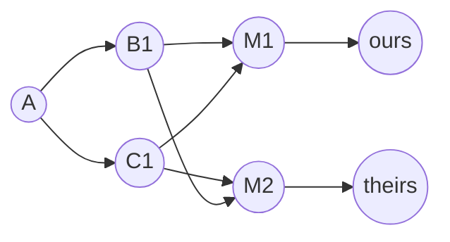
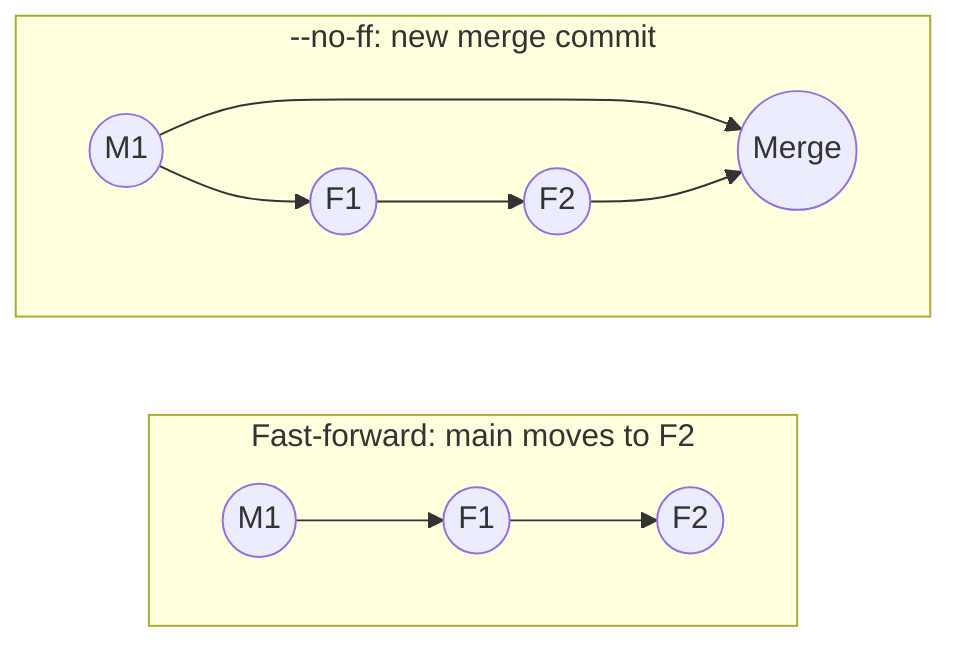
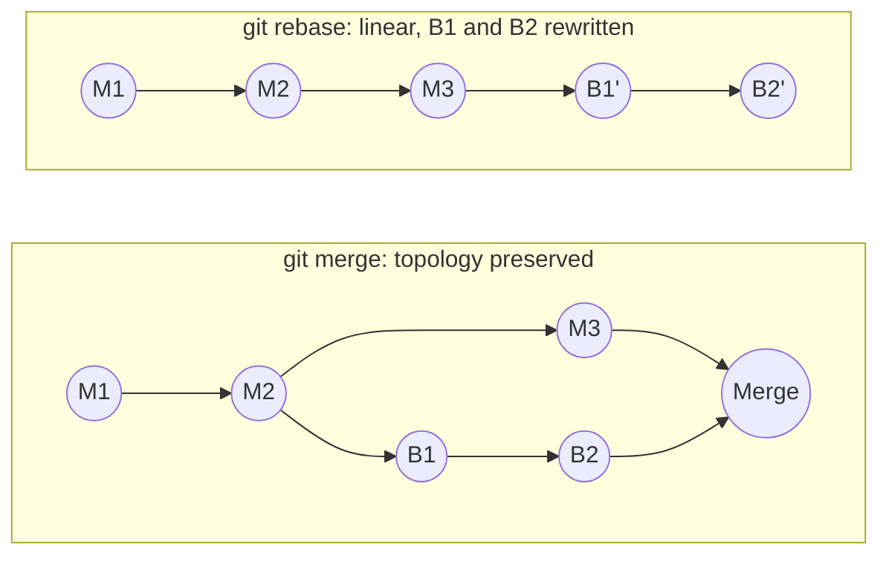
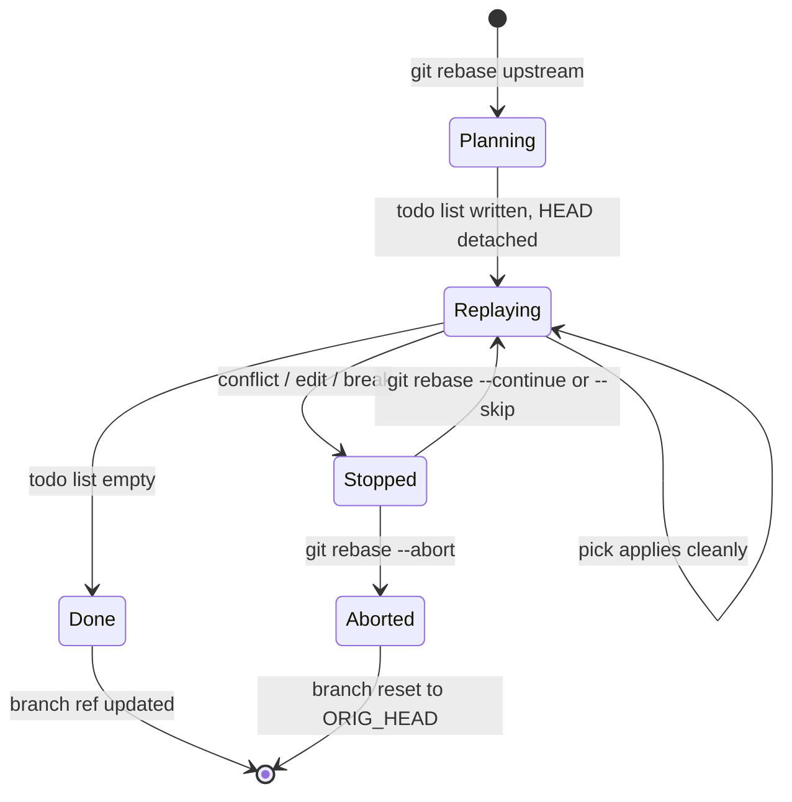
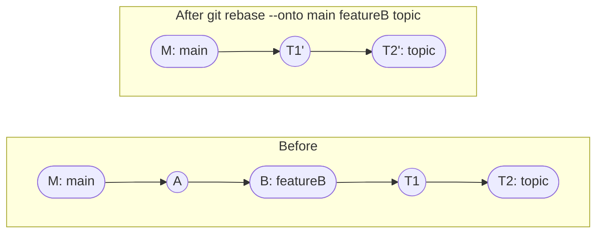
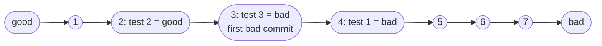
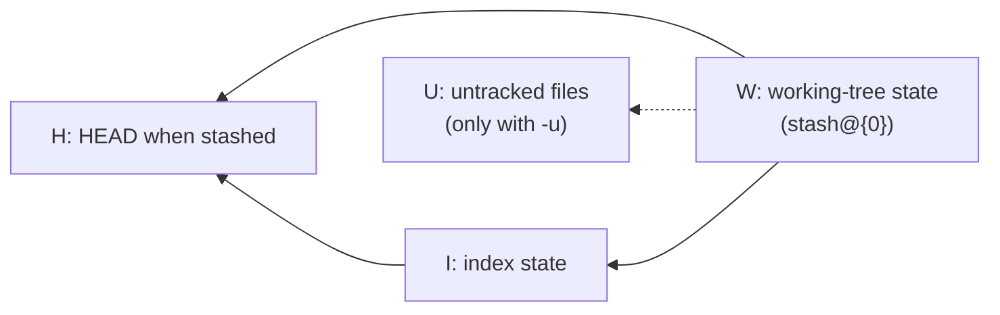

[Git Internals](./) ›

Every command that combines or rewrites history in Git reduces to a few graph and diff algorithms over the [object store](object-model.html): find a **merge base**, run a **three-way merge** of trees, and **replay** commits onto a new parent. This page describes those algorithms and the operations built on them: merge strategies, rebase and the sequencer, the newer `git replay` and `git history` commands, bisect, cherry-pick, stash, reset, revert, and hooks. Command syntax is in the [Git Command Reference](../git-reference.html); resolving conflicts and recovering lost work is covered in [Conflict Resolution & Recovery](conflict-and-recovery.html).

## Merge bases

A **merge base** is a best common ancestor of two commits: a commit reachable from both that is not an ancestor of any other common ancestor. Git computes it by walking the commit graph backwards from both tips in generation-number order (using the commit-graph file when present) and painting commits as reachable from one side, the other, or both.

```bash
git merge-base main feature           # one best common ancestor
git merge-base --all main feature     # every best common ancestor
git merge-base --is-ancestor A B      # exit 0 if A is an ancestor of B
git merge-base --fork-point main      # where the branch forked, using main's reflog
```

In a simple branch there is exactly one merge base. A **criss-cross merge**, where two branches have each merged the other, leaves *two* equally good bases, and neither is an ancestor of the other:



Here both `B1` and `C1` are best common ancestors of `ours` and `theirs`. Picking either one arbitrarily can resurrect changes the other side already reverted. Git's `ort` strategy instead merges the merge bases together first, producing a **virtual merge base**, and uses that as the ancestor for the real merge. This is the "recursive" idea that gave the old strategy its name.

## Three-Way Merge Algorithm

A three-way merge compares two versions of a file (**ours** and **theirs**) against their merge base. The base is what makes automatic merging possible: in a two-way comparison, a line that differs between the branches could have been changed by either side, but against the base Git can tell which side changed it.

For each file, and within each file for each region (hunk), Git applies this rule:

| Base | Ours | Theirs | Result |
|------|------|--------|--------|
| X | X | X | X (unchanged) |
| X | Y | X | Y (only ours changed) |
| X | X | Z | Z (only theirs changed) |
| X | Y | Y | Y (both made the same change) |
| X | Y | Z | **Conflict** |

The whole merge proceeds in two levels:

1. **Tree level.** Git diffs base→ours and base→theirs as trees, pairing entries by path and detecting renames (by default, a deleted and an added file that are at least 50% similar are treated as a rename; tune with `-X find-renames=<n>`). Paths changed on only one side are taken wholesale without reading their contents.
2. **Content level.** For paths changed on both sides, Git runs a line-based three-way merge of the blobs (`xdiff`, using the configured diff algorithm) and applies the table above per hunk.

Conflicts can therefore be **content conflicts** (overlapping hunks) or **structural conflicts** at the tree level: modify/delete, rename/delete, rename/rename to different names, add/add of different content, or directory/file collisions. Both kinds leave the path unmerged in the index; see [Resolving merge conflicts](conflict-and-recovery.html#resolving-merge-conflicts).

Conflicting hunks are written to the working tree with markers. With `merge.conflictStyle=zdiff3` Git also includes the base text, which usually makes the intent of each side obvious:

```
<<<<<<< HEAD
timeout = 30
||||||| merge base
timeout = 10
=======
timeout = 60
>>>>>>> feature
```

### Merging without a working tree

Because `ort` works entirely on in-memory trees, a merge can be computed without touching the index or working tree. `git merge-tree --write-tree` (Git 2.38+) prints the resulting tree ID and any conflicts, and exits 0 for a clean merge or 1 for a conflicted one. Forges use this to test mergeability of pull requests on bare repositories, and it is a cheap way to preview a merge locally:

```bash
git merge-tree --write-tree main feature >/dev/null && echo "merges cleanly"
```

> **Code reference:** a teaching implementation of three-way merge with conflict detection is in [`three_way_merge.py`](../../../code-examples/technology/git/three_way_merge.py).

## Merge strategies

A merge *strategy* decides how the merge base is chosen and how trees are combined. Git picks a strategy automatically; you override it with `-s`.

| Strategy | Use | Notes |
|----------|-----|-------|
| **ort** | Default for two-head merges since Git 2.34 | "Ostensibly Recursive's Twin." Builds a virtual base from multiple merge bases; much faster than its predecessor and better at renames and directory renames. |
| **recursive** | Legacy name | The default until Git 2.33. Since Git 2.50 `-s recursive` is a synonym for `ort`; the old implementation was removed. |
| **resolve** | Simple two-head merge | Uses a single merge base, no virtual base, limited rename handling. Rarely needed. |
| **octopus** | Merging three or more heads | The automatic choice for more than two heads. Refuses any merge that needs manual resolution. |
| **ours** | Recording that a branch is superseded | Creates a merge commit whose tree is exactly the current tree; the other side's changes are discarded. |
| **subtree** | Merging a project into a subdirectory | A modified `ort` that shifts one tree to match the other's directory layout. |

**Strategy options** (`-X`) tune `ort` rather than replacing it:

- `-X ours` / `-X theirs`: resolve *conflicting hunks* in favour of one side; non-conflicting changes from both sides still merge. Not the same as `-s ours`, which ignores the other tree entirely.
- `-X ignore-space-change`, `-X ignore-all-space`, `-X ignore-cr-at-eol`, `-X renormalize`: whitespace and line-ending handling.
- `-X find-renames=<n>`, `-X no-renames`: rename detection sensitivity.
- `-X diff-algorithm=histogram`: use the histogram diff, which often aligns code blocks better than the default Myers diff.
- `-X subtree=<path>`: an explicit subtree prefix.

```bash
git merge feature                 # fast-forward if possible, else a merge commit
git merge --no-ff feature         # always create a merge commit
git merge --ff-only feature       # refuse unless a fast-forward is possible
git merge --squash feature        # stage the combined changes; no merge commit
git merge -s ours obsolete        # mark 'obsolete' merged, keep our tree
git merge b1 b2 b3                # octopus merge
git merge -X theirs feature       # prefer their side on conflicting hunks
```

> **Code reference:** teaching implementations of the recursive, octopus and subtree strategies are in [`merge_strategies.py`](../../../code-examples/technology/git/merge_strategies.py).

### Fast-forward versus merge commit

If the current branch is an ancestor of the branch being merged, there is nothing to combine: Git just moves the branch pointer forward (a **fast-forward**). Otherwise, or with `--no-ff`, it creates a merge commit with two parents.



### Merge versus rebase

Both integrate one branch's work into another. A **merge** preserves the actual topology with a merge commit; a **rebase** rewrites the branch's commits so they appear to have been made on top of the latest base, giving a linear history.



| | Merge | Rebase |
|---|-------|--------|
| History shape | True graph | Linear |
| Existing commit hashes | Preserved | Replaced with new commits |
| Records when integration happened | Yes | No |
| Conflicts resolved | Once, in the merge commit | Per replayed commit (possibly repeatedly) |
| Safe on shared branches | Yes | No; never rebase commits others have based work on |

The rule for rebasing: rewrite only commits that nobody else has built on. Rewriting published history forces every collaborator to recover by hand (see [Undoing a pushed rebase](conflict-and-recovery.html#undoing-a-pushed-rebase-or-force-push)). Team conventions for choosing between the two are covered in [Branching Strategies](../branching.html).

## Rebase and the sequencer

`git rebase` replays a range of commits onto a new base. It is driven by the **sequencer**, the same engine behind multi-commit cherry-pick and revert, which keeps its state in `.git/rebase-merge/` so a rebase can stop and resume.

1. Compute the commits to replay: those reachable from the branch but not from the upstream (`upstream..branch`), skipping any whose patch is already upstream (matched by `git patch-id`).
2. Write a **todo list** and save the original tip as `ORIG_HEAD`.
3. Detach `HEAD` at the new base.
4. For each todo entry, cherry-pick the commit: a three-way merge whose base is the commit's parent, "ours" is the current `HEAD`, and "theirs" is the commit.
5. On conflict, stop; the user resolves and runs `git rebase --continue`.
6. When the list is empty, point the branch at the final commit and reattach `HEAD`.

Each replayed commit has a new parent and therefore a new hash, which is why rebase rewrites history.



### Choosing what to replay: `--onto`

`git rebase --onto <newbase> <upstream> <branch>` replays `upstream..branch` onto `newbase`. It is the tool for transplanting a branch that was started from the wrong place:



`topic` (T1, T2) was started from `featureB`; after the rebase its two commits sit directly on `main`, without A and B. `featureB` itself is unchanged.

### Interactive rebase

`git rebase -i` opens the todo list in an editor before replaying:

| Command | Effect |
|---------|--------|
| `pick` | Replay the commit unchanged |
| `reword` | Replay, then stop to edit the message |
| `edit` | Replay, then stop so the snapshot can be amended |
| `squash` | Fold into the previous commit and combine both messages |
| `fixup` | Fold into the previous commit and keep only the previous message (`fixup -C` keeps this one's message instead) |
| `drop` | Omit the commit |
| `exec` | Run a shell command; a non-zero exit stops the rebase |
| `break` | Stop here; resume with `--continue` |
| `label`, `reset`, `merge` | Recreate merge topology (generated by `--rebase-merges`) |
| `update-ref` | Move another branch to this point (generated by `--update-refs`) |

```bash
git rebase main                        # replay the current branch onto main
git rebase -i main                     # edit the todo list first
git rebase -i --autosquash main        # move fixup!/squash! commits next to their targets
git rebase --rebase-merges main        # keep merge commits (replaced --preserve-merges, removed in 2.34)
git rebase --update-refs main          # also move branches stacked on top (Git 2.38+)
git rebase -x "make test" main         # run tests after every replayed commit
git rebase --continue | --skip | --abort
```

`--update-refs` (or `rebase.updateRefs=true`) matters for **stacked branches**: when `part-2` is built on `part-1`, rebasing `part-2` also moves `part-1` to its rewritten commit, instead of leaving it pointing at the old history. A worked squash/fixup example is in [Interactive rebase and squashing](conflict-and-recovery.html#interactive-rebase-and-squashing).

> **Code reference:** teaching implementations of rebase and bisect are in [`rebase_bisect.py`](../../../code-examples/technology/git/rebase_bisect.py).

## Rewriting without a working tree: `replay` and `history`

Rebase needs a working tree and replays one commit at a time through it. Two newer, still **experimental** commands rewrite history directly in the object store, which makes them fast and usable in bare repositories on servers:

| Command | Purpose |
|---------|---------|
| `git replay` | A plumbing-level rebase for servers and scripts. Replays a revision range with `--onto <newbase>`, `--advance <branch>` (cherry-pick-like), or `--revert <branch>`. Since Git 2.53 it updates all affected refs in one atomic transaction by default; `--ref-action=print` prints `update-ref` commands instead. It stops rather than leaving conflicts to resolve. |
| `git history` | A user-facing command for common edits to a single past commit: `reword <commit>` changes a message, `split <commit>` interactively splits a commit in two, and `fixup <commit>` (Git 2.55) folds staged changes into it. By default it also moves every descendant branch. It refuses histories containing merges and operations that would conflict, and does not run hooks. |

```bash
git replay --onto main topic~3..topic           # rebase topic's last 3 commits onto main
git history reword HEAD~4                       # edit an old commit message
git history split HEAD~2                        # split a commit into two
```

Both commands are marked experimental in their documentation, so their options may still change.

## Bisect: binary search over history

`git bisect` finds the commit that introduced a change (usually a regression) by binary search. Given one *bad* and at least one *good* commit, the candidate set is every commit reachable from bad but not from any good commit. Git checks out the candidate that splits that set most evenly, weighted by reachability so that either answer eliminates about half the remaining commits. Finding the culprit among N candidates takes about $\lceil \log_2 N \rceil$ tests: 1,000 commits need about 10 steps.



```bash
git bisect start
git bisect bad                    # current HEAD is broken
git bisect good v2.4.0            # this release was fine
# Git checks out a midpoint; test it and report:
git bisect good | bad | skip
git bisect run ./test.sh          # automate the whole search
git bisect log > bisect.log       # save the session; git bisect replay bisect.log redoes it
git bisect reset                  # return to the original branch
```

Details worth knowing:

- **`git bisect run` exit codes:** 0 means good, 125 means skip (untestable), 1 to 127 other than 125 mean bad, and anything else aborts the bisect. A script that fails to *build* should exit 125, not 1.
- **Terms:** when hunting for a change that is not a bug (such as a performance improvement), `git bisect start --term-old=slow --term-new=fast`, or use the built-in `old`/`new` terms, avoids mental inversion.
- **`--first-parent`:** `git bisect start --first-parent` follows only the first parent of merges, so the search identifies which merged pull request introduced the change rather than descending into its commits.
- **Paths:** `git bisect start bad good -- src/net/` restricts candidates to commits touching those paths.

## Cherry-pick

Cherry-pick applies the change introduced by existing commits onto the current branch as new commits. Internally it is a three-way merge with the picked commit's parent as base, the current `HEAD` as ours, and the picked commit as theirs, the same step rebase repeats for every commit. Typical uses are backporting a fix to a release branch and salvaging one commit from an abandoned branch.

```bash
git cherry-pick <sha>              # apply one commit
git cherry-pick A..B               # commits after A up to B (A excluded)
git cherry-pick A^..B              # A through B inclusive
git cherry-pick -x <sha>           # add "(cherry picked from commit …)" to the message
git cherry-pick -n <sha>           # apply to index and working tree only
git cherry-pick -m 1 <merge-sha>   # pick a merge, diffing against parent 1
git cherry-pick --continue | --skip | --abort
```

Because each pick is a new commit, picking the same change onto two branches and later merging them yields two commits with the same patch. The merge is usually clean, and `-x` records the relationship for anyone reading the history later. When rebasing, such duplicates are dropped automatically because their `patch-id` matches.

## Stash

A stash entry is an ordinary commit stored under `refs/stash`, with the stack of entries kept in that ref's reflog. Each entry is a merge-shaped commit:



`W`'s first parent is the commit you were on, its second parent `I` records the staged changes, and an optional third parent records untracked files. This structure is why a dropped stash can be recovered with `git fsck` (see [Recovering a dropped stash](conflict-and-recovery.html#fsck-finding-commits-the-reflog-forgot)).

```bash
git stash push -m "wip: parser"        # stash tracked changes with a label
git stash push -u                      # include untracked files
git stash push -p                      # choose hunks interactively
git stash push -- path/to/file         # stash only some paths
git stash list
git stash show -p stash@{1}            # view an entry as a patch
git stash apply stash@{1}              # restore, keep the entry
git stash pop                          # restore and drop the top entry
git stash branch fix-parser stash@{0}  # new branch at the stash's base, then apply
git stash export --to-ref refs/stashes/backup   # turn the stash stack into pushable commits
git stash import refs/stashes/backup            # restore an exported stack
```

`git stash branch` is the reliable path when a stash no longer applies cleanly: it recreates the original base commit, applies the stash there, and drops it only on success. `export` and `import` (added in Git 2.51) convert the stash stack into a normal commit chain that can be pushed and fetched, so stashes can move between machines. For anything long-lived, a WIP commit on a branch is still easier to find than a stash.

## Reset, restore, and switch

`git reset` moves the current branch to another commit and, depending on mode, overwrites the index and working tree. The modes are a ladder of how much they touch:

| Mode | Moves branch | Resets index | Resets working tree | Typical use |
|------|:---:|:---:|:---:|-------------|
| `--soft` | Yes | No | No | Squash the last *n* commits: changes stay staged for a new commit |
| `--mixed` (default) | Yes | Yes | No | Unstage everything but keep edits |
| `--keep` | Yes | Yes | Only files that differ between the commits | Move the branch but abort rather than lose local edits |
| `--hard` | Yes | Yes | Yes | Discard all local changes; **uncommitted work is lost** |

```bash
git reset --soft HEAD~3        # collapse the last three commits into staged changes
git reset                      # unstage everything
git reset --hard origin/main   # match the remote exactly
```

Commits "lost" to a reset remain reachable through the reflog; see [Reflog: recovering lost commits](conflict-and-recovery.html#reflog-recovering-lost-commits). Uncommitted changes discarded by `--hard` are not recoverable unless they were once staged, in which case `git fsck --lost-found` may find their blobs.

Two commands introduced in Git 2.23 split `git checkout`'s overloaded roles and are the clearer choice for everyday work:

| Task | `checkout` form | Newer form |
|------|-----------------|------------|
| Switch branches | `git checkout topic` | `git switch topic` |
| Create and switch | `git checkout -b topic` | `git switch -c topic` |
| Discard working-tree edits to a file | `git checkout -- file` | `git restore file` |
| Unstage a file | `git reset file` | `git restore --staged file` |
| Restore a file from another commit | `git checkout abc123 -- file` | `git restore --source=abc123 file` |

## Revert

`git revert` creates a new commit that applies the inverse of an existing one. It does not rewrite history, so it is the correct way to undo a change on a shared branch.

```bash
git revert <sha>                  # new commit undoing <sha>
git revert -n A..B                # stage the inverse of a range, commit once
git revert -m 1 <merge-sha>       # undo a merge relative to its first parent
```

Reverting a merge needs `-m` to name the mainline parent. The revert undoes the merge's *content*, but the merged commits remain in history as ancestors, so a later attempt to merge the same branch again brings in only changes made after the original merge. To reintroduce the whole branch, revert the revert first.

## Inspecting history

These commands are read-only and always safe.

```bash
git log --oneline --graph --all          # topology of every branch
git log --follow -- path                 # one file's history across renames
git log -S 'retryCount'                  # commits that add or remove the string ("pickaxe")
git log -G 'retry[A-Z][a-z]+'            # commits whose diff matches a regex
git log -L :parse_header:src/http.c      # history of one function
git log main..feature                    # commits on feature not yet on main
git log main...feature --left-right      # commits unique to each side

git diff --staged                        # index vs HEAD
git range-diff main old-feature feature  # compare two versions of a rebased branch

git blame -L 40,60 path                  # line authorship for a range
git blame --ignore-revs-file .git-blame-ignore-revs path   # skip bulk reformatting commits
```

`git range-diff` is the standard way to review what changed between two iterations of a rebased branch, since ordinary diffs between rewritten branches are dominated by upstream changes. An `.git-blame-ignore-revs` file listing mass-reformatting commits (set `blame.ignoreRevsFile` to use it by default; GitHub's blame view honours it too) keeps `blame` pointing at meaningful changes.

## Hooks

Hooks are programs Git runs at defined points in its workflow. A non-zero exit from a `pre-*` hook (and a few others such as `commit-msg`) aborts the operation, which makes hooks useful as guardrails. They are not copied by `clone`, so teams distribute them through a framework (pre-commit, Husky, Lefthook), a tracked directory selected with `core.hooksPath`, or configuration.

**Client-side hooks**

| Hook | Runs | Common use |
|------|------|------------|
| `pre-commit` | Before the commit message is requested | Lint and format staged files, run fast tests, scan for secrets |
| `prepare-commit-msg` | Before the editor opens | Pre-fill a template or ticket number |
| `commit-msg` | After the message is written | Enforce a message format such as Conventional Commits |
| `post-commit` | After the commit is created | Notifications |
| `pre-rebase` | Before a rebase starts | Refuse to rebase protected branches |
| `post-checkout`, `post-merge` | After checkout/switch and merge | Reinstall dependencies, regenerate files |
| `post-rewrite` | After `commit --amend` and rebase | Update external references to old hashes |
| `pre-push` | Before objects are sent | Run the full test suite |

**Server-side hooks** run on the receiving repository during a push and cannot be bypassed by the client:

| Hook | Runs | Common use |
|------|------|------------|
| `pre-receive` | Once per push, before any ref is updated | Policy checks on the whole push; reject all refs or none |
| `update` | Once per ref being updated | Per-branch permission checks |
| `post-receive` | After all refs are updated | Trigger CI, deployments, notifications |
| `reference-transaction` | At each stage of every ref transaction | Auditing and replication of ref changes |

Hosted forges do not let you install arbitrary server hooks; they provide the same guarantees through branch protection rules, required status checks, push rulesets and secret-scanning push protection.

### Config-based hooks

Since Git 2.54 hooks can also be declared in configuration, which allows several commands per event and central management through system or global config. Git 2.55 added optional parallel execution.

```ini
[hook "linter"]
    event = pre-commit
    event = pre-push
    command = ~/bin/linter --staged

[hook "msgcheck"]
    event = commit-msg
    command = ~/bin/check-message
```

```bash
git hook list pre-commit          # hooks configured for an event, including .git/hooks
git hook run pre-commit           # run them by hand
```

Each hook can be disabled with `hook.<name>.enabled=false`, and `hook.<name>.parallel=true` together with `hook.jobs` lets independent hooks run concurrently.

### Example `pre-commit` hook

```sh
#!/bin/sh
# .git/hooks/pre-commit: reject commits that fail lint or add debug output
set -e

npm run --silent lint || { echo "Lint failed; commit aborted." >&2; exit 1; }

if git diff --cached -U0 | grep -E '^\+.*console\.(log|debug)\(' >/dev/null; then
    echo "Remove console.log/debug calls before committing." >&2
    exit 1
fi
```

The check examines only added lines of the staged diff (`^\+`), so existing debug statements elsewhere in a file do not block unrelated commits. Any hook can be bypassed locally with `git commit --no-verify`, so treat client-side hooks as convenience and enforce policy on the server or in CI.

## See also

- [Object Model & Storage](object-model.html): the commit graph and object store these algorithms operate on
- [Conflict Resolution & Recovery](conflict-and-recovery.html): resolving conflicts and recovering lost commits
- [Protocols, Packs & Performance](protocols-and-performance.html): the commit-graph file, pack formats, and maintenance
- [Branching Strategies](../branching.html): GitHub Flow, GitLab Flow, Git Flow and trunk-based development
- [Git Command Reference](../git-reference.html): full syntax for merge, rebase, stash, reset and the rest

**Previous:** [Protocols, Packs & Performance](protocols-and-performance.html) · **Next:** [Conflict Resolution & Recovery](conflict-and-recovery.html)
