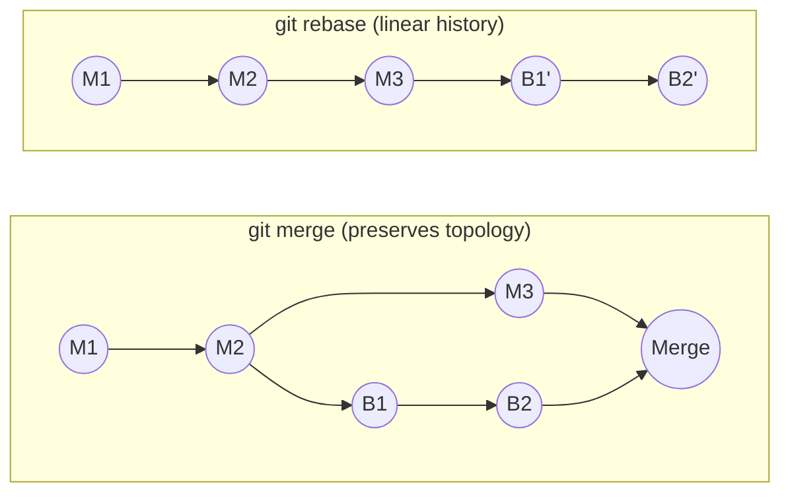

[Git Internals](./) ›

<div class="hero-section" style="background: linear-gradient(135deg, #4facfe 0%, #00f2fe 100%); color: white; padding: 3rem 2rem; margin: -2rem -3rem 2rem -3rem; text-align: center;">
  <h1 style="color: white; margin: 0; font-size: 2.5rem;">Algorithms &amp; Advanced Operations</h1>
  <p style="font-size: 1.25rem; margin-top: 1rem; opacity: 0.9;">The three-way merge, merge strategies, rebase and bisect, and the day-to-day operations built on them — with guidance on when to reach for each</p>
</div>

This page covers the *algorithms* at the heart of Git's history manipulation and the operations layered on top of them. For everyday command syntax see the [Git Command Reference](../git-reference.html); for higher-level workflow models see [Branching Strategies](../branching.html); and for resolving conflicts and recovering lost work see [Conflicts &amp; Recovery](conflict-and-recovery.html).

## Three-Way Merge Algorithm

Git's three-way merge combines changes from two branches using their common ancestor as a reference point. The third "way" — the ancestor — is what lets Git tell *who changed what* and so resolve non-conflicting changes automatically. A naive two-way diff cannot: if a line differs between the two branches, a two-way merge has no way to know which side changed it.

**Algorithm steps:**

1. Find the common ancestor (the **merge base**) of the two tips.
2. Compute two diffs: base→ours and base→theirs.
3. For each region, apply the change automatically when only one side touched it (or both made the *same* change).
4. Mark regions where both sides changed the same lines differently as a **conflict** for manual resolution.

**The three outcomes for any region:**

- **No conflict** — the two sides changed different files, or different parts of the same file. Both changes are kept.
- **Auto-resolved** — both sides made the *identical* change. Git keeps one copy.
- **Conflict** — both sides changed the same lines differently. Git writes conflict markers and stops.

**Conflict markers** delimit the two competing versions so you can pick or combine them:

```
<<<<<<< ours
Our changes
=======
Their changes
>>>>>>> theirs
```

The marked region between `<<<<<<<` and `=======` is your side; between `=======` and `>>>>>>>` is theirs. With `merge.conflictStyle = diff3` (or `zdiff3`) Git also inserts the merge-base text in a `|||||||` section, which usually makes the *intent* of each side obvious.

> **Code Reference**: For a complete three-way merge implementation with conflict detection and advanced merge strategies, see [`three_way_merge.py`](../../../code-examples/technology/git/three_way_merge.py).

## Merge Strategies

A merge *strategy* decides how Git computes the merge base(s) and combines trees. The strategy matters most when history has more than one merge base or when files were renamed or moved.

| Strategy | Use it for | Notes |
|----------|-----------|-------|
| **ort** | The default since Git 2.34 | "Ostensibly Recursive's Twin." Handles multiple merge bases by recursively merging them into a virtual base; faster than the old `recursive` and far better at renames and directory moves. |
| **recursive** | Legacy default (pre-2.34) | Same multiple-base handling as `ort` but slower; superseded by `ort`. |
| **resolve** | A simple, fast two-head merge | Picks a single merge base; no recursion. Rarely needed today. |
| **octopus** | Merging *more than two* branches at once | Used automatically for ≥3 heads; refuses to merge if any branch conflicts. Good for integration branches, not for resolving conflicts. |
| **ours** | Recording that a branch is superseded | Produces a merge commit but keeps the current tree verbatim, discarding the other branch's content. Do not confuse with the `-X ours` *option* below. |
| **subtree** | Merging a project into a subdirectory | A `recursive`/`ort` variant that adjusts for a shifted directory prefix. |

**Strategy options** (`-X`) tune a strategy rather than replacing it:

- `-X ours` / `-X theirs` — auto-resolve *conflicting hunks* in favor of one side (the rest still merges normally). This is different from the `ours` strategy, which ignores the other tree entirely.
- `-X ignore-all-space`, `-X renormalize`, `-X find-renames=<n>` — control whitespace, line-ending normalization, and rename detection sensitivity.

```bash
git merge <branch>               # fast-forward if possible, else a real merge
git merge --no-ff <branch>       # always create a merge commit (preserve the branch)
git merge --squash <branch>      # combine the branch into staged changes, no commit yet
git merge -s ort <branch>        # explicit default strategy
git merge -s ours <branch>       # keep current tree, mark branch as merged
git merge -s octopus b1 b2 b3    # merge several branches at once
git merge -X theirs <branch>     # prefer their side on conflicting hunks
```

> **Code Reference**: For complete merge-strategy implementations including recursive, octopus, and subtree strategies, see [`merge_strategies.py`](../../../code-examples/technology/git/merge_strategies.py).

### Merge vs. Rebase

Both `merge` and `rebase` integrate work from one branch into another, but they produce different histories. A **merge** preserves the true topology by creating a merge commit with two parents; a **rebase** rewrites your commits so they appear to have been built on top of the latest base, yielding a linear history. The diagrams below show a feature branch `B1 → B2` integrated into `main` (`M1 → M2 → M3`).



| | Merge | Rebase |
|---|-------|--------|
| History | Non-linear; true graph | Linear, easier to read |
| Commit hashes | Preserved | Rewritten (new commits) |
| Traceability | Records when integration happened | Loses the original branch point |
| Safe on shared branches? | Yes | No — never rebase commits others have pulled |

**Golden rule of rebasing**: rebase only commits that exist solely in your local repository. Rewriting published history forces every collaborator to recover manually (see [Conflicts &amp; Recovery](conflict-and-recovery.html) for how they would).

## Rebase Algorithm

Rebase rewrites history by **replaying** a sequence of commits onto a new base. Conceptually it cherry-picks each commit in turn:

1. Determine the commits to replay — those reachable from `HEAD` but not from the new base.
2. Save the original `HEAD` (recoverable later via `ORIG_HEAD` and the reflog).
3. Reset onto the target base.
4. Cherry-pick each saved commit in order, according to the todo list.
5. Pause for resolution whenever a replay conflicts; resume with `git rebase --continue`.
6. Move the branch reference to the last replayed commit when the list is exhausted.

Because each replayed commit is a *new* object (new parent → new hash), rebase is a history-rewriting operation, which is why the golden rule above applies.

### Interactive Rebase

`git rebase -i` opens a **todo list** of the commits to replay and lets you edit how each is applied:

- **pick** — use the commit as-is.
- **reword** — keep the changes, edit the message.
- **edit** — stop after applying so you can amend the snapshot.
- **squash** — combine into the previous commit, keeping both messages.
- **fixup** — like `squash` but discard this commit's message.
- **drop** — remove the commit entirely.
- **exec** — run a shell command (e.g. tests) at that point in the replay.
- **label** / **reset** / **merge** — scripting primitives that `--rebase-merges` uses to reconstruct merge topology.

```bash
git rebase <base-branch>          # replay current branch onto base-branch
git rebase -i <base-commit>       # interactive: reorder, squash, drop, reword
git rebase --rebase-merges <base> # preserve merge commits (replaces --preserve-merges)
git rebase -i --autosquash        # auto-order fixup!/squash! commits before the rebase
git rebase -s ort -X theirs <base># choose strategy/option for conflict resolution
git rebase --continue             # resume after resolving a conflict
git rebase --abort                # bail out and restore the original HEAD
```

> **Code Reference**: For complete rebase and bisect implementations with conflict handling, see [`rebase_bisect.py`](../../../code-examples/technology/git/rebase_bisect.py).

## Bisect: Binary Search Over History

`git bisect` finds the commit that introduced a regression by binary-searching the commit graph. Given a known-good and known-bad commit, it repeatedly checks out a commit roughly halfway between them, you (or a script) test it, and the search space halves each step — so it takes about **log₂(N)** tests to pin down the culprit among N suspect commits.

**Algorithm:**

1. Mark a known-good and a known-bad commit.
2. Of the commits reachable from *bad* but not from *good*, pick the one that best bisects the graph (weighted by reachability so each test eliminates as much as possible).
3. Check it out; you test and mark it `good` or `bad`.
4. Repeat on the remaining half.
5. Stop when only one candidate remains — the first bad commit.

It handles non-linear history by considering all paths between the endpoints, and lets you `skip` commits that cannot be built or tested.

```bash
git bisect start
git bisect bad <bad-commit>       # often just: git bisect bad   (current HEAD)
git bisect good <good-commit>
# Git checks out a midpoint; test it, then:
git bisect good                   # this commit is fine
git bisect bad                    # this commit is broken
git bisect skip                   # cannot test this commit
git bisect run ./test.sh          # automate: script exits 0=good, non-zero=bad
git bisect reset                  # return to the original branch when done
```

`git bisect run` is the payoff: hand it a test script and Git drives the entire search unattended, leaving you at the first bad commit.

## Cherry-Pick

Cherry-pick applies the *change introduced by* one or more commits onto the current branch, creating new commits. It is the same replay machinery rebase uses, exposed directly — useful for backporting a fix to a release branch or grabbing one commit from another branch without merging the rest.

```bash
git cherry-pick <sha>             # apply one commit's change as a new commit
git cherry-pick <sha1>..<sha2>    # apply a range (exclusive of sha1)
git cherry-pick -n <sha>          # apply but do not commit (stage only)
git cherry-pick -x <sha>          # append "(cherry picked from …)" to the message
git cherry-pick --continue        # resume after resolving a conflict
git cherry-pick --abort           # undo the in-progress cherry-pick
```

Because each pick is a new commit with a new hash, cherry-picking the *same* change onto two branches and later merging them can produce duplicate-looking commits; `-x` leaves a breadcrumb so the relationship is traceable.

## Workflow Models

The state-machine view of Git workflows — GitFlow, GitHub Flow, GitLab Flow, and trunk-based/monorepo patterns, with their branch structures and promotion rules — is documented in depth on its own page.

<div class="tip-card">
  <h4>Workflows live on the Branching page</h4>
  <p>See <a href="../branching.html">Branching Strategies</a> for GitFlow, GitHub Flow, GitLab Flow, and trunk-based development, including when to choose each and how they map branches to environments.</p>
</div>

## Practical Operations

The commands below build directly on the algorithms above. Each entry notes *when* to reach for it. For the exhaustive flag-by-flag listing, see the [Git Command Reference](../git-reference.html).

### Stash: Park Work Without Committing

Stash saves your uncommitted changes (and optionally untracked files) and reverts the working tree to a clean state, so you can switch contexts and come back later.

**When to use:** you need to switch branches, pull, or run a quick experiment but your current work is not ready to commit. Prefer a throwaway WIP commit over stash if you might forget the stash exists or need it on a shared machine — stashes are easy to lose.

```bash
git stash push -m "wip: refactor parser"   # stash with a label
git stash push -p                          # interactively choose hunks to stash
git stash push -- <pathspec>               # stash only specific files
git stash list                             # see the stash stack
git stash show -p stash@{0}                # view a stash as a diff
git stash apply stash@{0}                  # restore changes, keep the stash
git stash pop                              # restore and drop the top stash
git stash branch <name> stash@{0}          # start a branch from a stash
git stash drop stash@{0}                   # delete one stash
git stash clear                            # delete all stashes
```

`git stash branch` is the safe escape hatch when a stash no longer applies cleanly to the current tree: it recreates the original base, applies the stash there, and drops it only on success.

### Reset: Move HEAD (and Maybe the Index/Tree)

Reset moves the current branch to point at another commit and, depending on the mode, also rewrites the index and working tree. The three modes form a ladder of how much they touch:

| Mode | Moves HEAD | Resets index | Resets working tree | Use when |
|------|:----------:|:------------:|:-------------------:|----------|
| `--soft`  | ✅ | ❌ | ❌ | Re-commit the same changes differently (e.g. squash the last *n* commits into one — the changes stay staged). |
| `--mixed` *(default)* | ✅ | ✅ | ❌ | Unstage everything but keep your edits (undo a premature `git add`). |
| `--hard`  | ✅ | ✅ | ✅ | Throw away local changes entirely and match a commit exactly. **Destructive** — uncommitted work is lost. |

```bash
git reset --soft  HEAD~3   # collapse last 3 commits, keep their changes staged
git reset --mixed HEAD     # unstage everything, keep edits in the working tree
git reset --hard  origin/main   # discard local commits and edits; match the remote
```

**Caution:** `--hard` discards uncommitted work without confirmation. If you reset away *committed* work by mistake, it is recoverable via the reflog — see [Conflicts &amp; Recovery](conflict-and-recovery.html).

### Revert: Undo Safely on Shared History

Revert creates a *new* commit that applies the inverse of a target commit. Unlike reset and rebase, it does not rewrite history, so it is the correct tool on branches others have already pulled.

**When to use:** you need to back out a change that is already pushed/shared. Reach for reset/rebase only on private, unpublished history.

```bash
git revert <commit>            # create a commit that undoes <commit>
git revert -n <commit>         # stage the inverse without committing (batch several)
git revert -m 1 <merge-commit> # revert a merge, keeping parent #1's line of history
```

Reverting a merge needs `-m` to tell Git which parent to treat as "mainline." Note that reverting a merge does not un-merge the branch — to bring it in again later you may need to revert the revert.

### History &amp; Inspection

Read-only commands for understanding what happened. None of these change history, so they are always safe to run.

```bash
git log --oneline --graph --all     # compact topology of every branch
git log --follow <file>             # history of a file across renames
git log -p                          # show the patch for each commit
git log --since="2 weeks ago" --author="pattern"

git diff                            # working tree vs. index
git diff --staged                   # index vs. last commit
git diff HEAD~2 HEAD                # between two commits
git diff branch1..branch2           # between two branches

git blame <file>                    # who last changed each line
git blame -L 10,20 <file>           # restrict to a line range
```

## Git Hooks

Hooks are executable scripts in `.git/hooks/` (or a shared `core.hooksPath` directory) that Git runs at defined points in its lifecycle. A non-zero exit from a *pre-* hook aborts the operation, which is what makes them useful as guardrails. Client-side hooks are **not** copied on clone, so teams distribute them via a tool (pre-commit, Husky, Lefthook) or a tracked hooks directory.

**Client-side hooks** fire on local actions:

- `pre-commit` — validate the snapshot (lint, run fast tests) before a commit is created.
- `prepare-commit-msg` / `commit-msg` — pre-fill or validate the commit message (e.g. enforce a format).
- `post-commit` — notify or trigger follow-up work after a commit.
- `pre-rebase` — guard against rebasing branches that should not be rewritten.
- `post-rewrite` — react after `commit --amend` or `rebase` rewrites commits.
- `pre-push` — final gate before history leaves the machine (run the full test suite).

**Server-side hooks** fire on the receiving end of a push and are the enforcement point you cannot bypass locally:

- `pre-receive` — validate the entire push atomically; reject all refs or none.
- `update` — validate each ref update individually.
- `post-receive` — trigger deployment, CI, or notifications after a successful push.
- `post-update` — legacy notification hook (largely superseded by `post-receive`).

**Example `pre-commit` hook** rejecting a commit that fails linting or leaves debug output behind:

```bash
#!/bin/sh
# .git/hooks/pre-commit

# Run linting
if ! npm run lint; then
    echo "Linting failed. Please fix errors before committing."
    exit 1
fi

# Block stray debugging statements
if git diff --cached | grep -E "console\.(log|debug)" > /dev/null; then
    echo "Remove console statements before committing."
    exit 1
fi

exit 0
```

## See Also

- [Object Model &amp; Storage](object-model.html) — the commit graph and object store these algorithms operate on.
- [Conflicts &amp; Recovery](conflict-and-recovery.html) — resolving merge/rebase conflicts and recovering lost commits with the reflog and `fsck`.
- [Protocols, Packs &amp; Performance](protocols-and-performance.html) — the wire protocol, pack/index formats, and performance tuning.
- [Branching Strategies](../branching.html) — GitFlow, GitHub Flow, GitLab Flow, and trunk-based development.
- [Git Command Reference](../git-reference.html) — full syntax for merge, rebase, stash, reset, and the rest.

---

<div class="nav-card-grid" style="display: grid; grid-template-columns: repeat(auto-fit, minmax(260px, 1fr)); gap: 1.5rem; margin: 1.5rem 0;">
  <a class="nav-card" href="protocols-and-performance.html" style="display: block; padding: 1.25rem 1.5rem; border: 1px solid #ddd; border-radius: 8px; text-decoration: none;">
    <h4 style="margin: 0 0 0.5rem;">← Protocols, Packs &amp; Performance</h4>
    <p style="margin: 0;">The wire protocol, pack/index formats, and performance tuning.</p>
  </a>
  <a class="nav-card" href="conflict-and-recovery.html" style="display: block; padding: 1.25rem 1.5rem; border: 1px solid #ddd; border-radius: 8px; text-decoration: none;">
    <h4 style="margin: 0 0 0.5rem;">Conflicts &amp; Recovery →</h4>
    <p style="margin: 0;">Resolving conflicts and rescuing lost work with reflog and fsck.</p>
  </a>
</div>
