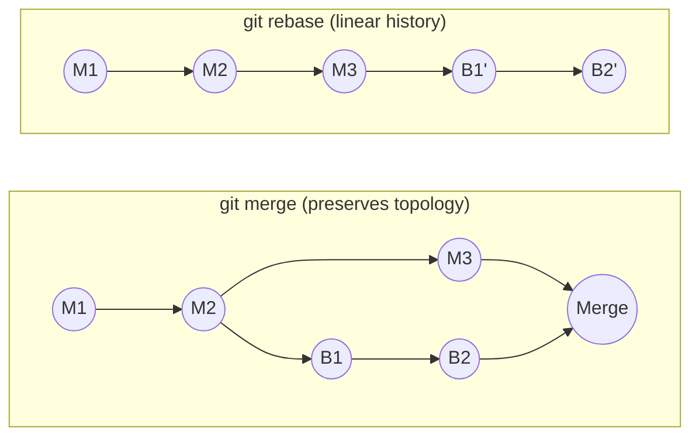

[Git Internals](./) ›

<div class="hero-section" style="background: linear-gradient(135deg, #4facfe 0%, #00f2fe 100%); color: white; padding: 3rem 2rem; margin: -2rem -3rem 2rem -3rem; text-align: center;">
  <h1 style="color: white; margin: 0; font-size: 2.5rem;">Algorithms &amp; Advanced Operations</h1>
  <p style="font-size: 1.25rem; margin-top: 1rem; opacity: 0.9;">Three-way merge, merge strategies, rebase and bisect, and the advanced day-to-day operations built on them</p>
</div>

## Three-Way Merge Algorithm

Git's three-way merge algorithm combines changes from two branches using their common ancestor as a reference point. This enables automatic resolution of non-conflicting changes.

**Algorithm Steps:**
1. Find common ancestor (merge base)
2. Compute diffs: base→ours and base→theirs
3. Apply non-conflicting changes automatically
4. Mark conflicting changes for manual resolution

**Merge Cases:**
- **No conflict**: Changes in different files or parts
- **Auto-merge**: Same changes in both branches
- **Conflict**: Different changes to same lines

**Example merge conflict markers:**
```
<<<<<<< ours
Our changes
=======
Their changes
>>>>>>> theirs
```

> **Code Reference**: For complete three-way merge implementation with conflict detection and advanced merge strategies, see [`three_way_merge.py`](../../../code-examples/technology/git/three_way_merge.py)

## Merge Strategies

Git implements sophisticated merge algorithms to combine divergent development branches:

**Merge Strategies:**
- **ort (default since 2.34; recursive was the previous default)**: Handles multiple merge bases by recursively merging them; the `ort` ("ostensibly recursive's twin") implementation is faster and handles renames and directory moves better
- **Octopus**: Merges multiple branches simultaneously (for integration branches)
- **Ours**: Keeps current branch content, ignoring other branches
- **Subtree**: Adjusts for directory structure differences
- **Resolve**: Older two-head merge strategy

**Three-Way Merge Process:**
1. Find common ancestor(s) of branches
2. For multiple bases, recursively merge them to create virtual base
3. Compare base, ours, and theirs for each file
4. Auto-merge non-conflicting changes
5. Mark conflicts for manual resolution

**Conflict Detection:**
- Concurrent modifications to same file regions
- File vs directory conflicts
- Add/add conflicts (different files at same path)
- Rename detection and handling

> **Code Reference**: For complete merge strategy implementations including recursive, octopus, and subtree strategies, see [`merge_strategies.py`](../../../code-examples/technology/git/merge_strategies.py)

### Merge Operations

```bash
# Fast-forward merge (default when possible)
git merge <branch>

# No fast-forward (preserve branch history)
git merge --no-ff <branch>

# Squash merge (single commit)
git merge --squash <branch>

# Merge strategies
git merge -s ort <branch>        # Default since Git 2.34
git merge -s ours <branch>       # Keep current content
git merge -s octopus b1 b2 b3    # Multiple branches
```

### Merge vs Rebase

Both `merge` and `rebase` integrate work from one branch into another, but they produce different histories. A **merge** preserves the true topology by creating a merge commit with two parents; a **rebase** rewrites your commits so they appear to have been built on top of the latest base, yielding a linear history. The diagrams below show a feature branch `B1 → B2` integrated into `main` (`M1 → M2 → M3`).



| | Merge | Rebase |
|---|-------|--------|
| History | Non-linear; true graph | Linear, easier to read |
| Commit hashes | Preserved | Rewritten (new commits) |
| Traceability | Records when integration happened | Loses the original branch point |
| Safe on shared branches? | Yes | No — never rebase commits others have pulled |

**Golden rule of rebasing**: rebase only commits that exist solely in your local repository. Rewriting published history forces every collaborator to recover manually.

## Rebase and Bisect Algorithms

### Interactive Rebase

Rebase rewrites commit history by replaying commits onto a new base:

**Rebase Commands:**
- **pick**: Use commit as-is
- **reword**: Edit commit message
- **edit**: Stop for amending
- **squash**: Combine with previous commit
- **fixup**: Like squash but discard message
- **exec**: Run shell command
- **drop**: Remove commit
- **label/reset**: Advanced scripting commands
- **merge**: Create merge commit during rebase

**Rebase Process:**
1. Save original HEAD position
2. Checkout onto target
3. Cherry-pick each commit according to todo list
4. Handle conflicts by pausing for resolution
5. Update branch reference when complete

```bash
# Basic rebase
git rebase <base-branch>

# Interactive rebase
git rebase -i <base-commit>
# Commands: pick, reword, edit, squash, fixup, drop

# Preserve merge commits (--preserve-merges is deprecated)
git rebase --rebase-merges <base>

# Autosquash fixup commits
git rebase -i --autosquash

# Rebase with strategy
git rebase -s ort -X theirs <base>
```

### Binary Search (Bisect)

Efficiently find the commit that introduced a bug:

**Bisect Algorithm:**
1. Mark known good and bad commits
2. Find commits between good and bad
3. Select optimal commit that best bisects the graph
4. Test and mark as good/bad
5. Repeat until first bad commit is found

**Optimization:**
- Weight commits by reachability to minimize search steps
- Skip untestable commits
- Handle non-linear history with merge commits

```bash
# Find regression
git bisect start
git bisect bad <bad-commit>
git bisect good <good-commit>

# Mark commits
git bisect good/bad
git bisect skip                 # Untestable

# Automated bisect
git bisect run <script>

# Finish
git bisect reset
```

> **Code Reference**: For complete rebase and bisect implementations with conflict handling, see [`rebase_bisect.py`](../../../code-examples/technology/git/rebase_bisect.py)

### Cherry-Pick

```bash
# Apply specific commits
git cherry-pick <sha>
git cherry-pick <sha1>..<sha2>  # Range
git cherry-pick -n <sha>        # No commit
git cherry-pick -x <sha>        # Add source reference
```

## Workflow Models

The state-machine view of Git workflows — GitFlow, GitHub Flow, GitLab Flow, and trunk-based/monorepo patterns, with their branch structures and promotion rules — is documented in depth on its own page.

<div class="tip-card">
  <h4>Workflows live on the Branching page</h4>
  <p>See <a href="../branching.html">Branching Strategies</a> for GitFlow, GitHub Flow, GitLab Flow, and trunk-based development, including when to choose each and how they map branches to environments.</p>
</div>

## Advanced Operations

### Stash Management

```bash
# Stash operations
git stash push -m "description"
git stash push -p               # Interactive
git stash push -- <pathspec>   # Specific files

# Apply stash
git stash apply stash@{n}
git stash pop                   # Apply and drop
git stash branch <branch> stash@{n}

# Manage stashes
git stash list
git stash show -p stash@{n}
git stash drop stash@{n}
git stash clear
```

### Reset and Revert

```bash
# Reset modes
git reset --soft <commit>       # Move HEAD only
git reset --mixed <commit>      # Move HEAD and index
git reset --hard <commit>       # Move HEAD, index, and working tree

# Revert operations
git revert <commit>
git revert -n <commit>          # No commit
git revert -m 1 <merge-commit>  # Revert merge
```

### History and Inspection

```bash
# View history
git log --oneline --graph --all
git log --follow <file>      # Track renames
git log -p                   # Show patches
git log --since="2 weeks ago"
git log --author="pattern"

# Examine changes
git diff                     # Working vs staged
git diff --staged           # Staged vs committed
git diff HEAD~2 HEAD        # Between commits
git diff branch1..branch2   # Between branches

# Blame and annotation
git blame <file>
git blame -L 10,20 <file>   # Lines 10-20
```

## Git Hooks

### Hook Types

**Client-side Hooks:**
- `pre-commit`: Validate before commit
- `prepare-commit-msg`: Modify commit message
- `commit-msg`: Validate commit message
- `post-commit`: Notification after commit
- `pre-rebase`: Validate before rebase
- `post-rewrite`: After commit rewriting
- `pre-push`: Validate before push

**Server-side Hooks:**
- `pre-receive`: Validate entire push
- `update`: Validate per-branch update
- `post-receive`: Trigger after push
- `post-update`: Legacy notification hook

### Hook Implementation

```bash
#!/bin/sh
# Example: pre-commit hook

# Run linting
if ! npm run lint; then
    echo "Linting failed. Please fix errors before committing."
    exit 1
fi

# Check for debugging code
if git diff --cached | grep -E "console\.(log|debug)" > /dev/null; then
    echo "Remove console statements before committing."
    exit 1
fi

exit 0
```

## Recovery and Troubleshooting

### Recovery Operations

```bash
# Reflog (reference log)
git reflog
git reflog <branch>
git checkout HEAD@{n}

# Recover deleted commits
git fsck --lost-found
git show <dangling-commit-sha>
git merge <dangling-commit-sha>

# Fix corrupted repository
git fsck --full
git gc --aggressive --prune=now

# Emergency backup
git bundle create backup.bundle --all
git clone backup.bundle recovered-repo
```

### Common Issues

**Detached HEAD:**
```bash
git checkout -b <new-branch>    # Save current state
git checkout <branch>           # Discard state
```

**Merge Conflicts:**
```bash
git status                      # List conflicts
git diff --name-only --diff-filter=U  # Conflict files
git checkout --theirs <file>    # Accept their version
git checkout --ours <file>      # Keep our version
```

**Large Repository:**
```bash
git gc --aggressive
git repack -a -d --depth=250 --window=250
git prune-packed
```

## Security

### Commit Signing

```bash
# GPG setup
gpg --list-secret-keys --keyid-format=long
git config --global user.signingkey <key-id>
git config --global commit.gpgsign true
git config --global tag.gpgsign true

# SSH signing (Git 2.34+)
git config --global gpg.format ssh
git config --global user.signingkey ~/.ssh/id_ed25519.pub

# Verify signatures
git log --show-signature
git verify-commit <commit>
git verify-tag <tag>
```

### Sensitive Data Removal

```bash
# Using git-filter-repo (recommended)
pip install git-filter-repo
git filter-repo --path <sensitive-file> --invert-paths

# Using BFG Repo-Cleaner
java -jar bfg.jar --delete-files <file>
java -jar bfg.jar --replace-text passwords.txt

# Clean up
git reflog expire --expire=now --all
git gc --prune=now --aggressive
```

## Large Files and Submodules

### Git LFS

```bash
# Setup
git lfs install
git lfs track "*.psd" "*.zip" "*.dmg"
git add .gitattributes

# Operations
git lfs ls-files               # List LFS files
git lfs fetch                  # Download LFS objects
git lfs pull                   # Fetch and checkout
git lfs prune                  # Remove old LFS files

# Migration
git lfs migrate import --include="*.zip"
git lfs migrate export --include="*.zip"
```

### Submodules

```bash
# Add submodule
git submodule add <url> <path>
git submodule add -b <branch> <url> <path>

# Initialize and update
git submodule update --init --recursive
git submodule update --remote --merge

# Foreach operations
git submodule foreach 'git pull origin main'
git submodule foreach 'git checkout <tag>'

# Remove submodule
git submodule deinit -f <path>
git rm -f <path>
rm -rf .git/modules/<path>
```

## Everyday Command Reference

These are the routine commands that the algorithms above sit beneath. For a complete cheat sheet, see the [Git Command Reference](../git-reference.html).

### Staging and Committing

```bash
# Stage changes
git add <file>               # Stage specific file
git add .                    # Stage all changes
git add -p                   # Interactive staging
git add -u                   # Stage modified/deleted files

# Commit
git commit -m "message"
git commit -am "message"     # Stage and commit tracked files
git commit --amend          # Modify last commit
git commit --fixup <sha>    # Create fixup commit
```

### Branch Operations

```bash
# Branch management
git branch                   # List branches
git branch <name>           # Create branch
git checkout <branch>       # Switch branch
git checkout -b <branch>    # Create and switch
git branch -d <branch>      # Delete merged branch
git branch -D <branch>      # Force delete

# Remote branches
git push -u origin <branch> # Push and track
git push origin --delete <branch>  # Delete remote
git fetch --prune           # Clean stale references
```

### Remote Management

```bash
# Remote configuration
git remote add <name> <url>
git remote set-url <name> <url>
git remote rename <old> <new>
git remote remove <name>
git remote show <name>

# Fetch operations
git fetch <remote>
git fetch --all --prune
git fetch <remote> <branch>
```

### Push and Pull

```bash
# Push operations
git push <remote> <branch>
git push -u <remote> <branch>    # Set upstream
git push --force-with-lease      # Safe force push
git push --tags                  # Push all tags
git push <remote> :<branch>      # Delete remote branch

# Pull operations
git pull --rebase <remote> <branch>
git pull --no-rebase <remote> <branch>
git pull --ff-only               # Fast-forward only
```

## Best Practices

### Commit Guidelines

**Commit Message Format:**
```
<type>(<scope>): <subject>

<body>

<footer>
```

**Types:**
- `feat`: New feature
- `fix`: Bug fix
- `docs`: Documentation
- `style`: Formatting
- `refactor`: Code restructuring
- `perf`: Performance improvement
- `test`: Testing
- `build`: Build system
- `ci`: CI configuration
- `chore`: Maintenance

**Rules:**
- Subject line: 50 characters max
- Body: 72 characters per line
- Use imperative mood
- Reference issues in footer

### Branch Naming Conventions

```
<type>/<ticket>-<description>

feature/JIRA-123-user-authentication
bugfix/GH-456-login-validation
hotfix/PROD-789-security-patch
release/v2.1.0
```

### .gitignore Patterns

```gitignore
# Operating System
.DS_Store
Thumbs.db
*.swp
*~

# IDE/Editor
.vscode/
.idea/
*.sublime-*
.project
.classpath

# Dependencies
node_modules/
vendor/
*.jar
*.gem

# Build artifacts
dist/
build/
target/
*.o
*.so
*.exe

# Logs and databases
*.log
logs/
*.sqlite
*.db

# Environment
.env
.env.*
!.env.example

# Temporary
*.tmp
*.temp
*.cache
.sass-cache/

# Security
*.pem
*.key
*.cert
```

## Additional Resources

### Official Documentation
- [Git Documentation](https://git-scm.com/doc)
- [Pro Git Book](https://git-scm.com/book) — comprehensive Git guide
- [Git Reference Manual](https://git-scm.com/docs)
- [Git Protocol Documentation](https://git-scm.com/docs/protocol-v2)
- [GitHub Skills](https://skills.github.com/) — interactive tutorials

### Implementations
- **libgit2**: Portable C implementation
- **JGit**: Java implementation (Eclipse)
- **Dulwich**: Pure Python implementation
- **go-git**: Pure Go implementation
- **isomorphic-git**: JavaScript implementation

### Alternative VCS
- **Mercurial**: Similar distributed model
- **Pijul**: Patch-based with category theory
- **Darcs**: Patch theory and commutation
- **Fossil**: Integrated wiki and tickets
- **Bazaar**: Canonical's DVCS

## Research Frontiers (Brief)

Beyond Git's DAG model, version control remains an active research area: CRDT-based systems aim for conflict-free convergence without coordination, patch-theoretic tools (Pijul, Darcs) reason about commuting patches rather than snapshots, and machine-learning work explores conflict prediction and automated commit messages. These remain experimental and are not part of mainline Git.

---

<div class="nav-card-grid" style="display: grid; grid-template-columns: repeat(auto-fit, minmax(260px, 1fr)); gap: 1.5rem; margin: 1.5rem 0;">
  <a class="nav-card" href="protocols-and-performance.html" style="display: block; padding: 1.25rem 1.5rem; border: 1px solid #ddd; border-radius: 8px; text-decoration: none;">
    <h4 style="margin: 0 0 0.5rem;">← Protocols, Packs &amp; Performance</h4>
    <p style="margin: 0;">The wire protocol, pack/index formats, and performance tuning.</p>
  </a>
  <a class="nav-card" href="./" style="display: block; padding: 1.25rem 1.5rem; border: 1px solid #ddd; border-radius: 8px; text-decoration: none;">
    <h4 style="margin: 0 0 0.5rem;">Git Internals (Hub) →</h4>
    <p style="margin: 0;">Back to the overview, disambiguation, and key takeaways.</p>
  </a>
</div>

## See Also

- [Object Model &amp; Storage](object-model.html) — the object store these algorithms operate on.
- [Branching Strategies](../branching.html) — GitFlow, GitHub Flow, GitLab Flow, and trunk-based development.
- [Git Command Reference](../git-reference.html) — full syntax for merge, rebase, stash, and the rest.
