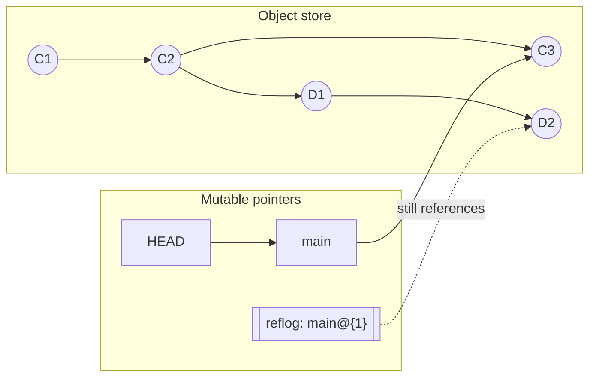
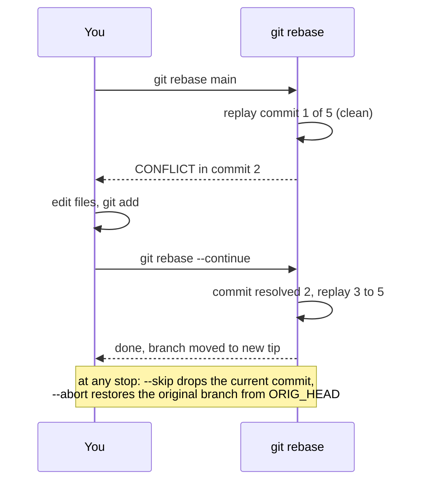
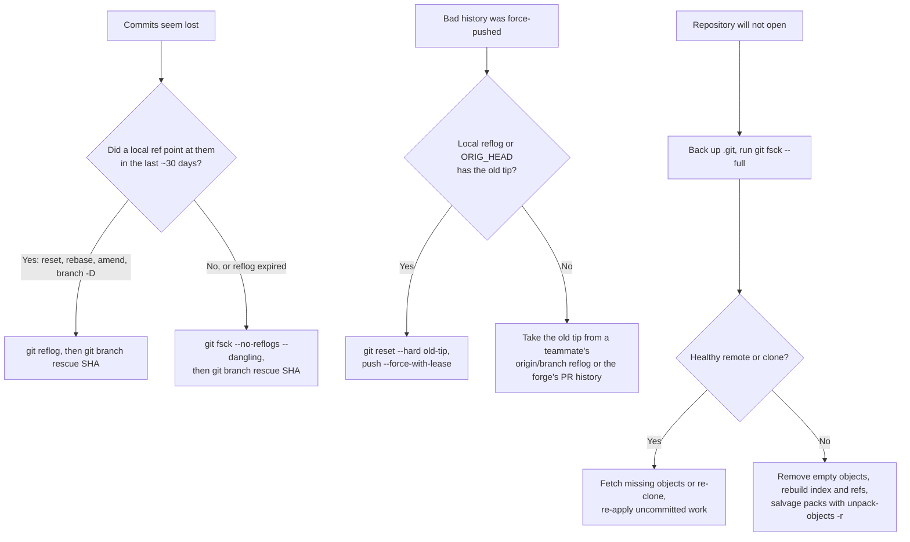

[Git Internals](./) ›

Git rarely loses committed work, but it is easy to misplace it. A conflicted rebase, a force-push over a colleague's commits, a `reset --hard` on the wrong branch or a deleted branch can all leave a repository that looks broken while every object is still on disk. This page covers resolving conflicts methodically, undoing history rewrites, finding commits that no reference points to, and repairing a damaged repository. It assumes the [object model](object-model.html) (objects, refs, `HEAD`) and the [merge and rebase algorithms](algorithms-and-operations.html).

## Why committed work is rarely lost

Git is an immutable, content-addressed object store under a thin layer of mutable pointers. Three properties make recovery possible:

1. **Commits are never edited.** Amending, rebasing or resetting creates new commits and moves a pointer; the old commits stay in `.git/objects`.
2. **Pointer moves are logged.** Every update to `HEAD` or a branch appends an entry to that ref's **reflog**, recording where it pointed before.
3. **Unreferenced objects survive until pruned.** An object that nothing references stays on disk until `git gc` (or `git maintenance`) prunes it, and pruning only removes loose objects older than `gc.pruneExpire`.



In the diagram, `main` was reset from `D2` back to `C2` and then moved on to `C3`. `D1` and `D2` are no longer on any branch, but the reflog still references `D2`, so they are safe until that reflog entry expires.

| Setting | Default | Controls |
|---------|---------|----------|
| `gc.reflogExpire` | 90 days | Age at which reflog entries still reachable from the ref's tip are expired |
| `gc.reflogExpireUnreachable` | 30 days | Age at which reflog entries *not* reachable from the tip (typical after `amend`, `rebase`, `reset`) are expired |
| `gc.pruneExpire` | 2 weeks | Minimum age before an unreferenced loose object is deleted |

So the practical window for a commit abandoned by a rebase is about 30 days via the reflog, plus up to two more weeks during which `fsck` can still find it. Recovery almost always comes down to one step: **find the hash of the lost commit, then point a ref at it.** The reflog finds it if a ref recently pointed there; `git fsck` finds it if nothing did.

Uncommitted edits are the exception. Changes that were never staged exist only in the working tree, and `reset --hard`, `checkout -- file` or `restore file` destroy them permanently. Changes that were staged at some point left blobs behind that `fsck` can sometimes find.

## Resolving merge conflicts

A conflict occurs when a three-way merge cannot reconcile changes to the same region of a file, or when the two sides made incompatible changes to the tree (see the [merge algorithm](algorithms-and-operations.html#three-way-merge-algorithm)). Git stops, writes markers into conflicted files, and records every version of each conflicted path in the index.

### Previewing before merging

`git merge-tree --write-tree` computes a merge in memory without touching the working tree, so you can check for conflicts first:

```bash
git merge-tree --write-tree --name-only main feature
# exit status 1 plus a list of conflicted paths means the real merge will stop
```

### The conflicted index

For a conflicted path the index holds up to three **stages** instead of the usual single stage 0:

| Stage | Contents | Read it with |
|:-----:|----------|--------------|
| 1 | Merge base | `git show :1:path` |
| 2 | Ours (`HEAD`) | `git show :2:path` |
| 3 | Theirs (the incoming commit) | `git show :3:path` |

A missing stage indicates a structural conflict: no stage 1 means both sides added the path (add/add); a missing stage 2 or 3 means one side deleted it (modify/delete).

```bash
git status                               # "Unmerged paths" section
git diff --name-only --diff-filter=U     # just the conflicted paths
git ls-files -u                          # stages and blob IDs per path
git diff                                 # combined diff of the conflicts
git log --merge -p -- path               # commits on either side that touched path
```

### Conflict markers

Set the `zdiff3` style once; the base section it adds shows what both sides started from, which usually reveals whether a change was a deliberate edit or incidental:

```bash
git config --global merge.conflictStyle zdiff3
```

```
<<<<<<< HEAD
timeout = 30
||||||| merge base
timeout = 10
=======
timeout = 60
>>>>>>> feature/raise-timeout
```

Both sides raised the timeout from 10, to different values, so this is a genuine disagreement to settle by hand rather than a case where one side's edit can simply be kept.

### Resolving step by step

```bash
# 1. List conflicts
git status

# 2. Edit each file into its intended final state and remove the markers,
#    or take one side for a whole file:
git restore --ours   path/to/file        # same as: git checkout --ours path/to/file
git restore --theirs path/to/file
#    Start over on a file, re-creating the conflict markers:
git restore --merge  path/to/file        # same as: git checkout -m path/to/file

# 3. Mark it resolved (for a modify/delete conflict, use git rm to accept the deletion)
git add path/to/file

# 4. Conclude
git merge --continue                     # or: git commit

# Or give up and return to the pre-merge state
git merge --abort
```

`git diff --check` before committing catches leftover conflict markers and whitespace errors.

### What "ours" and "theirs" mean

The labels refer to positions in the underlying three-way merge, not to who wrote the code, so they swap depending on the operation:

| Operation | `--ours` / stage 2 | `--theirs` / stage 3 |
|-----------|--------------------|-----------------------|
| `git merge feature` | Your current branch | `feature` |
| `git rebase main` | `main` plus the commits already replayed | The commit of yours being replayed |
| `git cherry-pick X` | Your current branch | Commit `X` |
| `git revert X` | Your current branch | The inverse of `X` |
| `git stash pop` / `apply` | Your current branch | The stashed changes |

Rebase is the one that surprises people: your own work is "theirs". When in doubt, look at the stages with `git show :2:path` and `:3:path` and resolve by content rather than by label.

### Tools that reduce conflict work

```bash
git mergetool                             # open each conflict in the configured tool
git config --global merge.tool vscode     # or meld, kdiff3, vimdiff, ...

git config --global rerere.enabled true   # record and reuse resolutions
git config --global rerere.autoUpdate true   # also stage reused resolutions
```

**rerere** ("reuse recorded resolution") stores each resolved conflict, keyed by its conflicting hunks, under `.git/rr-cache/`. When the identical conflict appears again (the typical case when a long-lived branch is repeatedly rebased or test-merged against a moving `main`) Git applies the recorded resolution automatically. Inspect what it did with `git rerere diff`, and discard a bad recording with `git rerere forget path`.

## Rebasing through conflicts

A rebase replays commits one at a time, so any of them can conflict. The rebase then stops with `HEAD` detached on the partially rebased history.



```bash
git rebase main
# CONFLICT in commit 2 of 5 ...
git status                      # shows which commit is being replayed
git add path/to/file            # after resolving
git rebase --continue           # commit the resolution and keep going
git rebase --skip               # drop the commit being replayed
git rebase --abort              # return the branch to where it started
```

`--continue` commits the staged resolution as the rewritten version of the current commit and carries on with the todo list in `.git/rebase-merge/`. `--abort` resets the branch to the tip recorded when the rebase began; your original commits are also still in the reflog, so an abort never loses them.

Ways to make conflict-heavy rebases manageable:

- **Enable `rerere`**, so a conflict resolved once is reapplied when the same hunk conflicts again, including after an abort and retry.
- **Squash first, then rebase.** A branch whose commits edit the same lines repeatedly conflicts once per commit; `git rebase -i --keep-base main` to squash those commits in place, followed by a normal rebase, resolves them once.
- **Rebase in smaller hops** onto an intermediate commit of the target, so each step has fewer upstream changes to absorb.
- **Consider merging instead.** A single merge resolves the combined conflict once; a rebase may ask you to resolve the same region at every commit that touches it.

## Undoing a pushed rebase or force-push

Because a rebase only moves a branch pointer, the pre-rebase commits still exist after a bad rebase or force-push, even one that has already been pushed.

### On the machine that did the rebase

```bash
git reflog show feature          # entries like "feature@{3}: rebase (finish): ..."
git log --oneline feature@{4}    # inspect the pre-rebase tip before trusting it

git reset --hard feature@{4}     # put the branch back
# or, straight after the rebase: git reset --hard ORIG_HEAD
```

Then publish the corrected branch without overwriting anything you have not seen:

```bash
git push --force-with-lease --force-if-includes
```

### When a teammate's commits were overwritten

If someone force-pushed over commits you or a teammate had fetched, any clone that fetched the old tip still has it:

```bash
git reflog show origin/feature   # remote-tracking refs have reflogs too
git branch rescue <old-tip-sha>
git push origin rescue
```

A server-side bare repository normally has reflogs disabled (`core.logAllRefUpdates` defaults to false in bare repositories), so the server may not help unless it was configured to keep them. Hosted forges record force-pushes in their audit logs and pull-request timelines; GitHub, for example, shows the before and after SHAs of a force-push on the pull request, and the old commits usually remain fetchable by SHA for a while.

### Force-push safely

| Command | Behaviour |
|---------|-----------|
| `git push --force` | Overwrites the remote branch unconditionally |
| `git push --force-with-lease` | Refuses if the remote tip differs from your remote-tracking ref (`origin/feature`), i.e. someone pushed since your last fetch |
| `git push --force-with-lease --force-if-includes` | Additionally refuses if the remote tip was fetched but never integrated into your local branch; closes the hole where a background `git fetch` updated `origin/feature` and made the lease pass |

Set `git config --global push.useForceIfIncludes true` (Git 2.30+) so every `--force-with-lease` push gets the extra check.

## Interactive rebase and squashing

Interactive rebase is the usual way to turn a messy feature branch into reviewable commits before merging. The todo commands (`pick`, `reword`, `edit`, `squash`, `fixup`, `drop`, `exec`, `break`) are listed in [Interactive rebase](algorithms-and-operations.html#interactive-rebase).

```bash
git rebase -i main               # every commit since the branch left main
git rebase -i --keep-base main   # same commits, but do not move onto newer main
```

Given this todo list (oldest first):

```
pick a1b2c3d Add login form
pick b2c3d4e Fix typo in login form
pick c3d4e5f Add password validation
pick d4e5f6a WIP debugging
pick e5f6a7b Wire up auth backend
```

rewriting it as

```
pick  a1b2c3d Add login form
fixup b2c3d4e Fix typo in login form
pick  c3d4e5f Add password validation
fixup e5f6a7b Wire up auth backend
drop  d4e5f6a WIP debugging
```

produces two commits. The typo fix and backend wiring are folded into their predecessors without prompting for a message, and the WIP commit disappears. Moving a line reorders commits; if reordered commits touch the same lines, expect conflicts.

### Autosquash

Rather than editing the todo list by hand, record the target of each fix as you commit it:

```bash
git commit --fixup=a1b2c3d            # "fixup! Add login form"
git commit --squash=c3d4e5f           # "squash! Add password validation"
git commit --fixup=reword:a1b2c3d     # amend only the message of a1b2c3d (Git 2.32+)

git rebase -i --autosquash main       # entries are pre-sorted and pre-marked
git config --global rebase.autoSquash true
```

For a single edit to an older commit on a linear branch, the experimental `git history reword` and `git history fixup` commands do the same without an editor or a working-tree replay; see [`replay` and `history`](algorithms-and-operations.html#rewriting-without-a-working-tree-replay-and-history).

## Cherry-pick with conflicts

A cherry-pick is a three-way merge of one commit's change, so it conflicts in the same way. For a range, the sequencer stops on each conflicting commit.

```bash
git cherry-pick abc1234
# CONFLICT (content): Merge conflict in src/app.py
git add src/app.py
git cherry-pick --continue       # commit with the original message
git cherry-pick --skip           # drop this commit, continue with the range
git cherry-pick --abort          # restore the pre-cherry-pick state
```

When you find yourself cherry-picking a long contiguous run of commits, `git rebase --onto` is usually the better tool; it computes the range for you and records the original tip in `ORIG_HEAD` and the reflog.

## Reflog: recovering lost commits

The reflog is the first place to look after a `reset --hard`, a bad rebase, an `amend`, a mistaken merge, or a deleted branch. It records every position `HEAD` and each branch has held, locally.

```bash
git reflog                       # HEAD's history
git reflog show feature          # one branch's history
git reflog --date=iso            # absolute timestamps
git log -g --oneline --grep=wip  # search reflog entries like a log
```

```
e5f6a7b HEAD@{0}: reset: moving to HEAD~3
1a2b3c4 HEAD@{1}: commit: Add password validation   <- the work to get back
b2c3d4e HEAD@{2}: commit: Add login form
```

`HEAD@{2}` means "two moves ago". Time-based forms such as `main@{yesterday}` and `HEAD@{2.hours.ago}` resolve a ref to where it pointed at that time.

```bash
git show HEAD@{1}                # inspect before acting

git branch recovered HEAD@{1}    # safest: give it a new branch
git reset --hard HEAD@{1}        # or move the current branch back (discards later work)
git cherry-pick HEAD@{1}         # or copy just that commit onto the current branch
```

The reflog has limits:

- It is **local**. Reflogs are never pushed or fetched, and a fresh clone starts with an empty one.
- Entries **expire** (see the [defaults above](#why-committed-work-is-rarely-lost)), after which `gc` can prune the objects.
- Deleting a branch with the default `files` ref backend also deletes that branch's own reflog; `HEAD`'s reflog, which usually recorded the same commits, survives.

Move anything you recover onto a named branch promptly.

## fsck: finding commits the reflog forgot

When the reflog has expired, or a commit was never on a ref (a dropped stash, a commit made on a detached `HEAD` long ago), `git fsck` walks the whole object database and reports objects that nothing references.

```bash
git fsck --full                  # verify every object
git fsck --unreachable           # list objects unreachable from any ref or reflog
git fsck --no-reflogs            # also treat reflog-only objects as unreachable
git fsck --lost-found            # write dangling objects to .git/lost-found/
```

```
dangling commit 1a2b3c4d...      <- a commit nothing points to
dangling blob   9f8e7d6c...      <- file contents, e.g. from a staged-then-discarded change
```

A *dangling* object has no referrer at all; an *unreachable* object may be referenced only by other unreachable objects. Dangling commits are the tips of lost chains, so they are the ones to look at:

```bash
git fsck --no-reflogs --dangling 2>/dev/null |
  awk '$2 == "commit" {print $3}' |
  xargs -r git log --no-walk --format='%h %ci %s'

git branch recovered <sha>       # give the right one a home
```

`--lost-found` writes dangling commits to `.git/lost-found/commit/` and other objects (usually blobs) to `.git/lost-found/other/`, where you can `grep` through recovered file contents.

### Recovering a dropped stash

A stash entry is a commit (see [Stash](algorithms-and-operations.html#stash)), and `git stash drop` or `clear` only removes its reflog entry. Dropped stashes show up as dangling commits whose message starts with `WIP on` or `On <branch>:`:

```bash
git fsck --no-reflogs --dangling 2>/dev/null | awk '$2 == "commit" {print $3}' |
  xargs -r git log --no-walk --format='%h %s' | grep -E ' (WIP on|On) '
git stash apply <sha>
```

## Recovering a deleted branch

Deleting a branch removes only the ref; its commits remain until pruned.

```bash
# The deletion message itself contains the hash:
#   Deleted branch feature (was a1b2c3d).
git branch feature a1b2c3d

# Otherwise, HEAD's reflog recorded time spent on the branch:
git reflog | grep -m1 'checkout: moving from feature'
git branch feature <sha>

# Otherwise, look for a dangling tip:
git fsck --no-reflogs --dangling | grep commit
```

If the branch was pushed, `git branch feature origin/feature` works as long as `origin/feature` has not been pruned by `git fetch --prune`; its reflog (`git reflog show origin/feature`) may still have the hash even if it has.

## Repairing a corrupted repository

Corruption from a crash mid-write, a full disk, a faulty filesystem or a cloud-sync tool rewriting `.git` typically appears as `error: object file ... is empty`, `fatal: loose object ... is corrupt`, `bad object HEAD` or `fatal: bad index file`. **Copy the repository before attempting any repair.**

### Diagnose

```bash
cp -a .git ../git-backup          # back up first
git fsck --full                   # which objects are missing or corrupt
git count-objects -vH             # object and pack counts, garbage
```

### Common repairs

| Symptom | Repair |
|---------|--------|
| Empty loose object files | `find .git/objects -type f -empty -delete`, then `git fsck --full` again. Empty files contain nothing, so removing them loses nothing; the objects may still exist in a pack or on a remote. |
| Missing or corrupt objects that a remote has | `git fetch origin` retrieves any objects the remote has. For objects Git believes it already has, fetch from a fresh clone and copy its pack into `.git/objects/pack/`, or add the clone as an alternate. |
| Corrupt branch ref | `git update-ref refs/heads/main <good-sha>` (works with both the `files` and `reftable` backends; do not write ref files by hand) |
| Broken `HEAD` | `git symbolic-ref HEAD refs/heads/main` |
| Corrupt index | `rm .git/index && git reset`; the index is derived data and is rebuilt from `HEAD` without touching the working tree |
| Corrupt pack file | Move the pack and its `.idx` out of `.git/objects/pack/`, then `git unpack-objects -r < moved.pack` to salvage every readable object, and fetch the rest from a remote |

### Re-clone when a healthy copy exists

If a remote holds everything you have committed, a fresh clone is the most reliable fix. Rescue uncommitted work first:

```bash
cd broken-repo
git diff HEAD > ../uncommitted.patch 2>/dev/null || true   # may fail if HEAD is unreadable
git ls-files --others --exclude-standard -z | xargs -0 tar czf ../untracked.tgz

cd ..
git clone <remote-url> repo-fresh
cd repo-fresh
git apply ../uncommitted.patch && tar xzf ../untracked.tgz
```

If `git diff` fails, copy the working-tree files over the fresh clone instead and let `git status` show the differences. Local branches that were never pushed can be recovered from the broken repository with `git bundle create ../rescue.bundle --all` if its objects are still readable, or by fetching from it directly (`git fetch ../broken-repo 'refs/heads/*:refs/remotes/broken/*'`).

Recovery tools only work on objects that are still intact. If an object is corrupt and no other copy (remote, clone, backup) exists, its content is gone, which is the strongest practical argument for pushing often and for periodic `git bundle create backup.bundle --all` snapshots of repositories without a remote.

## Preventing the next incident

| Setting or habit | Effect |
|------------------|--------|
| `push.useForceIfIncludes=true` and always `--force-with-lease` | Force-pushes refuse to overwrite commits you have not seen or integrated |
| Protected branches on the forge | Force-push and deletion of `main` and release branches are rejected server-side |
| `merge.conflictStyle=zdiff3` | Conflict hunks show the merge base |
| `rerere.enabled=true` | Repeated conflicts are resolved once |
| `rebase.updateRefs=true` | Rebasing a stack of branches keeps all of them consistent |
| `transfer.fsckObjects=true` | Objects are checked for corruption and malformed data on fetch and receive |
| `git maintenance start` | Scheduled background maintenance (commit-graph, prefetch, incremental repack) instead of large synchronous `gc` runs |
| Never keep `.git` in Dropbox, OneDrive or similar sync folders | Sync tools that rewrite files mid-operation are a common source of corruption |
| `git branch backup/<name>` before risky operations | Any reset, rebase or filter can be undone with one `reset --hard` |

The last habit is the cheapest. A branch costs one small ref, and it turns "where did my work go?" into `git reset --hard backup/<name>`.

## Decision guide



## See also

- [Algorithms & Advanced Operations](algorithms-and-operations.html): the merge, rebase and stash mechanics behind these procedures
- [Object Model & Storage](object-model.html): objects, refs and the reflog
- [Protocols, Packs & Performance](protocols-and-performance.html): packs, `gc` and pruning, which decide how long unreferenced objects survive
- [Branching Strategies](../branching.html): workflows that reduce hard conflicts
- [Git Command Reference](../git-reference.html): syntax for `reflog`, `rebase`, `cherry-pick`, `fsck` and `reset`

**Previous:** [Algorithms & Advanced Operations](algorithms-and-operations.html) · **Next:** [Authentication & Access Control](auth-and-access-control.html)
