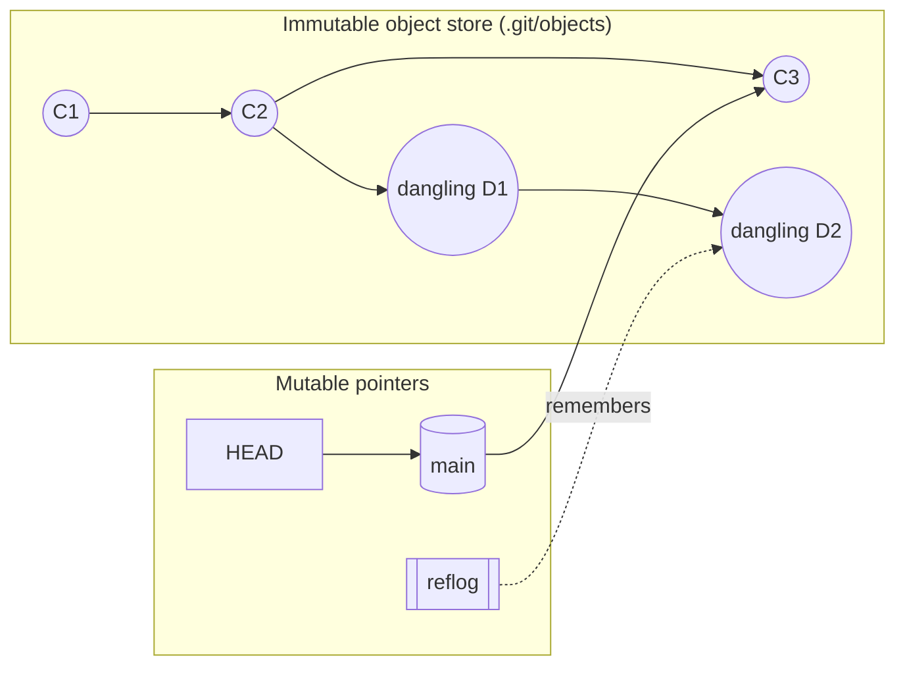
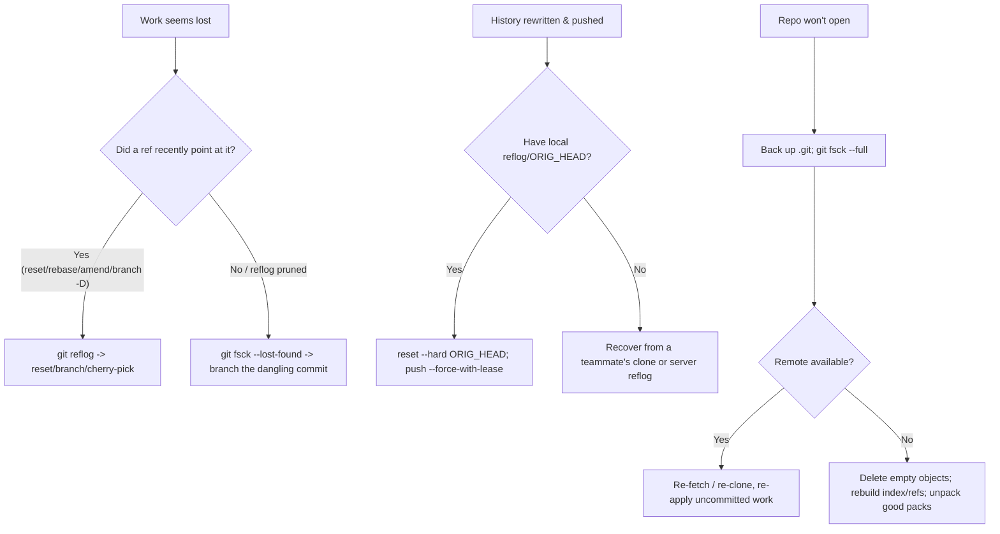

[Git Internals](./) ›

<div class="hero-section" style="background: linear-gradient(135deg, #4facfe 0%, #00f2fe 100%); color: white; padding: 3rem 2rem; margin: -2rem -3rem 2rem -3rem; text-align: center;">
  <h1 style="color: white; margin: 0; font-size: 2.5rem;">Conflict Resolution &amp; Recovery</h1>
  <p style="font-size: 1.25rem; margin-top: 1rem; opacity: 0.9;">Resolving merge and rebase conflicts, undoing rewritten history, and recovering lost commits, branches, and corrupted repositories</p>
</div>

<div class="intro-card">
  <p class="lead-text">Git almost never loses work — but it is easy to <em>misplace</em> it. A conflicted rebase, a force-push over a colleague's commits, a <code>git reset --hard</code> on the wrong branch, or a deleted branch can all leave a repository that <em>looks</em> broken. The good news: as long as the objects still live in the object store, the reflog and <code>fsck</code> can almost always get them back. This page is the recovery playbook: how to resolve conflicts methodically, how to undo history rewrites safely, and how to dig commits out of the object database when every visible reference to them is gone.</p>
</div>

<div class="tip-card">
  <h4>Prerequisites</h4>
  <p>This page assumes familiarity with the <a href="object-model.html">object model</a> (commits, refs, the <code>HEAD</code> pointer) and the <a href="algorithms-and-operations.html">three-way merge and rebase algorithms</a>. If a term like "merge base", "dangling object", or "reflog" is unfamiliar, read those pages first.</p>
</div>

## The Mental Model: Why Almost Nothing Is Ever Lost

Git is a content-addressable object store layered under a thin set of mutable pointers. Three facts make recovery possible:

1. **Commits are immutable and content-addressed.** A commit is named by the SHA-1/SHA-256 hash of its content. "Rewriting history" never edits a commit in place — it creates *new* commits and moves a *pointer* to them. The old commits still exist in `.git/objects`.
2. **Every pointer move is logged.** Whenever `HEAD` or a branch ref changes, Git appends a line to its **reflog** (`.git/logs/`). The reflog records where a ref *used to point*, even after the branch label is gone from the visible graph.
3. **Unreferenced objects survive until garbage collection.** A commit with no ref or reflog entry pointing at it becomes **dangling**, but it stays on disk until `git gc` prunes it — by default 90 days for reachable-via-reflog objects and 2 weeks for truly unreachable ones (`gc.reflogExpire`, `gc.pruneExpire`).



The practical consequence: **recovery is almost always "find the hash of the lost commit, then point a ref at it."** The reflog finds it when a ref recently pointed there; `git fsck` finds it when nothing does.

## Resolving Merge Conflicts

A conflict occurs when the three-way merge cannot reconcile overlapping changes to the same region of a file (see [the merge algorithm](algorithms-and-operations.html#three-way-merge-algorithm)). Git pauses, writes conflict markers into the working tree, and records all three versions in the index.

### The Conflicted Index

During a conflict the index holds up to three *stages* of each conflicted path, instead of the usual single stage 0:

| Stage | Meaning |
|-------|---------|
| 1 | The **base** (merge-base / common ancestor) version |
| 2 | **Ours** (the current branch, `HEAD`) |
| 3 | **Theirs** (the branch being merged in) |

```bash
git ls-files -u            # List unmerged paths with their stages
git status                 # "Unmerged paths:" section lists conflicts
git diff --name-only --diff-filter=U   # Just the conflicted file names
```

### Conflict Markers

Git rewrites each conflicted hunk with markers. With `merge.conflictStyle = diff3` (or `zdiff3`, recommended) you also get the merge-base section, which makes intent much clearer:

```
<<<<<<< HEAD
timeout = 30
||||||| merge base
timeout = 10
=======
timeout = 60
>>>>>>> feature/raise-timeout
```

The base section (`||||||| merge base`) shows what *both* sides started from — invaluable for deciding whether a side's change was additive or a true disagreement. Enable it once:

```bash
git config --global merge.conflictStyle zdiff3
```

### Resolving Step by Step

```bash
# 1. See what conflicts
git status

# 2. Edit each file: remove the markers, keep the intended result.
#    Or accept one side wholesale:
git checkout --ours   path/to/file     # keep HEAD's version
git checkout --theirs path/to/file     # keep the incoming version

# 3. Mark each file resolved by staging it
git add path/to/file

# 4. Finish the merge (reuses the prepared merge message)
git commit                             # or: git merge --continue

# Abort entirely and return to the pre-merge state
git merge --abort
```

<div class="warning-card">
  <h4>"ours" and "theirs" flip during rebase</h4>
  <p>During a <em>merge</em>, <code>--ours</code> is your current branch. During a <em>rebase</em>, the meaning inverts: <code>--ours</code> refers to the branch you are rebasing <em>onto</em> (the new base), and <code>--theirs</code> is the commit being replayed. This trips up nearly everyone — when in doubt, inspect with <code>git diff</code> and resolve by content rather than by side.</p>
</div>

### Tools That Reduce Conflict Toil

```bash
# Launch a configured 3-way merge tool (vimdiff, meld, kdiff3, vscode, ...)
git mergetool

# rerere: "reuse recorded resolution" — remembers how you resolved a
# given conflict and replays it automatically next time it recurs.
git config --global rerere.enabled true
```

`rerere` is especially valuable when a long-lived branch is repeatedly rebased or merged against a moving target: you resolve each unique conflict once, and Git auto-applies the recorded resolution on every subsequent encounter.

## Rebasing Through Conflicts

A rebase replays each of your commits onto a new base, one at a time. Any commit can conflict, so the rebase **pauses mid-replay** and hands you a partially-rebased branch in a detached state.

```bash
git rebase main                 # replay current branch onto main
# ... conflict in commit 2 of 5 ...

# Resolve the working tree, then stage the resolution:
git add path/to/file

git rebase --continue           # replay the next commit
# (repeat resolve + continue for each conflicting commit)

git rebase --skip               # drop the current commit entirely
git rebase --abort              # bail out; restore the original branch tip
```

### What "continue" Actually Does

At each pause, Git has applied commits up to the current one onto the new base, leaving `HEAD` detached on the partial result. `--continue` commits your staged resolution as the replayed version of the current commit, then resumes cherry-picking the remaining todo entries. `--abort` reads `ORIG_HEAD` (saved at the start) and resets the branch back to exactly where it began — the cleanest escape hatch when a rebase has gone wrong.

<div class="tip-card">
  <h4>Make conflict-heavy rebases survivable</h4>
  <ul>
    <li><strong>Enable <code>rerere</code></strong> so a conflict resolved on attempt one is replayed automatically on later attempts.</li>
    <li><strong>Rebase in smaller hops.</strong> Rebasing onto an intermediate commit, then onto the final base, can turn one giant conflict into two small ones.</li>
    <li><strong>Know the abort.</strong> <code>git rebase --abort</code> is always safe; it never loses your original commits because they are still referenced by <code>ORIG_HEAD</code> and the reflog.</li>
  </ul>
</div>

## Undoing a Pushed Rebase (or Force-Push)

This is the highest-stakes recovery scenario. You rebased a branch, force-pushed it, and now realize the rebase was wrong — or it discarded a collaborator's commits. Because the rebase only *moved a pointer*, the original commits are still recoverable.

### Recover Your Own Bad Rebase Locally

If you are on the machine that did the rebase, the reflog still remembers the pre-rebase tip:

```bash
git reflog                       # find the line BEFORE the rebase started,
                                 # e.g. "abc1234 HEAD@{5}: commit: ..."

# Inspect to confirm it is the right state
git log --oneline abc1234

# Hard-reset the branch back to the pre-rebase tip...
git reset --hard abc1234
# ...or, equivalently, use the saved ORIG_HEAD from the rebase:
git reset --hard ORIG_HEAD
```

Then re-publish with a *lease* so you do not clobber anyone else again:

```bash
git push --force-with-lease
```

### Recover From a Force-Push That Erased a Teammate's Work

If someone else's commits were overwritten on the remote and your local reflog does not have them, you can still recover from any clone that has them, or from the remote's own reflog if you control the server:

```bash
# On a teammate's machine that fetched the old tip:
git reflog show origin/feature   # find the old remote tip hash
git branch rescue <old-tip-sha>  # save it to a ref
git push origin rescue           # publish the rescued commits

# If you run the Git server, the bare repo has its own reflog:
#   on the server, in the bare repo:
git reflog refs/heads/feature
```

<div class="warning-card">
  <h4>Always prefer <code>--force-with-lease</code> over <code>--force</code></h4>
  <p><code>git push --force</code> overwrites the remote branch unconditionally, silently discarding any commits pushed since your last fetch. <code>git push --force-with-lease</code> refuses the push if the remote tip is not what you last saw — turning a silent data-loss bug into a safe, explicit rejection. Make it the default for any force-push.</p>
</div>

## Interactive Rebase &amp; Squashing

Interactive rebase (`git rebase -i <base>`) opens a **todo list** of commits and lets you reorder, edit, combine, or drop them before they are replayed. It is the primary tool for cleaning up a messy feature branch before it merges.

```bash
git rebase -i HEAD~5          # edit the last 5 commits
git rebase -i main            # edit every commit since main diverged
```

The editor presents one line per commit, oldest first:

```
pick a1b2c3d Add login form
pick b2c3d4e Fix typo in login form          # <- squash into previous
pick c3d4e5f Add password validation
pick d4e5f6a WIP debugging                    # <- drop
pick e5f6a7b Wire up auth backend
```

### The Todo Commands

| Command | Effect |
|---------|--------|
| `pick` | Keep the commit as-is |
| `reword` | Keep the commit, but stop to edit its message |
| `edit` | Stop *after* applying it so you can amend the snapshot (`git commit --amend`) |
| `squash` (`s`) | Combine into the previous commit; **merge both messages** in an editor |
| `fixup` (`f`) | Like squash, but **discard this commit's message** |
| `drop` (`d`) | Remove the commit entirely |
| `exec` (`x`) | Run a shell command (e.g. tests) at this point |
| `break` | Stop here unconditionally, then `git rebase --continue` to resume |

### Squashing a Cluster of Commits

To fold the four commits above into two clean ones — "Add login form" and "Add auth" — rewrite the todo list:

```
pick   a1b2c3d Add login form
fixup  b2c3d4e Fix typo in login form
pick   c3d4e5f Add password validation
fixup  e5f6a7b Wire up auth backend
drop   d4e5f6a WIP debugging
```

`fixup` absorbs the typo fix and the backend wiring into their preceding commits without prompting for a message; `drop` deletes the WIP commit.

### Autosquash: Mark Fixups As You Go

You do not have to hand-edit the todo list. Create fixup/squash commits while working, then let `--autosquash` reorder them automatically:

```bash
# While developing, target an earlier commit by hash:
git commit --fixup=a1b2c3d        # creates "fixup! Add login form"
git commit --squash=c3d4e5f       # creates "squash! Add password validation"

# Later, autosquash slots them next to their targets and pre-fills
# the todo list with the right fixup/squash actions:
git rebase -i --autosquash main
```

Enable it permanently with `git config --global rebase.autosquash true`. This is the cleanest squashing workflow: keep committing small, mark each commit's target as you go, and let the final rebase assemble a tidy history.

## Cherry-Pick With Conflicts

`git cherry-pick` applies the *diff introduced by a commit* onto your current branch as a new commit. Because the surrounding context may differ, cherry-picks conflict just like merges and rebases.

```bash
git cherry-pick <sha>            # apply one commit
git cherry-pick <sha1>^..<sha2>  # apply an inclusive range
git cherry-pick -x <sha>         # append "(cherry picked from commit ...)"
git cherry-pick -n <sha>         # apply to working tree, do NOT commit
```

### Driving a Conflicted Cherry-Pick

```bash
git cherry-pick abc1234
# CONFLICT (content): Merge conflict in src/app.py

# Resolve the file, then stage it:
git add src/app.py

git cherry-pick --continue       # finish; reuses the original message
git cherry-pick --skip           # drop this commit, move to the next in a range
git cherry-pick --abort          # restore the pre-cherry-pick state
```

The resolution mechanics are identical to a merge: the index carries stages 1/2/3, `--ours` is your current branch, `--theirs` is the commit being picked. For a *range* of commits, Git pauses on each conflicting commit, and `--continue`/`--skip` advance through the sequence just like a rebase.

<div class="tip-card">
  <h4>Cherry-pick vs. rebase</h4>
  <p>A cherry-pick is a single commit's worth of the same replay machinery a rebase uses for the whole branch. If you find yourself cherry-picking a long contiguous run of commits, an interactive rebase (or <code>git rebase --onto</code>) is usually the better tool — it tracks the original branch point and the reflog for you.</p>
</div>

## Reflog: Recovering Lost Commits

The **reflog** is the first place to look whenever a commit "disappears" after a `reset --hard`, a bad `rebase`, an `amend`, a botched `merge`, or an accidental branch deletion. It records every position `HEAD` and each branch has occupied, with timestamps.

```bash
git reflog                       # HEAD's movement history
git reflog show <branch>         # a specific branch's history
git reflog --date=iso           # absolute timestamps instead of "2 hours ago"
```

Typical output:

```
e5f6a7b HEAD@{0}: reset: moving to HEAD~3
1a2b3c4 HEAD@{1}: commit: Add password validation   <- the work I want back
b2c3d4e HEAD@{2}: commit: Add login form
```

### Recovering a Specific Lost State

```bash
# Look at the lost commit before committing to it
git show HEAD@{1}
git log --oneline 1a2b3c4

# Option A: jump back onto it (detached HEAD), inspect, branch off
git checkout 1a2b3c4
git switch -c recovered

# Option B: reset the current branch back to it (DESTROYS work after it)
git reset --hard 1a2b3c4

# Option C: bring just that commit forward without moving the branch
git cherry-pick 1a2b3c4
```

The reflog uses `ref@{n}` and time-based syntax: `HEAD@{2}` is two moves ago; `main@{yesterday}` and `HEAD@{2.days.ago}` resolve a ref to where it pointed at that time — useful for "the repo was fine this morning" recovery.

<div class="warning-card">
  <h4>The reflog is local and expirable</h4>
  <p>Reflogs live in <code>.git/logs/</code> and are <strong>never pushed or fetched</strong> — a fresh clone has an empty reflog. Entries also expire (90 days for reachable, 30 days for unreachable, by default) and <code>git gc</code> can prune the objects afterward. For long-term safety, move recovered commits onto a real branch promptly.</p>
</div>

## fsck: Finding Commits the Reflog Forgot

When the reflog has been pruned, or the lost commit was never on a ref the reflog tracked (e.g. a stash dropped long ago, or objects salvaged after corruption), `git fsck` walks the entire object database and reports objects that nothing references.

```bash
git fsck --full                  # full integrity check of all objects
git fsck --lost-found            # write dangling blobs/commits to .git/lost-found/
git fsck --no-reflogs            # treat reflog-only objects as dangling too
```

Relevant output lines:

```
dangling commit  1a2b3c4d...      <- a commit nothing points to
dangling blob    9f8e7d6c...      <- file content from a dropped change
dangling tree    5a4b3c2d...
```

### Salvaging a Dangling Commit

```bash
# Inspect candidates — list dangling commits with their subject lines
git fsck --no-reflogs --unreachable |
  awk '/commit/ {print $3}' |
  while read sha; do git log -1 --oneline "$sha"; done

# Once you have identified the right hash, give it a home:
git branch recovered <dangling-sha>     # or: git merge / git cherry-pick it
```

`--lost-found` materializes every dangling object under `.git/lost-found/` (`commit/` and `other/`), which is handy when you need to `grep` through recovered file contents to find the one you want.

<div class="tip-card">
  <h4>Recovering a dropped stash</h4>
  <p>A stash is a commit (a merge of your index and working tree). <code>git stash drop</code> only removes the <code>refs/stash</code> entry, leaving the commit dangling. Recover it with <code>git fsck --no-reflogs</code>, find the dangling commit whose message starts with <code>WIP on</code>, and run <code>git stash apply &lt;sha&gt;</code> or <code>git cherry-pick -m1 &lt;sha&gt;</code>.</p>
</div>

## Recovering a Deleted Branch

Deleting a branch (`git branch -D feature`) only removes the *ref*; the commits and the branch's reflog entry persist. Recovery is therefore trivial if you act before garbage collection.

```bash
# Fastest path: HEAD's reflog recorded where you last were on the branch
git reflog
#   ... a1b2c3d HEAD@{4}: checkout: moving from feature to main
git branch feature a1b2c3d        # recreate the branch at its old tip

# If you remember the branch name, its own reflog may still exist briefly:
git reflog show feature           # works until the ref-specific log is gone

# Last resort: fsck for the dangling tip
git fsck --no-reflogs | grep commit
git branch feature <dangling-sha>
```

The deletion message Git prints — `Deleted branch feature (was a1b2c3d).` — *is* the recovery hash; if it is still in your terminal scrollback, you can `git branch feature a1b2c3d` immediately.

## Repairing a Corrupted Repository

Corruption — from a crash mid-write, a full disk, or a bad filesystem — typically surfaces as `error: object file ... is empty`, `fatal: loose object ... is corrupt`, or `bad object HEAD`. Work on a **copy** of `.git` before attempting repairs.

### Diagnose

```bash
cp -r .git /tmp/git-backup        # ALWAYS back up first
git fsck --full                   # identify corrupt/missing objects
git count-objects -v              # sanity-check object counts
```

### Common Repairs

```bash
# 1. Empty/corrupt loose objects: delete them so Git can re-fetch or
#    rebuild from packs. (They are zero-length, so nothing is lost.)
find .git/objects -type f -empty -delete

# 2. Re-fetch missing objects from a remote that still has them.
git fetch --all
#    or rebuild a branch tip from a known-good remote ref:
git fetch origin main
git reset --hard origin/main

# 3. Corrupt ref or HEAD: rewrite it from a known-good hash.
echo <good-sha> > .git/refs/heads/main
git symbolic-ref HEAD refs/heads/main     # if HEAD itself is broken

# 4. Corrupt index: it is derivable; delete and rebuild from HEAD.
rm -f .git/index
git reset                                 # rebuilds index from HEAD

# 5. Corrupt pack: unpack salvageable objects, then drop the bad pack.
git unpack-objects -r < .git/objects/pack/pack-<good>.pack
```

### The Nuclear (and Safest) Option: Re-Clone

If a healthy remote exists, the most reliable repair is to re-clone and move your uncommitted work across:

```bash
# Save anything uncommitted from the broken checkout first
git diff HEAD > /tmp/uncommitted.patch    # may fail if HEAD is unreadable
cp -r src /tmp/working-copy               # or just copy the files

# Fresh clone, then re-apply
git clone <remote-url> repo-fresh
cd repo-fresh
git apply /tmp/uncommitted.patch
```

<div class="warning-card">
  <h4>Object-store corruption can be permanent</h4>
  <p>The reflog and <code>fsck</code> recover commits that <em>still exist</em> as intact objects. If the underlying object files themselves are corrupted and no other copy (remote, clone, backup) holds them, that content is genuinely gone. This is the strongest argument for the distributed model: <strong>every clone is a full backup</strong>. Keep at least one healthy remote, and consider periodic <code>git bundle create backup.bundle --all</code> snapshots for repositories without one.</p>
</div>

## Preventing the Next Disaster

| Practice | Why it helps |
|----------|--------------|
| `push.default = simple` and `--force-with-lease` | Force-pushes refuse to silently overwrite others' work |
| `merge.conflictStyle = zdiff3` | Conflict markers show the merge base, clarifying intent |
| `rerere.enabled = true` | Repeated conflicts are resolved once and replayed |
| `fetch.prune = true` | Stale remote-tracking refs do not mislead recovery |
| Periodic `git bundle --all` backups | A single-file full backup for repos without a remote |
| Branch before risky operations | A throwaway `git branch safety` makes any reset/rebase trivially reversible |

The single most valuable habit: **before any `reset --hard`, `rebase`, or force-push, create a marker** — `git branch wip-backup`. It costs nothing (a 40-byte ref), and it turns "where did my work go?" into "`git reset --hard wip-backup`".

## Quick-Reference Decision Tree



## See Also

- [Algorithms &amp; Advanced Operations](algorithms-and-operations.html) — the three-way merge, rebase, and bisect algorithms these recovery techniques build on.
- [Object Model &amp; Storage](object-model.html) — commits, refs, the reflog, and the object store that makes recovery possible.
- [Protocols, Packs &amp; Performance](protocols-and-performance.html) — pack files, `gc`, and pruning, which govern how long dangling objects survive.
- [Branching Strategies](../branching.html) — workflow choices that reduce how often you face hard conflicts.
- [Git Command Reference](../git-reference.html) — full syntax for `reflog`, `rebase`, `cherry-pick`, `fsck`, and `reset`.
