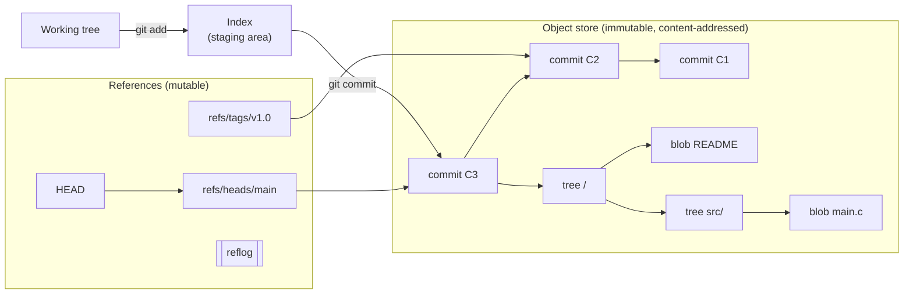
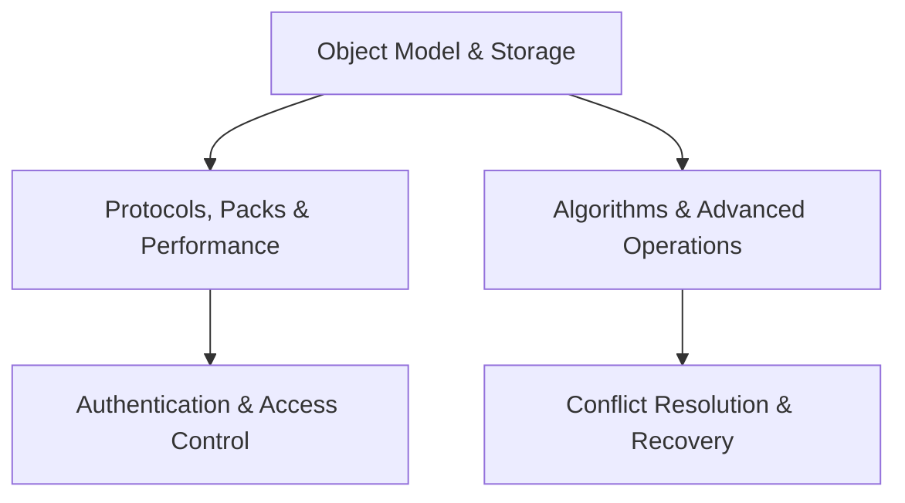

  <h1 style="color: white; margin: 0; font-size: 2.5rem;">Git Internals</h1>
  
Architecture, algorithms, and operations of a distributed version control system

**Git** is a distributed version control system written by Linus Torvalds in 2005 for Linux kernel development and maintained since then by Junio Hamano and a large contributor community. The current release line is **Git 2.55** (June 2026). At its core Git is a *content-addressable object store* (every file, directory, commit and tag is named by the hash of its bytes) with a small set of mutable *references* layered on top. Nearly every Git behaviour, from cheap branches to the recoverability of "lost" commits, follows from that design.

This section is the architecture deep dive. For a first walkthrough read the [Git Crash Course](../git-crash-course.html); to look up a command, the [Git Command Reference](../git-reference.html); for team workflow, [Branching Strategies](../branching.html).

## The design in one picture

| Property | What it means | Consequence |
|----------|---------------|-------------|
| **Snapshots, not diffs** | Each commit records a full tree; unchanged files reuse the same blob | Checkout of any revision is a direct lookup; deltas exist only as a storage optimisation in pack files |
| **Content addressing** | Objects are named by SHA-1 (default) or SHA-256 of their content | Deduplication and tamper-evidence come for free; a commit hash commits to all of its history |
| **History is a DAG** | Commits point to their parent(s), forming a directed acyclic graph | Merge, rebase, bisect and `log` are graph algorithms |
| **References are cheap pointers** | A branch is a name that resolves to one commit | Creating, deleting and moving branches is O(1) and never touches objects |
| **Fully distributed** | Every clone holds the complete object graph | Most operations are local and offline; every clone is a backup |

## Pages in this section

Read **Object Model & Storage** first; the other pages build on the object store and reference model it describes.

| Page | Covers |
|------|--------|
| [Object Model & Storage](object-model.html) | The four object types, content-addressable storage, on-disk layout, the three trees, the index format, and references |
| [Protocols, Packs & Performance](protocols-and-performance.html) | Wire protocol v2, fetch/push negotiation, pack and pack-index formats, delta compression, maintenance, and large-repository techniques |
| [Algorithms & Advanced Operations](algorithms-and-operations.html) | Merge-base computation, three-way merge and the `ort` strategy, rebase and the sequencer, `replay` and `history`, bisect, cherry-pick, stash, reset/revert, and hooks |
| [Conflict Resolution & Recovery](conflict-and-recovery.html) | Resolving merge, rebase and cherry-pick conflicts; undoing force-pushes; recovering commits with the reflog and `fsck`; repairing corrupt repositories |
| [Authentication & Access Control](auth-and-access-control.html) | SSH keys, deploy keys, tokens and credential helpers; GPG, SSH and Sigstore commit signing; SSO; Git's local trust settings; leaked-secret response |

## Where Git is heading

The Git project maintains a list of changes planned for **Git 3.0** in `Documentation/BreakingChanges`. No release date has been set, but several defaults are already opt-in:

| Change | Today | Git 3.0 plan |
|--------|-------|--------------|
| Object hash | SHA-1 (hardened, with collision detection); SHA-256 via `git init --object-format=sha256` | SHA-256 for new repositories; SHA-1 repositories keep working |
| Reference storage | Loose files plus `packed-refs`; **reftable** via `init.defaultRefFormat=reftable` | reftable by default |
| Default branch name | `master`, with a warning since Git 2.49 | `main` |
| Bare-repository discovery | `safe.bareRepository=all` | `explicit`, to stop hooks in embedded bare repositories from running implicitly |
| Rust | Optional build component | Required to build Git |
| Removed commands | `git whatchanged`, `git pack-redundant`, grafts, `.git/branches/` and `.git/remotes/` still work | Removed; use `git log --raw`, `git replace`, and config-based remotes |

`git checkout` is explicitly *not* being removed, even though `git switch` and `git restore` cover its two roles. The main obstacle to switching hash functions is ecosystem support: SHA-256 repositories cannot yet interoperate with SHA-1 remotes, and forge and library support is still incomplete.

## See also

- [Git Crash Course](../git-crash-course.html): start here if you are new to Git
- [Git Command Reference](../git-reference.html): command syntax, including [the road to Git 3.0](../git-reference.html#toward-git-30)
- [Branching Strategies](../branching.html): GitHub Flow, GitLab Flow, Git Flow and trunk-based development
- [CI/CD](../ci-cd/): continuous integration and deployment pipelines
- [Cybersecurity](../cybersecurity/): secrets management and supply-chain security
