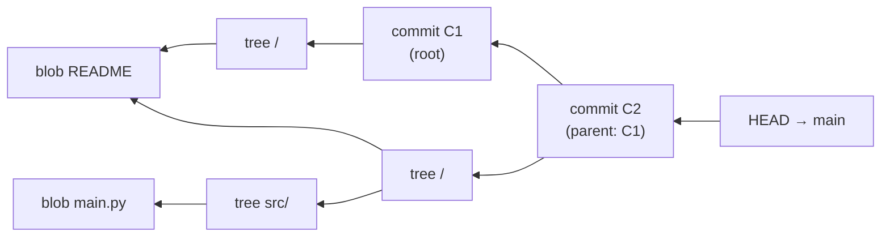
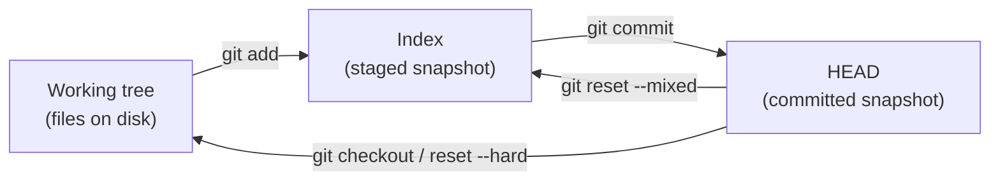

[Git Internals](./) ›

Content-addressable storage, the four object types, the three trees, and how it all lives on disk.

## Core Architecture

### Object Model

At its core, Git is a content-addressable filesystem: a simple key-value store where the *key* is the SHA hash of the content and the *value* is the content itself. Everything else — branches, tags, history — is built from just four object types layered on top of that store.

| Object | Represents | Points to | Key properties |
|--------|------------|-----------|----------------|
| **Blob** | File contents | Nothing | Raw bytes only, no filename or metadata; identical files share one blob |
| **Tree** | A directory | Blobs and other trees | Stores names and file modes — gives blobs their structure |
| **Commit** | A snapshot in time | One tree + parent commit(s) | Adds author, committer, timestamp, and message |
| **Tag** | A named, signable pointer | Any object (usually a commit) | Annotated tags carry a tagger, message, and optional GPG/SSH signature |

The objects nest predictably: a **commit** names one **tree** (the whole project at that moment) plus its parent commit(s); each **tree** lists **blobs** (file contents) and sub-trees. Because every object is keyed by the hash of its content, two things follow for free — identical content is stored once (deduplication), and altering any byte changes the hash all the way up the chain (tamper-evidence).

These objects compose into a graph: each **commit** points to one **tree** (the project snapshot) and to its **parent** commit(s). Trees point to **blobs** (file contents) and nested trees. Following parent links backward traces the full history as a directed acyclic graph (DAG).



Because objects are addressed by the hash of their content, identical files anywhere in history share a single blob, and any tampering changes the hash — giving Git both deduplication and cryptographic integrity.

#### Seeing the Object Model Directly

The abstract model becomes concrete with Git's *plumbing* commands. The session below creates a blob, wraps it in a tree, and seals that tree into a commit — the exact three steps `git commit` performs internally:

```bash
# 1. Store a blob and get its hash
$ echo "hello" | git hash-object -w --stdin
ce013625030ba8dba906f756967f9e9ca394464a

# 2. Inspect any object: its type, and its content
$ git cat-file -t ce013625        # -> blob
$ git cat-file -p ce013625        # -> hello

# 3. A commit is just text pointing at a tree and parent(s)
$ git cat-file -p HEAD
tree   a1b2c3...        # the snapshot
parent d4e5f6...        # previous commit (omitted for the root commit)
author  Jane Dev <jane@example.com> 1700000000 +0000
committer Jane Dev <jane@example.com> 1700000000 +0000

    Add greeting
```

The hash of a blob depends only on its content (plus a `blob <size>\0` header), never on its filename or location — that is why renaming a file or copying it elsewhere costs zero extra storage.

### Storage Model

```
.git/
├── objects/           # Content-addressable storage
│   ├── 2d/           # First 2 chars of SHA-1
│   │   └── 3f4a...  # Remaining 38 chars
│   ├── info/
│   └── pack/         # Packed objects
├── refs/             # References
│   ├── heads/        # Branch tips
│   ├── tags/         # Tag references
│   └── remotes/      # Remote tracking
├── HEAD              # Current branch
├── index             # Staging area
└── config            # Repository configuration
```

### Repository Initialization

```bash
# Initialize new repository
git init
git init --bare              # Bare repository (no working tree)
git init --object-format=sha256  # SHA-256 (experimental; incompatible with SHA-1 remotes like GitHub)

# Clone existing repository
git clone <url>
git clone --depth 1 <url>    # Shallow clone
git clone --filter=blob:none <url>  # Partial clone
```

### The Three Trees

Almost every day-to-day Git command moves data between three "trees" (snapshots of the project). Understanding them demystifies `add`, `commit`, `reset`, and `checkout` — they are all just different ways of synchronizing these three states.

| Tree | Lives in | Represents | Advanced by |
|------|----------|------------|-------------|
| **HEAD** | `.git` (the commit it points to) | Last commit — the snapshot you started from | `git commit` |
| **Index** (staging area) | `.git/index` | The proposed *next* snapshot | `git add` |
| **Working tree** | Files on disk | Your actual edits, staged or not | Editing files |



This is why the three `reset` modes differ only in *how far* they propagate a move of HEAD:

| Command | Moves HEAD | Resets Index | Resets Working tree |
|---------|:----------:|:------------:|:-------------------:|
| `git reset --soft`  | Yes | No  | No  |
| `git reset --mixed` (default) | Yes | Yes | No  |
| `git reset --hard`  | Yes | Yes | Yes |

A `--soft` reset leaves your staged changes intact (useful for re-doing a commit message); a `--hard` reset discards everything back to the target commit (and is the one command capable of destroying uncommitted work).

## Configuration Management

### Configuration Hierarchy

Git uses a three-level configuration system:

**System Level** (`/etc/gitconfig`)
- Applies to all users on the system
- Modified with `git config --system`

**Global Level** (`~/.gitconfig`)
- User-specific settings
- Modified with `git config --global`

**Repository Level** (`.git/config`)
- Repository-specific settings
- Modified with `git config --local`

### Essential Configuration

```bash
# Identity
git config --global user.name "Your Name"
git config --global user.email "your.email@example.com"

# Editor
git config --global core.editor "vim"

# Line endings
git config --global core.autocrlf input  # Unix/Mac
git config --global core.autocrlf true   # Windows

# Default branch
git config --global init.defaultBranch main

# Aliases
git config --global alias.lg "log --graph --pretty=format:'%Cred%h%Creset -%C(yellow)%d%Creset %s %Cgreen(%cr) %C(bold blue)<%an>%Creset' --abbrev-commit"
```

## Mathematical Foundations

### Content-Addressable Storage Theory

Git implements a content-addressable filesystem where objects are stored and retrieved by their cryptographic hash. This provides integrity guarantees and enables efficient storage through deduplication.

**Key Components:**
- **GitObject**: Base class for all Git objects (blob, tree, commit, tag)
- **SHA-1 / SHA-256 Hashing**: Content addressing using cryptographic hashes
  - **Security Notice**: SHA-1 is cryptographically broken as a general-purpose hash, so Git uses a hardened, collision-detecting SHA-1 by default. SHA-1 (with collision detection) remains the default; SHA-256 is an opt-in, still-experimental format selected with `git init --object-format=sha256` (incompatible with SHA-1 remotes like GitHub).
- **Compression**: zlib compression for efficient storage
- **Merkle Trees**: Tree objects form a Merkle tree structure
- **Commit DAG**: Directed Acyclic Graph for version history

**Object Model:**
```python
# Example: Computing a Git object hash
header = f"blob {len(content)}\0".encode()
# SHA-1 (with collision detection) is the default object format
sha1 = hashlib.sha1(header + content).hexdigest()
# SHA-256 for opt-in, still-experimental repositories
sha256 = hashlib.sha256(header + content).hexdigest()
compressed = zlib.compress(header + content)
```

> **Code Reference**: For complete implementation of Git's object model, Merkle trees, and DAG operations, see [`content_addressable_storage.py`](../../../code-examples/technology/git/content_addressable_storage.py)

## Git Internals

### Object Storage Implementation

Git uses a content-addressable storage system where objects are identified by their cryptographic hash (SHA-1 with collision detection by default; SHA-256 opt-in and experimental). The storage system includes:

**Key Components:**
- **Loose Objects**: Individual compressed files stored in `.git/objects/`
- **Pack Files**: Compressed archives containing multiple objects with delta compression
- **Pack Indexes**: Binary indexes for fast object lookup within pack files
- **Bitmap Indexes**: Reachability bitmaps for optimized operations

**Storage Format:**
- Objects are compressed using zlib
- Directory structure uses first 2 characters of hash for sharding
- Pack files use delta compression to reduce storage size
- SHA-256 repositories use an extended object format

> **Code Reference**: For complete object storage implementation including loose objects, pack files, and index structures, see [`object_storage.py`](../../../code-examples/technology/git/object_storage.py)

### Index (Staging Area) Structure

The staging area lives in the single file `.git/index`. It is a flat, sorted list of entries — one per tracked path — each pairing a cached `stat()` of the file with the blob hash Git recorded for it. That cached `stat` is how `git status` can skip re-hashing unchanged files.

```c
// Git index format
struct index_header {
    char signature[4];      // "DIRC"
    uint32_t version;       // 2, 3, or 4
    uint32_t entries;       // Number of entries
};

struct index_entry {
    struct stat_data {
        uint32_t ctime_sec;
        uint32_t ctime_nsec;
        uint32_t mtime_sec;
        uint32_t mtime_nsec;
        uint32_t dev;
        uint32_t ino;
        uint32_t mode;
        uint32_t uid;
        uint32_t gid;
        uint32_t size;
    } stat;
    uint8_t sha1[20];
    uint16_t flags;
    char path[]; // Variable length, null-terminated
};

// Optional extensions follow the entries (tree cache, resolve undo, split index)
struct index_extension {
    char signature[4];
    uint32_t size;
    // Extension-specific data
};
```

### Reference Management

Git references are human-readable names that point to commit objects. The reference system provides:

**Reference Types:**
- **Branches**: Mutable references to commits (`refs/heads/*`)
- **Tags**: Immutable references to objects (`refs/tags/*`)
- **Remote refs**: References to remote repository state (`refs/remotes/*`)
- **Symbolic refs**: References to other references (like HEAD)

**Storage Mechanisms:**
- **Loose refs**: Individual files containing commit SHA
- **Packed refs**: Single file containing multiple references for efficiency
- **Ref transactions**: Atomic updates to multiple references

**Atomic Updates:**
- Lock files ensure concurrent safety
- Compare-and-swap operations prevent race conditions
- Reflogs track reference history

> **Code Reference**: For complete reference management implementation with atomic updates and transactions, see [`reference_management.py`](../../../code-examples/technology/git/reference_management.py)

---

**Next:** [Protocols, Packs & Performance →](protocols-and-performance.html) — how the object store moves over the wire, the pack/index formats, and performance tuning. **Up:** [Git Internals (Hub)](./).

## See Also

- [Protocols, Packs &amp; Performance](protocols-and-performance.html) — how these objects are packed and transferred.
- [Algorithms &amp; Advanced Operations](algorithms-and-operations.html) — the merge, rebase, and bisect algorithms built on this object model.
- [Git Command Reference](../git-reference.html) — the day-to-day commands that manipulate these objects.
