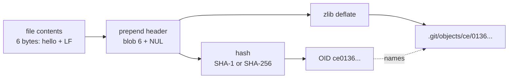
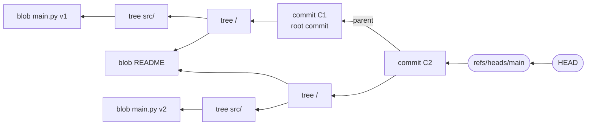
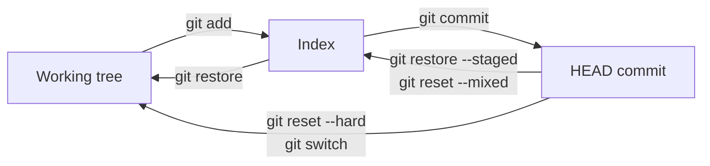
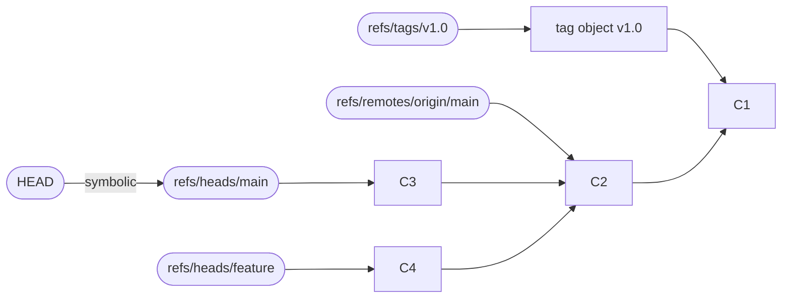

[Git Internals](./) ›

Git is a content-addressable object store with a version-control interface built on top. This page describes that store from the bottom up: how an object is named and encoded, the four object types and the graph they form, where objects and references live on disk, the index (staging area), and how everyday commands move data between HEAD, the index and the working tree. Packfiles and the network protocol are covered on the next page, [Protocols, Packs & Performance](protocols-and-performance.html).

## Content-Addressable Storage

The object database is a key-value store. The key is the hash of an object's contents, the *object ID* (OID); the value is the object itself. Nothing in the store can be edited in place: changing a single byte produces a different hash and therefore a different object.

Every object is hashed with a short header that records its type and size:

```text
<type> SP <size in bytes> NUL <content>
```

The OID is `SHA-1(header + content)` in a default repository, or `SHA-256(header + content)` in a SHA-256 repository. A *loose* object is that same byte string compressed with zlib and written to `.git/objects/<first 2 hex digits>/<remaining digits>`.



Three properties follow directly from this design:

| Property | Why it holds | Consequence |
|----------|--------------|-------------|
| **Deduplication** | Identical content always hashes to the same OID | A file that appears in 1,000 commits, or is copied or renamed, is stored once |
| **Integrity** | An OID is a checksum of the object it names | Corruption is detectable; `git fsck` re-hashes objects to verify them |
| **Tamper-evidence** | Commits and trees embed the OIDs of what they point to | A commit ID commits to its entire tree and history (a Merkle DAG) |

The OID of a blob depends only on its bytes, never on its filename or location. You can reproduce Git's hashing with a few lines of Python:

```python
import hashlib, zlib

content = b"hello\n"
header = f"blob {len(content)}\0".encode()

oid = hashlib.sha1(header + content).hexdigest()   # ce013625030ba8dba906f756967f9e9ca394464a
loose = zlib.compress(header + content)             # bytes stored under .git/objects/ce/
```

```bash
$ echo "hello" | git hash-object --stdin
ce013625030ba8dba906f756967f9e9ca394464a
```

> **Code reference:** [`content_addressable_storage.py`](../../../code-examples/technology/git/content_addressable_storage.py) implements the object model, Merkle trees and DAG operations in Python.

### Hash Functions: SHA-1 and SHA-256

Git was designed around SHA-1, which is no longer collision-resistant (the 2017 SHAttered attack produced two colliding PDFs, and the 2020 "Shambles" chosen-prefix attack made practical forgeries cheaper). Git's response has two parts:

| | SHA-1 repositories | SHA-256 repositories |
|---|---|---|
| **Status** | Default for new repositories in Git 2.x | Supported; opt-in with `git init --object-format=sha256` or `init.defaultObjectFormat=sha256` |
| **OID length** | 20 bytes (40 hex digits) | 32 bytes (64 hex digits) |
| **Collision defence** | Git uses a hardened SHA-1 implementation (SHA-1DC) that detects the known collision-attack patterns and refuses such objects | Collision resistance of SHA-256 itself |
| **Interoperability** | Works with every forge and tool | No interoperability with SHA-1 repositories yet: you cannot push a SHA-256 repository to a SHA-1 remote, and forge and library support is still limited |

The Git project plans to make SHA-256 the default for new repositories in Git 3.0, while keeping SHA-1 repositories fully supported. Work on a translation layer that maps between SHA-1 and SHA-256 names (so one repository can talk to both kinds of remotes) started in Git 2.45 and is still in progress as of Git 2.55. The Git documentation no longer expects incompatible changes to the SHA-256 format, so repositories created today should remain usable. See the [Git Internals hub](./) for the full list of planned Git 3.0 changes.

## The Four Object Types

| Object | Represents | Points to | Content |
|--------|------------|-----------|---------|
| **Blob** | File contents | Nothing | Raw bytes only; no name, mode or timestamp |
| **Tree** | One directory level | Blobs, sub-trees and (for submodules) commits | Sorted list of `(mode, name, OID)` entries |
| **Commit** | A snapshot plus its place in history | Exactly one tree and zero or more parent commits | Tree, parents, author, committer, optional signature, message |
| **Tag** (annotated) | A named, signable pointer | Any object, usually a commit | Target OID and type, tag name, tagger, message, optional signature |

A lightweight tag is not an object at all: it is only a reference under `refs/tags/` that points straight at a commit.

### Trees and File Modes

A tree is a binary list of entries, each encoded as `<mode> SP <name> NUL <raw OID bytes>`. `git cat-file -p` renders it in a readable form:

```bash
$ git cat-file -p 'HEAD^{tree}'
100644 blob 8ab686eafeb1f44702738c8b0f24f2567c36da6d    README.md
040000 tree 5c1b7a12e3d0c6f0b8e57a3d34b1f5e3a2cd9f10    src
160000 commit 3f2e1a0b9c8d7e6f5a4b3c2d1e0f9a8b7c6d5e4f   vendor/lib
```

Git records only a handful of modes; it does not store full Unix permissions, ownership or timestamps.

| Mode | Meaning |
|------|---------|
| `100644` | Regular file |
| `100755` | Executable file |
| `120000` | Symbolic link (the blob holds the link target) |
| `040000` | Sub-directory (a tree) |
| `160000` | Gitlink: a submodule, recorded as a commit OID in another repository |

Because a tree is itself hashed, an unchanged directory keeps its OID from one commit to the next, and its whole subtree is shared rather than copied. Comparing two trees can therefore skip any sub-tree whose OID has not changed, which is why `git diff` between distant commits of a large project is fast.

### Commits

A commit is a small text object:

```bash
$ git cat-file -p HEAD
tree 9c1f0d4b2e7a6c3d8f5e1a0b4c7d2e9f6a3b8c1d
parent 1e4a7c0f3b6d9e2a5c8f1b4d7e0a3c6f9b2d5e8a
author Jane Dev <jane@example.com> 1758528000 +0200
committer Jane Dev <jane@example.com> 1758528000 +0200
gpgsig -----BEGIN SSH SIGNATURE-----
 U1NIU0lHAAAAAQAAADMAAAALc3NoLWVkMjU1MTkAAAAg...
 -----END SSH SIGNATURE-----

Add greeting
```

| Header | Notes |
|--------|-------|
| `tree` | Exactly one; the full snapshot of the project |
| `parent` | None for a root commit, one for an ordinary commit, two or more for a merge |
| `author` / `committer` | Name, email, Unix timestamp and UTC offset. They differ after a rebase, cherry-pick or `git am`: the author wrote the change, the committer applied it |
| `gpgsig` | Optional OpenPGP, SSH or X.509 signature over the rest of the commit (see [Authentication & Access Control](auth-and-access-control.html)) |
| `encoding`, `mergetag` | Optional: non-UTF-8 message encoding, and embedded signed tags of merged commits |

A commit stores a complete snapshot, not a diff. Diffs are computed on demand by comparing trees, and delta compression happens separately, inside packfiles.

### Annotated Tags

```bash
$ git cat-file -p v2.0.0
object 1e4a7c0f3b6d9e2a5c8f1b4d7e0a3c6f9b2d5e8a
type commit
tag v2.0.0
tagger Jane Dev <jane@example.com> 1758528000 +0200

Release 2.0.0
-----BEGIN PGP SIGNATURE-----
...
```

The tag object carries its own name, author and optional signature, so a signed tag remains verifiable even if the `refs/tags/v2.0.0` reference is later moved or deleted.

## The Object Graph

Commits point to trees and parents; trees point to blobs and sub-trees. The result is a Merkle directed acyclic graph (DAG): history is the commit chain, and each commit roots a tree of the project at that moment. In the example below, commit C2 changed only `src/main.py`, so it reuses the `README` blob from C1 and only the changed path gets new tree and blob objects.



Two consequences are worth stating precisely:

- **History cannot be rewritten in place.** Amending a commit, rebasing or filtering history creates *new* commits with new IDs; the old ones remain in the object store until nothing references them and garbage collection removes them. This is what makes the reflog-based recovery described in [Conflict Resolution & Recovery](conflict-and-recovery.html) possible.
- **A commit ID authenticates everything beneath it.** Signing one commit (or tag) vouches for the whole tree and all ancestors, provided the hash function is collision-resistant.

### Building a Commit by Hand

`git add` and `git commit` are built from *plumbing* commands that can be run directly. The session below performs the same steps without the porcelain:

```bash
# 1. Write a blob into the object store
$ echo "hello" > greeting.txt
$ git hash-object -w greeting.txt
ce013625030ba8dba906f756967f9e9ca394464a

# 2. Stage it: add an index entry (mode, OID, path)
$ git update-index --add --cacheinfo 100644,ce013625030ba8dba906f756967f9e9ca394464a,greeting.txt

# 3. Turn the index into a tree object
$ git write-tree
57e9529754dc514a3ec10db2ff882018fbe1fcbf

# 4. Create a commit pointing at that tree (add -p <parent> for non-root commits)
$ git commit-tree 57e95297 -m "Add greeting"
a7c3...                      # depends on author, timestamp and message

# 5. Move the branch to the new commit
$ git update-ref refs/heads/main a7c3...

# Inspect any object
$ git cat-file -t ce013625   # blob
$ git cat-file -s ce013625   # 6 (bytes)
$ git cat-file -p ce013625   # hello
```

The blob and tree OIDs above are deterministic: anyone running these commands gets the same values. The commit OID differs per run because it includes the author and timestamp.

## On-Disk Layout

```text
.git/
├── HEAD                  # symbolic ref, e.g. "ref: refs/heads/main"
├── config                # repository-level configuration
├── index                 # the staging area (binary)
├── objects/
│   ├── ce/0136...        # loose objects: zlib-compressed, one file per object
│   ├── info/
│   │   ├── alternates    # optional: other object stores to borrow from
│   │   └── commit-graph  # optional: precomputed commit metadata
│   └── pack/
│       ├── pack-<hash>.pack     # many objects, delta-compressed
│       ├── pack-<hash>.idx      # OID -> offset lookup for one pack
│       ├── pack-<hash>.rev      # reverse index (offset -> position)
│       ├── pack-<hash>.bitmap   # optional reachability bitmaps
│       └── multi-pack-index     # optional: one lookup across all packs
├── refs/                 # "files" backend: one file per loose ref
│   ├── heads/            #   branches
│   ├── tags/
│   └── remotes/          #   remote-tracking branches
├── packed-refs           # "files" backend: many refs in one sorted file
├── reftable/             # "reftable" backend (replaces refs/ + packed-refs)
├── logs/                 # reflogs (files backend)
├── hooks/
└── info/exclude          # repository-local ignore rules
```

New objects are written loose. Over time, `git gc` or `git maintenance` moves them into packfiles, where similar objects are stored as deltas against each other; a mature repository keeps nearly all of its objects packed. Pack, index, bitmap and multi-pack-index formats are described in [Protocols, Packs & Performance](protocols-and-performance.html#pack-and-index-formats).

Two auxiliary structures speed up history walks without changing the object model:

- **commit-graph** caches each commit's tree, parents, commit date and *generation number* in a compact, memory-mappable file, so walks such as `git log --graph` or merge-base computation avoid inflating commit objects. It can also store *changed-path Bloom filters*, which let `git log -- <path>` skip commits that certainly did not touch the path.
- **alternates** let one repository read objects from another's store, which is how forges share objects between forks and how `git clone --reference` saves disk space.

Repositories are initialized with the formats fixed at creation time:

```bash
git init                                # SHA-1 objects, "files" ref backend
git init --bare                         # no working tree (servers, mirrors)
git init --object-format=sha256         # SHA-256 objects
git init --ref-format=reftable          # reftable ref storage (Git 2.45+)
```

## Index (Staging Area) Structure

The index, stored in `.git/index`, is a flat, sorted list of every tracked path together with the blob OID staged for it and a cached copy of the file's `stat()` data. It serves three purposes:

1. **The proposed next commit.** `git write-tree` (and therefore `git commit`) builds tree objects directly from it.
2. **A change-detection cache.** If a file's size, mtime, inode and other `stat` fields still match the cached values, `git status` assumes the file is unchanged and skips re-hashing it.
3. **Merge-conflict storage.** During a conflicted merge a path has up to three entries, at *stages* 1 (common ancestor), 2 (ours) and 3 (theirs), instead of the usual single stage-0 entry.

The file format (documented in `gitformat-index(5)`):

| Section | Contents |
|---------|----------|
| **Header** | Signature `DIRC` ("dircache"), version (2, 3 or 4), entry count |
| **Entries**, sorted by path | ctime and mtime (seconds and nanoseconds), dev, ino, mode, uid, gid, file size, object ID (20 or 32 bytes), 16-bit flags (including the merge stage and name length), and the path |
| **Extensions** | Optional, each tagged with a 4-byte signature and length (table below) |
| **Trailer** | Hash of everything above |

Versions differ only in entry encoding: version 3 adds extended flags (used for `skip-worktree` and `intent-to-add`), and version 4 prefix-compresses each path against the previous one, which substantially shrinks the index in repositories with deep directory trees.

| Extension | Signature | Purpose |
|-----------|-----------|---------|
| Cache tree | `TREE` | Tree OIDs for unchanged directories, so `write-tree` reuses them instead of rehashing |
| Resolve undo | `REUC` | Remembers conflicted stages after resolution so `git checkout -m` can recreate the conflict |
| Split index | `link` | Stores most entries in a shared base index and only changes in `.git/index`, making writes cheaper in huge repositories |
| Untracked cache | `UNTR` | Caches directory listings to speed up detection of untracked files |
| File system monitor | `FSMN` | Records the last token from a file-system watcher so only reported paths are re-checked |
| End of index entry / index entry offset table | `EOIE`, `IEOT` | Allow the index to be loaded with multiple threads |
| Sparse directory entries | `sdir` | Marks a *sparse index*, where whole directories outside a sparse-checkout cone are represented by a single tree entry |

With the built-in file-system monitor (`core.fsmonitor=true`, available on macOS and Windows and, since Git 2.55, on Linux) and a sparse index, `git status` in a very large monorepo touches only the files that actually changed rather than every tracked path.

```bash
git ls-files --stage              # mode, OID, stage number, path
git ls-files --debug README.md    # cached stat fields for one entry
git update-index --index-version 4
```

## The Three Trees

Most day-to-day commands move content between three snapshots of the project, conventionally called the "three trees":

| Tree | Stored in | Represents | Updated by |
|------|-----------|------------|------------|
| **HEAD** | The commit that `HEAD` resolves to | The last committed snapshot | `git commit`, `git reset`, `git switch` |
| **Index** | `.git/index` | The proposed next snapshot | `git add`, `git restore --staged`, `git reset` |
| **Working tree** | Files on disk | Your current edits | Your editor, `git restore`, `git switch` |



`git status` is a comparison of the three: "Changes to be committed" is HEAD versus the index, and "Changes not staged for commit" is the index versus the working tree. `git diff` shows index versus working tree; `git diff --staged` shows HEAD versus index.

`git reset <commit>` always moves the current branch (and so HEAD) to `<commit>`; its three modes differ only in how far the change propagates:

| Command | Moves branch/HEAD | Resets index | Resets working tree |
|---------|:-----------------:|:------------:|:-------------------:|
| `git reset --soft` | Yes | No | No |
| `git reset --mixed` (default) | Yes | Yes | No |
| `git reset --hard` | Yes | Yes | Yes |

`--soft` keeps the undone commits' changes staged, which is the usual way to squash the last few commits. `--hard` discards uncommitted work in tracked files and is the only one of the three that can destroy data that was never committed. Commits that `reset` moves away from remain reachable through the reflog.

## References

A reference ("ref") is a human-readable name for an OID. Branches, tags and remote-tracking branches are all refs; they are the only mutable part of a repository, and the only way objects stay reachable.

| Kind | Namespace | Points to | Moved by |
|------|-----------|-----------|----------|
| Branch | `refs/heads/*` | A commit | `commit`, `merge`, `reset`, `rebase` |
| Tag | `refs/tags/*` | A commit (lightweight) or a tag object (annotated) | Not moved by convention |
| Remote-tracking branch | `refs/remotes/<remote>/*` | The last known position of a remote branch | `fetch` |
| Notes, stash, others | `refs/notes/*`, `refs/stash`, ... | Commits used by those features | Their respective commands |
| Symbolic ref | `HEAD` and others | Another ref, e.g. `ref: refs/heads/main` | `switch`, `checkout` |
| Pseudo-refs | `FETCH_HEAD`, `ORIG_HEAD`, `MERGE_HEAD`, `CHERRY_PICK_HEAD` | OIDs recorded by an operation in progress | The operation itself |

When `HEAD` holds an OID instead of a symbolic ref, the repository is in *detached HEAD* state: new commits are made, but no branch moves to include them.



### Ref Storage Backends

Git has two ways to store refs. A repository uses one or the other, chosen at `git init` time or converted later.

| | `files` backend (default in Git 2.x) | `reftable` backend (Git 2.45+) |
|---|---|---|
| **Layout** | One file per loose ref under `refs/`, plus a sorted `packed-refs` file | A stack of binary, block-based tables in `reftable/`, listed in `tables.list` |
| **Reflogs** | Separate text files under `logs/` | Stored in the same tables |
| **Atomic multi-ref updates** | Per-ref lock files; a crash mid-transaction can leave a partial update | One new table per transaction, so updates are atomic |
| **Deleting one ref from many** | Rewrites all of `packed-refs` | Writes a small tombstone record |
| **Case-insensitive filesystems** | `refs/heads/Foo` and `refs/heads/foo` collide on macOS and Windows | No collisions; names are data, not filenames |
| **Scale** | Slows down with hundreds of thousands of refs | Prefix compression and binary search keep lookups fast; tables are compacted geometrically |

The reftable format originated in JGit and is used by large Git hosts. Git 2.51 declared it mature enough to become the default for new repositories in Git 3.0. Existing repositories can be converted in place:

```bash
git refs migrate --ref-format=reftable      # Git 2.46+; not yet for repositories with worktrees
git rev-parse --show-ref-format             # "files" or "reftable"
```

### Updating Refs Safely

Whatever the backend, ref updates go through a *ref transaction*. Each update can carry an expected old value, making it a compare-and-swap: if another process moved the ref first, the update fails instead of silently overwriting it. `git update-ref --stdin` exposes transactions to scripts, and `git push --atomic` asks the server to apply all ref updates of a push together or not at all.

Every change to a branch or to `HEAD` is also appended to its *reflog*, a local-only history of where the ref has pointed. Reflog entries keep otherwise-unreachable commits alive (90 days by default for reachable entries, 30 days for unreachable ones), which is the safety net behind `git reset`, `git rebase` and `git commit --amend`.

```bash
git reflog show main                        # where main has pointed
git update-ref refs/heads/main NEW OLD      # only succeeds if main is currently OLD
git for-each-ref --format='%(refname) %(objectname:short)' refs/heads/
```

> **Code reference:** [`object_storage.py`](../../../code-examples/technology/git/object_storage.py) models loose objects, packs and index structures, and [`reference_management.py`](../../../code-examples/technology/git/reference_management.py) implements atomic ref transactions.

## Repository Configuration

Configuration is read from several files, with later levels overriding earlier ones:

| Level | File | Option |
|-------|------|--------|
| System | `/etc/gitconfig` (path varies by install) | `git config --system` |
| Global (user) | `~/.gitconfig` or `~/.config/git/config` | `git config --global` |
| Repository | `.git/config` | `git config --local` (default when writing) |
| Worktree | `.git/worktrees/<name>/config.worktree` | `git config --worktree` (requires `extensions.worktreeConfig`) |
| Command line | `git -c key=value ...` | Applies to one invocation |

`include.path` and `includeIf.<condition>.path` pull in other files, for example to use a work email address only for repositories under `~/work/`. `git config list --show-origin` shows each value together with the file it came from.

Settings that relate to the object and ref model:

```bash
git config --global init.defaultBranch main          # Git 3.0 will default to "main"
git config --global init.defaultObjectFormat sha256  # hash for new repositories (Git 2.47+)
git config --global init.defaultRefFormat reftable   # ref backend for new repositories (Git 2.47+)
git config --global core.fsmonitor true              # built-in filesystem watcher
git config --global index.skipHash true              # skip the index trailer hash (faster writes on big indexes)
git config --global core.autocrlf input              # normalise CRLF to LF on commit (Linux/macOS)
```

For day-to-day command syntax, see the [Git Command Reference](../git-reference.html).

---

**Next:** [Protocols, Packs & Performance →](protocols-and-performance.html): how objects are packed, transferred over the network, and kept fast in large repositories. **Up:** [Git Internals](./).

## See Also

- [Protocols, Packs &amp; Performance](protocols-and-performance.html): packfiles, the wire protocol and repository maintenance
- [Algorithms &amp; Advanced Operations](algorithms-and-operations.html): merge, rebase and bisect, built on this object model
- [Conflict Resolution &amp; Recovery](conflict-and-recovery.html): using the reflog and `fsck` to recover lost commits
- [Git Command Reference](../git-reference.html): the day-to-day commands that manipulate these objects
