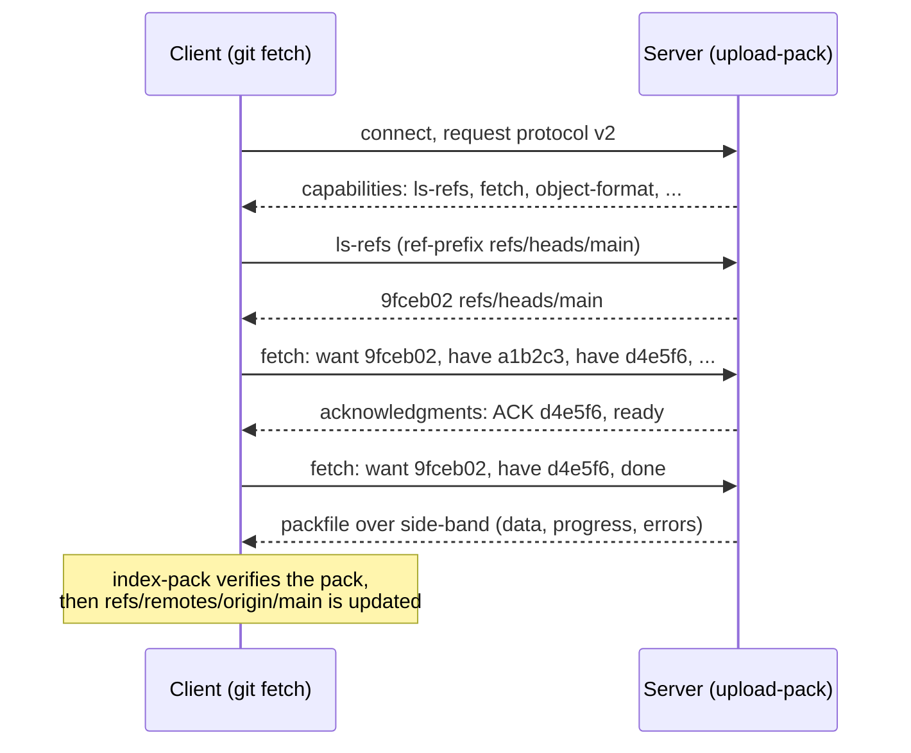
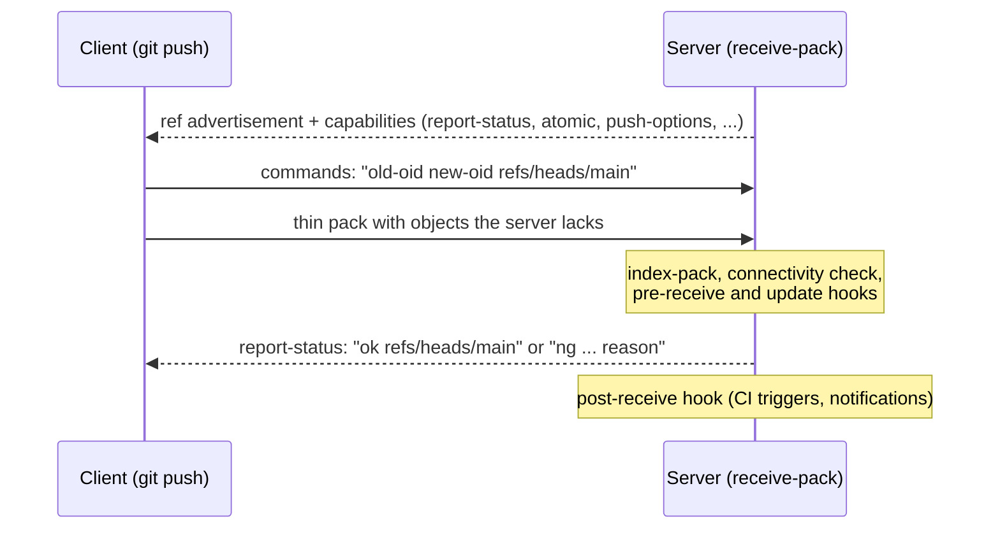
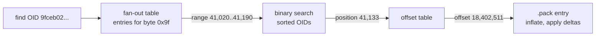

[Git Internals](./) ›

The [object model](object-model.html) explains what Git stores; this page explains how it moves and compacts that data. It covers the transports and the wire protocol, the negotiation that lets a fetch or push send only missing objects, the packfile and its auxiliary indexes, delta compression, and the maintenance and partial-clone features that keep repositories with millions of objects usable. Versions cited are current as of Git 2.55 (June 2026).

## Transports

Git can reach a remote repository in several ways. All of the "smart" transports run the same protocol; they differ only in how bytes get to the server-side `git upload-pack` (for fetch) or `git receive-pack` (for push) process.

| Transport | URL form | Authentication | Notes |
|-----------|----------|----------------|-------|
| **Smart HTTP(S)** | `https://host/repo.git` | HTTP auth, tokens, credential helpers | Most common; stateless request/response, works through proxies and CDNs |
| **SSH** | `git@host:repo.git`, `ssh://host/repo.git` | SSH keys | One long-lived bidirectional connection |
| **Local** | `/path/to/repo`, `file:///path` | Filesystem permissions | Plain paths hard-link objects on the same filesystem; `file://` uses the normal protocol |
| **Git daemon** | `git://host/repo.git` | None | Unauthenticated and unencrypted; read-only mirrors only |
| **Dumb HTTP** | `https://host/repo.git` | HTTP auth | Legacy: the client downloads raw files; no negotiation |

Authentication details (SSH keys, tokens, credential helpers) are covered in [Authentication & Access Control](auth-and-access-control.html).

## Protocol Versions

The original protocol (v0, and v1, which only adds a version line) begins with the server advertising **every ref** it has. For a repository with hundreds of thousands of refs (forges store one ref per pull request), that advertisement alone can be megabytes, even when the client wants a single branch.

**Protocol v2** fixes this by making the conversation command-based: after a short capability advertisement, the client issues explicit commands and asks only for the refs it needs. It has been the default for fetch and clone since Git 2.26 (2020), and it falls back to v0 automatically when a server does not support it.

| | v0 / v1 | v2 |
|---|---|---|
| **First message** | Server lists all refs plus capabilities | Server lists capabilities and commands only |
| **Ref listing** | Always complete | `ls-refs` with prefix filters (for example, only `refs/heads/main`) |
| **Structure** | One monolithic exchange per service | Separate commands: `ls-refs`, `fetch`, `object-info`, `bundle-uri` |
| **Extensibility** | New capabilities squeezed into the ref advertisement | New commands and arguments without breaking old clients |
| **Push** | Supported | Not defined; `git push` still uses the v0 `receive-pack` exchange |

```bash
git config --global protocol.version 2              # already the default
GIT_TRACE_PACKET=1 git ls-remote origin main        # watch the pkt-line exchange
```

All versions frame messages as *pkt-lines*: a 4-hex-digit length prefix followed by the payload. The special packet `0000` (flush) ends a section, and in v2 `0001` (delimiter) separates the parts of a command.

## Fetching: Want/Have Negotiation

A fetch has to answer one question cheaply: which objects does the server have that the client lacks? The client does not list its objects. Instead it names the commits it *wants* (the remote ref tips it is missing) and the commits it *has* (its own recent commits). Once the server finds enough common commits, it knows that everything reachable from a common commit is already on the client, and sends a pack containing only the rest.



Key details:

- **Haves are sent in batches**, newest first. The default `consecutive` negotiation walks back one commit at a time; `fetch.negotiationAlgorithm=skipping` jumps exponentially further back, converging faster on long divergent histories at the cost of a possibly larger pack.
- **The server replies `ready`** when it has found a common base for every want. The client then sends `done` and receives the pack.
- **Side-band multiplexing** carries the pack on channel 1, progress messages on channel 2 and fatal errors on channel 3 over the same stream.
- **Reachability bitmaps** (below) let the server compute "objects reachable from the wants but not from the haves" as a bitmap subtraction instead of walking the graph, which is what makes clones of very large repositories fast to start.
- **Pack reuse**: when bitmaps are available, the server can send whole runs of an existing packfile verbatim instead of re-deltifying objects.

> **Code reference:** [`remote_protocol.py`](../../../code-examples/technology/git/remote_protocol.py) simulates pack negotiation and delta compression, and [`repository_operations.py`](../../../code-examples/technology/git/repository_operations.py) models clone, fetch and push.

## Pushing

Push runs in the other direction against `git receive-pack`, and uses the v0-style exchange even when fetches use v2.



- Each command carries the ref's **expected old value**, so a push is a compare-and-swap. A non-fast-forward update is rejected unless forced; `--force-with-lease` makes a forced push fail if the remote ref moved since you last fetched it.
- The client sends a **thin pack**: deltas may refer to base objects the server already has but that are not in the pack. The server "fixes" the pack by appending those bases before storing it.
- `git push --atomic` requests that all ref updates in one push succeed or fail together. Without it, each ref is updated independently.
- Server-side hooks (`pre-receive`, `update`, `post-receive`) enforce policy such as protected branches, signed commits or secret scanning; see [Algorithms & Advanced Operations](algorithms-and-operations.html#hooks) for hook mechanics.

### Capabilities Worth Knowing

| Capability | Direction | Purpose |
|------------|-----------|---------|
| `side-band-64k` | Both | Multiplex pack data, progress and errors |
| `ofs-delta` | Both | Allow deltas that reference their base by pack offset (smaller than by OID) |
| `thin-pack` | Both | Allow deltas against objects the receiver already has |
| `shallow`, `deepen-since`, `deepen-not` | Fetch | Truncated-history clones |
| `filter` | Fetch | Partial clone: omit objects matching a filter |
| `object-format` | Both | Negotiate SHA-1 or SHA-256 |
| `bundle-uri` | Fetch (v2) | Point the client at pre-built bundles to download first |
| `promisor-remote` | Fetch (v2) | Advertise additional remotes (for example, large-object stores) that can serve missing objects |
| `atomic`, `push-options`, `report-status` | Push | All-or-nothing pushes, free-form options for server hooks, per-ref results |

## Pack and Index Formats

A packfile stores many objects in one file, most of them as deltas against similar objects. Each `.pack` is accompanied by an `.idx` (and usually a `.rev`) with the same hash in its name.

### The Packfile (`.pack`)

```text
+---------------------------------------------------+
| "PACK" | version (2) | object count (32-bit)       |  12-byte header
+---------------------------------------------------+
| type+size (varint) | [delta base] | zlib data     |  object 1
| type+size (varint) | [delta base] | zlib data     |  object 2
| ...                                               |
+---------------------------------------------------+
| checksum of all of the above                      |  20 bytes (SHA-1) or 32 (SHA-256)
+---------------------------------------------------+
```

Git reads pack versions 2 and 3 but writes only version 2. Each entry starts with a variable-length header whose first byte holds a 3-bit type and the low bits of the uncompressed size; further bytes (7 bits each) extend the size. Unlike loose objects, packed objects omit the `<type> <size>\0` header; Git reconstructs it when computing an object's ID.

| Type | Code | Stored as |
|------|:----:|-----------|
| `OBJ_COMMIT` | 1 | Whole object, zlib-compressed |
| `OBJ_TREE` | 2 | Whole object |
| `OBJ_BLOB` | 3 | Whole object |
| `OBJ_TAG` | 4 | Whole object |
| `OBJ_OFS_DELTA` | 6 | Delta; base identified by a negative offset within this pack |
| `OBJ_REF_DELTA` | 7 | Delta; base identified by its object ID (used in thin packs) |

### Delta Encoding

A delta is a small program that rebuilds the target object from a base. It starts with the base and target sizes, followed by two kinds of instruction:

| Instruction | First byte | Meaning |
|-------------|------------|---------|
| **Copy** | `1xxxxxxx` | Copy `size` bytes starting at `offset` in the base. The seven low bits say which of up to 4 offset bytes and 3 size bytes follow |
| **Insert** | `0xxxxxxx` (non-zero) | Append the next 1-127 literal bytes carried in the instruction |

For example, a 10 KB source file where one line changed typically becomes: copy the first 6,000 bytes, insert the new line, copy the remaining bytes. That is a few dozen bytes instead of 10 KB. Git finds matching regions with a Rabin-style rolling hash over 16-byte blocks of the base.

Deltas can chain: a base may itself be a delta. The chain length is capped by `pack.depth` (default 50), trading smaller packs against the CPU cost of resolving long chains on read. Git usually deltifies older versions against newer ones, so the most recently used versions are the cheapest to read.

### The Pack Index (`.idx`)

A pack is only useful if an object can be found without scanning it. The version-2 index provides that lookup:

| Section | Contents |
|---------|----------|
| Header | Magic `\377tOc`, version 2 |
| Fan-out table | 256 counts: entry *i* is the number of objects whose first byte is at most *i* |
| Object names | All object IDs in the pack, sorted |
| CRC32 table | Checksum of each packed entry, so data can be copied between packs during a repack without silently propagating corruption |
| Offsets | 4-byte pack offsets; if the high bit is set, the value indexes the 8-byte table instead (for packs over 2 GiB) |
| Large offsets | 8-byte offsets |
| Trailer | Pack checksum and index checksum |

Looking up an object is a fan-out lookup on its first byte, which narrows the search to about 1/256 of the table, followed by a binary search in that slice, and then a jump to the offset in the pack.



### Companion Files

| File | Purpose |
|------|---------|
| `pack-*.rev` | Reverse index: maps pack position to index position, so "which object is at offset X" and on-disk ordering are cheap (written by default) |
| `pack-*.bitmap` | Reachability bitmaps for selected commits (below) |
| `pack-*.mtimes` | Per-object modification times for a *cruft pack*, which holds unreachable objects until they expire |
| `pack-*.keep`, `pack-*.promisor` | Markers: do not repack this pack; objects here came from a promisor remote (partial clone) |
| `multi-pack-index` | One sorted OID index across many packs (below) |

The on-disk format of the staging-area index (`.git/index`) is a different file with a similar name; it is described in [Object Model & Storage](object-model.html#index-staging-area-structure).

## How `pack-objects` Chooses Deltas

`git pack-objects` builds every pack, whether for a push, a fetch response or a local repack. Finding a good base for each object is the expensive part, so Git uses heuristics:

1. **Enumerate** the objects to pack (by walking history, or from bitmaps).
2. **Sort** candidates by type, then by a hash of their path name, then by size, so versions of the same file end up next to each other.
3. **Slide a window** (`pack.window`, default 10) over the sorted list and try each object against the others in the window as a delta base, keeping the smallest result that respects `pack.depth`.
4. **Reuse** existing deltas from source packs wherever possible instead of recomputing them. `git repack -f` forces recomputation.

The weak point is step 2. The classic name hash is dominated by the last characters of the path, so in monorepos with many files named `index.js` or `CHANGELOG.md` in different directories, unrelated files collide and good bases fall outside the window. Two recent options address this:

| Option | Since | Effect |
|--------|-------|--------|
| `--name-hash-version=2` (`pack-objects`, `repack`) | Git 2.49 | A path hash that also considers directory names, reducing collisions between same-named files |
| `--path-walk` (`pack-objects`, `repack`) | Git 2.51, extended in 2.55 | Walk objects grouped by full path, delta each path's versions against each other, then run a normal cross-path pass. Can shrink packs of repositories with many same-named files considerably; since 2.55 it works with blobless and sparse filters |

**Delta islands** (`pack.island`) solve a different problem on servers that store many forks in one object pool: they restrict deltas to bases that belong to the same fork, so a fetch of one fork never has to send an object whose base only exists in another.

## Structures for Fast Graph Queries

Large repositories are slow mainly because common operations need to walk millions of commits and objects. Git keeps several optional, rebuildable caches alongside the object store to avoid that.

| Structure | Answers | How |
|-----------|---------|-----|
| **commit-graph** | "What are this commit's parents, tree and date?", "Can A reach B?" | Fixed-width records per commit, plus *generation numbers* (corrected commit dates) that let walks stop early; can be split into incremental layers |
| **Changed-path Bloom filters** | "Did this commit touch `path`?" | A Bloom filter per commit stored in the commit-graph; `git log -- path` skips commits that definitely did not change the path |
| **Reachability bitmaps** | "Which objects are reachable from these commits?" | One EWAH-compressed bitmap per selected commit, one bit per object in the pack (or MIDX); set operations replace graph walks for clone, fetch and `rev-list --count` |
| **Multi-pack index (MIDX)** | "Where is object X?" across many packs | One sorted index spanning all packs, avoiding a lookup per pack; can carry its own bitmaps and, since Git 2.50, be written incrementally as a chain of layers |
| **Pseudo-merge bitmaps** | Reachability from thousands of ref tips at once | Precomputed bitmaps for groups of refs (Git 2.46+), useful on servers with very many refs |

```bash
git commit-graph write --reachable --changed-paths
git config commitGraph.changedPaths true        # write Bloom filters by default (Git 2.52+)
git multi-pack-index write --bitmap
git rev-list --count --all --use-bitmap-index
```

## Repository Maintenance

Loose objects accumulate with every commit and fetch, packs multiply, and caches go stale. Two front-ends clean this up:

- **`git gc`** runs as a foreground `--auto` check after many commands and does everything at once: packs refs, consolidates packs, writes a cruft pack for unreachable objects and prunes expired ones. On large repositories the all-into-one repack can take minutes.
- **`git maintenance`** splits the work into independent tasks that can run incrementally, on a schedule, in the background.

| Task | What it does |
|------|--------------|
| `commit-graph` | Incrementally updates the commit-graph |
| `prefetch` | Fetches from remotes into `refs/prefetch/` so the user's next `git fetch` has little to download (does not touch `refs/remotes/`) |
| `loose-objects` | Packs loose objects in batches and deletes the loose copies |
| `incremental-repack` | Uses the MIDX to expire unreferenced packs and combine small ones, without an all-into-one repack |
| `gc` | Runs `git gc` |
| `pack-refs`, `reflog-expire`, `worktree-prune`, `rerere-gc` | Housekeeping for refs, reflogs, worktrees and conflict-resolution records |

Which tasks run is controlled by `maintenance.strategy`:

| Strategy | Behaviour |
|----------|-----------|
| `geometric` | Geometric repacking plus keeping auxiliary data up to date and expiring reflogs; recommended for large repositories and the default for manual `git maintenance run` since Git 2.54 |
| `incremental` | Set by `git maintenance register`/`start`: hourly `prefetch` and `commit-graph`, daily `loose-objects` and `incremental-repack`, weekly `pack-refs`; never runs `gc` |
| `gc` | The classic behaviour: run `git gc` |
| `none` | Nothing, unless tasks are enabled individually |

**Geometric repacking** (`git repack --geometric=2 -d`) keeps packs in a geometric progression by object count: each pack must hold at least twice as many objects as the next smaller one. A new small pack is merged only with the small packs above it until the progression holds again, so the cost of a repack is proportional to recent growth rather than to repository size. Git 2.55 extends this with an incremental repack strategy that compacts MIDX layers without ever repacking everything into one pack.

```bash
# Scheduled, background maintenance (systemd timers, launchd, cron or Task Scheduler)
git maintenance start
git maintenance run --task=commit-graph --task=incremental-repack
git maintenance is-needed                  # Git 2.53+: report whether tasks are due

# Manual, heavier operations
git repack --geometric=2 -d --write-midx   # incremental consolidation
git repack -a -d -f --window=250 --depth=50 --path-walk   # full re-delta; slow, occasionally worthwhile
git gc --prune=now                         # only when no other Git process is running
```

`git gc --aggressive` recomputes every delta with a window of 250; it can shrink a repository imported from another VCS, but on ordinary repositories it is rarely worth its cost. Pruning with `--prune=now` while another process is writing objects can corrupt the repository, which is why the default grace period is two weeks.

> **Code reference:** [`performance_optimization.py`](../../../code-examples/technology/git/performance_optimization.py) models geometric repacking, bitmap selection and pack statistics.

## Working with Large Repositories

No single technique makes a huge repository fast; each one trims a different dimension.

| Technique | Trims | Command | Trade-off |
|-----------|-------|---------|-----------|
| **Shallow clone** | History depth | `git clone --depth=1` | Cheap for CI; `log`, `blame` and merge-base computation stop at the boundary, and deepening later is expensive for the server |
| **Blobless partial clone** | Historical file contents | `git clone --filter=blob:none` | Full history of commits and trees; blobs are fetched on demand, so `blame` or diffs of old revisions trigger downloads |
| **Treeless partial clone** | Historical trees and blobs | `git clone --filter=tree:0` | Smallest clone with full commit history; most history operations fetch trees on demand. Best for build machines that only check out |
| **Size-limited clone** | Large files | `--filter=blob:limit=1m` | Useful when a few binary files dominate |
| **Sparse checkout** | Files in the working tree | `git sparse-checkout set <dirs>` | Cone mode (the default) matches whole directories and is fast; combine with a blobless clone so unused blobs are never downloaded |
| **Sparse index** | Size of `.git/index` | `git sparse-checkout set --sparse-index <dirs>` | Directories outside the cone are single index entries |
| **Filesystem monitor** | `stat()` calls in `status` | `git config core.fsmonitor true` | Built-in daemon on macOS, Windows and (since 2.55) Linux |
| **Bundle URIs** | Server CPU on clone | `git clone --bundle-uri=<url>` | Client first downloads a pre-built bundle (often from a CDN), then fetches only the rest |
| **Git LFS** | Large binaries in history | `git lfs track "*.psd"` | Separate storage service; pointer files in Git |

In a blobless clone, missing blobs are fetched one at a time as commands need them, which is slow for operations that touch many files. **`git backfill`** (Git 2.49+) downloads them in batches up front, grouped by path so the server can send good deltas; since Git 2.54 it accepts revision and pathspec arguments to limit what it fetches.

```bash
# Monorepo-style setup: full history, no historical blobs, only the needed directories
git clone --filter=blob:none --sparse https://example.com/big/repo.git
cd repo
git sparse-checkout set services/payments libs/common
git backfill                        # optional: prefetch blobs for the checked-out paths' history

# Or let scalar apply the recommended settings (partial clone, sparse checkout,
# fsmonitor, background maintenance) in one step
scalar clone https://example.com/big/repo.git
```

`scalar`, shipped with Git since 2.38, is a thin wrapper that configures the features above for large repositories and registers the clone for background maintenance.

### Diagnosing Repository Size and Speed

```bash
git count-objects -vH                 # loose vs packed objects, size on disk
git repo structure                    # Git 2.52+: counts and sizes of refs and objects
git verify-pack -v .git/objects/pack/pack-*.idx | sort -k3 -n | tail   # largest objects
GIT_TRACE2_PERF=1 git status          # per-phase timings
GIT_TRACE_PACKET=1 git fetch          # protocol traffic
```

For a deeper audit (largest blobs, widest trees, longest delta chains), the third-party `git-sizer` tool reports repository metrics against thresholds known to cause trouble at hosting providers.

---

**Previous:** [← Object Model & Storage](object-model.html). **Next:** [Algorithms & Advanced Operations →](algorithms-and-operations.html): merge-base computation, three-way merge, rebase, bisect and other history operations.

## See Also

- [Object Model &amp; Storage](object-model.html): the objects and on-disk layout these protocols transfer
- [Algorithms &amp; Advanced Operations](algorithms-and-operations.html): merge, rebase and bisect
- [Authentication &amp; Access Control](auth-and-access-control.html): credentials for SSH and HTTPS remotes
- [Git Command Reference](../git-reference.html): clone, fetch, push, gc and maintenance command syntax
