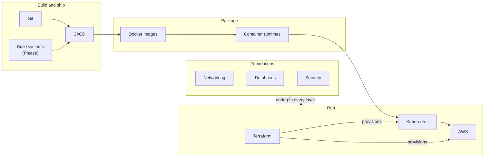

  <h1 style="color: white; margin: 0; font-size: 2.5rem;">Technology Documentation Hub</h1>
  
A reference library for DevOps, cloud, data, and modern software infrastructure

This section is a reference library for the software delivery stack. It starts with the network, storage, and security foundations an application depends on, moves through the version control, build, and CI/CD tooling that ships it, and ends with the containers, orchestration, infrastructure-as-code, and cloud platforms that run it in production. The pages are written as references rather than tutorials: they explain how each system works, give current commands and configuration, and compare the alternatives where there is a real choice to make.

Topics that span several technologies, such as distributed systems, API design, observability, and testing, have their own hubs, listed under [Related sections](#related-sections).

## How the topics fit together

Code lives in **Git**. A **CI/CD** pipeline, often driven by a build system, tests it and packages it as a **container image**. A **container runtime** executes the image, **Kubernetes** schedules containers across machines, and **Terraform** provisions the **AWS** infrastructure underneath. **Networking**, **databases**, and **security** apply at every layer.

## Foundations

| Topic | Covers |
|-------|--------|
| [Networking](networking/) | The TCP/IP stack, transport protocols (TCP, QUIC, HTTP/3), routing, congestion control, wireless, cloud networking, and programmable networks |
| [Database Crash Course](database-crash-course.html) | Relational concepts and SQL essentials: the quick on-ramp |
| [Database Design](database-design/) | Modeling and normalization, indexing and query execution, transactions and concurrency, storage internals, replication, distributed SQL, and NoSQL data models |
| [Cybersecurity](cybersecurity/) | Applied cryptography, attack techniques and defenses, application and cloud security, security operations, incident response, compliance, and privacy engineering |

## Version control and delivery

| Topic | Covers |
|-------|--------|
| [Git Crash Course](git-crash-course.html) | The fastest route to working with Git: the everyday workflow and the mental model behind it |
| [Git Internals](git/) | The object model, the commit DAG, merge and rebase algorithms, transfer protocols, and recovery |
| [Git Command Reference](git-reference.html) | Lookup tables for common commands, with syntax and examples |
| [Git Branching Strategies](branching.html) | GitHub Flow, GitLab Flow, Git Flow, and trunk-based development compared, with a decision guide |
| [Advanced Branching Techniques](advanced-branching-techniques.html) | Feature flags, rulesets and merge queues, stacked pull requests, and release and hotfix branches |
| [CI/CD](ci-cd/) | Pipeline design, test stages, deployment strategies (blue-green, canary), GitOps, and pipeline security |
| [Please Build](please-build.html) | A Bazel-style build system for polyglot monorepos: build graph, caching, remote execution, and querying |

## Containers and infrastructure

| Topic | Covers |
|-------|--------|
| [Docker](docker/) | Images, Dockerfiles, networking, storage, registries, security, and design patterns |
| [Docker Essentials](docker-essentials.html) | A command cheat sheet for running, building, Compose, networking, and cleanup |
| [Container Runtimes](container-runtimes.html) | The layers beneath Docker: OCI specifications, runc and crun, containerd and CRI-O, gVisor, Kata, Firecracker, and WebAssembly |
| [Kubernetes](kubernetes/) | Cluster architecture, workloads, networking, storage, resource management, and day-2 operations |
| [Terraform](terraform/) | Infrastructure as code: core workflow, state and modules, patterns, and advanced usage (including OpenTofu) |
| [AWS](aws/) | Compute, storage, databases, networking, security, monitoring, cost management, and reference architectures |

## AI and emerging technology

| Topic | Covers |
|-------|--------|
| [AI Fundamentals (Simplified)](ai-fundamentals-simple.html) | A plain-language introduction to AI, machine learning, and large language models, with no mathematics |
| [AI Deep Dive](ai-lecture-2023.html) | How transformers and LLMs work: attention, pre-training and post-training, inference, retrieval, agents, and LLM security |
| [AI & Machine Learning](ai/) | The full technical treatment: ML foundations, deep learning architectures and theory, generative models, reinforcement learning, and fine-tuning |
| [Quantum Computing](quantumcomputing.html) | Qubits and gates, the main algorithms and their real speedups, error correction, hardware platforms, and programming today's machines |
| [Unreal Engine](unreal.html) | Real-time 3D with UE5: Nanite, Lumen, the gameplay framework, and Blueprints |

Multi-page topics (Docker, Kubernetes, Terraform, AWS, CI/CD, Git internals, networking, databases, cybersecurity, and AI) live in their own subdirectories, and the links above go to each section's landing page.

## Learning paths

| Goal | Suggested order |
|------|-----------------|
| New to software infrastructure | [Networking](networking/) → [Database Crash Course](database-crash-course.html) → [Git Crash Course](git-crash-course.html) → [Docker](docker/) |
| DevOps / platform engineering | [Git](git/) → [Branching Strategies](branching.html) → [CI/CD](ci-cd/) → [Docker](docker/) → [Kubernetes](kubernetes/) → [Terraform](terraform/) |
| Cloud architecture | [Networking](networking/) → [AWS](aws/) → [Terraform](terraform/) → [Kubernetes](kubernetes/), with [Cybersecurity](cybersecurity/) throughout |
| Backend and data | [Database Design](database-design/) → [Distributed Systems](../distributed-systems/) → [API Design](../api-design/) |
| Large codebases | [Git Internals](git/) → [Monorepos](../advanced/monorepo/) → [Please Build](please-build.html) → [CI/CD](ci-cd/) |
| AI | [AI Fundamentals](ai-fundamentals-simple.html) → [AI Deep Dive](ai-lecture-2023.html) → [AI & Machine Learning](ai/) → [Generative AI hub](../ai-ml/) |

## Related sections

- [Distributed Systems](../distributed-systems/): consensus, replication, consistency, resilience, and service discovery
- [API Design](../api-design/): REST, GraphQL, gRPC, and asynchronous APIs
- [Event-Driven Architecture](../event-driven/): message brokers and event patterns
- [Observability](../observability/): logging, metrics, and distributed tracing
- [Software Testing](../testing/): unit, integration, and advanced testing techniques
- [Monorepos](../advanced/monorepo/): scaling a single repository, with tooling comparisons
- [Generative AI](../ai-ml/): Stable Diffusion, ComfyUI, LoRA training, and ML operations
- [Quantum Computing Hub](../quantum-computing/): learning paths from quantum theory to programming
- [Reference Sheets](../reference/): quick command and configuration cheat sheets
- [Physics](../physics/): the quantum mechanics and condensed-matter physics behind the hardware
