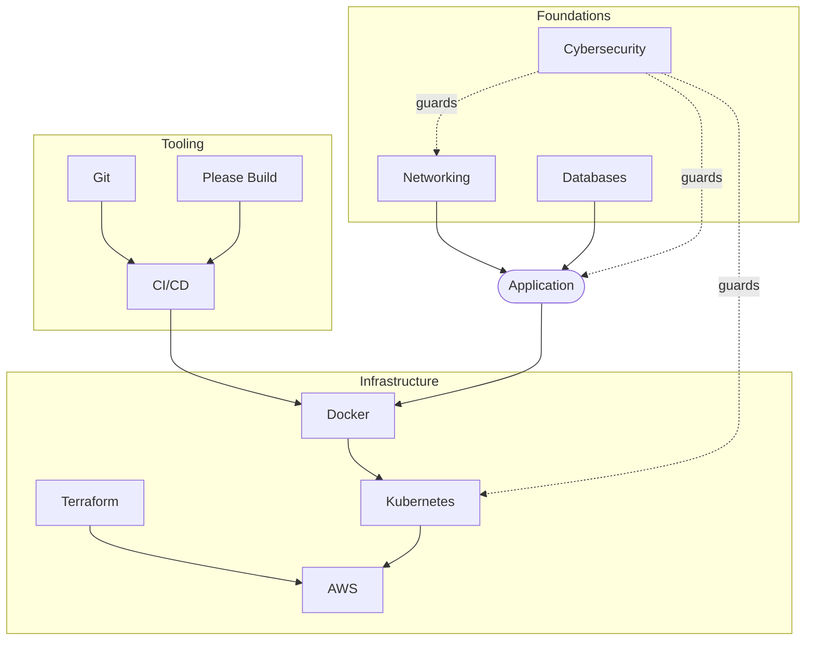

  <h1 style="color: white; margin: 0; font-size: 2.5rem;">Technology Documentation Hub</h1>
  
A reference library for DevOps, cloud, data, and modern software infrastructure

  
This is a practical, reference-oriented knowledge base spanning the full software delivery stack — from the network packets and database rows beneath an application, through the version control and CI/CD that ship it, up to the containers, orchestration, and cloud platforms that run it in production. Pages favor concrete commands, comparison tables, and decision guidance over tutorials.

  

    <i class="fas fa-layer-group"></i>
    <h4>Full Stack</h4>
    
Foundations, tooling, data, and infrastructure in one place

  

  

    <i class="fas fa-terminal"></i>
    <h4>Command-First</h4>
    
Copy-paste examples, cheat sheets, and config snippets

  

  

    <i class="fas fa-route"></i>
    <h4>Decision Guidance</h4>
    
When to use X vs Y, with comparison tables and trade-offs

  

## Browse by Area

### Infrastructure & DevOps

  

    <h4><a href="docker/">Docker</a></h4>
    
Containerization fundamentals, Dockerfiles, storage, and security. Start here for images and containers.

  

  

    <h4><a href="docker-essentials.html">Docker Essentials</a></h4>
    
A daily-driver command cheat sheet — run, build, compose, network, and clean up.

  

  

    <h4><a href="kubernetes/">Kubernetes</a></h4>
    
Container orchestration at scale: pods, deployments, services, and production patterns.

  

  

    <h4><a href="terraform/">Terraform</a></h4>
    
Infrastructure as Code for multi-cloud provisioning, state, and modules.

  

  

    <h4><a href="aws/">AWS</a></h4>
    
Core cloud services — compute, storage, databases, and networking on Amazon Web Services.

  

  

    <h4><a href="ci-cd.html">CI/CD</a></h4>
    
Pipelines from code to production: testing strategies, deployment patterns, and GitOps.

  

### Development & Tools

  

    <h4><a href="git-crash-course.html">Git Crash Course</a></h4>
    
Zero-to-productive in version control. The fastest on-ramp if you are new to Git.

  

  

    <h4><a href="git.html">Git Version Control</a></h4>
    
Architecture and internals: the object model, the DAG, and how Git actually works.

  

  

    <h4><a href="git-reference.html">Git Command Reference</a></h4>
    
The lookup cheat sheet — every common command with syntax and examples.

  

  

    <h4><a href="branching.html">Branching Strategies</a></h4>
    
Git Flow vs GitHub Flow vs trunk-based development, with a decision matrix.

  

  

    <h4><a href="please-build.html">Please Build</a></h4>
    
A high-performance, Bazel-style build system for polyglot monorepos.

  

  

    <h4><a href="unreal.html">Unreal Engine</a></h4>
    
UE5 real-time 3D: Nanite, Lumen, and Blueprints for games and beyond.

  

### Data

  

    <h4><a href="database-crash-course.html">Database Crash Course</a></h4>
    
Core concepts and SQL basics — the quick on-ramp to working with databases.

  

  

    <h4><a href="database-design.html">Database Design</a></h4>
    
Deep dive: normalization, indexing, query execution, distributed databases, and NoSQL.

  

  

    <h4><a href="networking.html">Networking</a></h4>
    
TCP/IP, routing, congestion control, and modern network architecture.

  

### Security

  

    <h4><a href="cybersecurity.html">Cybersecurity</a></h4>
    
Cryptography, web/cloud security, attack techniques, and incident response.

  

### Advanced & Emerging

  

    <h4><a href="ai.html">AI Fundamentals</a></h4>
    
Comprehensive technical overview of modern AI and large language models.

  

  

    <h4><a href="quantumcomputing.html">Quantum Computing</a></h4>
    
Quantum algorithms, the NISQ era, and quantum programming platforms.

  

> **Note on layout:** The platform topics — **Docker**, **Kubernetes**, **AWS**, and **Terraform** — are multi-page sections living in their own subdirectories (e.g. `docker/`, `kubernetes/`). Their links above point to each section's landing page. Everything else is a single reference page (`.html`).

## How These Topics Connect

A typical web application sits on top of the foundations and is delivered by the tooling and infrastructure layers below:

Each layer builds on the ones beneath it: code lives in **Git**, is built and tested by **CI/CD**, packaged into **Docker** images, orchestrated by **Kubernetes**, and runs on infrastructure provisioned with **Terraform** on a cloud like **AWS** — all underpinned by **networking**, **databases**, and **security**.

## Suggested Learning Paths

  

    <h4>New to the field</h4>
    
Build foundations first: <a href="networking.html">Networking</a> → <a href="database-crash-course.html">Database Crash Course</a> → <a href="git-crash-course.html">Git Crash Course</a>.

  

  

    <h4>Learning DevOps</h4>
    
<a href="git.html">Git</a> → <a href="ci-cd.html">CI/CD</a> → <a href="docker/">Docker</a> → <a href="kubernetes/">Kubernetes</a> → <a href="terraform/">Terraform</a>.

  

  

    <h4>Cloud / platform engineer</h4>
    
Focus on <a href="aws/">AWS</a>, <a href="terraform/">Terraform</a>, and <a href="kubernetes/">Kubernetes</a>, with <a href="cybersecurity.html">Cybersecurity</a> throughout.

  

  

    <h4>Backend / data</h4>
    
<a href="database-design.html">Database Design</a> for modeling and scaling, plus <a href="networking.html">Networking</a> for performance.

  

## Related Documentation

  <h4>See Also</h4>
  <ul>
    <li><a href="../ai-ml/">AI/ML Hub</a> — Stable Diffusion, ComfyUI, LoRA training, and generative AI</li>
    <li><a href="../quantum-computing/">Quantum Computing Hub</a> — from quantum theory to programming</li>
    <li><a href="../distributed-systems/">Distributed Systems</a> — consensus, replication, and architecture patterns</li>
    <li><a href="../reference/">Reference Sheets</a> — quick command and configuration cheat sheets</li>
    <li><a href="../physics/">Physics Documentation</a> — quantum mechanics underlying quantum computing</li>
  </ul>

---

*This documentation combines reference depth with practical examples. For corrections or suggestions, visit the [GitHub repository](https://github.com/AndrewAltimit/Documentation).*
