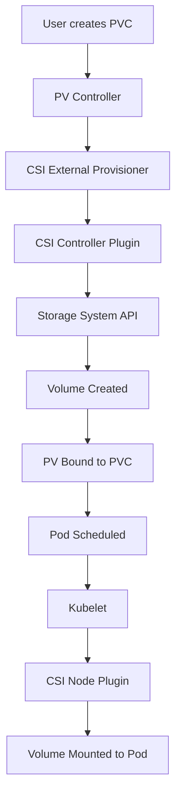

<!-- Custom styles are now loaded via main.scss -->

<div class="hero-section">
  <div class="hero-content">
    <h1 class="hero-title">Kubernetes</h1>
    <p class="hero-subtitle">Container Orchestration at Scale</p>
  </div>
</div>

<div class="intro-card">
  <p class="lead-text">Kubernetes (K8s) is an open-source container orchestration platform that automates the deployment, scaling, and management of containerized applications. Originally developed by Google and now maintained by the Cloud Native Computing Foundation (CNCF), Kubernetes has become the de facto standard for container orchestration in production environments. As of 2024, Kubernetes v1.29 introduces enhanced security features, improved performance, and better AI/ML workload support.</p>
  
  <div class="key-insights">
    <div class="insight-card">
      <i class="fas fa-cubes"></i>
      <h4>Container Orchestration</h4>
      <p>Automated deployment and management</p>
    </div>
    <div class="insight-card">
      <i class="fas fa-expand-arrows-alt"></i>
      <h4>Auto-scaling</h4>
      <p>Dynamic resource allocation</p>
    </div>
    <div class="insight-card">
      <i class="fas fa-sync-alt"></i>
      <h4>Self-healing</h4>
      <p>Automatic recovery and rollbacks</p>
    </div>
  </div>
</div>

## Documentation Structure

This guide covers Kubernetes comprehensively across the following topics:

1. **Quick Start** - Essential commands and operations
2. **Core Concepts** - Fundamental Kubernetes principles
3. **Kubernetes Objects** - API object specifications
4. **Workload Resources** - Application deployment patterns
5. **Networking & Storage** - Infrastructure integration
6. **Configuration & Security** - Production configurations
7. **Advanced Topics** - Complex deployment scenarios
8. **Real-World Applications** - Implementation case studies
9. **2024 Updates** - Recent features and changes

## Quick Start Guide

Kubernetes functions as an operating system for distributed systems - it manages applications (containers) across multiple computers (nodes) similar to how an OS manages programs on a single computer. This section demonstrates essential operations.

### Requirements
- Container technology knowledge (Docker)
- Kubernetes cluster access (minikube, kind, k3s, or cloud provider)
- kubectl CLI v1.28+ installed
- Optional: Helm 3.x for package management

### Your First Deployment

```bash
# 1. Check your cluster is running and version
kubectl cluster-info
kubectl version --short

# 2. Deploy a simple application
kubectl create deployment hello-world --image=nginx:alpine

# 3. Expose it to the internet
kubectl expose deployment hello-world --type=LoadBalancer --port=80

# 4. Check it's running with more details
kubectl get pods -o wide
kubectl get services
kubectl describe deployment hello-world

# 5. Scale it up
kubectl scale deployment hello-world --replicas=3

# 6. See the magic - kill a pod and watch it resurrect
kubectl get pods
kubectl delete pod <pod-name>
kubectl get pods  # Notice a new pod replaced the deleted one!

# 7. Clean up
kubectl delete deployment hello-world
kubectl delete service hello-world
```

### Core Concepts in Plain English

**Pods**: The smallest unit in Kubernetes. Like a wrapper around your container(s) that provides shared storage and network.

**Deployments**: Manages your pods. Tells Kubernetes "I want 3 copies of my app running at all times" and Kubernetes makes it happen.

**Services**: Provides a stable address for your pods. Even as pods die and restart with new IPs, the service address stays the same.

**Nodes**: The physical or virtual machines that run your containers.

**Cluster**: A group of nodes managed by Kubernetes.

That's it! You now understand the basics. The rest of this guide will take you deep into each concept and show you how to build production-ready systems.

## Understanding Kubernetes: From Containers to Orchestration

Before diving into Kubernetes architecture, let's understand why we need container orchestration. When you run a single container on your laptop, Docker is perfectly adequate. But what happens when you need to run hundreds or thousands of containers across multiple servers? How do you ensure they're always running, properly networked, and efficiently using resources? This is where Kubernetes comes in.

### The Evolution: From Bare Metal to Kubernetes

1. **Bare Metal Era**: One application per server, massive waste of resources
2. **Virtualization Era**: Multiple VMs per server, better resource usage but heavy overhead
3. **Container Era**: Lightweight isolation, but manual management becomes complex at scale
4. **Orchestration Era**: Kubernetes automates container management, enabling true cloud-native applications

### Why Kubernetes Wins

- **Declarative Configuration**: You describe the desired state, Kubernetes makes it happen
- **Self-Healing**: Automatically replaces failed containers
- **Service Discovery**: Built-in DNS and load balancing
- **Storage Orchestration**: Automatically mounts storage systems
- **Automated Rollouts**: Deploy new versions without downtime
- **Secret Management**: Secure handling of sensitive data
- **Horizontal Scaling**: Scale with a simple command or automatically based on CPU/memory usage

## Core Concepts

<div class="architecture-section">
  <h3><i class="fas fa-sitemap"></i> Architecture Overview</h3>
  <p>Kubernetes operates like a distributed operating system for your containers. It follows a master-worker architecture where a control plane manages the entire cluster while worker nodes run your actual applications. Think of it as a conductor (control plane) orchestrating an orchestra (worker nodes) to create harmonious music (your running applications).</p>
  
  <div class="architecture-visual">
    <svg viewBox="0 0 700 400" class="k8s-architecture">
      <!-- Control Plane -->
      <rect x="50" y="50" width="600" height="120" fill="#3498db" opacity="0.1" stroke="#3498db" stroke-width="2" />
      <text x="350" y="30" text-anchor="middle" font-size="16" font-weight="bold">Control Plane</text>
      
      <!-- API Server -->
      <rect x="70" y="70" width="100" height="80" fill="#e74c3c" opacity="0.5" stroke="#c0392b" stroke-width="2" />
      <text x="120" y="105" text-anchor="middle" font-size="11" fill="white">API Server</text>
      <text x="120" y="120" text-anchor="middle" font-size="9" fill="white">Gateway</text>
      
      <!-- etcd -->
      <rect x="190" y="70" width="100" height="80" fill="#27ae60" opacity="0.5" stroke="#229954" stroke-width="2" />
      <text x="240" y="105" text-anchor="middle" font-size="11" fill="white">etcd</text>
      <text x="240" y="120" text-anchor="middle" font-size="9" fill="white">State Store</text>
      
      <!-- Scheduler -->
      <rect x="310" y="70" width="100" height="80" fill="#f39c12" opacity="0.5" stroke="#d68910" stroke-width="2" />
      <text x="360" y="105" text-anchor="middle" font-size="11" fill="white">Scheduler</text>
      <text x="360" y="120" text-anchor="middle" font-size="9" fill="white">Pod Placement</text>
      
      <!-- Controller Manager -->
      <rect x="430" y="70" width="100" height="80" fill="#9b59b6" opacity="0.5" stroke="#7d3c98" stroke-width="2" />
      <text x="480" y="100" text-anchor="middle" font-size="11" fill="white">Controller</text>
      <text x="480" y="115" text-anchor="middle" font-size="11" fill="white">Manager</text>
      <text x="480" y="130" text-anchor="middle" font-size="9" fill="white">Controllers</text>
      
      <!-- Cloud Controller -->
      <rect x="550" y="70" width="80" height="80" fill="#1abc9c" opacity="0.5" stroke="#16a085" stroke-width="2" />
      <text x="590" y="100" text-anchor="middle" font-size="10" fill="white">Cloud</text>
      <text x="590" y="115" text-anchor="middle" font-size="10" fill="white">Controller</text>
      <text x="590" y="130" text-anchor="middle" font-size="9" fill="white">Manager</text>
      
      <!-- Worker Nodes -->
      <text x="350" y="210" text-anchor="middle" font-size="16" font-weight="bold">Worker Nodes</text>
      
      <!-- Node 1 -->
      <rect x="50" y="230" width="180" height="150" fill="#95a5a6" opacity="0.1" stroke="#7f8c8d" stroke-width="2" />
      <text x="140" y="250" text-anchor="middle" font-size="12">Node 1</text>
      
      <!-- kubelet -->
      <rect x="60" y="260" width="70" height="40" fill="#3498db" opacity="0.5" />
      <text x="95" y="285" text-anchor="middle" font-size="10" fill="white">kubelet</text>
      
      <!-- kube-proxy -->
      <rect x="150" y="260" width="70" height="40" fill="#e74c3c" opacity="0.5" />
      <text x="185" y="285" text-anchor="middle" font-size="10" fill="white">kube-proxy</text>
      
      <!-- Container runtime -->
      <rect x="60" y="310" width="160" height="40" fill="#27ae60" opacity="0.5" />
      <text x="140" y="335" text-anchor="middle" font-size="10" fill="white">Container Runtime</text>
      
      <!-- Pods -->
      <circle cx="90" cy="365" r="12" fill="#f39c12" />
      <circle cx="140" cy="365" r="12" fill="#f39c12" />
      <circle cx="190" cy="365" r="12" fill="#f39c12" />
      <text x="140" y="370" text-anchor="middle" font-size="9">Pods</text>
      
      <!-- Node 2 -->
      <rect x="260" y="230" width="180" height="150" fill="#95a5a6" opacity="0.1" stroke="#7f8c8d" stroke-width="2" />
      <text x="350" y="250" text-anchor="middle" font-size="12">Node 2</text>
      
      <!-- Node 3 -->
      <rect x="470" y="230" width="180" height="150" fill="#95a5a6" opacity="0.1" stroke="#7f8c8d" stroke-width="2" />
      <text x="560" y="250" text-anchor="middle" font-size="12">Node 3</text>
      
      <!-- Communication lines -->
      <path d="M 120 150 L 140 230" stroke="#2c3e50" stroke-width="1" stroke-dasharray="3,3" />
      <path d="M 360 150 L 350 230" stroke="#2c3e50" stroke-width="1" stroke-dasharray="3,3" />
      <path d="M 480 150 L 560 230" stroke="#2c3e50" stroke-width="1" stroke-dasharray="3,3" />
    </svg>
  </div>
  
  <div class="component-details">
    <div class="component-group control-plane">
      <h4><i class="fas fa-server"></i> Control Plane Components</h4>
      <div class="component-list">
        <div class="component-item">
          <i class="fas fa-plug"></i>
          <strong>API Server:</strong> Central management point, exposes Kubernetes API
        </div>
        <div class="component-item">
          <i class="fas fa-database"></i>
          <strong>etcd:</strong> Distributed key-value store for cluster state
        </div>
        <div class="component-item">
          <i class="fas fa-calendar-alt"></i>
          <strong>Scheduler:</strong> Assigns pods to nodes based on resource requirements
        </div>
        <div class="component-item">
          <i class="fas fa-cogs"></i>
          <strong>Controller Manager:</strong> Runs controller processes
        </div>
        <div class="component-item">
          <i class="fas fa-cloud"></i>
          <strong>Cloud Controller Manager:</strong> Integrates with cloud provider APIs
        </div>
      </div>
    </div>
    
    <div class="component-group node-components">
      <h4><i class="fas fa-microchip"></i> Node Components</h4>
      <div class="component-list">
        <div class="component-item">
          <i class="fas fa-heartbeat"></i>
          <strong>kubelet:</strong> Ensures containers are running in pods
        </div>
        <div class="component-item">
          <i class="fas fa-network-wired"></i>
          <strong>kube-proxy:</strong> Maintains network rules for pod communication
        </div>
        <div class="component-item">
          <i class="fas fa-box"></i>
          <strong>Container Runtime:</strong> Docker, containerd, or CRI-O
        </div>
      </div>
    </div>
  </div>
</div>

### Kubernetes Objects: The Building Blocks

Now that we understand how Kubernetes is structured, let's explore the objects we use to define our applications. These objects are like LEGO blocks - each serves a specific purpose, and when combined, they create complete application architectures. We'll start with the most fundamental unit and build up to more complex constructs.

<div class="k8s-objects-section">
  <div class="object-card pod-object">
    <div class="object-header">
      <i class="fas fa-cube"></i>
      <h4>Pods</h4>
    </div>
    <p class="object-desc">The smallest deployable unit in Kubernetes:</p>
    
    <div class="object-visual">
      <svg viewBox="0 0 300 150">
        <!-- Pod outline -->
        <rect x="50" y="30" width="200" height="90" rx="10" fill="#3498db" opacity="0.2" stroke="#3498db" stroke-width="2" />
        <text x="150" y="20" text-anchor="middle" font-size="12" font-weight="bold">Pod</text>
        
        <!-- Containers inside pod -->
        <rect x="70" y="50" width="70" height="50" fill="#e74c3c" opacity="0.5" rx="5" />
        <text x="105" y="80" text-anchor="middle" font-size="10" fill="white">Container 1</text>
        
        <rect x="160" y="50" width="70" height="50" fill="#27ae60" opacity="0.5" rx="5" />
        <text x="195" y="80" text-anchor="middle" font-size="10" fill="white">Container 2</text>
        
        <!-- Shared resources -->
        <text x="150" y="130" text-anchor="middle" font-size="9">Shared Network & Storage</text>
      </svg>
    </div>
    
    <div class="code-example">
      <div class="code-header">Pod Definition</div>
      <pre><code class="language-yaml">apiVersion: v1
kind: Pod
metadata:
  name: nginx-pod
  labels:
    app: nginx
spec:
  containers:
  - name: nginx
    image: nginx:1.21
    ports:
    - containerPort: 80</code></pre>
    </div>
    
    <div class="key-features">
      <h5>Key Features:</h5>
      <div class="feature-grid">
        <div class="feature-item">
          <i class="fas fa-layer-group"></i>
          <span>One or more containers</span>
        </div>
        <div class="feature-item">
          <i class="fas fa-share-alt"></i>
          <span>Shared network and storage</span>
        </div>
        <div class="feature-item">
          <i class="fas fa-hourglass-half"></i>
          <span>Ephemeral by design</span>
        </div>
        <div class="feature-item">
          <i class="fas fa-fingerprint"></i>
          <span>Unique IP address</span>
        </div>
      </div>
    </div>
  </div>

  <div class="object-card deployment-object">
    <div class="object-header">
      <i class="fas fa-rocket"></i>
      <h4>Deployments</h4>
    </div>
    <p class="object-desc">Manages replica sets and provides declarative updates:</p>
    
    <div class="object-visual">
      <svg viewBox="0 0 400 200">
        <!-- Deployment controller -->
        <rect x="150" y="20" width="100" height="40" fill="#9b59b6" opacity="0.5" stroke="#8e44ad" stroke-width="2" />
        <text x="200" y="45" text-anchor="middle" font-size="11" fill="white">Deployment</text>
        
        <!-- ReplicaSet -->
        <rect x="125" y="80" width="150" height="40" fill="#3498db" opacity="0.3" stroke="#2980b9" stroke-width="2" />
        <text x="200" y="105" text-anchor="middle" font-size="10">ReplicaSet</text>
        
        <!-- Pods -->
        <circle cx="120" cy="160" r="20" fill="#e74c3c" opacity="0.5" />
        <text x="120" y="165" text-anchor="middle" font-size="9" fill="white">Pod</text>
        
        <circle cx="200" cy="160" r="20" fill="#e74c3c" opacity="0.5" />
        <text x="200" y="165" text-anchor="middle" font-size="9" fill="white">Pod</text>
        
        <circle cx="280" cy="160" r="20" fill="#e74c3c" opacity="0.5" />
        <text x="280" y="165" text-anchor="middle" font-size="9" fill="white">Pod</text>
        
        <!-- Arrows -->
        <path d="M 200 60 L 200 75" stroke="#2c3e50" stroke-width="2" marker-end="url(#arrow)" />
        <path d="M 150 120 L 120 135" stroke="#2c3e50" stroke-width="2" marker-end="url(#arrow)" />
        <path d="M 200 120 L 200 135" stroke="#2c3e50" stroke-width="2" marker-end="url(#arrow)" />
        <path d="M 250 120 L 280 135" stroke="#2c3e50" stroke-width="2" marker-end="url(#arrow)" />
        
        <text x="330" y="105" font-size="10">Replicas: 3</text>
      </svg>
    </div>
    
    <div class="code-example">
      <div class="code-header">Deployment Definition</div>
      <pre><code class="language-yaml">apiVersion: apps/v1
kind: Deployment
metadata:
  name: nginx-deployment
spec:
  replicas: 3
  selector:
    matchLabels:
      app: nginx
  template:
    metadata:
      labels:
        app: nginx
    spec:
      containers:
      - name: nginx
        image: nginx:1.21
        ports:
        - containerPort: 80</code></pre>
    </div>
    
    <div class="deployment-features">
      <h5>Features:</h5>
      <div class="feature-cards">
        <div class="feature-card">
          <i class="fas fa-sync-alt"></i>
          <h6>Rolling Updates</h6>
          <p>Zero-downtime deployments</p>
        </div>
        <div class="feature-card">
          <i class="fas fa-undo"></i>
          <h6>Rollback</h6>
          <p>Revert to previous versions</p>
        </div>
        <div class="feature-card">
          <i class="fas fa-expand-arrows-alt"></i>
          <h6>Scaling</h6>
          <p>Adjust replica count</p>
        </div>
        <div class="feature-card">
          <i class="fas fa-heartbeat"></i>
          <h6>Self-healing</h6>
          <p>Automatic pod recovery</p>
        </div>
      </div>
    </div>
  </div>

  <div class="object-card service-object">
    <div class="object-header">
      <i class="fas fa-network-wired"></i>
      <h4>Services</h4>
    </div>
    <p class="object-desc">Provides stable network endpoint for pods:</p>
    
    <div class="service-types-visual">
      <h5>Service Types</h5>
      <div class="service-type-grid">
        <div class="service-type clusterip">
          <svg viewBox="0 0 150 120">
            <rect x="30" y="30" width="90" height="60" fill="#3498db" opacity="0.2" stroke="#3498db" stroke-width="2" />
            <text x="75" y="20" text-anchor="middle" font-size="10" font-weight="bold">ClusterIP</text>
            <circle cx="50" cy="60" r="8" fill="#e74c3c" />
            <circle cx="75" cy="60" r="8" fill="#e74c3c" />
            <circle cx="100" cy="60" r="8" fill="#e74c3c" />
            <text x="75" y="105" text-anchor="middle" font-size="9">Internal Only</text>
          </svg>
        </div>
        
        <div class="service-type nodeport">
          <svg viewBox="0 0 150 120">
            <rect x="30" y="30" width="90" height="60" fill="#27ae60" opacity="0.2" stroke="#27ae60" stroke-width="2" />
            <text x="75" y="20" text-anchor="middle" font-size="10" font-weight="bold">NodePort</text>
            <circle cx="75" cy="60" r="8" fill="#e74c3c" />
            <line x1="75" y1="52" x2="75" y2="10" stroke="#2c3e50" stroke-width="2" marker-end="url(#arrow)" />
            <text x="75" y="105" text-anchor="middle" font-size="9">Node IP:Port</text>
          </svg>
        </div>
        
        <div class="service-type loadbalancer">
          <svg viewBox="0 0 150 120">
            <ellipse cx="75" cy="15" rx="40" ry="10" fill="#f39c12" opacity="0.3" />
            <text x="75" y="18" text-anchor="middle" font-size="9">LB</text>
            <rect x="30" y="40" width="90" height="50" fill="#f39c12" opacity="0.2" stroke="#f39c12" stroke-width="2" />
            <text x="75" y="35" text-anchor="middle" font-size="10" font-weight="bold">LoadBalancer</text>
            <circle cx="75" cy="65" r="8" fill="#e74c3c" />
            <text x="75" y="105" text-anchor="middle" font-size="9">External LB</text>
          </svg>
        </div>
        
        <div class="service-type externalname">
          <svg viewBox="0 0 150 120">
            <rect x="30" y="30" width="90" height="60" fill="#9b59b6" opacity="0.2" stroke="#9b59b6" stroke-width="2" />
            <text x="75" y="20" text-anchor="middle" font-size="10" font-weight="bold">ExternalName</text>
            <text x="75" y="60" text-anchor="middle" font-size="16">DNS</text>
            <text x="75" y="105" text-anchor="middle" font-size="9">Maps to DNS</text>
          </svg>
        </div>
      </div>
    </div>
    
    <div class="code-example">
      <div class="code-header">Service Definition</div>
      <pre><code class="language-yaml">apiVersion: v1
kind: Service
metadata:
  name: nginx-service
spec:
  selector:
    app: nginx
  ports:
  - port: 80
    targetPort: 80
  type: LoadBalancer</code></pre>
    </div>
  </div>

#### ConfigMaps and Secrets: Managing Application Configuration

As your applications grow, you'll need to manage configuration separately from your container images. This separation allows you to deploy the same image across different environments (development, staging, production) with different configurations. ConfigMaps handle non-sensitive data, while Secrets manage sensitive information like passwords and API keys.

**ConfigMap Example:**
```yaml
apiVersion: v1
kind: ConfigMap
metadata:
  name: app-config
data:
  database_url: "postgres://localhost:5432/mydb"
  api_key: "public-api-key"
```

**Secret Example:**
```yaml
apiVersion: v1
kind: Secret
metadata:
  name: db-secret
type: Opaque
data:
  username: YWRtaW4=  # base64 encoded
  password: cGFzc3dvcmQ=  # base64 encoded
```

  <div class="object-card namespace-object">
    <div class="object-header">
      <i class="fas fa-folder"></i>
      <h4>Namespaces</h4>
    </div>
    <p class="object-desc">Logical isolation within a cluster:</p>
    
    <div class="namespace-visual">
      <svg viewBox="0 0 400 250">
        <!-- Cluster boundary -->
        <rect x="20" y="20" width="360" height="210" fill="none" stroke="#2c3e50" stroke-width="2" stroke-dasharray="5,5" />
        <text x="200" y="15" text-anchor="middle" font-size="12" font-weight="bold">Kubernetes Cluster</text>
        
        <!-- Default namespace -->
        <rect x="40" y="40" width="150" height="80" fill="#3498db" opacity="0.2" stroke="#3498db" stroke-width="2" />
        <text x="115" y="60" text-anchor="middle" font-size="11" font-weight="bold">default</text>
        <circle cx="70" cy="90" r="8" fill="#e74c3c" />
        <circle cx="100" cy="90" r="8" fill="#e74c3c" />
        <circle cx="130" cy="90" r="8" fill="#e74c3c" />
        <text x="100" y="110" text-anchor="middle" font-size="9">User Apps</text>
        
        <!-- kube-system namespace -->
        <rect x="210" y="40" width="150" height="80" fill="#e74c3c" opacity="0.2" stroke="#e74c3c" stroke-width="2" />
        <text x="285" y="60" text-anchor="middle" font-size="11" font-weight="bold">kube-system</text>
        <rect cx="240" cy="85" width="12" height="12" fill="#c0392b" />
        <rect cx="270" cy="85" width="12" height="12" fill="#c0392b" />
        <rect cx="300" cy="85" width="12" height="12" fill="#c0392b" />
        <text x="270" y="110" text-anchor="middle" font-size="9">System Pods</text>
        
        <!-- Development namespace -->
        <rect x="40" y="140" width="150" height="70" fill="#27ae60" opacity="0.2" stroke="#27ae60" stroke-width="2" />
        <text x="115" y="160" text-anchor="middle" font-size="11" font-weight="bold">development</text>
        <circle cx="70" cy="185" r="8" fill="#229954" />
        <circle cx="100" cy="185" r="8" fill="#229954" />
        <text x="85" y="205" text-anchor="middle" font-size="9">Dev Apps</text>
        
        <!-- Production namespace -->
        <rect x="210" y="140" width="150" height="70" fill="#f39c12" opacity="0.2" stroke="#f39c12" stroke-width="2" />
        <text x="285" y="160" text-anchor="middle" font-size="11" font-weight="bold">production</text>
        <circle cx="240" cy="185" r="8" fill="#d68910" />
        <circle cx="270" cy="185" r="8" fill="#d68910" />
        <text x="255" y="205" text-anchor="middle" font-size="9">Prod Apps</text>
      </svg>
    </div>
    
    <div class="code-example">
      <div class="code-header">Namespace Definition</div>
      <pre><code class="language-yaml">apiVersion: v1
kind: Namespace
metadata:
  name: development</code></pre>
    </div>
    
    <div class="default-namespaces">
      <h5>Default Namespaces:</h5>
      <div class="namespace-list">
        <div class="namespace-item">
          <code>default</code>
          <span>Default namespace for objects</span>
        </div>
        <div class="namespace-item">
          <code>kube-system</code>
          <span>Kubernetes system objects</span>
        </div>
        <div class="namespace-item">
          <code>kube-public</code>
          <span>Publicly accessible data</span>
        </div>
        <div class="namespace-item">
          <code>kube-node-lease</code>
          <span>Node heartbeat data</span>
        </div>
      </div>
    </div>
  </div>
</div>

## Workload Resources: Beyond Basic Deployments

While Deployments handle stateless applications beautifully, real-world systems often need more specialized controllers. Let's explore how Kubernetes handles different workload patterns, each designed to solve specific operational challenges.

### StatefulSets: When Order and Identity Matter

Imagine deploying a database cluster where each instance needs a persistent identity and stable storage. Regular Deployments treat pods as interchangeable cattle, but StatefulSets treat them as pets with names and persistent characteristics. This is crucial for applications like databases, message queues, and distributed systems that rely on stable network identities and ordered operations.

```yaml
apiVersion: apps/v1
kind: StatefulSet
metadata:
  name: postgres
spec:
  serviceName: postgres
  replicas: 3
  selector:
    matchLabels:
      app: postgres
  template:
    metadata:
      labels:
        app: postgres
    spec:
      containers:
      - name: postgres
        image: postgres:13
        volumeMounts:
        - name: postgres-storage
          mountPath: /var/lib/postgresql/data
  volumeClaimTemplates:
  - metadata:
      name: postgres-storage
    spec:
      accessModes: ["ReadWriteOnce"]
      resources:
        requests:
          storage: 10Gi
```

**Features:**
- Ordered deployment and scaling
- Stable network identities
- Persistent storage
- Ordered termination

### DaemonSets: One Pod Per Node

Some tasks need to run on every node in your cluster - think of monitoring agents, log collectors, or network plugins. DaemonSets solve this by automatically deploying exactly one pod per node, even as nodes are added or removed from the cluster. It's like having a building superintendent in every apartment building of a large complex.

```yaml
apiVersion: apps/v1
kind: DaemonSet
metadata:
  name: fluentd
spec:
  selector:
    matchLabels:
      app: fluentd
  template:
    metadata:
      labels:
        app: fluentd
    spec:
      containers:
      - name: fluentd
        image: fluentd:v1.14
        resources:
          limits:
            memory: 200Mi
```

**Use Cases:**
- Log collection
- Monitoring agents
- Network plugins
- Storage drivers

### Jobs and CronJobs: Task Automation

Not all workloads run continuously. Sometimes you need to run a task once (like a database migration) or on a schedule (like nightly backups). Jobs ensure tasks complete successfully, while CronJobs handle recurring schedules - bringing Unix-like cron functionality to your containerized workloads.

**Job Example:**
```yaml
apiVersion: batch/v1
kind: Job
metadata:
  name: backup-job
spec:
  template:
    spec:
      containers:
      - name: backup
        image: backup-tool:latest
        command: ["./backup.sh"]
      restartPolicy: OnFailure
  backoffLimit: 3
```

**CronJob Example:**
```yaml
apiVersion: batch/v1
kind: CronJob
metadata:
  name: daily-backup
spec:
  schedule: "0 2 * * *"  # 2 AM daily
  jobTemplate:
    spec:
      template:
        spec:
          containers:
          - name: backup
            image: backup-tool:latest
          restartPolicy: OnFailure
```

## Networking: Connecting Your Applications

Kubernetes networking might seem complex at first, but it follows simple principles designed to make communication between containers as straightforward as possible. Let's explore how Kubernetes creates a flat network where every pod can communicate with every other pod, regardless of which node they're on.

### Cluster Networking Fundamentals

**Network Model Requirements:**
- All pods can communicate with each other
- All nodes can communicate with all pods
- No NAT between pods

### Ingress: Your Cluster's Front Door

While Services provide internal load balancing, Ingress acts as your cluster's intelligent front door. It handles HTTP/HTTPS routing, SSL termination, and path-based routing - essentially replacing the need for multiple LoadBalancer services with a single entry point that can route to multiple backend services based on hostnames and paths.

```yaml
apiVersion: networking.k8s.io/v1
kind: Ingress
metadata:
  name: app-ingress
  annotations:
    nginx.ingress.kubernetes.io/rewrite-target: /
spec:
  rules:
  - host: app.example.com
    http:
      paths:
      - path: /api
        pathType: Prefix
        backend:
          service:
            name: api-service
            port:
              number: 80
      - path: /
        pathType: Prefix
        backend:
          service:
            name: frontend-service
            port:
              number: 80
```

### Network Policies: Microsegmentation for Security

In a flat network where everything can talk to everything, security becomes paramount. Network Policies act like firewall rules at the pod level, allowing you to control which pods can communicate with each other. This microsegmentation approach is crucial for implementing zero-trust security models in your cluster.

```yaml
apiVersion: networking.k8s.io/v1
kind: NetworkPolicy
metadata:
  name: api-netpol
spec:
  podSelector:
    matchLabels:
      app: api
  policyTypes:
  - Ingress
  - Egress
  ingress:
  - from:
    - podSelector:
        matchLabels:
          app: frontend
    ports:
    - protocol: TCP
      port: 8080
  egress:
  - to:
    - podSelector:
        matchLabels:
          app: database
    ports:
    - protocol: TCP
      port: 5432
```

## Storage: Persistent Data in an Ephemeral World

Containers are ephemeral by design, but real applications need persistent storage. Kubernetes abstracts storage complexity through a plugin system that works with everything from local disks to cloud storage services. Let's explore how Kubernetes manages storage, starting with the architectural foundation.

### Container Storage Interface (CSI) Architecture

The Container Storage Interface (CSI) is like a universal adapter that allows any storage system to work with Kubernetes. Before CSI, each storage vendor needed to maintain code within Kubernetes itself. Now, storage providers can develop independent plugins that follow the CSI specification, making the ecosystem more flexible and maintainable.

#### CSI Components and Workflow



#### Implementing a CSI Driver

```go
// CSI Controller Service - Manages volumes at cluster level
type ControllerServer interface {
    // Volume lifecycle operations
    CreateVolume(context.Context, *CreateVolumeRequest) (*CreateVolumeResponse, error)
    DeleteVolume(context.Context, *DeleteVolumeRequest) (*DeleteVolumeResponse, error)
    
    // Snapshot operations
    CreateSnapshot(context.Context, *CreateSnapshotRequest) (*CreateSnapshotResponse, error)
    DeleteSnapshot(context.Context, *DeleteSnapshotRequest) (*DeleteSnapshotResponse, error)
    
    // Volume attachment
    ControllerPublishVolume(context.Context, *ControllerPublishVolumeRequest) (*ControllerPublishVolumeResponse, error)
    ControllerUnpublishVolume(context.Context, *ControllerUnpublishVolumeRequest) (*ControllerUnpublishVolumeResponse, error)
    
    // Capabilities
    ControllerGetCapabilities(context.Context, *ControllerGetCapabilitiesRequest) (*ControllerGetCapabilitiesResponse, error)
}

// CSI Node Service - Manages volumes on individual nodes
type NodeServer interface {
    // Node operations
    NodeStageVolume(context.Context, *NodeStageVolumeRequest) (*NodeStageVolumeResponse, error)
    NodeUnstageVolume(context.Context, *NodeUnstageVolumeRequest) (*NodeUnstageVolumeResponse, error)
    
    // Mount operations
    NodePublishVolume(context.Context, *NodePublishVolumeRequest) (*NodePublishVolumeResponse, error)
    NodeUnpublishVolume(context.Context, *NodeUnpublishVolumeRequest) (*NodeUnpublishVolumeResponse, error)
    
    // Node info
    NodeGetInfo(context.Context, *NodeGetInfoRequest) (*NodeGetInfoResponse, error)
    NodeGetCapabilities(context.Context, *NodeGetCapabilitiesRequest) (*NodeGetCapabilitiesResponse, error)
}

// Example CSI Driver Implementation
type MyCSIDriver struct {
    name     string
    nodeID   string
    version  string
    endpoint string
    
    // Storage backend client
    storageClient StorageClient
}

func (d *MyCSIDriver) CreateVolume(ctx context.Context, req *csi.CreateVolumeRequest) (*csi.CreateVolumeResponse, error) {
    // Validate request
    if req.Name == "" {
        return nil, status.Error(codes.InvalidArgument, "Volume name required")
    }
    
    // Check if volume already exists
    vol, err := d.storageClient.GetVolume(req.Name)
    if err == nil {
        return &csi.CreateVolumeResponse{Volume: vol}, nil
    }
    
    // Create volume with requested capacity
    capacity := req.CapacityRange.RequiredBytes
    vol, err = d.storageClient.CreateVolume(req.Name, capacity, req.Parameters)
    if err != nil {
        return nil, status.Errorf(codes.Internal, "Failed to create volume: %v", err)
    }
    
    return &csi.CreateVolumeResponse{
        Volume: &csi.Volume{
            VolumeId:      vol.ID,
            CapacityBytes: vol.Size,
            VolumeContext: req.Parameters,
        },
    }, nil
}
```

#### CSI Driver Deployment

```yaml
# CSI Driver DaemonSet
apiVersion: apps/v1
kind: DaemonSet
metadata:
  name: csi-driver-node
spec:
  selector:
    matchLabels:
      app: csi-driver-node
  template:
    metadata:
      labels:
        app: csi-driver-node
    spec:
      hostNetwork: true
      containers:
      - name: csi-driver
        image: myregistry/csi-driver:v1.0.0
        args:
        - "--endpoint=$(CSI_ENDPOINT)"
        - "--nodeid=$(NODE_NAME)"
        env:
        - name: CSI_ENDPOINT
          value: unix:///csi/csi.sock
        - name: NODE_NAME
          valueFrom:
            fieldRef:
              fieldPath: spec.nodeName
        volumeMounts:
        - name: plugin-dir
          mountPath: /csi
        - name: pods-mount-dir
          mountPath: /var/lib/kubelet/pods
          mountPropagation: "Bidirectional"
      - name: node-driver-registrar
        image: k8s.gcr.io/sig-storage/csi-node-driver-registrar:v2.5.0
        args:
        - "--csi-address=$(ADDRESS)"
        - "--kubelet-registration-path=$(DRIVER_REG_SOCK_PATH)"
        env:
        - name: ADDRESS
          value: /csi/csi.sock
        - name: DRIVER_REG_SOCK_PATH
          value: /var/lib/kubelet/plugins/csi-driver/csi.sock
      volumes:
      - name: plugin-dir
        hostPath:
          path: /var/lib/kubelet/plugins/csi-driver
          type: DirectoryOrCreate
      - name: pods-mount-dir
        hostPath:
          path: /var/lib/kubelet/pods
          type: Directory
```

### Understanding Storage Orchestration

Behind the scenes, Kubernetes manages storage through a sophisticated state machine that ensures data integrity and availability. This orchestration handles everything from provisioning new volumes to managing failures and ensuring data consistency across replicas. Let's peek under the hood to understand how Kubernetes keeps your data safe.

#### Volume Lifecycle State Machine

```python
from enum import Enum
from typing import Dict, List, Optional, Set
import asyncio

class VolumeState(Enum):
    PENDING = "pending"
    PROVISIONING = "provisioning"
    AVAILABLE = "available"
    BINDING = "binding"
    BOUND = "bound"
    RELEASING = "releasing"
    FAILED = "failed"
    DELETED = "deleted"

class VolumeLifecycleManager:
    """Manages volume state transitions with formal verification"""
    
    def __init__(self):
        # State transition graph
        self.transitions = {
            VolumeState.PENDING: {VolumeState.PROVISIONING, VolumeState.FAILED},
            VolumeState.PROVISIONING: {VolumeState.AVAILABLE, VolumeState.FAILED},
            VolumeState.AVAILABLE: {VolumeState.BINDING, VolumeState.DELETED},
            VolumeState.BINDING: {VolumeState.BOUND, VolumeState.AVAILABLE, VolumeState.FAILED},
            VolumeState.BOUND: {VolumeState.RELEASING},
            VolumeState.RELEASING: {VolumeState.AVAILABLE, VolumeState.DELETED, VolumeState.FAILED},
            VolumeState.FAILED: {VolumeState.DELETED},
            VolumeState.DELETED: set()
        }
        
        self.volumes: Dict[str, VolumeState] = {}
        self.state_lock = asyncio.Lock()
    
    async def transition_volume(self, volume_id: str, new_state: VolumeState) -> bool:
        """Atomically transition volume state with validation"""
        async with self.state_lock:
            current_state = self.volumes.get(volume_id, VolumeState.PENDING)
            
            # Verify transition is valid
            if new_state not in self.transitions[current_state]:
                raise ValueError(f"Invalid transition: {current_state} → {new_state}")
            
            # Perform state transition
            self.volumes[volume_id] = new_state
            
            # Trigger side effects
            await self._handle_state_change(volume_id, current_state, new_state)
            
            return True
    
    async def _handle_state_change(self, volume_id: str, 
                                  old_state: VolumeState, 
                                  new_state: VolumeState):
        """Handle side effects of state transitions"""
        if new_state == VolumeState.PROVISIONING:
            await self._provision_volume(volume_id)
        elif new_state == VolumeState.BOUND:
            await self._attach_volume(volume_id)
        elif new_state == VolumeState.DELETED:
            await self._cleanup_volume(volume_id)
```

### Advanced Storage Patterns: Building Resilient Systems

As applications scale, storage needs become more complex. Modern distributed systems require sophisticated replication strategies to ensure data availability and consistency. These patterns show how Kubernetes can orchestrate complex storage topologies that rival traditional enterprise storage systems.

#### Distributed Volume Replication

```python
import hashlib
from dataclasses import dataclass
from typing import List, Optional

@dataclass
class VolumeReplica:
    """Represents a replica of a volume"""
    node_id: str
    replica_id: str
    state: str  # primary, secondary, syncing
    last_sync: float
    checksum: str

class DistributedVolumeManager:
    """Manages distributed volume replication with consistency guarantees"""
    
    def __init__(self, replication_factor: int = 3):
        self.replication_factor = replication_factor
        self.replicas: Dict[str, List[VolumeReplica]] = {}
        self.quorum_size = (replication_factor // 2) + 1
    
    def calculate_placement(self, volume_id: str, nodes: List[str]) -> List[str]:
        """
        Deterministic replica placement using consistent hashing
        with failure domain awareness
        """
        # Sort nodes for deterministic ordering
        sorted_nodes = sorted(nodes)
        
        # Use consistent hashing for placement
        placements = []
        for i in range(self.replication_factor):
            hash_input = f"{volume_id}:{i}".encode()
            hash_value = int(hashlib.sha256(hash_input).hexdigest(), 16)
            node_index = hash_value % len(sorted_nodes)
            
            # Ensure replicas are on different nodes
            selected_node = sorted_nodes[node_index]
            attempts = 0
            while selected_node in placements and attempts < len(sorted_nodes):
                node_index = (node_index + 1) % len(sorted_nodes)
                selected_node = sorted_nodes[node_index]
                attempts += 1
            
            if selected_node not in placements:
                placements.append(selected_node)
        
        return placements[:self.replication_factor]
    
    async def write_with_quorum(self, volume_id: str, data: bytes) -> bool:
        """
        Write data to volume with quorum consensus
        """
        replicas = self.replicas.get(volume_id, [])
        if len(replicas) < self.quorum_size:
            raise ValueError(f"Insufficient replicas for quorum: {len(replicas)} < {self.quorum_size}")
        
        # Parallel writes to all replicas
        write_tasks = []
        for replica in replicas:
            if replica.state in ["primary", "secondary"]:
                write_tasks.append(self._write_to_replica(replica, data))
        
        # Wait for quorum
        results = await asyncio.gather(*write_tasks, return_exceptions=True)
        successful_writes = sum(1 for r in results if r is True)
        
        return successful_writes >= self.quorum_size
```

### Storage Performance Optimization

Storage performance can make or break application responsiveness. Kubernetes provides mechanisms to optimize I/O patterns, implement quality of service guarantees, and ensure fair resource allocation among competing workloads. These optimizations become critical when running databases and other I/O-intensive applications.

#### I/O Scheduler and Cache Management

```python
import heapq
from collections import deque
from dataclasses import dataclass, field
from typing import Deque, List, Optional

@dataclass
class IORequest:
    """Represents an I/O request with QoS parameters"""
    request_id: str
    volume_id: str
    offset: int
    length: int
    operation: str  # read, write
    priority: int
    deadline: float
    submitted_at: float
    
    def __lt__(self, other):
        # For priority queue ordering
        return self.deadline < other.deadline

class StorageScheduler:
    """
    Advanced I/O scheduler implementing deadline-aware scheduling
    with fairness guarantees
    """
    
    def __init__(self, queue_depth: int = 128):
        self.queue_depth = queue_depth
        self.pending_requests: List[IORequest] = []  # Min-heap by deadline
        self.volume_queues: Dict[str, Deque[IORequest]] = {}
        self.volume_tokens: Dict[str, int] = {}  # Token bucket for fairness
        
    def submit_request(self, request: IORequest):
        """Submit I/O request with deadline and priority"""
        # Add to priority queue
        heapq.heappush(self.pending_requests, request)
        
        # Add to per-volume queue for fairness
        if request.volume_id not in self.volume_queues:
            self.volume_queues[request.volume_id] = deque()
            self.volume_tokens[request.volume_id] = 10  # Initial tokens
        
        self.volume_queues[request.volume_id].append(request)
    
    def get_next_request(self) -> Optional[IORequest]:
        """
        Get next request using Earliest Deadline First (EDF)
        with token-based fairness
        """
        if not self.pending_requests:
            return None
        
        # Check deadline violations
        current_time = time.time()
        while self.pending_requests:
            candidate = self.pending_requests[0]
            
            # Check if volume has tokens (fairness)
            if self.volume_tokens.get(candidate.volume_id, 0) > 0:
                # Deduct token and process request
                self.volume_tokens[candidate.volume_id] -= 1
                return heapq.heappop(self.pending_requests)
            else:
                # Move to next deadline
                heapq.heappop(self.pending_requests)
                heapq.heappush(self.pending_requests, candidate)
                break
        
        # Replenish tokens periodically
        self._replenish_tokens()
        
        return None
    
    def _replenish_tokens(self):
        """Token bucket algorithm for fairness"""
        for volume_id in self.volume_tokens:
            self.volume_tokens[volume_id] = min(
                self.volume_tokens[volume_id] + 1,
                10  # Max tokens
            )
```

### Storage Classes: Defining Your Storage Tiers

Just as cloud providers offer different storage tiers (standard, premium, archive), Kubernetes Storage Classes let you define different categories of storage with varying performance characteristics, redundancy levels, and features. This abstraction allows developers to request storage by characteristics rather than specific implementations.

```yaml
apiVersion: storage.k8s.io/v1
kind: StorageClass
metadata:
  name: high-performance-replicated
provisioner: csi.storage.k8s.io/advanced-driver
parameters:
  # Performance tier
  type: nvme-ssd
  iops: "50000"
  throughput: "1000Mi"
  
  # Replication settings
  replicationFactor: "3"
  replicationMode: "synchronous"  # synchronous, asynchronous
  consistencyLevel: "strong"      # strong, eventual
  
  # Data protection
  encryption: "aes-256-gcm"
  checksumAlgorithm: "crc32c"
  
  # Advanced features
  deduplication: "true"
  compression: "lz4"
  snapshotSchedule: "0 */6 * * *"  # Every 6 hours
  
  # QoS settings
  qosClass: "guaranteed"
  minIOPS: "10000"
  maxIOPS: "50000"
  burstDuration: "60s"
  
reclaimPolicy: Retain
allowVolumeExpansion: true
volumeBindingMode: WaitForFirstConsumer
```

### Volume Snapshots: Point-in-Time Backups

Snapshots provide point-in-time copies of volumes, essential for backup strategies and data protection. The Volume Snapshot Controller manages this lifecycle, coordinating with storage providers to create, manage, and restore from snapshots. Here's how this controller orchestrates snapshot operations:

```go
// VolumeSnapshotController manages snapshot lifecycle
type VolumeSnapshotController struct {
    client           kubernetes.Interface
    snapshotClient   snapclient.Interface
    csiClient        csi.ControllerClient
    queue            workqueue.RateLimitingInterface
    snapshotStore    cache.Store
    volumeStore      cache.Store
}

func (c *VolumeSnapshotController) syncSnapshot(key string) error {
    namespace, name, err := cache.SplitMetaNamespaceKey(key)
    if err != nil {
        return err
    }
    
    snapshot, err := c.snapshotStore.Get(key)
    if err != nil {
        return err
    }
    
    vs := snapshot.(*v1.VolumeSnapshot)
    
    switch vs.Status.Phase {
    case v1.SnapshotPending:
        return c.createSnapshot(vs)
    case v1.SnapshotCreating:
        return c.checkSnapshotStatus(vs)
    case v1.SnapshotReady:
        return c.bindSnapshotContent(vs)
    case v1.SnapshotFailed:
        return c.handleSnapshotFailure(vs)
    }
    
    return nil
}

func (c *VolumeSnapshotController) createSnapshot(vs *v1.VolumeSnapshot) error {
    // Get source PVC
    pvc, err := c.getPVC(vs.Spec.Source.PersistentVolumeClaimName, vs.Namespace)
    if err != nil {
        return err
    }
    
    // Get CSI driver from PV
    pv, err := c.getPV(pvc.Spec.VolumeName)
    if err != nil {
        return err
    }
    
    // Create snapshot via CSI
    req := &csi.CreateSnapshotRequest{
        SourceVolumeId: pv.Spec.CSI.VolumeHandle,
        Name:          vs.Name,
        Parameters:    vs.Spec.Parameters,
    }
    
    resp, err := c.csiClient.CreateSnapshot(context.TODO(), req)
    if err != nil {
        return c.updateSnapshotStatus(vs, v1.SnapshotFailed, err.Error())
    }
    
    // Update status
    return c.updateSnapshotStatus(vs, v1.SnapshotCreating, resp.Snapshot.SnapshotId)
}
```

## Configuration Management: Fine-Tuning Your Applications

Running applications efficiently in Kubernetes requires careful resource management and configuration. Let's explore how to ensure your applications get the resources they need while preventing any single application from monopolizing the cluster.

### Resource Management: The Right-Sized Container

Just like you wouldn't use a semi-truck for grocery shopping or a bicycle for moving furniture, containers need appropriately sized resource allocations. Resource requests and limits help Kubernetes make intelligent scheduling decisions and prevent resource starvation.

**Resource Requests and Limits:**
```yaml
apiVersion: v1
kind: Pod
metadata:
  name: resource-demo
spec:
  containers:
  - name: app
    image: myapp:latest
    resources:
      requests:
        memory: "256Mi"
        cpu: "500m"
      limits:
        memory: "512Mi"
        cpu: "1000m"
```

### Horizontal Pod Autoscaling: Responding to Load

Traffic patterns are rarely constant. Horizontal Pod Autoscaling (HPA) automatically adjusts the number of pod replicas based on observed metrics like CPU usage or custom metrics from your application. It's like having an intelligent traffic controller that adds more lanes during rush hour and removes them when traffic is light.

```yaml
apiVersion: autoscaling/v2
kind: HorizontalPodAutoscaler
metadata:
  name: app-hpa
spec:
  scaleTargetRef:
    apiVersion: apps/v1
    kind: Deployment
    name: app-deployment
  minReplicas: 3
  maxReplicas: 10
  metrics:
  - type: Resource
    resource:
      name: cpu
      target:
        type: Utilization
        averageUtilization: 70
  - type: Resource
    resource:
      name: memory
      target:
        type: Utilization
        averageUtilization: 80
```

### Vertical Pod Autoscaling: Right-Sizing Resources

While HPA adds more pods, Vertical Pod Autoscaling (VPA) adjusts the resource requests and limits of individual pods based on actual usage. Think of it as an intelligent resource manager that learns from your application's behavior and continuously optimizes resource allocation.

```yaml
apiVersion: autoscaling.k8s.io/v1
kind: VerticalPodAutoscaler
metadata:
  name: app-vpa
spec:
  targetRef:
    apiVersion: apps/v1
    kind: Deployment
    name: app-deployment
  updatePolicy:
    updateMode: "Auto"
```

## Security: Protecting Your Cluster and Applications

Kubernetes security is multi-layered, protecting everything from cluster access to pod-to-pod communication. Let's explore the key security features that help you build defense in depth.

### Role-Based Access Control (RBAC): Who Can Do What

RBAC implements the principle of least privilege by defining who can perform which actions on what resources. It's like having a sophisticated keycard system where each person only has access to the rooms they need for their job.

**Role Definition:**
```yaml
apiVersion: rbac.authorization.k8s.io/v1
kind: Role
metadata:
  namespace: default
  name: pod-reader
rules:
- apiGroups: [""]
  resources: ["pods"]
  verbs: ["get", "watch", "list"]
```

**RoleBinding:**
```yaml
apiVersion: rbac.authorization.k8s.io/v1
kind: RoleBinding
metadata:
  name: read-pods
  namespace: default
subjects:
- kind: User
  name: jane
  apiGroup: rbac.authorization.k8s.io
roleRef:
  kind: Role
  name: pod-reader
  apiGroup: rbac.authorization.k8s.io
```

### Pod Security Standards: Container Hardening

Running containers with root privileges or unnecessary capabilities is like leaving your house doors unlocked. Pod Security Standards enforce security best practices at the pod level, ensuring containers run with minimal privileges and follow security hardening guidelines.

**Pod Security Policy Example:**
```yaml
apiVersion: policy/v1beta1
kind: PodSecurityPolicy
metadata:
  name: restricted
spec:
  privileged: false
  allowPrivilegeEscalation: false
  requiredDropCapabilities:
    - ALL
  volumes:
    - 'configMap'
    - 'emptyDir'
    - 'projected'
    - 'secret'
    - 'downwardAPI'
    - 'persistentVolumeClaim'
  runAsUser:
    rule: 'MustRunAsNonRoot'
  seLinux:
    rule: 'RunAsAny'
  fsGroup:
    rule: 'RunAsAny'
```

### Service Accounts: Identity for Applications

Just as users need identities to access the cluster, applications need service accounts to interact with the Kubernetes API. Service accounts provide a way for pods to authenticate and authorize their actions, enabling sophisticated automation and integration patterns.

```yaml
apiVersion: v1
kind: ServiceAccount
metadata:
  name: app-service-account
  namespace: default
---
apiVersion: apps/v1
kind: Deployment
metadata:
  name: app-deployment
spec:
  template:
    spec:
      serviceAccountName: app-service-account
      containers:
      - name: app
        image: myapp:latest
```

## Observability: Knowing Your Applications' Health

You can't fix what you can't see. Kubernetes provides comprehensive observability features that help you understand application health, troubleshoot issues, and ensure reliability. Let's explore how to make your applications observable and debuggable.

### Liveness and Readiness Probes: Health Checks That Matter

Probes are like regular medical checkups for your applications. Liveness probes detect when an application is broken and needs restarting, while readiness probes determine when an application is ready to receive traffic. Together, they ensure only healthy instances serve requests.

```yaml
apiVersion: v1
kind: Pod
metadata:
  name: app-pod
spec:
  containers:
  - name: app
    image: myapp:latest
    livenessProbe:
      httpGet:
        path: /health
        port: 8080
      initialDelaySeconds: 30
      periodSeconds: 10
    readinessProbe:
      httpGet:
        path: /ready
        port: 8080
      initialDelaySeconds: 5
      periodSeconds: 5
```

### Monitoring with Prometheus: Metrics That Drive Decisions

Prometheus has become the de facto standard for Kubernetes monitoring, providing a powerful time-series database and query language. By exposing metrics from your applications and using ServiceMonitors, you create a comprehensive monitoring system that can alert on issues before users notice them.

**ServiceMonitor Example:**
```yaml
apiVersion: monitoring.coreos.com/v1
kind: ServiceMonitor
metadata:
  name: app-metrics
spec:
  selector:
    matchLabels:
      app: myapp
  endpoints:
  - port: metrics
    interval: 30s
    path: /metrics
```

## kubectl Mastery: Command-Line Kubernetes

The kubectl command-line tool is your primary interface for interacting with Kubernetes clusters. Mastering kubectl is essential for effective Kubernetes administration. Let's explore everything from basic commands to advanced techniques.

### kubectl Configuration and Contexts

```bash
# View current config
kubectl config view

# List contexts
kubectl config get-contexts

# Switch context
kubectl config use-context production-cluster

# Set default namespace
kubectl config set-context --current --namespace=production

# Create a new context
kubectl config set-context dev --cluster=dev-cluster --user=dev-user --namespace=development
```

### Essential Commands with Examples

#### Resource Management
```bash
# Get resources with custom columns
kubectl get pods -o custom-columns=NAME:.metadata.name,STATUS:.status.phase,NODE:.spec.nodeName

# Get all resources in a namespace
kubectl get all -n production

# Watch resources in real-time
kubectl get pods -w

# Get resources across all namespaces
kubectl get pods --all-namespaces

# Output in different formats
kubectl get pod mypod -o yaml
kubectl get pod mypod -o json
kubectl get pods -o wide
```

#### Creating and Updating Resources
```bash
# Create from stdin
cat <<EOF | kubectl create -f -
apiVersion: v1
kind: Pod
metadata:
  name: nginx
spec:
  containers:
  - name: nginx
    image: nginx
EOF

# Apply with record for rollback
kubectl apply -f deployment.yaml --record

# Patch a resource
kubectl patch deployment nginx -p '{"spec":{"replicas":5}}'

# Replace a resource
kubectl replace -f deployment.yaml

# Edit resource in editor
KUBE_EDITOR="vim" kubectl edit deployment/nginx
```

#### Advanced Selection and Filtering
```bash
# Label selectors
kubectl get pods -l environment=production,tier=frontend
kubectl get pods -l 'environment in (production, qa)'
kubectl get pods -l 'environment!=test'

# Field selectors
kubectl get pods --field-selector status.phase=Running
kubectl get pods --field-selector metadata.name=nginx

# Combine selectors
kubectl get pods -l app=nginx --field-selector status.phase=Running
```

#### Debugging and Troubleshooting
```bash
# Get pod logs with timestamps
kubectl logs mypod --timestamps

# Get previous container logs
kubectl logs mypod --previous

# Get logs from specific container
kubectl logs mypod -c mycontainer

# Follow logs from all pods with label
kubectl logs -f -l app=nginx --all-containers

# Debug with ephemeral container (K8s 1.23+)
kubectl debug mypod -it --image=busybox --share-processes --copy-to=mypod-debug

# Port forward to a service
kubectl port-forward service/myservice 8080:80

# Run temporary pod for debugging
kubectl run debug --image=nicolaka/netshoot -it --rm

# Get resource usage
kubectl top nodes --sort-by=cpu
kubectl top pods --sort-by=memory --all-namespaces
```

#### Working with Secrets and ConfigMaps
```bash
# Create secret from literal
kubectl create secret generic mysecret --from-literal=password=secretpass

# Create secret from file
kubectl create secret generic ssh-key --from-file=id_rsa=~/.ssh/id_rsa

# Create configmap from directory
kubectl create configmap app-config --from-file=./config/

# Extract secret value
kubectl get secret mysecret -o jsonpath="{.data.password}" | base64 -d

# Edit secret (be careful!)
kubectl edit secret mysecret
```

### Power User Features

#### JSONPath Queries
```bash
# Get all pod names
kubectl get pods -o jsonpath='{.items[*].metadata.name}'

# Get pod name and image
kubectl get pods -o jsonpath='{range .items[*]}{.metadata.name}{"\t"}{.spec.containers[0].image}{"\n"}{end}'

# Complex queries
kubectl get nodes -o jsonpath='{range .items[*]}{.metadata.name}{"\t"}{.status.capacity.cpu}{"\t"}{.status.capacity.memory}{"\n"}{end}'
```

#### Resource Management with kubectl
```bash
# Drain node for maintenance
kubectl drain node1 --ignore-daemonsets --delete-emptydir-data

# Cordon node (mark unschedulable)
kubectl cordon node1

# Uncordon node
kubectl uncordon node1

# Taint node
kubectl taint nodes node1 key=value:NoSchedule

# Remove taint
kubectl taint nodes node1 key:NoSchedule-
```

#### Useful Aliases and Shell Functions
```bash
# Add to ~/.bashrc or ~/.zshrc
alias k='kubectl'
alias kgp='kubectl get pods'
alias kgs='kubectl get svc'
alias kgd='kubectl get deployment'
alias kaf='kubectl apply -f'
alias kdel='kubectl delete'
alias klog='kubectl logs'
alias kexec='kubectl exec -it'

# Decode secret function
kubectl_decode_secret() {
  kubectl get secret "$1" -o jsonpath="{.data.$2}" | base64 -d
}

# Get pod by partial name
kubectl_get_pod() {
  kubectl get pods | grep "$1" | head -1 | awk '{print $1}'
}
```

### kubectl Plugins

```bash
# Install krew (plugin manager)
curl -fsSLO "https://github.com/kubernetes-sigs/krew/releases/latest/download/krew-linux_amd64.tar.gz"
tar zxvf krew-linux_amd64.tar.gz
./krew-linux_amd64 install krew

# Popular plugins
kubectl krew install ctx        # Switch contexts
kubectl krew install ns         # Switch namespaces  
kubectl krew install tree       # Show tree of resources
kubectl krew install neat       # Clean up yaml output
kubectl krew install exec-as    # Exec as specific user
```

## Best Practices: Building Production-Ready Clusters

Years of running Kubernetes in production have revealed patterns that lead to stable, maintainable clusters. These best practices help you avoid common pitfalls and build systems that scale gracefully.

### Resource Organization
- Use namespaces for environment separation
- Label resources consistently
- Use resource quotas and limits
- Implement pod disruption budgets

### Security
- Enable RBAC
- Use network policies
- Run containers as non-root
- Scan images for vulnerabilities
- Use secrets for sensitive data

### High Availability
- Run multiple replicas
- Use pod anti-affinity rules
- Implement health checks
- Use horizontal pod autoscaling

### Monitoring and Logging
- Centralize logging
- Implement comprehensive monitoring
- Set up alerts
- Use distributed tracing

## Helm: Kubernetes Package Manager

As your Kubernetes applications grow more complex, managing dozens of YAML files becomes challenging. Helm acts as a package manager for Kubernetes, allowing you to define, install, and upgrade applications as cohesive units called charts. Think of it as apt or yum for Kubernetes.

### Understanding Helm Architecture

Helm uses a client-server architecture (in v2) or operates client-only (in v3). Charts are packages of pre-configured Kubernetes resources that can be customized through values files.

### Chart Structure Deep Dive
```
mychart/
├── Chart.yaml          # Chart metadata
├── values.yaml         # Default configuration values
├── charts/            # Chart dependencies
├── templates/         # Kubernetes manifest templates
│   ├── deployment.yaml
│   ├── service.yaml
│   ├── ingress.yaml
│   ├── configmap.yaml
│   ├── secrets.yaml
│   ├── NOTES.txt      # Post-install message
│   └── _helpers.tpl   # Reusable template helpers
├── .helmignore        # Patterns to ignore
└── README.md          # Chart documentation
```

### Advanced Helm Patterns

#### Template Functions and Pipelines
```yaml
# templates/deployment.yaml
apiVersion: apps/v1
kind: Deployment
metadata:
  name: {{ include "mychart.fullname" . }}
  labels:
    {{- include "mychart.labels" . | nindent 4 }}
spec:
  {{- if not .Values.autoscaling.enabled }}
  replicas: {{ .Values.replicaCount }}
  {{- end }}
  selector:
    matchLabels:
      {{- include "mychart.selectorLabels" . | nindent 6 }}
  template:
    metadata:
      annotations:
        checksum/config: {{ include (print $.Template.BasePath "/configmap.yaml") . | sha256sum }}
      labels:
        {{- include "mychart.selectorLabels" . | nindent 8 }}
    spec:
      containers:
      - name: {{ .Chart.Name }}
        image: "{{ .Values.image.repository }}:{{ .Values.image.tag | default .Chart.AppVersion }}"
        {{- with .Values.env }}
        env:
        {{- range $key, $value := . }}
        - name: {{ $key }}
          value: {{ $value | quote }}
        {{- end }}
        {{- end }}
```

#### Helm Hooks for Lifecycle Management
```yaml
# templates/job-db-migrate.yaml
apiVersion: batch/v1
kind: Job
metadata:
  name: {{ include "mychart.fullname" . }}-db-migrate
  annotations:
    "helm.sh/hook": pre-upgrade,pre-install
    "helm.sh/hook-weight": "-5"
    "helm.sh/hook-delete-policy": before-hook-creation
spec:
  template:
    spec:
      restartPolicy: Never
      containers:
      - name: db-migrate
        image: migrate/migrate
        command: ["/migrate"]
        args:
        - "-path=/migrations"
        - "-database={{ .Values.database.url }}"
        - "up"
```

#### Managing Dependencies
```yaml
# Chart.yaml
apiVersion: v2
name: myapp
version: 1.0.0
dependencies:
- name: postgresql
  version: 11.6.12
  repository: https://charts.bitnami.com/bitnami
  condition: postgresql.enabled
- name: redis
  version: 16.13.1
  repository: https://charts.bitnami.com/bitnami
  condition: redis.enabled
```

### Helm Best Practices

1. **Use Semantic Versioning**: Version your charts properly
2. **Parameterize Everything**: Make charts reusable across environments
3. **Document Values**: Provide comprehensive values.yaml documentation
4. **Test Your Charts**: Use helm lint and helm test
5. **Sign Your Charts**: Use GPG signing for production charts

### Advanced Helm Commands
```bash
# Dry run to see what would be installed
helm install myrelease ./mychart --dry-run --debug

# Install with custom values
helm install myrelease ./mychart -f production-values.yaml

# Get values from a release
helm get values myrelease

# See revision history
helm history myrelease

# Package a chart
helm package ./mychart

# Create a new chart
helm create mynewchart

# Add a chart repository
helm repo add bitnami https://charts.bitnami.com/bitnami

# Update repositories
helm repo update

# Search for charts
helm search repo wordpress
```

## Common Patterns: Proven Architectural Approaches

Certain patterns appear repeatedly in successful Kubernetes deployments. These battle-tested approaches solve common challenges elegantly and have become part of the cloud-native vocabulary.

### Sidecar Pattern

The sidecar pattern deploys helper containers alongside your main application container in the same pod. Like a motorcycle sidecar, these containers augment the main container's functionality without modifying it. Common uses include logging agents, proxies, and configuration watchers.

#### Logging Sidecar
```yaml
apiVersion: v1
kind: Pod
metadata:
  name: app-with-logging-sidecar
spec:
  containers:
  - name: app
    image: myapp:latest
    volumeMounts:
    - name: shared-logs
      mountPath: /var/log/app
  - name: log-forwarder
    image: fluentbit/fluent-bit:latest
    volumeMounts:
    - name: shared-logs
      mountPath: /var/log/app
    - name: fluent-bit-config
      mountPath: /fluent-bit/etc/
  volumes:
  - name: shared-logs
    emptyDir: {}
  - name: fluent-bit-config
    configMap:
      name: fluent-bit-config
```

#### Service Mesh Proxy Sidecar
```yaml
apiVersion: v1
kind: Pod
metadata:
  name: app-with-envoy
  annotations:
    sidecar.istio.io/inject: "true"
spec:
  containers:
  - name: app
    image: myapp:latest
    ports:
    - containerPort: 8080
  # Envoy proxy injected automatically by Istio
```

### Ambassador Pattern

The Ambassador pattern uses a helper container to proxy network connections from the main container. This pattern is useful for adapting heterogeneous services, implementing client-side load balancing, or adding authentication layers.

```yaml
apiVersion: v1
kind: Pod
metadata:
  name: app-with-ambassador
spec:
  containers:
  - name: app
    image: myapp:latest
    env:
    - name: DATABASE_HOST
      value: "localhost"  # Connect through ambassador
    - name: DATABASE_PORT
      value: "5432"
  - name: database-proxy
    image: cloudsql-proxy:latest
    command:
    - "/cloud_sql_proxy"
    - "-instances=project:region:instance=tcp:5432"
```

### Adapter Pattern

The Adapter pattern standardizes output from the main container. It's particularly useful when integrating with monitoring systems that expect specific formats.

```yaml
apiVersion: v1
kind: Pod
metadata:
  name: app-with-adapter
spec:
  containers:
  - name: app
    image: legacy-app:latest
    volumeMounts:
    - name: app-logs
      mountPath: /var/log/app
  - name: log-adapter
    image: log-adapter:latest
    volumeMounts:
    - name: app-logs
      mountPath: /var/log/app
    ports:
    - containerPort: 9090  # Prometheus metrics
  volumes:
  - name: app-logs
    emptyDir: {}
```

### Init Containers: Preparation Before Launch

Init containers run before your main application containers start, perfect for setup tasks like database schema migrations, waiting for dependencies, or fetching configuration. They ensure your application's environment is ready before it begins serving traffic.

#### Database Migration Init Container
```yaml
apiVersion: apps/v1
kind: Deployment
metadata:
  name: app-deployment
spec:
  template:
    spec:
      initContainers:
      - name: db-migrate
        image: migrate/migrate
        command:
        - migrate
        - "-path"
        - "/migrations"
        - "-database"
        - "postgres://$(DB_USER):$(DB_PASS)@$(DB_HOST):5432/$(DB_NAME)?sslmode=disable"
        - "up"
        env:
        - name: DB_USER
          valueFrom:
            secretKeyRef:
              name: db-secret
              key: username
        - name: DB_PASS
          valueFrom:
            secretKeyRef:
              name: db-secret
              key: password
      - name: wait-for-db
        image: busybox:1.28
        command: ['sh', '-c', 'until nc -z db-service 5432; do echo waiting for db; sleep 2; done']
      containers:
      - name: app
        image: myapp:latest
```

### Leader Election Pattern

For applications that need a single active instance, the leader election pattern ensures only one pod performs certain operations while others stand by.

```go
// Leader election implementation
import (
    "context"
    "time"
    
    "k8s.io/client-go/tools/leaderelection"
    "k8s.io/client-go/tools/leaderelection/resourcelock"
)

func runWithLeaderElection(ctx context.Context, id string) {
    lock := &resourcelock.LeaseLock{
        LeaseMeta: metav1.ObjectMeta{
            Name:      "my-app-leader",
            Namespace: "default",
        },
        Client: coordinationClient,
        LockConfig: resourcelock.ResourceLockConfig{
            Identity: id,
        },
    }
    
    leaderelection.RunOrDie(ctx, leaderelection.LeaderElectionConfig{
        Lock:            lock,
        ReleaseOnCancel: true,
        LeaseDuration:   15 * time.Second,
        RenewDeadline:   10 * time.Second,
        RetryPeriod:     2 * time.Second,
        Callbacks: leaderelection.LeaderCallbacks{
            OnStartedLeading: func(ctx context.Context) {
                // Start leader work
                runLeaderWork(ctx)
            },
            OnStoppedLeading: func() {
                // Clean up
                log.Info("Lost leadership")
            },
        },
    })
}
```

### Batch Job Pattern

For processing large datasets or running periodic tasks, the batch job pattern with parallelism provides efficient resource utilization.

```yaml
apiVersion: batch/v1
kind: Job
metadata:
  name: parallel-processing
spec:
  parallelism: 10
  completions: 100
  backoffLimit: 3
  template:
    spec:
      containers:
      - name: worker
        image: batch-processor:latest
        env:
        - name: JOB_INDEX
          valueFrom:
            fieldRef:
              fieldPath: metadata.annotations['batch.kubernetes.io/job-completion-index']
      restartPolicy: OnFailure
```

## Troubleshooting: When Things Go Wrong

Even well-designed systems encounter issues. Understanding common Kubernetes problems and their solutions helps you quickly restore service when problems arise. Let's explore the most frequent issues and systematic approaches to resolve them.

### Systematic Debugging Approach

1. **Identify the Problem**
   ```bash
   # Check overall cluster health
   kubectl get nodes
   kubectl top nodes
   kubectl get pods --all-namespaces | grep -v Running
   
   # Check events
   kubectl get events --sort-by='.lastTimestamp' -A
   ```

2. **Gather Information**
   ```bash
   # Describe problematic resources
   kubectl describe pod <pod-name>
   kubectl describe node <node-name>
   
   # Check logs
   kubectl logs <pod-name> --previous
   kubectl logs <pod-name> --all-containers
   ```

3. **Analyze and Fix**
4. **Verify Resolution**

### Common Issues and Solutions

#### 1. ImagePullBackOff
**Symptoms**: Pod stuck in `ImagePullBackOff` state

**Diagnosis**:
```bash
kubectl describe pod <pod-name> | grep -A 10 Events
```

**Common Causes and Solutions**:
```bash
# Wrong image name/tag
kubectl set image deployment/<name> <container>=<correct-image>

# Missing registry credentials
kubectl create secret docker-registry regcred \
  --docker-server=<registry> \
  --docker-username=<username> \
  --docker-password=<password>

# Add to pod spec
spec:
  imagePullSecrets:
  - name: regcred
```

#### 2. CrashLoopBackOff
**Symptoms**: Pod repeatedly crashes and restarts

**Diagnosis**:
```bash
# Check logs
kubectl logs <pod-name> --previous

# Check resource consumption
kubectl top pod <pod-name>

# Debug with ephemeral container
kubectl debug <pod-name> -it --image=busybox --share-processes
```

**Common Fixes**:
```yaml
# Increase resource limits
resources:
  limits:
    memory: "1Gi"
    cpu: "1000m"

# Adjust probe timing
livenessProbe:
  initialDelaySeconds: 60  # Give app time to start
  timeoutSeconds: 10
  failureThreshold: 3
```

#### 3. Pending Pods
**Symptoms**: Pods stuck in `Pending` state

**Diagnosis**:
```bash
# Check pod events
kubectl describe pod <pod-name>

# Check node resources
kubectl describe nodes
kubectl top nodes

# Check PVC status
kubectl get pvc
```

**Solutions**:
```bash
# Insufficient resources
kubectl scale deployment <name> --replicas=<lower-number>

# Node selector issues
kubectl label nodes <node-name> <label-key>=<label-value>

# Taint issues
kubectl taint nodes <node-name> <key>:<effect>-
```

#### 4. Service Connection Issues
**Symptoms**: Cannot connect to service

**Diagnosis**:
```bash
# Test DNS resolution
kubectl run -it --rm debug --image=nicolaka/netshoot -- nslookup <service-name>

# Check endpoints
kubectl get endpoints <service-name>

# Test connectivity
kubectl run -it --rm debug --image=nicolaka/netshoot -- curl <service-name>:<port>
```

**Common Fixes**:
```yaml
# Fix service selector
apiVersion: v1
kind: Service
metadata:
  name: my-service
spec:
  selector:
    app: myapp  # Must match pod labels
  ports:
  - port: 80
    targetPort: 8080  # Must match container port
```

#### 5. Node NotReady
**Symptoms**: Node in `NotReady` state

**Diagnosis**:
```bash
# Check node conditions
kubectl describe node <node-name>

# SSH to node and check:
systemctl status kubelet
journalctl -u kubelet -f
df -h  # Check disk space
free -h  # Check memory
```

**Solutions**:
```bash
# Restart kubelet
systemctl restart kubelet

# Clear disk space
find /var/lib/docker/containers/ -name "*.log" -exec truncate -s 0 {} \;

# Evict pods if needed
kubectl drain <node-name> --ignore-daemonsets --delete-emptydir-data
```

#### 6. OOMKilled
**Symptoms**: Container terminated with `OOMKilled`

**Prevention**:
```yaml
# Set appropriate memory limits
resources:
  requests:
    memory: "256Mi"
  limits:
    memory: "512Mi"

# Use vertical pod autoscaler
apiVersion: autoscaling.k8s.io/v1
kind: VerticalPodAutoscaler
metadata:
  name: app-vpa
spec:
  targetRef:
    apiVersion: apps/v1
    kind: Deployment
    name: app
  updatePolicy:
    updateMode: "Auto"
```

### Advanced Debugging Tools

#### 1. kubectl-debug Plugin
```bash
# Install
kubectl krew install debug

# Debug pod
kubectl debug <pod-name> -it --image=nicolaka/netshoot
```

#### 2. Ephemeral Containers (K8s 1.23+)
```bash
# Add debug container to running pod
kubectl debug -it <pod-name> --image=busybox --target=<container-name>
```

#### 3. Resource Graph Analysis
```bash
# Visualize resource relationships
kubectl graph pods,services,endpoints -n <namespace>
```

### Performance Troubleshooting

#### API Server Latency
```bash
# Check API server metrics
kubectl get --raw /metrics | grep apiserver_request_duration_seconds

# Identify slow queries
kubectl get --raw /debug/pprof/profile?seconds=30 > profile.out
go tool pprof profile.out
```

#### etcd Performance
```bash
# Check etcd metrics
ETCDCTL_API=3 etcdctl endpoint status --write-out=table

# Check database size
ETCDCTL_API=3 etcdctl endpoint status --write-out=json | jq '.[] | .Status.dbSize'
```

### Emergency Recovery Procedures

#### 1. Cluster Recovery
```bash
# Backup etcd
ETCDCTL_API=3 etcdctl snapshot save backup.db

# Restore etcd
ETCDCTL_API=3 etcdctl snapshot restore backup.db
```

#### 2. Node Recovery
```bash
# Force delete stuck pods
kubectl delete pod <pod-name> --grace-period=0 --force

# Reset node
kubeadm reset
kubeadm join <cluster-endpoint> --token <token>
```

## Real-World Case Studies

### Case Study 1: E-Commerce Platform Migration

**Challenge**: Migrate monolithic e-commerce platform to microservices on Kubernetes

**Solution Architecture**:
```yaml
# Microservices deployment example
apiVersion: apps/v1
kind: Deployment
metadata:
  name: product-service
spec:
  replicas: 5
  template:
    spec:
      containers:
      - name: product-api
        image: ecommerce/product-api:v2.1
        resources:
          requests:
            cpu: 500m
            memory: 512Mi
          limits:
            cpu: 1000m
            memory: 1Gi
        env:
        - name: CACHE_REDIS_URL
          value: "redis://redis-cache:6379"
---
# HPA for auto-scaling during sales
apiVersion: autoscaling/v2
kind: HorizontalPodAutoscaler
metadata:
  name: product-service-hpa
spec:
  scaleTargetRef:
    apiVersion: apps/v1
    kind: Deployment
    name: product-service
  minReplicas: 5
  maxReplicas: 50
  metrics:
  - type: Resource
    resource:
      name: cpu
      target:
        type: Utilization
        averageUtilization: 70
  - type: Pods
    pods:
      metric:
        name: http_requests_per_second
      target:
        type: AverageValue
        averageValue: "1000"
  behavior:
    scaleUp:
      stabilizationWindowSeconds: 60
      policies:
      - type: Percent
        value: 100
        periodSeconds: 60
```

**Results**:
- 70% reduction in infrastructure costs
- 99.99% uptime achieved
- Deployment time reduced from hours to minutes
- Handled 10x traffic during Black Friday

### Case Study 2: Financial Services Security Implementation

**Challenge**: Implement zero-trust security for banking microservices

**Solution**:
```yaml
# Network policy for service isolation
apiVersion: networking.k8s.io/v1
kind: NetworkPolicy
metadata:
  name: payment-service-policy
spec:
  podSelector:
    matchLabels:
      app: payment-service
  policyTypes:
  - Ingress
  - Egress
  ingress:
  - from:
    - namespaceSelector:
        matchLabels:
          name: api-gateway
    - podSelector:
        matchLabels:
          app: fraud-detection
    ports:
    - protocol: TCP
      port: 8443
  egress:
  - to:
    - namespaceSelector:
        matchLabels:
          name: database
    ports:
    - protocol: TCP
      port: 5432
---
# mTLS with Istio
apiVersion: security.istio.io/v1beta1
kind: PeerAuthentication
metadata:
  name: default
  namespace: banking
spec:
  mtls:
    mode: STRICT
```

### Case Study 3: ML Platform on Kubernetes

**Challenge**: Build scalable ML training and inference platform

**Solution**: Implemented Kubeflow with custom operators for GPU scheduling

```yaml
# GPU-enabled training job
apiVersion: kubeflow.org/v1
kind: TFJob
metadata:
  name: model-training
spec:
  tfReplicaSpecs:
    PS:
      replicas: 2
      template:
        spec:
          containers:
          - name: tensorflow
            image: tensorflow/tensorflow:2.10.0-gpu
    Worker:
      replicas: 4
      template:
        spec:
          containers:
          - name: tensorflow
            image: tensorflow/tensorflow:2.10.0-gpu
            resources:
              limits:
                nvidia.com/gpu: 2
```

## Kubernetes Certification Path

### CKA (Certified Kubernetes Administrator)
**Focus**: Cluster administration, networking, storage, security, troubleshooting

**Key Topics**:
- Cluster architecture and installation
- Workload and scheduling
- Services and networking
- Storage
- Troubleshooting

**Practice Resources**:
```bash
# CKA practice exercises
git clone https://github.com/kubernetes/examples
cd examples

# Practice cluster setup
kubeadm init --pod-network-cidr=10.244.0.0/16
```

### CKAD (Certified Kubernetes Application Developer)
**Focus**: Application deployment, configuration, observability

**Key Topics**:
- Core concepts
- Configuration
- Multi-container pods
- Observability
- Pod design
- Services and networking

### CKS (Certified Kubernetes Security Specialist)
**Focus**: Security best practices and implementation

**Prerequisites**: Must have CKA certification

## Bringing It All Together

Throughout this comprehensive guide, we've journeyed from basic container orchestration concepts to advanced production patterns, security implementations, and real-world case studies. Kubernetes transforms the complex task of running distributed systems into manageable, declarative configurations.

The power of Kubernetes lies not just in its individual features, but in how they work together. Deployments ensure your applications run reliably, Services provide stable networking, Storage Classes abstract infrastructure complexity, and the entire system self-heals when things go wrong. This orchestration creates a platform where developers can focus on building applications rather than managing infrastructure.

### Your Learning Path Forward

1. **Beginners**: Start with the Quick Start section, then move to Core Concepts
2. **Intermediate**: Focus on Workload Resources, Networking, and Storage sections
3. **Advanced**: Dive into Custom Operators, Service Mesh, and Performance Tuning
4. **Experts**: Explore Multi-Tenancy, Cluster API, and contribute to the ecosystem

### Key Takeaways

- **Declarative is King**: Always define desired state, let Kubernetes handle the rest
- **Observability First**: You can't fix what you can't see
- **Security by Design**: Build security into your architecture from day one
- **Automate Everything**: From deployments to scaling to recovery
- **Community Matters**: The Kubernetes ecosystem is vast - leverage it

As you continue your Kubernetes journey, remember that mastery comes from practice. Start with simple deployments, gradually add complexity as you understand each component, and always follow best practices around security and resource management. The declarative nature of Kubernetes means you can experiment safely - if something goes wrong, you can always reapply your desired state.

Whether you're running a small web application or orchestrating a complex microservices architecture, Kubernetes provides the foundation for reliable, scalable systems. Its extensive ecosystem and active community ensure that whatever challenge you face, there's likely a solution or pattern already established.

The future of infrastructure is declarative, scalable, and self-healing. With Kubernetes, you're not just learning a technology - you're mastering the operating system of the cloud-native world.

## Advanced Topics: Taking Kubernetes to Production

### Custom Resource Definitions (CRDs) and Operators

Kubernetes is extensible by design. Custom Resource Definitions allow you to create new resource types, while Operators encode operational knowledge into software. Together, they enable Kubernetes to manage complex stateful applications as naturally as it manages stateless ones.

#### Creating a Custom Resource

```yaml
apiVersion: apiextensions.k8s.io/v1
kind: CustomResourceDefinition
metadata:
  name: databases.example.com
spec:
  group: example.com
  versions:
  - name: v1
    served: true
    storage: true
    schema:
      openAPIV3Schema:
        type: object
        properties:
          spec:
            type: object
            properties:
              engine:
                type: string
                enum: ["postgres", "mysql", "mongodb"]
              version:
                type: string
              replicas:
                type: integer
                minimum: 1
              backup:
                type: object
                properties:
                  enabled:
                    type: boolean
                  schedule:
                    type: string
  scope: Namespaced
  names:
    plural: databases
    singular: database
    kind: Database
```

#### Building an Operator

```go
// Simplified operator logic
func (r *DatabaseReconciler) Reconcile(ctx context.Context, req ctrl.Request) (ctrl.Result, error) {
    // Fetch the Database instance
    database := &examplev1.Database{}
    err := r.Get(ctx, req.NamespacedName, database)
    if err != nil {
        return ctrl.Result{}, client.IgnoreNotFound(err)
    }
    
    // Ensure StatefulSet exists
    statefulSet := r.statefulSetForDatabase(database)
    err = r.Create(ctx, statefulSet)
    if err != nil && !errors.IsAlreadyExists(err) {
        return ctrl.Result{}, err
    }
    
    // Ensure backup CronJob exists if enabled
    if database.Spec.Backup.Enabled {
        cronJob := r.backupCronJobForDatabase(database)
        err = r.Create(ctx, cronJob)
        if err != nil && !errors.IsAlreadyExists(err) {
            return ctrl.Result{}, err
        }
    }
    
    return ctrl.Result{}, nil
}
```

### Service Mesh: Advanced Networking with Istio

As microservices architectures grow, managing service-to-service communication becomes complex. Service meshes like Istio provide a dedicated infrastructure layer for handling service communications, offering features like traffic management, security, and observability without changing application code.

#### Istio Architecture

```yaml
# Virtual Service for canary deployment
apiVersion: networking.istio.io/v1beta1
kind: VirtualService
metadata:
  name: reviews
spec:
  hosts:
  - reviews
  http:
  - match:
    - headers:
        end-user:
          exact: jason
    route:
    - destination:
        host: reviews
        subset: v2
  - route:
    - destination:
        host: reviews
        subset: v1
      weight: 75
    - destination:
        host: reviews
        subset: v2
      weight: 25
```

#### Circuit Breaking and Retry Logic

```yaml
apiVersion: networking.istio.io/v1beta1
kind: DestinationRule
metadata:
  name: reviews
spec:
  host: reviews
  trafficPolicy:
    connectionPool:
      tcp:
        maxConnections: 100
      http:
        http1MaxPendingRequests: 50
        http2MaxRequests: 100
    outlierDetection:
      consecutiveErrors: 5
      interval: 30s
      baseEjectionTime: 30s
      minHealthPercent: 50
  subsets:
  - name: v1
    labels:
      version: v1
  - name: v2
    labels:
      version: v2
```

### GitOps: Declarative Continuous Deployment

GitOps uses Git as the single source of truth for declarative infrastructure and applications. Tools like ArgoCD or Flux monitor Git repositories and automatically sync the cluster state with the desired state defined in Git.

#### ArgoCD Application

```yaml
apiVersion: argoproj.io/v1alpha1
kind: Application
metadata:
  name: myapp
  namespace: argocd
spec:
  project: default
  source:
    repoURL: https://github.com/myorg/myapp
    targetRevision: HEAD
    path: k8s
  destination:
    server: https://kubernetes.default.svc
    namespace: production
  syncPolicy:
    automated:
      prune: true
      selfHeal: true
    syncOptions:
    - CreateNamespace=true
```

### Multi-Tenancy: Sharing Clusters Safely

Running multiple teams or applications on the same cluster requires careful isolation. Kubernetes provides several mechanisms for multi-tenancy, from simple namespace isolation to virtual clusters.

#### Hierarchical Namespaces

```yaml
apiVersion: hnc.x-k8s.io/v1alpha2
kind: HierarchicalConfiguration
metadata:
  name: hierarchy
  namespace: team-platform
spec:
  parent: organization-root
---
apiVersion: hnc.x-k8s.io/v1alpha2
kind: SubnamespaceAnchor
metadata:
  name: team-frontend
  namespace: team-platform
---
apiVersion: v1
kind: ResourceQuota
metadata:
  name: team-quota
  namespace: team-platform
spec:
  hard:
    requests.cpu: "100"
    requests.memory: 200Gi
    persistentvolumeclaims: "10"
```

### Advanced Scheduling: Placing Pods Intelligently

Kubernetes' scheduler is highly configurable, allowing you to influence pod placement based on various criteria. This becomes crucial for performance optimization, compliance requirements, and cost management.

#### Custom Scheduler Configuration

```yaml
apiVersion: kubescheduler.config.k8s.io/v1beta2
kind: KubeSchedulerConfiguration
profiles:
- schedulerName: custom-scheduler
  plugins:
    score:
      enabled:
      - name: NodeResourcesFit
        weight: 1
      - name: NodeAffinity
        weight: 2
    filter:
      enabled:
      - name: NodeResourcesFit
      - name: NodeAffinity
      - name: NodePorts
      - name: NodeVolumeLimits
  pluginConfig:
  - name: NodeResourcesFit
    args:
      scoringStrategy:
        type: MostAllocated
        resources:
        - name: cpu
          weight: 1
        - name: memory
          weight: 1
```

#### Pod Topology Spread Constraints

```yaml
apiVersion: apps/v1
kind: Deployment
metadata:
  name: web-app
spec:
  replicas: 6
  template:
    spec:
      topologySpreadConstraints:
      - maxSkew: 1
        topologyKey: kubernetes.io/hostname
        whenUnsatisfiable: DoNotSchedule
        labelSelector:
          matchLabels:
            app: web-app
      - maxSkew: 1
        topologyKey: topology.kubernetes.io/zone
        whenUnsatisfiable: DoNotSchedule
        labelSelector:
          matchLabels:
            app: web-app
```

### Cluster API: Kubernetes for Managing Kubernetes

Cluster API brings declarative, Kubernetes-style APIs to cluster creation, configuration, and management. It's like using Kubernetes to manage Kubernetes clusters themselves.

```yaml
apiVersion: cluster.x-k8s.io/v1beta1
kind: Cluster
metadata:
  name: my-cluster
spec:
  clusterNetwork:
    pods:
      cidrBlocks:
      - 10.96.0.0/12
    services:
      cidrBlocks:
      - 10.244.0.0/16
  controlPlaneRef:
    apiVersion: controlplane.cluster.x-k8s.io/v1beta1
    kind: KubeadmControlPlane
    name: my-cluster-control-plane
  infrastructureRef:
    apiVersion: infrastructure.cluster.x-k8s.io/v1beta1
    kind: AWSCluster
    name: my-cluster
```

## Production Best Practices: Real-World Lessons

### High Availability Patterns

1. **Control Plane HA**:
   - Run 3 or 5 master nodes (odd numbers for quorum)
   - Use external etcd cluster for large deployments
   - Place masters in different availability zones

2. **Application HA**:
   - Use PodDisruptionBudgets to prevent accidental outages
   - Implement proper health checks
   - Use anti-affinity rules to spread pods across nodes

### Cost Optimization Strategies

1. **Resource Right-Sizing**:
   ```yaml
   # Use VPA recommendations
   apiVersion: autoscaling.k8s.io/v1
   kind: VerticalPodAutoscaler
   metadata:
     name: app-vpa
   spec:
     targetRef:
       apiVersion: apps/v1
       kind: Deployment
       name: app
     updatePolicy:
       updateMode: "Off"  # Just recommendations
   ```

2. **Spot Instance Integration**:
   ```yaml
   # Node selector for spot instances
   nodeSelector:
     node.kubernetes.io/lifecycle: spot
   tolerations:
   - key: spot
     operator: Equal
     value: "true"
     effect: NoSchedule
   ```

### Security Hardening Checklist

- [ ] Enable RBAC and remove default service account permissions
- [ ] Implement Pod Security Standards/Policies
- [ ] Use network policies for micro-segmentation
- [ ] Enable audit logging
- [ ] Scan images for vulnerabilities
- [ ] Rotate certificates regularly
- [ ] Implement admission webhooks for policy enforcement
- [ ] Use service mesh for mTLS between services
- [ ] Implement secrets management (Sealed Secrets, Vault)
- [ ] Regular security updates and patches

### Disaster Recovery Planning

1. **Backup Strategy**:
   ```bash
   # Velero backup example
   velero backup create production-backup \
     --include-namespaces production \
     --snapshot-volumes \
     --ttl 720h
   ```

2. **Multi-Region Failover**:
   ```yaml
   # Federation v2 example
   apiVersion: types.kubefed.io/v1beta1
   kind: FederatedDeployment
   metadata:
     name: app
     namespace: production
   spec:
     placement:
       clusters:
       - name: us-east-1
       - name: us-west-2
       - name: eu-west-1
   ```

## Common Pitfalls and How to Avoid Them

### 1. Resource Limits Not Set
**Problem**: Pods consume all available resources
**Solution**: Always set resource requests and limits
```yaml
resources:
  requests:
    memory: "256Mi"
    cpu: "250m"
  limits:
    memory: "512Mi"
    cpu: "500m"
```

### 2. Using Latest Tag
**Problem**: Unpredictable deployments
**Solution**: Use specific image tags
```yaml
# Bad
image: myapp:latest

# Good
image: myapp:v1.2.3
```

### 3. Not Using Health Checks
**Problem**: Unhealthy pods receive traffic
**Solution**: Implement proper probes
```yaml
livenessProbe:
  httpGet:
    path: /health
    port: 8080
  initialDelaySeconds: 30
  periodSeconds: 10
readinessProbe:
  httpGet:
    path: /ready
    port: 8080
  initialDelaySeconds: 5
  periodSeconds: 5
```

### 4. Ignoring Pod Disruption Budgets
**Problem**: All pods deleted during updates
**Solution**: Define PDBs
```yaml
apiVersion: policy/v1
kind: PodDisruptionBudget
metadata:
  name: app-pdb
spec:
  minAvailable: 2
  selector:
    matchLabels:
      app: myapp
```

### 5. Not Planning for Node Failures
**Problem**: Single point of failure
**Solution**: Use node anti-affinity
```yaml
affinity:
  podAntiAffinity:
    requiredDuringSchedulingIgnoredDuringExecution:
    - labelSelector:
        matchExpressions:
        - key: app
          operator: In
          values:
          - myapp
      topologyKey: kubernetes.io/hostname
```

## Kubernetes Ecosystem: Essential Tools

### Development Tools
- **Skaffold**: Continuous development for Kubernetes
- **Tilt**: Multi-service dev environment
- **Telepresence**: Local development with remote cluster
- **k9s**: Terminal UI for Kubernetes

### Monitoring and Observability
- **Prometheus + Grafana**: Metrics and visualization
- **Elastic Stack**: Log aggregation
- **Jaeger**: Distributed tracing
- **Kube-state-metrics**: Cluster state metrics

### Security Tools
- **Falco**: Runtime security
- **OPA (Open Policy Agent)**: Policy enforcement
- **Kubesec**: Security risk analysis
- **kube-bench**: CIS benchmark checks

### CI/CD Integration
- **Tekton**: Cloud-native CI/CD
- **Jenkins X**: Kubernetes-native CI/CD
- **Spinnaker**: Multi-cloud continuous delivery

## Performance Tuning: Making Kubernetes Fly

### etcd Optimization
```bash
# Defragmentation
ETCDCTL_API=3 etcdctl defrag --endpoints=https://127.0.0.1:2379

# Compaction
rev=$(ETCDCTL_API=3 etcdctl endpoint status --write-out="json" | jq -r '.[0].Status.header.revision')
ETCDCTL_API=3 etcdctl compact $rev
```

### API Server Tuning
```yaml
apiVersion: kubeadm.k8s.io/v1beta3
kind: ClusterConfiguration
apiServer:
  extraArgs:
    max-requests-inflight: "1000"
    max-mutating-requests-inflight: "500"
    default-watch-cache-size: "500"
    event-ttl: "1h"
```

### Network Performance
```yaml
# Enable host networking for performance-critical pods
hostNetwork: true
dnsPolicy: ClusterFirstWithHostNet
```

## Kubernetes 2024 Updates: Latest Features and Best Practices

### What's New in Kubernetes v1.29 (Mandala)
1. **ReadinessGates for Jobs**: Better job lifecycle management
2. **Sidecar Containers**: Native support for sidecar patterns
3. **In-Place Pod Vertical Scaling**: Resize pods without restart
4. **CEL for Admission Control**: Common Expression Language support
5. **Structured Authentication Configuration**: Enhanced security

### What's New in Kubernetes v1.28 (Planternetes)
1. **Cgroups v2 GA**: Better resource isolation
2. **Mixed CPUs Support**: Heterogeneous CPU architectures
3. **Persistent Volume Last Phase Transition Time**: Better storage monitoring
4. **Non-Graceful Node Shutdown**: Improved failure handling

### Enhanced Security Features (2024)
```yaml
# Pod Security Standards (enforced by default)
apiVersion: v1
kind: Namespace
metadata:
  name: production
  labels:
    pod-security.kubernetes.io/enforce: restricted
    pod-security.kubernetes.io/audit: restricted
    pod-security.kubernetes.io/warn: restricted
```

### AI/ML Workload Support
```yaml
# GPU scheduling improvements
apiVersion: v1
kind: Pod
metadata:
  name: ml-training
spec:
  containers:
  - name: pytorch
    image: pytorch/pytorch:2.1.0-cuda12.1-cudnn8-runtime
    resources:
      limits:
        nvidia.com/gpu: 2
      requests:
        nvidia.com/gpu: 2
    env:
    - name: NVIDIA_VISIBLE_DEVICES
      value: "all"
```

### Gateway API v1.0 (GA)
```yaml
# Modern ingress replacement
apiVersion: gateway.networking.k8s.io/v1
kind: Gateway
metadata:
  name: prod-gateway
spec:
  gatewayClassName: nginx
  listeners:
  - name: https
    protocol: HTTPS
    port: 443
    tls:
      certificateRefs:
      - name: prod-cert
```

### Performance Improvements
- **Improved etcd performance**: 30% faster for large clusters
- **API Priority and Fairness**: Better request handling
- **Efficient SELinux relabeling**: Faster pod startup
- **Memory manager improvements**: Better NUMA awareness

## Future of Kubernetes: What's Next?

### Emerging Trends (2024-2025)
1. **Serverless on Kubernetes**: Knative 1.12+, OpenFaaS, KEDA 2.13
2. **Edge Computing**: K3s, KubeEdge, Akri for leaf devices
3. **WebAssembly**: Running Wasm workloads with runwasi
4. **AI/ML Workloads**: Kubeflow 1.8, MLOps pipelines, Ray on K8s
5. **eBPF Integration**: Cilium, Pixie for advanced observability
6. **Platform Engineering**: Backstage, Crossplane for developer portals
7. **FinOps**: Cost optimization with Kubecost, OpenCost

### Kubernetes Alternatives and When to Use Them
- **Docker Swarm**: Simple container orchestration
- **Nomad**: Simpler alternative for mixed workloads
- **Amazon ECS**: AWS-native container orchestration
- **Cloud Run**: Serverless containers

Choose Kubernetes when you need:
- Multi-cloud portability
- Complex application architectures
- Fine-grained control
- Large ecosystem of tools

## Conclusion

Kubernetes has revolutionized how we deploy and manage applications, but mastery requires understanding both its power and complexity. This guide has taken you from basic concepts to advanced production patterns. Remember:

1. Start simple, add complexity gradually
2. Automate everything possible
3. Monitor and observe religiously
4. Security is not optional
5. Practice disaster recovery before you need it

The Kubernetes ecosystem continues to evolve rapidly. Stay curious, keep learning, and remember that even experts were beginners once. Whether you're deploying your first pod or architecting multi-region clusters, Kubernetes provides the foundation for modern cloud-native applications.

## See Also
- [Docker](docker.html) - Container fundamentals and image creation
- [AWS](aws.html) - Managed Kubernetes services (EKS)
- [Terraform](terraform.html) - Infrastructure as Code for Kubernetes
- [Networking](networking.html) - Network concepts and protocols
- [Database Design](database-design.html) - Stateful applications in Kubernetes
- [Cybersecurity](cybersecurity.html) - Container and cluster security