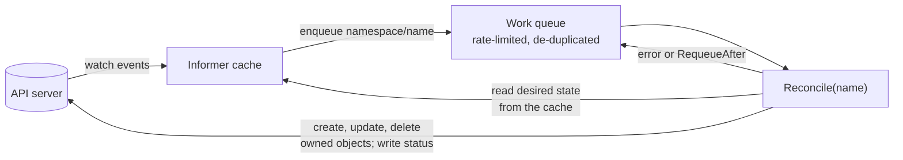
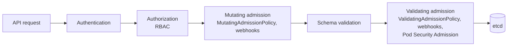
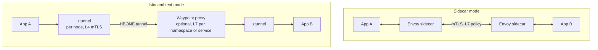
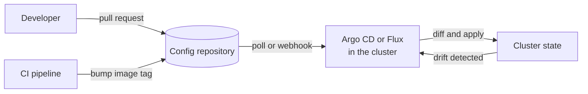
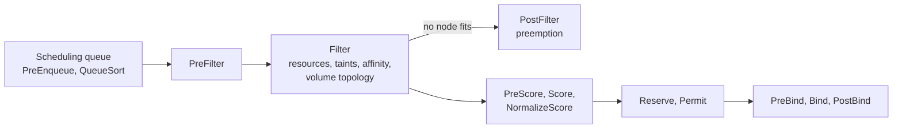

[Kubernetes](./) &raquo; Advanced Topics

This page covers what comes after running workloads: extending the Kubernetes API with custom resources, operators and admission policies; managing traffic with a service mesh; delivering changes through GitOps; sharing clusters between teams; controlling where Pods land, including on GPUs; and running the clusters themselves reliably and securely. It assumes familiarity with the [fundamentals](fundamentals.html), [networking](fundamentals-networking.html) and [operations](operations.html) pages. Version notes are current as of Kubernetes v1.37 (August 2026).

## Extending the API

Kubernetes is an API server with a set of controllers. Both halves are extensible: **custom resources** add new object types to the API, and **controllers** (called *operators* when they encode application-specific operational knowledge) make those objects do something.

| Mechanism | Adds | Use when |
|-----------|------|----------|
| **CustomResourceDefinition (CRD)** | A new resource type stored in etcd and served by the main API server | Almost always; the standard way to extend the API |
| **Aggregated API server** | A separate API server proxied under the main one | The data should not live in etcd, or needs custom storage or semantics (the metrics API works this way) |
| **Admission policies and webhooks** | Validation or mutation of any object at write time | Enforcing organisation rules; see [Admission Control](#admission-control-and-policy) |

### Custom Resource Definitions

A CRD declares a group, version, kind and an OpenAPI v3 schema. Everything else about the new type (kubectl support, RBAC, watch, server-side apply) comes for free. The schema can also carry **CEL validation rules** (`x-kubernetes-validations`), evaluated in the API server, which cover most validation that used to require a webhook.

```yaml
apiVersion: apiextensions.k8s.io/v1
kind: CustomResourceDefinition
metadata:
  name: databases.example.com
spec:
  group: example.com
  scope: Namespaced
  names:
    plural: databases
    singular: database
    kind: Database
    shortNames: [db]
  versions:
  - name: v1
    served: true
    storage: true
    subresources:
      status: {}                 # spec and status are written separately
    additionalPrinterColumns:
    - name: Engine
      type: string
      jsonPath: .spec.engine
    - name: Ready
      type: string
      jsonPath: .status.conditions[?(@.type=="Ready")].status
    schema:
      openAPIV3Schema:
        type: object
        properties:
          spec:
            type: object
            required: [engine, version]
            x-kubernetes-validations:
            - rule: "self.engine != 'mongodb' || self.replicas % 2 == 1"
              message: "MongoDB replica sets need an odd number of members"
            properties:
              engine:
                type: string
                enum: [postgres, mysql, mongodb]
                x-kubernetes-validations:
                - rule: "self == oldSelf"          # transition rule: immutable after creation
                  message: "engine cannot be changed"
              version:
                type: string
              replicas:
                type: integer
                minimum: 1
                default: 3
              backup:
                type: object
                properties:
                  schedule:
                    type: string                 # cron syntax
          status:
            type: object
            properties:
              conditions:
                type: array
                x-kubernetes-list-type: map
                x-kubernetes-list-map-keys: [type]
                items:
                  type: object
                  required: [type, status]
                  properties:
                    type: {type: string}
                    status: {type: string}
                    reason: {type: string}
                    message: {type: string}
                    lastTransitionTime: {type: string, format: date-time}
                    observedGeneration: {type: integer}
```

When a CRD gains a new version, a conversion webhook translates between versions, and storage version migration (enabled by default and GA in v1.37) rewrites stored objects to the new storage version.

### Operators and the Reconcile Loop

A CRD only teaches the API server a new noun. An **operator** supplies the verbs: a controller that watches `Database` objects, and the objects it creates for them, and repeatedly drives the cluster towards the state each `Database` describes. This is the same level-triggered reconcile loop every built-in controller uses.



Three properties make the loop robust:

- **Level-triggered, not edge-triggered.** `Reconcile` receives only a name, never the event that caused it. It reads the current desired and actual state and acts on the difference, so missed or duplicated events are harmless.
- **Idempotent.** Running `Reconcile` twice in a row must be safe; the second run should find nothing to do.
- **Owner references.** Objects the operator creates carry an owner reference to the `Database`. Deleting the `Database` garbage-collects them, and changes to them wake the operator up.

A reconciler written with [controller-runtime](https://github.com/kubernetes-sigs/controller-runtime), the library behind Kubebuilder and the Operator SDK:

```go
func (r *DatabaseReconciler) Reconcile(ctx context.Context, req ctrl.Request) (ctrl.Result, error) {
	log := logf.FromContext(ctx)

	var db examplev1.Database
	if err := r.Get(ctx, req.NamespacedName, &db); err != nil {
		// Deleted since the event was queued; owned objects are garbage-collected.
		return ctrl.Result{}, client.IgnoreNotFound(err)
	}

	// Create or update the StatefulSet so that it matches the spec.
	sts := &appsv1.StatefulSet{ObjectMeta: metav1.ObjectMeta{Name: db.Name, Namespace: db.Namespace}}
	op, err := controllerutil.CreateOrUpdate(ctx, r.Client, sts, func() error {
		r.applyStatefulSetSpec(&db, sts) // set only the fields this operator owns
		return controllerutil.SetControllerReference(&db, sts, r.Scheme)
	})
	if err != nil {
		return ctrl.Result{}, err // returned errors are retried with exponential backoff
	}
	log.Info("reconciled StatefulSet", "operation", op)

	// Report what was observed, not what was intended.
	meta.SetStatusCondition(&db.Status.Conditions, metav1.Condition{
		Type:               "Ready",
		Status:             statefulSetReady(sts),
		Reason:             "StatefulSetReconciled",
		Message:            fmt.Sprintf("%d/%d replicas ready", sts.Status.ReadyReplicas, db.Spec.Replicas),
		ObservedGeneration: db.Generation,
	})
	return ctrl.Result{}, r.Status().Update(ctx, &db)
}

func (r *DatabaseReconciler) SetupWithManager(mgr ctrl.Manager) error {
	return ctrl.NewControllerManagedBy(mgr).
		For(&examplev1.Database{}).
		Owns(&appsv1.StatefulSet{}). // reconcile again when an owned StatefulSet changes
		Owns(&batchv1.CronJob{}).
		Complete(r)
}
```

Practical guidance:

- Scaffold with **Kubebuilder** (v4) or the **Operator SDK**; both generate CRDs, RBAC and webhook boilerplate from Go types and markers.
- Use **finalizers** only when deletion must clean up something outside the cluster, such as a cloud database or DNS record. In-cluster children should rely on owner references.
- Run operators with leader election so only one replica reconciles at a time.
- Before writing one, check [OperatorHub](https://operatorhub.io/) and the CNCF landscape: mature operators exist for PostgreSQL (CloudNativePG), Kafka (Strimzi), certificates (cert-manager) and many other systems.

## Admission Control and Policy

Every write to the API server passes through authentication, authorization and then **admission**, where objects can be mutated and validated before they are stored.



Policy can be implemented in three ways:

| Approach | Status | Trade-offs |
|----------|--------|------------|
| **ValidatingAdmissionPolicy** and **MutatingAdmissionPolicy** | Stable since v1.30 and v1.36 respectively | CEL expressions evaluated inside the API server: no extra service to run, no webhook latency or availability risk. Limited to what CEL can express about the object and its request |
| **Policy engines**: Kyverno, OPA Gatekeeper | Mature CNCF projects | Rich policy libraries, background scanning of existing objects, reporting, image-signature verification; run as admission webhooks |
| **Custom webhooks** | Always available | Arbitrary logic, but a failing webhook can block writes to the whole cluster, so it needs high availability and careful `failurePolicy` choices |

A built-in policy that requires every Deployment in production namespaces to carry a `team` label:

```yaml
apiVersion: admissionregistration.k8s.io/v1
kind: ValidatingAdmissionPolicy
metadata:
  name: require-team-label
spec:
  failurePolicy: Fail
  matchConstraints:
    resourceRules:
    - apiGroups: ["apps"]
      apiVersions: ["v1"]
      operations: ["CREATE", "UPDATE"]
      resources: ["deployments"]
  validations:
  - expression: "has(object.metadata.labels) && 'team' in object.metadata.labels"
    message: "Deployments must carry a 'team' label"
---
apiVersion: admissionregistration.k8s.io/v1
kind: ValidatingAdmissionPolicyBinding
metadata:
  name: require-team-label-production
spec:
  policyName: require-team-label
  validationActions: [Deny]        # or [Warn, Audit] while rolling out
  matchResources:
    namespaceSelector:
      matchLabels:
        environment: production
```

### Pod Security Admission

The built-in **Pod Security Admission** controller enforces the three [Pod Security Standards](https://kubernetes.io/docs/concepts/security/pod-security-standards/) (`privileged`, `baseline`, `restricted`) per namespace, through labels. Each label sets one mode: `enforce` rejects non-compliant Pods, `warn` returns a warning to the client, and `audit` records the violation in the audit log. A common rollout is to start with `warn` and `audit`, fix the offenders, then turn on `enforce`.

```yaml
apiVersion: v1
kind: Namespace
metadata:
  name: production
  labels:
    pod-security.kubernetes.io/enforce: restricted
    pod-security.kubernetes.io/enforce-version: latest
    pod-security.kubernetes.io/warn: restricted
    pod-security.kubernetes.io/audit: restricted
```

PodSecurityPolicy, its predecessor, was removed in v1.25.

## Service Mesh

A service mesh moves cross-cutting concerns of service-to-service traffic (mutual TLS, retries, timeouts, traffic splitting, telemetry) out of application code and into the infrastructure. Istio and Linkerd are the most widely used; Cilium offers mesh features built on its eBPF data plane.

Meshes now come in two architectures:



| | Sidecar | Ambient (Istio, GA since 1.24) |
|---|---|---|
| **Proxy placement** | One proxy container in every Pod | A shared per-node L4 proxy (ztunnel), plus optional per-namespace or per-service L7 waypoint proxies |
| **Resource cost** | Scales with the number of Pods | Scales with nodes and with the services that need L7 features |
| **Adoption** | Pods must be restarted to inject the sidecar | Label a namespace; no Pod restart |
| **L7 features** | Always available | Only where a waypoint is deployed |

Kubernetes' native sidecar containers (init containers with `restartPolicy: Always`, stable since v1.33) fixed the classic sidecar lifecycle problems: the proxy now starts before the application and stops after it, so Jobs complete and early outbound connections succeed.

### Traffic Management

Traffic rules can be written either with Istio's own APIs or with the Gateway API, which Istio, Linkerd and Cilium all support for in-mesh traffic by attaching an `HTTPRoute` directly to a Service (the GAMMA initiative). The Gateway API form is portable between meshes:

```yaml
# Send 10% of requests for the reviews Service to v2
apiVersion: gateway.networking.k8s.io/v1
kind: HTTPRoute
metadata:
  name: reviews
spec:
  parentRefs:
  - group: ""
    kind: Service
    name: reviews
    port: 9080
  rules:
  - backendRefs:
    - name: reviews-v1
      port: 9080
      weight: 90
    - name: reviews-v2
      port: 9080
      weight: 10
```

The equivalent Istio configuration, with header-based routing for a test user and circuit breaking:

```yaml
apiVersion: networking.istio.io/v1
kind: VirtualService
metadata:
  name: reviews
spec:
  hosts: [reviews]
  http:
  - match:
    - headers:
        end-user:
          exact: tester
    route:
    - destination: {host: reviews, subset: v2}
  - route:
    - destination: {host: reviews, subset: v1}
      weight: 90
    - destination: {host: reviews, subset: v2}
      weight: 10
---
apiVersion: networking.istio.io/v1
kind: DestinationRule
metadata:
  name: reviews
spec:
  host: reviews
  trafficPolicy:
    connectionPool:
      tcp:
        maxConnections: 100
      http:
        http1MaxPendingRequests: 50
        http2MaxRequests: 100
    outlierDetection:                # eject failing endpoints: the mesh's circuit breaker
      consecutive5xxErrors: 5
      interval: 30s
      baseEjectionTime: 30s
      maxEjectionPercent: 50
  subsets:
  - name: v1
    labels: {version: v1}
  - name: v2
    labels: {version: v2}
```

`outlierDetection` removes an endpoint from the load-balancing pool for `baseEjectionTime` after five consecutive 5xx responses, while never ejecting more than half of the pool. The older `consecutiveErrors` field is deprecated in favour of `consecutive5xxErrors` and `consecutiveGatewayErrors`.

A mesh is not free: it adds operational components, latency (small, but not zero) and a new failure domain. For clusters that only need encryption in transit, CNI-level encryption (WireGuard in Cilium or Calico) may be enough.

## GitOps

GitOps treats a Git repository as the source of truth for what should run in a cluster. An agent inside the cluster continuously compares the live state with the repository and reconciles any difference, so deployments are pull requests, rollbacks are `git revert`, and manual changes to the cluster are reverted automatically.



The two main tools, both CNCF graduated projects:

| | Argo CD | Flux |
|---|---|---|
| **Model** | `Application` objects, each mapping a repository path to a destination cluster and namespace | Composable controllers: `GitRepository` or `OCIRepository` sources, `Kustomization` and `HelmRelease` appliers |
| **Interface** | Web UI and CLI with diff and sync views | CLI and Kubernetes objects; UI via third-party tools |
| **Multi-cluster** | One Argo CD can manage many clusters; `ApplicationSet` generates Applications | Typically one Flux per cluster, all pointing at the same repository |

```yaml
apiVersion: argoproj.io/v1alpha1
kind: Application
metadata:
  name: shop
  namespace: argocd
spec:
  project: default
  source:
    repoURL: https://github.com/example/shop-config
    targetRevision: main
    path: overlays/production
  destination:
    server: https://kubernetes.default.svc
    namespace: shop
  syncPolicy:
    automated:
      prune: true        # delete resources removed from Git
      selfHeal: true     # undo manual changes in the cluster
    syncOptions:
    - CreateNamespace=true
```

Pin `targetRevision` to a branch or tag rather than `HEAD` so that what is deployed is explicit. Progressive delivery (canaries and blue-green driven by metrics) is covered in [CI/CD Deployment](../ci-cd/deployment.html).

## Multi-Tenancy

Sharing a cluster between teams or customers means isolating their API access, their resource consumption, their network traffic and their workloads' privileges. The right isolation boundary depends on how much the tenants trust each other.

| Model | Isolation | Cost and overhead | Suits |
|-------|-----------|-------------------|-------|
| **Namespace per tenant** | RBAC, ResourceQuota, LimitRange, NetworkPolicy, Pod Security Admission. Tenants share the control plane, CRDs and nodes | Lowest | Teams within one organisation |
| **Namespace per tenant with dedicated nodes** | As above, plus taints, tolerations and node affinity to keep tenants on separate nodes; optionally sandboxed runtimes (gVisor, Kata Containers) | Moderate | Workloads with different trust or compliance levels |
| **Virtual clusters** (vCluster and similar) | Each tenant gets its own API server and CRDs, running as Pods in a host namespace; workloads still run on shared nodes | Moderate | Tenants who need cluster-admin, their own CRDs or their own Kubernetes version |
| **Cluster per tenant** | Complete, including the control plane and kernel | Highest; needs fleet management (Cluster API, managed services) | Untrusted tenants, strict regulatory separation |

The per-namespace guardrails every shared cluster should apply:

```yaml
apiVersion: v1
kind: ResourceQuota
metadata:
  name: tenant-quota
  namespace: team-payments
spec:
  hard:
    requests.cpu: "40"
    requests.memory: 80Gi
    limits.memory: 120Gi
    persistentvolumeclaims: "20"
    services.loadbalancers: "0"     # force traffic through the shared Gateway
    count/deployments.apps: "50"
```

Combine the quota with a `LimitRange` for default requests, a default-deny NetworkPolicy, the `restricted` Pod Security level and namespace-scoped RoleBindings. Policy engines such as Kyverno can generate this bundle automatically whenever a tenant namespace is created. The Hierarchical Namespace Controller (HNC), once a common way to do this, was archived in 2025 and should not be used for new designs.

## Advanced Scheduling

The scheduler assigns each pending Pod to a node in two phases: **filtering** removes nodes that cannot run the Pod, and **scoring** ranks the remaining ones. Both are made of plugins at fixed extension points, which can be enabled, disabled, weighted or supplemented.



Resource requests, node affinity, taints and tolerations are covered in [Health & Resource Management](fundamentals-resources.html#steering-placement). The tools below handle the next level of requirements.

### Topology Spread Constraints

Topology spread constraints keep replicas evenly spread across failure domains, so that losing one node or one zone takes out a bounded share of a service.

```yaml
apiVersion: apps/v1
kind: Deployment
metadata:
  name: web
spec:
  replicas: 6
  selector:
    matchLabels:
      app: web
  template:
    metadata:
      labels:
        app: web
    spec:
      topologySpreadConstraints:
      - maxSkew: 1
        topologyKey: topology.kubernetes.io/zone
        whenUnsatisfiable: DoNotSchedule      # hard requirement across zones
        minDomains: 3                         # treat fewer than 3 zones as a violation
        labelSelector:
          matchLabels:
            app: web
        matchLabelKeys: [pod-template-hash]   # spread each rollout revision separately
      - maxSkew: 1
        topologyKey: kubernetes.io/hostname
        whenUnsatisfiable: ScheduleAnyway     # soft preference across nodes
        labelSelector:
          matchLabels:
            app: web
      containers:
      - name: web
        image: registry.example.com/shop/web:3.2.0
```

`maxSkew: 1` means no zone may hold more than one replica more than the least-loaded zone. `matchLabelKeys` with `pod-template-hash` prevents the old and new ReplicaSets of a rolling update from being counted together, which would otherwise skew placement during rollouts.

### Priority and Preemption

A `PriorityClass` ranks Pods. When a high-priority Pod cannot be scheduled, the scheduler's PostFilter step can **preempt** (evict) lower-priority Pods to make room, respecting PodDisruptionBudgets where it can.

```yaml
apiVersion: scheduling.k8s.io/v1
kind: PriorityClass
metadata:
  name: business-critical
value: 100000
preemptionPolicy: PreemptLowerPriority   # "Never" queues ahead without evicting others
description: "Customer-facing services"
```

Keep the number of classes small (for example critical, default and batch), and give batch or best-effort work a low priority so it absorbs spare capacity and is evicted first.

### Scheduler Profiles

A single scheduler binary can run several **profiles**, each with its own plugin configuration, and Pods pick one with `spec.schedulerName`. A common use is bin-packing batch work onto as few nodes as possible so the cluster autoscaler can remove idle nodes:

```yaml
apiVersion: kubescheduler.config.k8s.io/v1
kind: KubeSchedulerConfiguration
profiles:
- schedulerName: default-scheduler          # unchanged: spread-oriented scoring
- schedulerName: bin-packing
  pluginConfig:
  - name: NodeResourcesFit
    args:
      scoringStrategy:
        type: MostAllocated                 # prefer the fullest node that still fits
        resources:
        - name: cpu
          weight: 1
        - name: memory
          weight: 1
```

On managed services the scheduler configuration is usually not editable; there, the same effect comes from the node autoscaler's consolidation settings (for example Karpenter's `consolidationPolicy`).

### Batch, AI and Gang Scheduling

The default scheduler places Pods one at a time. Distributed training and other tightly coupled jobs need all of their Pods to start together, or none of them (*gang scheduling*), and clusters shared by many batch users need queueing and fair sharing. Current options:

- **Kueue**, a Kubernetes SIG project, adds job queueing, quotas shared across teams and all-or-nothing admission on top of the default scheduler.
- **Workload-aware scheduling** in the core scheduler, introduced as an alpha feature in v1.35 and extended since, adds a `Workload` API so the scheduler can treat a group of Pods as one unit.
- **JobSet** and **LeaderWorkerSet** describe multi-Pod training and inference workloads with a leader and workers.

## GPUs and Other Accelerators

Kubernetes offers two ways to hand hardware devices to Pods.

| | Device plugins | Dynamic Resource Allocation (DRA) |
|---|---|---|
| **Status** | Stable for years | Core API (`resource.k8s.io/v1`) stable since v1.34 |
| **Request model** | A countable extended resource, such as `nvidia.com/gpu: 2` | A `ResourceClaim` that selects devices by attributes with CEL expressions |
| **Sharing and partitioning** | Whole devices only, unless the vendor plugin implements time-slicing or MIG profiles out of band | Claims can be shared between containers and Pods; partitionable and consumable-capacity devices are modelled in the API |
| **Selection** | Any device of that resource name | Filter by model, memory, driver version or topology |

The device-plugin form is still the most common:

```yaml
apiVersion: v1
kind: Pod
metadata:
  name: training
spec:
  containers:
  - name: trainer
    image: registry.example.com/ml/trainer:1.0
    resources:
      limits:
        nvidia.com/gpu: 2      # whole GPUs; requests default to the limit for extended resources
```

Do not set `NVIDIA_VISIBLE_DEVICES` yourself: the device plugin sets it per container to enforce isolation, and overriding it can expose every GPU on the node.

With DRA, a claim template describes the device and the Pod references it:

```yaml
apiVersion: resource.k8s.io/v1
kind: ResourceClaimTemplate
metadata:
  name: large-gpu
spec:
  spec:
    devices:
      requests:
      - name: gpu
        exactly:
          deviceClassName: gpu.nvidia.com     # DeviceClass installed by the vendor's DRA driver
          selectors:
          - cel:
              expression: device.capacity["gpu.nvidia.com"].memory.compareTo(quantity("40Gi")) >= 0
---
apiVersion: v1
kind: Pod
metadata:
  name: inference
spec:
  resourceClaims:
  - name: gpu
    resourceClaimTemplateName: large-gpu
  containers:
  - name: server
    image: registry.example.com/ml/server:2.1
    resources:
      claims:
      - name: gpu
```

Device classes, attribute names and capacity names are defined by each vendor's DRA driver, so check the driver's documentation for the exact values.

## Cluster Lifecycle

### Cluster API

[Cluster API](https://cluster-api.sigs.k8s.io/) manages clusters the way Kubernetes manages Pods: a *management cluster* holds `Cluster`, `Machine` and control-plane objects, and provider controllers (AWS, Azure, GCP, vSphere, bare metal and others) reconcile them into real infrastructure. Upgrading a fleet becomes a change to a version field.

```yaml
apiVersion: cluster.x-k8s.io/v1beta2
kind: Cluster
metadata:
  name: prod-eu-1
  namespace: fleet
spec:
  clusterNetwork:
    pods:
      cidrBlocks: ["192.168.0.0/16"]
    services:
      cidrBlocks: ["10.128.0.0/12"]
  controlPlaneRef:
    apiGroup: controlplane.cluster.x-k8s.io
    kind: KubeadmControlPlane
    name: prod-eu-1-control-plane
  infrastructureRef:
    apiGroup: infrastructure.cluster.x-k8s.io
    kind: AWSCluster
    name: prod-eu-1
```

The `v1beta2` API (Cluster API v1.11 and later) references related objects by `apiGroup` and `kind` rather than a full `apiVersion`. For fleets, **ClusterClass** defines a reusable cluster shape, and each `Cluster` then sets only `spec.topology` (version, replica counts and variables). Cluster API v1.12 added in-place machine updates and chained upgrades across several minor versions.

### Upgrades and Version Skew

Kubernetes releases a minor version roughly every four months and supports the three most recent minors for about a year each (v1.35 to v1.37 as of September 2026). Plan for at least one minor upgrade per quarter or two.

- Upgrade the control plane **one minor version at a time**; the kubelet may lag the API server by up to three minor versions, so nodes can follow later.
- Read the release's deprecation notes and check for removed APIs before upgrading (`kubectl convert`, or tools such as Pluto and kubent that scan manifests and live clusters).
- Recent upgrades with node-level impact: containerd 1.x is unsupported after v1.35, the kubelet no longer starts on cgroup v1 hosts by default from v1.35, and kube-proxy's `ipvs` mode is deprecated.

## Running Production Clusters

### High Availability

The control plane's durability comes from **etcd**, which uses Raft and needs a majority of members to accept writes.

| etcd members | Quorum | Failures tolerated |
|:---:|:---:|:---:|
| 1 | 1 | 0 |
| 3 | 2 | 1 |
| 5 | 3 | 2 |

- Run three control-plane nodes (five for very large or critical clusters) spread across availability zones. An even number adds no fault tolerance.
- Put the API servers behind a load balancer; kubelets and clients use its address.
- For workloads, combine replicas, topology spread across zones, readiness probes and **PodDisruptionBudgets**, so node drains during upgrades never take out too many replicas at once.

```yaml
apiVersion: policy/v1
kind: PodDisruptionBudget
metadata:
  name: web
spec:
  maxUnavailable: 1                 # during voluntary disruptions such as drains
  selector:
    matchLabels:
      app: web
  unhealthyPodEvictionPolicy: AlwaysAllow   # do not let crash-looping Pods block drains
```

### Capacity and Cost

| Layer | Tool | What it adjusts |
|-------|------|-----------------|
| Pod count | HorizontalPodAutoscaler, KEDA | Replicas from CPU, memory, custom or event-source metrics. KEDA can scale to zero; HPA scale-to-zero is beta in v1.37 |
| Pod size | VerticalPodAutoscaler | Requests from observed usage. `updateMode: InPlaceOrRecreate` uses in-place resize (stable since v1.35) and falls back to eviction; `Off` only produces recommendations |
| Node count | Cluster Autoscaler, Karpenter | Adds nodes for pending Pods and removes underused ones; Karpenter also picks instance types and consolidates workloads onto cheaper nodes |
| Spend | OpenCost and commercial tools | Allocates cost to namespaces, labels and teams |

```yaml
apiVersion: autoscaling.k8s.io/v1
kind: VerticalPodAutoscaler
metadata:
  name: api
spec:
  targetRef:
    apiVersion: apps/v1
    kind: Deployment
    name: api
  updatePolicy:
    updateMode: "Off"     # recommendations only; "Auto" is deprecated in favour of explicit modes
```

Spot or preemptible nodes cut compute costs for fault-tolerant work. Taint them so only workloads that tolerate interruption land there, and keep enough on-demand capacity for PodDisruptionBudgets to hold:

```yaml
tolerations:
- key: capacity-type
  operator: Equal
  value: spot
  effect: NoSchedule
nodeSelector:
  karpenter.sh/capacity-type: spot     # label set by Karpenter; other provisioners use their own
```

### Backup and Disaster Recovery

A cluster has two kinds of state to protect: the API objects in etcd, and application data in persistent volumes.

| What | How |
|------|-----|
| All API objects (self-managed control plane) | `etcdctl snapshot save` on a schedule, stored off-cluster; restore with `etcdutl snapshot restore` |
| Selected namespaces, including volumes | Velero with CSI snapshots or file-level backup |
| Desired state of applications | The GitOps repository itself; a new cluster can be rebuilt from it |
| Database contents | Application-level backups (for example CloudNativePG to object storage); volume snapshots alone are not consistent backups |

```bash
velero backup create shop-daily --include-namespaces shop --snapshot-volumes --ttl 720h
velero restore create --from-backup shop-daily
```

For regional failover, the common pattern is independent clusters per region, all reconciled from the same Git repository, with a global load balancer or DNS steering traffic. An Argo CD `ApplicationSet` deploys the same application to every registered cluster:

```yaml
apiVersion: argoproj.io/v1alpha1
kind: ApplicationSet
metadata:
  name: shop-all-regions
  namespace: argocd
spec:
  generators:
  - clusters:
      selector:
        matchLabels:
          env: production                 # one Application per matching cluster
  template:
    metadata:
      name: 'shop-{{name}}'
    spec:
      project: default
      source:
        repoURL: https://github.com/example/shop-config
        targetRevision: main
        path: overlays/production
      destination:
        server: '{{server}}'
        namespace: shop
```

Karmada and Open Cluster Management add policy-driven placement and failover across clusters. The older KubeFed project is retired. Stateful services need their own cross-region replication; see [Stateful Workloads & Persistence](persistence.html).

Test restores regularly. An untested backup is an assumption, not a recovery plan.

### Control-Plane Performance

Most control-plane problems in large clusters come from etcd size and from clients that list or watch too much.

**etcd.** The API server already compacts etcd history every five minutes. Compaction frees revisions logically, but the database file only shrinks after **defragmentation**, which briefly blocks the member, so run it one member at a time. Keep the database well under its size quota (2 GiB by default; 8 GiB is the commonly recommended maximum).

```bash
export ETCDCTL_ENDPOINTS=https://10.0.0.11:2379
export ETCDCTL_CACERT=/etc/kubernetes/pki/etcd/ca.crt
export ETCDCTL_CERT=/etc/kubernetes/pki/etcd/healthcheck-client.crt
export ETCDCTL_KEY=/etc/kubernetes/pki/etcd/healthcheck-client.key

etcdctl endpoint status --cluster -w table     # DB size, leader, raft index per member
etcdctl defrag                                 # this member only; repeat per member
etcdctl alarm list                             # NOSPACE means the quota was hit
```

**API Priority and Fairness (APF).** The API server does not simply cap in-flight requests. APF (stable since v1.29) classifies requests by `FlowSchema` into `PriorityLevelConfiguration`s, each with its own share of concurrency and fair queuing between clients, so one misbehaving controller cannot starve the others. The `--max-requests-inflight` and `--max-mutating-requests-inflight` flags now only set the total concurrency that APF divides. Tune by adding FlowSchemas for noisy clients rather than by raising the limits.

```bash
kubectl get flowschemas,prioritylevelconfigurations
kubectl get --raw /debug/api_priority_and_fairness/dump_priority_levels
```

With kubeadm, API server flags are set in the cluster configuration. In the current `v1beta4` format, `extraArgs` is a list of name and value pairs:

```yaml
apiVersion: kubeadm.k8s.io/v1beta4
kind: ClusterConfiguration
apiServer:
  extraArgs:
  - name: max-requests-inflight
    value: "800"
  - name: max-mutating-requests-inflight
    value: "400"
  - name: event-ttl
    value: "1h"
```

**Clients.** Controllers should use informers (a cached list followed by a watch) rather than polling, and avoid unpaginated lists of large resource types. Recent releases reduce the cost of lists further by serving them from the API server's watch cache and by streaming large lists.

### Security Hardening

| Area | Baseline |
|------|----------|
| API access | SSO via OIDC for people; least-privilege RBAC; no shared admin credentials; anonymous auth limited to health endpoints |
| Workload privileges | `restricted` Pod Security level; `seccompProfile: RuntimeDefault`; non-root users; user namespaces (stable since v1.36) for extra isolation |
| Network | Default-deny NetworkPolicies; mTLS through a mesh or CNI encryption; private API endpoint |
| Secrets | Encryption at rest with KMS v2; external secret stores; bound, short-lived ServiceAccount tokens |
| Supply chain | Images pinned by digest, signed (Sigstore cosign) and verified at admission; vulnerability scanning (Trivy, Grype); SBOMs |
| Detection and audit | API audit logging; runtime detection with Falco or Tetragon |
| Nodes and upgrades | CIS benchmark checks (kube-bench); minimal node OS images; staying within the supported version window |

See [Cloud & Container Security](../cybersecurity/cloud-and-container-security.html) for the wider threat model.

## Recent Capabilities

Kubernetes ships three minor releases a year. These recently stabilised features change how common problems are solved:

| Capability | Stable since | What it changes |
|------------|:------------:|-----------------|
| ValidatingAdmissionPolicy | v1.30 | CEL-based validation without running a webhook |
| Native sidecar containers | v1.33 | Sidecars start before and stop after the main containers |
| kube-proxy nftables mode | v1.33 | Faster, more scalable Service implementation; `ipvs` deprecated in v1.35 |
| Dynamic Resource Allocation | v1.34 | Attribute-based requests for GPUs and other devices |
| In-place Pod resize | v1.35 | Change CPU and memory requests and limits without restarting the Pod |
| MutatingAdmissionPolicy | v1.36 | CEL-based mutation without a webhook |
| User namespaces | v1.36 | Root inside the container maps to an unprivileged user on the host |
| Storage version migration | v1.37 | Automatic rewrite of stored objects after a resource's storage version changes |
| Gateway API v1.6 | August 2026 | TCPRoute and UDPRoute join the standard channel |

The [Kubernetes blog](https://kubernetes.io/blog/) publishes a detailed announcement and a deprecations summary for each release.

## Ecosystem

| Need | Widely used projects |
|------|---------------------|
| Packaging and configuration | Helm, Kustomize |
| GitOps and progressive delivery | Argo CD, Flux, Argo Rollouts, Flagger |
| Metrics, logs and traces | Prometheus, Grafana, OpenTelemetry, Loki, Tempo, Jaeger |
| Policy | Kyverno, OPA Gatekeeper, built-in admission policies |
| Security | Falco, Tetragon, Trivy, cert-manager, External Secrets Operator |
| Networking | Cilium, Calico, Envoy Gateway, Istio, Linkerd |
| Autoscaling | KEDA, Karpenter, Cluster Autoscaler |
| Batch and AI | Kueue, JobSet, Kubeflow, KubeRay, KServe |
| Platform building | Crossplane, Backstage, Cluster API, vCluster |
| Developer workflow | Tilt, Skaffold, Telepresence, k9s |
| Edge and small clusters | K3s, KubeEdge |

### When Kubernetes Is the Wrong Tool

Kubernetes pays off when there are many services, several teams, a need for portability across environments, or a requirement for its extension ecosystem. For a handful of stateless services, managed container platforms (AWS ECS or App Runner, Google Cloud Run, Azure Container Apps) or HashiCorp Nomad remove most of the operational burden, and a managed Kubernetes service (EKS, GKE, AKS) is almost always preferable to running the control plane yourself.

## See Also

- [Fundamentals](fundamentals.html): architecture, core objects and the reconciliation loop
- [Networking & Configuration](fundamentals-networking.html): Services, Gateway API, NetworkPolicies and RBAC
- [Health & Resource Management](fundamentals-resources.html): probes, requests and limits, basic scheduling and the HPA
- [Stateful Workloads & Persistence](persistence.html): StatefulSets, storage and backups
- [Operations](operations.html): kubectl, Helm, observability and troubleshooting
- [CI/CD](../ci-cd/): pipelines, GitOps and deployment strategies
- [Docker](../docker/): container fundamentals
- [Terraform](../terraform/): provisioning clusters and cloud infrastructure as code
- [AWS](../aws/): managed Kubernetes with EKS
