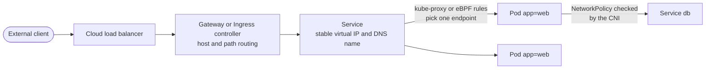
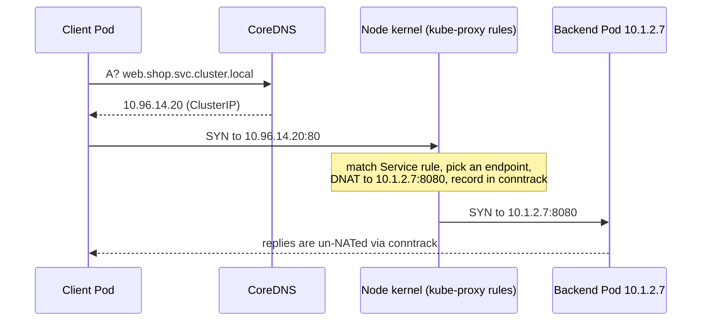
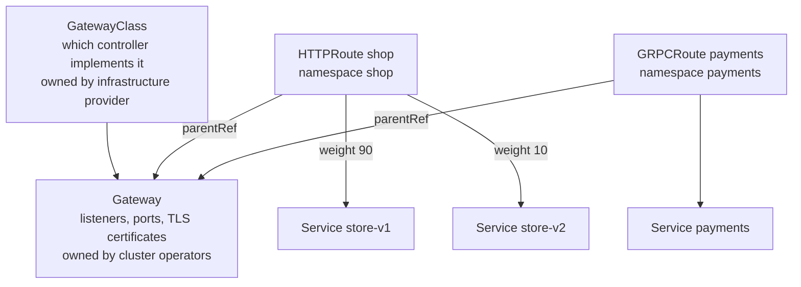
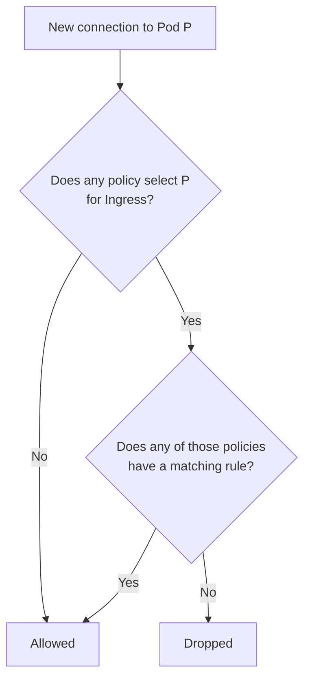
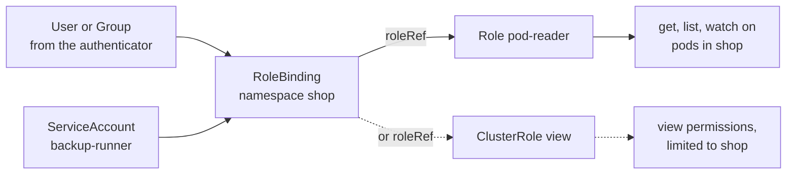

[Kubernetes Fundamentals](./) &raquo; Networking & Configuration

This page covers the layer that turns a set of [Pods and Deployments](fundamentals.html) into a working, secured application: how Pods get addresses, how Services give them stable names, how traffic enters the cluster through Ingress or the Gateway API, how NetworkPolicies restrict which Pods may talk to each other, how configuration and credentials reach a container, and how RBAC controls access to the Kubernetes API. Version notes are current as of Kubernetes v1.37 (August 2026).

## The Kubernetes Network Model

Every conformant cluster implements three rules:

1. Every Pod gets its own IP address (or one per IP family in a dual-stack cluster), shared by all containers in the Pod.
2. Pods on any node can reach Pods on any other node directly, without NAT.
3. Agents on a node, such as the kubelet, can reach every Pod on that node.

Kubernetes defines this contract but does not implement it. A **CNI (Container Network Interface) plugin**, installed when the cluster is built, allocates Pod IPs and makes cross-node routing work, either by encapsulating traffic in an overlay (VXLAN, Geneve) or by routing Pod CIDRs natively through the underlying network.

| Plugin | Data path | Enforces NetworkPolicy | Notes |
|--------|-----------|:----------------------:|-------|
| **Cilium** | eBPF | Yes, plus L7 and FQDN rules in its own CRDs | Can replace kube-proxy; Hubble for flow visibility |
| **Calico** | iptables, nftables, eBPF or Windows HNS | Yes, plus global policies in its own CRDs | BGP for routed, non-overlay networks |
| **Flannel** | VXLAN or host routing | No | Minimal; often paired with a separate policy engine |
| **Cloud VPC CNIs** (AWS VPC CNI, Azure CNI, GKE Dataplane V2) | Pod IPs taken from the cloud network | Varies; often via an eBPF engine or an add-on | Pods are first-class addresses in the VPC |

Pod IPs are routable but **ephemeral**: a restart, reschedule or scale event gives a Pod a new address. Nothing should depend on a Pod IP. The Service object exists to provide a stable address in front of a changing set of Pods.

The diagram shows the path a request typically takes into and through a cluster; each hop is covered in a section below.



## Services

A **Service** gives a set of Pods a single stable virtual IP (the *ClusterIP*) and DNS name, and load-balances connections across whichever of those Pods are currently ready.

```yaml
apiVersion: v1
kind: Service
metadata:
  name: web
  namespace: shop
spec:
  selector:
    app: web              # route to ready Pods carrying this label
  ports:
  - name: http
    port: 80              # port clients connect to on the ClusterIP
    targetPort: 8080      # port the container listens on (a number or a named port)
```

### EndpointSlices and Readiness

The Service controller continuously matches the `selector` against Pod labels and writes the resulting Pod IPs and ports into **EndpointSlice** objects (at most 100 endpoints per slice by default, so large Services are split across several slices). kube-proxy and other data planes program traffic from the EndpointSlices, not from the Service itself. The older `Endpoints` API has been deprecated since v1.33: it cannot represent dual-stack addresses or newer routing hints and is truncated at 1,000 endpoints.

```bash
kubectl get endpointslices -n shop -l kubernetes.io/service-name=web
kubectl describe service web -n shop
```

**If a Service has no ready endpoints, connections to it fail.** That almost always has one of two causes: the selector does not match the Pods' labels, or no Pod is passing its readiness probe. A failing readiness probe removes a Pod from the endpoints without restarting it, which is how rolling updates avoid sending traffic to Pods that are still starting. See [Health & Resource Management](fundamentals-resources.html) for probe design.

A Service without a selector is also valid. You then manage the EndpointSlices yourself, which is a way to give an external database or a service in another cluster an in-cluster name.

### Service DNS

The cluster DNS server (CoreDNS in almost every distribution) serves records derived from Services:

| Record | Name | Resolves to |
|--------|------|-------------|
| A / AAAA | `web.shop.svc.cluster.local` | The ClusterIP |
| A / AAAA (headless Service) | `db.shop.svc.cluster.local` | The IPs of all ready Pods |
| A / AAAA (StatefulSet Pod) | `db-0.db.shop.svc.cluster.local` | One specific Pod, via its headless Service |
| SRV | `_http._tcp.web.shop.svc.cluster.local` | Port number and host for each named port |

Each Pod's `/etc/resolv.conf` lists search domains (`shop.svc.cluster.local svc.cluster.local cluster.local`), so a Pod in namespace `shop` can use the short name `web`, and any Pod can use `web.shop`. The same file sets `options ndots:5`: any name with fewer than five dots is first tried against every search domain. A lookup of `api.example.com` therefore produces several failed queries before the real one. For latency-sensitive workloads that call external hosts, use fully qualified names with a trailing dot (`api.example.com.`), lower `ndots` through the Pod's `dnsConfig`, or run NodeLocal DNSCache to answer repeated queries on the node.

### Service Types

| Type | Reachable from | How it works | Typical use |
|------|----------------|--------------|-------------|
| **ClusterIP** (default) | Inside the cluster | Virtual IP programmed on every node | Internal services |
| **NodePort** | Every node's IP on a port in 30000-32767 | A ClusterIP plus a port opened on every node | Behind an external load balancer you manage; development |
| **LoadBalancer** | An external IP | A NodePort plus a load balancer provisioned by the cloud controller (or MetalLB and similar on bare metal) | Exposing a single non-HTTP service, or the Gateway or Ingress controller itself |
| **ExternalName** | Inside the cluster | A DNS CNAME to an external hostname; no proxying | Giving an external dependency an in-cluster name |
| **Headless** (`clusterIP: None`) | Inside the cluster | No virtual IP; DNS returns Pod IPs directly | StatefulSets, client-side load balancing, peer discovery |

The first three types are layered: a NodePort Service also has a ClusterIP, and a LoadBalancer Service also has a NodePort (unless `allocateLoadBalancerNodePorts: false` and the load balancer can target Pods directly). On a local cluster such as kind or minikube, a LoadBalancer Service stays `<pending>` unless a load-balancer implementation is installed (for example `minikube tunnel` or cloud-provider-kind).

The `spec.externalIPs` field, which let a Service claim arbitrary external addresses, is deprecated as of v1.36 because any user able to create Services could use it to intercept traffic.

Headless Services and the stable per-Pod DNS names they give StatefulSets are covered in [Stateful Workloads & Persistence](persistence.html#headless-services-dns-for-peers).

### Traffic Policies and Topology

By default a Service spreads connections across all ready endpoints in the cluster, including those in other zones. Three fields change that:

| Field | Values | Effect |
|-------|--------|--------|
| `externalTrafficPolicy` (NodePort, LoadBalancer) | `Cluster` (default), `Local` | `Local` sends external traffic only to Pods on the node that received it. The client source IP is preserved and the extra hop disappears, but nodes without a local Pod fail the load balancer's health check and must be taken out of rotation |
| `internalTrafficPolicy` | `Cluster` (default), `Local` | `Local` restricts in-cluster traffic to endpoints on the same node, for node-local agents such as a logging DaemonSet |
| `trafficDistribution` | `PreferSameZone`, `PreferSameNode` | A preference, not a rule: route to endpoints in the client's zone (or on its node) when any exist, otherwise fall back to the rest. Reduces cross-zone latency and data-transfer charges. `PreferClose` is a deprecated alias for `PreferSameZone` |

## How kube-proxy Implements Services

A ClusterIP is not assigned to any network interface. **kube-proxy**, which runs on every node (usually as a DaemonSet), watches Services and EndpointSlices and programs the node's kernel so that a packet addressed to `ClusterIP:port` is rewritten (DNAT) to a chosen Pod's `IP:port`. kube-proxy is not in the data path; the kernel does the rewriting, which is why Services add almost no latency.



| Mode | Mechanism | Status (v1.37) |
|------|-----------|----------------|
| **iptables** | Chains of DNAT rules; a random endpoint per connection | Default when no mode is configured. Rule updates and matching slow down with tens of thousands of endpoints |
| **nftables** | The same model on the newer nftables kernel API, using maps and sets for lookups | Stable since v1.33 and the recommended mode on Linux; planned to become the default. Needs kernel 5.13 or newer |
| **ipvs** | The kernel's IPVS load balancer with hash-table lookups | Deprecated in v1.35; migrate to nftables |
| **kernelspace** | Windows HNS | The only mode on Windows nodes |
| *(none)* | CNI replaces kube-proxy (Cilium, Calico eBPF) | eBPF programs attached at the socket or interface handle Service translation |

Because the default may change in a future release, set `mode` explicitly in the kube-proxy configuration so an upgrade does not silently switch the backend.

## Ingress and the Gateway API

Services of type LoadBalancer give one external IP per Service and work at layer 4. HTTP applications usually need one entry point that routes by hostname and path, terminates TLS and applies policies such as redirects or header matching. Kubernetes has two APIs for that: the original **Ingress** and its successor, the **Gateway API**.

Both APIs are only configuration. Nothing happens until a **controller** that implements them is running in the cluster: a proxy (typically Envoy, NGINX, HAProxy or Traefik based) or a cloud load-balancer integration that watches the objects and configures itself.

| | Ingress (`networking.k8s.io/v1`) | Gateway API (`gateway.networking.k8s.io/v1`) |
|---|---|---|
| **Status** | Stable but frozen: no new features | Actively developed; v1.6 (August 2026) is current |
| **Protocols** | HTTP and HTTPS | HTTP, HTTPS, gRPC, TLS passthrough, TCP and UDP |
| **Ownership model** | One object mixes infrastructure and routing | Split by role: `GatewayClass` (provider), `Gateway` (cluster operator), routes (application teams) |
| **Traffic splitting, header matching, mirroring, retries** | Only through controller-specific annotations | Part of the portable spec |
| **Cross-namespace routing** | Not supported | Explicit, with `allowedRoutes` on the Gateway and `ReferenceGrant` for backends |

### Ingress

```yaml
apiVersion: networking.k8s.io/v1
kind: Ingress
metadata:
  name: shop
  namespace: shop
spec:
  ingressClassName: example-controller   # which installed controller handles this Ingress
  tls:
  - hosts: ["shop.example.com"]
    secretName: shop-tls                 # kubernetes.io/tls Secret, often managed by cert-manager
  rules:
  - host: shop.example.com
    http:
      paths:
      - path: /api
        pathType: Prefix                 # matches /api and /api/v1, not /apiary
        backend:
          service:
            name: api
            port:
              number: 80
      - path: /
        pathType: Prefix
        backend:
          service:
            name: web
            port:
              number: 80
```

`pathType: Exact` matches the path literally, and `ImplementationSpecific` leaves matching to the controller. Anything beyond host, path and TLS (rewrites, rate limits, authentication) is expressed through annotations that differ from one controller to the next, which is the main reason Ingress manifests are not portable.

**The community `ingress-nginx` controller has been retired.** Kubernetes SIG Network ended its best-effort maintenance in March 2026; existing installations keep working but receive no further releases or security fixes. Clusters that still use it should move to another Ingress controller or, preferably, to a Gateway API implementation. The `ingress2gateway` tool (v1.0, March 2026) converts Ingress resources, including much of the `ingress-nginx`-specific annotation behaviour, into Gateway API objects. Commercially maintained NGINX-based controllers are separate projects and are not affected.

### Gateway API

The Gateway API separates the three concerns an Ingress mixes together:



A platform team defines the shared Gateway once and chooses which namespaces may attach routes to it:

```yaml
apiVersion: gateway.networking.k8s.io/v1
kind: Gateway
metadata:
  name: prod
  namespace: infra
spec:
  gatewayClassName: example-gateway-class
  listeners:
  - name: https
    protocol: HTTPS
    port: 443
    hostname: "*.example.com"
    tls:
      mode: Terminate
      certificateRefs:
      - name: wildcard-example-com
    allowedRoutes:
      namespaces:
        from: Selector
        selector:
          matchLabels:
            gateway-access: prod
```

Application teams then attach routes from their own namespaces without touching the Gateway. This route sends 10% of `/api` traffic to a canary:

```yaml
apiVersion: gateway.networking.k8s.io/v1
kind: HTTPRoute
metadata:
  name: shop
  namespace: shop                 # namespace labelled gateway-access=prod
spec:
  parentRefs:
  - name: prod
    namespace: infra
  hostnames: ["shop.example.com"]
  rules:
  - matches:
    - path:
        type: PathPrefix
        value: /api
    backendRefs:
    - name: store-v1
      port: 8080
      weight: 90
    - name: store-v2
      port: 8080
      weight: 10
  - backendRefs:                  # everything else
    - name: web
      port: 80
```

Implementations include Envoy Gateway, Istio, Cilium, NGINX Gateway Fabric, Traefik, Kong and the major cloud providers' load-balancer controllers; each publishes the conformance profiles it passes. The same `HTTPRoute` resource is also used by service meshes for east-west traffic, by attaching it to a Service instead of a Gateway (see [Advanced Topics](advanced.html)).

### TLS Certificates

Both APIs reference certificates stored in `kubernetes.io/tls` Secrets. In practice those Secrets are created and renewed by **cert-manager**, which obtains certificates from ACME issuers such as Let's Encrypt or from an internal CA, and can read Gateway and Ingress objects directly to decide which certificates to request.

## NetworkPolicies

By default every Pod accepts traffic from every other Pod in the cluster. A **NetworkPolicy** restricts that for the Pods it selects. Policies are enforced by the CNI plugin: with a plugin that does not implement them (Flannel on its own, for example), NetworkPolicy objects are accepted by the API server and silently have no effect.

```yaml
apiVersion: networking.k8s.io/v1
kind: NetworkPolicy
metadata:
  name: api-from-frontend
  namespace: shop
spec:
  podSelector:
    matchLabels:
      app: api                # the Pods this policy protects
  policyTypes: [Ingress]
  ingress:
  - from:
    - podSelector:
        matchLabels:
          app: frontend       # only frontend Pods in the same namespace
    ports:
    - protocol: TCP
      port: 8080
```

### Semantics

- NetworkPolicies are **allow lists that add up**. There is no deny rule.
- A Pod that no policy selects allows all traffic.
- As soon as any policy selects a Pod for a direction (`Ingress` or `Egress`), that direction becomes default-deny for the Pod, and only traffic that matches at least one policy is allowed.
- Replies to allowed connections are always permitted; policies act on new connections.



The standard hardening pattern is a namespace-wide default-deny, followed by narrow allow policies:

```yaml
apiVersion: networking.k8s.io/v1
kind: NetworkPolicy
metadata:
  name: default-deny
  namespace: shop
spec:
  podSelector: {}              # every Pod in the namespace
  policyTypes: [Ingress, Egress]
```

### Selectors: AND versus OR

Peers can be selected by Pod labels, namespace labels or CIDR blocks. The YAML structure decides whether selectors combine with AND or OR, and getting it wrong usually produces a policy that is more permissive than intended:

```yaml
ingress:
- from:
  # Two list items: OR. Any Pod in a namespace labelled team=web,
  # or any Pod labelled app=monitor in this policy's namespace.
  - namespaceSelector:
      matchLabels:
        team: web
  - podSelector:
      matchLabels:
        app: monitor
- from:
  # One list item with both selectors: AND.
  # Only Pods labelled app=gateway in namespaces labelled team=web.
  - namespaceSelector:
      matchLabels:
        team: web
    podSelector:
      matchLabels:
        app: gateway
```

Every namespace automatically carries the label `kubernetes.io/metadata.name: <name>`, which makes it easy to select one namespace by name.

### Allowing DNS

A default-deny egress policy also blocks DNS, so every Service lookup starts failing. Allow queries to the cluster DNS Pods on both UDP and TCP port 53 (TCP is used for large responses):

```yaml
apiVersion: networking.k8s.io/v1
kind: NetworkPolicy
metadata:
  name: allow-dns
  namespace: shop
spec:
  podSelector: {}
  policyTypes: [Egress]
  egress:
  - to:
    - namespaceSelector:
        matchLabels:
          kubernetes.io/metadata.name: kube-system
      podSelector:
        matchLabels:
          k8s-app: kube-dns    # label used by CoreDNS in most distributions
    ports:
    - protocol: UDP
      port: 53
    - protocol: TCP
      port: 53
```

### Limits of the Built-in API

The `NetworkPolicy` API is deliberately small:

| Not supported | Common workaround |
|---------------|-------------------|
| Explicit deny rules, or policies that override namespace owners | Cluster-scoped admin policies: SIG Network's `ClusterNetworkPolicy` (still alpha; it merges the earlier AdminNetworkPolicy and BaselineAdminNetworkPolicy drafts), or CNI-specific CRDs such as Calico `GlobalNetworkPolicy` and Cilium `CiliumClusterwideNetworkPolicy` |
| Rules based on domain names (FQDN) | Cilium and Calico FQDN policies, or an egress gateway |
| Layer 7 rules (HTTP methods, paths) | Cilium L7 policies or a service mesh authorization policy |
| Logging of dropped traffic | CNI tooling (Hubble, Calico flow logs) |

## ConfigMaps and Secrets

Configuration is kept out of container images so the same image can run unchanged in every environment. **ConfigMaps** hold non-sensitive settings; **Secrets** hold credentials and keys. Both are limited to 1 MiB per object.

```yaml
apiVersion: v1
kind: ConfigMap
metadata:
  name: app-config
data:
  LOG_LEVEL: info
  FEATURE_CHECKOUT_V2: "true"
  app.properties: |           # a whole file as one key
    cache.size=256
    cache.ttl=60s
---
apiVersion: v1
kind: Secret
metadata:
  name: db-credentials
type: Opaque
stringData:                   # plain text in; stored base64-encoded under data:
  username: app
  password: change-me
```

### Consuming Configuration

```yaml
spec:
  containers:
  - name: app
    image: registry.example.com/shop/app:1.4.2
    envFrom:
    - configMapRef:
        name: app-config               # every key becomes an environment variable
    env:
    - name: DB_PASSWORD
      valueFrom:
        secretKeyRef:
          name: db-credentials
          key: password
    volumeMounts:
    - name: config
      mountPath: /etc/app              # each key becomes a file
      readOnly: true
  volumes:
  - name: config
    configMap:
      name: app-config
```

| Method | Picks up changes to the ConfigMap or Secret? | Notes |
|--------|:--------------------------------------------:|-------|
| Environment variables (`env`, `envFrom`) | No, fixed when the container starts | Simple; values can leak into crash dumps and child processes |
| Volume mount | Yes, after the kubelet's sync delay (typically under a minute) | The application must notice and re-read the file |
| Volume mount with `subPath` | No | A common surprise: the single file is copied, not linked |

To roll out a configuration change deliberately, change something in the Pod template. Helm charts conventionally add a checksum of the rendered ConfigMap as a Pod-template annotation, and Kustomize's ConfigMap generator appends a content hash to the ConfigMap's name, so any change produces a new rollout. Setting `immutable: true` on a ConfigMap or Secret prevents edits and lets the kubelet stop watching it, which reduces API server load in large clusters.

### Securing Secrets

A Secret's value is only base64-encoded. Anyone who can read the object, or an etcd backup, can read the credential. Protection comes from controlling access:

- **RBAC.** Grant `get` on Secrets only to the workloads that need them. Note that `list` and `watch` return full Secret contents too, and that anyone who can create Pods in a namespace can mount any Secret in it.
- **Encryption at rest.** Configure the API server to encrypt Secrets in etcd, preferably with a KMS v2 provider so the key lives in an external key-management service rather than on the control-plane disk. Managed services (EKS, GKE, AKS) offer this as a setting.
- **External secret stores.** Keep the source of truth in Vault or a cloud secrets manager and sync it into the cluster with the External Secrets Operator, or mount it directly with the Secrets Store CSI Driver.
- **Nothing in plain text in Git.** When Secrets must live in a GitOps repository, encrypt them with Sealed Secrets or SOPS.

| Secret type | Used for |
|-------------|----------|
| `Opaque` | Arbitrary key-value data (the default) |
| `kubernetes.io/tls` | A certificate and private key for Ingress, Gateway or application TLS |
| `kubernetes.io/dockerconfigjson` | Registry credentials, referenced from `imagePullSecrets` |
| `kubernetes.io/basic-auth`, `kubernetes.io/ssh-auth` | Structured credentials with required keys |
| `kubernetes.io/service-account-token` | Legacy long-lived ServiceAccount tokens; avoid in favour of bound tokens |

## RBAC and ServiceAccounts

NetworkPolicies control traffic between workloads. **RBAC** controls who may do what through the Kubernetes API, whether the caller is a person, a CI system or a Pod.

### ServiceAccounts

Every Pod runs as a **ServiceAccount**, its identity towards the API server; if none is specified, it runs as the namespace's `default` ServiceAccount. The kubelet mounts a **bound token** into the Pod through a projected volume. The token is a short-lived JWT (one hour by default, refreshed automatically), tied to the specific Pod, and invalid as soon as the Pod is deleted. Since v1.24, Kubernetes no longer creates the long-lived, Secret-based tokens that older tutorials describe.

```yaml
apiVersion: v1
kind: ServiceAccount
metadata:
  name: backup-runner
  namespace: shop
automountServiceAccountToken: false     # opt in per Pod instead
---
apiVersion: apps/v1
kind: Deployment
metadata:
  name: backup
  namespace: shop
spec:
  selector:
    matchLabels:
      app: backup
  template:
    metadata:
      labels:
        app: backup
    spec:
      serviceAccountName: backup-runner
      automountServiceAccountToken: true  # this Pod does call the API
      containers:
      - name: backup
        image: registry.example.com/ops/backup:2.3.0
```

Give each application its own ServiceAccount and disable token mounting for Pods that never call the Kubernetes API, which is most application Pods. Bound tokens can also be projected with a custom audience for workload identity federation, which is how Pods authenticate to cloud APIs (EKS Pod Identity or IRSA, GKE Workload Identity, Azure Workload Identity) without static cloud credentials.

### Roles and Bindings

| Object | Scope | Purpose |
|--------|-------|---------|
| **Role** | One namespace | A set of allowed verbs on resources in that namespace |
| **ClusterRole** | Cluster | The same for cluster-scoped resources (nodes, namespaces), or a reusable permission set |
| **RoleBinding** | One namespace | Grants a Role or ClusterRole to subjects, within that namespace only |
| **ClusterRoleBinding** | Cluster | Grants a ClusterRole to subjects in every namespace |

RBAC is **additive only**: there are no deny rules, and a subject's permissions are the union of everything bound to it.

```yaml
apiVersion: rbac.authorization.k8s.io/v1
kind: Role
metadata:
  name: pod-reader
  namespace: shop
rules:
- apiGroups: [""]                        # "" is the core API group
  resources: ["pods", "pods/log"]
  verbs: ["get", "list", "watch"]
---
apiVersion: rbac.authorization.k8s.io/v1
kind: RoleBinding
metadata:
  name: backup-runner-reads-pods
  namespace: shop
subjects:
- kind: ServiceAccount
  name: backup-runner
  namespace: shop
roleRef:
  apiGroup: rbac.authorization.k8s.io
  kind: Role
  name: pod-reader
```



Binding a **ClusterRole through a RoleBinding** is a common pattern: the ClusterRole defines a permission set once, and each RoleBinding applies it within one namespace only. The built-in `view`, `edit` and `admin` ClusterRoles are intended for exactly this, and are *aggregated*, so CRD authors can extend them by labelling their own ClusterRoles.

### Least Privilege

- Reserve `cluster-admin` for break-glass administration.
- Avoid wildcards (`"*"`) in `resources` and `verbs` for workload roles.
- Treat some permissions as equivalent to administrator access: `escalate`, `bind` and `impersonate`; creating Pods or workloads (which can mount any Secret or ServiceAccount in the namespace); `create` on `serviceaccounts/token`; and `update` on RBAC objects.
- Prefer namespaced Roles and RoleBindings over cluster-wide grants.
- Verify the result instead of reading YAML:

```bash
kubectl auth can-i list pods -n shop \
  --as=system:serviceaccount:shop:backup-runner        # yes
kubectl auth can-i delete deployments -n shop \
  --as=system:serviceaccount:shop:backup-runner        # no
kubectl auth can-i --list -n shop \
  --as=system:serviceaccount:shop:backup-runner        # everything it can do
```

## Common Pitfalls

| Symptom | Likely cause | Check |
|---------|--------------|-------|
| Service times out or refuses connections | Selector does not match Pod labels, or no Pod is ready | `kubectl get endpointslices -l kubernetes.io/service-name=<svc>` |
| NetworkPolicy has no effect | CNI does not enforce policies | Check the CNI; test with a Pod that should be blocked |
| Everything breaks after a default-deny egress policy | DNS is blocked | Allow UDP and TCP 53 to the cluster DNS Pods |
| LoadBalancer stays `<pending>` | No load-balancer implementation (local or bare-metal cluster) | Install MetalLB or use a Gateway behind a NodePort |
| Ingress or Gateway exists but routes nothing | No controller installed, or wrong `ingressClassName` or `gatewayClassName` | `kubectl get ingressclass,gatewayclass`; check the route's status conditions |
| Client IPs appear as node IPs in logs | `externalTrafficPolicy: Cluster` SNATs external traffic | Use `Local`, or the PROXY protocol or `X-Forwarded-For` at the load balancer |
| Config change not picked up | Values consumed as environment variables or through `subPath` | Restart the rollout, or mount as a volume without `subPath` |
| A single compromised Pod leads to cluster compromise | Over-privileged ServiceAccount or `cluster-admin` binding | `kubectl auth can-i --list --as=system:serviceaccount:<ns>:<sa>` |

## See Also

- [Fundamentals](fundamentals.html): Pods, Deployments, cluster architecture and the reconciliation loop
- [Health & Resource Management](fundamentals-resources.html): probes, which decide whether a Pod receives Service traffic
- [Stateful Workloads & Persistence](persistence.html): StatefulSets and headless Services
- [Workloads & Storage](workloads.html): Pod Security Standards and autoscaling
- [Operations](operations.html): kubectl, Helm and troubleshooting
- [Advanced Topics](advanced.html): service mesh, GitOps, multi-tenancy and extending the API
- [Networking fundamentals](../networking/): the TCP/IP, DNS and load-balancing concepts this page builds on
- [Service Discovery](../../distributed-systems/service-discovery.html): discovery patterns beyond a single cluster
- [AWS compute](../aws/compute.html): managed Kubernetes with EKS
