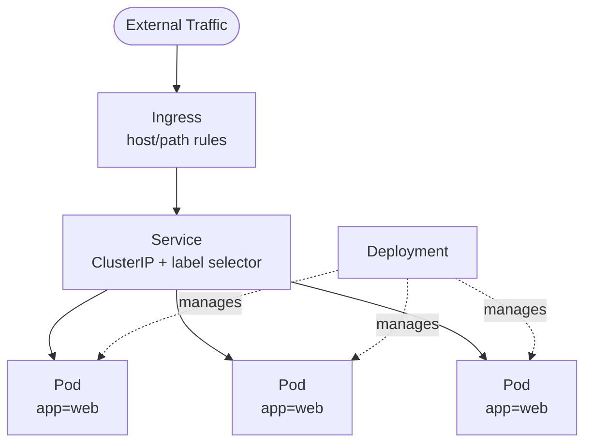
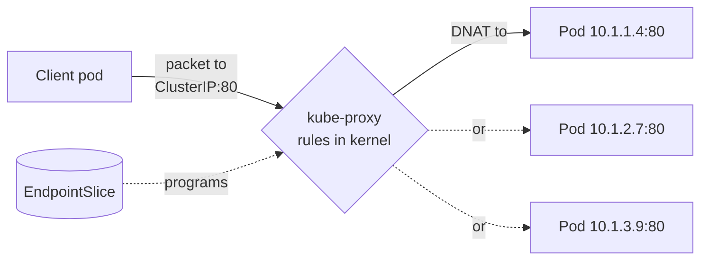
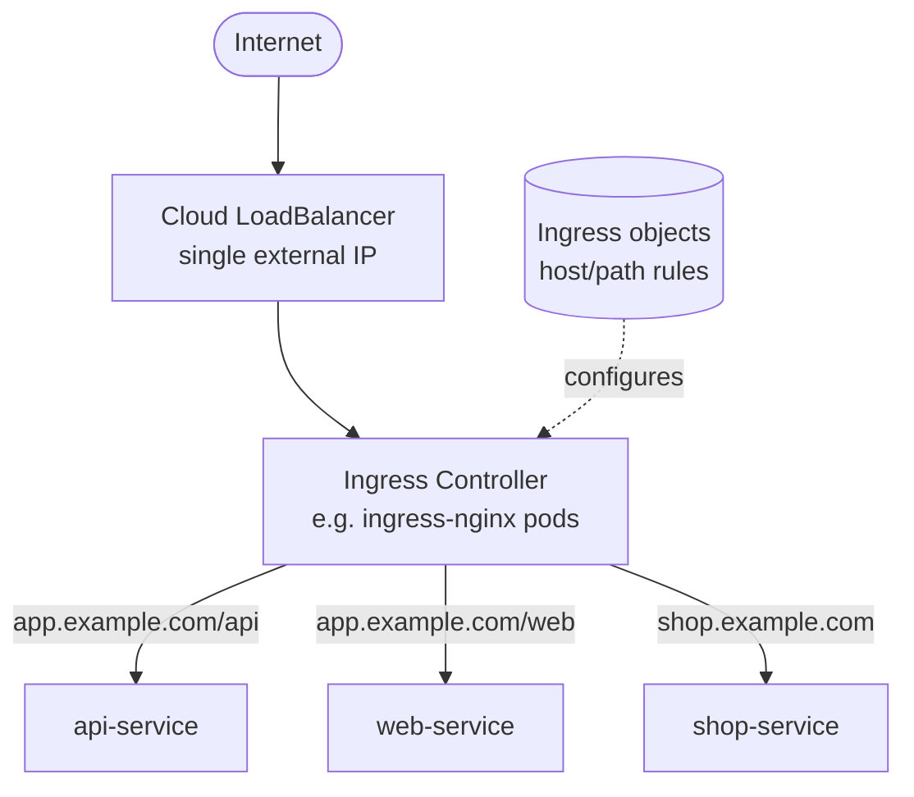
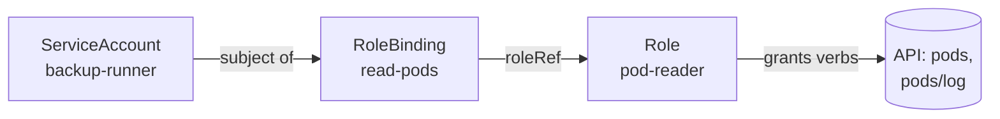

<div class="hero-section" style="background: linear-gradient(135deg, #326ce5 0%, #54a3ff 100%); color: white; padding: 3rem 2rem; margin: -2rem -3rem 2rem -3rem; text-align: center;">
  <h1 style="color: white; margin: 0; font-size: 2.5rem;">Kubernetes: Networking & Configuration</h1>
  <p style="font-size: 1.25rem; margin-top: 1rem; opacity: 0.9;">Connect, expose, secure, and configure your workloads: Services and kube-proxy, Ingress, NetworkPolicies, ConfigMaps and Secrets, and RBAC.</p>
</div>

[Kubernetes Fundamentals](./) &raquo; Networking & Configuration

Once you can [deploy Pods and Deployments](fundamentals.html), the next questions are practical: How do clients find your pods when their IPs keep changing? How does HTTP traffic from the internet reach the right service? How do you stop every pod from talking to every other pod? And how do you inject configuration and credentials without baking them into images? This page covers the networking and configuration layer that turns a pile of pods into a functioning, secured application.

## Networking: Connecting Your Applications

Kubernetes networking follows a simple principle: every pod gets its own IP address, and all pods can communicate with each other without NAT. This flat network model makes it easy to reason about connectivity.

**Consider the following networking layers**:

| Layer | Purpose | Kubernetes Object |
|-------|---------|-------------------|
| Pod-to-Pod | Direct communication | Flat network (automatic) |
| Pod-to-Service | Stable endpoint for pods | Service |
| External-to-Service | Traffic from outside cluster | Ingress, LoadBalancer |
| Service-to-External | Outbound connections | NetworkPolicy (egress) |

The diagram below shows how external traffic reaches a pod: an Ingress routes by host/path to a Service, which load-balances across the matching pods (selected by label) managed by a Deployment.



### The Kubernetes Networking Model

Three rules define the model that every conformant cluster implements:

1. Every pod gets a unique, cluster-routable IP address.
2. Pods on any node can reach pods on any other node directly, without NAT.
3. Agents on a node (such as the kubelet) can reach all pods on that node.

These rules are not provided by Kubernetes itself but by a **CNI (Container Network Interface) plugin** — Calico, Cilium, Flannel, Weave Net, or a cloud-native plugin such as the AWS VPC CNI. The plugin is responsible for handing each pod an IP and ensuring cross-node routing works. Kubernetes only defines the contract; the CNI fulfills it.

Because pod IPs are flat and routable, a pod can in principle reach any other pod by IP. The problem is that pod IPs are **ephemeral** — every restart, rescheduling, or scale event produces new IPs. Hardcoding a pod IP is futile. The Service object exists to solve exactly this.

## Services: Stable Endpoints for Ephemeral Pods

A **Service** provides a single, stable virtual IP (the *ClusterIP*) and DNS name in front of a dynamic set of pods. Clients talk to the Service; the Service load-balances across whichever healthy pods currently match its label selector.

```yaml
apiVersion: v1
kind: Service
metadata:
  name: nginx-service
spec:
  selector:
    app: nginx          # Selects pods carrying this label
  ports:
  - port: 80            # Port the Service listens on
    targetPort: 80      # Port on the pod to forward to
  type: ClusterIP
```

The `selector` is the linchpin: the Service continuously watches for pods labeled `app: nginx` and maintains the set of their IPs. When a pod dies and a Deployment replaces it, the new pod's IP automatically joins the set and the dead one drops out — all without the client noticing.

### Services and Endpoints

Behind every selector-based Service, Kubernetes maintains an **EndpointSlice** (the modern, scalable successor to the older Endpoints object). It is simply the list of pod IP:port pairs the Service should route to.

```bash
# See which pods a Service currently routes to
kubectl get endpointslices -l kubernetes.io/service-name=nginx-service
kubectl describe service nginx-service     # Endpoints listed near the bottom
```

This is the single most useful troubleshooting fact about Services: **if the endpoint list is empty, the Service silently drops all traffic.** An empty list almost always means the selector and the pods' labels disagree, or no pod is passing its readiness probe. A failing readiness probe removes a pod from the endpoint list without restarting it, which is precisely how rolling updates avoid sending traffic to pods that are not yet ready.

### Service DNS and Discovery

The cluster DNS service (CoreDNS) gives every Service a predictable name. Within the same namespace, a pod reaches `nginx-service` simply at `nginx-service`. The fully qualified form is:

```
<service-name>.<namespace>.svc.cluster.local
```

So `api-service` in the `production` namespace resolves at `api-service.production.svc.cluster.local`. This name-based discovery is what makes microservices portable — code references a name, not an IP, and the same manifest works in every environment.

### Service Types

**Choosing a Service Type**: The right service type depends on how your application needs to be accessed:

| Service Type | Accessible From | Use Case | Cost |
|--------------|-----------------|----------|------|
| **ClusterIP** | Inside cluster only | Internal microservices | Free |
| **NodePort** | Node IP + port (30000-32767) | Development, testing | Free |
| **LoadBalancer** | External IP via cloud LB | Production web apps | Cloud provider charges |
| **ExternalName** | DNS alias | Accessing external services | Free |

**When to use each**: Start with ClusterIP for internal services. Use LoadBalancer for production internet-facing services. NodePort is useful for development but rarely appropriate for production due to port limitations.

The types build on one another. A `NodePort` is a `ClusterIP` plus a port opened on every node; a `LoadBalancer` is a `NodePort` plus a cloud load balancer provisioned in front of it. `ExternalName` is the odd one out — it creates no proxying at all, just a CNAME-style DNS alias to an external hostname, useful for pointing in-cluster code at a managed database without changing the code.

> **Note:** `type: LoadBalancer` provisions an external IP only on a cloud provider. On a local cluster (minikube, kind, k3s) the service stays `<pending>` — run `minikube tunnel`, or use `type: NodePort` instead.

### Headless Services

Setting `clusterIP: None` creates a **headless Service**: no virtual IP and no load-balancing proxy. Instead, DNS returns the individual pod IPs directly. This is what StatefulSets use so each pod gets a stable, individually addressable DNS name like `postgres-0.postgres.default.svc.cluster.local` — essential for clustered databases where clients must reach a specific member.

```yaml
apiVersion: v1
kind: Service
metadata:
  name: postgres
spec:
  clusterIP: None        # Headless: DNS returns each pod IP
  selector:
    app: postgres
  ports:
  - port: 5432
```

## How kube-proxy Implements Services

A ClusterIP is a *virtual* IP — no network interface anywhere actually owns it. So how does traffic to that IP reach a real pod? The answer is **kube-proxy**, a component that runs on every node (usually as a DaemonSet). It watches the API server for Services and EndpointSlices and programs the node's kernel networking so that packets destined for a ClusterIP are transparently rewritten to a real pod IP.



kube-proxy has several backend modes:

| Mode | Mechanism | Characteristics |
|------|-----------|-----------------|
| **iptables** (default) | Adds DNAT rules; picks a backend pseudo-randomly | Simple, ubiquitous; rule evaluation is O(n) so it slows with thousands of Services |
| **IPVS** | Uses the kernel's in-built load balancer (hash tables) | O(1) lookup, more LB algorithms (round-robin, least-conn); better at large scale |
| **nftables** | Newer kernel framework replacing iptables | Better performance than iptables mode; default-eligible on recent clusters |

**The crucial mental model**: kube-proxy does *not* sit in the data path as a proxy process for every packet. It only *programs* kernel rules; the kernel does the actual packet rewriting. This is why Services add almost no latency. Many modern CNIs (notably Cilium) can replace kube-proxy entirely with eBPF, programming the same load-balancing logic more efficiently.

A subtle but important setting is `externalTrafficPolicy` on NodePort/LoadBalancer Services. The default, `Cluster`, lets any node accept external traffic and forward it to a pod on any node — even handling, but at the cost of masking the client's source IP (SNAT) and an extra hop. Setting it to `Local` routes only to pods on the receiving node, preserving the real client IP and removing the hop, but requires the load balancer's health checks to avoid nodes with no local pod.

## Ingress: Your Cluster's Front Door

While Services handle internal routing, Ingress manages external HTTP/HTTPS traffic. Instead of creating multiple LoadBalancer services (each with its own IP and cost), Ingress provides a single entry point that routes to different services based on hostnames and paths.

```yaml
apiVersion: networking.k8s.io/v1
kind: Ingress
metadata:
  name: app-ingress
spec:
  rules:
  - host: app.example.com
    http:
      paths:
      - path: /api
        pathType: Prefix
        backend:
          service:
            name: api-service
            port:
              number: 80
```

**When to use Ingress vs LoadBalancer**:
- Use **Ingress** when you have multiple services that need HTTP/HTTPS routing
- Use **LoadBalancer** for non-HTTP traffic or single services
- Ingress typically requires an Ingress Controller (nginx, traefik, or cloud-provided)

### The Ingress Resource vs the Ingress Controller

A common point of confusion: the Ingress *object* is just a set of routing rules stored in the API server. By itself it does nothing. You also need an **Ingress Controller** — a real running workload (typically NGINX, Traefik, HAProxy, or a cloud provider's controller) that watches Ingress objects and configures itself to actually serve traffic according to those rules.



The economic win is clear: one cloud load balancer and one external IP fan out to dozens of backend Services, instead of one expensive LoadBalancer per service.

### Host- and Path-Based Routing

A single Ingress can multiplex many backends by hostname (virtual hosting) and URL path:

```yaml
apiVersion: networking.k8s.io/v1
kind: Ingress
metadata:
  name: multi-host-ingress
  annotations:
    nginx.ingress.kubernetes.io/rewrite-target: /
spec:
  ingressClassName: nginx
  rules:
  - host: app.example.com
    http:
      paths:
      - path: /api
        pathType: Prefix
        backend:
          service:
            name: api-service
            port:
              number: 80
      - path: /
        pathType: Prefix
        backend:
          service:
            name: web-service
            port:
              number: 80
  - host: shop.example.com
    http:
      paths:
      - path: /
        pathType: Prefix
        backend:
          service:
            name: shop-service
            port:
              number: 80
```

`pathType` matters: `Prefix` matches by URL path segments (`/api` matches `/api/v1`), while `Exact` matches the path literally. `ImplementationSpecific` defers to the controller. The `ingressClassName` selects which controller handles this Ingress when several are installed.

### TLS Termination

Ingress is the natural place to terminate HTTPS. Reference a Secret holding the certificate and key, and the controller serves TLS for the listed hosts:

```yaml
spec:
  tls:
  - hosts:
    - app.example.com
    secretName: app-tls-cert     # kubernetes.io/tls Secret
```

In production the certificate Secret is usually managed automatically by **cert-manager**, which obtains and renews certificates from Let's Encrypt and writes them into the Secret the Ingress references.

### The Gateway API

The Ingress resource has well-known limitations — its expressiveness is thin and vendors paper over gaps with non-portable annotations. The **Gateway API** (`gateway.networking.k8s.io`) is the successor: a richer, role-oriented, and portable model splitting responsibilities across `GatewayClass`, `Gateway`, and route resources (`HTTPRoute`, `TCPRoute`, `GRPCRoute`). New clusters increasingly adopt it for advanced traffic management; Ingress remains common and fully supported for straightforward HTTP routing.

## Network Policies: Microsegmentation for Security

By default, all pods can communicate freely. Network Policies let you restrict this, implementing defense-in-depth by controlling which pods can talk to each other.

```yaml
apiVersion: networking.k8s.io/v1
kind: NetworkPolicy
metadata:
  name: api-allow-frontend-only
spec:
  podSelector:
    matchLabels:
      app: api
  ingress:
  - from:
    - podSelector:
        matchLabels:
          app: frontend
    ports:
    - port: 8080
```

This policy says: "Only allow traffic to the API pods from frontend pods on port 8080."

**Important**: Network Policies require a CNI plugin that supports them (Calico, Cilium, Weave Net). The default kubenet does not enforce policies. Without a policy-aware CNI, NetworkPolicy objects are accepted but silently ignored — giving a false sense of isolation.

### Default-Deny and Additive Policies

NetworkPolicies are **additive and allow-only** — there is no explicit "deny" rule. The model works by switching pods from "allow all" to "deny all except what is permitted":

- A pod with **no** NetworkPolicy selecting it accepts all traffic (the default).
- The moment **any** policy selects a pod for a direction (ingress or egress), that pod becomes default-deny for that direction, and only traffic matching some policy is allowed.

The canonical hardening pattern is to apply a namespace-wide default-deny, then layer narrow allow policies on top:

```yaml
apiVersion: networking.k8s.io/v1
kind: NetworkPolicy
metadata:
  name: default-deny-all
  namespace: production
spec:
  podSelector: {}              # Selects every pod in the namespace
  policyTypes:
  - Ingress
  - Egress
```

An empty `podSelector: {}` matches all pods, and listing a `policyType` with no matching rules denies all traffic for that direction. With this in place, every allowed flow must be explicitly granted.

### Selecting Sources: pods, namespaces, and IP blocks

Allow rules can match traffic by pod label, namespace label, or CIDR block. Note the important distinction between two YAML forms:

```yaml
ingress:
- from:
  # Form 1: pods in namespaces labeled tier=frontend
  - namespaceSelector:
      matchLabels:
        tier: frontend
  # Form 2 (single list item with both): pods labeled app=web
  #         that ALSO live in namespaces labeled tier=frontend
  - namespaceSelector:
      matchLabels:
        tier: frontend
    podSelector:
      matchLabels:
        app: web
```

Two selectors as **separate list items** are OR'd together; two selectors **inside one list item** are AND'd. This is a frequent source of policies that are accidentally too permissive.

A common egress policy is to allow DNS (so name resolution still works) plus the specific external CIDR your app needs:

```yaml
egress:
- to:
  - namespaceSelector: {}
  ports:
  - protocol: UDP
    port: 53                   # Allow DNS to CoreDNS
- to:
  - ipBlock:
      cidr: 203.0.113.0/24     # Allow a specific external range
```

Forgetting to allow DNS is the single most common NetworkPolicy mistake — pods can suddenly no longer resolve any Service name and fail in confusing ways.

## ConfigMaps and Secrets: Managing Application Configuration

As your applications grow, you'll need to manage configuration separately from your container images. This separation allows you to deploy the same image across different environments (development, staging, production) with different configurations. ConfigMaps handle non-sensitive data, while Secrets manage sensitive information like passwords and API keys.

This separation is a direct application of the [Twelve-Factor App](../../technology/) principle "store config in the environment": the image is an immutable artifact, and configuration is injected at runtime.

### ConfigMaps

**ConfigMap Example:**
```yaml
apiVersion: v1
kind: ConfigMap
metadata:
  name: app-config
data:
  database_url: "postgres://localhost:5432/mydb"
  api_key: "public-api-key"
  # A whole config file as a value:
  app.properties: |
    log.level=info
    cache.size=256
```

There are two ways to surface a ConfigMap into a pod, each suited to different needs:

```yaml
spec:
  containers:
  - name: app
    image: myapp:1.4
    # 1. As environment variables
    envFrom:
    - configMapRef:
        name: app-config
    # 2. As files in a mounted volume
    volumeMounts:
    - name: config-vol
      mountPath: /etc/app
  volumes:
  - name: config-vol
    configMap:
      name: app-config
```

Use **environment variables** for simple scalar settings, and **volume mounts** for whole config files. A key practical difference: values injected as environment variables are fixed for the life of the pod, whereas values mounted as a volume are updated in place (after a short delay) when the ConfigMap changes — though your application must re-read the file to notice. To force a rollout when config changes, teams often add a checksum of the ConfigMap as a pod annotation so the Deployment's pod template changes and triggers a rolling update.

### Secrets

**Secret Example:**
```yaml
apiVersion: v1
kind: Secret
metadata:
  name: db-secret
type: Opaque
data:
  username: YWRtaW4=          # base64 encoded "admin"
  password: cGFzc3dvcmQ=      # base64 encoded "password"
```

A Secret is consumed exactly like a ConfigMap — as environment variables or mounted files:

```yaml
    env:
    - name: DB_PASSWORD
      valueFrom:
        secretKeyRef:
          name: db-secret
          key: password
```

**Critical caveat: base64 is encoding, not encryption.** Anyone who can read the Secret object can trivially decode it. Secrets provide value through *access control*, not obfuscation. To use them safely:

- **Restrict access with RBAC** (covered below) so only the workloads and people who need a Secret can `get` it.
- **Enable encryption at rest** so etcd stores Secrets encrypted rather than as plain base64. Without it, anyone with access to an etcd backup has every credential.
- **Never commit Secret manifests to Git** in plaintext. Use a sealed/encrypted approach — Sealed Secrets, SOPS, or an external store like HashiCorp Vault or a cloud secrets manager via the External Secrets Operator or the Secrets Store CSI Driver.

Kubernetes also defines typed Secrets that other components understand, such as `kubernetes.io/tls` for the certificate/key pair an Ingress references, and `kubernetes.io/dockerconfigjson` for pulling images from a private registry (referenced via `imagePullSecrets`).

## RBAC and ServiceAccounts

So far everything has been about traffic and config between *workloads*. RBAC is about authorization: who — whether a human or a pod — is allowed to perform which actions against the Kubernetes API itself.

### ServiceAccounts: Identities for Pods

Every pod runs as a **ServiceAccount**, which is its identity to the API server. If you do not specify one, the pod uses the namespace's `default` ServiceAccount. Kubernetes mounts a short-lived, automatically-rotated token for that ServiceAccount into the pod, which client libraries use to authenticate to the API.

```yaml
apiVersion: v1
kind: ServiceAccount
metadata:
  name: backup-runner
  namespace: production
---
apiVersion: apps/v1
kind: Deployment
metadata:
  name: backup-job
spec:
  template:
    spec:
      serviceAccountName: backup-runner       # Pod's API identity
      automountServiceAccountToken: true       # Set false if the pod never calls the API
```

A security best practice is to give each application its own dedicated ServiceAccount rather than letting it inherit `default`, and to set `automountServiceAccountToken: false` for any pod that does not actually need to talk to the Kubernetes API — which is most application pods. A leaked token for an over-privileged ServiceAccount is a direct path to cluster compromise.

### Roles, ClusterRoles, and Bindings

RBAC is built from four object types that compose cleanly:

| Object | Scope | Defines |
|--------|-------|---------|
| **Role** | One namespace | A set of allowed verbs on resources |
| **ClusterRole** | Cluster-wide | Same, but cluster-scoped (nodes, namespaces) or reusable across namespaces |
| **RoleBinding** | One namespace | Grants a Role (or ClusterRole) to a subject in that namespace |
| **ClusterRoleBinding** | Cluster-wide | Grants a ClusterRole to a subject across the whole cluster |

A **Role** is a pure list of permissions — it grants no access until a binding attaches it to a subject (a user, group, or ServiceAccount). RBAC is **purely additive**: there are no deny rules, so a subject's effective permissions are the union of every Role and ClusterRole bound to it.

```yaml
# A Role permitting read-only access to pods in the production namespace
apiVersion: rbac.authorization.k8s.io/v1
kind: Role
metadata:
  namespace: production
  name: pod-reader
rules:
- apiGroups: [""]                 # "" is the core API group
  resources: ["pods", "pods/log"]
  verbs: ["get", "list", "watch"]
---
# Bind that Role to the backup-runner ServiceAccount
apiVersion: rbac.authorization.k8s.io/v1
kind: RoleBinding
metadata:
  name: read-pods
  namespace: production
subjects:
- kind: ServiceAccount
  name: backup-runner
  namespace: production
roleRef:
  kind: Role
  name: pod-reader
  apiGroup: rbac.authorization.k8s.io
```

The relationship between these pieces is worth picturing:



A useful pattern is binding a **ClusterRole with a RoleBinding**: the ClusterRole defines a reusable permission set once (say, "read-only across common resources"), and a RoleBinding in each namespace grants it there — keeping the permission *scoped* to that namespace while avoiding duplicated Role definitions.

### Designing for Least Privilege

The guiding principle is **least privilege**: grant the narrowest set of verbs on the fewest resources needed, scoped to a single namespace wherever possible. Practical guidance:

- Avoid the built-in `cluster-admin` ClusterRole for anything but actual administrators; it is a full bypass of RBAC.
- Never use wildcards (`resources: ["*"]`, `verbs: ["*"]`) in application roles.
- Prefer namespaced `Role` + `RoleBinding` over cluster-scoped grants.
- Verify a binding does what you expect before trusting it.

```bash
# Test exactly what a ServiceAccount is (and is not) allowed to do
kubectl auth can-i list pods \
  --as=system:serviceaccount:production:backup-runner -n production   # -> yes

kubectl auth can-i delete deployments \
  --as=system:serviceaccount:production:backup-runner -n production   # -> no
```

`kubectl auth can-i` is the fastest way to confirm an RBAC setup grants the access you intended and nothing more.

<div class="notice--warning">
  <h4>Common Pitfalls</h4>
  <ul>
    <li><strong>Mismatched labels:</strong> A Service routes to pods by label selector. If the selector and pod labels disagree, the Service has zero endpoints and silently drops traffic.</li>
    <li><strong>Empty endpoints from failed readiness:</strong> A pod failing its readiness probe is pulled from the Service's endpoint list — check probe status before blaming the network.</li>
    <li><strong>Assuming NetworkPolicies are enforced:</strong> Without a policy-aware CNI, NetworkPolicy objects are accepted but ignored — giving a false sense of isolation.</li>
    <li><strong>Forgetting DNS in egress policies:</strong> A default-deny egress policy that omits UDP/53 to CoreDNS breaks all Service name resolution.</li>
    <li><strong>One LoadBalancer per service:</strong> Each cloud LoadBalancer costs money and consumes an IP. Use a single Ingress to fan out to many services instead.</li>
    <li><strong>Ingress object without a controller:</strong> An Ingress with no matching Ingress Controller installed is inert and routes nothing.</li>
    <li><strong>Treating Secrets as encrypted:</strong> base64 is encoding, not encryption. Lock Secrets down with RBAC and enable encryption at rest.</li>
    <li><strong>Over-privileged ServiceAccounts:</strong> Leaving pods on the <code>default</code> account or granting <code>cluster-admin</code> turns a single pod compromise into a cluster compromise.</li>
  </ul>
</div>

## Key Takeaways

<div class="takeaway-grid">
  <div class="takeaway-card">
    <h4>Services Decouple from Pod IPs</h4>
    <p>A Service's stable ClusterIP and DNS name front a label-selected set of pods. Clients reference the name; the endpoint list updates as pods come and go.</p>
  </div>
  <div class="takeaway-card">
    <h4>kube-proxy Programs the Kernel</h4>
    <p>kube-proxy is not in the data path — it writes iptables/IPVS/nftables rules so the kernel rewrites ClusterIP traffic to a real pod with near-zero overhead.</p>
  </div>
  <div class="takeaway-card">
    <h4>Ingress Needs a Controller</h4>
    <p>The Ingress object is just rules; a running Ingress Controller turns them into real HTTP routing, fanning one external IP out to many Services.</p>
  </div>
  <div class="takeaway-card">
    <h4>NetworkPolicies Are Allow-Only</h4>
    <p>They require a policy-aware CNI, flip selected pods to default-deny, and grant only explicit flows — remember to allow DNS.</p>
  </div>
  <div class="takeaway-card">
    <h4>Secrets Need RBAC, Not Faith</h4>
    <p>base64 is not encryption. Restrict Secrets with RBAC, encrypt etcd at rest, and keep them out of plaintext Git.</p>
  </div>
  <div class="takeaway-card">
    <h4>Least-Privilege RBAC</h4>
    <p>Give each app a dedicated ServiceAccount and the narrowest namespaced Role; verify with <code>kubectl auth can-i</code>.</p>
  </div>
</div>

---

## See Also

- [Fundamentals](fundamentals.html) - Pods, Deployments, cluster architecture, and the reconciliation loop
- [Workloads &amp; Storage](workloads.html) - StatefulSets, persistent volumes, autoscaling, and Pod Security
- [Operations](operations.html) - kubectl, Helm, and a systematic troubleshooting guide
- [Advanced Topics](advanced.html) - CRDs, Operators, service mesh, and GitOps
- [Docker](../docker/) - The container fundamentals Kubernetes builds on
- [AWS EKS](../aws/compute.html) - Managed Kubernetes on AWS
