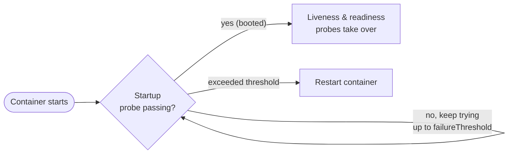
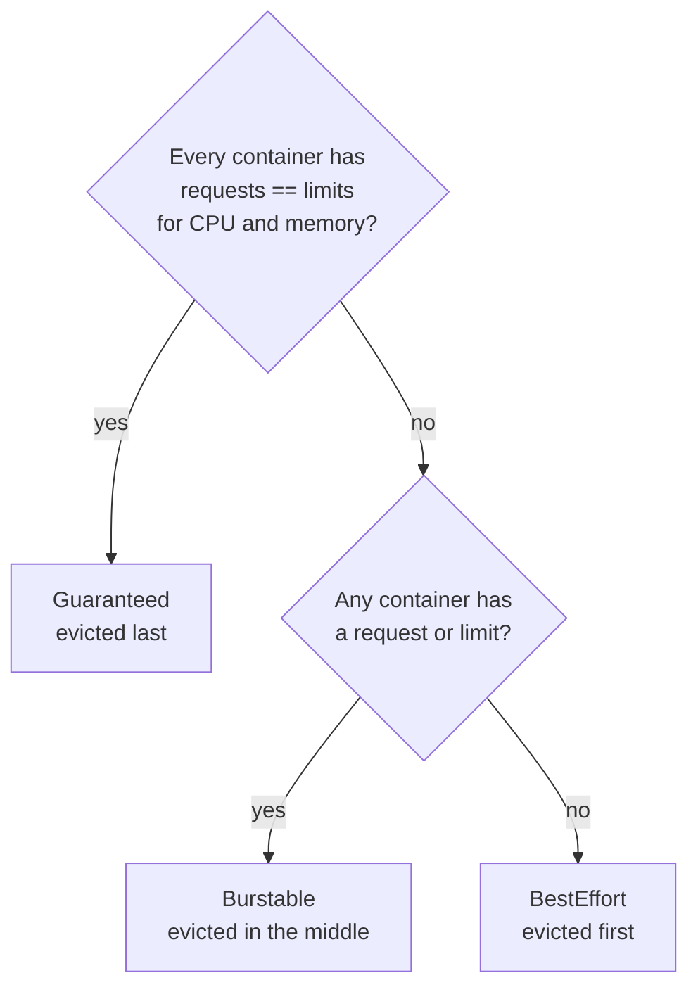
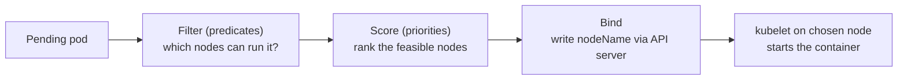
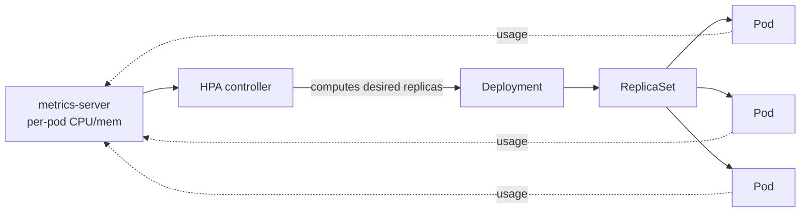

<div class="hero-section" style="background: linear-gradient(135deg, #326ce5 0%, #54a3ff 100%); color: white; padding: 3rem 2rem; margin: -2rem -3rem 2rem -3rem; text-align: center;">
  <h1 style="color: white; margin: 0; font-size: 2.5rem;">Kubernetes: Health & Resource Management</h1>
  <p style="font-size: 1.25rem; margin-top: 1rem; opacity: 0.9;">Teach Kubernetes what "healthy" means and how much your workloads cost: probes, requests and limits, QoS classes, scheduling, and horizontal autoscaling.</p>
</div>

[Kubernetes](./) &raquo; [Fundamentals](fundamentals.html) &raquo; Health & Resource Management

## Why Health and Resources Go Together

A Deployment will restart a *crashed* container automatically, but many failures are subtler: a process that is still running yet stuck in a deadlock, or one that has started but is not yet ready to serve traffic. At the same time, the scheduler can only place pods sensibly if you tell it how much CPU and memory each one needs. Health probes and resource declarations are two halves of the same contract — together they tell Kubernetes what "healthy" means for your application and what it costs to run.

This page covers that contract end to end: the three probe types, CPU/memory requests and limits, the Quality of Service classes those values imply, how the scheduler uses requests to place pods, and how the Horizontal Pod Autoscaler uses live metrics to change the replica count.

## Keeping Pods Healthy: Probes

A pod that is `Running` is not necessarily *working*. The kubelet runs **probes** — periodic checks against each container — to decide whether to restart it, route traffic to it, or wait for it to boot. The three probe types answer three different questions, and confusing them is one of the most common production mistakes.

| Probe | Question it answers | Action on failure |
|-------|---------------------|-------------------|
| **Liveness** | "Is the container alive, or wedged?" | Restart the container |
| **Readiness** | "Can it serve traffic right now?" | Remove the pod from Service endpoints (no restart) |
| **Startup** | "Has a slow-starting app finished booting?" | Hold off liveness/readiness checks until it passes |

```yaml
spec:
  containers:
  - name: web
    image: myapp:1.4
    startupProbe:            # Give a slow boot up to 30 x 10s = 300s
      httpGet:
        path: /healthz/live
        port: 8080
      failureThreshold: 30
      periodSeconds: 10
    readinessProbe:          # Gate traffic until the app is ready
      httpGet:
        path: /healthz/ready
        port: 8080
      initialDelaySeconds: 5
      periodSeconds: 10
    livenessProbe:           # Restart if the app wedges
      httpGet:
        path: /healthz/live
        port: 8080
      periodSeconds: 15
      failureThreshold: 3
```

**Why the distinction matters**: a failing *readiness* probe quietly pulls the pod out of rotation so users are never routed to it, then re-adds it once healthy — ideal for warm-ups or temporary overload. A failing *liveness* probe kills and restarts the container. Pointing a liveness probe at a dependency you do not control (such as a database) is a classic anti-pattern: a brief database hiccup triggers a restart storm that makes the outage worse.

### How a Probe Is Evaluated

Each probe runs on the kubelet of the node hosting the pod, on a fixed interval, and tracks consecutive results against thresholds. The tuning knobs are the same for all three types:

| Field | Meaning | Default |
|-------|---------|---------|
| `initialDelaySeconds` | Wait this long after the container starts before the first probe | 0 |
| `periodSeconds` | How often to probe | 10 |
| `timeoutSeconds` | How long to wait for a single probe to respond | 1 |
| `successThreshold` | Consecutive successes needed to be considered passing | 1 |
| `failureThreshold` | Consecutive failures before the probe is considered failed | 3 |

The effective time before a liveness probe restarts a container is roughly `initialDelaySeconds + failureThreshold x periodSeconds`. In the example above that is `0 + 3 x 15 = 45` seconds of being wedged before a restart.

### The Three Probe Mechanisms

A probe can use any of three handlers, regardless of type:

- **`httpGet`** — the kubelet performs an HTTP GET; any `2xx`/`3xx` status code is a success. Best for web services; expose a cheap, dependency-free endpoint.
- **`tcpSocket`** — success if the TCP connection opens. Useful for non-HTTP servers (databases, brokers) where "the port accepts connections" is a reasonable proxy for health.
- **`exec`** — runs a command inside the container; exit code `0` is success. Most flexible (you can check a lockfile, a queue depth, etc.) but the most expensive, since it forks a process on every probe.

```yaml
# tcpSocket liveness for a message broker
livenessProbe:
  tcpSocket:
    port: 5672
  periodSeconds: 20

# exec readiness that checks a lockfile the app writes when ready
readinessProbe:
  exec:
    command: ["cat", "/tmp/ready"]
  periodSeconds: 5
```

### Startup Probes: Protecting Slow Boots

Before startup probes existed, the only way to accommodate an application that took two minutes to initialize was a large `initialDelaySeconds` on the liveness probe — which also delayed detection of a *genuine* hang for the entire life of the container. The **startup probe** decouples the two concerns:



While the startup probe runs, the liveness and readiness probes are suspended. Once it passes once, the kubelet hands off to the other two and never runs the startup probe again. Give it a generous budget — `failureThreshold x periodSeconds` should comfortably exceed the worst-case boot time — and keep the steady-state liveness probe tight so real hangs are caught quickly.

### Probe Design Guidelines

- **Liveness should be cheap and self-contained.** Check only that the process itself is responsive. Never check a database, cache, or downstream API in a liveness probe.
- **Readiness may check dependencies.** It is acceptable for a readiness probe to fail when a critical dependency is unavailable, because that only removes the pod from rotation — it does not restart it.
- **Separate the endpoints.** Use distinct paths (`/healthz/live` vs `/healthz/ready`) so the two concerns can diverge.
- **Avoid making probes too aggressive.** A 1-second timeout on an endpoint that occasionally takes 1.2 seconds under load will produce spurious restarts. Leave headroom.

## Resources: Requests and Limits

Every container can declare how much CPU and memory it *requests* (the amount guaranteed and used by the scheduler for placement) and its *limit* (the hard ceiling). These two numbers drive scheduling, throttling, eviction, and the pod's Quality of Service class.

```yaml
    resources:
      requests:
        cpu: "250m"        # 0.25 of a core, used for scheduling
        memory: "256Mi"
      limits:
        cpu: "500m"        # throttled above this
        memory: "512Mi"    # killed (OOMKilled) above this
```

| Type | Purpose | What happens if exceeded |
|------|---------|--------------------------|
| **Request** | Scheduling: "I need at least this much" | N/A — it is a guaranteed minimum |
| **Limit** | Protection: "Never use more than this" | CPU: throttled; Memory: OOMKilled |

### How CPU and Memory Differ

The single most important fact about resources is that the two are governed differently because of their physical nature:

- **CPU is *compressible*.** A container that tries to exceed its CPU limit is *throttled* — the Linux Completely Fair Scheduler (CFS) caps the slices it receives, so it simply runs slower. Nothing is killed. CPU is expressed in cores; `1000m` ("millicores") equals one full core, `250m` is a quarter core.
- **Memory is *incompressible*.** You cannot give a process "a slower megabyte". A container that exceeds its memory limit is terminated by the kernel's OOM killer and shows up as `OOMKilled`. If it is managed by a controller, it is then restarted, often into a `CrashLoopBackOff` if the memory pressure is persistent.

**Practical guidance**: always set memory requests *and* limits, and set them equal unless you have a specific reason not to — because memory is incompressible, "bursting" above the request just defers an OOM kill to a less predictable moment. For CPU, setting a request (for scheduling) without a limit is a defensible choice that lets latency-sensitive workloads use idle cores; setting a limit caps the blast radius of a runaway loop. Setting at least requests on every production workload prevents one greedy pod from starving its neighbors.

### Units Reference

| Resource | Unit | Examples |
|----------|------|----------|
| CPU | cores / millicores | `1`, `500m` (0.5 core), `100m` (0.1 core) |
| Memory | bytes (binary or decimal) | `512Mi` (512 mebibytes), `1Gi`, `500M` (decimal megabytes) |

Note the distinction between `Mi`/`Gi` (powers of 1024) and `M`/`G` (powers of 1000). Mixing them up is a common source of "why did my pod get 4.7% less memory than I asked for" confusion — always prefer the binary `Mi`/`Gi` suffixes.

### LimitRanges and ResourceQuotas

In a shared cluster you rarely want to trust every team to set sane values by hand. Two namespace-scoped objects enforce policy:

- A **`LimitRange`** sets defaults and bounds *per container/pod*. It can inject default requests/limits into pods that omit them and reject pods whose values fall outside a min/max window.
- A **`ResourceQuota`** caps the *aggregate* requests and limits across an entire namespace, so one team cannot consume the whole cluster.

```yaml
apiVersion: v1
kind: LimitRange
metadata:
  name: defaults
  namespace: team-a
spec:
  limits:
  - type: Container
    default:           # applied as the limit if none is set
      cpu: "500m"
      memory: "512Mi"
    defaultRequest:    # applied as the request if none is set
      cpu: "100m"
      memory: "128Mi"
---
apiVersion: v1
kind: ResourceQuota
metadata:
  name: team-a-quota
  namespace: team-a
spec:
  hard:
    requests.cpu: "10"
    requests.memory: 20Gi
    limits.cpu: "20"
    limits.memory: 40Gi
```

A subtle but important interaction: once a `ResourceQuota` constrains `requests.cpu` or `requests.memory` in a namespace, every pod in that namespace **must** specify the corresponding request, or the API server rejects it. A `LimitRange` with defaults is the usual way to keep that requirement from breaking existing manifests.

## Quality of Service (QoS) Classes

Kubernetes derives a **Quality of Service class** for every pod from its requests and limits. You never set the QoS class directly — it is computed — but it determines who gets evicted first when a node runs low on memory.

| QoS class | Condition | Eviction priority |
|-----------|-----------|-------------------|
| **Guaranteed** | requests == limits for *every* container (both CPU and memory set) | Evicted last |
| **Burstable** | at least one request set, but the pod is not Guaranteed | Evicted in the middle |
| **BestEffort** | no requests or limits set on any container | Evicted first |



### How QoS Drives Eviction

When a node comes under memory pressure, the kubelet must reclaim memory before the kernel OOM killer fires indiscriminately. It ranks pods for eviction by QoS class and by how far each pod's memory usage exceeds its request:

1. **BestEffort** pods are evicted first — they made no promises and the scheduler made none to them.
2. **Burstable** pods are evicted next, those most over their requests going first.
3. **Guaranteed** pods are evicted last, and only if reclaiming lower-priority pods was not enough.

The practical takeaway: give your most important workloads `requests == limits` so they land in the Guaranteed class and survive node pressure. Reserve BestEffort for genuinely disposable, interruptible work. (Pod **priority and preemption**, set via a `PriorityClass`, is a separate mechanism that governs *scheduling* order rather than eviction under node pressure; the two can be combined.)

## Scheduler Basics

The **kube-scheduler** is the control-plane component that decides which node each new pod runs on. It watches the API server for pods with no node assignment (`spec.nodeName` empty) and, for each one, runs a two-phase algorithm.



1. **Filtering (predicates).** The scheduler eliminates nodes that *cannot* run the pod. The dominant filter is resource fit: a node is feasible only if its **allocatable** capacity minus the sum of existing pods' **requests** leaves room for this pod's requests. (Note that it is *requests*, not actual usage, and not limits, that the scheduler reserves against — this is why setting honest requests matters so much.) Other filters include node selectors/affinity, taints the pod does not tolerate, and unsatisfiable volume topology.
2. **Scoring (priorities).** Among feasible nodes, the scheduler scores each on factors such as spreading pods of the same workload across nodes, packing to reduce fragmentation, and image locality. The highest-scoring node wins (ties broken randomly).
3. **Binding.** The scheduler writes the chosen `nodeName` back through the API server. The kubelet on that node then pulls the image and starts the container.

### Steering the Scheduler

You can influence placement with several mechanisms, from blunt to expressive:

| Mechanism | What it does | Typical use |
|-----------|--------------|-------------|
| **`nodeSelector`** | Hard requirement: pod runs only on nodes with matching labels | "GPU pods on GPU nodes" |
| **Node affinity** | Like nodeSelector but supports `required` and `preferred` rules and richer operators | Soft preferences, multi-label logic |
| **Pod affinity / anti-affinity** | Place pods near (or away from) other pods by label | Co-locate cache with app; spread replicas across zones |
| **Taints & tolerations** | A node *repels* pods unless they explicitly tolerate the taint | Reserve nodes for system or special workloads |
| **Topology spread constraints** | Evenly distribute pods across zones/nodes within a skew budget | High availability across failure domains |

```yaml
# Require GPU nodes, prefer a specific zone, and tolerate the gpu taint
spec:
  nodeSelector:
    hardware: gpu
  tolerations:
  - key: "dedicated"
    operator: "Equal"
    value: "gpu"
    effect: "NoSchedule"
  affinity:
    nodeAffinity:
      preferredDuringSchedulingIgnoredDuringExecution:
      - weight: 100
        preference:
          matchExpressions:
          - key: topology.kubernetes.io/zone
            operator: In
            values: ["us-east-1a"]
```

Remember the distinction: **taints repel, tolerations permit, affinities attract.** A taint on a node keeps pods *off* unless they tolerate it; an affinity on a pod pulls it *toward* matching nodes. They are frequently combined — taint a pool of expensive GPU nodes so ordinary workloads stay away, and add both a toleration and a `nodeSelector` to the GPU workloads so only they land there.

### What If No Node Fits?

If filtering eliminates every node, the pod stays `Pending` and the scheduler records an event explaining why (for example, `0/5 nodes are available: 5 Insufficient memory`). This is the most common reason a freshly applied pod never starts — and it is almost always a requests-vs-capacity problem, solved by lowering requests, adding nodes, or (with the Cluster Autoscaler installed) letting the cluster grow a node automatically.

## Autoscaling: Scaling Out with the HPA

Static replica counts force a trade-off: provision for peak and waste money at the trough, or provision for the average and fall over under load. The **Horizontal Pod Autoscaler (HPA)** removes the trade-off by changing the replica count of a Deployment (or StatefulSet) automatically in response to live metrics.

> The HPA scales the *number* of pods. To resize an individual pod's CPU/memory requests, see the Vertical Pod Autoscaler, and for adding whole nodes when pods cannot be scheduled, the Cluster Autoscaler — both covered alongside the HPA in [Workloads & Storage](workloads.html). These three operate at different layers and are often used together.



### The Scaling Formula

The HPA controller runs a reconciliation loop (every 15 seconds by default). On each pass it reads the current metric across all ready pods, compares it to the target, and computes the desired replica count with a single ratio:

$$
\text{desiredReplicas} = \left\lceil \text{currentReplicas} \times \frac{\text{currentMetricValue}}{\text{targetMetricValue}} \right\rceil
$$

For example, with 3 replicas averaging 90% CPU and a target of 70%, the controller wants `ceil(3 x 90/70) = ceil(3.86) = 4` replicas. If utilization later falls to 35%, it wants `ceil(4 x 35/70) = 2` replicas. The result is always clamped to the configured `minReplicas`/`maxReplicas` window.

```yaml
apiVersion: autoscaling/v2
kind: HorizontalPodAutoscaler
metadata:
  name: app-hpa
spec:
  scaleTargetRef:
    apiVersion: apps/v1
    kind: Deployment
    name: app-deployment
  minReplicas: 3
  maxReplicas: 10
  metrics:
  - type: Resource
    resource:
      name: cpu
      target:
        type: Utilization
        averageUtilization: 70   # target: keep average CPU near 70% of the request
```

Crucially, `averageUtilization: 70` is a percentage **of the pod's CPU *request***, not of the node or of a raw core. This is the direct link back to the resources section: an HPA cannot scale on CPU utilization unless the pods declare a CPU request to be a percentage of. A pod with no request has undefined utilization, and the HPA will report `<unknown>` and refuse to scale.

### Beyond CPU: Memory, Custom, and External Metrics

The `autoscaling/v2` API supports several metric sources, and an HPA may list more than one — it computes a desired replica count for each and takes the **maximum**, so any single overloaded dimension can scale the workload out:

- **`Resource`** — CPU or memory utilization (or an absolute `averageValue`).
- **`Pods`** — a custom per-pod metric averaged across pods, e.g. requests-per-second exposed via the custom metrics API.
- **`Object`** — a metric describing a single Kubernetes object, e.g. an Ingress's request rate.
- **`External`** — a metric from outside the cluster, e.g. the depth of a cloud queue (SQS, Pub/Sub).

### Avoiding Thrash: Stabilization and Behavior

Naively applying the formula every 15 seconds would cause **flapping** — rapidly scaling up and down as the metric oscillates around the target. The HPA dampens this with a stabilization window (by default it considers the highest recommendation over the last 5 minutes when scaling *down*, so it scales out eagerly but in conservatively) and with a configurable `behavior` block:

```yaml
  behavior:
    scaleDown:
      stabilizationWindowSeconds: 300   # wait 5 min of sustained low load before removing pods
      policies:
      - type: Percent
        value: 50                       # remove at most 50% of pods per 60s
        periodSeconds: 60
    scaleUp:
      policies:
      - type: Pods
        value: 4                        # add at most 4 pods per 60s
        periodSeconds: 60
```

**Operational notes**:

- The HPA depends on the **metrics-server** add-on for CPU/memory metrics; without it, the HPA shows `<unknown>` targets and never acts. Verify with `kubectl top pods`.
- Set `minReplicas` to survive the loss of a node or an availability zone — do not let an HPA scale a critical service down to one replica.
- Do not run an HPA and a VPA against the *same* resource metric (e.g. both on CPU); they will fight, with one resizing pods while the other counts them. Pair an HPA on CPU with a VPA on memory, or keep them apart entirely.

## Key Takeaways

<div class="takeaway-grid">
  <div class="takeaway-card">
    <h4>Three Probes, Three Jobs</h4>
    <p>Liveness restarts a wedged container, readiness gates traffic, startup protects slow boots. Never point liveness at an external dependency.</p>
  </div>
  <div class="takeaway-card">
    <h4>CPU Throttles, Memory Kills</h4>
    <p>CPU is compressible (excess use is throttled); memory is not (excess use is OOMKilled). Always set memory requests and limits.</p>
  </div>
  <div class="takeaway-card">
    <h4>Requests Drive Everything</h4>
    <p>The scheduler reserves against requests, not usage; QoS class derives from requests vs limits; HPA utilization is a percentage of the request.</p>
  </div>
  <div class="takeaway-card">
    <h4>Scale Out on Live Signal</h4>
    <p>The HPA changes replica count from a simple ratio of current to target metric, clamped to min/max and dampened to avoid thrash.</p>
  </div>
</div>

---

## See Also

- [Fundamentals](fundamentals.html) - Cluster architecture, Pods, Deployments, Services, and the reconciliation loop
- [Workloads &amp; Storage](workloads.html) - StatefulSets, persistent volumes, VPA/Cluster Autoscaler, RBAC, and Pod Security
- [Operations](operations.html) - kubectl, Helm, and a systematic troubleshooting guide
- [Advanced Topics](advanced.html) - CRDs, Operators, service mesh, and performance tuning
- [Docker](../docker/) - The container fundamentals Kubernetes builds on
