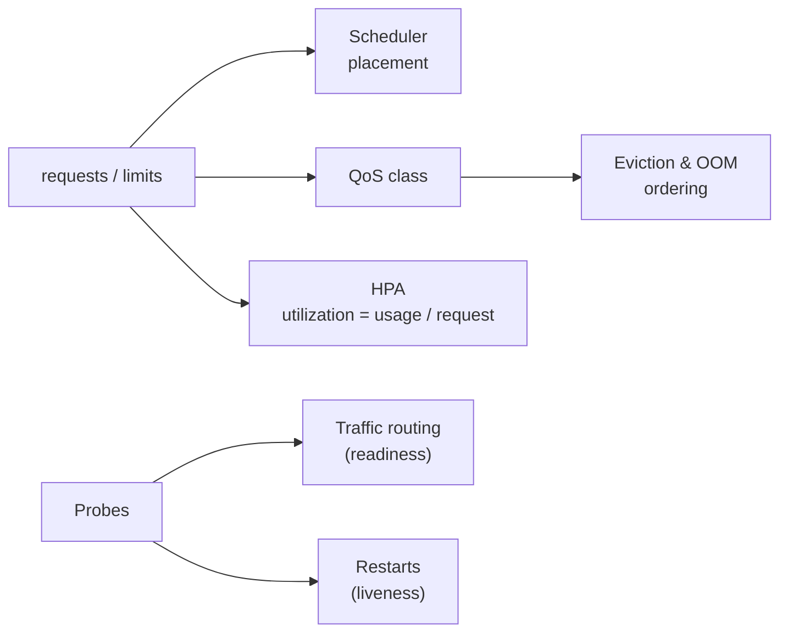
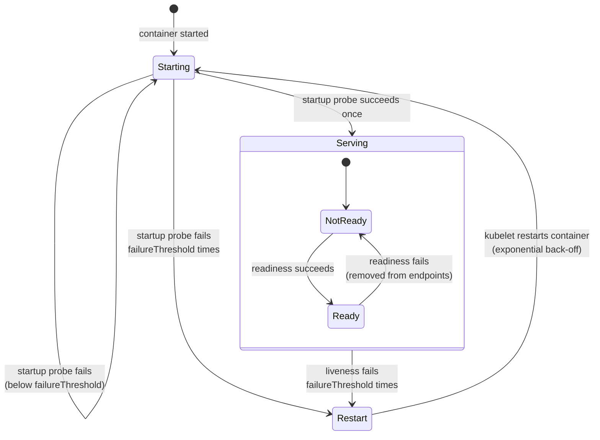
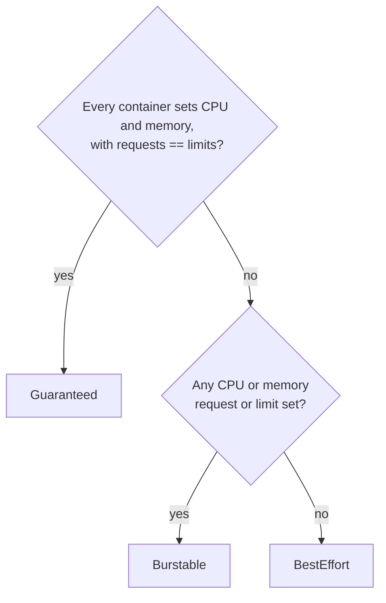
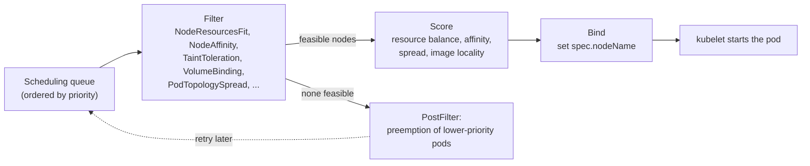
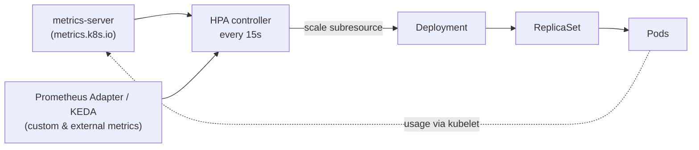

[Kubernetes](./) &raquo; [Fundamentals](fundamentals.html) &raquo; Health & Resource Management

This page covers the contract between a workload and the cluster that runs it. **Probes** tell the kubelet what "healthy" and "ready" mean for a container. **Requests and limits** tell the scheduler what a pod needs and the kernel what it may use; together they determine the pod's **QoS class** and its fate under node pressure. The **scheduler** places pods using those requests, and the **Horizontal Pod Autoscaler** changes replica counts from live metrics. Behaviour described here is current for Kubernetes v1.35–v1.37.



## Probes

A container that is running is not necessarily working. The kubelet on each node runs **probes** against the containers it manages and acts on the results. The three probe types answer different questions, and confusing them is one of the most common causes of self-inflicted outages.

| Probe | Question | On failure |
|-------|----------|------------|
| **Startup** | Has the application finished starting? | Keeps liveness and readiness suspended; after `failureThreshold` failures the container is killed and restarted |
| **Liveness** | Is the process still able to make progress, or is it wedged? | Container is killed and restarted according to the pod's `restartPolicy` |
| **Readiness** | Should this pod receive traffic right now? | Pod is marked not Ready and removed from Service EndpointSlices; **no restart** |

```yaml
spec:
  containers:
  - name: web
    image: registry.example.com/web:1.4.2
    ports:
    - {name: http, containerPort: 8080}
    startupProbe:                 # allow up to 30 x 5s = 150s to boot
      httpGet: {path: /healthz/live, port: http}
      periodSeconds: 5
      failureThreshold: 30
    livenessProbe:                # restart after ~3 x 10s of being wedged
      httpGet: {path: /healthz/live, port: http}
      periodSeconds: 10
      failureThreshold: 3
    readinessProbe:               # gate traffic; may check dependencies
      httpGet: {path: /healthz/ready, port: http}
      periodSeconds: 5
      failureThreshold: 2
```

### Probe Lifecycle



The startup probe runs only until its first success and never again for that container. Readiness is evaluated for the whole life of the container, so a pod can move in and out of rotation many times without restarting. Repeated restarts are delayed by an exponential back-off (starting at 10 s and capped at 5 minutes), which is what the `CrashLoopBackOff` waiting reason reports.

### Handlers

Any probe type can use any handler:

| Handler | Succeeds when | Notes |
|---------|---------------|-------|
| `httpGet` | Response status is 200–399 | The usual choice for HTTP services. Serve it from a cheap, dependency-free handler. |
| `tcpSocket` | A TCP connection can be opened | For non-HTTP servers; proves only that something is listening. |
| `grpc` | The [gRPC health-checking protocol](https://github.com/grpc/grpc/blob/master/doc/health-checking.md) returns `SERVING` | Native since v1.27; no helper binary needed. |
| `exec` | A command inside the container exits 0 | Most flexible but most expensive: a process is forked on every probe. |

```yaml
livenessProbe:
  grpc:
    port: 9090
    service: ""            # empty = overall server health
readinessProbe:
  exec:
    command: ["test", "-f", "/tmp/ready"]
```

### Timing Fields

| Field | Meaning | Default |
|-------|---------|---------|
| `initialDelaySeconds` | Delay before the first probe | 0 |
| `periodSeconds` | Interval between probes | 10 |
| `timeoutSeconds` | Time allowed for one probe to answer | 1 |
| `successThreshold` | Consecutive successes to pass (must be 1 for liveness and startup) | 1 |
| `failureThreshold` | Consecutive failures to fail | 3 |
| `terminationGracePeriodSeconds` | Probe-level override of the pod's grace period when a liveness or startup failure kills the container | pod value |

The worst-case time a wedged container keeps running is about `failureThreshold × periodSeconds` (+ `timeoutSeconds` per attempt); a slow-booting application gets up to `failureThreshold × periodSeconds` from its startup probe. Prefer a startup probe over a large `initialDelaySeconds` on liveness: the latter delays detection of genuine hangs for the container's whole lifetime, not just at boot.

### Design Guidelines

- **Liveness checks only the process itself.** Never probe a database, cache or downstream API from liveness: a brief dependency outage then restarts every replica at once and turns a blip into an outage. Many services need no liveness probe at all — if the process crashes when broken, the kubelet already restarts it.
- **Readiness may consider dependencies and load.** Failing readiness only removes the pod from rotation, which is the right response to "cannot serve right now". Be aware that if *every* replica fails readiness together, the Service has no endpoints.
- **Use separate endpoints** (`/healthz/live`, `/healthz/ready`) so the two can diverge.
- **Leave headroom.** A 1-second timeout on an endpoint that sometimes takes 1.2 s under load, or a probe that competes with request threads for CPU, produces spurious restarts exactly when the service is busiest.
- **Handle shutdown.** On termination the pod is removed from endpoints while `SIGTERM` is delivered; endpoint removal propagates asynchronously, so applications (or a `preStop` sleep) should keep serving for a few seconds after `SIGTERM` to avoid dropped requests.

## Requests and Limits

Each container can declare, per resource, a **request** and a **limit**.

```yaml
resources:
  requests:
    cpu: 250m          # 0.25 core reserved by the scheduler
    memory: 256Mi
  limits:
    cpu: "1"           # CFS quota: throttled above one core
    memory: 256Mi      # hard cap: OOM-killed above this
```

| | Request | Limit |
|---|---------|-------|
| **Used by** | Scheduler (placement), kubelet eviction ranking, HPA utilization, CPU weight under contention | Kernel cgroup enforcement |
| **CPU exceeded** | Allowed if the node has idle CPU | Throttled (CFS quota) |
| **Memory exceeded** | Allowed, but makes the pod an early eviction candidate under node pressure | Container is OOM-killed (`OOMKilled`, exit code 137) |
| **If omitted** | Defaults to the limit if a limit is set; otherwise zero (or a LimitRange default) | Unbounded (or a LimitRange default) |

### CPU Is Compressible, Memory Is Not

**CPU** is time-sliced. The request sets the container's cgroup CPU weight, so under contention CPU is shared in proportion to requests; the limit sets a CFS quota, and a container that uses its quota within a 100 ms period is paused until the next period. Nothing is killed, but throttling adds latency — often in bursts that average utilization graphs hide. Units are cores: `1`, `0.5`, `500m` (millicores).

**Memory** cannot be taken back without killing something. A container whose usage reaches its memory limit is killed by the kernel OOM killer and restarted; persistent pressure appears as `CrashLoopBackOff` with last state `OOMKilled`. Units are bytes; use binary suffixes (`Mi`, `Gi` = powers of 1024) rather than decimal ones (`M`, `G` = powers of 1000) to avoid a silent ~5% discrepancy.

Current practice for most services:

| Resource | Recommendation | Reason |
|----------|----------------|--------|
| Memory | Set request **and** limit, usually equal | Bursting above the request only defers the OOM kill to an unpredictable moment and makes the pod an eviction candidate |
| CPU request | Always set, close to typical usage | Drives placement and fair sharing under contention |
| CPU limit | Often omitted for latency-sensitive services; set it where you need hard isolation, predictable cost, or Guaranteed QoS | Limits cause throttling even when the node has idle CPU |

### Node Allocatable

The scheduler does not use a node's raw capacity. The kubelet reserves some for the operating system, for Kubernetes daemons, and as a buffer for eviction, and advertises the remainder as **allocatable**:

$$
\text{allocatable} = \text{capacity} - \text{kube-reserved} - \text{system-reserved} - \text{hard eviction threshold}
$$

A pod fits on a node when the sum of the requests of the pods already there, plus its own, does not exceed allocatable. Actual usage and limits play no part in this check, which is why requests must be honest: under-requesting overpacks nodes, over-requesting wastes money.

```bash
kubectl describe node <node>   # "Capacity", "Allocatable" and "Allocated resources" sections
kubectl top node               # actual usage (requires metrics-server)
```

### Pod-Level Resources

Since v1.34 (beta, enabled by default) a pod may also declare `spec.resources` for CPU, memory and hugepages as a **shared budget** for all its containers. This suits pods with sidecars, where splitting a budget between containers is guesswork; containers without their own limits can use whatever the pod budget leaves free. When both levels are set, the pod-level values govern scheduling and QoS.

```yaml
apiVersion: v1
kind: Pod
metadata:
  name: app-with-sidecar
spec:
  resources:                 # budget for the whole pod
    requests: {cpu: "1", memory: 1Gi}
    limits: {cpu: "2", memory: 1Gi}
  containers:
  - name: app
    image: registry.example.com/app:3.1
  - name: proxy
    image: registry.example.com/proxy:1.9
    resources:
      limits: {memory: 128Mi}   # optional per-container cap inside the budget
```

### In-Place Resize

Historically `resources` in a pod spec were immutable, so changing them meant replacing the pod. **In-place pod resize** (GA in v1.35) allows the CPU and memory requests and limits of a running pod's containers to be changed through the pod's `resize` subresource, usually without restarting the container.

```bash
kubectl patch pod web-0 --subresource resize --patch \
  '{"spec":{"containers":[{"name":"web","resources":{"requests":{"cpu":"800m"},"limits":{"cpu":"800m"}}}]}}'

kubectl get pod web-0 -o jsonpath='{.status.containerStatuses[0].resources}'   # what is actually applied
```

- Each container can set a `resizePolicy` per resource: `NotRequired` (the default — apply live) or `RestartContainer` (for applications, such as JVMs, that size heaps at startup).
- The kubelet reports progress with pod conditions: `PodResizePending` (reason `Deferred` if the node might fit it later, `Infeasible` if it never will) and `PodResizeInProgress`.
- A resize cannot change the pod's QoS class. Lowering a memory limit below current usage is not safe and may be refused or end in an OOM kill.
- The Vertical Pod Autoscaler can apply its recommendations this way using `updateMode: InPlaceOrRecreate` (GA in VPA 1.6), falling back to eviction when an in-place change is not possible.

Resizing a *pod* does not change its owning Deployment's template; the next rollout reverts to the template values. In-place resize is most useful to autoscalers and for temporary adjustments — for example giving a JVM extra CPU during start-up and taking it back afterwards.

### LimitRange and ResourceQuota

Two namespace-scoped objects enforce policy in shared clusters:

| Object | Scope | Does |
|--------|-------|------|
| **LimitRange** | Each container or pod in the namespace | Injects default requests and limits; rejects values outside min/max bounds or a maximum limit-to-request ratio |
| **ResourceQuota** | The namespace in aggregate | Caps total requests and limits, object counts (pods, Services, PVCs), storage per StorageClass, and more |

```yaml
apiVersion: v1
kind: LimitRange
metadata:
  name: defaults
  namespace: team-a
spec:
  limits:
  - type: Container
    defaultRequest: {cpu: 100m, memory: 128Mi}   # used when a container sets no request
    default:        {cpu: 500m, memory: 512Mi}   # used when a container sets no limit
    max:            {memory: 4Gi}
---
apiVersion: v1
kind: ResourceQuota
metadata:
  name: compute
  namespace: team-a
spec:
  hard:
    requests.cpu: "10"
    requests.memory: 20Gi
    limits.memory: 40Gi
    pods: "100"
```

Once a quota constrains `requests.cpu` or `requests.memory`, every new pod in the namespace must specify that request or be rejected by the API server; a LimitRange with defaults keeps existing manifests working.

## Quality of Service Classes

Kubernetes derives a **QoS class** for each pod from its requests and limits. It is never set directly; it appears in `status.qosClass`.

| Class | Condition | Consequence |
|-------|-----------|-------------|
| **Guaranteed** | Every container (or the pod-level budget) has CPU and memory requests equal to limits | Lowest OOM score; last to be evicted; eligible for exclusive CPUs with the static CPU manager |
| **Burstable** | Not Guaranteed, but at least one container has a CPU or memory request or limit | Middle ground |
| **BestEffort** | No CPU or memory requests or limits anywhere in the pod | First to be killed or evicted under pressure |



### Two Kinds of Out-of-Memory

It is important to distinguish the two mechanisms that kill containers for memory:

1. **Container limit reached.** The container's own cgroup hits its memory limit; the kernel kills a process in that container regardless of how much memory the node has free. The pod is *not* evicted; the container restarts in place and reports `OOMKilled`.
2. **Node running out.** Total usage approaches the node's capacity. Either the kubelet notices first and **evicts** whole pods (below), or, if memory is consumed faster than the kubelet can react, the kernel OOM killer picks a victim using `oom_score_adj` values the kubelet assigns by QoS: −997 for Guaranteed, 1000 for BestEffort, and a value between 2 and 999 for Burstable that is lower the larger the pod's memory request is relative to node memory.

### Node-Pressure Eviction

The kubelet monitors node resources against **eviction thresholds**. On Linux the default hard thresholds are `memory.available<100Mi`, `nodefs.available<10%`, `imagefs.available<15%` and `nodefs.inodesFree<5%`; soft thresholds with grace periods can be added. When a threshold is crossed, the node reports a pressure condition and is tainted so the scheduler stops sending it more work (BestEffort pods under memory pressure, all new pods under disk pressure), and the kubelet evicts pods, ranking candidates by:

1. whether the pod's usage of the starved resource **exceeds its request**;
2. **pod priority** (from its `PriorityClass`);
3. usage **relative to request** — the further over, the sooner evicted.

In practice this means BestEffort pods (whose requests are zero, so any usage exceeds them) and Burstable pods running above their requests go first, while Guaranteed pods and Burstable pods below their requests are evicted only as a last resort. Setting memory requests equal to actual steady-state usage is therefore the most effective protection. Evicted pods end in phase `Failed` with reason `Evicted`; their controller creates replacements elsewhere.

Node-pressure eviction is distinct from **API-initiated eviction** (used by `kubectl drain` and the cluster autoscaler), which respects PodDisruptionBudgets, and from **preemption**, where the scheduler removes lower-priority pods to make room for a higher-priority pending pod.

## Scheduler Basics

The **kube-scheduler** assigns each unscheduled pod to a node. It is built on the *scheduling framework*: a pipeline of plugins attached to extension points. The two that matter most are **Filter** (which nodes can run the pod) and **Score** (which of those is best).



- **Filter.** A node is feasible only if its allocatable resources minus the requests already placed there cover the pod's requests, and it satisfies node selectors and required affinity, tolerates the node's taints, meets topology-spread constraints, and can attach the pod's volumes in the right zone.
- **Score.** Feasible nodes are ranked on weighted criteria — by default favouring less-allocated nodes, preferred affinities, even spreading and nodes that already have the image. The highest score wins.
- **Bind.** The scheduler writes the chosen node into the pod's `spec.nodeName`; the kubelet on that node takes over.

### Steering Placement

| Mechanism | Declared on | Effect | Typical use |
|-----------|-------------|--------|-------------|
| `nodeSelector` | Pod | Hard requirement on node labels | Put GPU pods on GPU nodes |
| Node affinity | Pod | `required` or `preferred` rules with `In`, `NotIn`, `Exists`, `Gt`, `Lt` | Soft zone or instance-type preferences |
| Pod affinity / anti-affinity | Pod | Place near or away from pods matching a selector, within a topology domain | Co-locate with a cache; keep replicas apart |
| Taints and tolerations | Node / pod | A tainted node repels pods that do not tolerate the taint (`NoSchedule`, `PreferNoSchedule`, `NoExecute`) | Dedicated or special-hardware node pools |
| Topology spread constraints | Pod | Limit the imbalance (`maxSkew`) of matching pods across zones or nodes | High availability across failure domains |
| `PriorityClass` | Pod | Queue order and the right to preempt lower-priority pods | Protect critical workloads |

Taints *repel*, tolerations *permit*, affinity *attracts*. A toleration alone does not pull a pod onto a tainted node — combine it with a node selector or affinity when a workload must run only on a dedicated pool:

```yaml
spec:
  priorityClassName: high-priority
  tolerations:
  - {key: dedicated, operator: Equal, value: gpu, effect: NoSchedule}
  affinity:
    nodeAffinity:
      requiredDuringSchedulingIgnoredDuringExecution:
        nodeSelectorTerms:
        - matchExpressions:
          - {key: node.kubernetes.io/instance-type, operator: In, values: [g6.xlarge, g6.2xlarge]}
  topologySpreadConstraints:
  - maxSkew: 1
    topologyKey: topology.kubernetes.io/zone
    whenUnsatisfiable: DoNotSchedule
    labelSelector:
      matchLabels: {app.kubernetes.io/name: trainer}
```

Scheduling decisions are made once: `IgnoredDuringExecution` means a running pod is not moved if node labels later change. Rebalancing requires the separate [descheduler](https://github.com/kubernetes-sigs/descheduler) project. Custom scheduler profiles and spread defaults are covered in [Advanced Topics](advanced.html#advanced-scheduling).

### When No Node Fits

If every node is filtered out and preemption cannot help, the pod stays `Pending` and the scheduler records an event summarising why:

```text
0/6 nodes are available: 3 Insufficient memory, 2 node(s) had untolerated taint {dedicated: gpu},
1 node(s) didn't match pod topology spread constraints. preemption: 0/6 nodes are available: ...
```

The fix is almost always one of: lower the requests, relax a constraint, add a toleration, or add capacity — which a node autoscaler (Cluster Autoscaler or Karpenter) does automatically when it sees unschedulable pods.

## Horizontal Pod Autoscaling

The **HorizontalPodAutoscaler (HPA)** adjusts the `replicas` of a Deployment, StatefulSet or any resource with a `scale` subresource, based on observed metrics.

| Autoscaler | Changes | Reacts to |
|------------|---------|-----------|
| **HPA** | Number of pods | Per-pod resource usage, custom or external metrics |
| **VPA** (add-on) | Requests and limits of pods | Historical usage |
| **Cluster Autoscaler / Karpenter** | Number of nodes | Unschedulable pods, under-used nodes |
| **KEDA** (add-on) | Replicas via generated HPAs, including to and from zero | Event sources: queues, streams, cron, databases |

The VPA and node autoscalers are described in [Workloads &amp; Storage](workloads.html#scaling-workloads).



### The Algorithm

Every 15 seconds (the controller manager's `--horizontal-pod-autoscaler-sync-period`) the controller computes, for each metric,

$$
\text{desiredReplicas} = \left\lceil \text{currentReplicas} \times \frac{\text{currentMetricValue}}{\text{desiredMetricValue}} \right\rceil
$$

and then:

- does nothing if the ratio is within the **tolerance** (default 10%) of 1.0 — recent releases also allow a per-HPA `tolerance` under `behavior.scaleUp` / `behavior.scaleDown` (feature gate `HPAConfigurableTolerance`);
- when several metrics are listed, takes the **largest** proposal, so any one saturated dimension can scale out;
- excludes pods that are not yet Ready or are missing metrics from the average in the direction that would over-react (conservatively assuming 0% usage when scaling up and 100% when scaling down);
- applies the `behavior` rate limits and stabilization window, then clamps to `minReplicas`–`maxReplicas`.

Example: 4 replicas averaging 90% CPU against a 60% target gives $\lceil 4 \times 90/60 \rceil = 6$.

```yaml
apiVersion: autoscaling/v2
kind: HorizontalPodAutoscaler
metadata:
  name: web
spec:
  scaleTargetRef:
    apiVersion: apps/v1
    kind: Deployment
    name: web
  minReplicas: 3
  maxReplicas: 30
  metrics:
  - type: Resource
    resource:
      name: cpu
      target:
        type: Utilization
        averageUtilization: 60        # percent of the pods' CPU *request*
  - type: Pods
    pods:
      metric:
        name: http_requests_per_second   # served by a custom-metrics adapter
      target:
        type: AverageValue
        averageValue: "100"
```

`Utilization` targets are a percentage of the **request**, not of a core or of the node. A pod without a CPU request has undefined utilization and the HPA reports `<unknown>` for that metric. If you use the HPA, remove `spec.replicas` from the Deployment manifest you apply, or every `kubectl apply` will reset the replica count.

### Metric Sources

| `type` | Source API | Example |
|--------|-----------|---------|
| `Resource` | `metrics.k8s.io` (metrics-server) | Average CPU or memory utilization across the pods |
| `ContainerResource` | `metrics.k8s.io` | CPU of the `app` container only, ignoring sidecars |
| `Pods` | `custom.metrics.k8s.io` | Requests per second per pod |
| `Object` | `custom.metrics.k8s.io` | Requests per second on an Ingress or Gateway route |
| `External` | `external.metrics.k8s.io` | Depth of an SQS queue or Kafka consumer lag |

Custom and external metrics need an adapter that implements the corresponding API — commonly the Prometheus Adapter or KEDA.

### Scaling Behavior

Without tuning, the HPA scales up quickly and down cautiously. The defaults are equivalent to:

```yaml
behavior:
  scaleUp:
    stabilizationWindowSeconds: 0
    selectPolicy: Max
    policies:
    - {type: Percent, value: 100, periodSeconds: 15}   # at most double...
    - {type: Pods,    value: 4,   periodSeconds: 15}   # ...or add 4 pods, whichever is more
  scaleDown:
    stabilizationWindowSeconds: 300                    # use the highest recommendation of the last 5 min
    policies:
    - {type: Percent, value: 100, periodSeconds: 15}
```

The **stabilization window** is what prevents flapping: when scaling down, the controller uses the highest recommendation seen during the window, so a brief dip does not remove pods that will be needed again a minute later. Override the block per HPA — for example a longer scale-down window and a `Percent: 10` policy for services with slow warm-up.

### Scaling to Zero

`minReplicas: 0` lets idle workloads release all their pods, which matters most for pods holding GPUs or other expensive resources. It is **beta and enabled by default in v1.37** (feature gate `HPAScaleToZero`) and requires at least one `Object` or `External` metric, because per-pod metrics cannot be measured when no pods exist. On older clusters, KEDA provides the same capability.

### Operational Notes

- Install **metrics-server**; without it `Resource` metrics are `<unknown>` and `kubectl top` fails.
- Size `minReplicas` to survive losing a node or zone, and pair the HPA with a **PodDisruptionBudget**.
- The HPA adds pods; if nodes are full, the new pods stay `Pending` until a node autoscaler adds capacity. Pod start-up time plus node provisioning time is your real reaction time.
- Do not let an HPA and a VPA act on the **same** resource (for example both on CPU); either scale horizontally on CPU and let the VPA manage memory only, or drive the HPA from custom metrics.
- Inspect decisions with `kubectl describe hpa <name>` — the conditions (`AbleToScale`, `ScalingActive`, `ScalingLimited`) and events explain why it did or did not act.

## Quick Reference

| Symptom | Likely mechanism | Look at |
|---------|------------------|---------|
| Container restarts, last state `OOMKilled` | Memory limit reached | Raise the limit or fix the leak; `kubectl describe pod` |
| Pod `Failed`, reason `Evicted` | Node-pressure eviction | Node conditions; pods running above their requests |
| Latency spikes, CPU below limit on average | CFS throttling | `container_cpu_cfs_throttled_periods_total`; raise or remove CPU limit |
| Pod `Pending`, `Insufficient cpu/memory` | Requests do not fit allocatable | Lower requests or add nodes |
| Restarts during slow start-up | Liveness firing before the app is up | Add a startup probe |
| All replicas restart together | Liveness probe checks a shared dependency | Move the dependency check to readiness |
| HPA target `<unknown>` | No metrics-server or no CPU request | `kubectl top pods`; set requests |

---

## See Also

- [Fundamentals](fundamentals.html) — architecture, the reconciliation loop, Pods, Deployments and Services
- [Networking &amp; Configuration](fundamentals-networking.html) — Services, Gateway API and Ingress, NetworkPolicies, ConfigMaps and Secrets
- [Workloads &amp; Storage](workloads.html) — StatefulSets, DaemonSets, Jobs, VPA and cluster autoscaling, Pod Security
- [Operations](operations.html) — kubectl, Helm, troubleshooting and a production checklist
- [Advanced Topics](advanced.html) — custom scheduling, CRDs and Operators, performance tuning
