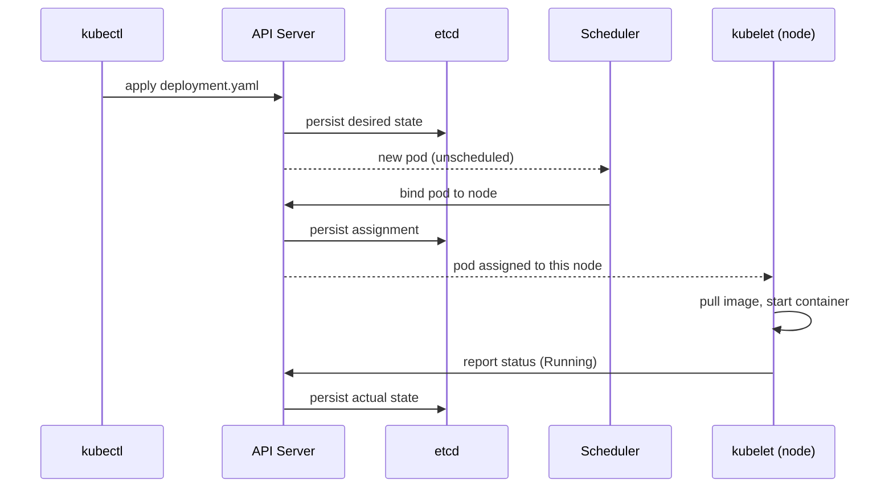
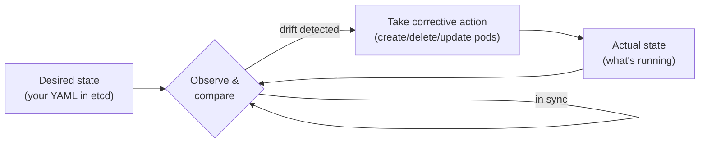
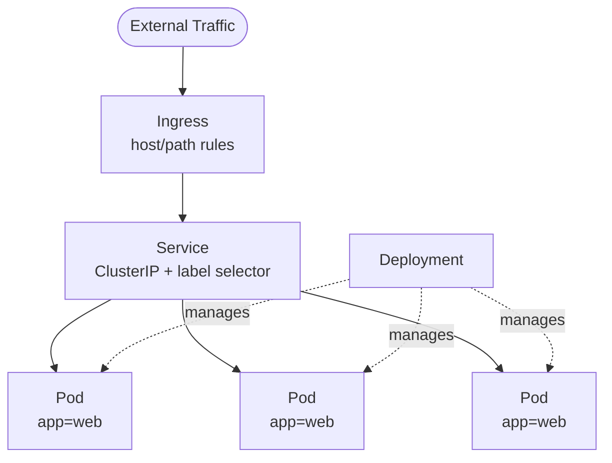

<div class="hero-section" style="background: linear-gradient(135deg, #326ce5 0%, #54a3ff 100%); color: white; padding: 3rem 2rem; margin: -2rem -3rem 2rem -3rem; text-align: center;">
  <h1 style="color: white; margin: 0; font-size: 2.5rem;">Kubernetes: Fundamentals</h1>
  <p style="font-size: 1.25rem; margin-top: 1rem; opacity: 0.9;">Master the core building blocks of Kubernetes including Pods, Deployments, Services, and cluster architecture.</p>
</div>

## Getting Started with Kubernetes

Before diving into commands and configurations, it helps to understand what Kubernetes actually does. Think of it as a distributed operating system: just as your laptop's OS manages programs, memory, and files on a single machine, Kubernetes manages containers, resources, and storage across many machines.

**Why does this matter?** When you run `kubectl apply -f myapp.yaml`, you are not just starting a container. You are telling Kubernetes: "Here is what I want my application to look like. Make it happen and keep it that way." Kubernetes then handles container placement, networking, restarts, and scaling automatically.

This guide walks you through the fundamentals, building from your first deployment to production-ready configurations.

## Quick Start Guide

The fastest way to understand Kubernetes is to use it. This section gets you deploying an application in minutes.

### Requirements
- Container technology knowledge (Docker)
- Kubernetes cluster access (minikube, kind, k3s, or cloud provider)
- kubectl CLI v1.28+ installed
- Optional: Helm 3.x for package management

### Your First Deployment

Let us deploy a web server and see Kubernetes in action:

```bash
# Deploy nginx and expose it
kubectl create deployment hello-world --image=nginx:alpine
kubectl expose deployment hello-world --type=LoadBalancer --port=80

# Verify it is running
kubectl get pods
kubectl get services
```

Now try the self-healing feature that makes Kubernetes valuable:

```bash
# Scale to 3 replicas and delete one pod
kubectl scale deployment hello-world --replicas=3
kubectl delete pod <pod-name>
kubectl get pods  # A new pod automatically replaces the deleted one
```

Clean up when done:

```bash
kubectl delete deployment hello-world
kubectl delete service hello-world
```

### Core Concepts at a Glance

Before going deeper, here is how the key pieces fit together:

| Concept | What It Is | Analogy |
|---------|------------|---------|
| **Pod** | Smallest deployable unit; wraps one or more containers | An apartment unit in a building |
| **Deployment** | Manages pod replicas and updates | A property manager ensuring units are occupied |
| **Service** | Stable network address for pods | The building's front desk that routes visitors |
| **Node** | A machine (physical or virtual) running pods | An apartment building |
| **Cluster** | A group of nodes managed together | The entire apartment complex |

**The key insight**: You rarely work with pods directly. Instead, you tell a Deployment "I want 3 copies of my app" and it creates and manages the pods for you. Services then route traffic to those pods, regardless of which nodes they run on.

The rest of this guide explores each concept in depth, showing you how to build production-ready systems.

## Understanding Kubernetes: From Containers to Orchestration

Consider the following evolution in how we run applications:

| Era | Approach | Trade-off |
|-----|----------|-----------|
| **Bare Metal** | One application per server | Wasted resources; most servers idle |
| **Virtual Machines** | Multiple VMs per server | Better utilization but heavy overhead |
| **Containers** | Many containers per server | Lightweight but manual management at scale |
| **Orchestration** | Kubernetes manages containers | Automated, scalable, self-healing |

Each step solved the previous era's problems while creating new challenges. Containers solved VM overhead but introduced complexity: How do you run hundreds of containers across dozens of servers? How do you ensure they stay healthy? How do you update them without downtime?

Kubernetes answers these questions with a declarative approach and automated operations.

### What Kubernetes Provides

Rather than listing features, consider what problems each capability solves:

| Challenge | Kubernetes Solution | Benefit |
|-----------|---------------------|---------|
| "My container crashed" | Self-healing | Automatic restart and replacement |
| "How do services find each other?" | Service discovery | Built-in DNS and load balancing |
| "I need to deploy without downtime" | Rolling updates | Gradual replacement of old pods |
| "Traffic is spiking" | Horizontal scaling | Add replicas automatically or manually |
| "I need to store passwords securely" | Secrets | Encrypted storage with access controls |
| "Different apps need different storage" | Storage classes | Abstract storage provisioning |

## Core Concepts

Now that you understand why Kubernetes exists, let us explore how it works. The architecture consists of two main parts: the **control plane** that makes decisions and the **worker nodes** that run your applications.

**Consider the following**: When you run `kubectl apply -f deployment.yaml`, your request travels through several components. The API Server receives it, stores the desired state in etcd, the Scheduler decides which node should run the pods, and the Controller Manager ensures reality matches your specification. Understanding this flow helps you troubleshoot when things go wrong.

<div class="architecture-section">
  <h3><i class="fas fa-sitemap"></i> Architecture Overview</h3>
  <p>Kubernetes follows a master-worker architecture. The control plane manages the cluster while worker nodes run your applications.</p>
  
  <div class="architecture-visual">
    <svg viewBox="0 0 700 400" class="k8s-architecture">
      <!-- Control Plane -->
      <rect x="50" y="50" width="600" height="120" fill="#3498db" opacity="0.1" stroke="#3498db" stroke-width="2" />
      <text x="350" y="30" text-anchor="middle" font-size="16" font-weight="bold">Control Plane</text>
      
      <!-- API Server -->
      <rect x="70" y="70" width="100" height="80" fill="#e74c3c" opacity="0.5" stroke="#c0392b" stroke-width="2" />
      <text x="120" y="105" text-anchor="middle" font-size="11" fill="white">API Server</text>
      <text x="120" y="120" text-anchor="middle" font-size="9" fill="white">Gateway</text>
      
      <!-- etcd -->
      <rect x="190" y="70" width="100" height="80" fill="#27ae60" opacity="0.5" stroke="#229954" stroke-width="2" />
      <text x="240" y="105" text-anchor="middle" font-size="11" fill="white">etcd</text>
      <text x="240" y="120" text-anchor="middle" font-size="9" fill="white">State Store</text>
      
      <!-- Scheduler -->
      <rect x="310" y="70" width="100" height="80" fill="#f39c12" opacity="0.5" stroke="#d68910" stroke-width="2" />
      <text x="360" y="105" text-anchor="middle" font-size="11" fill="white">Scheduler</text>
      <text x="360" y="120" text-anchor="middle" font-size="9" fill="white">Pod Placement</text>
      
      <!-- Controller Manager -->
      <rect x="430" y="70" width="100" height="80" fill="#9b59b6" opacity="0.5" stroke="#7d3c98" stroke-width="2" />
      <text x="480" y="100" text-anchor="middle" font-size="11" fill="white">Controller</text>
      <text x="480" y="115" text-anchor="middle" font-size="11" fill="white">Manager</text>
      <text x="480" y="130" text-anchor="middle" font-size="9" fill="white">Controllers</text>
      
      <!-- Cloud Controller -->
      <rect x="550" y="70" width="80" height="80" fill="#1abc9c" opacity="0.5" stroke="#16a085" stroke-width="2" />
      <text x="590" y="100" text-anchor="middle" font-size="10" fill="white">Cloud</text>
      <text x="590" y="115" text-anchor="middle" font-size="10" fill="white">Controller</text>
      <text x="590" y="130" text-anchor="middle" font-size="9" fill="white">Manager</text>
      
      <!-- Worker Nodes -->
      <text x="350" y="210" text-anchor="middle" font-size="16" font-weight="bold">Worker Nodes</text>
      
      <!-- Node 1 -->
      <rect x="50" y="230" width="180" height="150" fill="#95a5a6" opacity="0.1" stroke="#7f8c8d" stroke-width="2" />
      <text x="140" y="250" text-anchor="middle" font-size="12">Node 1</text>
      
      <!-- kubelet -->
      <rect x="60" y="260" width="70" height="40" fill="#3498db" opacity="0.5" />
      <text x="95" y="285" text-anchor="middle" font-size="10" fill="white">kubelet</text>
      
      <!-- kube-proxy -->
      <rect x="150" y="260" width="70" height="40" fill="#e74c3c" opacity="0.5" />
      <text x="185" y="285" text-anchor="middle" font-size="10" fill="white">kube-proxy</text>
      
      <!-- Container runtime -->
      <rect x="60" y="310" width="160" height="40" fill="#27ae60" opacity="0.5" />
      <text x="140" y="335" text-anchor="middle" font-size="10" fill="white">Container Runtime</text>
      
      <!-- Pods -->
      <circle cx="90" cy="365" r="12" fill="#f39c12" />
      <circle cx="140" cy="365" r="12" fill="#f39c12" />
      <circle cx="190" cy="365" r="12" fill="#f39c12" />
      <text x="140" y="370" text-anchor="middle" font-size="9">Pods</text>
      
      <!-- Node 2 -->
      <rect x="260" y="230" width="180" height="150" fill="#95a5a6" opacity="0.1" stroke="#7f8c8d" stroke-width="2" />
      <text x="350" y="250" text-anchor="middle" font-size="12">Node 2</text>
      
      <!-- Node 3 -->
      <rect x="470" y="230" width="180" height="150" fill="#95a5a6" opacity="0.1" stroke="#7f8c8d" stroke-width="2" />
      <text x="560" y="250" text-anchor="middle" font-size="12">Node 3</text>
      
      <!-- Communication lines -->
      <path d="M 120 150 L 140 230" stroke="#2c3e50" stroke-width="1" stroke-dasharray="3,3" />
      <path d="M 360 150 L 350 230" stroke="#2c3e50" stroke-width="1" stroke-dasharray="3,3" />
      <path d="M 480 150 L 560 230" stroke="#2c3e50" stroke-width="1" stroke-dasharray="3,3" />
    </svg>
  </div>
  
  <div class="component-details">
    <div class="component-group control-plane">
      <h4><i class="fas fa-server"></i> Control Plane Components</h4>
      <div class="component-list">
        <div class="component-item">
          <i class="fas fa-plug"></i>
          <strong>API Server:</strong> Central management point, exposes Kubernetes API
        </div>
        <div class="component-item">
          <i class="fas fa-database"></i>
          <strong>etcd:</strong> Distributed key-value store for cluster state
        </div>
        <div class="component-item">
          <i class="fas fa-calendar-alt"></i>
          <strong>Scheduler:</strong> Assigns pods to nodes based on resource requirements
        </div>
        <div class="component-item">
          <i class="fas fa-cogs"></i>
          <strong>Controller Manager:</strong> Runs controller processes
        </div>
        <div class="component-item">
          <i class="fas fa-cloud"></i>
          <strong>Cloud Controller Manager:</strong> Integrates with cloud provider APIs
        </div>
      </div>
    </div>
    
    <div class="component-group node-components">
      <h4><i class="fas fa-microchip"></i> Node Components</h4>
      <div class="component-list">
        <div class="component-item">
          <i class="fas fa-heartbeat"></i>
          <strong>kubelet:</strong> Ensures containers are running in pods
        </div>
        <div class="component-item">
          <i class="fas fa-network-wired"></i>
          <strong>kube-proxy:</strong> Maintains network rules for pod communication
        </div>
        <div class="component-item">
          <i class="fas fa-box"></i>
          <strong>Container Runtime:</strong> Docker, containerd, or CRI-O
        </div>
      </div>
    </div>
  </div>
</div>

### What Happens When You Apply a Manifest

The diagram below traces a single `kubectl apply` through the control plane. Notice that the components never talk to each other directly — they all watch the API server, which is the single source of truth backed by etcd. This "level-triggered" design is what makes Kubernetes self-healing: controllers continuously reconcile actual state toward desired state.



### The Reconciliation Loop

The single most important idea in Kubernetes is the **control loop** (or reconciliation loop). Every controller runs the same endless cycle: observe the current state, compare it to the desired state recorded in etcd, and take action to close the gap. There is no one-shot "deploy" step — the system is *continuously* driven toward your declared intent, which is precisely why a deleted pod reappears and a crashed container restarts.



This is a **level-triggered** design (it reacts to the current level of state) rather than **edge-triggered** (reacting to one-time events). If a controller misses an event, it simply re-observes reality on its next pass and still converges — making Kubernetes robust to restarts, network blips, and lost messages.

### Kubernetes Objects: The Building Blocks

With the architecture understood, let us explore the objects you will work with daily. Each object type solves a specific problem, and choosing the right one depends on your application's needs.

**When to use each object type**:

| Object | Use Case | Example |
|--------|----------|---------|
| **Pod** | Rarely used directly; foundation for other objects | Testing, debugging |
| **Deployment** | Stateless applications that can scale horizontally | Web servers, APIs |
| **StatefulSet** | Stateful applications needing stable identity | Databases, message queues |
| **DaemonSet** | Run one pod per node | Log collectors, monitoring agents |
| **Job** | Run-to-completion tasks | Database migrations, batch processing |
| **CronJob** | Scheduled tasks | Nightly backups, report generation |

Let us examine each object type, starting with the foundation.

<div class="k8s-objects-section">
  <div class="object-card pod-object">
    <div class="object-header">
      <i class="fas fa-cube"></i>
      <h4>Pods</h4>
    </div>
    <p class="object-desc">The smallest deployable unit in Kubernetes:</p>
    
    <div class="object-visual">
      <svg viewBox="0 0 300 150">
        <!-- Pod outline -->
        <rect x="50" y="30" width="200" height="90" rx="10" fill="#3498db" opacity="0.2" stroke="#3498db" stroke-width="2" />
        <text x="150" y="20" text-anchor="middle" font-size="12" font-weight="bold">Pod</text>
        
        <!-- Containers inside pod -->
        <rect x="70" y="50" width="70" height="50" fill="#e74c3c" opacity="0.5" rx="5" />
        <text x="105" y="80" text-anchor="middle" font-size="10" fill="white">Container 1</text>
        
        <rect x="160" y="50" width="70" height="50" fill="#27ae60" opacity="0.5" rx="5" />
        <text x="195" y="80" text-anchor="middle" font-size="10" fill="white">Container 2</text>
        
        <!-- Shared resources -->
        <text x="150" y="130" text-anchor="middle" font-size="9">Shared Network & Storage</text>
      </svg>
    </div>
    
    <div class="code-example">
      <div class="code-header">Pod Definition</div>
      <pre><code class="language-yaml">apiVersion: v1
kind: Pod
metadata:
  name: nginx-pod
  labels:
    app: nginx
spec:
  containers:
  - name: nginx
    image: nginx:1.21
    ports:
    - containerPort: 80</code></pre>
    </div>
    
    <div class="key-features">
      <h5>Key Features:</h5>
      <div class="feature-grid">
        <div class="feature-item">
          <i class="fas fa-layer-group"></i>
          <span>One or more containers</span>
        </div>
        <div class="feature-item">
          <i class="fas fa-share-alt"></i>
          <span>Shared network and storage</span>
        </div>
        <div class="feature-item">
          <i class="fas fa-hourglass-half"></i>
          <span>Ephemeral by design</span>
        </div>
        <div class="feature-item">
          <i class="fas fa-fingerprint"></i>
          <span>Unique IP address</span>
        </div>
      </div>
    </div>
  </div>

  <div class="object-card deployment-object">
    <div class="object-header">
      <i class="fas fa-rocket"></i>
      <h4>Deployments</h4>
    </div>
    <p class="object-desc">Manages replica sets and provides declarative updates:</p>
    
    <div class="object-visual">
      <svg viewBox="0 0 400 200">
        <!-- Deployment controller -->
        <rect x="150" y="20" width="100" height="40" fill="#9b59b6" opacity="0.5" stroke="#8e44ad" stroke-width="2" />
        <text x="200" y="45" text-anchor="middle" font-size="11" fill="white">Deployment</text>
        
        <!-- ReplicaSet -->
        <rect x="125" y="80" width="150" height="40" fill="#3498db" opacity="0.3" stroke="#2980b9" stroke-width="2" />
        <text x="200" y="105" text-anchor="middle" font-size="10">ReplicaSet</text>
        
        <!-- Pods -->
        <circle cx="120" cy="160" r="20" fill="#e74c3c" opacity="0.5" />
        <text x="120" y="165" text-anchor="middle" font-size="9" fill="white">Pod</text>
        
        <circle cx="200" cy="160" r="20" fill="#e74c3c" opacity="0.5" />
        <text x="200" y="165" text-anchor="middle" font-size="9" fill="white">Pod</text>
        
        <circle cx="280" cy="160" r="20" fill="#e74c3c" opacity="0.5" />
        <text x="280" y="165" text-anchor="middle" font-size="9" fill="white">Pod</text>
        
        <!-- Arrows -->
        <path d="M 200 60 L 200 75" stroke="#2c3e50" stroke-width="2" marker-end="url(#arrow)" />
        <path d="M 150 120 L 120 135" stroke="#2c3e50" stroke-width="2" marker-end="url(#arrow)" />
        <path d="M 200 120 L 200 135" stroke="#2c3e50" stroke-width="2" marker-end="url(#arrow)" />
        <path d="M 250 120 L 280 135" stroke="#2c3e50" stroke-width="2" marker-end="url(#arrow)" />
        
        <text x="330" y="105" font-size="10">Replicas: 3</text>
      </svg>
    </div>
    
    <div class="code-example">
      <div class="code-header">Deployment Definition</div>
      <pre><code class="language-yaml">apiVersion: apps/v1
kind: Deployment
metadata:
  name: nginx-deployment
spec:
  replicas: 3
  selector:
    matchLabels:
      app: nginx
  template:
    metadata:
      labels:
        app: nginx
    spec:
      containers:
      - name: nginx
        image: nginx:1.21
        ports:
        - containerPort: 80</code></pre>
    </div>
    
    <div class="deployment-features">
      <h5>Features:</h5>
      <div class="feature-cards">
        <div class="feature-card">
          <i class="fas fa-sync-alt"></i>
          <h6>Rolling Updates</h6>
          <p>Zero-downtime deployments</p>
        </div>
        <div class="feature-card">
          <i class="fas fa-undo"></i>
          <h6>Rollback</h6>
          <p>Revert to previous versions</p>
        </div>
        <div class="feature-card">
          <i class="fas fa-expand-arrows-alt"></i>
          <h6>Scaling</h6>
          <p>Adjust replica count</p>
        </div>
        <div class="feature-card">
          <i class="fas fa-heartbeat"></i>
          <h6>Self-healing</h6>
          <p>Automatic pod recovery</p>
        </div>
      </div>
    </div>
  </div>

  <div class="object-card service-object">
    <div class="object-header">
      <i class="fas fa-network-wired"></i>
      <h4>Services</h4>
    </div>
    <p class="object-desc">Provides stable network endpoint for pods:</p>
    
    <div class="service-types-visual">
      <h5>Service Types</h5>
      <div class="service-type-grid">
        <div class="service-type clusterip">
          <svg viewBox="0 0 150 120">
            <rect x="30" y="30" width="90" height="60" fill="#3498db" opacity="0.2" stroke="#3498db" stroke-width="2" />
            <text x="75" y="20" text-anchor="middle" font-size="10" font-weight="bold">ClusterIP</text>
            <circle cx="50" cy="60" r="8" fill="#e74c3c" />
            <circle cx="75" cy="60" r="8" fill="#e74c3c" />
            <circle cx="100" cy="60" r="8" fill="#e74c3c" />
            <text x="75" y="105" text-anchor="middle" font-size="9">Internal Only</text>
          </svg>
        </div>
        
        <div class="service-type nodeport">
          <svg viewBox="0 0 150 120">
            <rect x="30" y="30" width="90" height="60" fill="#27ae60" opacity="0.2" stroke="#27ae60" stroke-width="2" />
            <text x="75" y="20" text-anchor="middle" font-size="10" font-weight="bold">NodePort</text>
            <circle cx="75" cy="60" r="8" fill="#e74c3c" />
            <line x1="75" y1="52" x2="75" y2="10" stroke="#2c3e50" stroke-width="2" marker-end="url(#arrow)" />
            <text x="75" y="105" text-anchor="middle" font-size="9">Node IP:Port</text>
          </svg>
        </div>
        
        <div class="service-type loadbalancer">
          <svg viewBox="0 0 150 120">
            <ellipse cx="75" cy="15" rx="40" ry="10" fill="#f39c12" opacity="0.3" />
            <text x="75" y="18" text-anchor="middle" font-size="9">LB</text>
            <rect x="30" y="40" width="90" height="50" fill="#f39c12" opacity="0.2" stroke="#f39c12" stroke-width="2" />
            <text x="75" y="35" text-anchor="middle" font-size="10" font-weight="bold">LoadBalancer</text>
            <circle cx="75" cy="65" r="8" fill="#e74c3c" />
            <text x="75" y="105" text-anchor="middle" font-size="9">External LB</text>
          </svg>
        </div>
        
        <div class="service-type externalname">
          <svg viewBox="0 0 150 120">
            <rect x="30" y="30" width="90" height="60" fill="#9b59b6" opacity="0.2" stroke="#9b59b6" stroke-width="2" />
            <text x="75" y="20" text-anchor="middle" font-size="10" font-weight="bold">ExternalName</text>
            <text x="75" y="60" text-anchor="middle" font-size="16">DNS</text>
            <text x="75" y="105" text-anchor="middle" font-size="9">Maps to DNS</text>
          </svg>
        </div>
      </div>
    </div>
    
    <div class="code-example">
      <div class="code-header">Service Definition</div>
      <pre><code class="language-yaml">apiVersion: v1
kind: Service
metadata:
  name: nginx-service
spec:
  selector:
    app: nginx
  ports:
  - port: 80
    targetPort: 80
  type: LoadBalancer</code></pre>
    </div>
  </div>

**Choosing a Service Type**: The right service type depends on how your application needs to be accessed:

| Service Type | Accessible From | Use Case | Cost |
|--------------|-----------------|----------|------|
| **ClusterIP** | Inside cluster only | Internal microservices | Free |
| **NodePort** | Node IP + port (30000-32767) | Development, testing | Free |
| **LoadBalancer** | External IP via cloud LB | Production web apps | Cloud provider charges |
| **ExternalName** | DNS alias | Accessing external services | Free |

**When to use each**: Start with ClusterIP for internal services. Use LoadBalancer for production internet-facing services. NodePort is useful for development but rarely appropriate for production due to port limitations.

#### ConfigMaps and Secrets: Managing Application Configuration

As your applications grow, you'll need to manage configuration separately from your container images. This separation allows you to deploy the same image across different environments (development, staging, production) with different configurations. ConfigMaps handle non-sensitive data, while Secrets manage sensitive information like passwords and API keys.

**ConfigMap Example:**
```yaml
apiVersion: v1
kind: ConfigMap
metadata:
  name: app-config
data:
  database_url: "postgres://localhost:5432/mydb"
  api_key: "public-api-key"
```

**Secret Example:**
```yaml
apiVersion: v1
kind: Secret
metadata:
  name: db-secret
type: Opaque
data:
  username: YWRtaW4=  # base64 encoded
  password: cGFzc3dvcmQ=  # base64 encoded
```

  <div class="object-card namespace-object">
    <div class="object-header">
      <i class="fas fa-folder"></i>
      <h4>Namespaces</h4>
    </div>
    <p class="object-desc">Logical isolation within a cluster:</p>
    
    <div class="namespace-visual">
      <svg viewBox="0 0 400 250">
        <!-- Cluster boundary -->
        <rect x="20" y="20" width="360" height="210" fill="none" stroke="#2c3e50" stroke-width="2" stroke-dasharray="5,5" />
        <text x="200" y="15" text-anchor="middle" font-size="12" font-weight="bold">Kubernetes Cluster</text>
        
        <!-- Default namespace -->
        <rect x="40" y="40" width="150" height="80" fill="#3498db" opacity="0.2" stroke="#3498db" stroke-width="2" />
        <text x="115" y="60" text-anchor="middle" font-size="11" font-weight="bold">default</text>
        <circle cx="70" cy="90" r="8" fill="#e74c3c" />
        <circle cx="100" cy="90" r="8" fill="#e74c3c" />
        <circle cx="130" cy="90" r="8" fill="#e74c3c" />
        <text x="100" y="110" text-anchor="middle" font-size="9">User Apps</text>
        
        <!-- kube-system namespace -->
        <rect x="210" y="40" width="150" height="80" fill="#e74c3c" opacity="0.2" stroke="#e74c3c" stroke-width="2" />
        <text x="285" y="60" text-anchor="middle" font-size="11" font-weight="bold">kube-system</text>
        <rect x="234" y="79" width="12" height="12" fill="#c0392b" />
        <rect x="264" y="79" width="12" height="12" fill="#c0392b" />
        <rect x="294" y="79" width="12" height="12" fill="#c0392b" />
        <text x="270" y="110" text-anchor="middle" font-size="9">System Pods</text>
        
        <!-- Development namespace -->
        <rect x="40" y="140" width="150" height="70" fill="#27ae60" opacity="0.2" stroke="#27ae60" stroke-width="2" />
        <text x="115" y="160" text-anchor="middle" font-size="11" font-weight="bold">development</text>
        <circle cx="70" cy="185" r="8" fill="#229954" />
        <circle cx="100" cy="185" r="8" fill="#229954" />
        <text x="85" y="205" text-anchor="middle" font-size="9">Dev Apps</text>
        
        <!-- Production namespace -->
        <rect x="210" y="140" width="150" height="70" fill="#f39c12" opacity="0.2" stroke="#f39c12" stroke-width="2" />
        <text x="285" y="160" text-anchor="middle" font-size="11" font-weight="bold">production</text>
        <circle cx="240" cy="185" r="8" fill="#d68910" />
        <circle cx="270" cy="185" r="8" fill="#d68910" />
        <text x="255" y="205" text-anchor="middle" font-size="9">Prod Apps</text>
      </svg>
    </div>
    
    <div class="code-example">
      <div class="code-header">Namespace Definition</div>
      <pre><code class="language-yaml">apiVersion: v1
kind: Namespace
metadata:
  name: development</code></pre>
    </div>
    
    <div class="default-namespaces">
      <h5>Default Namespaces:</h5>
      <div class="namespace-list">
        <div class="namespace-item">
          <code>default</code>
          <span>Default namespace for objects</span>
        </div>
        <div class="namespace-item">
          <code>kube-system</code>
          <span>Kubernetes system objects</span>
        </div>
        <div class="namespace-item">
          <code>kube-public</code>
          <span>Publicly accessible data</span>
        </div>
        <div class="namespace-item">
          <code>kube-node-lease</code>
          <span>Node heartbeat data</span>
        </div>
      </div>
    </div>
  </div>
</div>

## Workload Resources: Beyond Basic Deployments

Deployments work well for stateless applications, but real-world systems have varied requirements. Kubernetes provides specialized controllers for different workload patterns.

**Consider the following decision tree**:

- Need to scale horizontally with identical replicas? Use a **Deployment**
- Need stable identity and persistent storage per pod? Use a **StatefulSet**
- Need exactly one pod on every node? Use a **DaemonSet**
- Need to run a task to completion? Use a **Job**
- Need to run tasks on a schedule? Use a **CronJob**

### Deployment vs StatefulSet vs DaemonSet

| Characteristic | Deployment | StatefulSet | DaemonSet |
|----------------|------------|-------------|-----------|
| **Pod identity** | Random names | Ordered names (app-0, app-1) | One per node |
| **Scaling** | Any order | Sequential (0, 1, 2...) | Tied to node count |
| **Storage** | Shared or none | Dedicated per pod | Usually none |
| **Network** | Random IPs | Stable DNS per pod | Per-node |
| **Use case** | Web apps, APIs | Databases, Kafka | Logging, monitoring |

### StatefulSets: When Order and Identity Matter

StatefulSets solve the "pets vs cattle" problem. While Deployments treat pods as interchangeable (cattle), StatefulSets give each pod a stable identity (pets). This matters for applications like databases that need to know their role in a cluster.

```yaml
apiVersion: apps/v1
kind: StatefulSet
metadata:
  name: postgres
spec:
  serviceName: postgres
  replicas: 3
  selector:
    matchLabels:
      app: postgres
  template:
    spec:
      containers:
      - name: postgres
        image: postgres:13
  volumeClaimTemplates:
  - metadata:
      name: postgres-storage
    spec:
      accessModes: ["ReadWriteOnce"]
      resources:
        requests:
          storage: 10Gi
```

**What StatefulSets guarantee**:
- Pods named sequentially: postgres-0, postgres-1, postgres-2
- Each pod gets its own persistent volume
- Pods created in order (0 before 1 before 2) and deleted in reverse
- Stable DNS: postgres-0.postgres.default.svc.cluster.local

### DaemonSets: One Pod Per Node

Some workloads need to run everywhere: log collectors that capture output from all containers, monitoring agents that track node health, or network plugins. DaemonSets ensure exactly one pod runs on each node automatically.

```yaml
apiVersion: apps/v1
kind: DaemonSet
metadata:
  name: fluentd
spec:
  selector:
    matchLabels:
      app: fluentd
  template:
    spec:
      containers:
      - name: fluentd
        image: fluentd:v1.14
```

**Common DaemonSet applications**:
- **Logging**: Fluentd, Filebeat collecting container logs
- **Monitoring**: Node Exporter, Datadog agent
- **Networking**: Calico, Cilium CNI plugins
- **Storage**: CSI node plugins

### Jobs and CronJobs: Task Automation

Not all workloads run continuously. Jobs handle run-to-completion tasks, while CronJobs run tasks on a schedule.

**Job** - runs once until successful:
```yaml
apiVersion: batch/v1
kind: Job
metadata:
  name: db-migration
spec:
  template:
    spec:
      containers:
      - name: migrate
        image: myapp:latest
        command: ["./migrate.sh"]
      restartPolicy: OnFailure
  backoffLimit: 3  # Retry up to 3 times
```

**CronJob** - runs on a schedule (standard cron syntax):
```yaml
apiVersion: batch/v1
kind: CronJob
metadata:
  name: nightly-backup
spec:
  schedule: "0 2 * * *"  # 2 AM daily
  jobTemplate:
    spec:
      template:
        spec:
          containers:
          - name: backup
            image: backup-tool:latest
          restartPolicy: OnFailure
```

**Real-world Job use cases**: database migrations, data imports, report generation, sending batch emails, cleanup tasks.

## Keeping Pods Healthy: Probes and Resources

A Deployment will restart a *crashed* container automatically, but many failures are subtler: a process that is still running yet stuck in a deadlock, or one that has started but is not yet ready to serve traffic. Health probes and resource limits are how you tell Kubernetes what "healthy" actually means for your application.

### Liveness, Readiness, and Startup Probes

The three probe types answer three different questions, and confusing them is one of the most common production mistakes.

| Probe | Question it answers | Action on failure |
|-------|---------------------|-------------------|
| **Liveness** | "Is the container alive, or wedged?" | Restart the container |
| **Readiness** | "Can it serve traffic right now?" | Remove the pod from Service endpoints (no restart) |
| **Startup** | "Has a slow-starting app finished booting?" | Hold off liveness/readiness checks until it passes |

```yaml
spec:
  containers:
  - name: web
    image: myapp:1.4
    readinessProbe:          # Gate traffic until the app is ready
      httpGet:
        path: /healthz/ready
        port: 8080
      initialDelaySeconds: 5
      periodSeconds: 10
    livenessProbe:           # Restart if the app wedges
      httpGet:
        path: /healthz/live
        port: 8080
      periodSeconds: 15
      failureThreshold: 3
```

**Why the distinction matters**: a failing *readiness* probe quietly pulls the pod out of rotation so users are never routed to it, then re-adds it once healthy — ideal for warm-ups or temporary overload. A failing *liveness* probe kills and restarts the container. Pointing a liveness probe at a dependency you do not control (such as a database) is a classic anti-pattern: a brief database hiccup triggers a restart storm that makes the outage worse.

### Requests and Limits

Every container can declare how much CPU and memory it *requests* (the amount guaranteed and used by the scheduler for placement) and its *limit* (the hard ceiling).

```yaml
    resources:
      requests:
        cpu: "250m"        # 0.25 of a core, used for scheduling
        memory: "256Mi"
      limits:
        cpu: "500m"        # throttled above this
        memory: "512Mi"    # killed (OOMKilled) above this
```

The request and limit values also determine the pod's **Quality of Service class**, which decides who gets evicted first when a node runs low on memory:

| QoS class | Condition | Eviction priority |
|-----------|-----------|-------------------|
| **Guaranteed** | requests == limits for every container | Evicted last |
| **Burstable** | requests set, but < limits | Evicted in the middle |
| **BestEffort** | no requests or limits set | Evicted first |

**Practical guidance**: always set memory requests *and* limits — CPU is compressible (excess use is throttled) but memory is not (excess use gets the container OOMKilled). Setting at least requests on every production workload prevents one greedy pod from starving its neighbors.

## Networking: Connecting Your Applications

Kubernetes networking follows a simple principle: every pod gets its own IP address, and all pods can communicate with each other without NAT. This flat network model makes it easy to reason about connectivity.

**Consider the following networking layers**:

| Layer | Purpose | Kubernetes Object |
|-------|---------|-------------------|
| Pod-to-Pod | Direct communication | Flat network (automatic) |
| Pod-to-Service | Stable endpoint for pods | Service |
| External-to-Service | Traffic from outside cluster | Ingress, LoadBalancer |
| Service-to-External | Outbound connections | NetworkPolicy (egress) |

The diagram below shows how external traffic reaches a pod: an Ingress routes by host/path to a Service, which load-balances across the matching pods (selected by label) managed by a Deployment.



### Ingress: Your Cluster's Front Door

While Services handle internal routing, Ingress manages external HTTP/HTTPS traffic. Instead of creating multiple LoadBalancer services (each with its own IP and cost), Ingress provides a single entry point that routes to different services based on hostnames and paths.

```yaml
apiVersion: networking.k8s.io/v1
kind: Ingress
metadata:
  name: app-ingress
spec:
  rules:
  - host: app.example.com
    http:
      paths:
      - path: /api
        pathType: Prefix
        backend:
          service:
            name: api-service
            port:
              number: 80
```

**When to use Ingress vs LoadBalancer**:
- Use **Ingress** when you have multiple services that need HTTP/HTTPS routing
- Use **LoadBalancer** for non-HTTP traffic or single services
- Ingress typically requires an Ingress Controller (nginx, traefik, or cloud-provided)

### Network Policies: Microsegmentation for Security

By default, all pods can communicate freely. Network Policies let you restrict this, implementing defense-in-depth by controlling which pods can talk to each other.

```yaml
apiVersion: networking.k8s.io/v1
kind: NetworkPolicy
metadata:
  name: api-allow-frontend-only
spec:
  podSelector:
    matchLabels:
      app: api
  ingress:
  - from:
    - podSelector:
        matchLabels:
          app: frontend
    ports:
    - port: 8080
```

This policy says: "Only allow traffic to the API pods from frontend pods on port 8080."

**Important**: Network Policies require a CNI plugin that supports them (Calico, Cilium, Weave Net). The default kubenet does not enforce policies.

<div class="notice--warning">
  <h4>Common Pitfalls</h4>
  <ul>
    <li><strong>Managing pods directly:</strong> Never create bare pods in production. Use a Deployment (or StatefulSet) so failed pods are recreated automatically.</li>
    <li><strong>Mismatched labels:</strong> A Service routes to pods by label selector. If the selector and pod labels disagree, the Service has zero endpoints and silently drops traffic.</li>
    <li><strong>Assuming NetworkPolicies are enforced:</strong> Without a policy-aware CNI, NetworkPolicy objects are accepted but ignored — giving a false sense of isolation.</li>
    <li><strong>One LoadBalancer per service:</strong> Each cloud LoadBalancer costs money and consumes an IP. Use a single Ingress to fan out to many services instead.</li>
  </ul>
</div>

## Key Takeaways

<div class="takeaway-grid">
  <div class="takeaway-card">
    <h4>Declarative, Not Imperative</h4>
    <p>You describe desired state; controllers continuously reconcile reality toward it. This is the source of self-healing.</p>
  </div>
  <div class="takeaway-card">
    <h4>Everything Goes Through the API Server</h4>
    <p>Components never talk directly — they watch the API server, which persists state in etcd.</p>
  </div>
  <div class="takeaway-card">
    <h4>Deployments Manage Pods</h4>
    <p>Work with Deployments and Services, not raw pods. The Deployment owns replica count and rollout; the Service owns the stable address.</p>
  </div>
  <div class="takeaway-card">
    <h4>Labels Wire It Together</h4>
    <p>Services, NetworkPolicies, and selectors all match by label. Consistent labeling is foundational.</p>
  </div>
</div>

---

## See Also

- [Workloads &amp; Storage](workloads.html) - StatefulSets, persistent volumes, and config management
- [Operations](operations.html) - kubectl, Helm, and troubleshooting
- [Advanced Topics](advanced.html) - CRDs, Operators, service mesh, and GitOps
- [Docker](../docker/) - The container fundamentals Kubernetes builds on
- [AWS EKS](../aws/compute.html) - Managed Kubernetes on AWS

