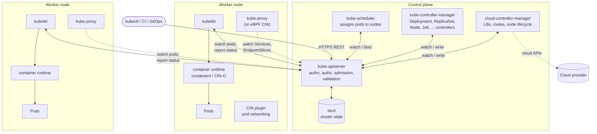
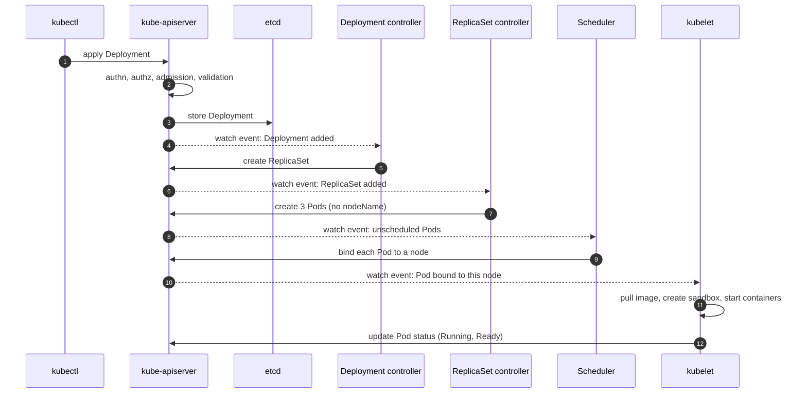
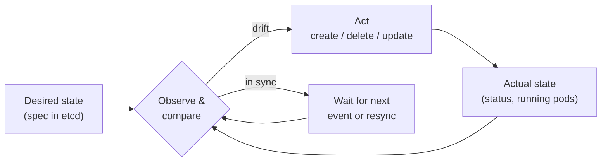
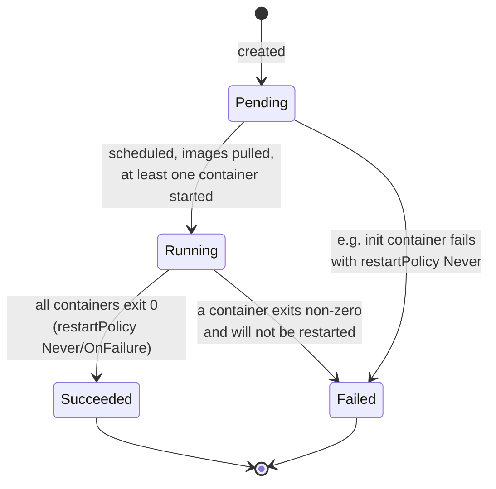
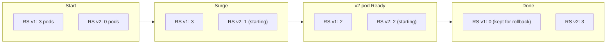
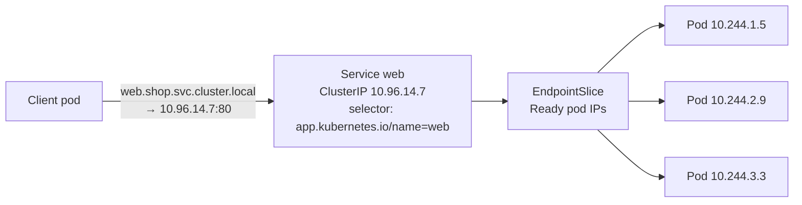
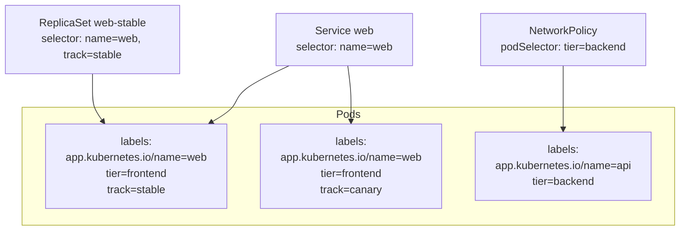

[Kubernetes](./) &raquo; Fundamentals

This page is **Part I** of the Kubernetes fundamentals. It explains how a cluster is put together (control plane and worker nodes), the declarative model that drives it, and the objects you work with every day — Pods, ReplicaSets, Deployments, Services and Namespaces — together with the labels and selectors that connect them. Examples target Kubernetes **v1.35–v1.37**, the minor releases supported as of late 2026.

Two companion pages continue from here:

| Page | Covers |
|------|--------|
| [Networking &amp; Configuration](fundamentals-networking.html) | Services and kube-proxy in depth, Ingress and Gateway API, NetworkPolicies, ConfigMaps, Secrets, RBAC |
| [Health &amp; Resource Management](fundamentals-resources.html) | Probes, requests and limits, QoS classes, eviction, scheduling, in-place resize, the Horizontal Pod Autoscaler |

## Overview

Kubernetes is a **declarative control system for containers**. You submit a description of the state you want — "three replicas of this image, reachable at this name" — to an API server. A set of independent controllers then works continuously to make the cluster match that description: placing containers on machines, restarting them when they fail, replacing them when a machine disappears, and rewiring networking as they move.

Two properties follow from that design and explain most of Kubernetes' behaviour:

- **Everything is an API object.** Pods, Deployments, Services, nodes and even RBAC rules are records stored in the cluster's database (etcd) and manipulated through one REST API. `kubectl` is just an API client.
- **Nothing is one-shot.** There is no "deploy" transaction that runs once and finishes. Controllers re-observe the world in a loop and correct drift forever, which is why a deleted pod reappears and a crashed container restarts.

## Quick Start

The fastest way to build intuition is to watch the reconciliation loop work.

### Prerequisites

- Familiarity with containers and images (see [Docker](../docker/)).
- A cluster. For local work, any of the following is fine:

| Tool | What it runs | Notes |
|------|--------------|-------|
| **kind** | Kubernetes nodes as Docker/Podman containers | Fast, disposable; the upstream project's own CI tool. Multi-node clusters from one config file. |
| **minikube** | A single-node cluster in a VM or container | Bundles add-ons (ingress, metrics-server, dashboard); `minikube tunnel` provides LoadBalancer IPs. |
| **k3d / k3s** | Rancher's lightweight distribution | k3s is also used on edge and small production clusters. |
| **Docker Desktop / Rancher Desktop / Podman Desktop** | A built-in single-node cluster | Convenient on macOS and Windows. |

- **kubectl** within one minor version of the cluster's API server (the supported [version skew](https://kubernetes.io/releases/version-skew-policy/)): a v1.36 kubectl can talk to v1.35, v1.36 and v1.37 control planes.

### Your First Deployment

```bash
# Create a Deployment and expose it inside the cluster
kubectl create deployment hello --image=nginx:1.29 --replicas=3
kubectl expose deployment hello --port=80

# Look at what was created: one Deployment, one ReplicaSet, three Pods, one Service
kubectl get deployment,replicaset,pod,service -l app=hello

# Reach it from your workstation without an external load balancer
kubectl port-forward service/hello 8080:80   # then open http://localhost:8080
```

Now delete a pod and watch it come back:

```bash
kubectl delete pod -l app=hello --wait=false   # deletes all three
kubectl get pods -l app=hello --watch           # three new pods, new names, new IPs
```

The replacements were not created by the `delete` command. The ReplicaSet controller noticed that zero pods matched its selector where three were desired, and created three more. That is the reconciliation loop described [below](#the-reconciliation-loop).

```bash
kubectl delete deployment,service hello     # clean up
```

> `kubectl expose --type=LoadBalancer` provisions an external IP only where a cloud controller (or an equivalent such as MetalLB, `minikube tunnel` or `cloud-provider-kind`) implements load balancers. On a bare local cluster the external IP stays `<pending>`; `port-forward` or `--type=NodePort` works everywhere.

## Architecture

A cluster has two halves: a **control plane** that stores state and makes decisions, and a set of **worker nodes** that run your containers. Every interaction — from `kubectl`, from controllers, from the kubelet on each node — goes through the **kube-apiserver**. Components never call each other directly; they read and *watch* objects through the API server and write their conclusions back.



### Control Plane Components

On a managed service (EKS, GKE, AKS and similar) the control plane is operated for you and is invisible except through its API. On self-managed clusters it typically runs as static pods on dedicated nodes.

| Component | Responsibility | If it fails |
|-----------|----------------|-------------|
| **kube-apiserver** | The front door and the only component that talks to etcd. Authenticates and authorizes every request, runs admission control (mutating and validating webhooks, `ValidatingAdmissionPolicy`), validates objects, and serves watches to every other component. Stateless and horizontally scalable. | The cluster cannot be changed. Existing pods keep running, but nothing is scheduled, scaled or healed. |
| **etcd** | Strongly consistent key–value store (Raft consensus) holding every object's spec and status. The single source of truth. | Loss of quorum makes the API read-only or unavailable; loss of data without a backup loses the cluster. Run 3 or 5 members and back it up. |
| **kube-scheduler** | Watches for pods with no `spec.nodeName`, filters out nodes that cannot run them, scores the rest, and *binds* each pod to a node. See [Scheduler Basics](fundamentals-resources.html#scheduler-basics). | New pods stay `Pending`; running pods are unaffected. |
| **kube-controller-manager** | One process hosting dozens of built-in controllers — Deployment, ReplicaSet, StatefulSet, Job, Node lifecycle, EndpointSlice, ServiceAccount, garbage collector and more. | Self-healing stops: failed pods are not replaced, rollouts freeze, dead nodes are not evicted. |
| **cloud-controller-manager** | Cloud-specific controllers: provisioning load balancers for `LoadBalancer` Services, configuring routes, and labelling or removing nodes as cloud instances come and go. Absent on bare metal. | Cloud load balancers and node metadata stop updating. |

The API server, scheduler and controller manager run with multiple replicas for availability; the scheduler and controller manager use **leader election** (a `Lease` object) so only one instance of each acts at a time.

### Node Components

A **node** is a VM or physical machine that runs pods. Each node runs:

- **kubelet** — the node agent. It watches the API server for pods bound to its node, asks the container runtime to pull images and start containers, mounts volumes, runs [health probes](fundamentals-resources.html#probes), enforces resource limits via cgroups, and reports pod and node status back. It also renews a heartbeat `Lease` in the `kube-node-lease` namespace; if renewals stop, the node controller marks the node `NotReady` and eventually evicts its pods.
- **Container runtime** — the software that actually runs containers, reached through the **Container Runtime Interface (CRI)**. In practice this is **containerd** or **CRI-O**. The built-in Docker Engine integration (dockershim) was removed in v1.24; images built with Docker run unchanged because they are standard OCI images. See [Container Runtimes](../container-runtimes.html).
- **kube-proxy** — programs the node's packet-forwarding rules (iptables, IPVS, or nftables) so that traffic to a Service's virtual IP reaches one of its backing pods. Some CNI plugins, such as Cilium, replace kube-proxy entirely with eBPF. Details are in [Networking &amp; Configuration](fundamentals-networking.html#how-kube-proxy-implements-services).
- **CNI plugin** — gives every pod an IP address and connects pods across nodes (Calico, Cilium, Flannel, or the cloud provider's VPC CNI).

```bash
kubectl get nodes -o wide          # roles, IPs, OS image, kernel, runtime version
kubectl describe node <node>       # capacity vs allocatable, conditions, running pods
```

The **conditions** reported by `describe node` — `Ready`, `MemoryPressure`, `DiskPressure`, `PIDPressure` — are the node's own health signal, and the pressure conditions trigger kubelet eviction (covered in [Health &amp; Resource Management](fundamentals-resources.html#node-pressure-eviction)).

## The Declarative Model

### Anatomy of an Object

Every persistent object has the same top-level shape:

```yaml
apiVersion: apps/v1          # API group and version that defines this kind
kind: Deployment             # the object type
metadata:                    # identity and bookkeeping
  name: web
  namespace: shop
  labels: {app.kubernetes.io/name: web}
spec:                        # desired state — written by you
  replicas: 3
  # ...
status:                      # observed state — written by controllers, never by you
  readyReplicas: 3
```

The split between **`spec`** (what you asked for) and **`status`** (what a controller has observed) is the whole contract. A controller's job is to make `status` converge on `spec`.

`metadata` also carries fields the system uses to relate objects:

- **`ownerReferences`** — a ReplicaSet records its Deployment as owner; each Pod records its ReplicaSet. The **garbage collector** uses these links to delete dependents when an owner is deleted (cascading deletion).
- **`resourceVersion`** — an opaque version used for optimistic concurrency: an update based on a stale version is rejected with a conflict.
- **`generation` / `status.observedGeneration`** — lets you tell whether a controller has processed the latest spec change.

### What Happens When You Apply a Manifest

Tracing a single `kubectl apply` of a Deployment shows how many independent actors cooperate — and that none of them calls another directly.



Each arrow into the API server is a write that is persisted in etcd; each dashed arrow out of it is a **watch** notification. Controllers keep a local cache of the objects they care about (the *informer* pattern), so the API server is not polled.

### Client-Side vs Server-Side Apply

`kubectl apply` merges your manifest into the live object. By default it computes the patch on the client, using the `kubectl.kubernetes.io/last-applied-configuration` annotation to remember what you set last time. **Server-side apply** (`kubectl apply --server-side`, GA since v1.22) moves that merge into the API server and records **field ownership** in `metadata.managedFields`. When two managers — say a human with kubectl and an HPA, or two GitOps tools — try to set the same field, the server reports a conflict instead of silently overwriting. Server-side apply is the default in modern controllers, Argo CD and Flux can use it, and Helm 4 uses it for new releases.

```bash
kubectl apply --server-side -f deploy.yaml
kubectl diff -f deploy.yaml        # preview what apply would change
```

### The Reconciliation Loop

Every controller runs the same cycle: **observe** the current state, **compare** it with the desired state, **act** to close the gap, repeat.



This design is **level-triggered**: a controller acts on the *current* difference between spec and status, not on the individual events that produced it. If a controller restarts, misses a watch event, or runs twice, it still converges, because on its next pass it simply re-reads reality. That is what makes Kubernetes tolerant of crashes, network partitions and concurrent edits — and why its behaviour is best understood as "many small loops each nudging one kind of object", not as a central orchestrator executing a plan.

Custom controllers and **Operators** extend the same pattern to your own resource types; see [Advanced Topics](advanced.html#custom-resource-definitions).

## Workload Objects

| Object | Manages | Typical use |
|--------|---------|-------------|
| **Pod** | One or more co-scheduled containers | Almost never created directly; the unit every controller produces |
| **ReplicaSet** | N identical pods | Created and owned by a Deployment |
| **Deployment** | ReplicaSets, rolling updates, rollback | Stateless services: web servers, APIs, workers |
| **StatefulSet** | Pods with stable names and per-pod storage | Databases, brokers, consensus systems |
| **DaemonSet** | One pod per (matching) node | Log shippers, node exporters, CNI and CSI agents |
| **Job / CronJob** | Pods that run to completion, optionally on a schedule | Migrations, batch processing, backups |

This page covers Pods, ReplicaSets and Deployments. StatefulSets, DaemonSets, Jobs and storage are covered in [Workloads &amp; Storage](workloads.html) and [Stateful Workloads &amp; Persistence](persistence.html).

### Pods

A **Pod** is the smallest unit Kubernetes schedules: a group of one or more containers that are always placed on the same node and share

- a **network namespace** — one IP address and port space; containers reach each other on `localhost`;
- **volumes** declared in the pod spec, mounted into whichever containers ask for them;
- a **lifecycle** — they are started, stopped and scheduled together.

Most pods contain one application container. Additional containers are for helpers that must share the pod's network or files: **init containers** run to completion before the application starts, and **sidecar containers** (init containers with `restartPolicy: Always`, stable since v1.33) start first and keep running alongside it — for example a log shipper or service-mesh proxy. Both are covered in [Operations](operations.html#multi-container-pod-patterns).

```yaml
apiVersion: v1
kind: Pod
metadata:
  name: web
  labels:
    app.kubernetes.io/name: web
spec:
  containers:
  - name: nginx
    image: nginx:1.29
    ports:
    - containerPort: 80
    resources:
      requests: {cpu: 100m, memory: 64Mi}
      limits: {memory: 128Mi}
```

**Pods are disposable.** A pod is never moved or repaired in place: if its node fails or it is evicted, it is gone, and a controller creates a *new* pod with a new name and IP elsewhere. A bare Pod has no controller, so nothing would recreate it — which is why production workloads are always managed by a Deployment, StatefulSet, DaemonSet or Job.

#### Pod Lifecycle

A pod's `status.phase` is a coarse summary; the detail lives in per-container states and pod conditions.



| Phase | Meaning |
|-------|---------|
| `Pending` | Accepted, but not yet running: waiting to be scheduled, pulling images, or running init containers |
| `Running` | Bound to a node and at least one container is running (or restarting) |
| `Succeeded` | All containers terminated successfully and will not restart |
| `Failed` | All containers terminated and at least one failed |
| `Unknown` | The node stopped reporting |

Familiar strings such as `CrashLoopBackOff`, `ImagePullBackOff` and `ContainerCreating` are *container waiting reasons*, not phases — a crash-looping pod is in phase `Running`. Pod **conditions** (`PodScheduled`, `Initialized`, `ContainersReady`, `Ready`) record finer progress; only a `Ready` pod receives Service traffic.

```bash
kubectl get pods -o wide              # node and pod IP
kubectl describe pod <name>           # conditions, container states, events
kubectl logs <name> [-c <container>]  # container stdout/stderr (--previous for the last crash)
kubectl exec -it <name> -- sh         # shell in a running container
```

### ReplicaSets

A **ReplicaSet** keeps a fixed number of pods matching its selector alive. It is the reconciliation loop applied to a count: too few matching pods and it creates more from its template; too many and it deletes some.

```yaml
apiVersion: apps/v1
kind: ReplicaSet
metadata:
  name: web-7c9d8f
spec:
  replicas: 3
  selector:
    matchLabels:
      app.kubernetes.io/name: web
  template:                          # the pod it stamps out
    metadata:
      labels:
        app.kubernetes.io/name: web  # must satisfy the selector
    spec:
      containers:
      - name: nginx
        image: nginx:1.29
```

The **selector + template** pair recurs in every workload controller: the selector says which pods the controller owns; the template is what it creates. The API server rejects a template whose labels do not match the selector.

You rarely write a ReplicaSet yourself. Changing its template does *not* update existing pods — only pods created afterwards use the new template — so a ReplicaSet cannot perform a rollout. Deployments exist to fill that gap.

### Deployments

A **Deployment** declares a stateless application and manages ReplicaSets to deliver **versioned rollouts** and **rollback**.

```yaml
apiVersion: apps/v1
kind: Deployment
metadata:
  name: web
  labels:
    app.kubernetes.io/name: web
spec:
  replicas: 3
  revisionHistoryLimit: 5            # old ReplicaSets kept for rollback
  minReadySeconds: 10                # a new pod must stay Ready this long to count
  progressDeadlineSeconds: 600       # mark the rollout failed if stuck this long
  strategy:
    type: RollingUpdate
    rollingUpdate:
      maxSurge: 25%                  # extra pods allowed above replicas (default 25%)
      maxUnavailable: 0              # never drop below replicas during the rollout
  selector:
    matchLabels:
      app.kubernetes.io/name: web
  template:
    metadata:
      labels:
        app.kubernetes.io/name: web
    spec:
      containers:
      - name: nginx
        image: nginx:1.29
        ports:
        - containerPort: 80
        readinessProbe:
          httpGet: {path: /, port: 80}
```

#### How a Rolling Update Works

Changing anything in the pod **template** (image, env, resources, labels) creates a new ReplicaSet identified by a hash of the template (`pod-template-hash` label). The Deployment controller then scales the new ReplicaSet up and the old one down in steps bounded by `maxSurge` and `maxUnavailable`, advancing only as new pods become **Ready**. Changing `replicas` alone scales the current ReplicaSet and does not trigger a rollout.



With `maxSurge: 1, maxUnavailable: 0` capacity never drops below the desired count, at the cost of one extra pod's worth of resources during the rollout. The readiness probe is what makes this safe: if new pods never become Ready, the rollout stalls instead of replacing healthy pods with broken ones, and after `progressDeadlineSeconds` the Deployment reports `Progressing=False` with reason `ProgressDeadlineExceeded`. (The Deployment does not roll back automatically; that is a job for you, your CD system, or a progressive-delivery tool such as Argo Rollouts or Flagger.)

The alternative strategy, **`Recreate`**, deletes all old pods before creating new ones. It causes downtime but guarantees that two versions never run side by side — occasionally necessary for singletons or incompatible schema changes.

```bash
kubectl set image deployment/web nginx=nginx:1.29.1   # trigger a rollout
kubectl annotate deployment/web kubernetes.io/change-cause="bump nginx"  # label the revision
kubectl rollout status deployment/web                 # wait for completion
kubectl rollout history deployment/web                # list revisions
kubectl rollout undo deployment/web [--to-revision=2] # scale an old ReplicaSet back up
kubectl rollout restart deployment/web                # re-create pods with an unchanged spec
kubectl rollout pause|resume deployment/web           # batch several template edits into one rollout
```

In a GitOps workflow, prefer changing the manifest in Git over `set image` and `rollout undo`, so the repository remains the source of truth.

## Services (Overview)

Pod IPs change every time a pod is replaced, so clients cannot use them. A **Service** provides a stable virtual IP (the *ClusterIP*) and DNS name in front of a changing set of pods chosen by label selector. The EndpointSlice controller keeps an up-to-date list of the Ready pods' addresses, and kube-proxy (or an eBPF data plane) on every node load-balances connections across them.



```yaml
apiVersion: v1
kind: Service
metadata:
  name: web
spec:
  type: ClusterIP              # the default
  selector:
    app.kubernetes.io/name: web
  ports:
  - name: http
    port: 80                   # the Service's port
    targetPort: 80             # the container port (a number or a named port)
```

| Type | Reachable from | Typical use |
|------|----------------|-------------|
| **ClusterIP** | Inside the cluster | Service-to-service traffic; the default |
| **NodePort** | Every node's IP on a port in 30000–32767 | Local clusters; the building block under many load balancers |
| **LoadBalancer** | An external load balancer provisioned by the cloud controller (or MetalLB and similar) | Exposing a single service directly |
| **ExternalName** | DNS CNAME to an external host; no proxying | Giving an outside dependency an in-cluster name |
| *Headless* (`clusterIP: None`) | DNS returns the pod IPs directly | StatefulSet peers, client-side load balancing |

For HTTP traffic, a single external entry point routing to many ClusterIP Services — via **Gateway API** or Ingress — is usually preferable to one LoadBalancer per service. Service internals, DNS, the Gateway API, NetworkPolicies and configuration injection are covered in [Networking &amp; Configuration](fundamentals-networking.html).

## Namespaces

A **Namespace** partitions a cluster's namespaced objects: names need only be unique within a namespace, and namespaces are the unit for resource quotas, RBAC grants, Pod Security admission labels and default NetworkPolicies. Some objects — Nodes, PersistentVolumes, StorageClasses, ClusterRoles, CRDs, Namespaces themselves — are **cluster-scoped** and belong to no namespace (`kubectl api-resources --namespaced=false` lists them).

| Built-in namespace | Contents |
|--------------------|----------|
| `default` | Objects created without an explicit namespace |
| `kube-system` | Control-plane and system add-ons (DNS, kube-proxy, CNI) |
| `kube-public` | Publicly readable cluster information |
| `kube-node-lease` | Node heartbeat `Lease` objects |

```bash
kubectl get namespaces
kubectl get pods -n kube-system
kubectl get pods -A                                           # all namespaces
kubectl config set-context --current --namespace=shop        # change your default
```

A Service is resolvable as `<service>.<namespace>.svc.cluster.local`, or simply `<service>` from within the same namespace.

**Namespaces are not a security boundary on their own.** Pods in different namespaces can reach each other over the flat pod network unless NetworkPolicies say otherwise, and they share nodes and the kernel. Tenant isolation needs RBAC, NetworkPolicies, Pod Security Standards and quotas together — see [Multi-Tenancy](advanced.html#multi-tenancy).

## Labels, Selectors and Annotations

Almost every relationship between objects is a **label selector** query rather than a hard reference. A Deployment finds its pods, a Service its endpoints, a NetworkPolicy its targets, and `kubectl` its output — all by matching labels.



The project defines a set of **recommended labels** that tools such as Helm, Argo CD and dashboards understand:

```yaml
metadata:
  labels:
    app.kubernetes.io/name: storefront       # the application
    app.kubernetes.io/instance: storefront-eu
    app.kubernetes.io/version: "2.3.1"
    app.kubernetes.io/component: backend
    app.kubernetes.io/part-of: shop
    app.kubernetes.io/managed-by: helm
```

Selectors come in two forms:

```yaml
# Equality-based — Service spec.selector accepts only this form
selector:
  app.kubernetes.io/name: storefront

# Set-based — Deployments, ReplicaSets, Jobs, NetworkPolicies and affinity rules
selector:
  matchLabels:
    app.kubernetes.io/name: storefront
  matchExpressions:
  - key: environment
    operator: In                 # In, NotIn, Exists, DoesNotExist
    values: [production, staging]
```

The same syntax works on the command line:

```bash
kubectl get pods -l app.kubernetes.io/name=storefront,tier=backend   # AND
kubectl get pods -l 'environment in (production, staging)'
kubectl get pods -l '!canary'                                          # label absent
kubectl get pods --show-labels
kubectl label pod web-abc12 track=canary --overwrite
```

A Service whose selector matches no Ready pods has no endpoints and silently drops traffic — the single most common "the service does not work" cause. Compare the two directly:

```bash
kubectl get endpointslices -l kubernetes.io/service-name=web   # empty → selector mismatch or no Ready pods
kubectl get pods -l app.kubernetes.io/name=web --show-labels
```

(The older `Endpoints` API still works but is deprecated since v1.33 in favour of EndpointSlices; `kubectl get endpoints` prints a warning.)

**Annotations** are also key/value metadata, but they are not indexed and cannot be selected on. They carry non-identifying information for tools and humans: change causes, build IDs, ingress-controller settings, `prometheus.io/*` hints. Values may be large (up to 256 KiB in total per object).

## Common Pitfalls

| Pitfall | Consequence | Remedy |
|---------|-------------|--------|
| Creating bare Pods | Nothing recreates them after a node failure or eviction | Use a Deployment, StatefulSet, DaemonSet or Job |
| Service selector does not match pod labels | Empty EndpointSlices; traffic black-holed | Check `get endpointslices` and `--show-labels`; use shared recommended labels |
| Editing a ReplicaSet owned by a Deployment | The Deployment reverts it, or existing pods are not updated | Change the Deployment's template |
| Changing a Deployment's `spec.selector` | Rejected: the selector is immutable in `apps/v1` | Plan labels up front; recreate the Deployment if you must change it |
| Using `:latest` or mutable tags | Nodes run different code for the same spec; rollbacks do not roll back | Pin versions, ideally by digest (`image@sha256:...`) |
| No readiness probe | Rolling updates send traffic to pods that are not ready yet | Add a readiness probe; see [Probes](fundamentals-resources.html#probes) |
| Treating namespaces as isolation | Cross-namespace traffic and noisy neighbours | Add NetworkPolicies, quotas, RBAC and Pod Security Standards |

---

## See Also

- [Networking &amp; Configuration](fundamentals-networking.html) — Services in depth, Ingress and Gateway API, NetworkPolicies, ConfigMaps, Secrets, RBAC
- [Health &amp; Resource Management](fundamentals-resources.html) — probes, requests and limits, QoS, scheduling, autoscaling
- [Workloads &amp; Storage](workloads.html) — StatefulSets, DaemonSets, Jobs, volumes, security
- [Operations](operations.html) — kubectl, Helm, troubleshooting, upgrades
- [Advanced Topics](advanced.html) — CRDs and Operators, service mesh, GitOps
- [Docker](../docker/) — the container fundamentals Kubernetes builds on
- [AWS compute (EKS)](../aws/compute.html) — managed Kubernetes on AWS
