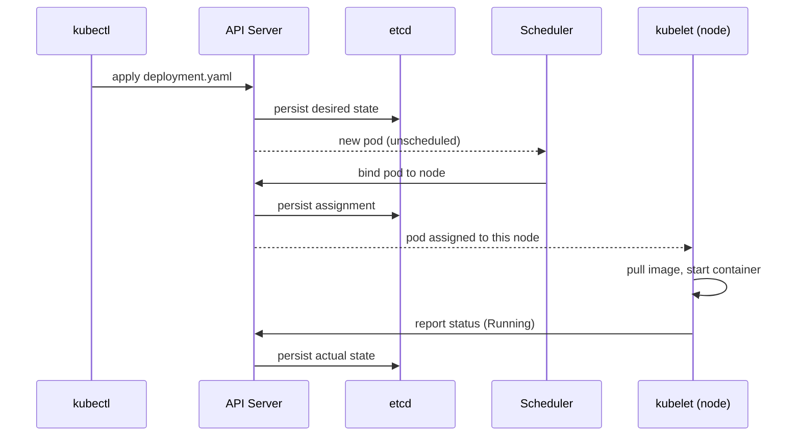
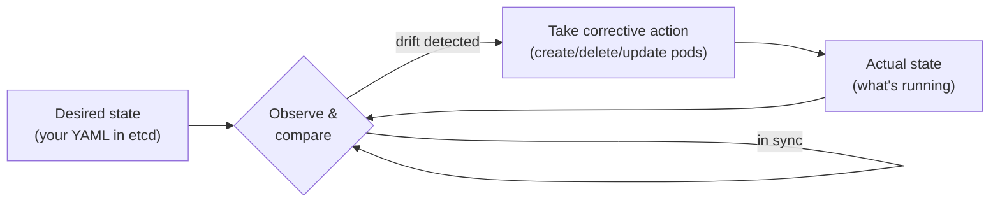

<div class="hero-section" style="background: linear-gradient(135deg, #326ce5 0%, #54a3ff 100%); color: white; padding: 3rem 2rem; margin: -2rem -3rem 2rem -3rem; text-align: center;">
  <h1 style="color: white; margin: 0; font-size: 2.5rem;">Kubernetes: Fundamentals</h1>
  <p style="font-size: 1.25rem; margin-top: 1rem; opacity: 0.9;">Part I — Architecture &amp; core objects: the control plane and nodes, Pods, ReplicaSets, Deployments, Services, Namespaces, and labels.</p>
</div>

[Kubernetes](./) &raquo; Fundamentals

This is **Part I** of the Kubernetes Fundamentals. It covers the architecture (control plane and worker nodes) and the core objects you create every day — Pods, ReplicaSets, Deployments, Services, Namespaces — plus the labels and selectors that wire them together. It opens with a hands-on quick start so you can see the system work before meeting the abstractions.

Two companion pages continue the fundamentals once you can deploy a Pod:

- **[Networking &amp; Configuration](fundamentals-networking.html)** — how Services route traffic in depth, Ingress, NetworkPolicies, and how to inject configuration with ConfigMaps and Secrets.
- **[Health &amp; Resource Management](fundamentals-resources.html)** — liveness/readiness/startup probes, CPU/memory requests and limits, QoS classes, and autoscaling.

## Getting Started with Kubernetes

Before diving into commands and configurations, it helps to understand what Kubernetes actually does. Think of it as a distributed operating system: just as your laptop's OS manages programs, memory, and files on a single machine, Kubernetes manages containers, resources, and storage across many machines.

**Why does this matter?** When you run `kubectl apply -f myapp.yaml`, you are not just starting a container. You are telling Kubernetes: "Here is what I want my application to look like. Make it happen and keep it that way." Kubernetes then handles container placement, networking, restarts, and scaling automatically.

This page walks you through the fundamentals in the order that actually builds understanding: deploy something first, then learn the core vocabulary, then study each object in depth.

## Quick Start Guide

The fastest way to understand Kubernetes is to use it. This section gets you deploying an application in minutes — the concepts behind every command follow in the sections after.

### Requirements
- Container technology knowledge (Docker)
- Kubernetes cluster access (minikube, kind, k3s, or cloud provider)
- kubectl CLI v1.28+ installed
- Optional: Helm 3.x for package management

### Your First Deployment

Let us deploy a web server and see Kubernetes in action:

```bash
# Deploy nginx and expose it
kubectl create deployment hello-world --image=nginx:alpine
kubectl expose deployment hello-world --type=LoadBalancer --port=80

# Verify it is running
kubectl get pods
kubectl get services
```

> **Note:** `--type=LoadBalancer` provisions an external IP only on a cloud provider. On a local cluster (minikube, kind, k3s) the service stays `<pending>` — run `minikube tunnel`, or use `--type=NodePort` instead.

Now try the self-healing feature that makes Kubernetes valuable:

```bash
# Scale to 3 replicas and delete one pod
kubectl scale deployment hello-world --replicas=3
kubectl delete pod <pod-name>
kubectl get pods  # A new pod automatically replaces the deleted one
```

That replacement pod is not magic — it is the **reconciliation loop** at work, a concept we unpack under [Core Concepts](#core-concepts). Clean up when done:

```bash
kubectl delete deployment hello-world
kubectl delete service hello-world
```

### Core Concepts at a Glance

Before going deeper, here is how the key pieces fit together:

| Concept | What It Is | Analogy |
|---------|------------|---------|
| **Pod** | Smallest deployable unit; wraps one or more containers | An apartment unit in a building |
| **ReplicaSet** | Keeps a fixed number of identical Pods running | The leasing office tracking how many units must stay occupied |
| **Deployment** | Manages ReplicaSets and rolls out updates | A property manager scheduling renovations unit by unit |
| **Service** | Stable network address for a set of Pods | The building's front desk that routes visitors |
| **Node** | A machine (physical or virtual) running pods | An apartment building |
| **Cluster** | A group of nodes managed together | The entire apartment complex |

**The key insight**: You rarely work with pods directly. Instead, you tell a Deployment "I want 3 copies of my app" and it creates a ReplicaSet, which creates and manages the pods for you. Services then route traffic to those pods, regardless of which nodes they run on.

The rest of this page explores each concept in depth, showing you how to build production-ready systems.

## Understanding Kubernetes: From Containers to Orchestration

Consider the following evolution in how we run applications:

| Era | Approach | Trade-off |
|-----|----------|-----------|
| **Bare Metal** | One application per server | Wasted resources; most servers idle |
| **Virtual Machines** | Multiple VMs per server | Better utilization but heavy overhead |
| **Containers** | Many containers per server | Lightweight but manual management at scale |
| **Orchestration** | Kubernetes manages containers | Automated, scalable, self-healing |

Each step solved the previous era's problems while creating new challenges. Containers solved VM overhead but introduced complexity: How do you run hundreds of containers across dozens of servers? How do you ensure they stay healthy? How do you update them without downtime?

Kubernetes answers these questions with a declarative approach and automated operations.

### What Kubernetes Provides

Rather than listing features, consider what problems each capability solves:

| Challenge | Kubernetes Solution | Benefit |
|-----------|---------------------|---------|
| "My container crashed" | Self-healing | Automatic restart and replacement |
| "How do services find each other?" | Service discovery | Built-in DNS and load balancing |
| "I need to deploy without downtime" | Rolling updates | Gradual replacement of old pods |
| "Traffic is spiking" | Horizontal scaling | Add replicas automatically or manually |
| "I need to store passwords securely" | Secrets | Encrypted storage with access controls |
| "Different apps need different storage" | Storage classes | Abstract storage provisioning |

## Core Concepts

Now that you understand why Kubernetes exists, let us explore how it works. The architecture consists of two main parts: the **control plane** that makes decisions and the **worker nodes** that run your applications.

**Consider the following**: When you run `kubectl apply -f deployment.yaml`, your request travels through several components. The API Server receives it, stores the desired state in etcd, the Scheduler decides which node should run the pods, and the Controller Manager ensures reality matches your specification. Understanding this flow helps you troubleshoot when things go wrong.

<div class="architecture-section">
  <h3><i class="fas fa-sitemap"></i> Architecture Overview</h3>
  <p>Kubernetes follows a master-worker architecture. The control plane manages the cluster while worker nodes run your applications.</p>
  
  <div class="architecture-visual">
    <svg viewBox="0 0 700 400" class="k8s-architecture">
      <!-- Control Plane -->
      <rect x="50" y="50" width="600" height="120" fill="#3498db" opacity="0.1" stroke="#3498db" stroke-width="2" />
      <text x="350" y="30" text-anchor="middle" font-size="16" font-weight="bold">Control Plane</text>
      
      <!-- API Server -->
      <rect x="70" y="70" width="100" height="80" fill="#e74c3c" opacity="0.5" stroke="#c0392b" stroke-width="2" />
      <text x="120" y="105" text-anchor="middle" font-size="11" fill="white">API Server</text>
      <text x="120" y="120" text-anchor="middle" font-size="9" fill="white">Gateway</text>
      
      <!-- etcd -->
      <rect x="190" y="70" width="100" height="80" fill="#27ae60" opacity="0.5" stroke="#229954" stroke-width="2" />
      <text x="240" y="105" text-anchor="middle" font-size="11" fill="white">etcd</text>
      <text x="240" y="120" text-anchor="middle" font-size="9" fill="white">State Store</text>
      
      <!-- Scheduler -->
      <rect x="310" y="70" width="100" height="80" fill="#f39c12" opacity="0.5" stroke="#d68910" stroke-width="2" />
      <text x="360" y="105" text-anchor="middle" font-size="11" fill="white">Scheduler</text>
      <text x="360" y="120" text-anchor="middle" font-size="9" fill="white">Pod Placement</text>
      
      <!-- Controller Manager -->
      <rect x="430" y="70" width="100" height="80" fill="#9b59b6" opacity="0.5" stroke="#7d3c98" stroke-width="2" />
      <text x="480" y="100" text-anchor="middle" font-size="11" fill="white">Controller</text>
      <text x="480" y="115" text-anchor="middle" font-size="11" fill="white">Manager</text>
      <text x="480" y="130" text-anchor="middle" font-size="9" fill="white">Controllers</text>
      
      <!-- Cloud Controller -->
      <rect x="550" y="70" width="80" height="80" fill="#1abc9c" opacity="0.5" stroke="#16a085" stroke-width="2" />
      <text x="590" y="100" text-anchor="middle" font-size="10" fill="white">Cloud</text>
      <text x="590" y="115" text-anchor="middle" font-size="10" fill="white">Controller</text>
      <text x="590" y="130" text-anchor="middle" font-size="9" fill="white">Manager</text>
      
      <!-- Worker Nodes -->
      <text x="350" y="210" text-anchor="middle" font-size="16" font-weight="bold">Worker Nodes</text>
      
      <!-- Node 1 -->
      <rect x="50" y="230" width="180" height="150" fill="#95a5a6" opacity="0.1" stroke="#7f8c8d" stroke-width="2" />
      <text x="140" y="250" text-anchor="middle" font-size="12">Node 1</text>
      
      <!-- kubelet -->
      <rect x="60" y="260" width="70" height="40" fill="#3498db" opacity="0.5" />
      <text x="95" y="285" text-anchor="middle" font-size="10" fill="white">kubelet</text>
      
      <!-- kube-proxy -->
      <rect x="150" y="260" width="70" height="40" fill="#e74c3c" opacity="0.5" />
      <text x="185" y="285" text-anchor="middle" font-size="10" fill="white">kube-proxy</text>
      
      <!-- Container runtime -->
      <rect x="60" y="310" width="160" height="40" fill="#27ae60" opacity="0.5" />
      <text x="140" y="335" text-anchor="middle" font-size="10" fill="white">Container Runtime</text>
      
      <!-- Pods -->
      <circle cx="90" cy="365" r="12" fill="#f39c12" />
      <circle cx="140" cy="365" r="12" fill="#f39c12" />
      <circle cx="190" cy="365" r="12" fill="#f39c12" />
      <text x="140" y="370" text-anchor="middle" font-size="9">Pods</text>
      
      <!-- Node 2 -->
      <rect x="260" y="230" width="180" height="150" fill="#95a5a6" opacity="0.1" stroke="#7f8c8d" stroke-width="2" />
      <text x="350" y="250" text-anchor="middle" font-size="12">Node 2</text>
      
      <!-- Node 3 -->
      <rect x="470" y="230" width="180" height="150" fill="#95a5a6" opacity="0.1" stroke="#7f8c8d" stroke-width="2" />
      <text x="560" y="250" text-anchor="middle" font-size="12">Node 3</text>
      
      <!-- Communication lines -->
      <path d="M 120 150 L 140 230" stroke="#2c3e50" stroke-width="1" stroke-dasharray="3,3" />
      <path d="M 360 150 L 350 230" stroke="#2c3e50" stroke-width="1" stroke-dasharray="3,3" />
      <path d="M 480 150 L 560 230" stroke="#2c3e50" stroke-width="1" stroke-dasharray="3,3" />
    </svg>
  </div>
  
  <div class="component-details">
    <div class="component-group control-plane">
      <h4><i class="fas fa-server"></i> Control Plane Components</h4>
      <div class="component-list">
        <div class="component-item">
          <i class="fas fa-plug"></i>
          <strong>API Server:</strong> Central management point, exposes Kubernetes API
        </div>
        <div class="component-item">
          <i class="fas fa-database"></i>
          <strong>etcd:</strong> Distributed key-value store for cluster state
        </div>
        <div class="component-item">
          <i class="fas fa-calendar-alt"></i>
          <strong>Scheduler:</strong> Assigns pods to nodes based on resource requirements
        </div>
        <div class="component-item">
          <i class="fas fa-cogs"></i>
          <strong>Controller Manager:</strong> Runs controller processes
        </div>
        <div class="component-item">
          <i class="fas fa-cloud"></i>
          <strong>Cloud Controller Manager:</strong> Integrates with cloud provider APIs
        </div>
      </div>
    </div>
    
    <div class="component-group node-components">
      <h4><i class="fas fa-microchip"></i> Node Components</h4>
      <div class="component-list">
        <div class="component-item">
          <i class="fas fa-heartbeat"></i>
          <strong>kubelet:</strong> Ensures containers are running in pods
        </div>
        <div class="component-item">
          <i class="fas fa-network-wired"></i>
          <strong>kube-proxy:</strong> Maintains network rules for pod communication
        </div>
        <div class="component-item">
          <i class="fas fa-box"></i>
          <strong>Container Runtime:</strong> Docker, containerd, or CRI-O
        </div>
      </div>
    </div>
  </div>
</div>

### The Control Plane in Detail

The control plane is the brain of the cluster. It does not run your application containers (on a managed service it is hidden from you entirely); instead it makes every global decision about the cluster and exposes the API you talk to.

| Component | Responsibility | Failure impact |
|-----------|----------------|----------------|
| **kube-apiserver** | The only component that reads/writes etcd. Validates every request, enforces authentication/authorization, and is the hub every other component watches. | The cluster becomes read-only to operators; running pods keep running, but nothing new can be scheduled or changed. |
| **etcd** | Consistent, distributed key-value store holding the entire desired and observed state. The single source of truth. | Loss of etcd without a backup means loss of the cluster's state. Always back it up. |
| **kube-scheduler** | Watches for unscheduled pods and binds each to the best-fit node based on resource requests, affinity, taints, and constraints. | New pods stay `Pending`; existing pods are unaffected. |
| **kube-controller-manager** | Runs the built-in controllers (Deployment, ReplicaSet, Node, Job, endpoints, and more), each running a reconciliation loop. | Self-healing stalls — failed pods are not replaced, rollouts freeze. |
| **cloud-controller-manager** | Talks to the cloud provider for nodes, load balancers, and routes. Absent on bare-metal clusters. | Cloud-backed Services and node lifecycle integration stop updating. |

A production control plane runs these components redundantly (typically three or five etcd members for quorum) so the loss of a single node does not take down the cluster.

### Worker Nodes in Detail

A **node** is a machine — a VM or physical server — that runs your pods. Every node runs three pieces of software that the control plane drives:

- **kubelet** — the node agent. It watches the API server for pods assigned to its node, instructs the container runtime to pull images and start containers, and continuously reports pod and node status back. It also runs the health probes (covered in [Health &amp; Resource Management](fundamentals-resources.html)).
- **kube-proxy** — programs the node's networking (iptables or IPVS rules, or eBPF with some CNIs) so that traffic to a Service's virtual IP is load-balanced to the backing pods. Service mechanics are covered in [Networking &amp; Configuration](fundamentals-networking.html).
- **Container runtime** — the software that actually runs containers: containerd or CRI-O (Docker's runtime was removed as a direct integration in v1.24). The kubelet talks to it through the Container Runtime Interface (CRI).

Inspect nodes with:

```bash
kubectl get nodes -o wide        # IPs, OS image, kernel, runtime
kubectl describe node <node>     # capacity, allocatable, conditions, pods
```

The **conditions** in `describe node` (`Ready`, `MemoryPressure`, `DiskPressure`, `PIDPressure`) are how the node reports its health; the kubelet renews a heartbeat lease so the control plane can detect a node that has gone offline and reschedule its pods elsewhere.

### What Happens When You Apply a Manifest

The diagram below traces a single `kubectl apply` through the control plane. Notice that the components never talk to each other directly — they all watch the API server, which is the single source of truth backed by etcd. This "level-triggered" design is what makes Kubernetes self-healing: controllers continuously reconcile actual state toward desired state.



### The Reconciliation Loop

The single most important idea in Kubernetes is the **control loop** (or reconciliation loop). Every controller runs the same endless cycle: observe the current state, compare it to the desired state recorded in etcd, and take action to close the gap. There is no one-shot "deploy" step — the system is *continuously* driven toward your declared intent, which is precisely why a deleted pod reappears and a crashed container restarts.



This is a **level-triggered** design (it reacts to the current level of state) rather than **edge-triggered** (reacting to one-time events). If a controller misses an event, it simply re-observes reality on its next pass and still converges — making Kubernetes robust to restarts, network blips, and lost messages.

## Kubernetes Objects: The Building Blocks

With the architecture understood, let us explore the objects you will work with daily. Each object type solves a specific problem, and choosing the right one depends on your application's needs.

**When to use each object type**:

| Object | Use Case | Example |
|--------|----------|---------|
| **Pod** | Rarely used directly; foundation for other objects | Testing, debugging |
| **ReplicaSet** | Keeps N identical pods running; usually managed by a Deployment | Created for you by Deployments |
| **Deployment** | Stateless applications that can scale horizontally | Web servers, APIs |
| **StatefulSet** | Stateful applications needing stable identity | Databases, message queues |
| **DaemonSet** | Run one pod per node | Log collectors, monitoring agents |
| **Job / CronJob** | Run-to-completion or scheduled tasks | Migrations, batch processing, backups |

This page covers the foundation — Pods, ReplicaSets, and Deployments. The specialized controllers (StatefulSet, DaemonSet, Job, CronJob) and persistent storage are covered in [Workloads &amp; Storage](workloads.html).

Every Kubernetes object shares the same four top-level fields, worth recognizing before reading any manifest:

- **`apiVersion`** — which API group and version defines this object (`v1`, `apps/v1`, `batch/v1`, ...).
- **`kind`** — the object type (`Pod`, `Deployment`, `Service`, ...).
- **`metadata`** — name, namespace, labels, and annotations.
- **`spec`** — your *desired* state. Kubernetes fills in a `status` field with the *observed* state; the controllers' job is to make `status` match `spec`.

### Pods

<div class="k8s-objects-section">
  <div class="object-card pod-object">
    <div class="object-header">
      <i class="fas fa-cube"></i>
      <h4>Pods</h4>
    </div>
    <p class="object-desc">The smallest deployable unit in Kubernetes:</p>
    
    <div class="object-visual">
      <svg viewBox="0 0 300 150">
        <!-- Pod outline -->
        <rect x="50" y="30" width="200" height="90" rx="10" fill="#3498db" opacity="0.2" stroke="#3498db" stroke-width="2" />
        <text x="150" y="20" text-anchor="middle" font-size="12" font-weight="bold">Pod</text>
        
        <!-- Containers inside pod -->
        <rect x="70" y="50" width="70" height="50" fill="#e74c3c" opacity="0.5" rx="5" />
        <text x="105" y="80" text-anchor="middle" font-size="10" fill="white">Container 1</text>
        
        <rect x="160" y="50" width="70" height="50" fill="#27ae60" opacity="0.5" rx="5" />
        <text x="195" y="80" text-anchor="middle" font-size="10" fill="white">Container 2</text>
        
        <!-- Shared resources -->
        <text x="150" y="130" text-anchor="middle" font-size="9">Shared Network & Storage</text>
      </svg>
    </div>
    
    <div class="code-example">
      <div class="code-header">Pod Definition</div>
      <pre><code class="language-yaml">apiVersion: v1
kind: Pod
metadata:
  name: nginx-pod
  labels:
    app: nginx
spec:
  containers:
  - name: nginx
    image: nginx:1.21
    ports:
    - containerPort: 80</code></pre>
    </div>
    
    <div class="key-features">
      <h5>Key Features:</h5>
      <div class="feature-grid">
        <div class="feature-item">
          <i class="fas fa-layer-group"></i>
          <span>One or more containers</span>
        </div>
        <div class="feature-item">
          <i class="fas fa-share-alt"></i>
          <span>Shared network and storage</span>
        </div>
        <div class="feature-item">
          <i class="fas fa-hourglass-half"></i>
          <span>Ephemeral by design</span>
        </div>
        <div class="feature-item">
          <i class="fas fa-fingerprint"></i>
          <span>Unique IP address</span>
        </div>
      </div>
    </div>
  </div>
</div>

A **Pod** is the smallest thing Kubernetes schedules. It is not a single container — it is a wrapper around one *or more* tightly coupled containers that share:

- a **network namespace** — every container in the pod shares one IP address and port space, so they reach each other over `localhost`;
- **storage volumes** — mounted into any container in the pod that asks for them;
- a **lifecycle** — they are scheduled, started, and stopped together on the same node.

Most pods hold exactly one container. The multi-container pattern is reserved for **helpers** that must live beside the main process: a **sidecar** (for example a log shipper or a service-mesh proxy) and an **init container** that runs to completion *before* the main containers start (covered with the operational patterns in [Operations](operations.html)).

**Pods are ephemeral.** This is the most important thing to internalize. A pod is never healed in place — if its node dies, the pod is gone for good and a *new* pod with a *new* name and *new* IP is created elsewhere. That is why you almost never create a bare `Pod` in production: nothing would recreate it. Instead you let a controller own it.

```bash
kubectl get pods -o wide              # which node, which IP
kubectl describe pod <name>           # events, why it is Pending/CrashLooping
kubectl logs <name> [-c <container>]  # container stdout/stderr
kubectl exec -it <name> -- sh         # shell inside the container
```

### ReplicaSets

A **ReplicaSet** is the controller whose single job is to keep a specified number of identical pod replicas running at all times. It watches the pods matching its label selector and, whenever the count drifts from the desired `replicas`, creates or deletes pods to correct it — the reconciliation loop applied to pod count.

```yaml
apiVersion: apps/v1
kind: ReplicaSet
metadata:
  name: nginx-rs
spec:
  replicas: 3
  selector:
    matchLabels:
      app: nginx
  template:               # the pod spec the ReplicaSet stamps out
    metadata:
      labels:
        app: nginx        # MUST satisfy the selector above
    spec:
      containers:
      - name: nginx
        image: nginx:1.21
```

Note the structure that repeats across every workload controller: a **`selector`** that says which pods this controller owns, and a **`template`** that is the pod spec it creates. The template's labels must satisfy the selector, or the API server rejects the object.

**You almost never write a ReplicaSet directly.** It cannot perform a controlled, versioned rollout — if you change the image in a ReplicaSet's template, existing pods are *not* updated. That gap is exactly what a Deployment fills. ReplicaSets matter because every Deployment creates and manages them on your behalf, and you will see them in `kubectl get rs` when you debug a rollout.

### Deployments

<div class="k8s-objects-section">
  <div class="object-card deployment-object">
    <div class="object-header">
      <i class="fas fa-rocket"></i>
      <h4>Deployments</h4>
    </div>
    <p class="object-desc">Manages replica sets and provides declarative updates:</p>
    
    <div class="object-visual">
      <svg viewBox="0 0 400 200">
        <!-- Deployment controller -->
        <rect x="150" y="20" width="100" height="40" fill="#9b59b6" opacity="0.5" stroke="#8e44ad" stroke-width="2" />
        <text x="200" y="45" text-anchor="middle" font-size="11" fill="white">Deployment</text>
        
        <!-- ReplicaSet -->
        <rect x="125" y="80" width="150" height="40" fill="#3498db" opacity="0.3" stroke="#2980b9" stroke-width="2" />
        <text x="200" y="105" text-anchor="middle" font-size="10">ReplicaSet</text>
        
        <!-- Pods -->
        <circle cx="120" cy="160" r="20" fill="#e74c3c" opacity="0.5" />
        <text x="120" y="165" text-anchor="middle" font-size="9" fill="white">Pod</text>
        
        <circle cx="200" cy="160" r="20" fill="#e74c3c" opacity="0.5" />
        <text x="200" y="165" text-anchor="middle" font-size="9" fill="white">Pod</text>
        
        <circle cx="280" cy="160" r="20" fill="#e74c3c" opacity="0.5" />
        <text x="280" y="165" text-anchor="middle" font-size="9" fill="white">Pod</text>
        
        <!-- Arrows -->
        <path d="M 200 60 L 200 75" stroke="#2c3e50" stroke-width="2" marker-end="url(#arrow)" />
        <path d="M 150 120 L 120 135" stroke="#2c3e50" stroke-width="2" marker-end="url(#arrow)" />
        <path d="M 200 120 L 200 135" stroke="#2c3e50" stroke-width="2" marker-end="url(#arrow)" />
        <path d="M 250 120 L 280 135" stroke="#2c3e50" stroke-width="2" marker-end="url(#arrow)" />
        
        <text x="330" y="105" font-size="10">Replicas: 3</text>
      </svg>
    </div>
    
    <div class="code-example">
      <div class="code-header">Deployment Definition</div>
      <pre><code class="language-yaml">apiVersion: apps/v1
kind: Deployment
metadata:
  name: nginx-deployment
spec:
  replicas: 3
  selector:
    matchLabels:
      app: nginx
  template:
    metadata:
      labels:
        app: nginx
    spec:
      containers:
      - name: nginx
        image: nginx:1.21
        ports:
        - containerPort: 80</code></pre>
    </div>
    
    <div class="deployment-features">
      <h5>Features:</h5>
      <div class="feature-cards">
        <div class="feature-card">
          <i class="fas fa-sync-alt"></i>
          <h6>Rolling Updates</h6>
          <p>Zero-downtime deployments</p>
        </div>
        <div class="feature-card">
          <i class="fas fa-undo"></i>
          <h6>Rollback</h6>
          <p>Revert to previous versions</p>
        </div>
        <div class="feature-card">
          <i class="fas fa-expand-arrows-alt"></i>
          <h6>Scaling</h6>
          <p>Adjust replica count</p>
        </div>
        <div class="feature-card">
          <i class="fas fa-heartbeat"></i>
          <h6>Self-healing</h6>
          <p>Automatic pod recovery</p>
        </div>
      </div>
    </div>
  </div>
</div>

A **Deployment** is the object you reach for to run a stateless application. It sits one level above the ReplicaSet and adds the thing a bare ReplicaSet lacks: **versioned, controlled rollouts**. The ownership chain is:

```
Deployment  ──owns──►  ReplicaSet  ──owns──►  Pods
```

When you change the pod template (typically the image tag), the Deployment does **not** mutate the running pods. Instead it creates a *new* ReplicaSet for the new template and gradually shifts replicas from the old ReplicaSet to the new one — a **rolling update**. The pace is governed by two knobs:

- **`maxUnavailable`** — how many pods may be down at once during the rollout.
- **`maxSurge`** — how many *extra* pods may be created above the desired count.

```yaml
spec:
  strategy:
    type: RollingUpdate
    rollingUpdate:
      maxUnavailable: 1
      maxSurge: 1
```

Because the old ReplicaSet is kept (scaled to zero, not deleted), a **rollback** is just a matter of scaling the previous ReplicaSet back up — which `kubectl` does for you:

```bash
# Trigger a rollout by changing the image
kubectl set image deployment/nginx-deployment nginx=nginx:1.25

kubectl rollout status deployment/nginx-deployment   # watch it progress
kubectl rollout history deployment/nginx-deployment  # list revisions
kubectl rollout undo deployment/nginx-deployment     # roll back one revision

kubectl scale deployment/nginx-deployment --replicas=5
```

This is also the source of the self-healing you saw in the quick start: the Deployment's ReplicaSet notices a missing pod and recreates it, every time, without any intervention.

### Services (Overview)

<div class="k8s-objects-section">
  <div class="object-card service-object">
    <div class="object-header">
      <i class="fas fa-network-wired"></i>
      <h4>Services</h4>
    </div>
    <p class="object-desc">Provides stable network endpoint for pods:</p>
    
    <div class="service-types-visual">
      <h5>Service Types</h5>
      <div class="service-type-grid">
        <div class="service-type clusterip">
          <svg viewBox="0 0 150 120">
            <rect x="30" y="30" width="90" height="60" fill="#3498db" opacity="0.2" stroke="#3498db" stroke-width="2" />
            <text x="75" y="20" text-anchor="middle" font-size="10" font-weight="bold">ClusterIP</text>
            <circle cx="50" cy="60" r="8" fill="#e74c3c" />
            <circle cx="75" cy="60" r="8" fill="#e74c3c" />
            <circle cx="100" cy="60" r="8" fill="#e74c3c" />
            <text x="75" y="105" text-anchor="middle" font-size="9">Internal Only</text>
          </svg>
        </div>
        
        <div class="service-type nodeport">
          <svg viewBox="0 0 150 120">
            <rect x="30" y="30" width="90" height="60" fill="#27ae60" opacity="0.2" stroke="#27ae60" stroke-width="2" />
            <text x="75" y="20" text-anchor="middle" font-size="10" font-weight="bold">NodePort</text>
            <circle cx="75" cy="60" r="8" fill="#e74c3c" />
            <line x1="75" y1="52" x2="75" y2="10" stroke="#2c3e50" stroke-width="2" marker-end="url(#arrow)" />
            <text x="75" y="105" text-anchor="middle" font-size="9">Node IP:Port</text>
          </svg>
        </div>
        
        <div class="service-type loadbalancer">
          <svg viewBox="0 0 150 120">
            <ellipse cx="75" cy="15" rx="40" ry="10" fill="#f39c12" opacity="0.3" />
            <text x="75" y="18" text-anchor="middle" font-size="9">LB</text>
            <rect x="30" y="40" width="90" height="50" fill="#f39c12" opacity="0.2" stroke="#f39c12" stroke-width="2" />
            <text x="75" y="35" text-anchor="middle" font-size="10" font-weight="bold">LoadBalancer</text>
            <circle cx="75" cy="65" r="8" fill="#e74c3c" />
            <text x="75" y="105" text-anchor="middle" font-size="9">External LB</text>
          </svg>
        </div>
        
        <div class="service-type externalname">
          <svg viewBox="0 0 150 120">
            <rect x="30" y="30" width="90" height="60" fill="#9b59b6" opacity="0.2" stroke="#9b59b6" stroke-width="2" />
            <text x="75" y="20" text-anchor="middle" font-size="10" font-weight="bold">ExternalName</text>
            <text x="75" y="60" text-anchor="middle" font-size="16">DNS</text>
            <text x="75" y="105" text-anchor="middle" font-size="9">Maps to DNS</text>
          </svg>
        </div>
      </div>
    </div>
    
    <div class="code-example">
      <div class="code-header">Service Definition</div>
      <pre><code class="language-yaml">apiVersion: v1
kind: Service
metadata:
  name: nginx-service
spec:
  selector:
    app: nginx
  ports:
  - port: 80
    targetPort: 80
  type: LoadBalancer</code></pre>
    </div>
  </div>
</div>

Pods are ephemeral and their IPs change every time they are rescheduled, so you can never hand a pod IP to a client. A **Service** solves this by giving a *stable* virtual IP and DNS name that fronts a *changing* set of pods. The Service finds its backing pods the same way every controller does — by **label selector** — and load-balances across whichever pods currently match.

The four Service types differ only in *how far* that stable endpoint reaches:

| Service Type | Accessible From | Use Case | Cost |
|--------------|-----------------|----------|------|
| **ClusterIP** | Inside cluster only | Internal microservices | Free |
| **NodePort** | Node IP + port (30000-32767) | Development, testing | Free |
| **LoadBalancer** | External IP via cloud LB | Production web apps | Cloud provider charges |
| **ExternalName** | DNS alias | Accessing external services | Free |

**When to use each**: Start with ClusterIP for internal services. Use LoadBalancer for production internet-facing services. NodePort is useful for development but rarely appropriate for production due to port limitations.

This is the *overview*. How kube-proxy programs the routing, how DNS-based service discovery works, how Ingress fans one external IP out to many Services, and how NetworkPolicies restrict pod-to-pod traffic are all covered in depth in **[Networking &amp; Configuration](fundamentals-networking.html)**. Configuration injection with ConfigMaps and Secrets lives on that page as well.

### Namespaces

<div class="k8s-objects-section">
  <div class="object-card namespace-object">
    <div class="object-header">
      <i class="fas fa-folder"></i>
      <h4>Namespaces</h4>
    </div>
    <p class="object-desc">Logical isolation within a cluster:</p>
    
    <div class="namespace-visual">
      <svg viewBox="0 0 400 250">
        <!-- Cluster boundary -->
        <rect x="20" y="20" width="360" height="210" fill="none" stroke="#2c3e50" stroke-width="2" stroke-dasharray="5,5" />
        <text x="200" y="15" text-anchor="middle" font-size="12" font-weight="bold">Kubernetes Cluster</text>
        
        <!-- Default namespace -->
        <rect x="40" y="40" width="150" height="80" fill="#3498db" opacity="0.2" stroke="#3498db" stroke-width="2" />
        <text x="115" y="60" text-anchor="middle" font-size="11" font-weight="bold">default</text>
        <circle cx="70" cy="90" r="8" fill="#e74c3c" />
        <circle cx="100" cy="90" r="8" fill="#e74c3c" />
        <circle cx="130" cy="90" r="8" fill="#e74c3c" />
        <text x="100" y="110" text-anchor="middle" font-size="9">User Apps</text>
        
        <!-- kube-system namespace -->
        <rect x="210" y="40" width="150" height="80" fill="#e74c3c" opacity="0.2" stroke="#e74c3c" stroke-width="2" />
        <text x="285" y="60" text-anchor="middle" font-size="11" font-weight="bold">kube-system</text>
        <rect x="234" y="79" width="12" height="12" fill="#c0392b" />
        <rect x="264" y="79" width="12" height="12" fill="#c0392b" />
        <rect x="294" y="79" width="12" height="12" fill="#c0392b" />
        <text x="270" y="110" text-anchor="middle" font-size="9">System Pods</text>
        
        <!-- Development namespace -->
        <rect x="40" y="140" width="150" height="70" fill="#27ae60" opacity="0.2" stroke="#27ae60" stroke-width="2" />
        <text x="115" y="160" text-anchor="middle" font-size="11" font-weight="bold">development</text>
        <circle cx="70" cy="185" r="8" fill="#229954" />
        <circle cx="100" cy="185" r="8" fill="#229954" />
        <text x="85" y="205" text-anchor="middle" font-size="9">Dev Apps</text>
        
        <!-- Production namespace -->
        <rect x="210" y="140" width="150" height="70" fill="#f39c12" opacity="0.2" stroke="#f39c12" stroke-width="2" />
        <text x="285" y="160" text-anchor="middle" font-size="11" font-weight="bold">production</text>
        <circle cx="240" cy="185" r="8" fill="#d68910" />
        <circle cx="270" cy="185" r="8" fill="#d68910" />
        <text x="255" y="205" text-anchor="middle" font-size="9">Prod Apps</text>
      </svg>
    </div>
    
    <div class="code-example">
      <div class="code-header">Namespace Definition</div>
      <pre><code class="language-yaml">apiVersion: v1
kind: Namespace
metadata:
  name: development</code></pre>
    </div>
    
    <div class="default-namespaces">
      <h5>Default Namespaces:</h5>
      <div class="namespace-list">
        <div class="namespace-item">
          <code>default</code>
          <span>Default namespace for objects</span>
        </div>
        <div class="namespace-item">
          <code>kube-system</code>
          <span>Kubernetes system objects</span>
        </div>
        <div class="namespace-item">
          <code>kube-public</code>
          <span>Publicly accessible data</span>
        </div>
        <div class="namespace-item">
          <code>kube-node-lease</code>
          <span>Node heartbeat data</span>
        </div>
      </div>
    </div>
  </div>
</div>

A **Namespace** is a virtual cluster inside a physical one — a way to partition objects so that names, quotas, and access controls do not collide. Two teams can both have a `Deployment` named `web` as long as they live in different namespaces.

Namespaces are the natural boundary for several other features:

- **DNS** — a Service is reachable as `<service>.<namespace>.svc.cluster.local`; within the same namespace you can use the short `<service>` name.
- **ResourceQuotas** cap total CPU/memory/object counts per namespace.
- **RBAC** (covered in [Networking &amp; Configuration](fundamentals-networking.html)) grants permissions scoped to a namespace.

Note that namespaces are *not* a hard security boundary by themselves — pods in different namespaces can still reach each other over the flat pod network unless a NetworkPolicy says otherwise.

```bash
kubectl get namespaces
kubectl get pods -n kube-system          # target a namespace with -n
kubectl get pods --all-namespaces        # everything, everywhere
kubectl config set-context --current --namespace=development   # set a default
```

A handful of namespaces exist on every cluster: `default` (where your objects land if you do not specify one), `kube-system` (the control-plane and node add-on pods), `kube-public` (world-readable cluster info), and `kube-node-lease` (node heartbeat leases).

## Labels and Selectors: The Glue

Almost every relationship in Kubernetes is expressed through **labels** — arbitrary key/value pairs attached to objects — and **selectors** that query them. A Deployment finds its pods by selector. A Service finds its endpoints by selector. NetworkPolicies, node affinity, and `kubectl` filters all work the same way. Labels are the loose coupling that lets these objects find each other without hard references.

```yaml
metadata:
  labels:
    app: storefront        # which application
    tier: backend          # role within the app
    environment: production
    version: v2.3.1
```

A selector matches a subset of those labels. There are two flavors:

```yaml
# Equality-based (used by Service spec.selector)
selector:
  app: storefront
  tier: backend

# Set-based (used by Deployment/ReplicaSet spec.selector.matchExpressions)
selector:
  matchLabels:
    app: storefront
  matchExpressions:
  - key: environment
    operator: In
    values: [production, staging]
```

The same selector syntax drives the CLI, which is how you slice and dice a live cluster:

```bash
kubectl get pods -l app=storefront,tier=backend   # AND of two labels
kubectl get pods -l 'environment in (production, staging)'
kubectl get pods -l '!canary'                      # pods without a canary label
kubectl label pod nginx-pod tier=frontend --overwrite
```

**Why this matters in practice**: the single most common reason a Service has no endpoints — traffic silently black-holes — is a mismatch between the Service's `selector` and the pods' `labels`. When something is not receiving traffic, compare the two first:

```bash
kubectl get endpoints <service-name>     # empty list == selector mismatch
kubectl get pods --show-labels
```

> **Annotations vs labels**: labels are for *identifying and selecting* objects and are indexed for queries. **Annotations** are also key/value metadata, but they are for arbitrary non-identifying information (build IDs, change-cause, tool configuration) and cannot be used in selectors.

## Common Pitfalls

<div class="notice--warning">
  <h4>Common Pitfalls</h4>
  <ul>
    <li><strong>Managing pods directly:</strong> Never create bare pods in production. Use a Deployment (or StatefulSet) so failed pods are recreated automatically.</li>
    <li><strong>Mismatched labels:</strong> A Service routes to pods by label selector. If the selector and pod labels disagree, the Service has zero endpoints and silently drops traffic.</li>
    <li><strong>Editing a ReplicaSet directly:</strong> Changes to a ReplicaSet's template do not roll out to existing pods. Always drive changes through the owning Deployment.</li>
    <li><strong>Immutable selectors:</strong> A Deployment's <code>spec.selector</code> cannot be changed after creation. Plan your labels before you apply.</li>
  </ul>
</div>

## Key Takeaways

<div class="takeaway-grid">
  <div class="takeaway-card">
    <h4>Declarative, Not Imperative</h4>
    <p>You describe desired state; controllers continuously reconcile reality toward it. This is the source of self-healing.</p>
  </div>
  <div class="takeaway-card">
    <h4>Everything Goes Through the API Server</h4>
    <p>Components never talk directly — they watch the API server, which persists state in etcd.</p>
  </div>
  <div class="takeaway-card">
    <h4>Deployments Manage Pods</h4>
    <p>Work with Deployments and Services, not raw pods. The Deployment owns the ReplicaSet, replica count, and rollout; the Service owns the stable address.</p>
  </div>
  <div class="takeaway-card">
    <h4>Labels Wire It Together</h4>
    <p>Services, NetworkPolicies, and selectors all match by label. Consistent labeling is foundational.</p>
  </div>
</div>

---

## See Also

- [Networking &amp; Configuration](fundamentals-networking.html) - Services in depth, Ingress, NetworkPolicies, ConfigMaps, Secrets, and RBAC
- [Health &amp; Resource Management](fundamentals-resources.html) - Probes, requests/limits, QoS classes, and autoscaling
- [Workloads &amp; Storage](workloads.html) - StatefulSets, DaemonSets, Jobs/CronJobs, and persistent volumes
- [Operations](operations.html) - kubectl, Helm, sidecar/init-container patterns, and troubleshooting
- [Advanced Topics](advanced.html) - CRDs, Operators, service mesh, and GitOps
- [Docker](../docker/) - The container fundamentals Kubernetes builds on
- [AWS EKS](../aws/compute.html) - Managed Kubernetes on AWS
