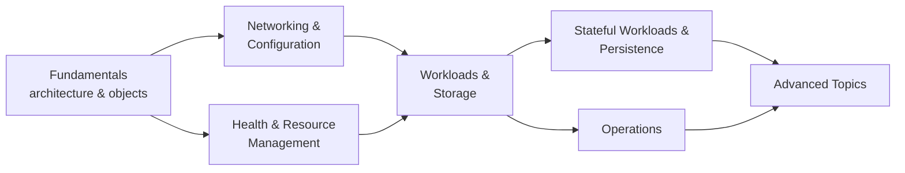

  <h1 style="color: white; margin: 0; font-size: 2.25rem;">Kubernetes</h1>
  
Container orchestration at scale

**Kubernetes** (K8s) is an open-source system for deploying, scaling and operating containerized applications across a cluster of machines. It grew out of Google's internal cluster managers (Borg and Omega), was open-sourced in 2014, and was the first project donated to the Cloud Native Computing Foundation (CNCF). It is now the common substrate for running containers in production, offered as a managed service by every major cloud (EKS, GKE, AKS and others) and by many on-premises distributions.

Its central idea is **declarative reconciliation**: you store a description of the desired state — which images, how many replicas, how they are reached — in the cluster's API, and a set of independent controllers continuously drive the real world toward it. Restarting crashed containers, replacing lost machines, rolling out new versions and scaling with load all follow from that one mechanism.

## Guides

The pages below build on each other. Read the fundamentals in order if you are new to Kubernetes; each later page can be read on its own.

| Page | Covers |
|------|--------|
| [Fundamentals](fundamentals.html) | Control plane and node components, the declarative model and reconciliation loop, Pods, ReplicaSets, Deployments and rolling updates, Services, Namespaces, labels and selectors |
| [Networking &amp; Configuration](fundamentals-networking.html) | The pod network model, Services and kube-proxy, DNS, Ingress and Gateway API, NetworkPolicies, ConfigMaps and Secrets, ServiceAccounts and RBAC |
| [Health &amp; Resource Management](fundamentals-resources.html) | Startup, liveness and readiness probes; requests and limits; QoS classes and eviction; the scheduler; in-place resize; the Horizontal Pod Autoscaler |
| [Workloads &amp; Storage](workloads.html) | StatefulSets, DaemonSets, Jobs and CronJobs; volumes, CSI and StorageClasses; VPA and cluster autoscaling; RBAC and Pod Security Standards |
| [Stateful Workloads &amp; Persistence](persistence.html) | PersistentVolumes and claims in depth, access and binding modes, StatefulSet guarantees, headless Services, snapshots, backup and disaster recovery, database patterns |
| [Operations](operations.html) | kubectl techniques, Helm 4, sidecar and init-container patterns, metrics, logs and traces, troubleshooting by symptom, cluster upgrades, a production checklist, certifications |
| [Advanced Topics](advanced.html) | CRDs and Operators, service mesh, GitOps, multi-tenancy, advanced scheduling, Cluster API, performance tuning, the ecosystem |

## Release Status

Kubernetes publishes three minor releases a year. The project supports the three most recent minor versions, each with roughly a year of patch releases; managed services typically offer paid extended support beyond that.

| Version | Released | Patch support ends |
|---------|----------|--------------------|
| v1.37 | August 2026 | October 2027 |
| v1.36 | April 2026 | June 2027 |
| v1.35 | December 2025 | February 2027 |

Status as of September 2026; see [kubernetes.io/releases](https://kubernetes.io/releases/) for current data.

### Recent Changes Worth Knowing

| Change | Release | Where covered |
|--------|---------|---------------|
| Native sidecar containers (`initContainers` with `restartPolicy: Always`) stable | v1.33 | [Operations](operations.html#native-sidecars) |
| `Endpoints` API deprecated in favour of EndpointSlices | v1.33 | [Fundamentals](fundamentals.html#labels-selectors-and-annotations) |
| Dynamic Resource Allocation (DRA) for GPUs and other devices stable (`resource.k8s.io/v1`) | v1.34–v1.35 | [Advanced Topics](advanced.html#gpus-and-other-accelerators) |
| Pod-level resource requests and limits (beta) | v1.34 | [Health &amp; Resources](fundamentals-resources.html#pod-level-resources) |
| In-place pod resize of CPU and memory stable | v1.35 | [Health &amp; Resources](fundamentals-resources.html#in-place-resize) |
| cgroup v1 deprecated; kubelet refuses cgroup v1 hosts by default | v1.35 | [Operations](operations.html#cluster-upgrades) |
| Community ingress-nginx controller retired (no updates after March 2026) | — | [Networking](fundamentals-networking.html#gateway-api) |
| Helm 4.0 released (Nov 2025); Helm 3 security fixes end February 2027 | — | [Operations](operations.html#helm-4) |
| User namespaces for pods stable | v1.36 | [Workloads &amp; Storage](workloads.html#workload-security) |
| HPA scale to zero (beta, on by default) | v1.37 | [Health &amp; Resources](fundamentals-resources.html#scaling-to-zero) |

## When Kubernetes Fits

Kubernetes solves hard problems but brings its own operational weight: a control plane to upgrade every few months, networking, storage and security layers to choose and maintain, and a large API to learn. It pays off when that cost is spread over many services or teams.

| Situation | Reasonable choice |
|-----------|-------------------|
| One application, one or a few hosts | Docker Compose or a single VM; a PaaS |
| A handful of stateless services on one cloud | A serverless container service (AWS ECS/Fargate, Google Cloud Run, Azure Container Apps) |
| Many services, several teams, need for self-service deployment | Managed Kubernetes (EKS, GKE, AKS) |
| Portability across clouds or on-premises, or a large platform-engineering investment | Kubernetes, managed or self-hosted |
| Edge, IoT or small footprints | Lightweight distributions (k3s, k0s, MicroK8s) |
| Mixed containers, VMs and binaries with a simpler scheduler | HashiCorp Nomad |

If containers themselves are new to you, start with [Docker](../docker/).

## See Also

- [Docker](../docker/) — images, containers and the runtime Kubernetes builds on
- [Container Runtimes](../container-runtimes.html) — containerd, CRI-O and the CRI
- [AWS compute](../aws/compute.html) — EKS and the alternatives on AWS
- [Terraform](../terraform/) — provisioning clusters and cloud resources as code
- [CI/CD](../ci-cd/) — delivery pipelines into a cluster
- [Observability](../../observability/) — metrics, logs, traces and SLOs
