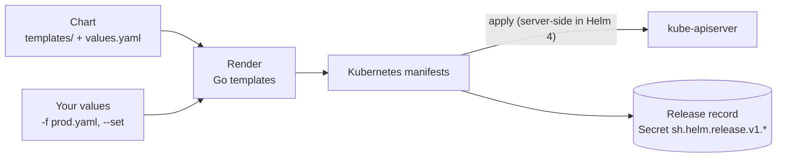
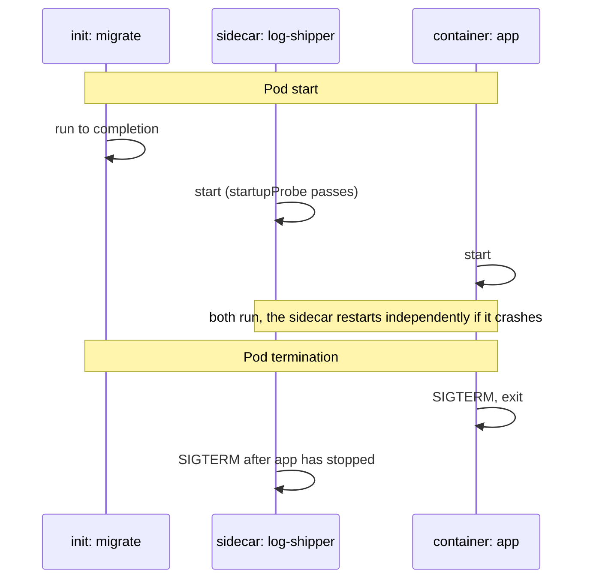
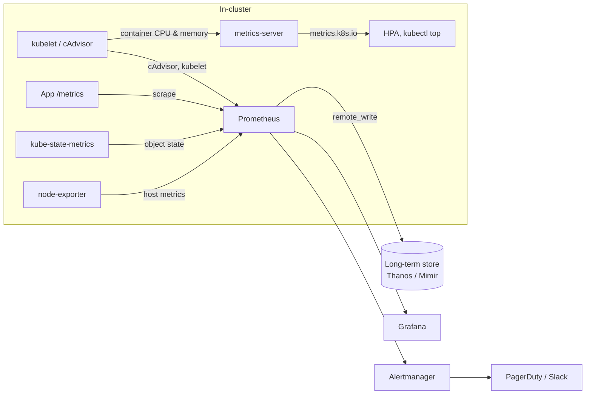
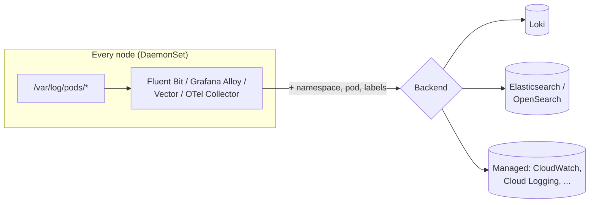
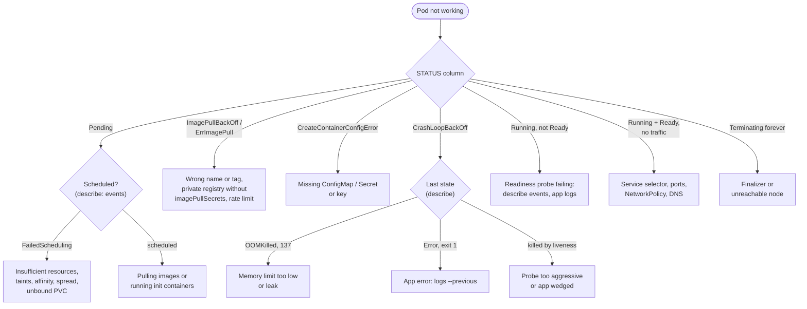
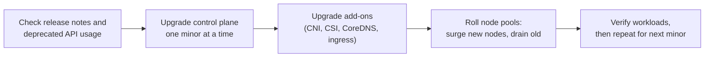

[Kubernetes](./) &raquo; Operations

This page covers running workloads on a cluster once the fundamentals are in place: using **kubectl** effectively, packaging applications with **Helm**, the standard **multi-container pod patterns**, wiring up **observability** inside the cluster, **troubleshooting** by symptom, **upgrading** clusters safely, and a **production readiness checklist**. Commands and APIs are current for Kubernetes v1.35–v1.37 and Helm 4.

## kubectl

`kubectl` is a client for the Kubernetes API. Every command ultimately issues REST calls to the API server, so anything it can do can also be done by CI systems, GitOps controllers or your own code.

### Contexts and kubeconfig

kubectl reads its configuration from `~/.kube/config`, or from the files listed in the `KUBECONFIG` environment variable (colon-separated; they are merged). A kubeconfig holds **clusters** (API endpoint and CA), **users** (credentials, often an exec plugin that fetches short-lived cloud tokens), and **contexts** that pair a cluster, a user and a default namespace.

```bash
kubectl config get-contexts                               # list; * marks the current one
kubectl config use-context prod-eu                        # switch cluster
kubectl config set-context --current --namespace=shop     # change the default namespace
kubectl --context staging -n shop get pods                # one-off override
kubectl auth whoami                                       # which identity the API server sees
kubectl auth can-i create deployments -n shop             # check an RBAC permission
```

Accidentally running a command against the wrong cluster is a classic incident. Mitigations: show the context in your shell prompt, give production contexts distinctive names, and use read-only credentials by default.

### Reading State

```bash
kubectl get pods -o wide                          # node and IP columns
kubectl get deploy,sts,ds,svc -n shop             # several kinds at once
kubectl get pods -w                               # stream changes
kubectl get pod web-0 -o yaml                     # full object, including status
kubectl describe pod web-0                        # human summary plus recent events
kubectl events -n shop --for pod/web-0            # events for one object, oldest first
kubectl explain deployment.spec.strategy          # built-in API reference
kubectl api-resources                             # every kind the cluster serves
```

Output can be shaped for scripts and quick reports:

```bash
# Names only
kubectl get pods -o name

# JSONPath: pod name and node, one per line
kubectl get pods -o jsonpath='{range .items[*]}{.metadata.name}{"\t"}{.spec.nodeName}{"\n"}{end}'

# Custom columns: image of the first container
kubectl get pods -o custom-columns=NAME:.metadata.name,IMAGE:.spec.containers[0].image

# Server-side filtering on fields and labels
kubectl get pods -A --field-selector=status.phase=Pending
kubectl get pods -l 'app.kubernetes.io/name in (web,api)' --sort-by=.status.startTime
```

### Changing State

| Style | Commands | Use for |
|-------|----------|---------|
| **Declarative** | `apply -f`, `apply -k`, `diff`, `delete -f` | Anything that should be reproducible; the normal path |
| **Imperative with a manifest** | `create -f`, `replace -f` | One-off objects; `replace` when you need a full overwrite |
| **Imperative** | `scale`, `set image`, `patch`, `edit`, `label`, `annotate`, `rollout` | Emergencies and experiments; the change is not in version control |

```bash
kubectl diff -f manifests/                        # preview changes against the live cluster
kubectl apply --server-side -f manifests/         # field-ownership-aware apply
kubectl apply -k overlays/prod                    # Kustomize, built into kubectl
kubectl patch deployment web --type=merge -p '{"spec":{"replicas":5}}'
kubectl rollout restart deployment/web            # re-create pods (e.g. to pick up a new Secret)
```

Generate manifests instead of writing them from scratch with `--dry-run=client -o yaml`:

```bash
kubectl create deployment web --image=nginx:1.29 --dry-run=client -o yaml > web.yaml
kubectl create secret generic db --from-literal=password='s3cret' --dry-run=client -o yaml
kubectl create configmap app-config --from-file=config.yaml --dry-run=client -o yaml
kubectl get secret db -o jsonpath='{.data.password}' | base64 -d     # read a Secret value
```

If a GitOps controller (Argo CD, Flux) manages the cluster, imperative changes are reverted at the next sync; change Git instead.

### Debugging Commands

```bash
kubectl logs web-0                          # current container
kubectl logs web-0 --previous               # the container instance that just crashed
kubectl logs -f -l app.kubernetes.io/name=web --all-containers --since=10m --prefix
kubectl exec -it web-0 -c app -- sh         # shell in a running container
kubectl port-forward svc/web 8080:80        # local access to a Service or pod
kubectl cp web-0:/tmp/heap.hprof ./heap.hprof
kubectl top pods --sort-by=memory           # live usage (needs metrics-server)
kubectl top nodes
```

Many production images are **distroless** and contain no shell, so `exec` is useless. `kubectl debug` solves this by adding an **ephemeral container** — with whatever tools you choose — to the running pod, optionally sharing the process namespace of a target container:

```bash
# Attach a toolbox to a running pod, sharing the 'app' container's process namespace
kubectl debug -it web-0 --image=busybox:1.37 --target=app

# Copy a crashing pod with a different command so you can inspect it
kubectl debug web-0 -it --copy-to=web-0-debug --container=app -- sh

# Shell on a node: the node's root filesystem is mounted at /host
kubectl debug node/worker-3 -it --image=ubuntu:24.04 --profile=sysadmin
```

### Node Maintenance

```bash
kubectl cordon worker-3                     # stop scheduling new pods here
kubectl drain worker-3 --ignore-daemonsets --delete-emptydir-data --timeout=10m
# ... patch, reboot, replace ...
kubectl uncordon worker-3
```

`drain` cordons the node and then **evicts** its pods through the Eviction API, which honours PodDisruptionBudgets: if evicting a pod would violate its PDB, drain waits and retries. DaemonSet pods are left in place (they would be recreated immediately), and `--delete-emptydir-data` acknowledges that `emptyDir` contents will be lost.

### Productivity Tooling

| Tool | Purpose |
|------|---------|
| Shell completion (`kubectl completion bash`, or `zsh`, `fish`) | Completes resource names, not just subcommands |
| [Krew](https://krew.sigs.k8s.io/) | kubectl plugin manager (`kubectl krew install <plugin>`) |
| `ctx` / `ns` plugins (kubectx, kubens) | Fast context and namespace switching |
| `tree`, `neat`, `who-can` plugins | Ownership hierarchies, clean YAML output, reverse RBAC lookup |
| **k9s** | Terminal UI for browsing and operating a cluster |
| **stern** | Tail logs from many pods and containers at once, with colour per pod |

## Helm

**Helm** packages a set of Kubernetes manifests as a versioned, parameterised **chart**. Installing a chart with a set of **values** produces a **release**; Helm records each release revision (as a Secret in the release's namespace) so it can upgrade, diff and roll back as a unit.



| Concept | Meaning |
|---------|---------|
| **Chart** | A directory or archive of templates, default values and metadata (`Chart.yaml`) |
| **Values** | Configuration merged over the chart's `values.yaml`; later `-f` files and `--set` flags win |
| **Release** | One installed instance of a chart in a namespace, with numbered revisions |
| **Repository** | Where charts are published: an HTTP index or, increasingly, an **OCI registry** |

### Helm 4

Helm 4.0 was released in November 2025, the first major version in six years. Most Helm 3 charts and releases work unchanged. Notable differences:

- **Server-side apply** is the default for new releases, so Helm participates in field ownership alongside controllers and other tools (releases created by Helm 3 keep client-side apply on upgrade).
- Resource readiness for `--wait` uses **kstatus**, the same status logic used by other tooling, giving more accurate "is it ready" answers for complex resources.
- Plugins — including post-renderers and getters — run through a new plugin system with an optional **WebAssembly** runtime.
- Charts can be installed **by OCI digest** (`oci://registry.example.com/charts/app@sha256:...`) for supply-chain pinning.
- Flag renames: `--atomic` becomes `--rollback-on-failure`, `--force` becomes `--force-replace` (the old names still work with a deprecation warning).

Helm 3 received its final feature release in September 2026 and gets security fixes only until February 2027, so new work should target Helm 4.

### Everyday Commands

```bash
# Install or upgrade in one idempotent command (the usual CI form)
helm upgrade --install web ./charts/web -n shop --create-namespace \
  -f values/prod.yaml --set image.tag=1.8.2 --wait --rollback-on-failure

helm template web ./charts/web -f values/prod.yaml   # render locally, apply nothing
helm lint ./charts/web
helm list -A                                          # releases in all namespaces
helm history web -n shop                              # revisions
helm rollback web 3 -n shop                           # back to revision 3
helm get values web -n shop                           # values in effect
helm uninstall web -n shop

# Charts from an OCI registry — no 'helm repo add' needed
helm install cache oci://registry.example.com/charts/redis --version 20.1.0

# Charts from a classic HTTP repository
helm repo add prometheus-community https://prometheus-community.github.io/helm-charts
helm repo update
helm search repo prometheus-community/kube-prometheus-stack --versions
```

Always pin `--version` for third-party charts; an unpinned install silently picks up a new major version the next time CI runs. Chart sources also change hands — for example, in August 2025 Bitnami moved most of its free container images to an unmaintained "legacy" repository, leaving many widely used charts pointing at images that no longer receive updates — so keep an internal mirror of charts and images you depend on.

### Chart Layout and Templates

```text
charts/web/
├── Chart.yaml          # name, version (chart), appVersion (application), dependencies
├── values.yaml         # defaults, documented
├── values.schema.json  # optional JSON Schema; validates user values
├── templates/
│   ├── _helpers.tpl    # named templates (labels, names)
│   ├── deployment.yaml
│   ├── service.yaml
│   └── NOTES.txt       # printed after install
└── charts/             # vendored dependencies
```


```yaml
# templates/deployment.yaml (excerpt)
apiVersion: apps/v1
kind: Deployment
metadata:
  name: {{ include "web.fullname" . }}
  labels:
    {{- include "web.labels" . | nindent 4 }}
spec:
  {{- if not .Values.autoscaling.enabled }}
  replicas: {{ .Values.replicaCount }}
  {{- end }}
  template:
    spec:
      containers:
      - name: web
        image: "{{ .Values.image.repository }}:{{ .Values.image.tag | default .Chart.AppVersion }}"
        resources:
          {{- toYaml .Values.resources | nindent 10 }}
```


### Helm Practices

| Practice | Why |
|----------|-----|
| Keep one values file per environment in version control | Reviewable, reproducible configuration |
| Add a `values.schema.json` | Typos in values fail fast instead of rendering silently wrong manifests |
| Render and diff before upgrading (`helm template`, the `helm-diff` plugin) | See exactly what will change |
| Pin chart versions and image tags (or digests) | Reproducible installs |
| Do not store secrets in values files | Use External Secrets, Sealed Secrets or SOPS instead |
| Let a GitOps controller run Helm in production | Continuous drift correction and an audit trail |

**Helm or Kustomize?** Helm templates and versions whole applications and is the standard way to distribute third-party software. **Kustomize** (built into `kubectl apply -k`) patches plain YAML with overlays and has no templating language or release state. Many teams use both: Helm for vendor charts, Kustomize overlays for their own services — and Argo CD and Flux support each natively.

## Multi-Container Pod Patterns

A pod can hold several containers that share its network namespace and volumes. The patterns below are the standard reasons to use more than one.

| Pattern | Implemented as | Purpose | Examples |
|---------|----------------|---------|----------|
| **Init container** | `initContainers` entry (runs to completion, in order) | Setup that must finish before the app starts | Schema migration, fetching config, waiting for a dependency |
| **Sidecar** | `initContainers` entry with `restartPolicy: Always` | Helper that runs for the pod's whole life | Log shipper, service-mesh proxy, secrets refresher |
| **Ambassador** | Sidecar that proxies outbound traffic | Hide connection details from the app | Cloud SQL proxy, local API gateway |
| **Adapter** | Sidecar that translates output | Normalise interfaces | Exporting app stats as Prometheus metrics |

### Native Sidecars

Before v1.28, sidecars were ordinary entries in `containers`, which caused two long-standing problems: there was no guarantee the sidecar started before the app (so a mesh proxy might not be ready for the app's first request), and a sidecar kept a Job's pod running forever after the main container finished. **Native sidecars** — init containers with `restartPolicy: Always`, stable since v1.33 — fix both.



Init containers and sidecars start in the order listed; a sidecar counts as started once it is running and its `startupProbe` (if any) passes, and only then does the next entry start. On shutdown, sidecars are stopped after the main containers, in reverse order. In a Job, sidecars do not block completion.

```yaml
spec:
  initContainers:
  - name: migrate                      # classic init container: runs once, must succeed
    image: registry.example.com/app:1.8.2
    command: ["./migrate", "--up"]
  - name: log-shipper                  # native sidecar
    image: fluent/fluent-bit:4.0
    restartPolicy: Always
    volumeMounts:
    - {name: logs, mountPath: /var/log/app}
  containers:
  - name: app
    image: registry.example.com/app:1.8.2
    volumeMounts:
    - {name: logs, mountPath: /var/log/app}
  volumes:
  - name: logs
    emptyDir: {}
```

Where possible, prefer writing logs to stdout and letting a node-level agent collect them (below) over a per-pod log sidecar; sidecars cost CPU and memory in every replica.

## Observability

Probes answer a binary question — restart or not, route or not (see [Health &amp; Resource Management](fundamentals-resources.html#probes)). Operating a system means answering *why*: why latency rose, which release introduced errors, what a pod logged before it was evicted. That needs the three telemetry signals, correlated.

| Signal | Answers | Cost profile |
|--------|---------|--------------|
| **Metrics** | How much, how fast, how full? Rates, percentiles, saturation | Cheap per series; cost grows with label cardinality |
| **Logs** | What exactly happened in this request or pod? | Expensive at volume; one record per event |
| **Traces** | Where did the time go across services? | Sampled; high detail per request |

The platform-neutral concepts — metric types and PromQL, logging architectures, OpenTelemetry and SLOs — are covered in the [Observability](../../observability/) section. This section is the Kubernetes-specific wiring.

### Metrics

Two different things are called "metrics" in Kubernetes:



| Component | Role | Consumed by |
|-----------|------|-------------|
| **metrics-server** | In-memory, latest-value CPU and memory per pod and node; no history | HPA, VPA, `kubectl top` |
| **kube-state-metrics** | Converts API object state into series (desired vs available replicas, pod phase, restarts, Job status) | Prometheus alerts and dashboards |
| **node-exporter** | Host metrics: disk, filesystem, network, load, pressure stall information | Prometheus |
| **Prometheus** | Scrapes, stores and evaluates alert rules | Grafana, Alertmanager |

metrics-server is not a monitoring system. The usual way to install real monitoring is the `kube-prometheus-stack` chart, which bundles the **Prometheus Operator**, Prometheus, Alertmanager, Grafana, node-exporter, kube-state-metrics and a set of default dashboards and alerts:

```bash
helm upgrade --install monitoring prometheus-community/kube-prometheus-stack \
  -n monitoring --create-namespace
```

The operator adds CRDs so scrape targets are declared next to the application rather than in a central config file:

```yaml
apiVersion: monitoring.coreos.com/v1
kind: ServiceMonitor
metadata:
  name: web
  labels:
    release: monitoring          # must match the Prometheus serviceMonitorSelector
spec:
  selector:
    matchLabels:
      app.kubernetes.io/name: web
  endpoints:
  - port: metrics                # named Service port serving /metrics
    interval: 30s
```

Two checklists cover most instrumentation: **RED** for request-driven services (Rate, Errors, Duration) and **USE** for resources (Utilization, Saturation, Errors). Keep label values bounded — status code, route template, method — and never put user IDs, request IDs or raw URLs in metric labels; each unique label combination is a separate time series.

### Logs

Container stdout and stderr are written by the runtime to files under `/var/log/pods/` on the node and are rotated there. They disappear when the pod is deleted or the node is replaced — precisely when a post-mortem needs them. A node agent, run as a **DaemonSet**, tails those files, enriches each line with pod metadata and ships it off the node.



| Stack | Agent | Store | Trade-off |
|-------|-------|-------|-----------|
| **Loki** | Grafana Alloy, Fluent Bit or OTel Collector | Loki on object storage | Indexes only labels, so storage is cheap; queries scan log content |
| **EFK / OpenSearch** | Fluent Bit (Fluentd for heavy transformation) | Elasticsearch or OpenSearch | Full-text index; powerful queries, but storage- and memory-hungry |
| **Vector** | Vector agent and aggregator | Any | High-throughput, vendor-neutral routing and transformation layer |

Grafana's **Promtail** reached end of life on 2 March 2026; **Grafana Alloy** is its replacement. Fluent Bit remains the most common lightweight agent. A minimal Fluent Bit pipeline to Loki:

```ini
[INPUT]
    Name              tail
    Path              /var/log/containers/*.log
    multiline.parser  cri
    Tag               kube.*

[FILTER]
    Name              kubernetes
    Match             kube.*
    Merge_Log         On
    Keep_Log          Off

[OUTPUT]
    Name              loki
    Match             kube.*
    Host              loki-gateway.monitoring.svc
    Labels            job=fluent-bit, $kubernetes['namespace_name']
```

Practices matter more than the choice of stack:

- **Log structured JSON** (`{"level":"error","msg":"payment failed","order_id":123}`), not free text.
- **Propagate a trace or request ID** and log it, so one request can be followed across services — and linked to its trace.
- **Set retention per level** and drop or sample high-volume noise at the agent; logs are usually the most expensive signal.
- **Redact secrets and personal data at the agent**, before anything reaches long-term storage.

### Traces

A **trace** follows one request across services; each unit of work is a **span** with a start, duration and parent. **Context propagation**, normally the W3C `traceparent` header, carries the trace ID from hop to hop.

**OpenTelemetry (OTel)** is the standard for instrumentation and transport. Applications emit spans (and increasingly metrics and logs) over OTLP to an **OpenTelemetry Collector**, typically deployed as a gateway Deployment plus an optional per-node DaemonSet. The OpenTelemetry Operator can also inject auto-instrumentation into pods by annotation. Because the collector decouples instrumentation from storage, backends — Jaeger, Grafana Tempo, or a commercial service — can be changed without touching application code.

```yaml
# OpenTelemetry Collector (contrib distribution): keep errors and slow traces, sample the rest
receivers:
  otlp:
    protocols:
      grpc: {endpoint: 0.0.0.0:4317}
      http: {endpoint: 0.0.0.0:4318}
processors:
  tail_sampling:
    decision_wait: 10s
    policies:
    - {name: errors, type: status_code, status_code: {status_codes: [ERROR]}}
    - {name: slow,   type: latency,     latency: {threshold_ms: 500}}
    - {name: sample, type: probabilistic, probabilistic: {sampling_percentage: 5}}
  batch: {}
exporters:
  otlp/tempo:
    endpoint: tempo.monitoring.svc:4317
    tls: {insecure: true}
service:
  pipelines:
    traces:
      receivers: [otlp]
      processors: [tail_sampling, batch]
      exporters: [otlp/tempo]
```

**Head sampling** decides at the first span and is cheap but can discard the rare failing request; **tail sampling** (above) buffers whole traces and keeps the interesting ones, at the cost of collector memory and the requirement that all spans of a trace reach the same collector instance.

### Alerting

Prometheus evaluates rules and fires alerts; **Alertmanager** deduplicates, groups, silences and routes them. With the operator, rules are `PrometheusRule` objects:


```yaml
apiVersion: monitoring.coreos.com/v1
kind: PrometheusRule
metadata:
  name: web-slo
  labels:
    release: monitoring
spec:
  groups:
  - name: web.availability
    rules:
    - alert: WebHighErrorRate
      expr: |
        sum(rate(http_requests_total{job="web",code=~"5.."}[5m]))
          / sum(rate(http_requests_total{job="web"}[5m])) > 0.05
      for: 10m
      labels:
        severity: page
      annotations:
        summary: "web 5xx ratio above 5% ({{ $value | humanizePercentage }})"
    - alert: PodCrashLooping
      expr: increase(kube_pod_container_status_restarts_total[15m]) > 3
      labels:
        severity: ticket
```


Page on **symptoms users feel** — error rate, latency, SLO error-budget burn — and send cause-level signals (CPU, restarts, disk) to tickets or dashboards. Burn-rate alerting against an SLO is described in [Observability](../../observability/).

## Troubleshooting

Work from the outside in: find what is unhealthy, read what Kubernetes already knows about it (status, conditions, events), then look inside the container.

```bash
kubectl get pods -A | grep -Ev 'Running|Completed'      # anything not obviously fine
kubectl get pods -A --field-selector=status.phase=Pending
kubectl events -A --types=Warning                       # recent warnings, cluster-wide
kubectl describe pod <pod>                              # conditions, last state, events
kubectl logs <pod> --previous                           # output of the crashed instance
```



### Symptom Reference

| Status / symptom | First look | Usual causes | Fix |
|------------------|-----------|--------------|-----|
| `Pending` + `FailedScheduling` | `describe pod` events | Requests exceed free allocatable; untolerated taint; unsatisfiable affinity or spread; PVC unbound or in the wrong zone | Adjust requests or constraints; add nodes; fix StorageClass (`WaitForFirstConsumer`) |
| `ImagePullBackOff` / `ErrImagePull` | `describe pod` events | Typo in image or tag; missing `imagePullSecrets`; registry rate limit; architecture mismatch (`exec format error` appears later, as a crash) | Correct reference; create pull secret; mirror images |
| `CreateContainerConfigError` | `describe pod` | Referenced ConfigMap, Secret or key does not exist | Create it or mark the reference `optional: true` |
| `CrashLoopBackOff` | `logs --previous`, last state and exit code | Application error, bad config, OOM, failing liveness probe | Depends on exit code (below) |
| `Running` but `0/1` Ready | `describe pod` (readiness failures) | App not listening on the probed port or path; dependency down | Fix probe or app; confirm with `port-forward` |
| `Evicted` | `describe pod`, node conditions | Node memory or disk pressure | Set accurate requests; clean up node disk; see [eviction](fundamentals-resources.html#node-pressure-eviction) |
| Stuck `Terminating` | `get pod -o yaml` (finalizers, node) | Finalizer whose controller is gone; node unreachable | Fix the controller; as a last resort remove the finalizer or `delete --force --grace-period=0` |
| Node `NotReady` | `describe node`, kubelet logs (`journalctl -u kubelet`) | kubelet or runtime down, disk full, network partition, expired certificates | Repair or replace the node |

### Container Exit Codes

| Exit code | Meaning | Typical cause |
|-----------|---------|---------------|
| 0 | Success | A long-running container that exits 0 still gets restarted under `restartPolicy: Always` |
| 1, 2 | Application error | Check logs |
| 126 / 127 | Command not executable / not found | Wrong `command`, missing binary in a slim image |
| 137 | Killed by SIGKILL (128 + 9) | `OOMKilled`, or liveness failure after the grace period |
| 139 | Segmentation fault (128 + 11) | Native crash; architecture or library mismatch |
| 143 | Terminated by SIGTERM (128 + 15) | Normal shutdown, or liveness restart handled gracefully |

### Service Connectivity

When pods are healthy but a Service does not answer, test each hop:

```bash
# 1. Does the Service select any Ready pods?
kubectl get endpointslices -l kubernetes.io/service-name=web -o wide
kubectl get pods -l app.kubernetes.io/name=web --show-labels

# 2. Does targetPort match the container's listening port?
kubectl get svc web -o jsonpath='{.spec.ports}'

# 3. Does DNS resolve and the port answer from inside the cluster?
kubectl run nettest --rm -it --restart=Never --image=busybox:1.37 -- \
  sh -c 'nslookup web.shop.svc.cluster.local && wget -qO- -T 3 http://web.shop:80/'

# 4. Is a NetworkPolicy blocking it?
kubectl get networkpolicy -n shop
```

Empty EndpointSlices mean the selector matches nothing or no matching pod is Ready. DNS failures point to CoreDNS (`kubectl -n kube-system logs -l k8s-app=kube-dns`). Timeouts with correct endpoints usually mean a NetworkPolicy or a pod listening on `127.0.0.1` instead of `0.0.0.0`.

## Cluster Upgrades

Kubernetes ships three minor releases a year, and each is supported with patches for about a year (v1.35, v1.36 and v1.37 as of September 2026). Clusters therefore need a minor upgrade roughly every four months to stay supported; managed services add "extended support" at extra cost for those that fall behind.

The **version skew policy** constrains the order:

| Component | Allowed relative to kube-apiserver |
|-----------|-----------------------------------|
| kube-apiserver instances (HA) | Within one minor version of each other during an upgrade |
| kube-controller-manager, kube-scheduler | Same minor or one older |
| kubelet, kube-proxy | Same minor or up to three older; never newer |
| kubectl | One minor older, same, or one newer |



- **Find removed APIs before they bite.** Each release may stop serving deprecated API versions. The API server exposes `apiserver_requested_deprecated_apis` metrics and returns warnings to clients; tools such as `pluto` and `kubent` scan manifests and Helm releases.
- **Upgrade one minor version at a time** for the control plane; nodes may lag, within the skew limits above.
- **Replace rather than patch nodes** where possible: create nodes on the new version and drain the old ones.
- **Protect availability with PodDisruptionBudgets**, which `drain` and node autoscalers respect:

```yaml
apiVersion: policy/v1
kind: PodDisruptionBudget
metadata:
  name: web
spec:
  minAvailable: 2                # or maxUnavailable: 1
  selector:
    matchLabels:
      app.kubernetes.io/name: web
  unhealthyPodEvictionPolicy: AlwaysAllow   # don't let already-broken pods block drains
```

A PDB that can never be satisfied — `minAvailable` equal to the replica count, or a single-replica Deployment with `maxUnavailable: 0` — blocks every drain and stalls upgrades.

Notable changes to check when upgrading into the current releases include: the `Endpoints` API deprecation (v1.33) in favour of EndpointSlices; the retirement of the community **ingress-nginx** controller, which received no further releases or security fixes after March 2026 (migrate to a Gateway API implementation or another controller; `ingress2gateway` converts manifests); and the deprecation of cgroup v1 in v1.35, from which release the kubelet refuses to start on a cgroup v1 host unless `failCgroupV1: false` is set — node images must use cgroup v2.

## Production Readiness Checklist

| Area | Practice | Why |
|------|----------|-----|
| **Resources** | Requests on every container; memory limits; LimitRange defaults and ResourceQuotas per namespace | Predictable scheduling and eviction; no noisy neighbours |
| | Right-size from real usage (VPA in recommendation mode, dashboards) | Over-requesting wastes money; under-requesting causes evictions |
| **Availability** | ≥ 2–3 replicas, spread across zones with topology spread constraints | Survive node and zone loss |
| | PodDisruptionBudgets on every replicated service | Safe drains and upgrades |
| | Readiness probes on everything that takes traffic; startup probes for slow starters | Zero-downtime rollouts |
| | Graceful shutdown: handle `SIGTERM`, `preStop` delay where needed | No dropped requests during rollouts |
| **Delivery** | Images pinned by tag and digest; manifests in Git, applied by GitOps or CI | Reproducible, auditable changes |
| | Progressive delivery (canary or blue/green) for critical services | Limit blast radius of bad releases |
| **Security** | RBAC least privilege; no cluster-admin for workloads; short-lived credentials | Contain compromise |
| | Pod Security Standards `restricted` where possible; non-root; read-only root filesystem; drop capabilities | Reduce container-escape impact |
| | Default-deny NetworkPolicies per namespace | Prevent lateral movement |
| | Image scanning and signature verification (e.g. Sigstore cosign with an admission policy) | Supply-chain integrity |
| | Secrets from an external manager; encryption at rest for etcd | Limit secret exposure |
| **Observability** | Metrics, centralized logs and traces; dashboards per service | Diagnose after the fact |
| | SLO-based alerts routed to an on-call rotation | Actionable paging |
| **Recovery** | etcd snapshots (self-managed) and application-level backups (e.g. Velero); tested restores | A backup that has never been restored is a hope |
| | Documented upgrade cadence within the supported window | Stay on patched versions |

Security controls are expanded in [Workloads &amp; Storage](workloads.html#workload-security) and backups in [Stateful Workloads &amp; Persistence](persistence.html#snapshots-backup-and-disaster-recovery).

## Certifications

The CNCF and Linux Foundation offer five Kubernetes certifications, all taken online with a remote proctor:

| Certification | Format | Focus | Prerequisite |
|---------------|--------|-------|--------------|
| **KCNA** — Kubernetes and Cloud Native Associate | Multiple choice | Concepts and the cloud-native ecosystem | None |
| **KCSA** — Kubernetes and Cloud Native Security Associate | Multiple choice | Security concepts and threat model | None |
| **CKAD** — Certified Kubernetes Application Developer | Hands-on, live clusters | Building, configuring and exposing applications | None |
| **CKA** — Certified Kubernetes Administrator | Hands-on, live clusters | Installing, operating and troubleshooting clusters | None |
| **CKS** — Certified Kubernetes Security Specialist | Hands-on, live clusters | Hardening clusters, supply chain, runtime security | An active CKA |

Holding all five at once earns the "Kubestronaut" title. The performance-based exams reward speed with kubectl: imperative generators (`--dry-run=client -o yaml`), `kubectl explain`, and the official documentation (which is available during the exam).

---

## See Also

- [Fundamentals](fundamentals.html) — architecture, Pods, Deployments, Services
- [Health &amp; Resource Management](fundamentals-resources.html) — probes, requests and limits, eviction, autoscaling
- [Workloads &amp; Storage](workloads.html) — StatefulSets, DaemonSets, Jobs, RBAC and Pod Security
- [Advanced Topics](advanced.html) — CRDs and Operators, service mesh, GitOps
- [Observability](../../observability/) — metrics, logging and tracing in depth; SLOs
- [Docker Essentials](../docker-essentials.html) — container command reference
- [CI/CD](../ci-cd/) — automating delivery into the cluster
