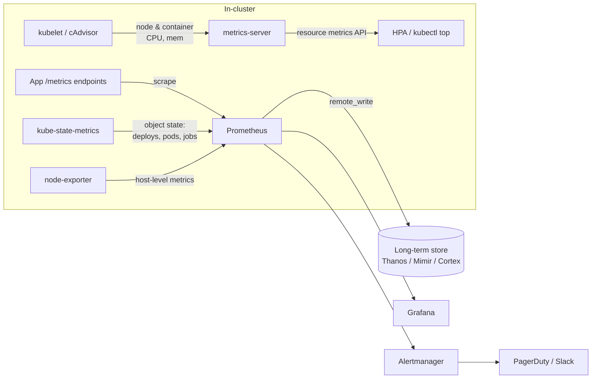
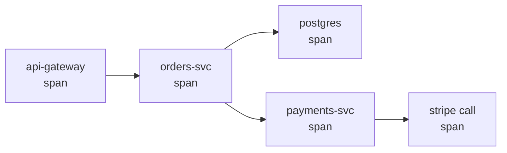
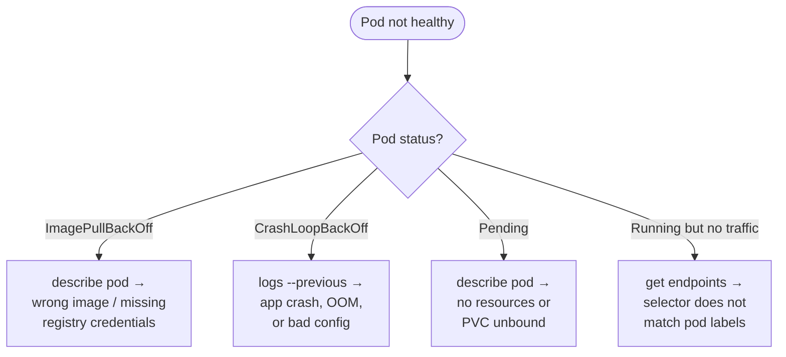

[Kubernetes](./) &raquo; Operations

Day-to-day cluster management: kubectl, Helm package management, observability wiring, troubleshooting techniques, and production best practices.

## kubectl Mastery: Command-Line Kubernetes

kubectl is your primary interface for managing Kubernetes clusters. This section covers the commands you will use most often, organized by task.

**Before you begin**: kubectl needs to know which cluster to talk to. This is configured through contexts, which combine a cluster, user, and namespace.

### Essential kubectl Commands

| Task | Command |
|------|---------|
| See what is running | `kubectl get pods` |
| Get more details | `kubectl describe pod <name>` |
| View logs | `kubectl logs <pod-name>` |
| Execute in container | `kubectl exec -it <pod> -- /bin/sh` |
| Apply configuration | `kubectl apply -f manifest.yaml` |
| Delete resources | `kubectl delete -f manifest.yaml` |

### Working with Multiple Clusters

```bash
# List available contexts
kubectl config get-contexts

# Switch to a different cluster
kubectl config use-context production-cluster

# Set default namespace for current context
kubectl config set-context --current --namespace=production
```

### Viewing Resources

```bash
# List resources with extra info
kubectl get pods -o wide
kubectl get all -n production

# Watch for changes in real-time
kubectl get pods -w

# Filter by labels
kubectl get pods -l environment=production
kubectl get pods -l 'tier in (frontend, backend)'
```

### Creating and Updating Resources

```bash
# Apply configuration (create or update)
kubectl apply -f deployment.yaml

# Quick edits via patch
kubectl patch deployment nginx -p '{"spec":{"replicas":5}}'

# Edit in your default editor
kubectl edit deployment nginx
```

### Debugging and Troubleshooting

```bash
# View pod logs
kubectl logs mypod
kubectl logs mypod --previous  # crashed container
kubectl logs -f -l app=nginx   # follow all matching pods

# Execute commands in container
kubectl exec -it mypod -- /bin/sh

# Port forward for local testing
kubectl port-forward svc/myservice 8080:80

# Check resource usage
kubectl top pods --sort-by=memory
kubectl top nodes
```

### Secrets and ConfigMaps

```bash
# Create secret from literal value
kubectl create secret generic db-creds --from-literal=password=mypass

# Decode a secret value
kubectl get secret db-creds -o jsonpath="{.data.password}" | base64 -d

# Create configmap from file
kubectl create configmap app-config --from-file=config.yaml
```

### Power User Tips

**Useful aliases** (add to your shell config):
```bash
alias k='kubectl'
alias kgp='kubectl get pods'
alias kaf='kubectl apply -f'
```

**JSONPath for extracting data**:
```bash
# Get all pod names
kubectl get pods -o jsonpath='{.items[*].metadata.name}'
```

**Node management**:
```bash
# Prepare node for maintenance
kubectl drain node1 --ignore-daemonsets --delete-emptydir-data
kubectl uncordon node1  # make schedulable again

# Mark node unschedulable (no drain)
kubectl cordon node1
```

### kubectl Plugins with Krew

Krew is a plugin manager for kubectl. Popular plugins:

| Plugin | Purpose |
|--------|---------|
| `ctx` | Quickly switch contexts |
| `ns` | Quickly switch namespaces |
| `tree` | Show resource hierarchy |
| `neat` | Clean up YAML output |

Install krew and a plugin:
```bash
kubectl krew install ctx
kubectl ctx production  # switch context
```

## Best Practices: Production Checklist

Before going to production, verify your setup against these categories:

### Resource Management

| Practice | Why It Matters |
|----------|----------------|
| Set resource requests/limits | Prevents resource starvation and runaway costs |
| Use namespaces | Isolate environments and teams |
| Label everything consistently | Enables filtering, monitoring, and cost allocation |
| Implement ResourceQuotas | Prevents one team from consuming all resources |

### High Availability

| Practice | Why It Matters |
|----------|----------------|
| Run 3+ replicas | Survives node failures |
| Use pod anti-affinity | Spreads pods across nodes/zones |
| Define PodDisruptionBudgets | Controls how many pods can be down during updates |
| Implement health probes | Ensures traffic only goes to healthy pods |

### Security

| Practice | Why It Matters |
|----------|----------------|
| Enable RBAC with least privilege | Limits blast radius of compromised accounts |
| Use NetworkPolicies | Prevents lateral movement between services |
| Run as non-root | Reduces container escape impact |
| Scan images for vulnerabilities | Catches known issues before deployment |

### Observability

| Practice | Why It Matters |
|----------|----------------|
| Centralize logs | Enables debugging after pod deletion |
| Expose metrics | Enables alerting and capacity planning |
| Implement distributed tracing | Debugs latency across services |
| Set up alerts | Catches issues before users notice |

## Observability: Seeing Inside the Cluster

Health probes tell Kubernetes whether to *restart* or *route to* a pod (covered in [Workloads &amp; Storage](workloads.html#observability-understanding-application-health)), but they answer a binary question. Operating a cluster means answering *why* — why is latency up, which release introduced the error, what was this pod logging the moment before it was evicted. That requires the **three pillars of observability**: metrics, logs, and traces.

| Pillar | Answers | Cardinality | Typical retention |
|--------|---------|-------------|-------------------|
| **Metrics** | "What is happening, and how much?" (rates, percentiles, saturation) | Low — aggregated numbers | Weeks to months (cheap) |
| **Logs** | "What exactly happened in this request/pod?" | High — one entry per event | Days to weeks (expensive) |
| **Traces** | "Where did the time go across services?" | High — sampled | Days |

The pillars are complementary, not redundant. A metric tells you the p99 latency spiked; a trace shows you which downstream call caused it; the logs from that span's service tell you the underlying error. Modern tooling (OpenTelemetry, exemplars, Grafana) is increasingly about *correlating* the three so you can pivot between them with one click.

> **Where this fits:** Kubernetes is one source of telemetry, not the whole story. The platform-level concepts — metric types and PromQL, the ELK/Loki logging stacks, OpenTelemetry and sampling — are covered in depth in the [Observability hub](../../observability/). This section is the *Kubernetes-specific* wiring: what to deploy in-cluster and how the pieces connect.

### The Metrics Pipeline

Two distinct things both get called "metrics" in Kubernetes, and conflating them is a common source of confusion:



| Component | Role | Used by |
|-----------|------|---------|
| **metrics-server** | Lightweight, *in-memory* current CPU/memory only | `kubectl top`, the Horizontal Pod Autoscaler |
| **kube-state-metrics** | Exports the *state* of API objects (desired vs ready replicas, pod phase, job status) | Prometheus / alerting |
| **node-exporter** | Host-level metrics (disk, filesystem, network, load) | Prometheus |
| **Prometheus** | Scrapes and stores the time series; evaluates alert rules | Grafana, Alertmanager |

`metrics-server` is **not** a monitoring system — it keeps no history and is only there to feed the autoscaler and `kubectl top`. Real monitoring is Prometheus (or a hosted equivalent). The conventional way to install the whole Prometheus + Grafana + Alertmanager bundle is the `kube-prometheus-stack` Helm chart:

```bash
helm repo add prometheus-community https://prometheus-community.github.io/helm-charts
helm install monitoring prometheus-community/kube-prometheus-stack \
  -n monitoring --create-namespace
```

That chart ships the **Prometheus Operator**, which lets you describe scrape targets declaratively with `ServiceMonitor`/`PodMonitor` custom resources instead of editing a central Prometheus config:

```yaml
apiVersion: monitoring.coreos.com/v1
kind: ServiceMonitor
metadata:
  name: app-metrics
  labels:
    release: monitoring        # must match the Prometheus' serviceMonitorSelector
spec:
  selector:
    matchLabels:
      app: myapp               # selects Services labelled app=myapp
  endpoints:
  - port: metrics              # the named Service port exposing /metrics
    interval: 30s
```

**What to measure.** Two complementary mental models cover most needs:

- **RED** (for request-driven services): **R**ate, **E**rrors, **D**uration. Good for "is my API healthy?"
- **USE** (for resources): **U**tilization, **S**aturation, **E**rrors. Good for "is this node/disk/queue a bottleneck?"

Beware **cardinality**: every unique combination of label values is a separate time series. Putting a user ID, request ID, or full URL in a Prometheus label can explode memory and bring the server down. Keep labels bounded (status code, route template, method) and push high-cardinality detail into logs or traces instead.

### Log Aggregation

A pod's logs live on the node only while the pod exists. The moment a pod is deleted, rescheduled, or its node is replaced, `kubectl logs` returns nothing — exactly when you most need the post-mortem. **Centralized log aggregation** ships every container's stdout/stderr off-node into a queryable store before that happens.

The architecture is consistent across stacks: a lightweight **collector** runs as a DaemonSet (one per node), tails `/var/log/containers/*.log`, enriches each line with Kubernetes metadata (namespace, pod, labels), and forwards it to a backend.

```mermaid
flowchart LR
    subgraph node["Each node (DaemonSet)"]
        Logs[/var/log/containers/*.log] --> Agent[Fluent Bit / Vector]
    end
    Agent -->|enrich + parse| Backend{Backend}
    Backend --> Loki[(Loki)]
    Backend --> ES[(Elasticsearch)]
    Loki --> Graf[Grafana]
    ES --> Kib[Kibana]
```

| Stack | Collector | Store | UI | Trade-off |
|-------|-----------|-------|----|-----------|
| **EFK / ELK** | Fluentd or Fluent Bit | Elasticsearch | Kibana | Full-text indexing, powerful queries, but storage- and memory-hungry |
| **Loki** | Promtail / Fluent Bit | Loki | Grafana | Indexes only labels (not the log body) — far cheaper, "like Prometheus for logs" |
| **Vector** | Vector (agent + aggregator) | any of the above | depends on sink | High-throughput, vendor-neutral routing/transform layer |

**Fluent Bit** has largely displaced the heavier Fluentd as the node agent: it is written in C, uses a few MB of RAM, and is the default collector in most managed offerings. A minimal Fluent Bit pipeline that tails container logs, attaches Kubernetes metadata, and ships to Loki:

```ini
[INPUT]
    Name              tail
    Path              /var/log/containers/*.log
    Parser            cri
    Tag               kube.*

[FILTER]
    Name              kubernetes
    Match             kube.*
    Merge_Log         On
    Keep_Log          Off

[OUTPUT]
    Name              loki
    Match             *
    Host              loki.monitoring.svc
    Labels            job=fluentbit, $kubernetes['namespace_name']
```

**Operational practices that matter more than the stack choice:**

- **Log structured JSON**, not free-form text. `{"level":"error","msg":"...","order_id":123}` is filterable; `ERROR something broke (order 123)` is not.
- **Propagate a correlation/request ID** through every service so a single user request can be reassembled from logs across pods.
- **Set retention and sampling.** Logs are the most expensive pillar. Keep verbose `debug` logs for hours, `error` logs for weeks, and drop or sample the highest-volume noise at the collector.
- **Strip PII at the edge.** Use a collector filter to redact emails, tokens, and card numbers *before* they land in long-term storage.

### Distributed Tracing

Metrics say latency is high; logs say each service looks fine in isolation. A **distributed trace** stitches together the single user request as it fans out across services, so you can see *where* the time actually went.

The vocabulary:

- A **trace** is one end-to-end request, identified by a `trace_id`.
- A **span** is one unit of work within it (an HTTP handler, a DB query), with a start time, duration, and parent span.
- **Context propagation** carries the `trace_id`/`span_id` between services, conventionally in the W3C `traceparent` HTTP header, so the next hop knows it is part of the same trace.



**OpenTelemetry (OTel)** is the vendor-neutral standard that now underpins this space. Applications are instrumented once with the OTel SDK (or auto-instrumentation agents), emit spans over OTLP, and an **OpenTelemetry Collector** — typically a Deployment, plus an optional per-node DaemonSet — receives, batches, samples, and *exports* to whichever backend you choose. Because OTel decouples instrumentation from the backend, you can swap Jaeger for Tempo without touching application code.

| Backend | Notes |
|---------|-------|
| **Jaeger** | The CNCF reference tracing backend; rich UI, mature |
| **Grafana Tempo** | Cheap object-storage backend, integrates trace→log→metric pivots in Grafana |
| **Zipkin** | Older, lightweight, still widely supported |

A trimmed OTel Collector config showing the receive → process → export pipeline:

```yaml
receivers:
  otlp:
    protocols:
      grpc:                       # apps push spans here on :4317
processors:
  batch: {}
  tail_sampling:                  # keep all errors + slow traces, sample the rest
    policies:
    - name: errors
      type: status_code
      status_code: { status_codes: [ERROR] }
exporters:
  otlp/jaeger:
    endpoint: jaeger-collector.monitoring.svc:4317
service:
  pipelines:
    traces:
      receivers:  [otlp]
      processors: [tail_sampling, batch]
      exporters:  [otlp/jaeger]
```

**Sampling** is the key operational lever: tracing every request at scale is prohibitively expensive, so you sample. *Head sampling* decides at the start (simple, but may discard the rare failing request); *tail sampling* (above) buffers the whole trace and keeps it only if it errored or was slow — far more useful for debugging, at the cost of collector memory.

### Dashboards and Alerting

Collecting telemetry is worthless if no one looks at it. The last mile is **dashboards** (for humans investigating) and **alerts** (for machines waking humans up).

**Grafana** is the de-facto dashboarding layer; it queries Prometheus (metrics), Loki (logs), and Tempo/Jaeger (traces) as data sources in one pane, enabling the trace→log→metric pivots described above. Define dashboards as code (JSON or the Grafana Operator's `GrafanaDashboard` CRD) so they live in version control alongside the app.

**Alerting** in the Prometheus world is a two-stage split:

1. **Prometheus** evaluates `PrometheusRule` expressions and *fires* an alert when a condition holds for a duration.
2. **Alertmanager** *routes* firing alerts — deduplicating, grouping, silencing, and dispatching to PagerDuty, Slack, email, etc.


```yaml
apiVersion: monitoring.coreos.com/v1
kind: PrometheusRule
metadata:
  name: app-slo-rules
  labels:
    release: monitoring
spec:
  groups:
  - name: availability
    rules:
    - alert: HighErrorRate
      expr: |
        sum(rate(http_requests_total{status=~"5.."}[5m]))
          / sum(rate(http_requests_total[5m])) > 0.05
      for: 10m                    # must hold 10 min to avoid flapping
      labels:
        severity: page
      annotations:
        summary: "5xx error rate above 5% for {{ $labels.service }}"
```


**Alert on symptoms, not causes.** Page on what users feel — error rate, latency SLO burn, request failures — not on every transient CPU spike. The most effective approach ties alerts to **SLOs**: define a target (e.g. 99.9% of requests succeed), then alert on the *error budget burn rate*, which fires fast for catastrophic outages and slowly for gradual degradation while suppressing the noise that causes alert fatigue. (SLO theory is developed further in the [Observability hub](../../observability/).)

## Helm: Kubernetes Package Manager

Managing dozens of YAML files for a single application becomes unwieldy. Helm solves this by packaging related resources into **charts** that can be versioned, shared, and customized.

**When to use Helm**:
- Deploying complex applications with many resources
- Sharing application configurations across teams
- Managing different configurations for different environments
- Installing third-party applications (databases, monitoring tools)

### Core Concepts

| Concept | Description |
|---------|-------------|
| **Chart** | Package of Kubernetes resources |
| **Release** | An installed instance of a chart |
| **Values** | Configuration that customizes a chart |
| **Repository** | Collection of charts |

### Chart Structure
```
mychart/
├── Chart.yaml      # Metadata (name, version)
├── values.yaml     # Default configuration
├── templates/      # Kubernetes manifests with templating
│   ├── deployment.yaml
│   ├── service.yaml
│   └── _helpers.tpl
└── charts/         # Dependencies
```

### Common Helm Commands

```bash
# Install a chart
helm install myrelease ./mychart

# Install with custom values
helm install myrelease ./mychart -f production-values.yaml

# Preview what would be installed
helm install myrelease ./mychart --dry-run

# Upgrade an existing release
helm upgrade myrelease ./mychart

# Rollback to previous version
helm rollback myrelease 1

# List installed releases
helm list

# Uninstall a release
helm uninstall myrelease
```

### Using Public Charts

```bash
# Add a chart repository
helm repo add bitnami https://charts.bitnami.com/bitnami
helm repo update

# Search for charts
helm search repo postgresql

# Install from repository
helm install mydb bitnami/postgresql -f values.yaml
```

### Helm Best Practices

| Practice | Benefit |
|----------|---------|
| Use `--dry-run` before install | Catch errors early |
| Keep values in version control | Track configuration changes |
| Use separate values files per environment | Clean separation of concerns |
| Run `helm lint` before commits | Validate chart syntax |

## Common Patterns: Proven Architectural Approaches

These patterns appear repeatedly in successful Kubernetes deployments. Understanding when to use each helps you design better systems.

### Multi-Container Pod Patterns

| Pattern | Purpose | Example Use Case |
|---------|---------|------------------|
| **Sidecar** | Extend/enhance main container | Log forwarding, service mesh proxy |
| **Ambassador** | Proxy outbound connections | Database proxy, API gateway |
| **Adapter** | Standardize output format | Convert logs to Prometheus metrics |
| **Init Container** | Run setup before main container | Database migrations, wait for dependencies |

### Sidecar Pattern

A helper container runs alongside your application, sharing storage or network:

```yaml
spec:
  containers:
  - name: app
    image: myapp:latest
    volumeMounts:
    - name: logs
      mountPath: /var/log/app
  - name: log-forwarder
    image: fluentbit:latest
    volumeMounts:
    - name: logs
      mountPath: /var/log/app
  volumes:
  - name: logs
    emptyDir: {}
```

**Common sidecars**: Logging agents, service mesh proxies (Envoy), security agents.

### Init Containers

Init containers run to completion before the main container starts:

```yaml
spec:
  initContainers:
  - name: wait-for-db
    image: busybox
    command: ['sh', '-c', 'until nc -z db 5432; do sleep 2; done']
  - name: migrate
    image: myapp:latest
    command: ['./migrate.sh']
  containers:
  - name: app
    image: myapp:latest
```

**Common uses**: Database migrations, waiting for dependencies, fetching configuration.


## Troubleshooting: When Things Go Wrong

When something breaks, a systematic approach saves time. Start broad, then narrow down. The flowchart below maps a pod's reported status to the command that explains it and the most likely root cause:



### Quick Diagnostic Commands

```bash
# What is unhealthy?
kubectl get pods --all-namespaces | grep -v Running
kubectl get events --sort-by='.lastTimestamp' -A

# Why is this pod unhealthy?
kubectl describe pod <pod-name>
kubectl logs <pod-name> --previous
```

### Common Issues Quick Reference

| Issue | Symptom | First Command | Likely Cause |
|-------|---------|---------------|--------------|
| **ImagePullBackOff** | Pod stuck pulling image | `kubectl describe pod <name>` | Wrong image name, missing credentials |
| **CrashLoopBackOff** | Pod keeps restarting | `kubectl logs <pod> --previous` | App crash, OOM, bad config |
| **Pending** | Pod not scheduling | `kubectl describe pod <name>` | Insufficient resources, no matching nodes |
| **OOMKilled** | Container killed | `kubectl describe pod <name>` | Memory limit too low |

### ImagePullBackOff

The image cannot be pulled. Check:
1. Is the image name correct?
2. Does the registry require authentication?

```bash
# Create registry credentials
kubectl create secret docker-registry regcred \
  --docker-server=<registry> \
  --docker-username=<user> \
  --docker-password=<pass>
```

### CrashLoopBackOff

The container starts but crashes. Debug with:

```bash
kubectl logs <pod-name> --previous
kubectl describe pod <pod-name>
```

Common fixes:
- Increase memory limits if OOMKilled
- Extend `initialDelaySeconds` on probes if app needs time to start
- Check environment variables and config

### Pending Pods

Pod cannot be scheduled. Check events in:

```bash
kubectl describe pod <pod-name>
```

Common causes:
- **Insufficient resources**: Scale down other workloads or add nodes
- **Node selector/affinity**: No matching nodes exist
- **PVC pending**: Storage class or capacity issue

### Service Not Reachable

Debug network issues:

```bash
# Check if service has endpoints
kubectl get endpoints <service-name>

# Test from inside cluster
kubectl run debug --rm -it --image=busybox -- wget -O- <service>:<port>
```

If endpoints are empty, the service selector does not match any pod labels.

## Certification Path

If you want to validate your Kubernetes skills, consider these certifications:

| Certification | Focus | Prerequisites |
|---------------|-------|---------------|
| **CKA** | Cluster administration, troubleshooting | None |
| **CKAD** | Application development, configuration | None |
| **CKS** | Security hardening, runtime security | CKA required |

All exams are hands-on, performance-based tests where you solve real Kubernetes problems in a live environment.

## Key Takeaways

- **kubectl is the workhorse.** Master `get`, `describe`, `logs`, and `exec` — they answer most "what is happening?" questions. Contexts and namespaces keep you pointed at the right cluster.
- **Helm packages complexity.** Charts turn dozens of manifests into one versioned, parameterized unit; use `--dry-run` and per-environment values files.
- **Diagnose systematically.** Start broad (`get pods`, `get events`), then narrow with `describe` and `logs --previous`. The pod status (ImagePullBackOff, CrashLoopBackOff, Pending) tells you where to look first.
- **Production is a checklist.** Resource limits, 3+ replicas with anti-affinity, RBAC, health probes, and centralized logs are non-negotiable before going live.

The key to Kubernetes mastery is practice. Start with simple deployments, gradually add complexity, and always follow the principle of declarative configuration: describe what you want, and let Kubernetes make it happen.

---

## See Also

- [Fundamentals](fundamentals.html) - Pods, Deployments, Services, and cluster architecture
- [Workloads &amp; Storage](workloads.html) - StatefulSets, persistent volumes, RBAC, and autoscaling
- [Advanced Topics](advanced.html) - CRDs, Operators, service mesh, GitOps, and certifications
- [Observability](../../observability/) - The three pillars in depth: metrics &amp; PromQL, logging stacks, OpenTelemetry tracing, and SLOs
- [Docker Essentials](../docker-essentials.html) - Quick container command reference
- [CI/CD](../ci-cd/) - Automating deployments into your cluster
