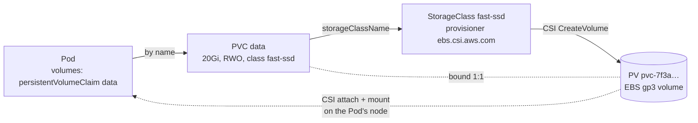
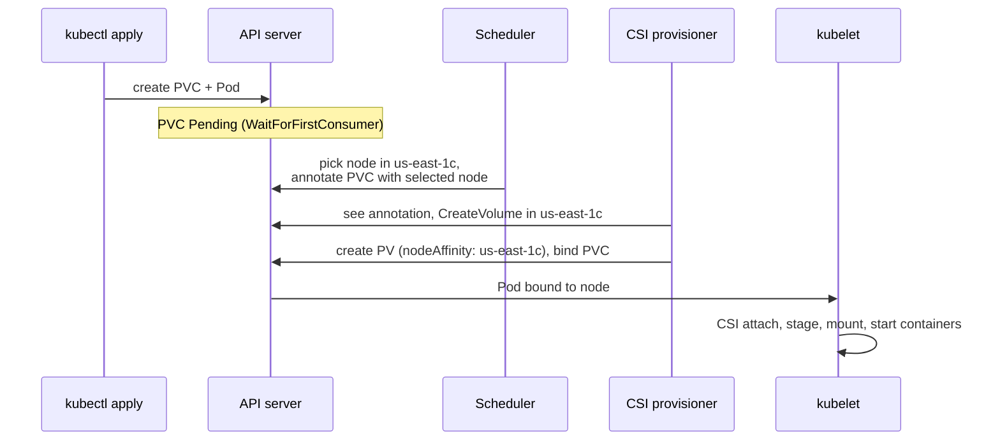
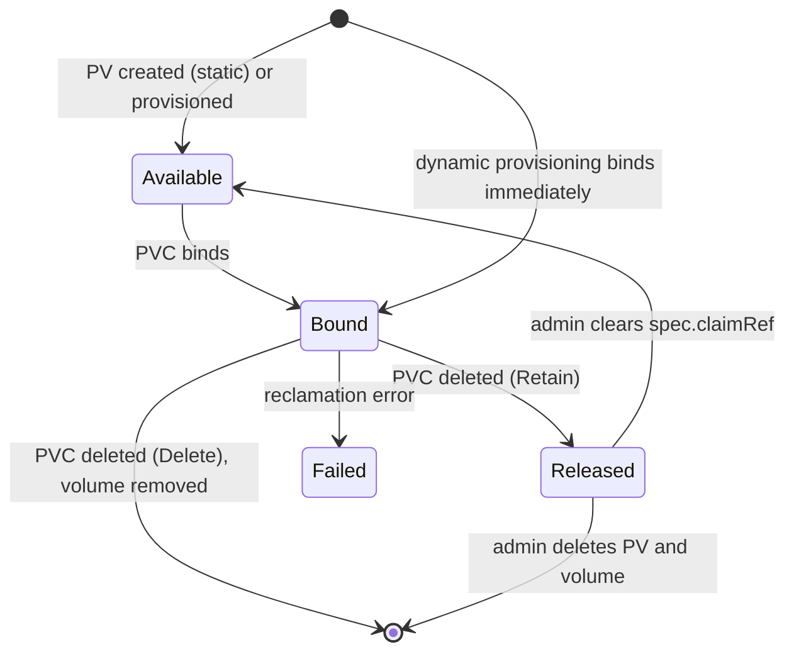
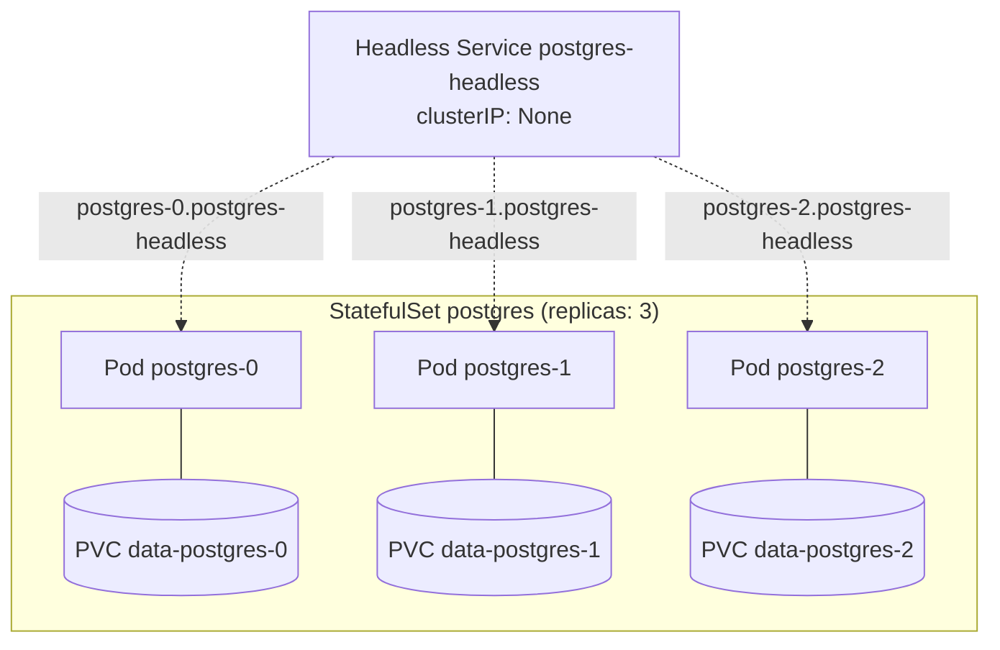

[Kubernetes](./) &raquo; Stateful Workloads & Persistence

Kubernetes treats Pods as disposable, but databases, message brokers, and search clusters must keep their data and identity when a Pod is rescheduled. This page is the reference for how Kubernetes supports them: the storage object model (PersistentVolume, PersistentVolumeClaim, StorageClass, VolumeAttributesClass), the StatefulSet controller that gives Pods stable identity and per-Pod storage, headless Services for peer addressing, and the snapshot, backup, and disaster-recovery practices that make stateful systems survivable. Feature stages are given as of Kubernetes v1.37 (August 2026).

[Workloads & Storage](workloads.html) summarises these primitives alongside the other workload controllers; this page covers them in depth.

## The Storage Object Model

Kubernetes separates a *request* for storage from the storage that satisfies it, so that application manifests never name a disk technology, a zone, or a cloud volume ID.

| Object | Scope | Owned by | Answers |
|--------|-------|----------|---------|
| **PersistentVolumeClaim (PVC)** | Namespace | Application author | How much storage, which access mode, which class? |
| **PersistentVolume (PV)** | Cluster | Admin or provisioner | What real storage exists, and where? |
| **StorageClass** | Cluster | Cluster admin | How is a PV created on demand, with which fixed parameters? |
| **VolumeAttributesClass** | Cluster | Cluster admin | Which *mutable* performance settings (IOPS, throughput) apply, and can they change later? |
| **CSI driver** | Node + controller Pods | Storage vendor | How are volumes created, attached, mounted, expanded, and snapshotted? |

The PVC is the contract. A Pod references a PVC by name; the PVC binds to exactly one PV; the PV describes real storage that a CSI driver attaches and mounts. The indirection is what makes the same manifest portable across clouds and on-premises clusters.



Almost all modern storage is provided through **CSI** (Container Storage Interface) drivers running in the cluster. The old in-tree cloud volume plugins (`awsElasticBlockStore`, `gcePersistentDisk`, `azureDisk`, and others) have been migrated to CSI, and existing objects that use them are transparently redirected to the corresponding CSI driver.

### Static and Dynamic Provisioning

**Static provisioning.** An administrator creates PV objects that describe existing storage, such as an NFS export or a pre-existing cloud disk. When a PVC appears, the PV controller binds it to an unbound PV whose capacity, access modes, and `storageClassName` satisfy it. If nothing matches, the PVC stays `Pending`. Static provisioning is mainly used to import existing data.

**Dynamic provisioning.** The common case. The PVC names a StorageClass; the class's CSI provisioner creates a new volume sized to the claim, writes a matching PV, and binds it.

```yaml
apiVersion: v1
kind: PersistentVolumeClaim
metadata:
  name: data
spec:
  accessModes: ["ReadWriteOnce"]
  storageClassName: fast-ssd     # triggers dynamic provisioning
  resources:
    requests:
      storage: 20Gi
```

The `storageClassName` field has three distinct meanings:

| Value | Behaviour |
|-------|-----------|
| A class name | Dynamic provisioning with that class (or static binding to a PV of that class) |
| Omitted | Use the cluster's **default StorageClass** (annotated `storageclass.kubernetes.io/is-default-class: "true"`). If no default exists yet, the PVC waits, and is assigned the default retroactively once one is created (stable since v1.28) |
| `""` (empty string) | Disable dynamic provisioning; bind only to a PV that also has no class |

### Binding Mode: Immediate or WaitForFirstConsumer

The StorageClass field `volumeBindingMode` decides *when* the volume is created.

- **Immediate** provisions as soon as the PVC exists, before any Pod is scheduled. In a multi-zone cluster the disk may land in `us-east-1a` while the scheduler later wants the Pod in `us-east-1c`; a zonal block device cannot attach across zones, and the Pod is unschedulable.
- **WaitForFirstConsumer** delays provisioning until a Pod using the PVC is scheduled. The scheduler chooses a node, taking the Pod's other constraints into account, and the provisioner creates the disk in that node's zone.



Use `WaitForFirstConsumer` for any zonal block storage (EBS, Persistent Disk, Azure Disk, local volumes). `Immediate` is only appropriate for storage reachable from every node, such as a regional file service.

## StorageClasses

A StorageClass is a named recipe for creating PVs. A cluster usually offers a few tiers: a default general-purpose class, a high-performance class, and a shared-filesystem class.

```yaml
apiVersion: storage.k8s.io/v1
kind: StorageClass
metadata:
  name: fast-ssd
provisioner: ebs.csi.aws.com
parameters:
  type: gp3
  iops: "5000"
  throughput: "250"          # MiB/s
  encrypted: "true"
reclaimPolicy: Retain          # keep the disk if the PVC is deleted
allowVolumeExpansion: true     # PVCs of this class can grow
volumeBindingMode: WaitForFirstConsumer
```

| Field | Purpose | Recommendation |
|-------|---------|----------------|
| `provisioner` | CSI driver that creates the volume | Match the platform (EBS, PD, Azure Disk, Ceph RBD, Longhorn) |
| `parameters` | Driver-specific settings: disk type, IOPS, encryption, filesystem | Enable encryption at rest |
| `reclaimPolicy` | Fate of the PV when its PVC is deleted (default `Delete`) | `Retain` for irreplaceable data |
| `allowVolumeExpansion` | Whether PVCs can be enlarged in place | `true` |
| `volumeBindingMode` | When to provision | `WaitForFirstConsumer` for zonal storage |
| `allowedTopologies` | Restrict provisioning to certain zones | Use when only some zones have capacity |
| `mountOptions` | Mount flags passed to the node | For example NFS `nconnect=8`, `hard` |

Most StorageClass fields are immutable. To change them, create a new class and migrate.

### Changing Performance Later: VolumeAttributesClass

StorageClass parameters are fixed at creation, so historically moving a database from 3,000 to 10,000 IOPS meant either a new volume and a data copy, or an out-of-band change in the cloud console that Kubernetes knew nothing about. **VolumeAttributesClass** (stable since v1.34) separates *mutable* attributes into their own class. A PVC references one with `volumeAttributesClassName`, and editing that field asks the CSI driver to modify the live volume through the CSI `ModifyVolume` call, without detaching it.

```yaml
apiVersion: storage.k8s.io/v1
kind: VolumeAttributesClass
metadata:
  name: gp3-high
driverName: ebs.csi.aws.com
parameters:          # names are driver-specific
  iops: "10000"
  throughput: "500"
---
# Upgrade an existing claim in place:
#   kubectl patch pvc data-postgres-0 \
#     -p '{"spec":{"volumeAttributesClassName":"gp3-high"}}'
```

The driver must implement `ModifyVolume`, and the backend's own limits still apply; EBS, for example, allows a limited number of modifications per volume in a time window. Progress is reported in the PVC's `status.currentVolumeAttributesClassName` and `status.modifyVolumeStatus`.

### Reclaim Policy and the PV Lifecycle

The reclaim policy is the most consequential storage setting, because it decides whether deleting a PVC also destroys the data.

| Policy | On PVC deletion | Use for |
|--------|-----------------|---------|
| **Delete** | PV and backing volume are deleted | Caches, CI scratch, anything reproducible |
| **Retain** | PV becomes `Released`; the volume and its data survive | Databases and anything you cannot lose |
| **Recycle** | Deprecated; do not use | (Previously scrubbed the volume for reuse) |



A `Released` PV still records the old claim's UID in `spec.claimRef`, so Kubernetes will not bind it to a new PVC automatically. Reusing it is a deliberate human step: inspect the data, then clear `claimRef` to make the PV `Available`, or pre-bind it by setting `volumeName` on the new PVC. With the `Delete` policy, a PV deletion-protection finalizer (stable since v1.33) ensures the backing volume is also deleted even if someone deletes the PV object before its PVC, preventing orphaned cloud disks.

### Volume Expansion

With `allowVolumeExpansion: true`, a volume is grown by raising the PVC's request. Volumes can never shrink.

```bash
kubectl patch pvc data-postgres-0 \
  -p '{"spec":{"resources":{"requests":{"storage":"50Gi"}}}}'
kubectl get pvc data-postgres-0 -o jsonpath='{.status.allocatedResourceStatuses}'
```

The CSI controller enlarges the backend volume, then the node plugin grows the filesystem. Online expansion of in-use volumes has been stable since v1.24, so no Pod restart is normally needed. If the backend cannot satisfy the new size, the request can be lowered again to a value that still exceeds the current capacity, and Kubernetes retries with the smaller size (recovery from failed expansion, stable since v1.34). Previously the only escape was a manual PV/PVC rebind.

StatefulSet `volumeClaimTemplates` are immutable, so resizing a StatefulSet's storage means patching each PVC individually. Update the template for future replicas by deleting the StatefulSet with `--cascade=orphan` (which leaves Pods and PVCs running) and re-creating it with the larger size.

## Access Modes

Access modes state how a volume may be mounted. They are properties of the storage technology, not preferences.

| Mode | Short | Meaning | Typical backends |
|------|-------|---------|------------------|
| **ReadWriteOnce** | RWO | Read-write by Pods on **one node** | Block storage: EBS, Persistent Disk, Azure Disk, Ceph RBD |
| **ReadOnlyMany** | ROX | Read-only by many nodes | File storage, volumes cloned from snapshots |
| **ReadWriteMany** | RWX | Read-write by many nodes | File storage: EFS, Azure Files, Filestore, NFS, CephFS |
| **ReadWriteOncePod** | RWOP | Read-write by exactly **one Pod** in the cluster | CSI drivers only; stable since v1.29 |

Two traps catch most people:

1. **RWO is per node, not per Pod.** Two Pods scheduled on the same node can both mount an RWO volume read-write. For a guaranteed single writer (for example, to rule out two database primaries during a rollout) use **ReadWriteOncePod**; the scheduler will not place a second Pod that uses the claim.
2. **Block storage cannot be RWX.** A block device attaches to one node at a time, so an RWX claim against an EBS or Persistent Disk class stays `Pending`. Shared read-write access needs a file-based backend, with the consistency and latency costs of a network filesystem.

The `volumeMode` field is separate: `Filesystem` (default) mounts a formatted filesystem, while `Block` presents a raw block device to the container, which some databases and storage systems prefer.

## StatefulSets: Identity, Storage, and Ordering

A Deployment treats its Pods as interchangeable: random names, no per-Pod storage, and replacement in any order. Clustered stateful systems break that model because each member has a role and its own data: a Postgres primary and its replicas, Kafka brokers that own specific partitions, Elasticsearch nodes that hold specific shards. The **StatefulSet** controller provides the three guarantees they need:

1. **Stable network identity.** Pod names are `<statefulset>-<ordinal>` and survive rescheduling.
2. **Stable per-Pod storage.** Each ordinal gets its own PVC, which follows the Pod to whatever node it lands on.
3. **Ordered, controlled lifecycle.** Creation, scaling, and updates proceed in a predictable order.



```yaml
apiVersion: apps/v1
kind: StatefulSet
metadata:
  name: postgres
spec:
  serviceName: postgres-headless     # the governing headless Service
  replicas: 3
  podManagementPolicy: OrderedReady  # default; immutable after creation
  updateStrategy:
    type: RollingUpdate
    rollingUpdate:
      partition: 0
  persistentVolumeClaimRetentionPolicy:
    whenDeleted: Retain              # default: keep data if the StatefulSet is deleted
    whenScaled: Retain               # default: keep data for scaled-down ordinals
  selector:
    matchLabels:
      app: postgres
  template:
    metadata:
      labels:
        app: postgres
    spec:
      terminationGracePeriodSeconds: 60
      containers:
      - name: postgres
        image: postgres:18
        env:
        - name: POSTGRES_PASSWORD
          valueFrom:
            secretKeyRef: {name: postgres-auth, key: password}
        ports:
        - containerPort: 5432
          name: pg
        volumeMounts:
        - name: data
          mountPath: /var/lib/postgresql   # PostgreSQL 18+ image layout
  volumeClaimTemplates:              # one PVC per ordinal
  - metadata:
      name: data
    spec:
      accessModes: ["ReadWriteOncePod"]
      storageClassName: fast-ssd
      resources:
        requests:
          storage: 50Gi
```

The mount path matters. From PostgreSQL 18, the official image stores data in a version-specific `PGDATA` (`/var/lib/postgresql/18/docker`) and declares its volume at `/var/lib/postgresql`; for 17 and earlier the volume must be mounted at `/var/lib/postgresql/data`. Mounting at the wrong path writes the database to the container's anonymous volume, and the data is lost when the Pod is replaced.

### Stable Identity

The ordinal is sticky: if `postgres-1` is deleted, its replacement is also `postgres-1` and reattaches `data-postgres-1`. Each Pod carries the labels `statefulset.kubernetes.io/pod-name` and `apps.kubernetes.io/pod-index` (stable since v1.32), so a Service or a monitoring rule can select one specific member. Ordinals start at 0 by default; `.spec.ordinals.start` (stable since v1.31) can start them elsewhere, which lets a StatefulSet be split or migrated across clusters without renumbering members.

### Per-Ordinal Storage

The controller creates one PVC per Pod from each `volumeClaimTemplate`, named `<template>-<statefulset>-<ordinal>`:

```bash
$ kubectl get pvc -l app=postgres
NAME              STATUS   VOLUME        CAPACITY   ACCESS MODES   STORAGECLASS
data-postgres-0   Bound    pvc-a1b2...   50Gi       RWOP           fast-ssd
data-postgres-1   Bound    pvc-c3d4...   50Gi       RWOP           fast-ssd
data-postgres-2   Bound    pvc-e5f6...   50Gi       RWOP           fast-ssd
```

By default these PVCs **outlive** the StatefulSet: scaling down or deleting it leaves the claims, and their data, in place, and scaling back up reattaches them. `persistentVolumeClaimRetentionPolicy` (stable since v1.32) changes this per event: `whenScaled: Delete` removes the PVCs of ordinals removed by a scale-down, and `whenDeleted: Delete` removes all of them when the StatefulSet is deleted. Neither applies when a Pod is merely rescheduled after a node failure; the existing PVC is always reattached.

### Ordering and Updates

`podManagementPolicy` governs **scaling**:

| | OrderedReady (default) | Parallel |
|---|---|---|
| Scale up | 0, 1, 2 in turn; each waits for the previous to be Running and Ready | All at once |
| Scale down | Highest ordinal first, one at a time | All at once |
| Use when | Members must join an existing quorum in order | Members self-organise (many modern clustered systems) |

`updateStrategy` governs **template changes**, independently of the policy above:

| Strategy | Behaviour |
|----------|-----------|
| `RollingUpdate` (default) | Replace Pods from the highest ordinal down, one at a time, waiting for each to become Ready (plus `minReadySeconds`) |
| `RollingUpdate` + `partition: N` | Only ordinals ≥ N are updated; lower ordinals stay on (and are recreated at) the old revision. Used for canaries and staged rollouts |
| `RollingUpdate` + `maxUnavailable` | Replace up to this many Pods at once (beta; enabled by default in v1.37). Speeds up large sets whose members tolerate it |
| `OnDelete` | Never replace automatically; new Pods pick up the template only when you delete old ones. Used when an operator or a human sequences upgrades |
| `Recreate` | Delete every Pod, then create new ones; for software that cannot run two versions at once (alpha in v1.37, behind the `StatefulSetRecreateStrategy` feature gate) |

**Stuck rollouts.** With `OrderedReady` and `RollingUpdate`, a template that never becomes Ready halts the rollout at that Pod. Reverting the template is not enough on its own: the controller keeps waiting for the broken Pod. After reverting, delete the Pods that were created from the bad revision so they are recreated from the good one. `podManagementPolicy` cannot be changed on an existing StatefulSet, so switching to `Parallel` is not an option mid-incident.

## Headless Services: DNS for Peers

A normal ClusterIP Service gives one virtual IP and load-balances across Pods, which is exactly wrong when a client must reach a *specific* member, such as the primary or the leader of a partition. A **headless Service** (`clusterIP: None`) allocates no virtual IP. DNS returns the individual Pod addresses instead, and combined with a StatefulSet's `serviceName`, each Pod gets its own stable DNS name.

```yaml
apiVersion: v1
kind: Service
metadata:
  name: postgres-headless
spec:
  clusterIP: None                  # headless
  publishNotReadyAddresses: true   # peers can find each other while bootstrapping
  selector:
    app: postgres
  ports:
  - port: 5432
    name: pg
```

Each Pod is then resolvable as `<pod>.<service>.<namespace>.svc.<cluster-domain>`:

```
postgres-0.postgres-headless.default.svc.cluster.local
postgres-1.postgres-headless.default.svc.cluster.local
postgres-2.postgres-headless.default.svc.cluster.local
```

`publishNotReadyAddresses: true` matters for clustered systems: members often need to discover each other *before* they pass readiness (forming a quorum is what makes them ready), and by default DNS only publishes Ready Pods. Keep it on the peer-discovery Service only, never on the Service clients use.

A common layout pairs two Services: the headless one for replication and peer discovery, and a regular ClusterIP Service whose selector matches only the current primary (for example `role: primary`) for client writes, with an optional third for read replicas.

## Snapshots, Backup, and Disaster Recovery

### Volume Snapshots

CSI `VolumeSnapshot` objects (stable since v1.20) capture a point-in-time copy of a PVC at the storage layer. They require the external snapshot controller, the snapshot CRDs, and a driver that supports snapshots, which most managed Kubernetes offerings install.

```yaml
apiVersion: snapshot.storage.k8s.io/v1
kind: VolumeSnapshot
metadata:
  name: postgres-0-2026-09-22
spec:
  volumeSnapshotClassName: csi-snapclass
  source:
    persistentVolumeClaimName: data-postgres-0
---
# Restore: a new PVC whose dataSource is the snapshot
apiVersion: v1
kind: PersistentVolumeClaim
metadata:
  name: data-postgres-0-restored
spec:
  storageClassName: fast-ssd
  dataSource:
    apiGroup: snapshot.storage.k8s.io
    kind: VolumeSnapshot
    name: postgres-0-2026-09-22
  accessModes: ["ReadWriteOnce"]
  resources:
    requests:
      storage: 50Gi
```

A PVC can also use another PVC as its `dataSource` to **clone** a volume, and **volume populators** (`dataSourceRef`) fill a new volume from arbitrary custom sources. **VolumeGroupSnapshot** (beta since v1.32, implemented by the CSI external snapshotter) snapshots several PVCs at the same instant, for applications whose data and logs live on separate volumes.

### Snapshots Are Not Backups

Snapshots are fast and convenient, but two properties disqualify them as the only copy of your data:

1. **Shared fate.** Snapshots usually live in the same storage system, region, and account as the source. A regional outage, an account compromise, or a ransomware actor with delete permissions takes both.
2. **Crash consistency.** A block-level snapshot of a running database captures the disk as if the power had been cut. Well-behaved engines recover from their write-ahead log, but application-consistent copies need the engine's cooperation: a checkpoint or freeze hook before the snapshot, or the engine's own backup tooling.

### A Layered Backup Strategy

| Layer | Tooling | Protects against |
|-------|---------|------------------|
| Volume snapshots | CSI `VolumeSnapshot`, scheduled by Velero or the storage platform | Accidental deletion, fast rollback before risky changes |
| Engine-level backups | Continuous WAL archiving plus base backups (pgBackRest, Barman, CloudNativePG's backup plugin), `mongodump`, Kafka tiered storage | Logical corruption, point-in-time recovery, restore to another version |
| Off-site copies | Object storage replicated to another region **and** account, with object lock (immutability) | Regional loss, account compromise, ransomware |
| Cluster state | Velero or GitOps repositories for manifests, plus the layers above for data | Losing the whole cluster; rebuilding namespaces elsewhere |

[Velero](https://velero.io/) is the most widely used open-source tool for the cluster layer. It backs up Kubernetes objects, triggers CSI snapshots or copies volume data to object storage with its file-system backup, and restores whole namespaces into another cluster. Test restores regularly: a backup that has never been restored is a hope, not a backup.

### Recovery Objectives

Two targets drive every disaster-recovery design:

- **RPO (recovery point objective):** how much data you can afford to lose, set by how often data is copied. Continuous WAL streaming gives seconds; nightly dumps give up to 24 hours.
- **RTO (recovery time objective):** how long recovery may take. Promoting a warm standby in another region takes minutes; restoring a multi-terabyte snapshot can take hours.

For stateful systems the highest-leverage pattern is **asynchronous replication to a standby in another region** (Postgres streaming replication, Kafka MirrorMaker 2 or cluster linking, database-native cross-region replicas) backed by off-site backups. Replication keeps RPO low; the backup is the floor you fall back to when replication faithfully copies a mistake, such as a dropped table.

## Production Patterns

### Operators Over Hand-Built StatefulSets

A StatefulSet provides identity and storage but knows nothing about the software inside it: it cannot promote a replica, rebalance partitions, or take a consistent backup. That knowledge lives in **operators**, controllers that encode an experienced administrator's runbook as a reconcile loop ([Advanced Topics](advanced.html#custom-resource-definitions)). For production databases and brokers an operator is the default choice.

Notably, several leading operators no longer use StatefulSets at all. **CloudNativePG** manages Postgres Pods and PVCs directly, and **Strimzi** manages Kafka brokers through its own `StrimziPodSet` resource. Owning the Pods lets them choose which instance to update or remove, resize storage per instance, and sequence failover in ways the generic StatefulSet ordering cannot express. The storage and identity concepts on this page still apply; only the controller changes.

### PostgreSQL with High Availability

The shape of a highly available Postgres cluster, whether built by an operator or by hand:

- **Three instances**, each with its own RWO or RWOP volume, spread across zones with topology spread constraints.
- **Streaming replication** from the primary to the replicas, discovered through per-instance DNS names.
- **A primary Service** that selects the current primary by label (`role: primary`); failover moves the label, so clients follow the new primary. A read-only Service selects replicas.
- **ReadWriteOncePod** on data volumes, so no second Pod can mount a primary's disk during a botched failover.
- **Continuous WAL archiving to object storage** plus scheduled base backups for point-in-time recovery.

```yaml
# CloudNativePG: the operator creates Pods, PVCs, Services, and backups from this
apiVersion: postgresql.cnpg.io/v1
kind: Cluster
metadata:
  name: orders-db
spec:
  instances: 3
  storage:
    storageClass: fast-ssd
    size: 50Gi
```

With CloudNativePG this produces `orders-db-rw` (primary), `orders-db-ro` (replicas), and `orders-db-r` (any instance) Services, and handles failover and switchover. Other mature Postgres operators include Crunchy Postgres for Kubernetes (PGO), the Zalando Postgres Operator, and Percona's operator; these typically combine StatefulSets with Patroni for failover.

### Kafka: Brokers with Stable Identity

Kafka maps closely onto per-instance identity, because each broker has a fixed node ID and owns specific partition replicas:

- **Node ID from the ordinal or pod-set index**, so partition assignments survive rescheduling.
- **Per-broker DNS names** that each broker advertises. Clients must reach the specific leader of each partition, which a load-balanced ClusterIP would break; external access needs one address per broker (a load balancer or node port each, or a Gateway with TLS passthrough and SNI routing).
- **KRaft** controllers for metadata. Kafka 4.0 (2025) removed ZooKeeper entirely, and Strimzi dropped ZooKeeper support in 0.46.
- **A large RWO log volume per broker**, chosen for throughput as much as capacity. Tiered storage can move older log segments to object storage, shrinking local volumes.
- **Durability from replication**, not from the disk: replication factor 3 with `min.insync.replicas=2` lets any single broker and its volume be lost without losing acknowledged writes.

### Redis and Valkey: Cache or Store

Redis (and **Valkey**, the Linux Foundation fork created in 2024 when Redis changed its licence, now common in managed cloud offerings) spans a spectrum, and the right design depends on whether the data can be lost:

| Need | Workload | Storage | Persistence |
|------|----------|---------|-------------|
| Ephemeral cache | Deployment | None or `emptyDir` | Off; the cache re-warms after a restart |
| Durable single instance | StatefulSet, 1 replica | RWO PVC | AOF (append-only file) |
| High availability | StatefulSet + Sentinel | RWO PVC per Pod | AOF + replication; Sentinel promotes a replica |
| Sharded at scale | StatefulSet in cluster mode | RWO PVC per Pod | AOF + replication; keyspace split into 16,384 hash slots |

A pure cache is the one stateful-looking workload that is correctly run as a stateless Deployment: persistence there only adds I/O and slower restarts.

## Common Pitfalls

| Pitfall | Consequence | Remedy |
|---------|-------------|--------|
| Treating RWO as "one Pod" | Two Pods on one node both write the volume | Use `ReadWriteOncePod` for single-writer data |
| Requesting RWX from block storage | PVC `Pending` forever | Use a file backend (EFS, Azure Files, Filestore, CephFS) |
| `Immediate` binding for zonal disks | Volume in one zone, Pod needs another; Pod unschedulable | `volumeBindingMode: WaitForFirstConsumer` |
| `Delete` reclaim policy on the default class | Deleting a PVC (or a namespace) destroys the data | `Retain` for important data, plus backups |
| Snapshots as the only backup | Snapshot lost with the source; crash-consistent only | Engine-level backups, off-site, immutable |
| Expecting StatefulSet deletion to remove data | Orphaned PVCs and cloud disks keep costing money | Clean up deliberately, or set `persistentVolumeClaimRetentionPolicy` |
| Editing `volumeClaimTemplates` to resize | Update rejected (field is immutable) | Patch each PVC; re-create the StatefulSet with `--cascade=orphan` |
| Wrong mount path for the database image | Data written to an ephemeral anonymous volume | Mount where the image declares its volume (Postgres 18+: `/var/lib/postgresql`) |
| Rollout stuck on an un-Ready ordinal | Update halts indefinitely | Revert the template, then delete the Pods from the bad revision |

## See Also

- [Workloads & Storage](workloads.html): the workload controllers and a storage overview
- [Fundamentals](fundamentals.html): Pods, Deployments, and the control plane
- [Networking & Configuration](fundamentals-networking.html): Services, headless Services, and DNS
- [Operations](operations.html): kubectl, Helm, and troubleshooting
- [Advanced Topics](advanced.html): CRDs and the operator pattern
- [Docker Storage & Security](../docker/storage-security.html): volumes at the container level
- [AWS Storage](../aws/storage.html): EBS, EFS, and snapshots behind the CSI drivers
