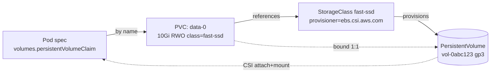

[Kubernetes](./) &raquo; Stateful Workloads & Persistence

Kubernetes was built for stateless cattle, but the most valuable systems we run — databases, message brokers, caches — are stateful pets that must survive pod rescheduling, keep a stable identity, and never lose a byte. This page covers how Kubernetes makes that possible: the storage primitives (PV, PVC, StorageClass), the controller that gives pods identity (StatefulSet), the DNS that makes peers addressable (headless Services), and the operational disciplines (snapshots, backup, DR) that turn "it runs" into "it survives an outage."

The [Workloads & Storage](workloads.html) page introduces these primitives at a glance. This page is the reference treatment: every guarantee, every failure mode, and three production-grade patterns you can lift into a real cluster.

## The Storage Object Model

Kubernetes deliberately splits storage into a *request* and a *resource* so that application authors never have to know what disk technology backs their data.

| Object | Owned by | Answers the question |
|--------|----------|----------------------|
| **PersistentVolume (PV)** | Cluster admin / provisioner | "What real storage exists?" |
| **PersistentVolumeClaim (PVC)** | Application author | "How much storage, what mode, what class do I want?" |
| **StorageClass** | Cluster admin | "How do I create a PV on demand, and with what parameters?" |
| **CSI Driver** | Storage vendor | "How do I attach, mount, snapshot, and resize real volumes?" |

The PVC is the contract. A Pod references a PVC by name; the PVC binds to exactly one PV; the PV points at real storage through a CSI driver. The Pod never names a disk, a zone, or an AWS volume ID — it names a claim, and that indirection is what makes manifests portable across clouds.



### Static vs Dynamic Provisioning

There are two ways a PVC gets a PV.

**Static provisioning** — an administrator pre-creates PV objects describing existing disks (an NFS export, a pre-cut LUN). When a PVC appears, the control plane's PV controller looks for an *unbound* PV whose capacity, access modes, and `storageClassName` satisfy the claim, and binds them. If nothing matches, the PVC stays `Pending` forever. Static provisioning is mostly used for legacy NFS exports and for importing pre-existing cloud disks.

**Dynamic provisioning** — the common case. The PVC names a `StorageClass`; the class's external provisioner (the CSI controller plugin) calls the storage backend, creates a brand-new volume sized to the claim, writes a matching PV object, and binds it. No human ever touches a PV.

```yaml
# Dynamic: the PVC names a class, the class makes the disk.
apiVersion: v1
kind: PersistentVolumeClaim
metadata:
  name: data
spec:
  accessModes: ["ReadWriteOnce"]
  storageClassName: fast-ssd     # triggers dynamic provisioning
  resources:
    requests:
      storage: 20Gi
```

A subtle but important rule: `storageClassName: ""` (empty string) explicitly *disables* dynamic provisioning and forces static binding, while *omitting* the field falls back to the cluster's **default StorageClass** (the one annotated `storageclass.kubernetes.io/is-default-class: "true"`). Forgetting this is the classic cause of a PVC that hangs in `Pending` in a cluster that has no default class.

### Binding Modes: Immediate vs WaitForFirstConsumer

`volumeBindingMode` on the StorageClass decides *when* the PV is created.

- **Immediate** — the volume is provisioned the moment the PVC is created, before any Pod is scheduled. On a multi-zone cluster this is dangerous: the provisioner may put the disk in `us-east-1a` while the scheduler later places the Pod in `us-east-1c`, and a zonal block device cannot be attached across zones. The Pod is then unschedulable.
- **WaitForFirstConsumer (WFFC)** — provisioning is *delayed* until a Pod that mounts the PVC is scheduled. The scheduler picks a node first, then the provisioner creates the disk in that node's zone. This is the correct default for any zonal block storage (EBS, GCE PD, Azure Disk).

Always prefer `WaitForFirstConsumer` for block storage. Use `Immediate` only for topology-independent backends (some networked file systems) where you actively want the volume to exist before scheduling.

## StorageClasses in Depth

A StorageClass is a named recipe for making PVs. The same cluster typically defines several tiers.

```yaml
apiVersion: storage.k8s.io/v1
kind: StorageClass
metadata:
  name: fast-ssd
  annotations:
    storageclass.kubernetes.io/is-default-class: "false"
provisioner: ebs.csi.aws.com
parameters:
  type: gp3
  iops: "5000"
  throughput: "250"
  encrypted: "true"
reclaimPolicy: Retain            # keep the disk if the PVC is deleted
allowVolumeExpansion: true       # PVCs of this class can grow
volumeBindingMode: WaitForFirstConsumer
```

| Field | Purpose | Recommendation |
|-------|---------|----------------|
| `provisioner` | Which CSI driver creates the volume | Match your platform (EBS, PD, Disk, Ceph) |
| `parameters` | Backend-specific tuning (disk type, IOPS, encryption) | Always enable encryption at rest |
| `reclaimPolicy` | Fate of the PV when its PVC is deleted | `Retain` for stateful data, `Delete` for scratch |
| `allowVolumeExpansion` | Whether PVCs can be grown in place | `true` so you can resize without re-creating |
| `volumeBindingMode` | When to provision | `WaitForFirstConsumer` for zonal block storage |
| `mountOptions` | Mount flags passed to the kernel | e.g. NFS `nconnect`, `hard` |

### Reclaim Policy and the Released State

The reclaim policy is the single most consequential storage setting, because it decides whether deleting a PVC also destroys your data.

| Policy | On PVC delete | Use for |
|--------|---------------|---------|
| **Delete** | PV and the underlying disk are destroyed | Caches, CI scratch, replaceable data |
| **Retain** | PV moves to `Released`; the disk and its data survive | Databases, anything you cannot lose |

With `Retain`, after the PVC is gone the PV is `Released` but **not** `Available` — it still records the UID of the old claim and Kubernetes will not auto-bind a new PVC to it. To re-use a retained disk you manually clear `spec.claimRef` on the PV, which returns it to `Available`. This friction is intentional: it forces a human decision before stale data is handed to a new workload.

### Volume Expansion

When `allowVolumeExpansion: true`, growing a volume is as simple as editing the PVC's requested size upward (you can never shrink):

```bash
kubectl patch pvc data-postgres-0 -p '{"spec":{"resources":{"requests":{"storage":"50Gi"}}}}'
```

The CSI controller enlarges the backend volume. Filesystem expansion happens online for most drivers; a few require the Pod to restart so the node plugin can run `resize2fs`/`xfs_growfs`. Watch the PVC's `status.conditions` for `FileSystemResizePending`.

## Access Modes

Access modes describe *how many nodes* may mount a volume and in what mode — they are a property of the volume technology, not a wish.

| Mode | Short | Meaning | Backed by |
|------|-------|---------|-----------|
| **ReadWriteOnce** | RWO | One *node* mounts read-write | Block storage (EBS, PD, Azure Disk) |
| **ReadOnlyMany** | ROX | Many nodes mount read-only | File storage, snapshots |
| **ReadWriteMany** | RWX | Many nodes mount read-write | File storage (EFS, NFS, CephFS, Longhorn) |
| **ReadWriteOncePod** | RWOP | Exactly one *Pod* (cluster-wide) mounts read-write | CSI drivers supporting it (1.22+) |

Two traps catch nearly everyone:

1. **RWO is per-node, not per-pod.** Two Pods scheduled to the *same* node can both mount an RWO volume read-write. If you need a hard "only one writer in the entire cluster" guarantee (e.g. to prevent a split-brain second writer during a rolling update), use **ReadWriteOncePod**.
2. **You cannot get RWX from block storage.** A PVC requesting `ReadWriteMany` against an EBS/PD-backed StorageClass will sit in `Pending` forever, because block devices physically attach to one node. RWX requires a file-based backend.

```yaml
# A volume that must never have two writers, even briefly.
spec:
  accessModes: ["ReadWriteOncePod"]
  resources:
    requests:
      storage: 10Gi
```

## StatefulSets: Identity, Storage, and Ordering

A Deployment treats Pods as fungible cattle: any replica is as good as any other, names are random, and storage (if any) is shared. That model breaks for clustered stateful systems where each member has a *role* — a Postgres primary, a Kafka broker with assigned partitions, a Redis master. The StatefulSet controller exists to give Pods three things Deployments cannot:

1. **Stable network identity** — a deterministic, ordinal hostname that survives rescheduling.
2. **Stable per-Pod storage** — each ordinal gets its *own* PVC that follows it across nodes.
3. **Ordered, controlled lifecycle** — predictable creation, scaling, and rollout order.

```yaml
apiVersion: apps/v1
kind: StatefulSet
metadata:
  name: postgres
spec:
  serviceName: postgres-headless   # MUST be a headless Service
  replicas: 3
  podManagementPolicy: OrderedReady # or Parallel
  updateStrategy:
    type: RollingUpdate
    rollingUpdate:
      partition: 0
  selector:
    matchLabels:
      app: postgres
  template:
    metadata:
      labels:
        app: postgres
    spec:
      terminationGracePeriodSeconds: 60
      containers:
      - name: postgres
        image: postgres:16
        ports:
        - containerPort: 5432
          name: pg
        volumeMounts:
        - name: data
          mountPath: /var/lib/postgresql/data
  volumeClaimTemplates:           # one PVC per ordinal, created automatically
  - metadata:
      name: data
    spec:
      accessModes: ["ReadWriteOnce"]
      storageClassName: fast-ssd
      resources:
        requests:
          storage: 50Gi
```

### Stable Identity

Each Pod is named `<statefulset>-<ordinal>`: `postgres-0`, `postgres-1`, `postgres-2`. The ordinal is sticky — if `postgres-1` is deleted, its replacement is *also* named `postgres-1` and re-attaches the same PVC. That stability is what lets a peer hard-code "the primary is `postgres-0`" or "broker id = ordinal."

### Per-Ordinal Storage via volumeClaimTemplates

`volumeClaimTemplates` is the heart of StatefulSet persistence. The controller stamps out one PVC *per Pod*, named `<template>-<statefulset>-<ordinal>` — `data-postgres-0`, `data-postgres-1`, and so on. Critically, **these PVCs are not deleted when the StatefulSet scales down or is deleted.** That is a safety feature: deleting the StatefulSet does not throw away your database. (Kubernetes 1.27+ adds `persistentVolumeClaimRetentionPolicy` to opt into automatic cleanup on `whenScaled`/`whenDeleted` if you genuinely want it.)

```bash
$ kubectl get pvc -l app=postgres
NAME              STATUS   VOLUME       CAPACITY   ACCESS MODES   STORAGECLASS
data-postgres-0   Bound    pvc-aaa...   50Gi       RWO            fast-ssd
data-postgres-1   Bound    pvc-bbb...   50Gi       RWO            fast-ssd
data-postgres-2   Bound    pvc-ccc...   50Gi       RWO            fast-ssd
```

### Ordering Guarantees

`podManagementPolicy` controls scaling order:

- **OrderedReady** (default) — Pods are created strictly one at a time in ascending ordinal order, and each must pass its readiness probe before the next starts. Scale-down deletes in *descending* order, one at a time. This is what you want when member N must register with members 0..N-1 before it is useful (most quorum systems).
- **Parallel** — all Pods are launched/terminated at once. Faster, appropriate when members are truly independent and self-discover (some sharded stores).

Rolling updates honor the same ordering in reverse — highest ordinal first, down to zero — and the `partition` knob enables **canary/staged rollouts**: setting `rollingUpdate.partition: 2` means only Pods with ordinal ≥ 2 are updated, letting you soak a new image on `postgres-2` before lowering the partition to `0` to roll the rest.

| Guarantee | OrderedReady | Parallel |
|-----------|--------------|----------|
| Creation order | 0, 1, 2 sequentially, gated on Ready | all at once |
| Deletion order | 2, 1, 0 sequentially | all at once |
| Use when | Members depend on lower ordinals | Members are independent |

A caution: OrderedReady can deadlock a rollout. If `postgres-1` is broken and never becomes Ready, the controller will not proceed to `postgres-0` — the update stalls. The fix is usually to correct the manifest and force-delete the stuck Pod, or temporarily switch troubleshooting to `Parallel`.

## Headless Services: DNS for Peers

A normal `ClusterIP` Service gives you *one* virtual IP and load-balances across Pods — exactly wrong for a database cluster where you must address a *specific* member. A **headless Service** (`clusterIP: None`) allocates no virtual IP; instead DNS returns the individual Pod addresses, and combined with a StatefulSet's `serviceName`, each Pod gets a stable, resolvable hostname.

```yaml
apiVersion: v1
kind: Service
metadata:
  name: postgres-headless
spec:
  clusterIP: None                 # this is what makes it headless
  selector:
    app: postgres
  ports:
  - port: 5432
    name: pg
```

With this Service plus the StatefulSet above, each Pod is reachable at:

```
postgres-0.postgres-headless.default.svc.cluster.local
postgres-1.postgres-headless.default.svc.cluster.local
postgres-2.postgres-headless.default.svc.cluster.local
```

This is the linchpin of clustered systems: a replica can `pg_basebackup` directly from `postgres-0.postgres-headless`, a Kafka broker advertises its own ordinal hostname so clients connect to the right partition leader, and Redis sentinels gossip over the per-Pod DNS names. A common production layout pairs **two** Services: the headless one for peer discovery, and a regular ClusterIP (or a `postgres-0`-selecting Service) that points clients at the current primary for writes.

## Snapshots, Backup, and Disaster Recovery

### Volume Snapshots Are Not Backups

CSI `VolumeSnapshot` objects create a point-in-time copy of a PVC at the block layer.

```yaml
apiVersion: snapshot.storage.k8s.io/v1
kind: VolumeSnapshot
metadata:
  name: postgres-0-snap-2026-06-06
spec:
  volumeSnapshotClassName: csi-snapshots
  source:
    persistentVolumeClaimName: data-postgres-0
```

Restoring is a PVC with a `dataSource`:

```yaml
apiVersion: v1
kind: PersistentVolumeClaim
metadata:
  name: data-postgres-0-restored
spec:
  storageClassName: fast-ssd
  dataSource:
    name: postgres-0-snap-2026-06-06
    kind: VolumeSnapshot
    apiGroup: snapshot.storage.k8s.io
  accessModes: ["ReadWriteOnce"]
  resources:
    requests:
      storage: 50Gi
```

Snapshots are fast and convenient, but they have two limits that disqualify them as your *only* backup:

1. **They usually live in the same storage system** as the source. A regional outage or account compromise that takes the volume takes the snapshot with it.
2. **They are crash-consistent, not application-consistent.** A block snapshot of a running database captures whatever was on disk at that instant — equivalent to pulling the power cord. The database will recover via its WAL on restore, but for guaranteed consistency you should quiesce or use the engine's own backup tool (`pg_basebackup`, `pg_dump`, a WAL archive).

### A Layered Backup Strategy

Treat backup as defense in depth:

| Layer | Tool | Protects against |
|-------|------|------------------|
| **Volume snapshots** | CSI `VolumeSnapshot` (often via [Velero](operations.html)) | Accidental delete, fast rollback |
| **Logical / engine backups** | `pg_dump`, `mongodump`, WAL archiving to S3 | Logical corruption, cross-version restore |
| **Off-site object copy** | Snapshot/dump shipped to a *different* region/account | Regional outage, ransomware |
| **Cluster-state backup** | Velero (manifests + PV data) | Whole-cluster loss, namespace recreation |

[Velero](operations.html) is the de facto tool: it backs up Kubernetes API objects *and* triggers CSI snapshots, can copy them to a different cloud region, and restores an entire namespace — Pods, Services, PVCs, and data — into a fresh cluster, which is the backbone of cross-cluster DR.

### Disaster Recovery Targets

Two numbers drive every DR design:

- **RPO (Recovery Point Objective)** — how much data you can afford to lose, set by backup/replication frequency. Continuous WAL streaming gives an RPO of seconds; nightly dumps give an RPO of up to 24 hours.
- **RTO (Recovery Time Objective)** — how long recovery may take. A warm standby in another region promotes in minutes; restoring a multi-terabyte snapshot may take hours.

For stateful systems the highest-leverage DR pattern is **asynchronous replication to a standby cluster in another region** (Postgres streaming replication, Kafka MirrorMaker, Redis replica) backed by periodic off-site snapshots. Replication keeps RPO low; the off-site backup is the floor you fall back to when replication itself is the thing that broke.

## Production Patterns

### PostgreSQL with High Availability

A self-managed Postgres HA cluster is the canonical StatefulSet workload. The shape:

- A **3-replica StatefulSet** so each Pod has its own RWO volume from `volumeClaimTemplates`.
- A **headless Service** for replica discovery so `postgres-1` and `postgres-2` can stream WAL from the primary at `postgres-0.postgres-headless`.
- A **primary Service** (selecting the current leader by label) that clients use for writes; failover updates the label so traffic follows the new primary.
- **`ReadWriteOncePod`** on the data volume to make split-brain physically impossible: even a stray second Pod cannot mount the primary's disk.
- **WAL archiving to object storage** for point-in-time recovery, plus nightly `pg_basebackup`.

```yaml
# Primary Service: points clients at whichever Pod carries role=primary.
apiVersion: v1
kind: Service
metadata:
  name: postgres-primary
spec:
  selector:
    app: postgres
    role: primary       # a controller/operator flips this label on failover
  ports:
  - port: 5432
    name: pg
```

In practice almost nobody hand-rolls the failover controller. The labels-and-streaming choreography — promoting a replica, repointing the primary Service, re-syncing the old leader — is exactly what a **[Postgres operator](advanced.html)** (CloudNativePG, Zalando Postgres Operator, Crunchy PGO) automates. You declare a `Cluster` object with a replica count and backup target, and the operator owns the StatefulSet, the Services, failover, and base backups. This is the textbook case for the [operator pattern](advanced.html): encode an experienced DBA's runbook as a reconcile loop.

### Kafka: Brokers with Stable Identity

Kafka maps almost perfectly onto a StatefulSet because each broker has a fixed `broker.id` and owns specific partition replicas:

- The **ordinal becomes the broker id** — `kafka-0` is broker 0 — so partition assignments survive rescheduling.
- The **headless Service** lets each broker advertise its own `kafka-N.kafka-headless...` hostname; producers and consumers must reach the *specific* leader of a partition, which a load-balanced ClusterIP would break.
- **`podManagementPolicy: Parallel`** is often used — brokers self-organize through the controller quorum (KRaft) and don't need strict ordinal startup gating.
- Each broker keeps its **own large RWO log volume**; throughput, not capacity, usually drives the StorageClass choice (`iops`/`throughput` on gp3).
- Durability comes from **replication factor ≥ 3 with `min.insync.replicas=2`**, so a single Pod (and its volume) can be lost without data loss — the cluster, not the disk, is the unit of durability.

Because rebalancing partitions on broker loss is heavy, Kafka in production is typically run via the **Strimzi operator**, which manages the StatefulSet, per-broker storage, rolling restarts that respect in-sync replicas, and certificate rotation.

### Redis: Cache vs Durable Store

Redis spans the spectrum, and the right design depends entirely on whether you can lose the data:

- **Pure cache** — run Redis as a **Deployment** with `emptyDir` (or no volume at all). If a Pod dies the cache simply re-warms; persistence would be wasted I/O. This is the one stateful-looking workload that is correctly stateless.
- **Durable store / queue** — run Redis as a **StatefulSet** with per-Pod RWO volumes and AOF (append-only file) persistence so a restarted Pod recovers its data from disk.
- **High availability** — Redis Sentinel or Redis Cluster, both StatefulSets behind a headless Service. Sentinel watches the master over the per-Pod DNS names and promotes a replica on failure; Redis Cluster shards keyspace across ordinals using the same stable hostnames for the cluster bus.

The decision table:

| Need | Workload type | Storage | Persistence |
|------|---------------|---------|-------------|
| Ephemeral cache | Deployment | none / emptyDir | off |
| Durable single instance | StatefulSet (1 replica) | RWO PVC | AOF |
| HA / failover | StatefulSet + Sentinel | RWO PVC per Pod | AOF + replication |
| Sharded at scale | StatefulSet (Redis Cluster) | RWO PVC per Pod | AOF + replication |

<div class="notice--warning">
  <h4>Stateful Workload Pitfalls</h4>
  <ul>
    <li><strong>Assuming RWO means one Pod:</strong> RWO is per-<em>node</em> — two Pods on the same node can both write. Use <code>ReadWriteOncePod</code> when you need a single cluster-wide writer.</li>
    <li><strong>Requesting RWX from block storage:</strong> EBS/PD/Azure Disk are RWO only. An RWX claim against them sits <code>Pending</code> forever; use EFS/NFS/CephFS for shared read-write.</li>
    <li><strong>Immediate binding across zones:</strong> Without <code>WaitForFirstConsumer</code>, a zonal disk can be provisioned in a zone with no schedulable node, leaving the Pod unschedulable.</li>
    <li><strong>Treating snapshots as backups:</strong> Snapshots are crash-consistent and usually co-located with the source. Pair them with engine-level, off-site backups.</li>
    <li><strong>Expecting StatefulSet delete to clean up data:</strong> <code>volumeClaimTemplate</code> PVCs (and their disks) survive scale-down and deletion by design. Reclaim them deliberately, or set <code>persistentVolumeClaimRetentionPolicy</code>.</li>
    <li><strong>Deadlocked OrderedReady rollout:</strong> One un-Ready ordinal blocks the entire rollout. Watch readiness probes and the rollout <code>partition</code>.</li>
  </ul>
</div>

## Key Takeaways

- **Claims, not disks.** Pods reference PVCs; StorageClasses dynamically provision PVs. The indirection keeps manifests portable. Use `WaitForFirstConsumer` so zonal disks land where the Pod is scheduled.
- **StatefulSets give identity.** Stable ordinal names, per-ordinal `volumeClaimTemplate` PVCs that follow the Pod, and an ordered lifecycle. The PVCs outlive the StatefulSet on purpose.
- **Headless Services address peers.** `clusterIP: None` plus a StatefulSet `serviceName` yields stable per-Pod DNS — the foundation of replication, leader election, and partition routing.
- **Back up in layers.** Snapshots for fast rollback, engine/logical dumps for consistency, off-site copies for regional DR. Drive the design from explicit RPO and RTO targets.

---

## See Also

- [Workloads &amp; Storage](workloads.html) - The storage primitives at a glance, plus resource limits and RBAC
- [Fundamentals](fundamentals.html) - Pods, Deployments, Services, and the Deployment-vs-StatefulSet decision
- [Operations](operations.html) - kubectl, Helm, Velero, and a systematic troubleshooting guide
- [Advanced Topics](advanced.html) - CRDs and the Operator pattern that automates database HA
- [Docker Storage &amp; Security](../docker/storage-security.html) - Volumes and persistence at the container level
- [AWS EKS](../aws/compute.html) - Managed Kubernetes, EBS/EFS CSI drivers, and cross-AZ storage
