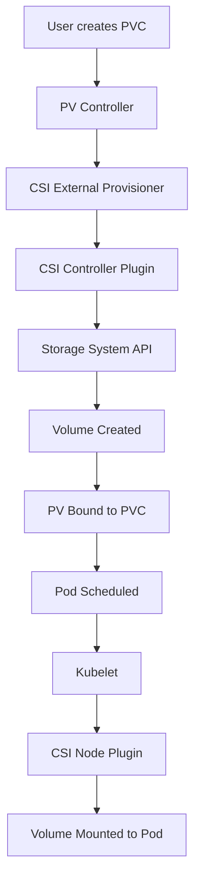

## Storage: Persistent Data in an Ephemeral World

Containers are ephemeral by design, but real applications need persistent storage. Kubernetes abstracts storage complexity through a plugin system that works with everything from local disks to cloud storage services. Let's explore how Kubernetes manages storage, starting with the architectural foundation.

### Container Storage Interface (CSI) Architecture

The Container Storage Interface (CSI) is like a universal adapter that allows any storage system to work with Kubernetes. Before CSI, each storage vendor needed to maintain code within Kubernetes itself. Now, storage providers can develop independent plugins that follow the CSI specification, making the ecosystem more flexible and maintainable.

#### CSI Components and Workflow



#### Implementing a CSI Driver

```go
// CSI Controller Service - Manages volumes at cluster level
type ControllerServer interface {
    // Volume lifecycle operations
    CreateVolume(context.Context, *CreateVolumeRequest) (*CreateVolumeResponse, error)
    DeleteVolume(context.Context, *DeleteVolumeRequest) (*DeleteVolumeResponse, error)
    
    // Snapshot operations
    CreateSnapshot(context.Context, *CreateSnapshotRequest) (*CreateSnapshotResponse, error)
    DeleteSnapshot(context.Context, *DeleteSnapshotRequest) (*DeleteSnapshotResponse, error)
    
    // Volume attachment
    ControllerPublishVolume(context.Context, *ControllerPublishVolumeRequest) (*ControllerPublishVolumeResponse, error)
    ControllerUnpublishVolume(context.Context, *ControllerUnpublishVolumeRequest) (*ControllerUnpublishVolumeResponse, error)
    
    // Capabilities
    ControllerGetCapabilities(context.Context, *ControllerGetCapabilitiesRequest) (*ControllerGetCapabilitiesResponse, error)
}

// CSI Node Service - Manages volumes on individual nodes
type NodeServer interface {
    // Node operations
    NodeStageVolume(context.Context, *NodeStageVolumeRequest) (*NodeStageVolumeResponse, error)
    NodeUnstageVolume(context.Context, *NodeUnstageVolumeRequest) (*NodeUnstageVolumeResponse, error)
    
    // Mount operations
    NodePublishVolume(context.Context, *NodePublishVolumeRequest) (*NodePublishVolumeResponse, error)
    NodeUnpublishVolume(context.Context, *NodeUnpublishVolumeRequest) (*NodeUnpublishVolumeResponse, error)
    
    // Node info
    NodeGetInfo(context.Context, *NodeGetInfoRequest) (*NodeGetInfoResponse, error)
    NodeGetCapabilities(context.Context, *NodeGetCapabilitiesRequest) (*NodeGetCapabilitiesResponse, error)
}

// Example CSI Driver Implementation
type MyCSIDriver struct {
    name     string
    nodeID   string
    version  string
    endpoint string
    
    // Storage backend client
    storageClient StorageClient
}

func (d *MyCSIDriver) CreateVolume(ctx context.Context, req *csi.CreateVolumeRequest) (*csi.CreateVolumeResponse, error) {
    // Validate request
    if req.Name == "" {
        return nil, status.Error(codes.InvalidArgument, "Volume name required")
    }
    
    // Check if volume already exists
    vol, err := d.storageClient.GetVolume(req.Name)
    if err == nil {
        return &csi.CreateVolumeResponse{Volume: vol}, nil
    }
    
    // Create volume with requested capacity
    capacity := req.CapacityRange.RequiredBytes
    vol, err = d.storageClient.CreateVolume(req.Name, capacity, req.Parameters)
    if err != nil {
        return nil, status.Errorf(codes.Internal, "Failed to create volume: %v", err)
    }
    
    return &csi.CreateVolumeResponse{
        Volume: &csi.Volume{
            VolumeId:      vol.ID,
            CapacityBytes: vol.Size,
            VolumeContext: req.Parameters,
        },
    }, nil
}
```

#### CSI Driver Deployment

```yaml
# CSI Driver DaemonSet
apiVersion: apps/v1
kind: DaemonSet
metadata:
  name: csi-driver-node
spec:
  selector:
    matchLabels:
      app: csi-driver-node
  template:
    metadata:
      labels:
        app: csi-driver-node
    spec:
      hostNetwork: true
      containers:
      - name: csi-driver
        image: myregistry/csi-driver:v1.0.0
        args:
        - "--endpoint=$(CSI_ENDPOINT)"
        - "--nodeid=$(NODE_NAME)"
        env:
        - name: CSI_ENDPOINT
          value: unix:///csi/csi.sock
        - name: NODE_NAME
          valueFrom:
            fieldRef:
              fieldPath: spec.nodeName
        volumeMounts:
        - name: plugin-dir
          mountPath: /csi
        - name: pods-mount-dir
          mountPath: /var/lib/kubelet/pods
          mountPropagation: "Bidirectional"
      - name: node-driver-registrar
        image: k8s.gcr.io/sig-storage/csi-node-driver-registrar:v2.5.0
        args:
        - "--csi-address=$(ADDRESS)"
        - "--kubelet-registration-path=$(DRIVER_REG_SOCK_PATH)"
        env:
        - name: ADDRESS
          value: /csi/csi.sock
        - name: DRIVER_REG_SOCK_PATH
          value: /var/lib/kubelet/plugins/csi-driver/csi.sock
      volumes:
      - name: plugin-dir
        hostPath:
          path: /var/lib/kubelet/plugins/csi-driver
          type: DirectoryOrCreate
      - name: pods-mount-dir
        hostPath:
          path: /var/lib/kubelet/pods
          type: Directory
```

### Understanding Storage Orchestration

Behind the scenes, Kubernetes manages storage through a sophisticated state machine that ensures data integrity and availability. This orchestration handles everything from provisioning new volumes to managing failures and ensuring data consistency across replicas. Let's peek under the hood to understand how Kubernetes keeps your data safe.

#### Volume Lifecycle State Machine

```python
from enum import Enum
from typing import Dict, List, Optional, Set
import asyncio

class VolumeState(Enum):
    PENDING = "pending"
    PROVISIONING = "provisioning"
    AVAILABLE = "available"
    BINDING = "binding"
    BOUND = "bound"
    RELEASING = "releasing"
    FAILED = "failed"
    DELETED = "deleted"

class VolumeLifecycleManager:
    """Manages volume state transitions with formal verification"""
    
    def __init__(self):
        # State transition graph
        self.transitions = {
            VolumeState.PENDING: {VolumeState.PROVISIONING, VolumeState.FAILED},
            VolumeState.PROVISIONING: {VolumeState.AVAILABLE, VolumeState.FAILED},
            VolumeState.AVAILABLE: {VolumeState.BINDING, VolumeState.DELETED},
            VolumeState.BINDING: {VolumeState.BOUND, VolumeState.AVAILABLE, VolumeState.FAILED},
            VolumeState.BOUND: {VolumeState.RELEASING},
            VolumeState.RELEASING: {VolumeState.AVAILABLE, VolumeState.DELETED, VolumeState.FAILED},
            VolumeState.FAILED: {VolumeState.DELETED},
            VolumeState.DELETED: set()
        }
        
        self.volumes: Dict[str, VolumeState] = {}
        self.state_lock = asyncio.Lock()
    
    async def transition_volume(self, volume_id: str, new_state: VolumeState) -> bool:
        """Atomically transition volume state with validation"""
        async with self.state_lock:
            current_state = self.volumes.get(volume_id, VolumeState.PENDING)
            
            # Verify transition is valid
            if new_state not in self.transitions[current_state]:
                raise ValueError(f"Invalid transition: {current_state} → {new_state}")
            
            # Perform state transition
            self.volumes[volume_id] = new_state
            
            # Trigger side effects
            await self._handle_state_change(volume_id, current_state, new_state)
            
            return True
    
    async def _handle_state_change(self, volume_id: str, 
                                  old_state: VolumeState, 
                                  new_state: VolumeState):
        """Handle side effects of state transitions"""
        if new_state == VolumeState.PROVISIONING:
            await self._provision_volume(volume_id)
        elif new_state == VolumeState.BOUND:
            await self._attach_volume(volume_id)
        elif new_state == VolumeState.DELETED:
            await self._cleanup_volume(volume_id)
```

### Advanced Storage Patterns: Building Resilient Systems

As applications scale, storage needs become more complex. Modern distributed systems require sophisticated replication strategies to ensure data availability and consistency. These patterns show how Kubernetes can orchestrate complex storage topologies that rival traditional enterprise storage systems.

#### Distributed Volume Replication

```python
import hashlib
from dataclasses import dataclass
from typing import List, Optional

@dataclass
class VolumeReplica:
    """Represents a replica of a volume"""
    node_id: str
    replica_id: str
    state: str  # primary, secondary, syncing
    last_sync: float
    checksum: str

class DistributedVolumeManager:
    """Manages distributed volume replication with consistency guarantees"""
    
    def __init__(self, replication_factor: int = 3):
        self.replication_factor = replication_factor
        self.replicas: Dict[str, List[VolumeReplica]] = {}
        self.quorum_size = (replication_factor // 2) + 1
    
    def calculate_placement(self, volume_id: str, nodes: List[str]) -> List[str]:
        """
        Deterministic replica placement using consistent hashing
        with failure domain awareness
        """
        # Sort nodes for deterministic ordering
        sorted_nodes = sorted(nodes)
        
        # Use consistent hashing for placement
        placements = []
        for i in range(self.replication_factor):
            hash_input = f"{volume_id}:{i}".encode()
            hash_value = int(hashlib.sha256(hash_input).hexdigest(), 16)
            node_index = hash_value % len(sorted_nodes)
            
            # Ensure replicas are on different nodes
            selected_node = sorted_nodes[node_index]
            attempts = 0
            while selected_node in placements and attempts < len(sorted_nodes):
                node_index = (node_index + 1) % len(sorted_nodes)
                selected_node = sorted_nodes[node_index]
                attempts += 1
            
            if selected_node not in placements:
                placements.append(selected_node)
        
        return placements[:self.replication_factor]
    
    async def write_with_quorum(self, volume_id: str, data: bytes) -> bool:
        """
        Write data to volume with quorum consensus
        """
        replicas = self.replicas.get(volume_id, [])
        if len(replicas) < self.quorum_size:
            raise ValueError(f"Insufficient replicas for quorum: {len(replicas)} < {self.quorum_size}")
        
        # Parallel writes to all replicas
        write_tasks = []
        for replica in replicas:
            if replica.state in ["primary", "secondary"]:
                write_tasks.append(self._write_to_replica(replica, data))
        
        # Wait for quorum
        results = await asyncio.gather(*write_tasks, return_exceptions=True)
        successful_writes = sum(1 for r in results if r is True)
        
        return successful_writes >= self.quorum_size
```

### Storage Performance Optimization

Storage performance can make or break application responsiveness. Kubernetes provides mechanisms to optimize I/O patterns, implement quality of service guarantees, and ensure fair resource allocation among competing workloads. These optimizations become critical when running databases and other I/O-intensive applications.

#### I/O Scheduler and Cache Management

```python
import heapq
from collections import deque
from dataclasses import dataclass, field
from typing import Deque, List, Optional

@dataclass
class IORequest:
    """Represents an I/O request with QoS parameters"""
    request_id: str
    volume_id: str
    offset: int
    length: int
    operation: str  # read, write
    priority: int
    deadline: float
    submitted_at: float
    
    def __lt__(self, other):
        # For priority queue ordering
        return self.deadline < other.deadline

class StorageScheduler:
    """
    Advanced I/O scheduler implementing deadline-aware scheduling
    with fairness guarantees
    """
    
    def __init__(self, queue_depth: int = 128):
        self.queue_depth = queue_depth
        self.pending_requests: List[IORequest] = []  # Min-heap by deadline
        self.volume_queues: Dict[str, Deque[IORequest]] = {}
        self.volume_tokens: Dict[str, int] = {}  # Token bucket for fairness
        
    def submit_request(self, request: IORequest):
        """Submit I/O request with deadline and priority"""
        # Add to priority queue
        heapq.heappush(self.pending_requests, request)
        
        # Add to per-volume queue for fairness
        if request.volume_id not in self.volume_queues:
            self.volume_queues[request.volume_id] = deque()
            self.volume_tokens[request.volume_id] = 10  # Initial tokens
        
        self.volume_queues[request.volume_id].append(request)
    
    def get_next_request(self) -> Optional[IORequest]:
        """
        Get next request using Earliest Deadline First (EDF)
        with token-based fairness
        """
        if not self.pending_requests:
            return None
        
        # Check deadline violations
        current_time = time.time()
        while self.pending_requests:
            candidate = self.pending_requests[0]
            
            # Check if volume has tokens (fairness)
            if self.volume_tokens.get(candidate.volume_id, 0) > 0:
                # Deduct token and process request
                self.volume_tokens[candidate.volume_id] -= 1
                return heapq.heappop(self.pending_requests)
            else:
                # Move to next deadline
                heapq.heappop(self.pending_requests)
                heapq.heappush(self.pending_requests, candidate)
                break
        
        # Replenish tokens periodically
        self._replenish_tokens()
        
        return None
    
    def _replenish_tokens(self):
        """Token bucket algorithm for fairness"""
        for volume_id in self.volume_tokens:
            self.volume_tokens[volume_id] = min(
                self.volume_tokens[volume_id] + 1,
                10  # Max tokens
            )
```

### Storage Classes: Defining Your Storage Tiers

Just as cloud providers offer different storage tiers (standard, premium, archive), Kubernetes Storage Classes let you define different categories of storage with varying performance characteristics, redundancy levels, and features. This abstraction allows developers to request storage by characteristics rather than specific implementations.

```yaml
apiVersion: storage.k8s.io/v1
kind: StorageClass
metadata:
  name: high-performance-replicated
provisioner: csi.storage.k8s.io/advanced-driver
parameters:
  # Performance tier
  type: nvme-ssd
  iops: "50000"
  throughput: "1000Mi"
  
  # Replication settings
  replicationFactor: "3"
  replicationMode: "synchronous"  # synchronous, asynchronous
  consistencyLevel: "strong"      # strong, eventual
  
  # Data protection
  encryption: "aes-256-gcm"
  checksumAlgorithm: "crc32c"
  
  # Advanced features
  deduplication: "true"
  compression: "lz4"
  snapshotSchedule: "0 */6 * * *"  # Every 6 hours
  
  # QoS settings
  qosClass: "guaranteed"
  minIOPS: "10000"
  maxIOPS: "50000"
  burstDuration: "60s"
  
reclaimPolicy: Retain
allowVolumeExpansion: true
volumeBindingMode: WaitForFirstConsumer
```

### Volume Snapshots: Point-in-Time Backups

Snapshots provide point-in-time copies of volumes, essential for backup strategies and data protection. The Volume Snapshot Controller manages this lifecycle, coordinating with storage providers to create, manage, and restore from snapshots. Here's how this controller orchestrates snapshot operations:

```go
// VolumeSnapshotController manages snapshot lifecycle
type VolumeSnapshotController struct {
    client           kubernetes.Interface
    snapshotClient   snapclient.Interface
    csiClient        csi.ControllerClient
    queue            workqueue.RateLimitingInterface
    snapshotStore    cache.Store
    volumeStore      cache.Store
}

func (c *VolumeSnapshotController) syncSnapshot(key string) error {
    namespace, name, err := cache.SplitMetaNamespaceKey(key)
    if err != nil {
        return err
    }
    
    snapshot, err := c.snapshotStore.Get(key)
    if err != nil {
        return err
    }
    
    vs := snapshot.(*v1.VolumeSnapshot)
    
    switch vs.Status.Phase {
    case v1.SnapshotPending:
        return c.createSnapshot(vs)
    case v1.SnapshotCreating:
        return c.checkSnapshotStatus(vs)
    case v1.SnapshotReady:
        return c.bindSnapshotContent(vs)
    case v1.SnapshotFailed:
        return c.handleSnapshotFailure(vs)
    }
    
    return nil
}

func (c *VolumeSnapshotController) createSnapshot(vs *v1.VolumeSnapshot) error {
    // Get source PVC
    pvc, err := c.getPVC(vs.Spec.Source.PersistentVolumeClaimName, vs.Namespace)
    if err != nil {
        return err
    }
    
    // Get CSI driver from PV
    pv, err := c.getPV(pvc.Spec.VolumeName)
    if err != nil {
        return err
    }
    
    // Create snapshot via CSI
    req := &csi.CreateSnapshotRequest{
        SourceVolumeId: pv.Spec.CSI.VolumeHandle,
        Name:          vs.Name,
        Parameters:    vs.Spec.Parameters,
    }
    
    resp, err := c.csiClient.CreateSnapshot(context.TODO(), req)
    if err != nil {
        return c.updateSnapshotStatus(vs, v1.SnapshotFailed, err.Error())
    }
    
    // Update status
    return c.updateSnapshotStatus(vs, v1.SnapshotCreating, resp.Snapshot.SnapshotId)
}
```

## Configuration Management: Fine-Tuning Your Applications

Running applications efficiently in Kubernetes requires careful resource management and configuration. Let's explore how to ensure your applications get the resources they need while preventing any single application from monopolizing the cluster.

### Resource Management: The Right-Sized Container

Just like you wouldn't use a semi-truck for grocery shopping or a bicycle for moving furniture, containers need appropriately sized resource allocations. Resource requests and limits help Kubernetes make intelligent scheduling decisions and prevent resource starvation.

**Resource Requests and Limits:**
```yaml
apiVersion: v1
kind: Pod
metadata:
  name: resource-demo
spec:
  containers:
  - name: app
    image: myapp:latest
    resources:
      requests:
        memory: "256Mi"
        cpu: "500m"
      limits:
        memory: "512Mi"
        cpu: "1000m"
```

### Horizontal Pod Autoscaling: Responding to Load

Traffic patterns are rarely constant. Horizontal Pod Autoscaling (HPA) automatically adjusts the number of pod replicas based on observed metrics like CPU usage or custom metrics from your application. It's like having an intelligent traffic controller that adds more lanes during rush hour and removes them when traffic is light.

```yaml
apiVersion: autoscaling/v2
kind: HorizontalPodAutoscaler
metadata:
  name: app-hpa
spec:
  scaleTargetRef:
    apiVersion: apps/v1
    kind: Deployment
    name: app-deployment
  minReplicas: 3
  maxReplicas: 10
  metrics:
  - type: Resource
    resource:
      name: cpu
      target:
        type: Utilization
        averageUtilization: 70
  - type: Resource
    resource:
      name: memory
      target:
        type: Utilization
        averageUtilization: 80
```

### Vertical Pod Autoscaling: Right-Sizing Resources

While HPA adds more pods, Vertical Pod Autoscaling (VPA) adjusts the resource requests and limits of individual pods based on actual usage. Think of it as an intelligent resource manager that learns from your application's behavior and continuously optimizes resource allocation.

```yaml
apiVersion: autoscaling.k8s.io/v1
kind: VerticalPodAutoscaler
metadata:
  name: app-vpa
spec:
  targetRef:
    apiVersion: apps/v1
    kind: Deployment
    name: app-deployment
  updatePolicy:
    updateMode: "Auto"
```

## Security: Protecting Your Cluster and Applications

Kubernetes security is multi-layered, protecting everything from cluster access to pod-to-pod communication. Let's explore the key security features that help you build defense in depth.

### Role-Based Access Control (RBAC): Who Can Do What

RBAC implements the principle of least privilege by defining who can perform which actions on what resources. It's like having a sophisticated keycard system where each person only has access to the rooms they need for their job.

**Role Definition:**
```yaml
apiVersion: rbac.authorization.k8s.io/v1
kind: Role
metadata:
  namespace: default
  name: pod-reader
rules:
- apiGroups: [""]
  resources: ["pods"]
  verbs: ["get", "watch", "list"]
```

**RoleBinding:**
```yaml
apiVersion: rbac.authorization.k8s.io/v1
kind: RoleBinding
metadata:
  name: read-pods
  namespace: default
subjects:
- kind: User
  name: jane
  apiGroup: rbac.authorization.k8s.io
roleRef:
  kind: Role
  name: pod-reader
  apiGroup: rbac.authorization.k8s.io
```

### Pod Security Standards: Container Hardening

Running containers with root privileges or unnecessary capabilities is like leaving your house doors unlocked. Pod Security Standards enforce security best practices at the pod level, ensuring containers run with minimal privileges and follow security hardening guidelines.

**Pod Security Policy Example:**
```yaml
apiVersion: policy/v1beta1
kind: PodSecurityPolicy
metadata:
  name: restricted
spec:
  privileged: false
  allowPrivilegeEscalation: false
  requiredDropCapabilities:
    - ALL
  volumes:
    - 'configMap'
    - 'emptyDir'
    - 'projected'
    - 'secret'
    - 'downwardAPI'
    - 'persistentVolumeClaim'
  runAsUser:
    rule: 'MustRunAsNonRoot'
  seLinux:
    rule: 'RunAsAny'
  fsGroup:
    rule: 'RunAsAny'
```

### Service Accounts: Identity for Applications

Just as users need identities to access the cluster, applications need service accounts to interact with the Kubernetes API. Service accounts provide a way for pods to authenticate and authorize their actions, enabling sophisticated automation and integration patterns.

```yaml
apiVersion: v1
kind: ServiceAccount
metadata:
  name: app-service-account
  namespace: default
---
apiVersion: apps/v1
kind: Deployment
metadata:
  name: app-deployment
spec:
  template:
    spec:
      serviceAccountName: app-service-account
      containers:
      - name: app
        image: myapp:latest
```

## Observability: Knowing Your Applications' Health

You can't fix what you can't see. Kubernetes provides comprehensive observability features that help you understand application health, troubleshoot issues, and ensure reliability. Let's explore how to make your applications observable and debuggable.

### Liveness and Readiness Probes: Health Checks That Matter

Probes are like regular medical checkups for your applications. Liveness probes detect when an application is broken and needs restarting, while readiness probes determine when an application is ready to receive traffic. Together, they ensure only healthy instances serve requests.

```yaml
apiVersion: v1
kind: Pod
metadata:
  name: app-pod
spec:
  containers:
  - name: app
    image: myapp:latest
    livenessProbe:
      httpGet:
        path: /health
        port: 8080
      initialDelaySeconds: 30
      periodSeconds: 10
    readinessProbe:
      httpGet:
        path: /ready
        port: 8080
      initialDelaySeconds: 5
      periodSeconds: 5
```

### Monitoring with Prometheus: Metrics That Drive Decisions

Prometheus has become the de facto standard for Kubernetes monitoring, providing a powerful time-series database and query language. By exposing metrics from your applications and using ServiceMonitors, you create a comprehensive monitoring system that can alert on issues before users notice them.

**ServiceMonitor Example:**
```yaml
apiVersion: monitoring.coreos.com/v1
kind: ServiceMonitor
metadata:
  name: app-metrics
spec:
  selector:
    matchLabels:
      app: myapp
  endpoints:
  - port: metrics
    interval: 30s
    path: /metrics
```

