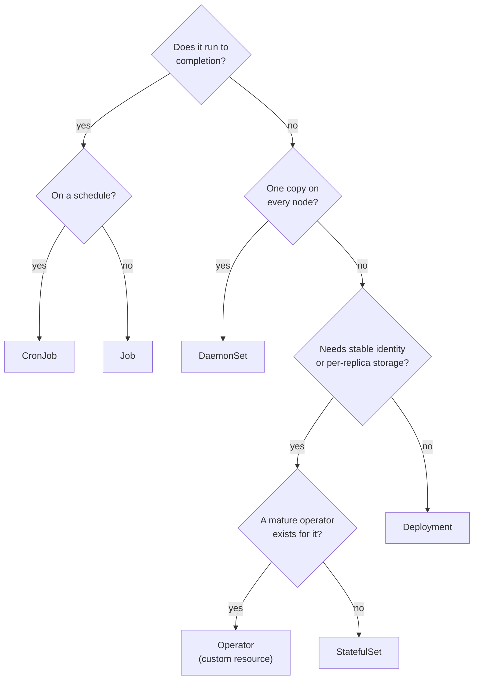
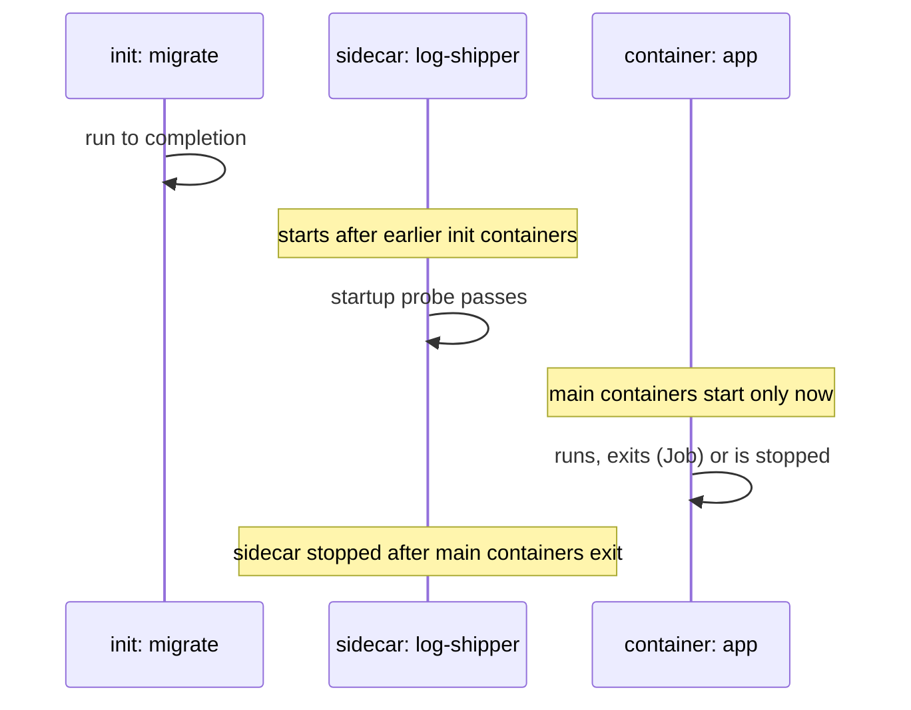
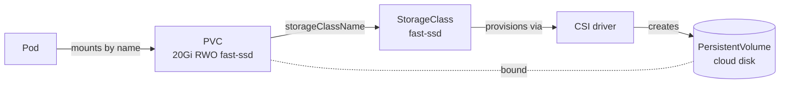
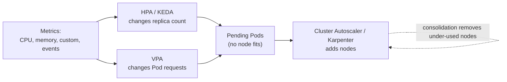

[Kubernetes](./) &raquo; Workloads & Storage

Kubernetes runs applications through **workload controllers**: API objects that create and replace Pods to match a declared shape. This page covers the controllers beyond the Deployment (StatefulSet, DaemonSet, Job, CronJob, and native sidecar containers), gives an overview of volumes and persistent storage, and describes the machinery around a running workload: vertical and node autoscaling, Pod security, and health signals. Feature stages are given as of Kubernetes v1.37 (August 2026).

Related pages go deeper: [Fundamentals](fundamentals.html) covers Pods, ReplicaSets, and Deployments; [Stateful Workloads & Persistence](persistence.html) is the storage and StatefulSet reference; [Health & Resource Management](fundamentals-resources.html) covers probes, requests and limits, QoS, and the Horizontal Pod Autoscaler.

## Choosing a Workload Controller

Every controller manages Pods from a template; they differ in *how many* Pods, *where*, and *for how long*.

| Controller | Runs | Pod identity | Typical workloads |
|------------|------|--------------|-------------------|
| **Deployment** | N interchangeable replicas, indefinitely | Random names, no per-Pod storage | Web services, APIs, stateless workers |
| **StatefulSet** | N ordered replicas, indefinitely | Stable names (`db-0`, `db-1`) and per-Pod volumes | Databases, brokers, consensus systems |
| **DaemonSet** | One Pod per (selected) node | Tied to its node | Log shippers, metrics agents, CNI and CSI node plugins |
| **Job** | Pods until a number of completions succeed | Optional completion index | Batch processing, migrations, ML training |
| **CronJob** | A Job on a schedule | Per run | Backups, reports, periodic clean-up |


```mermaid
flowchart TD
    Q1{"Does it run to<br/>completion?"} -- yes --> Q2{"On a schedule?"}
    Q2 -- yes --> CJ[CronJob]
    Q2 -- no --> J[Job]
    Q1 -- no --> Q3{"One copy on<br/>every node?"}
    Q3 -- yes --> DS[DaemonSet]
    Q3 -- no --> Q4{"Needs stable identity<br/>or per-replica storage?"}
    Q4 -- yes --> Q5{"A mature operator<br/>exists for it?"}
    Q5 -- yes --> OP["Operator<br/>(custom resource)"]
    Q5 -- no --> SS[StatefulSet]
    Q4 -- no --> D[Deployment]
```

A bare Pod has no controller: if its node fails, nothing recreates it. Use bare Pods only for one-off debugging.

## StatefulSets

A StatefulSet gives each replica a stable name, a stable DNS entry through a headless Service, and its own PersistentVolumeClaim created from a `volumeClaimTemplate`. Pods are created in ordinal order and, by default, updated one at a time from the highest ordinal down. Recent additions include `maxUnavailable` for faster rolling updates (beta, enabled by default in v1.37), automatic PVC clean-up on scale-down or deletion (`persistentVolumeClaimRetentionPolicy`, stable since v1.32), and a `Recreate` update strategy (alpha in v1.37).

For production databases, prefer an **operator** (CloudNativePG, Strimzi, and similar) that understands the software's failover and backup procedures; some of them manage Pods directly rather than through a StatefulSet. The full treatment, including ordering guarantees, stuck rollouts, headless Services, and backup, is in [Stateful Workloads & Persistence](persistence.html#statefulsets-identity-storage-and-ordering).

## DaemonSets

A **DaemonSet** runs one copy of a Pod on every node, or on every node matching a `nodeSelector` or node affinity. When a node joins the cluster it receives the Pod; when the node leaves, the Pod is garbage-collected. DaemonSets are how node-level infrastructure is deployed: log collectors, metrics exporters, the kube-proxy and CNI agents, CSI node plugins, and security sensors.

```yaml
apiVersion: apps/v1
kind: DaemonSet
metadata:
  name: log-agent
  namespace: logging
spec:
  selector:
    matchLabels:
      app: log-agent
  updateStrategy:
    type: RollingUpdate
    rollingUpdate:
      maxUnavailable: 10%    # update 10% of nodes at a time
  template:
    metadata:
      labels:
        app: log-agent
    spec:
      priorityClassName: system-node-critical   # evicted last under pressure
      tolerations:
      - operator: Exists                          # run on tainted nodes too
      containers:
      - name: fluent-bit
        image: fluent/fluent-bit:5.1
        resources:
          requests: {cpu: 50m, memory: 64Mi}
          limits: {memory: 256Mi}
        volumeMounts:
        - name: varlog
          mountPath: /var/log
          readOnly: true
      volumes:
      - name: varlog
        hostPath:
          path: /var/log
```

Points specific to DaemonSets:

- **Scheduling.** DaemonSet Pods are placed by the default scheduler (with node affinity pinning each Pod to its node), and the controller automatically adds tolerations for conditions such as `not-ready`, `unreachable`, and `disk-pressure`, so agents keep running on unhealthy nodes. Tolerating *all* taints, as above, is appropriate for true infrastructure agents and wrong for ordinary applications.
- **Updates.** `RollingUpdate` replaces Pods node by node, governed by `maxUnavailable`. Setting `maxSurge` instead starts the new Pod before stopping the old one on each node, which avoids a gap in coverage for agents that can briefly run twice. `OnDelete` updates a node only when its Pod is deleted manually.
- **Resource cost multiplies.** A request of 100m CPU is 100m on *every* node. Keep agent requests small and set a memory limit, because a leaking agent on every node degrades the whole cluster at once.
- **Priority.** Give node-critical agents a high `priorityClassName` so the kubelet evicts them last under resource pressure.

## Jobs

A **Job** runs Pods until a specified number complete successfully, retrying failures up to a limit. Where a Deployment keeps Pods running, a Job is done when its work is done.

| Field | Meaning | Default |
|-------|---------|---------|
| `completions` | Successful Pods required for the Job to succeed | 1 |
| `parallelism` | Maximum Pods running at once | 1 |
| `completionMode` | `NonIndexed`, or `Indexed`: each Pod gets a completion index (0 to completions−1) in the `JOB_COMPLETION_INDEX` env var and a stable hostname | `NonIndexed` |
| `backoffLimit` | Pod failures tolerated before the Job fails, with exponential back-off between retries | 6 |
| `backoffLimitPerIndex` | Retry budget per index in Indexed Jobs, so one bad shard cannot consume the whole budget (stable since v1.33) | unset |
| `podFailurePolicy` | Rules on exit codes and Pod conditions: `FailJob`, `FailIndex`, `Ignore`, or `Count` (stable since v1.31) | unset |
| `successPolicy` | Declare success early, for example when index 0 (a leader) succeeds (stable since v1.33) | all completions |
| `podReplacementPolicy` | `Failed`: start a replacement only once the old Pod has fully terminated, avoiding two copies at once (stable since v1.34) | `TerminatingOrFailed` |
| `activeDeadlineSeconds` | Wall-clock limit for the whole Job | none |
| `ttlSecondsAfterFinished` | Delete the finished Job and its Pods after this many seconds | none (kept forever) |
| `suspend` | Pause the Job (no new Pods); used by batch queueing systems such as Kueue | false |

An Indexed Job that processes 100 shards, ten at a time, fails fast on a known bad exit code, and does not count node disruptions against its retry budget:

```yaml
apiVersion: batch/v1
kind: Job
metadata:
  name: reindex-shards
spec:
  completions: 100
  parallelism: 10
  completionMode: Indexed
  backoffLimitPerIndex: 2           # each shard may fail twice
  maxFailedIndexes: 5               # give up if more than 5 shards fail
  ttlSecondsAfterFinished: 86400
  podFailurePolicy:
    rules:
    - action: FailIndex             # exit 42 = bad input; don't retry this shard
      onExitCodes:
        containerName: worker
        operator: In
        values: [42]
    - action: Ignore                # preemption, drain, eviction: retry for free
      onPodConditions:
      - type: DisruptionTarget
  template:
    spec:
      restartPolicy: Never          # required by podFailurePolicy
      containers:
      - name: worker
        image: registry.example.com/reindexer:3.2
        args: ["--shard=$(JOB_COMPLETION_INDEX)"]
        resources:
          requests: {cpu: "1", memory: 2Gi}
          limits: {memory: 2Gi}
```

`restartPolicy: OnFailure` restarts failed containers in place instead of creating new Pods; it is simpler, but the Pod-level policies above require `Never`. For large-scale batch and ML training, projects such as **Kueue** (quota and queueing), **JobSet** (groups of related Jobs, e.g. leader plus workers), and the Kubeflow Trainer build on the Job API rather than replacing it.

## CronJobs

A **CronJob** creates a Job on a cron schedule. The controller is simple, but most production incidents with CronJobs come from its concurrency and missed-run semantics.

```yaml
apiVersion: batch/v1
kind: CronJob
metadata:
  name: nightly-backup
spec:
  schedule: "30 2 * * *"            # 02:30 every day
  timeZone: "Europe/London"          # IANA zone; stable since v1.27
  concurrencyPolicy: Forbid          # skip a run if the previous is still going
  startingDeadlineSeconds: 600       # a run more than 10 min late is skipped
  successfulJobsHistoryLimit: 3
  failedJobsHistoryLimit: 5
  jobTemplate:
    spec:
      backoffLimit: 2
      activeDeadlineSeconds: 3600
      template:
        spec:
          restartPolicy: Never
          containers:
          - name: backup
            image: registry.example.com/pg-backup:1.8
```

| Field | Options and behaviour |
|-------|----------------------|
| `concurrencyPolicy` | `Allow` (default): runs may overlap. `Forbid`: skip the new run while one is active. `Replace`: kill the running Job and start the new one |
| `startingDeadlineSeconds` | How late a run may start (after controller downtime, say). Without it, a controller that has missed more than 100 schedules stops scheduling and logs an error |
| `timeZone` | Interpret `schedule` in an IANA time zone instead of the controller's local zone. Runs at times skipped or repeated by daylight-saving changes may be skipped or doubled; schedule around 01:00–03:00 local time with care |
| `suspend` | Stop creating new Jobs without deleting the CronJob |

CronJobs guarantee *at least* one Job per schedule "most of the time": in rare cases a run can be created twice or not at all. Make scheduled work **idempotent**.

## Sidecar Containers

A **sidecar** is a helper container that runs alongside the main container for the Pod's whole life: a log shipper, a service-mesh proxy, a secrets refresher. Before native support, sidecars were ordinary containers, which caused well-known bugs: a Job never completed because its proxy sidecar never exited, and the main container started before its proxy was ready.

**Native sidecars** (stable since v1.33) are declared as init containers with `restartPolicy: Always`:

```yaml
spec:
  initContainers:
  - name: migrate                  # ordinary init container: runs to completion first
    image: registry.example.com/app:4.1
    command: ["./migrate"]
  - name: log-shipper              # native sidecar
    image: fluent/fluent-bit:5.1
    restartPolicy: Always
    startupProbe:                  # main containers wait until this passes
      httpGet: {path: /api/v1/health, port: 2020}
  containers:
  - name: app
    image: registry.example.com/app:4.1
```


```mermaid
sequenceDiagram
    participant I as init: migrate
    participant S as sidecar: log-shipper
    participant A as container: app
    I->>I: run to completion
    Note over S: starts after earlier init containers
    S->>S: startup probe passes
    Note over A: main containers start only now
    A->>A: runs, exits (Job) or is stopped
    Note over S: sidecar stopped after main containers exit
```

Native sidecars start in order before the main containers, are restarted independently if they crash, do not block Job completion, and are terminated *after* the main containers during shutdown, so logs and proxied connections drain cleanly. Patterns built on sidecars (adapters, ambassadors, init-time configuration) are covered in [Operations](operations.html#multi-container-pod-patterns).

## Storage at a Glance

Container filesystems are ephemeral: when a container restarts, anything it wrote to its own filesystem is gone. **Volumes** attach storage to a Pod with a defined lifetime.

| Volume type | Lifetime | Use for |
|-------------|----------|---------|
| `emptyDir` | The Pod (survives container restarts) | Scratch space, caches, sharing files between containers; `medium: Memory` for tmpfs |
| `configMap`, `secret`, `downwardAPI`, `projected` | The Pod; content updated from the API | Configuration files, credentials, Pod metadata, bound service-account tokens |
| `image` | The Pod; read-only | Mounting an OCI image or artifact (model weights, static data) without baking it into the app image (stable since v1.36) |
| Generic ephemeral volume | The Pod; provisioned through a StorageClass | Large per-Pod scratch space that the node disk cannot provide |
| `persistentVolumeClaim` | Independent of any Pod | Durable data: databases, uploads, queues |
| `hostPath` | The node | Node agents only; a security risk for ordinary workloads |

### Persistent Volumes

Durable storage uses three objects. A **PersistentVolumeClaim (PVC)** is a namespaced request ("20 GiB, ReadWriteOnce, class `fast-ssd`"). A **StorageClass** tells a **CSI driver** how to create a matching **PersistentVolume (PV)** on demand. The PVC binds to the PV, and the Pod mounts the PVC by name.


```mermaid
flowchart LR
    Pod[Pod] -->|mounts by name| PVC["PVC<br/>20Gi RWO fast-ssd"]
    PVC -->|storageClassName| SC["StorageClass<br/>fast-ssd"]
    SC -->|provisions via| CSI[CSI driver]
    CSI -->|creates| PV[("PersistentVolume<br/>cloud disk")]
    PVC -.-|bound| PV
```

| Access mode | Meaning | Backed by |
|-------------|---------|-----------|
| ReadWriteOnce (RWO) | Read-write from one **node** | Block storage (EBS, Persistent Disk, Azure Disk) |
| ReadWriteOncePod (RWOP) | Read-write from exactly one **Pod** | CSI block storage |
| ReadOnlyMany (ROX) | Read-only from many nodes | File storage, cloned volumes |
| ReadWriteMany (RWX) | Read-write from many nodes | File storage (EFS, Azure Files, Filestore, NFS, CephFS) |

| CSI drivers | |
|-------------|---|
| AWS | EBS CSI (`ebs.csi.aws.com`), EFS CSI, FSx CSI |
| Google Cloud | Persistent Disk CSI (`pd.csi.storage.gke.io`), Filestore CSI |
| Azure | Azure Disk CSI (`disk.csi.azure.com`), Azure Files CSI |
| Self-managed | Rook-Ceph, Longhorn, OpenEBS, vendor arrays |

### Troubleshooting Claims

| Symptom | Usual cause | Check |
|---------|-------------|-------|
| PVC `Pending` | No default StorageClass; class name typo; RWX requested from block storage; `WaitForFirstConsumer` waiting for a Pod (normal) | `kubectl describe pvc`, events from the provisioner |
| Pod `ContainerCreating`, `FailedAttachVolume` | Volume still attached to a failed node; zone mismatch; node's volume-attachment limit reached | `kubectl describe pod`, `kubectl get volumeattachment` |
| PVC stuck `Terminating` | `kubernetes.io/pvc-protection` finalizer: a Pod still uses it | Find and delete the Pod using the claim |
| PV `Released` | PVC deleted under a `Retain` policy; data kept on purpose | Reuse by clearing `spec.claimRef`, or delete deliberately |

Reclaim policies, volume expansion, VolumeAttributesClass, snapshots, and backup strategy are covered in [Stateful Workloads & Persistence](persistence.html).

## Scaling Workloads

Kubernetes scales at three layers, and production clusters usually combine them: more Pods, bigger Pods, and more nodes to put them on.


```mermaid
flowchart LR
    M[Metrics:<br/>CPU, memory, custom, events] --> HPA["HPA / KEDA<br/>changes replica count"]
    M --> VPA["VPA<br/>changes Pod requests"]
    HPA --> P["Pending Pods<br/>(no node fits)"]
    VPA --> P
    P --> NA["Cluster Autoscaler / Karpenter<br/>adds nodes"]
    NA -.->|consolidation removes under-used nodes| NA
```

### Horizontal: More Replicas

The **HorizontalPodAutoscaler** adjusts `replicas` on a Deployment or StatefulSet from observed metrics; its algorithm, metric types, and stabilisation behaviour are covered in [Health & Resource Management](fundamentals-resources.html#horizontal-pod-autoscaling). Two recent changes: a per-HPA **tolerance** (`behavior.scaleUp.tolerance`, `behavior.scaleDown.tolerance`) replaces the fixed cluster-wide 10% dead band (stable in v1.37), and `minReplicas: 0` for HPAs driven by custom or external metrics is beta and enabled by default in v1.37. **KEDA** extends horizontal scaling to event sources such as queue depth, Kafka lag, or cron windows, and has long supported scale-to-zero.

### Vertical: Bigger Pods

The **Vertical Pod Autoscaler** (an add-on from the Kubernetes autoscaler project, not part of the core) watches actual usage and recommends or applies CPU and memory *requests*.

```yaml
apiVersion: autoscaling.k8s.io/v1
kind: VerticalPodAutoscaler
metadata:
  name: api-vpa
spec:
  targetRef:
    apiVersion: apps/v1
    kind: Deployment
    name: api
  updatePolicy:
    updateMode: InPlaceOrRecreate   # resize running Pods; evict only if that fails
  resourcePolicy:
    containerPolicies:
    - containerName: "*"
      controlledResources: ["memory"]   # leave CPU to the HPA
      minAllowed: {memory: 128Mi}
      maxAllowed: {memory: 4Gi}
```

| `updateMode` | Behaviour |
|--------------|-----------|
| `Off` | Recommendations only, in the VPA's status. A safe way to right-size by hand |
| `Initial` | Apply requests only when Pods are created |
| `Recreate` | Evict Pods whose requests differ significantly from the recommendation (respecting PodDisruptionBudgets) |
| `InPlaceOrRecreate` | Resize running Pods in place, falling back to eviction (generally available since VPA 1.6) |
| `Auto` | Deprecated; currently equivalent to `Recreate`. Use an explicit mode |

Do not let an HPA and a VPA act on the same resource: the VPA raises CPU requests, which lowers utilisation, which makes the HPA scale in. A common split is HPA on CPU (or a custom metric) and VPA on memory.

### In-Place Pod Resize

Since v1.35, CPU and memory requests and limits of a *running* Pod can be changed without recreating it (in-place Pod vertical scaling, stable). The change is made through the Pod's `resize` subresource, and each container's `resizePolicy` states whether a change needs a container restart:

```yaml
spec:
  containers:
  - name: api
    image: registry.example.com/api:2.7
    resizePolicy:
    - resourceName: cpu
      restartPolicy: NotRequired        # CPU changes apply live via cgroups
    - resourceName: memory
      restartPolicy: RestartContainer   # e.g. a JVM that sizes its heap at start
    resources:
      requests: {cpu: 500m, memory: 1Gi}
      limits: {memory: 1Gi}
```

```bash
kubectl patch pod api-7d9c5 --subresource resize --patch \
  '{"spec":{"containers":[{"name":"api","resources":{"requests":{"cpu":"1"}}}]}}'
kubectl get pod api-7d9c5 -o jsonpath='{.status.containerStatuses[0].resources}'
```

If the node lacks room, the resize is reported as `PodResizePending` (deferred or infeasible) rather than evicting anything. A resize cannot change the Pod's QoS class. Editing a Deployment's template still triggers a normal rollout; in-place resize acts on individual Pods and is mainly used by the VPA and by platform tooling. Pod-level `resources` (a budget shared by all containers in the Pod) is beta and enabled by default since v1.34.

### Nodes: Cluster Autoscaler and Karpenter

When Pods are `Pending` because no node has room, a node autoscaler adds capacity; when nodes are under-used, it drains and removes them.

| | Cluster Autoscaler | Karpenter |
|---|---|---|
| Model | Resizes predefined node groups (ASGs, managed node pools) | Launches individual instances chosen to fit the pending Pods |
| Instance choice | Fixed per node group | Any type allowed by a `NodePool` (families, sizes, Spot or On-Demand, architectures) |
| Scale-down | Removes nodes below a utilisation threshold | **Consolidation**: replaces or removes nodes to pack workloads more cheaply |
| Availability | All major clouds | AWS (open source, v1 API since 2024); Azure as AKS node auto-provisioning; other providers through community integrations |

Both honour PodDisruptionBudgets when removing nodes, so every production workload that must stay available during node churn needs a PDB.

## Workload Security

### Pod Security Standards

The built-in **Pod Security Admission** controller (stable since v1.25, replacing the removed PodSecurityPolicy) enforces three profiles per namespace:

| Profile | Allows | Intended for |
|---------|--------|--------------|
| **Privileged** | Everything | System components, node agents, CNI and CSI plugins |
| **Baseline** | Blocks known privilege escalations: host namespaces, privileged containers, `hostPath`, added dangerous capabilities | Most applications with little change |
| **Restricted** | Baseline plus: must run as non-root, drop all capabilities, no privilege escalation, seccomp `RuntimeDefault` or `Localhost` | Security-sensitive and multi-tenant workloads |

Each namespace can set a profile in three modes: `enforce` rejects violating Pods, `audit` records them in the audit log, and `warn` returns a warning to the client. Rolling out `warn` and `audit` first reveals offenders without breaking deployments.

```yaml
apiVersion: v1
kind: Namespace
metadata:
  name: payments
  labels:
    pod-security.kubernetes.io/enforce: restricted
    pod-security.kubernetes.io/enforce-version: v1.37   # pin the policy version
    pod-security.kubernetes.io/warn: restricted
    pod-security.kubernetes.io/audit: restricted
```

A container spec that passes the `restricted` profile:

```yaml
spec:
  securityContext:
    runAsNonRoot: true
    runAsUser: 10001
    fsGroup: 10001
    seccompProfile:
      type: RuntimeDefault
  containers:
  - name: api
    image: registry.example.com/api:2.7
    securityContext:
      allowPrivilegeEscalation: false
      readOnlyRootFilesystem: true      # not required by the profile, but recommended
      capabilities:
        drop: ["ALL"]
```

For stronger isolation, **user namespaces** (`hostUsers: false` in the Pod spec, stable since v1.36) map the container's root user to an unprivileged user on the host, so a container escape does not yield host root. Policy beyond the three profiles, such as required labels, allowed registries, or signed images, is enforced with **ValidatingAdmissionPolicy** (CEL expressions, built in since v1.30) or with Kyverno or OPA Gatekeeper.

### Service Accounts and API Access

Every Pod runs as a **ServiceAccount**. Give each application its own, grant it the narrowest RBAC Role it needs, and turn off the API token for Pods that never call the Kubernetes API:

```yaml
apiVersion: v1
kind: ServiceAccount
metadata:
  name: api
  namespace: payments
automountServiceAccountToken: false
```

Mounted tokens are short-lived, audience-bound, and rotated by the kubelet; long-lived Secret-based tokens are no longer created automatically. Cloud workload-identity features (EKS Pod Identity and IRSA, GKE Workload Identity Federation, AKS Workload Identity) exchange these tokens for cloud credentials, so no static cloud keys need to be stored in Secrets. Roles, bindings, and least-privilege design are covered in [Networking & Configuration](fundamentals-networking.html#rbac-and-serviceaccounts).

**Secrets are not encrypted by default.** Base64 in a Secret manifest is an encoding, not encryption, and etcd stores Secrets in plain text unless encryption at rest is configured (KMS v2, stable since v1.29, or the managed equivalent enabled on the cluster). Restrict `get`/`list` on Secrets through RBAC, and consider an external store (a cloud secrets manager via the External Secrets Operator or the Secrets Store CSI driver) for high-value credentials.

## Observability: Understanding Application Health

Kubernetes acts on three health signals that each container can expose:

| Probe | Question | On failure |
|-------|----------|------------|
| **Startup** | Has the application finished starting? | Other probes wait; after `failureThreshold` the container is restarted |
| **Liveness** | Is the process stuck beyond recovery? | Container restarted |
| **Readiness** | Can it serve traffic right now? | Removed from Service endpoints; not restarted |

```yaml
startupProbe:
  httpGet: {path: /healthz, port: 8080}
  periodSeconds: 5
  failureThreshold: 30        # allow up to 150 s to boot
livenessProbe:
  httpGet: {path: /healthz, port: 8080}
  periodSeconds: 10
  timeoutSeconds: 2
  failureThreshold: 3
readinessProbe:
  httpGet: {path: /ready, port: 8080}
  periodSeconds: 5
```

Keep liveness checks shallow (the process itself, not its database) so that a slow dependency does not trigger restarts across every replica; express dependency health through readiness instead. Probe mechanics and design guidance are covered in [Health & Resource Management](fundamentals-resources.html#probes).

Beyond probes, workloads expose metrics for Prometheus. With the Prometheus Operator, a `ServiceMonitor` declares what to scrape:

```yaml
apiVersion: monitoring.coreos.com/v1
kind: ServiceMonitor
metadata:
  name: api
  labels:
    release: prometheus        # must match the Prometheus instance's selector
spec:
  selector:
    matchLabels:
      app: api
  endpoints:
  - port: metrics              # a named port on the Service
    interval: 30s
```

For request-driven services, alert on the **RED** signals (request rate, error rate, duration); for resources such as nodes and queues, on the **USE** signals (utilisation, saturation, errors). Metrics pipelines, logging, tracing with OpenTelemetry, and alerting are covered in [Operations](operations.html#observability).

## Common Pitfalls

| Pitfall | Consequence | Remedy |
|---------|-------------|--------|
| No memory limit | One leaking Pod pushes the node into memory pressure and evictions | Set memory limits (commonly equal to requests) |
| Tight CPU limits on latency-sensitive services | Throttling even when the node is idle | Set CPU requests; use CPU limits sparingly |
| CronJob work that is not idempotent | Duplicate or missed runs corrupt data | Design for at-least-once; use `concurrencyPolicy: Forbid` |
| Jobs without `ttlSecondsAfterFinished` | Thousands of finished Jobs and Pods clutter the API | Set a TTL or history limits |
| Proxy sidecar as a regular container in a Job | Job never completes | Use a native sidecar (`restartPolicy: Always` init container) |
| HPA and VPA on the same resource | Autoscalers fight | Split resources, or use VPA in `Off` mode for recommendations |
| No PodDisruptionBudget | Node drains and autoscaler consolidation take down all replicas | Define a PDB for every service that must stay available |
| Assuming Secrets are encrypted | Credentials readable from etcd or backups | Enable encryption at rest; restrict RBAC; use an external store |
| Deep liveness checks | Dependency outage restarts every replica | Liveness checks the process only; readiness checks dependencies |

## See Also

- [Fundamentals](fundamentals.html): Pods, ReplicaSets, Deployments, and cluster architecture
- [Networking & Configuration](fundamentals-networking.html): Services, Ingress, network policies, ConfigMaps, Secrets, and RBAC
- [Health & Resource Management](fundamentals-resources.html): probes, requests and limits, QoS, scheduling, and the HPA
- [Stateful Workloads & Persistence](persistence.html): storage in depth, StatefulSets, and backup
- [Operations](operations.html): kubectl, Helm, observability, and troubleshooting
- [Advanced Topics](advanced.html): CRDs, operators, service mesh, and GitOps
- [Docker Storage & Security](../docker/storage-security.html): volumes and hardening at the container level
- [AWS Compute](../aws/compute.html): EKS and managed node groups
