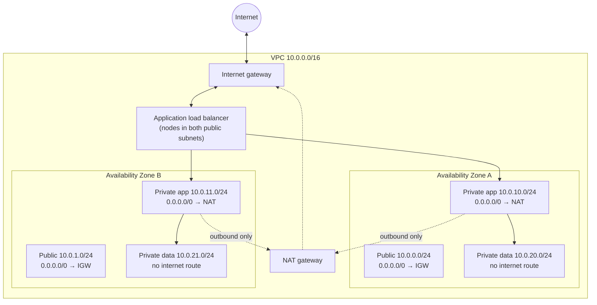
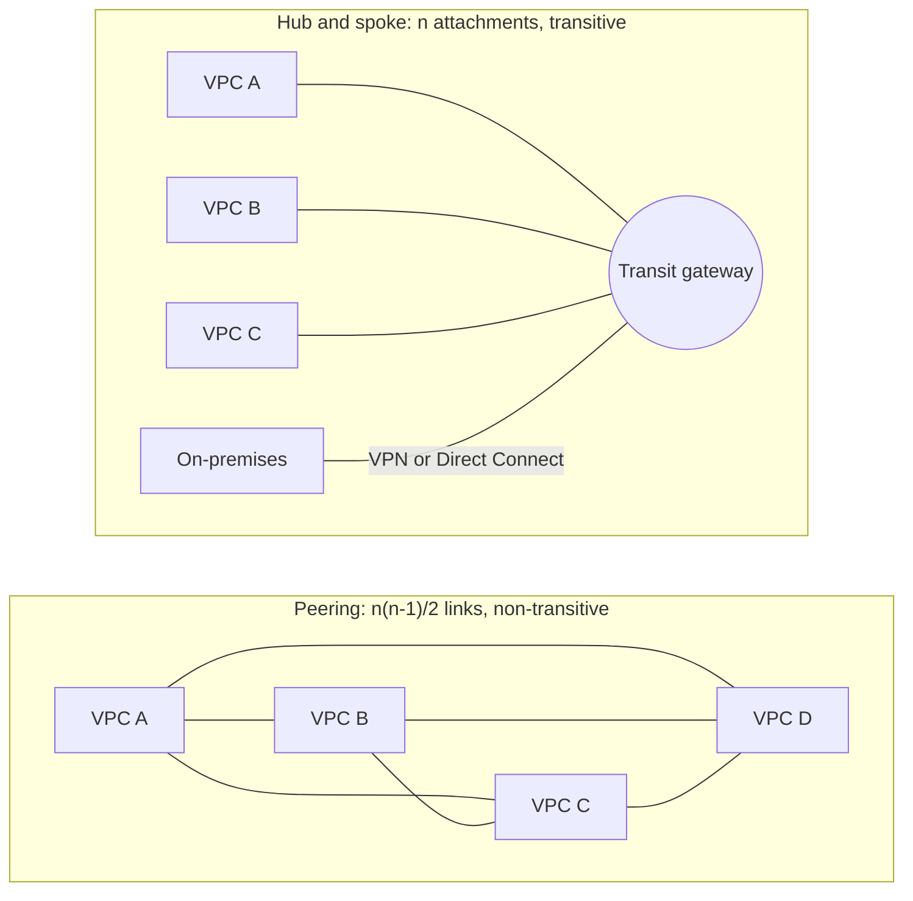
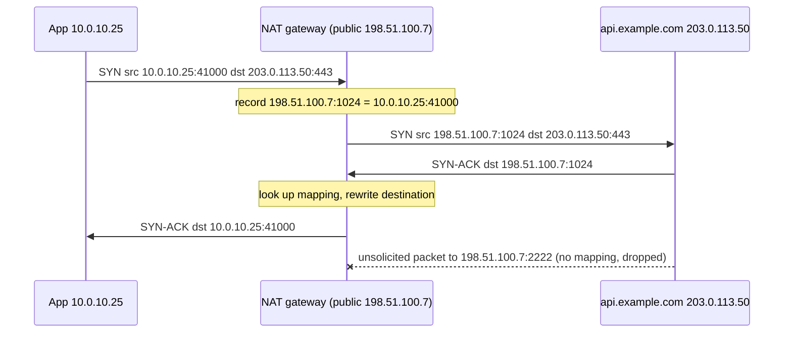

[Networking](./) &raquo; Cloud Networking

Cloud networking turns the pieces of a data-centre network (address space, routers, firewalls, NAT boxes, load balancers) into API resources that run on the provider's software-defined fabric. This page covers those resources from the bottom up: the **virtual network** and its address plan, **subnets and route tables**, **stateful and stateless filtering**, **connectivity between networks**, **load balancing**, **CDNs and anycast**, **NAT and egress**, **private service networking**, and the **shared-responsibility model** that decides who secures what. Examples use AWS names, with Azure and Google Cloud equivalents where they differ; the concepts carry across providers.

## Virtual Networks

A **Virtual Private Cloud (VPC)** is an isolated, software-defined network inside a provider's infrastructure. It behaves like a private data-centre network (your own address space, routing, and gateways), but the "wires" are overlays implemented by the provider's hypervisors and network fabric. Nothing enters or leaves a VPC until you add a gateway and a route to it.

| Concept | AWS | Azure | Google Cloud |
|---------|-----|-------|--------------|
| Virtual network | VPC (regional) | Virtual Network, VNet (regional) | VPC network (**global**; subnets are regional) |
| Subnet scope | One Availability Zone | Whole region | Whole region |
| Instance-level firewall | Security group (stateful) | Network security group, NSG (stateful; on subnet or NIC) | VPC firewall rules and policies (stateful) |
| Subnet-level stateless filter | Network ACL | (none; NSGs cover it) | (none) |
| Internet access | Internet gateway | Implicit, via public IP, NAT gateway, or load balancer | Implicit, via external IP or Cloud NAT |
| Outbound-only NAT | NAT gateway | NAT Gateway | Cloud NAT |
| Private access to managed services | Gateway/interface endpoints, PrivateLink | Private Endpoint / Private Link | Private Service Connect, Private Google Access |
| Hub for many networks | Transit Gateway, Cloud WAN | Virtual WAN, hub VNet | Network Connectivity Center |
| Dedicated private circuit | Direct Connect | ExpressRoute | Cloud Interconnect |

The scope difference matters for design. In AWS a subnet lives in one Availability Zone, so a highly available tier needs one subnet per zone; in Azure and Google Cloud a single subnet spans the region.

### Choosing an Address Range

A VPC is defined by one or more CIDR blocks, which fix how many addresses it has and, more importantly, whether it can ever be connected to other networks. **Two networks with overlapping ranges cannot route to each other** without NAT, so the address plan is the cloud-networking decision that is hardest to undo. Private ranges come from RFC 1918:

| Range | CIDR | Addresses | Typical use |
|-------|------|-----------|-------------|
| `10.0.0.0` – `10.255.255.255` | `10.0.0.0/8` | ~16.7M | Enterprise plans, subdivided per region, account, and environment |
| `172.16.0.0` – `172.31.255.255` | `172.16.0.0/12` | ~1M | Mid-size plans; note Docker's default bridge uses `172.17.0.0/16` |
| `192.168.0.0` – `192.168.255.255` | `192.168.0.0/16` | ~65K | Home and lab networks; avoid for cloud to prevent VPN clashes |

Practical rules:

- **Allocate from a central plan** (a spreadsheet at small scale, an IP address manager such as AWS VPC IPAM at larger scale) so that no two VPCs, on-premises sites, or partner networks overlap.
- **Size for growth.** A /16 per VPC is common; container platforms consume addresses fast, because each Kubernetes pod can take a VPC IP. Secondary CIDRs can be added later, and some teams place pod networks in the CGNAT range `100.64.0.0/10` to save RFC 1918 space.
- **Expect reserved addresses.** AWS reserves the first four and the last address of every subnet (network, VPC router, DNS, future use, broadcast), so a /24 has 251 usable addresses. Azure also reserves five; Google Cloud reserves four.
- **Plan IPv6 too.** Providers assign globally unique /56 (VPC) and /64 (subnet) IPv6 blocks, which removes the overlap problem for IPv6 traffic entirely.

For the subnet arithmetic itself, see [Layers & Addressing](fundamentals.html#subnetting-and-cidr).

```python
import ipaddress

def plan_subnets(vpc_cidr: str, new_prefix: int, reserved: int = 5):
    """Split a VPC range into equal subnets, accounting for cloud reservations."""
    for subnet in ipaddress.ip_network(vpc_cidr).subnets(new_prefix=new_prefix):
        yield str(subnet), subnet.num_addresses - reserved

# A /16 split into /20s: 16 subnets of 4,091 usable addresses each (AWS rules)
for cidr, usable in list(plan_subnets("10.0.0.0/16", 20))[:3]:
    print(cidr, usable)
```

## Subnets and Route Tables

Subnets divide a VPC into segments; each subnet is associated with a route table that decides where its traffic goes. Together they implement the public/private split that almost every cloud architecture uses.

### Public and Private Subnets

Nothing about a subnet itself is public or private; **the route table decides**. A subnet is public if its route table sends the default route `0.0.0.0/0` to an **internet gateway** and its instances have public addresses. A private subnet has no such route: its default route points at a **NAT gateway** (outbound only), a firewall appliance, a transit gateway, or nowhere.

The canonical layout spreads each tier across at least two Availability Zones:



Inbound requests terminate at the load balancer in the public tier; application servers in private subnets are unreachable from the internet but can reach out through NAT for patches and APIs; the data tier has no internet path at all. With AWS's newer **regional NAT gateway** mode the NAT no longer needs a public subnet of its own, and the public tier can shrink to just the load balancer.

### How a Route Table Decides

Route tables use the same **longest-prefix-match** rule as any IP router: among the routes whose prefix contains the destination, the most specific wins. Every VPC route table has an implicit `local` route for the VPC's own CIDR, so traffic within the VPC always stays inside it; everything else falls through to broader routes and finally to the default `0.0.0.0/0`.

| Destination | Target | Effect |
|-------------|--------|--------|
| `10.0.0.0/16` | local | Traffic within the VPC |
| `10.50.0.0/16` | pcx-1234 (peering) | Traffic to a peered VPC |
| `192.168.0.0/16` | tgw-5678 (transit gateway) | Traffic to on-premises via the hub |
| `0.0.0.0/0` | nat-9abc | Everything else leaves through NAT |

```python
import ipaddress

def route_lookup(dest_ip: str, routes: list[tuple[str, str]]) -> str | None:
    """Return the target of the longest matching prefix, as a VPC router does."""
    dest = ipaddress.ip_address(dest_ip)
    matches = [(ipaddress.ip_network(cidr), target) for cidr, target in routes
               if dest in ipaddress.ip_network(cidr)]
    return max(matches, key=lambda m: m[0].prefixlen)[1] if matches else None

routes = [("10.0.0.0/16", "local"), ("10.50.0.0/16", "pcx-1234"),
          ("192.168.0.0/16", "tgw-5678"), ("0.0.0.0/0", "nat-9abc")]
print(route_lookup("10.0.20.5", routes))      # local
print(route_lookup("192.168.4.1", routes))    # tgw-5678
print(route_lookup("203.0.113.7", routes))    # nat-9abc
```

### Stateful and Stateless Filtering

AWS has two filtering layers, and the difference between them is a common source of broken connectivity:

| | Security group | Network ACL |
|---|---|---|
| Attached to | Network interface (instance, load balancer, endpoint) | Subnet |
| State | **Stateful**: return traffic for an allowed flow is allowed automatically | **Stateless**: each packet is evaluated alone, so return traffic needs its own rule |
| Rules | Allow only | Allow and deny, evaluated in rule-number order |
| Can reference | Other security groups (e.g. "allow 5432 from the app tier's SG") | CIDR blocks only |
| Typical role | Primary, fine-grained policy | Coarse subnet backstop, explicit deny lists |

With a NACL, forgetting to allow the **ephemeral port range** (1024–65535) for return traffic is the classic mistake: requests leave, replies are dropped. Security groups avoid this, and their ability to reference each other expresses tier-to-tier policy without hard-coding addresses, which is why they carry most of the policy in practice. Azure NSGs and Google Cloud firewall rules are also stateful. The mechanics of stateful inspection are covered in [Performance, QoS & Security](performance-and-security.html#firewalls).

## Connecting Networks

Real estates have many VPCs (per team, per environment, per region) plus on-premises sites. Three patterns connect them.



| Pattern | How it works | Strengths | Limits |
|---------|--------------|-----------|--------|
| **VPC peering** | Direct link between two VPCs | No bandwidth bottleneck, no per-GB processing charge within a zone, simple | Non-transitive (A–B and B–C do not give A–C); full mesh of $n$ VPCs needs $n(n-1)/2$ links; no overlapping CIDRs |
| **Transit hub** (Transit Gateway, Cloud WAN, Azure Virtual WAN, Network Connectivity Center) | Every VPC and VPN attaches to a central router | Transitive routing with $n$ attachments; route tables per attachment for segmentation; central inspection point | Per-attachment and per-GB charges; one more hop |
| **Service-level connectivity** (PrivateLink, VPC Lattice, Private Service Connect) | Expose one *service*, not a whole network | Works across overlapping CIDRs and accounts; consumer sees only the service | Per-service setup; TCP/HTTP services rather than arbitrary IP traffic |

Hybrid connectivity to on-premises uses either a **site-to-site VPN** over the internet (IPsec; quick to set up, but with variable latency and limited bandwidth per tunnel) or a **dedicated circuit** such as AWS Direct Connect, Azure ExpressRoute, or Google Cloud Interconnect (private, predictable latency, 1–100 Gbit/s, weeks to provision). Production designs often run a VPN as the backup path for a dedicated circuit, with BGP choosing between them. Provider-specific detail is in [AWS Networking](../aws/networking.html).

## Load Balancing

A **load balancer** spreads incoming traffic across a pool of backends so that no single server is overwhelmed, failed servers leave the rotation, and the pool can grow behind one stable name. In the cloud the balancer is itself a managed, horizontally scaled service.

### Layer 4 and Layer 7

| | Layer 4 (transport) | Layer 7 (application) |
|---|---|---|
| Operates on | TCP/UDP flows | HTTP(S), HTTP/2, HTTP/3, gRPC requests |
| Can see | IP addresses, ports | Hosts, paths, headers, cookies, methods |
| Routing by | Flow hash, connection count | Host and path rules, header values, weights |
| Features | Very low latency, any protocol, static IPs, client IP preserved | TLS termination, content routing, redirects, authentication, WAF |
| AWS | Network Load Balancer | Application Load Balancer |
| Azure | Load Balancer | Application Gateway, Front Door (global) |
| Google Cloud | Network Load Balancer (passthrough / proxy) | Application Load Balancer |
| Software | HAProxy (TCP mode), IPVS, Katran | Envoy, NGINX, HAProxy (HTTP mode) |

A Layer 4 balancer forwards connections without parsing them: fast and protocol-agnostic, but unable to route on a URL. A Layer 7 balancer terminates the application protocol, so it can send `/api/*` to one fleet and `/static/*` to another, terminate TLS, add headers, and apply a web application firewall, at the cost of more work per request.

A third kind, the **Gateway Load Balancer** (AWS; Azure has an equivalent), operates at Layer 3. It distributes whole packets, wrapped in GENEVE encapsulation, across a fleet of firewall or inspection appliances, so third-party security appliances can scale horizontally in the traffic path.

### Balancing Algorithms

| Algorithm | Picks | Suits |
|-----------|-------|-------|
| Round robin | Next backend in rotation | Uniform, short requests |
| Weighted round robin | Rotation biased by capacity | Mixed instance sizes, canary releases |
| Least outstanding requests / least connections | Backend with the fewest in-flight requests | Variable request durations (the ALB option for this) |
| Power of two choices | The less loaded of two random backends | Large pools; avoids herding on one "least loaded" server |
| Flow hash (5-tuple) | Hash of source/destination IP, ports, protocol | L4 balancers; keeps a flow on one backend |
| Consistent hashing (ring, Maglev) | Hash of a key such as client IP or session ID | Cache affinity; minimal reshuffling when backends change |

### Health Checks and Draining

A balancer is only as good as its view of which backends are healthy. It probes each target (TCP connect, `GET /healthz`, or the gRPC health protocol) and removes targets that fail a threshold of consecutive checks, restoring them once they pass. Two related settings prevent errors during deployments: **connection draining** (deregistration delay) lets in-flight requests finish before a target is removed, and a **slow start** period ramps traffic to newly added targets. Health checks should test the process's ability to serve, not its dependencies; a check that fails when the database is slow will remove every backend at once.

### Regional and Global Balancing

- **Regional** balancers spread traffic across targets in one region's zones; they are the standard front door for an application. With **cross-zone load balancing** a node in one zone may send to targets in another, which evens load but can incur inter-zone data charges.
- **Global** balancing steers users across *regions*. **DNS-based** steering (Route 53 latency or geolocation routing, Azure Traffic Manager) answers each lookup with a nearby region's address, but reacts only as fast as resolvers honour TTLs. **Anycast-based** steering (AWS Global Accelerator, Google Cloud's global load balancers, Azure Front Door) announces one IP address from many edge locations, so failover happens at the routing layer in seconds.

## Content Delivery Networks and Anycast

### Content Delivery Networks

A **content delivery network (CDN)** caches responses at **points of presence (PoPs)** close to users, so a request for an image, script, or video segment is answered nearby instead of crossing continents to the origin. Modern CDNs (CloudFront, Cloudflare, Akamai, Fastly, Azure Front Door, Google Cloud CDN) also terminate TLS and HTTP/3 at the edge, absorb DDoS attacks, run WAF rules, and execute code at the edge.

A CDN is a cache hierarchy: edge PoPs, often a regional tier, and optionally an **origin shield** that collapses misses from all PoPs into one request to the origin. On a miss, the edge fetches from the next tier and stores the object for its TTL; later requests are hits. Tuning a CDN is largely about the **hit ratio**, through:

- `Cache-Control` headers (`max-age`, `s-maxage`, `stale-while-revalidate`) set deliberately by the origin;
- a **cache key** that includes only what varies the response (not every query parameter or cookie);
- versioned asset URLs (`app.3f9c2.js`) so that objects can be cached for a year and invalidated by renaming.

If a fraction $h$ of requests hit the edge, the expected latency is

$$L_{\text{avg}} = h \, L_{\text{edge}} + (1 - h) \, L_{\text{origin}}$$

With a 10 ms edge round trip, a 120 ms origin round trip, and a 90% hit ratio, $L_{\text{avg}} = 0.9 \times 10 + 0.1 \times 120 = 21$ ms, nearly six times better than always going to the origin. The same fraction $h$ of bytes also never leaves the origin, which cuts origin egress cost proportionally.

### Anycast

CDNs, global load balancers, and public DNS resolvers reach the nearest PoP with **anycast**: the same IP prefix is announced over BGP from many locations at once, and each user's packets follow ordinary internet routing to whichever announcement is closest in BGP terms.

| Mode | Delivery | Examples |
|------|----------|----------|
| Unicast | One address, one destination | Ordinary traffic |
| Anycast | One address, the *nearest* of many destinations | CDNs, `1.1.1.1`, `8.8.8.8`, DNS root servers |
| Multicast | One address, *every* subscribed receiver | IPTV and market data inside managed networks |
| Broadcast | Every host on the link (IPv4 only) | ARP, DHCP discovery |

Anycast delivers three properties at once: low latency (the nearest PoP answers), load distribution (traffic splits along routing boundaries), and resilience (withdraw a PoP's announcement and traffic reroutes to the next nearest). It also dilutes volumetric DDoS attacks across every PoP. "Nearest" means nearest in BGP path terms, which usually but not always matches geography. The routing mechanics are covered in [Routing & Switching](routing.html#bgp-routing-between-networks).

## NAT and Egress

Private subnets have no inbound path from the internet, but their workloads still need to reach package registries, OS updates, and third-party APIs. **Source NAT** provides outbound connectivity without inbound exposure.

### How Outbound NAT Works

A NAT gateway holds one or more public IP addresses. When a private instance opens a connection, the gateway rewrites the source address and port to one of its own, records the mapping, and forwards the packet. Replies match the mapping and are translated back. A packet arriving from the internet that matches no mapping is dropped, so nothing outside can open a connection inward.



Because many hosts share each public IP and are told apart by port, a NAT gateway can run out of source ports for one busy destination. AWS allows about 55,000 simultaneous connections per public IP to each unique destination (IP, port, protocol); adding IPs to the gateway raises the limit. Symptoms of **port exhaustion** are intermittent connection failures to a single popular endpoint, such as an object store or a SaaS API.

A **zonal** NAT gateway serves one Availability Zone, so resilient designs deploy one per zone with per-zone route tables. AWS's **regional NAT gateway** mode expands automatically to every zone where the VPC has workloads, uses a single ID in every route table, needs no public subnet, and supports up to 32 IPs per zone; it does not support private NAT (translation between private networks), which still requires zonal gateways. The general NAT and PAT mechanism is covered in [Routing & Switching](routing.html#nat-network-address-translation).

### Egress Control and Cost

Egress is a security and a cost concern as well as a connectivity one.

- **Egress filtering.** Restricting *where* private workloads may connect (allow-listing domains through a firewall or proxy) limits data exfiltration and command-and-control traffic after a compromise. Managed options include AWS Network Firewall, Azure Firewall, and Google Cloud's Secure Web Proxy; this is a core element of [zero-trust](../cybersecurity/) designs.
- **Explicit outbound by default.** Azure has retired implicit "default outbound access" for new networks: with API versions released after 31 March 2026, subnets in new VNets are private by default and need an explicit NAT Gateway, load balancer outbound rule, public IP, or firewall to reach the internet. Existing VNets are unchanged.
- **Data processing and transfer charges.** Providers charge for traffic leaving the cloud and between zones and regions, but not for inbound traffic. In AWS us-east-1 a NAT gateway costs USD 0.045 per hour plus USD 0.045 per GB processed (a regional NAT gateway bills the hourly rate per zone it spans), and traffic between Availability Zones costs USD 0.01 per GB in each direction. Pulling container images or backups through NAT can therefore dominate a network bill; routing that traffic through private endpoints (below) removes the NAT processing charge.
- **Public IPv4 charges.** AWS has billed every public IPv4 address, attached or idle, at USD 0.005 per hour since February 2024, which makes address-hungry designs visibly expensive and is a practical push toward IPv6.
- **IPv6 egress.** IPv6 needs no address sharing, so no translation is required. An **egress-only internet gateway** keeps the "outbound allowed, inbound blocked" property for IPv6 without NAT. IPv6-only subnets can still reach IPv4-only services through **NAT64 and DNS64** on the NAT gateway.

## Service Networking

The last layer connects services to each other, ideally without that traffic crossing the public internet.

### Private Service Endpoints

Calling a managed service (object storage, a database, a queue) by its public name sends traffic out through NAT or the internet gateway, costing egress and widening exposure. **Private endpoints** bring the service into the VPC instead:

- **Gateway endpoints** (AWS, for S3 and DynamoDB) add a route-table entry for the service's prefix list. Traffic stays on the provider network and the endpoint itself is free.
- **Interface endpoints** (AWS PrivateLink, Azure Private Endpoint, Google Cloud Private Service Connect) place a network interface with a private IP in your subnet. Private DNS makes the service's usual hostname resolve to that IP, and security groups control who may use it. The same mechanism publishes your own services to other accounts or customers, even when their CIDRs overlap with yours.

### Service Discovery and Service Mesh

In a dynamic environment, clients find instances by *name*:

- **DNS-based discovery.** The platform registers healthy instances under a service name and clients resolve it: Kubernetes cluster DNS, AWS Cloud Map, private DNS zones.
- **Application-layer service networking.** **Amazon VPC Lattice** and similar services provide L7 routing, authentication, and authorisation between services across VPCs and accounts without peering or transit gateways.
- **Service mesh.** A mesh (Istio, Linkerd, Cilium) moves discovery, load balancing, mutual TLS, retries, and traffic shifting out of application code into the data plane. The classic data plane is an Envoy **sidecar** per pod; **Istio ambient mode** (generally available since Istio 1.24, November 2024) replaces sidecars with a per-node proxy for L4 and mTLS plus optional per-namespace "waypoint" proxies for L7, which cuts resource overhead. AWS App Mesh reaches end of support on 30 September 2026; AWS directs users to ECS Service Connect or VPC Lattice.

How this plays out inside a cluster is covered in [Kubernetes networking](../kubernetes/fundamentals-networking.html).

## The Shared-Responsibility Model

Moving to the cloud splits operational responsibility rather than removing it. The **shared-responsibility model** is the contract that says where the provider's duties end and yours begin, usually summarised as security *of* the cloud (provider) versus security *in* the cloud (customer). Most cloud breaches trace to customer misconfiguration, such as a storage bucket made public or a database in a public subnet, not to failures of the provider's infrastructure.

| Layer | IaaS (VMs, VPCs) | PaaS (managed DBs, app platforms) | SaaS |
|-------|------------------|-----------------------------------|------|
| Data classification, encryption choices, access | Customer | Customer | Customer |
| Identity and access (IAM) | Customer | Customer | Customer |
| Application code | Customer | Customer | Provider |
| Network controls (security groups, routes, subnet placement, egress) | Customer | Shared: customer configures access, provider runs the network | Provider |
| Runtime and guest OS | Customer | Provider | Provider |
| Hypervisor, physical network, SDN fabric | Provider | Provider | Provider |
| Facilities, hardware, power | Provider | Provider | Provider |

For networking, almost everything on this page falls on the customer side: VPC design, subnet placement, route tables, security groups, NACLs, and egress policy. The provider guarantees that the fabric works and that tenants are isolated from one another; you decide whether a database lands in a public subnet or a security group opens port 22 to `0.0.0.0/0`. Providers increasingly offer account-wide guardrails to catch such mistakes, such as **VPC Block Public Access** in AWS and Azure's private-by-default subnets, and **VPC flow logs** record accepted and rejected flows for audit and troubleshooting. The broader principles are covered in [Cybersecurity](../cybersecurity/) and [Cloud & Container Security](../cybersecurity/cloud-and-container-security.html).

## See Also

- [Layers & Addressing](fundamentals.html): CIDR subnetting that VPC plans depend on.
- [Routing & Switching](routing.html): longest-prefix match, NAT, and the BGP behind anycast.
- [Performance, QoS & Security](performance-and-security.html): stateful inspection, firewalls, and flow telemetry.
- [Modern & Future Networking](modern-architecture.html): the SDN foundations the cloud is built on.
- [Programmable Networks](programmable-networks.html): SDN, NFV, and P4 in depth.
- [AWS Networking](../aws/networking.html): VPC, Transit Gateway, Direct Connect, ELB, and CloudFront in practice.
- [Kubernetes Networking](../kubernetes/fundamentals-networking.html): Services, Ingress, Gateway API, and network policies.
- [Cybersecurity](../cybersecurity/): zero trust and the security side of shared responsibility.
