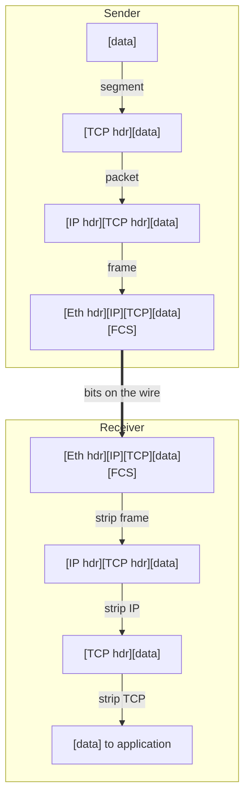
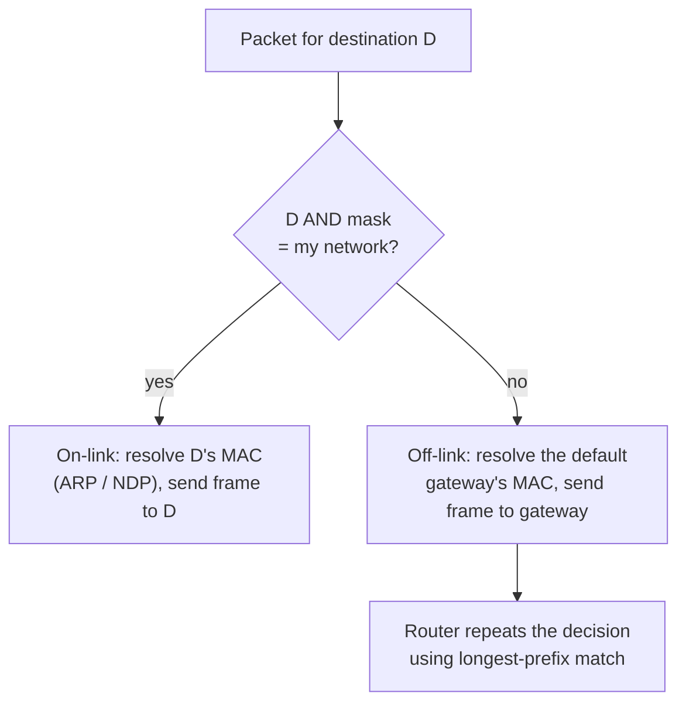

[Networking](./)

Networks are built as a stack of layers, each solving one problem and hiding its details from the layer above. This page covers the two reference models (OSI and TCP/IP), how data is encapsulated as it moves down the stack, and the addressing system that lets a packet reach any host: MAC addresses on the local link, IPv4 and IPv6 across the internet, and CIDR subnetting to divide address space.

## Layered Models

A layered model is a division of labour. Each layer offers a service to the one above ("deliver these bytes to that host") and relies on the one below, so a layer can be replaced without disturbing the rest. That is why the same browser works over Wi-Fi, Ethernet, or 5G, and why QUIC could replace TCP for HTTP/3 without any change to IP.

### The OSI Model

The seven-layer **Open Systems Interconnection** model (ISO/IEC 7498-1, 1984) is a *vocabulary* more than a blueprint. The protocols it was designed for largely lost to TCP/IP, but its layer numbers stuck: "an L7 load balancer", "an L2 switch" and "an L3 VPN" all refer to it.

| # | Layer | Responsibility | Unit of data (PDU) | Examples |
|---|-------|----------------|--------------------|----------|
| 7 | Application | Network services used by programs | Message | HTTP, DNS, SMTP, SSH |
| 6 | Presentation | Data representation, encoding, encryption | Message | TLS (loosely), UTF-8, ASN.1 |
| 5 | Session | Opening, managing, and closing dialogues | Message | RPC sessions, TLS sessions (loosely) |
| 4 | Transport | End-to-end delivery between *processes*; ports, reliability, flow control | Segment (TCP) / datagram (UDP) | TCP, UDP, QUIC |
| 3 | Network | Delivery between *hosts* across networks; addressing and routing | Packet | IPv4, IPv6, ICMP |
| 2 | Data link | Delivery between neighbours on one link; framing, error detection | Frame | Ethernet, Wi-Fi (802.11), PPP |
| 1 | Physical | Bits as signals on a medium | Bit / symbol | Copper, fibre, radio |

Layers 5 and 6 have no clean counterpart in the internet stack. TLS, for example, performs presentation-layer work (encryption) but runs as a library inside the application on top of TCP; QUIC folds transport, encryption, and session management into one protocol. Treat the OSI numbering as a map, not a rule that every protocol fits exactly one box.

### The TCP/IP Model

The internet runs on the four-layer **TCP/IP** (or Internet) model defined in RFC 1122. It merges OSI layers 5–7 into a single application layer and layers 1–2 into a link layer.

| TCP/IP layer | OSI equivalent | Adds | Example protocols | Addressing |
|--------------|----------------|------|-------------------|------------|
| Application | 5–7 | Application data and semantics | HTTP, DNS, TLS, SSH | URLs, hostnames |
| Transport | 4 | Ports, reliability, congestion control | TCP, UDP, QUIC | Port numbers |
| Internet | 3 | Global addressing and routing | IPv4, IPv6, ICMP | IP addresses |
| Link | 1–2 | Framing and delivery on one link | Ethernet, 802.11, cellular | MAC addresses |

The design principle at the centre is the **end-to-end argument**: keep the network core (IP) simple and stateless, and put reliability, ordering, and security in the end hosts. IP promises only *best-effort* delivery; packets may be lost, duplicated, or reordered, and TCP or QUIC on the hosts repairs that.

### Encapsulation

On the way down the sending stack, each layer treats everything it receives from above as opaque payload and prepends its own header (Ethernet also appends a trailer, the frame check sequence). The receiver strips the headers in reverse order, each layer reading only its own.



Typical header sizes on an Ethernet link:

| Header | Size | Notes |
|--------|------|-------|
| Ethernet II | 14 B header + 4 B FCS trailer | An 802.1Q VLAN tag adds 4 B |
| IPv4 | 20 B minimum | Up to 60 B with options |
| IPv6 | 40 B fixed | Options move to extension headers |
| TCP | 20 B minimum | Commonly 32 B with timestamps |
| UDP | 8 B | |

The **maximum transmission unit (MTU)** is the largest IP packet a link carries; standard Ethernet is 1500 bytes, so a TCP segment over IPv4 carries at most 1460 bytes of data (1500 − 20 − 20). Tunnels (VXLAN, IPsec, WireGuard) add their own headers and shrink the effective MTU, which is a frequent cause of connections that hang on large transfers. IPv4 routers may fragment oversized packets; IPv6 routers never do, relying on **Path MTU Discovery** and ICMPv6 "Packet Too Big" messages, so blocking ICMP breaks IPv6.

## Layer 2: Links and MAC Addresses

The link layer moves frames between devices that share a link: one Ethernet segment, one VLAN, or one Wi-Fi network.

- A **MAC address** is a 48-bit identifier written as six hex octets, e.g. `00:1b:44:11:3a:b7`. The first three octets are traditionally the vendor's Organizationally Unique Identifier. Modern phones and laptops use **randomised MAC addresses** per network for privacy (the "locally administered" bit is set), so a MAC is no longer a stable device identity.
- A **switch** learns which MAC addresses live behind which port by reading source addresses, then forwards each frame only to the port where its destination lives. Frames to unknown destinations, and broadcasts to `ff:ff:ff:ff:ff:ff`, are flooded to every port in the VLAN. The set of hosts a broadcast reaches is the **broadcast domain**; VLANs split one switch into several ([Routing & Switching](routing.html#switching-and-vlans)).
- **Address resolution** joins layers 2 and 3. Before sending an IPv4 packet to a neighbour, a host broadcasts an **ARP** request ("who has 10.0.1.7?") and caches the reply. IPv6 replaces ARP with **Neighbor Discovery (NDP)**, which uses ICMPv6 and multicast instead of broadcast.

MAC addresses never cross a router. At every IP hop the frame is rebuilt with new source and destination MACs, while the IP addresses inside stay the same (NAT aside).

## Layer 3: IP Addressing

An IP address identifies an interface and, through its prefix, the network the interface belongs to. Routers forward on the prefix alone; only the last router needs to know about the individual host.

### IPv4

IPv4 addresses are 32 bits, written as four decimal octets (`192.0.2.10`), for about 4.3 billion addresses. IANA handed its last blocks to the regional registries in 2011, and the registries now issue only small final allocations or run waiting lists. IPv4 survives on address reuse: private ranges behind **NAT**, carrier-grade NAT (CGNAT) at ISPs, and a secondary market where addresses change hands for tens of US dollars each. Cloud providers now bill for public IPv4 addresses directly (see [Cloud Networking](cloud-networking.html#egress-control-and-cost)).

#### Classful Addressing (Historical)

Until 1993, the leading bits of an address fixed its network size: Class A (`0.0.0.0/8` to `127.0.0.0/8`, 16.7 million hosts each), Class B (`128.0.0.0/16` to `191.255.0.0/16`, 65,534 hosts), Class C (`192.0.0.0/24` to `223.255.255.0/24`, 254 hosts). The gap between 254 and 65,534 hosts wasted address space and swelled routing tables, so **CIDR** (RFC 1519, now RFC 4632) replaced classes with arbitrary-length prefixes. "Class C" is still heard as slang for a /24, but no protocol uses classes any more. Class D (`224.0.0.0/4`) survives as the multicast range.

#### Special-Purpose IPv4 Ranges

| Block | Purpose | Defined in |
|-------|---------|------------|
| `10.0.0.0/8`, `172.16.0.0/12`, `192.168.0.0/16` | Private addressing; not routed on the internet | RFC 1918 |
| `100.64.0.0/10` | Shared address space for carrier-grade NAT | RFC 6598 |
| `127.0.0.0/8` | Loopback (`127.0.0.1` is "this host") | RFC 1122 |
| `169.254.0.0/16` | Link-local; self-assigned when DHCP fails. Clouds serve instance metadata at `169.254.169.254` | RFC 3927 |
| `192.0.2.0/24`, `198.51.100.0/24`, `203.0.113.0/24` | Documentation and examples only | RFC 5737 |
| `224.0.0.0/4` | Multicast | RFC 5771 |
| `0.0.0.0/8` | "This network"; `0.0.0.0/0` as a route means *default* | RFC 1122 |
| `255.255.255.255/32` | Limited broadcast | RFC 919 |

### IPv6

IPv6 uses 128-bit addresses written as eight groups of four hex digits. Leading zeros in a group may be dropped, and one run of all-zero groups may be replaced by `::`:

```
2001:0db8:0000:0000:0000:ff00:0042:8329
2001:db8::ff00:42:8329            (compressed form, RFC 5952)
```

Scarcity is not a design constraint. The standard subnet size is a **/64**, which leaves 64 bits for the interface identifier, and a typical site receives a /48 (65,536 subnets) or an ISP customer a /56. A global unicast address therefore reads as a routing hierarchy:

```
|<---- 48 bits ---->|<- 16 ->|<---------- 64 bits ---------->|
|  global routing   | subnet |      interface identifier       |
|  prefix (the site)|   ID   |  (SLAAC, DHCPv6, or manual)     |
```

| Prefix | Type | Notes |
|--------|------|-------|
| `2000::/3` | Global unicast | Publicly routable addresses |
| `fc00::/7` (in practice `fd00::/8`) | Unique local (ULA) | Private addressing, the analogue of RFC 1918 |
| `fe80::/10` | Link-local | Present on every IPv6 interface; used by NDP and routing protocols |
| `ff00::/8` | Multicast | Replaces broadcast entirely |
| `::1/128` | Loopback | |
| `::/128` | Unspecified | Source address before one is assigned |
| `64:ff9b::/96` | NAT64 well-known prefix | Embeds IPv4 addresses for IPv6-only clients |
| `2001:db8::/32` | Documentation | |

Other differences from IPv4 that matter in practice:

- **No broadcast.** Functions that used broadcast (ARP, DHCP discovery) use multicast to specific groups instead.
- **Stateless address autoconfiguration (SLAAC).** Routers advertise the /64 prefix; hosts form their own addresses, usually with randomised interface identifiers (RFC 8981) rather than the older MAC-derived EUI-64. DHCPv6 is optional, and Android has never supported stateful DHCPv6 address assignment, so SLAAC is the only method that works on every client.
- **Several addresses per interface** are normal: a link-local, one or more global addresses, and temporary privacy addresses.
- **No NAT by default.** Every host can have a globally unique address; inbound access is controlled by stateful firewalls rather than by address translation.

#### Adoption and Transition

Google's measurements show roughly 46–50% of its users reaching it over IPv6 in September 2026, higher on weekends when traffic shifts to residential and mobile networks, and with wide variation between countries. Most networks therefore run **dual-stack** (both protocols side by side, with clients preferring IPv6 through *Happy Eyeballs*, RFC 8305). Mobile carriers and some large enterprises run **IPv6-only** networks and reach the remaining IPv4 internet through **NAT64/DNS64** (the DNS server synthesises IPv6 addresses inside `64:ff9b::/96`, and a gateway translates) or **464XLAT**, which also covers applications that hard-code IPv4 literals.

## Subnetting and CIDR

A **subnet** is a contiguous block of addresses that share a prefix. CIDR notation writes the prefix length after a slash: in `192.168.1.0/24`, the first 24 bits identify the network and the remaining 8 identify hosts. The equivalent **subnet mask** has the prefix bits set to 1, here `255.255.255.0`.

Subnetting limits broadcast domains, gives each segment its own security policy, and lets routers summarise many subnets as one route.

### Subnet Arithmetic

For an IPv4 prefix of length $p$, the block contains $2^{32-p}$ addresses. The first (all host bits 0) is the **network address** and the last (all host bits 1) is the **broadcast address**, so on an ordinary LAN

$$N_{\text{usable}} = 2^{32-p} - 2$$

Two exceptions: a **/31** has two usable addresses for point-to-point links, with no network or broadcast address (RFC 3021), and a **/32** identifies a single host (loopbacks, host routes). Cloud providers reserve more: AWS keeps five addresses in every subnet, Azure five, and Google Cloud four.

| Prefix | Mask | Addresses | Usable hosts (LAN) | Typical use |
|--------|------|-----------|--------------------|-------------|
| /8 | 255.0.0.0 | 16,777,216 | 16,777,214 | Whole private space `10.0.0.0/8` |
| /16 | 255.255.0.0 | 65,536 | 65,534 | A cloud VPC or a campus |
| /20 | 255.255.240.0 | 4,096 | 4,094 | A large cloud subnet or Kubernetes pod range |
| /24 | 255.255.255.0 | 256 | 254 | A typical LAN or cloud subnet |
| /27 | 255.255.255.224 | 32 | 30 | A small server segment |
| /30 | 255.255.255.252 | 4 | 2 | Legacy point-to-point link |
| /31 | 255.255.255.254 | 2 | 2 | Point-to-point link (RFC 3021) |
| /32 | 255.255.255.255 | 1 | 1 | Single host, loopback |

### Worked Example

Dissecting `10.0.37.200/20`:

1. A /20 leaves 12 host bits, so blocks are $2^{12} = 4096$ addresses, which step through the third octet in increments of 16.
2. The third octet, 37, falls in the block starting at 32 (32–47).
3. Network address `10.0.32.0`; broadcast `10.0.47.255`; usable hosts `10.0.32.1`–`10.0.47.254` (4,094).

The same calculation in Python's standard library:

```python
import ipaddress

iface = ipaddress.ip_interface("10.0.37.200/20")
net = iface.network
print(net)                    # 10.0.32.0/20
print(net.netmask)            # 255.255.240.0
print(net.broadcast_address)  # 10.0.47.255
print(net.num_addresses - 2)  # 4094 usable on a LAN

# Carve the /20 into /24s, or split it unevenly (VLSM)
print([str(s) for s in net.subnets(new_prefix=22)])
# ['10.0.32.0/22', '10.0.36.0/22', '10.0.40.0/22', '10.0.44.0/22']
```

### Variable-Length Subnet Masks

Subnets do not have to be the same size. **VLSM** allocates each segment only what it needs, largest first so that blocks stay aligned. Splitting `10.0.0.0/22` (1,024 addresses) for an office:

| Segment | Hosts needed | Allocation | Range |
|---------|--------------|------------|-------|
| Engineering | 400 | `10.0.0.0/23` | 10.0.0.0 – 10.0.1.255 |
| Guest Wi-Fi | 200 | `10.0.2.0/24` | 10.0.2.0 – 10.0.2.255 |
| Sales | 100 | `10.0.3.0/25` | 10.0.3.0 – 10.0.3.127 |
| Servers | 50 | `10.0.3.128/26` | 10.0.3.128 – 10.0.3.191 |
| Router links | 2 each | `10.0.3.192/31`, `10.0.3.194/31`, … | from 10.0.3.192 |

The reverse operation, **route summarisation** (supernetting), advertises the whole plan upstream as the single route `10.0.0.0/22`. Plan address space so that it summarises cleanly, and so that it does not overlap with networks you may later need to connect to. Overlapping ranges are the most expensive mistake in [cloud network design](cloud-networking.html#choosing-an-address-range).

### How a Host Uses the Mask

The mask decides whether a packet is delivered directly or handed to a router. The host ANDs the destination address with its own mask and compares the result with its own network address:



In IPv6 the same decision uses the on-link prefixes learned from Router Advertisements. Routers extend the idea by choosing among many prefixes with **longest-prefix match**, covered in [Routing & Switching](routing.html).

---

## Continue

**Up:** [Networking](./), the overview and navigation hub. &nbsp;**Next:** [Transport & Application Protocols](transport-and-protocols.html), on how the transport layer delivers data reliably.

### See Also

- [Transport & Application Protocols](transport-and-protocols.html): TCP, UDP, QUIC, and the protocols built on IP.
- [Routing & Switching](routing.html): how packets find a path, NAT, and VLANs at Layer 2.
- [Cloud Networking](cloud-networking.html): applying CIDR planning to VPCs and subnets.
- [Cybersecurity](../cybersecurity/): securing the stack described here.
