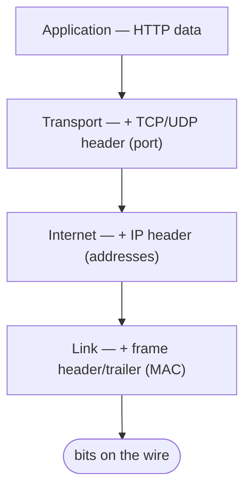

[Networking](./)

<!-- Custom styles are now loaded via main.scss -->

  <h1 style="color: white; margin: 0; font-size: 2.5rem;">Layers &amp; Addressing</h1>
  
Building networks layer by layer, from bits to applications and IP addresses

Networks are built in layers, each solving a specific problem and hiding its complexity from the layer above. This page introduces the OSI and TCP/IP models, shows how data is wrapped (encapsulated) as it descends the stack, and then explains the addressing system — IPv4, IPv6, and CIDR subnetting — that lets a packet find any host in the world.

## Building Networks Layer by Layer

The OSI model breaks networking into seven layers, each solving specific problems. Think of it like building a house: you need a foundation before walls, and walls before a roof.

### The OSI Model: From Bits to Applications

Each layer provides services to the layer above while hiding complex details. This separation allows innovation at each layer without breaking the others—it's why you can use the same web browser whether you're on Wi-Fi or cellular.

### Layer 7: Application - What Users See
This is where networking meets user needs. Application layer protocols define how programs communicate over the network.

**Common protocols you use daily:**
- **HTTP/HTTPS**: Web browsing (the S means secure/encrypted)
- **SMTP/IMAP**: Email sending and receiving  
- **SSH**: Secure remote access to servers
- **FTP/SFTP**: File transfers
- **DNS**: Converting domain names to IP addresses

**Why it matters:** Each protocol is optimized for its specific use case. Email needs reliability but can tolerate delays. Video calls need low latency but can tolerate some loss.

### Layer 6: Presentation - Making Data Universal
Different computers represent data differently. The presentation layer ensures everyone speaks the same language.

**Key functions:**
- **Encryption/Decryption**: SSL/TLS keeps your data private
- **Compression**: Making files smaller for faster transfer
- **Character encoding**: Ensuring emojis work everywhere (UTF-8)
- **File formats**: JPEG for photos, MP3 for audio

**Real-world impact:** This layer is why you can send a photo from an iPhone to an Android, or why secure websites work regardless of your browser.

### Layer 5: Session - Managing Conversations
The session layer coordinates communication between applications, like a moderator in a conference call.

**Key responsibilities:**
- Establishing and terminating sessions
- Managing turn-taking in communications
- Checkpointing long operations
- Examples: SQL sessions, RPC calls, NetBIOS

### Layer 4: Transport - Reliable Communication
IP gets packets to the right computer, but which application should receive them? And what if packets arrive out of order or get lost? Layer 4 solves these problems.

**Two approaches:**
- **TCP**: Guarantees delivery and order (like certified mail)
  - Used for: Web pages, email, file transfers
  - Overhead: Connection setup, acknowledgments, retransmissions
  
- **UDP**: Fast but unreliable (like regular mail)
  - Used for: Video streaming, gaming, DNS
  - Advantage: Lower latency, no connection overhead

**Port numbers:** Like apartment numbers in a building—they direct traffic to specific applications (web servers on port 80, SSH on port 22).

> The transport layer gets a full treatment in [Transport & Application Protocols](transport-and-protocols.html), including TCP congestion control and the TCP-vs-UDP decision.

### Layer 3: Network - Internet-Scale Routing
Layer 2 works great locally, but MAC addresses don't scale to the internet. Layer 3 introduces IP addresses and routing—the technologies that make the global internet possible.

**Key innovations:**
- IP addresses: Hierarchical addressing (like 192.168.1.1)
- Routers: Devices that forward packets between networks
- Routing protocols: Algorithms for finding paths (OSPF for organizations, BGP for the internet)
- ICMP: Network diagnostics (ping, traceroute)

**The magic:** Your packet finds its way across dozens of independent networks, each making local routing decisions, yet somehow arrives at the right destination.

> How routers actually choose those paths is the subject of [Routing & Switching](routing.html).

### Layer 2: Data Link - Reliable Local Delivery
The physical layer gives us raw bit transmission, but it's prone to errors. Layer 2 adds error detection and manages access when multiple devices share the same physical medium (like Wi-Fi).

**Key concepts:**
- MAC addresses: Hardware identifiers (like 00:1B:44:11:3A:B7)
- Ethernet frames: Packets with error-checking
- Switches: Smart devices that learn where to send frames
- ARP: Translating IP addresses to MAC addresses

**Why it matters:** Without Layer 2, your Wi-Fi would be chaos with devices talking over each other, and corrupted data would crash applications.

### Layer 1: Physical - Getting Bits from A to B
This is where networking meets physics. Whether using electrical signals in copper cables, light pulses in fiber optics, or radio waves in Wi-Fi, we need to reliably transmit ones and zeros.

**Real-world challenges:**
- Signal degradation over distance
- Interference from other devices
- Physical damage to cables

**Technologies:**
- Ethernet cables (Cat5e, Cat6)
- Fiber optics (single-mode, multi-mode)
- Wireless (Wi-Fi, cellular)

## The TCP/IP Model: What We Actually Use

While OSI provides a conceptual framework, the internet actually runs on the simpler TCP/IP model. It combines some OSI layers and focuses on practical implementation:

1. **Application Layer**: Everything from OSI layers 5-7
2. **Transport Layer**: TCP and UDP (OSI layer 4)
3. **Internet Layer**: IP routing (OSI layer 3)
4. **Link Layer**: Physical transmission and local delivery (OSI layers 1-2)

This streamlined model reflects how protocols are actually implemented and is what you'll encounter in practice.

As data moves down the sending stack, each layer wraps it in its own header (encapsulation); the receiver peels each header off in reverse:

| TCP/IP layer | Adds | Example protocols | Addressing |
|--------------|------|-------------------|------------|
| Application | Application data | HTTP, DNS, TLS | URLs, hostnames |
| Transport | Ports, reliability | TCP, UDP, QUIC | Port numbers |
| Internet | Routing | IP, ICMP | IP addresses |
| Link | Local framing | Ethernet, Wi-Fi | MAC addresses |

## IP Addressing: The Internet's Phone Book

Just as phone numbers let you call anyone in the world, IP addresses enable global internet communication. Let's understand how this addressing system works and why we're running out of numbers.

### IPv4: The Original Design
IPv4 uses 32-bit addresses, giving us about 4.3 billion possible addresses. In 1981, this seemed like plenty. Today, with billions of devices online, we've had to get creative.

**Address Classes**:
- Class A: 1.0.0.0 to 126.255.255.255 (/8)
- Class B: 128.0.0.0 to 191.255.255.255 (/16)
- Class C: 192.0.0.0 to 223.255.255.255 (/24)

**Private Address Ranges**:
- 10.0.0.0/8
- 172.16.0.0/12
- 192.168.0.0/16

### IPv6
128-bit addresses, written in hexadecimal (e.g., 2001:db8::1)

**Address Types**:
- Unicast: Single interface
- Multicast: Group of interfaces
- Anycast: Nearest of group

**Special Addresses**:
- ::1 - Loopback
- fe80::/10 - Link-local
- 2000::/3 - Global unicast

### Subnetting: Organizing IP Addresses

Subnetting is like dividing a large office building into departments. Instead of one giant network, we create smaller, manageable segments. This improves security, reduces broadcast traffic, and makes networks easier to manage.

**Understanding CIDR Notation**
When we write 192.168.1.0/24, we're defining:
- **Network portion**: First 24 bits (192.168.1)
- **Host portion**: Last 8 bits (0-255)
- **Network address**: 192.168.1.0 (identifies the subnet)
- **Broadcast address**: 192.168.1.255 (reaches all hosts)
- **Usable addresses**: 192.168.1.1 to 192.168.1.254 (254 hosts)

**Why subtract 2?** The network and broadcast addresses are reserved, so a /24 network has 256 total addresses but only 254 usable ones.

**Real-world example**: A company might use:
- 10.0.1.0/24 for engineering (254 devices)
- 10.0.2.0/24 for sales
- 10.0.3.0/24 for guest Wi-Fi

This separation means a broadcast on the guest network won't affect engineering workstations. The same logical-segmentation idea, applied on shared switch hardware, gives you VLANs — covered in [Routing & Switching](routing.html).

---

## Continue

  <h4>Previous / Next</h4>
  <ul>
    <li><strong>Up:</strong> <a href="./">Networking</a> — overview and navigation hub.</li>
    <li><strong>Next:</strong> <a href="transport-and-protocols.html">Transport &amp; Application Protocols</a> — how the transport layer delivers data reliably.</li>
  </ul>

  <h4>See Also</h4>
  <ul>
    <li><a href="transport-and-protocols.html">Transport &amp; Application Protocols</a> — TCP, UDP, and the protocols built on top of IP.</li>
    <li><a href="routing.html">Routing &amp; Switching</a> — how Layer 3 packets find a path, plus VLANs at Layer 2.</li>
    <li><a href="../cybersecurity/">Cybersecurity</a> — securing the stack you just learned.</li>
  </ul>

