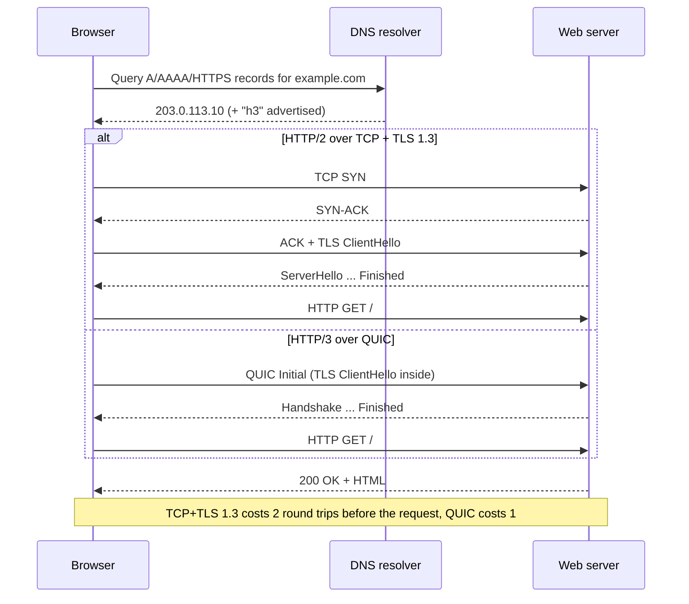
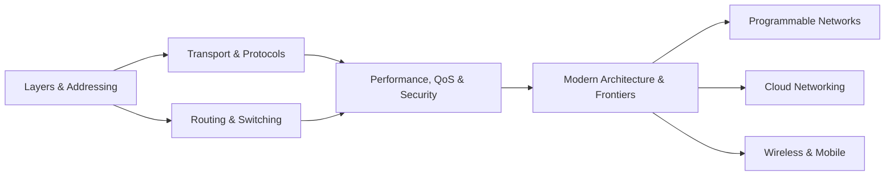

  <h1 style="color: white; margin: 0; font-size: 2rem;">Networking</h1>
  
TCP/IP protocols, routing, performance, and modern network architecture

This hub covers computer networking from the protocol stack up to programmable, cloud, and wireless networks. It starts with a single request traced end to end, then maps each step of that request onto the page that explains it. The pages form a rough progression: vocabulary and addressing first, then how data moves (transport and routing), then how well it moves and how it is defended (performance and security), and finally how modern networks are built and where research is heading.

## Anatomy of a Web Request

Typing a URL and pressing Enter exercises most of the stack. The browser resolves a name, opens an encrypted transport connection, and exchanges HTTP messages; every arrow below is one or more IP packets forwarded hop by hop through routers that know nothing about the web.

Each part of the exchange maps to a page in this section:

| Step in the request | What is happening | Covered in |
|---|---|---|
| Name lookup | DNS query over UDP, TCP, or an encrypted transport (DoH/DoT) | [Transport & Application Protocols](transport-and-protocols.html) |
| Connection setup | TCP or QUIC handshake, TLS 1.3 key exchange | [Transport & Application Protocols](transport-and-protocols.html) |
| Headers and addresses | Encapsulation through the layers; IPv4/IPv6 addressing | [Layers & Addressing](fundamentals.html) |
| Hop-by-hop delivery | Longest-prefix-match forwarding, OSPF inside a network, BGP between networks | [Routing & Switching](routing.html) |
| How fast it completes | Queueing delay, loss, and congestion at bottleneck links | [Performance, QoS & Security](performance-and-security.html) |
| Where the server lives | VPCs, load balancers, CDNs, anycast | [Cloud Networking](cloud-networking.html) |
| The first hop | Wi-Fi or cellular radio access | [Wireless & Mobile](wireless-and-mobile.html) |

## Pages in This Section

| Page | Scope |
|------|-------|
| [Layers & Addressing](fundamentals.html) | OSI and TCP/IP models, encapsulation, IPv4/IPv6, CIDR subnetting |
| [Transport & Application Protocols](transport-and-protocols.html) | TCP congestion control (Reno, BBR), TCP vs UDP, HTTP, DNS, DHCP, SSH, well-known ports |
| [Routing & Switching](routing.html) | Shortest-path and max-flow algorithms, BGP, OSPF, static and dynamic routing, NAT, VLANs |
| [Performance, QoS & Security](performance-and-security.html) | Queueing models, bufferbloat and AQM, QoS/DiffServ, firewalls and VPNs, troubleshooting, flow and streaming telemetry |
| [Modern Architecture & Frontiers](modern-architecture.html) | Realistic traffic models, AI-cluster fabrics, and research directions: ICN, network coding, quantum networking, 6G |
| [Programmable Networks](programmable-networks.html) | SDN and OpenFlow, P4, eBPF/XDP, NFV, MPLS, Segment Routing and SRv6, IPv6 transition |
| [Cloud Networking](cloud-networking.html) | VPCs, subnets, route tables, load balancers, CDNs, NAT, shared responsibility |
| [Wireless & Mobile](wireless-and-mobile.html) | Wi-Fi (802.11), 4G/5G, the 5G core, spectrum, modulation, mobility |

### Reading Order

The three pages on the right are independent deep dives and can be read in any order once the foundations are in place.

## Core Ideas

- **Layering separates concerns.** Each layer depends only on the service of the layer below, so the same browser works over Wi-Fi, fibre, or 5G, and new transports such as QUIC can be deployed over unchanged IP networks.
- **IP forwards, transport delivers.** IP moves datagrams hop by hop with no guarantees; TCP, UDP, and QUIC decide which application receives them and whether they arrive reliably and in order.
- **Performance is a queueing problem.** Latency, jitter, and loss are dominated by queues at bottleneck links. Congestion control at the hosts and active queue management in the network exist to keep those queues short.
- **Routing is hierarchical and policy-driven.** Interior protocols such as OSPF and IS-IS optimize paths inside one organization; BGP exchanges policy-constrained reachability between the tens of thousands of autonomous systems that make up the internet.
- **Networks are becoming software.** SDN, P4, eBPF, NFV, and SRv6 move decisions that used to be fixed in vendor hardware into programs that operators write, test, and deploy like any other code.

## See Also

- [Cybersecurity](../cybersecurity/) — threat models, zero trust, and security operations built on the network primitives here
- [AWS](../aws/) — VPC, Direct Connect, and managed load balancing in a production cloud
- [Docker](../docker/) — bridge, overlay, and host networking for containers
- [Kubernetes](../kubernetes/) — cluster networking, Services, and CNI plugins
- [Observability](../../observability/) — metrics, logs, and traces across distributed systems
- [Quantum Computing](../quantumcomputing.html) — the computing side of quantum networking and QKD
