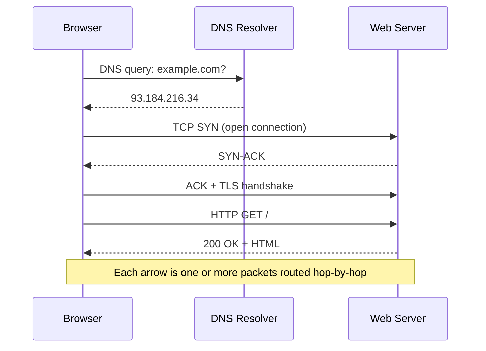

  <h1 style="color: white; margin: 0; font-size: 2.5rem;">Networking</h1>
  
TCP/IP protocols, routing, and modern network architecture

<!-- Custom styles are now loaded via main.scss -->

  
Every time you open a web page, send a message, or stream a video, data travels through an intricate network of connections. Understanding how these networks function is essential for anyone working with technology — from developers optimizing applications to administrators ensuring reliable service. With the rise of edge computing, 5G, and AI-driven network management, networking knowledge is more crucial than ever. This hub follows a single packet's journey, then branches into the protocol stack, routing, congestion control, performance, security, and modern architecture beneath it.

  

    <i class="fas fa-layer-group"></i>
    <h4>The Stack</h4>
    
How TCP/IP layers cooperate to move bytes across the world

  

  

    <i class="fas fa-route"></i>
    <h4>Routing &amp; Delivery</h4>
    
How packets find a path hop-by-hop across independent networks

  

  

    <i class="fas fa-tachometer-alt"></i>
    <h4>Performance</h4>
    
Queueing, latency, and congestion control that shape real speed

  

> **What you'll learn:** start with the end-to-end story of a single packet, then descend into the protocol layers, addressing and routing, queueing and performance, security, and finish with modern network architecture (edge, 5G, software-defined networking).

## The Journey of a Network Packet

Let's start with something familiar: what happens when you type a URL and press Enter? This simple action triggers a cascade of network operations that this guide uses to explore fundamental concepts.

First, your browser needs to find the server. It sends a DNS query to translate the domain name into an IP address. This query itself is a network packet that must navigate through routers, switches, and servers to reach its destination. Along the way, it encounters the same challenges that all network traffic faces: congestion, routing decisions, and potential delays.

Each arrow in that diagram unpacks into a whole subject. The DNS lookup and TLS handshake are [application and transport protocols](transport-and-protocols.html); "routed hop-by-hop" is [routing and switching](routing.html); the layered headers that wrap the data are [the stack and addressing](fundamentals.html); and how fast it all completes is a [performance](performance-and-security.html) question. The pages below follow that progression.

## Explore Networking

  <a href="fundamentals.html" class="nav-card">
    <h4><i class="fas fa-layer-group"></i> Layers &amp; Addressing</h4>
    
The OSI and TCP/IP models layer by layer, encapsulation, and IPv4/IPv6 addressing with CIDR subnetting.

  </a>
  <a href="transport-and-protocols.html" class="nav-card">
    <h4><i class="fas fa-exchange-alt"></i> Transport &amp; Application Protocols</h4>
    
TCP congestion control (Reno and BBR), TCP vs UDP, and the everyday protocols HTTP, DNS, DHCP, and SSH.

  </a>
  <a href="routing.html" class="nav-card">
    <h4><i class="fas fa-route"></i> Routing &amp; Switching</h4>
    
Graph algorithms for path selection, BGP and OSPF, static/dynamic routing, NAT, and VLANs.

  </a>
  <a href="performance-and-security.html" class="nav-card">
    <h4><i class="fas fa-tachometer-alt"></i> Performance, QoS &amp; Security</h4>
    
Queueing theory, firewalls and VPNs, quality of service, troubleshooting, and network monitoring.

  </a>
  <a href="modern-architecture.html" class="nav-card">
    <h4><i class="fas fa-network-wired"></i> Modern &amp; Future Networking</h4>
    
The hub for how networks are evolving — overview and research frontiers from ICN to quantum and 6G, linking the three deep dives below.

  </a>
  <a href="programmable-networks.html" class="nav-card">
    <h4><i class="fas fa-code"></i> Programmable Networks</h4>
    
Turning fixed silicon into software: SDN, NFV, P4, and the MPLS / segment-routing fabrics that carry traffic at scale.

  </a>
  <a href="cloud-networking.html" class="nav-card">
    <h4><i class="fas fa-cloud"></i> Cloud Networking</h4>
    
VPCs, subnets, route tables, load balancers, CDNs, NAT, and the shared-responsibility model that make networks rentable.

  </a>
  <a href="wireless-and-mobile.html" class="nav-card">
    <h4><i class="fas fa-wifi"></i> Wireless &amp; Mobile</h4>
    
Wi-Fi and cellular (4G/5G), the 5G core, spectrum and modulation, and the mobility that keeps devices connected on the move.

  </a>

### What You'll Find

| Page | What it covers |
|------|----------------|
| [Layers & Addressing](fundamentals.html) | OSI and TCP/IP models, encapsulation, IPv4/IPv6, CIDR subnetting |
| [Transport & Application Protocols](transport-and-protocols.html) | TCP congestion control, TCP vs UDP, HTTP/DNS/DHCP/SSH, well-known ports |
| [Routing & Switching](routing.html) | Shortest-path and max-flow algorithms, BGP, OSPF, static/dynamic routing, NAT, VLANs |
| [Performance, QoS & Security](performance-and-security.html) | Queueing models, firewalls, VPNs, ACLs, QoS, troubleshooting, SNMP/NetFlow |
| [Modern & Future Networking](modern-architecture.html) | Hub: how networks evolve, plus research frontiers (ICN, quantum, 6G) |
| [Programmable Networks](programmable-networks.html) | SDN, NFV, P4, MPLS, and segment routing (SR/SRv6) |
| [Cloud Networking](cloud-networking.html) | VPCs, subnets, route tables, load balancers, CDNs, NAT, shared responsibility |
| [Wireless & Mobile](wireless-and-mobile.html) | Wi-Fi (802.11), 4G/5G, the 5G core, spectrum, modulation, mobility |

  <h4>Suggested reading order</h4>
  
Read <a href="fundamentals.html">Layers &amp; Addressing</a> first to fix the vocabulary, then <a href="transport-and-protocols.html">Transport &amp; Application Protocols</a> and <a href="routing.html">Routing &amp; Switching</a> for how data actually moves, followed by <a href="performance-and-security.html">Performance, QoS &amp; Security</a>. With those foundations, start the <a href="modern-architecture.html">Modern &amp; Future Networking</a> hub, then dive into its three deep dives — <a href="programmable-networks.html">Programmable Networks</a>, <a href="cloud-networking.html">Cloud Networking</a>, and <a href="wireless-and-mobile.html">Wireless &amp; Mobile</a> — in any order.

## Key Takeaways

  

    <h4>Layers separate concerns</h4>
    
The OSI/TCP-IP stack lets each layer evolve independently — the same browser works over Wi-Fi, fiber, or cellular.

  

  

    <h4>IP routes, TCP/UDP deliver</h4>
    
IP gets packets to the right host hop-by-hop; transport-layer ports and reliability decide which app gets them and how.

  

  

    <h4>Performance is a queueing problem</h4>
    
Latency, jitter, and loss come from queues filling at bottleneck links — congestion control exists to keep them stable.

  

  

    <h4>Congestion control keeps the net alive</h4>
    
Algorithms like Reno (loss-based) and BBR (model-based) continuously match sending rate to available capacity.

  

  

    <h4>Routing scales hierarchically</h4>
    
OSPF optimizes paths inside an organization; BGP exchanges policy-driven routes between the internet's autonomous systems.

  

  

    <h4>Networks are becoming software</h4>
    
SDN, NFV, P4, and eBPF move forwarding logic into programmable software, enabling 5G slicing and in-network computing.

  

## See Also

  <h4>Related pages</h4>
  <ul>
    <li><a href="../cybersecurity/">Cybersecurity</a> — network security and zero-trust architecture</li>
    <li><a href="../aws/">AWS</a> — cloud networking, VPC, and Direct Connect</li>
    <li><a href="../docker/">Docker</a> — container networking and overlay networks</li>
    <li><a href="../kubernetes/">Kubernetes</a> — cluster networking and CNI plugins</li>
    <li><a href="../quantumcomputing.html">Quantum Computing</a> — quantum networking and QKD</li>
  </ul>

