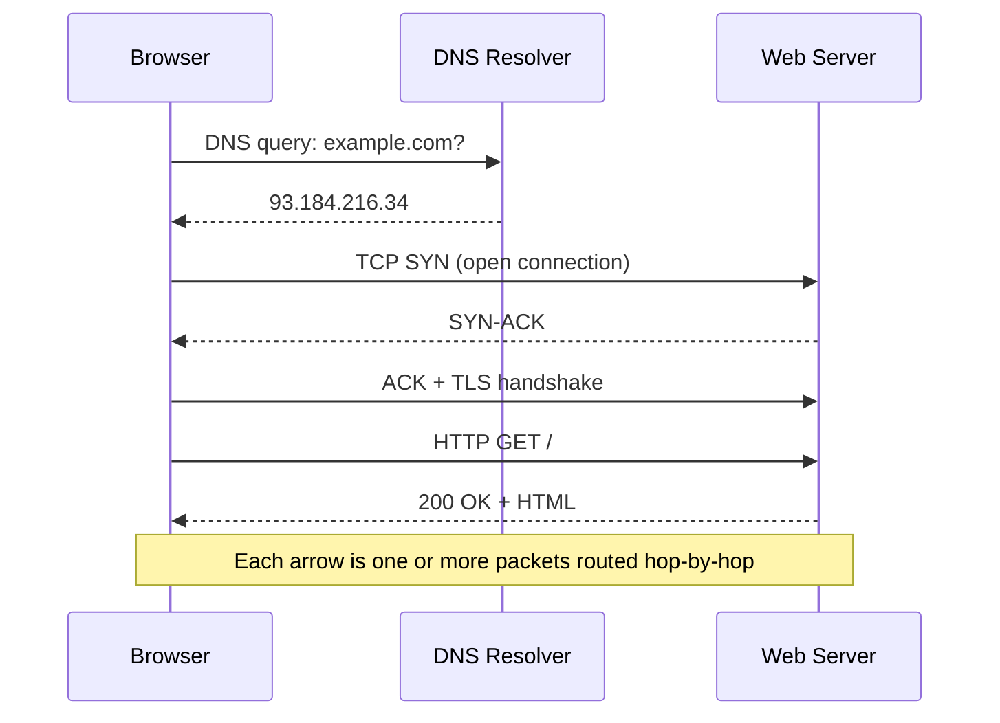

  <h1 style="color: white; margin: 0; font-size: 2rem;">Networking</h1>
  
TCP/IP protocols, routing, and modern network architecture

<!-- Custom styles are now loaded via main.scss -->

Every web page, message, and video travels through an intricate network of connections. This hub follows a single packet's journey, then descends into the layers beneath it: the protocol stack, addressing and routing, queueing and congestion control, performance and security, and finally modern architecture (edge, 5G, and software-defined networking). Start with the end-to-end packet story below, then work through the pages in the order suggested at the bottom.

## The Journey of a Network Packet

Let's start with something familiar: what happens when you type a URL and press Enter? This simple action triggers a cascade of network operations that this guide uses to explore fundamental concepts.

First, your browser needs to find the server. It sends a DNS query to translate the domain name into an IP address. This query itself is a network packet that must navigate through routers, switches, and servers to reach its destination. Along the way, it encounters the same challenges that all network traffic faces: congestion, routing decisions, and potential delays.

Each arrow in that diagram unpacks into a whole subject. The DNS lookup and TLS handshake are [application and transport protocols](transport-and-protocols.html); "routed hop-by-hop" is [routing and switching](routing.html); the layered headers that wrap the data are [the stack and addressing](fundamentals.html); and how fast it all completes is a [performance](performance-and-security.html) question. The pages below follow that progression.

## Explore Networking

| Page | What it covers |
|------|----------------|
| [Layers & Addressing](fundamentals.html) | OSI and TCP/IP models, encapsulation, IPv4/IPv6, CIDR subnetting |
| [Transport & Application Protocols](transport-and-protocols.html) | TCP congestion control, TCP vs UDP, HTTP/DNS/DHCP/SSH, well-known ports |
| [Routing & Switching](routing.html) | Shortest-path and max-flow algorithms, BGP, OSPF, static/dynamic routing, NAT, VLANs |
| [Performance, QoS & Security](performance-and-security.html) | Queueing models, firewalls, VPNs, ACLs, QoS, troubleshooting, SNMP/NetFlow |
| [Modern & Future Networking](modern-architecture.html) | Hub: how networks evolve, plus research frontiers (ICN, quantum, 6G) |
| [Programmable Networks](programmable-networks.html) | SDN, NFV, P4, MPLS, and segment routing (SR/SRv6) |
| [Cloud Networking](cloud-networking.html) | VPCs, subnets, route tables, load balancers, CDNs, NAT, shared responsibility |
| [Wireless & Mobile](wireless-and-mobile.html) | Wi-Fi (802.11), 4G/5G, the 5G core, spectrum, modulation, mobility |

  <h4>Suggested reading order</h4>
  
Read <a href="fundamentals.html">Layers &amp; Addressing</a> first to fix the vocabulary, then <a href="transport-and-protocols.html">Transport &amp; Application Protocols</a> and <a href="routing.html">Routing &amp; Switching</a> for how data actually moves, followed by <a href="performance-and-security.html">Performance, QoS &amp; Security</a>. With those foundations, start the <a href="modern-architecture.html">Modern &amp; Future Networking</a> hub, then dive into its three deep dives — <a href="programmable-networks.html">Programmable Networks</a>, <a href="cloud-networking.html">Cloud Networking</a>, and <a href="wireless-and-mobile.html">Wireless &amp; Mobile</a> — in any order.

## Key Takeaways

- **Layers separate concerns.** The OSI/TCP-IP stack lets each layer evolve independently — the same browser works over Wi-Fi, fiber, or cellular.
- **IP routes, TCP/UDP deliver.** IP gets packets to the right host hop-by-hop; transport-layer ports and reliability decide which app gets them and how.
- **Performance is a queueing problem.** Latency, jitter, and loss come from queues filling at bottleneck links — congestion control exists to keep them stable.
- **Congestion control keeps the net alive.** Algorithms like Reno (loss-based) and BBR (model-based) continuously match sending rate to available capacity.
- **Routing scales hierarchically.** OSPF optimizes paths inside an organization; BGP exchanges policy-driven routes between the internet's autonomous systems.
- **Networks are becoming software.** SDN, NFV, P4, and eBPF move forwarding logic into programmable software, enabling 5G slicing and in-network computing.

## See Also

- [Cybersecurity](../cybersecurity/) — network security and zero-trust architecture
- [AWS](../aws/) — cloud networking, VPC, and Direct Connect
- [Docker](../docker/) — container networking and overlay networks
- [Kubernetes](../kubernetes/) — cluster networking and CNI plugins
- [Quantum Computing](../quantumcomputing.html) — quantum networking and QKD
