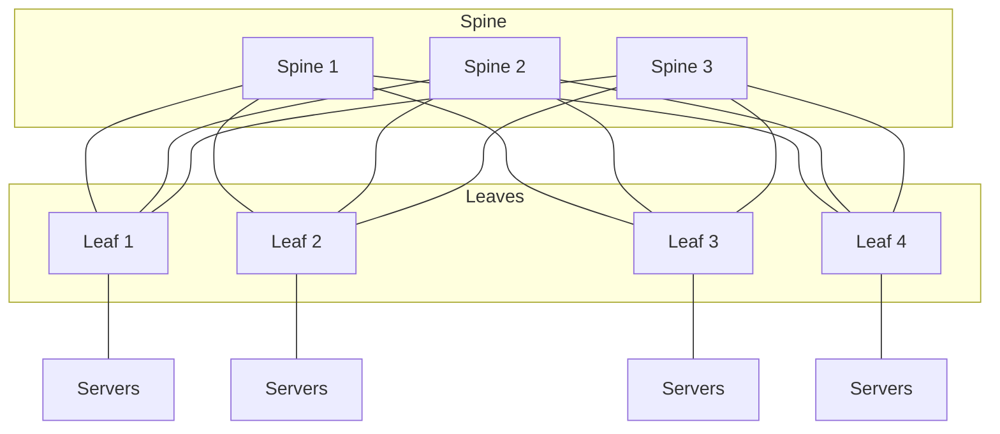
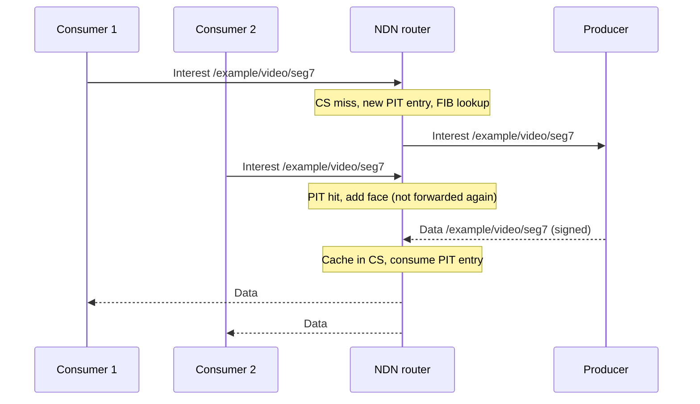
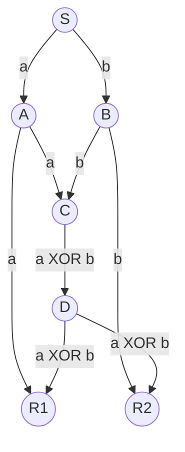
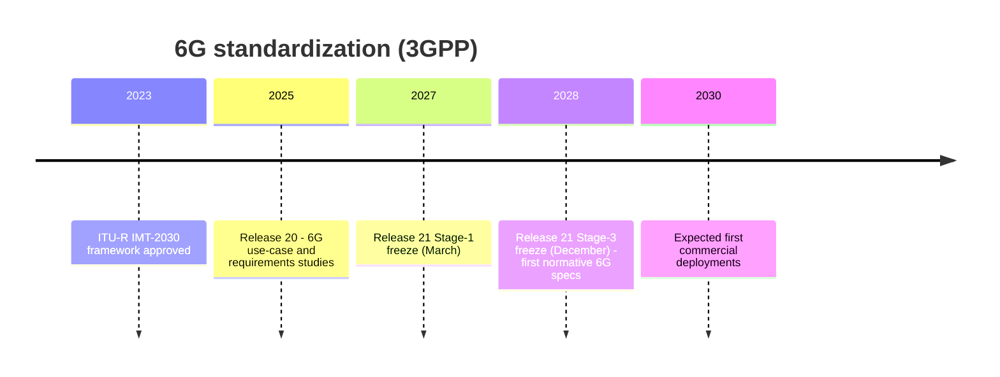

[Networking](./) &raquo; Modern Architecture &amp; Frontiers

This page covers two things that sit above the day-to-day mechanics of networking: how real traffic behaves, and where network design is heading. It first replaces the textbook assumption of smooth, independent traffic with the models that measurement actually supports (self-similar, heavy-tailed, and modulated processes), then looks at the data-centre fabrics that AI training clusters are forcing into existence, and finally surveys the main research directions: information-centric networking, network coding, quantum networking, and 6G.

The Python listings are compact, runnable models (NumPy only) meant to show the mechanism, not production code.

## Where This Page Fits

Three topics that began as sections of this page now have their own pages:

| Page | Covers |
|---|---|
| [Programmable Networks](programmable-networks.html) | SDN, P4, eBPF/XDP, NFV, MPLS, Segment Routing and SRv6, the IPv6 transition |
| [Cloud Networking](cloud-networking.html) | VPCs, route tables, load balancing, CDNs and anycast, NAT, shared responsibility |
| [Wireless & Mobile](wireless-and-mobile.html) | Wi-Fi, cellular evolution to 5G, the 5G core and slicing, mobility |

The common thread is **disaggregation**: control planes, forwarding hardware, network functions, and even radio access are being separated into components with open interfaces and replaced by software. This page focuses on the load those networks carry and the research that will shape the next generation.

## Traffic Models

Capacity planning, buffer sizing, and latency targets all rest on a model of the offered load. A model that underestimates burstiness produces networks that look adequately provisioned on average and still drop packets and blow latency budgets during the bursts that users actually notice.

The history of traffic modelling is largely the story of one assumption being overturned. The telephone network's **Poisson** model carried over to early data networks until Leland, Taqqu, Willinger, and Wilson ("On the Self-Similar Nature of Ethernet Traffic", 1994) showed that measured LAN traffic is bursty across every timescale from milliseconds to hours. Later work (Paxson and Floyd, 1995) found the same for wide-area traffic and traced it to heavy-tailed file and flow sizes.

### Poisson Arrivals

A Poisson process has independent arrivals at a constant rate $\lambda$. Inter-arrival gaps are exponential, $P(T > t) = e^{-\lambda t}$, with mean $1/\lambda$, and the process is **memoryless**: the time already waited says nothing about the time remaining. Poisson arrivals underlie the Erlang formulas for telephone trunks and the M/M/1 results in [Performance, QoS & Security](performance-and-security.html#queueing-models).

Poisson's defining property for provisioning is **smoothing under aggregation**. The count of arrivals in an interval has variance equal to its mean, so the relative fluctuation shrinks as $1/\sqrt{\lambda}$ and a trunk carrying thousands of independent callers is very predictable. Packet traffic does not behave this way: a large transfer or a video stream produces correlated bursts that do not average out.

### Self-Similarity and Long-Range Dependence

A self-similar traffic trace looks statistically the same whether it is plotted per millisecond, per second, or per minute. Its degree of self-similarity is summarized by the **Hurst parameter** $H$:

- $H = 0.5$: short-range dependence. Aggregating over longer windows smooths the traffic, as with Poisson.
- $0.5 < H < 1$: **long-range dependence** (LRD). Bursts persist at large timescales; measured internet traffic typically shows $H$ between 0.7 and 0.9.

The standard model is **fractional Gaussian noise** (FGN), the increment process of fractional Brownian motion, whose autocovariance at lag $k$ is

$$
\gamma(k) = \frac{1}{2}\left( |k+1|^{2H} + |k-1|^{2H} - 2|k|^{2H} \right) \sim H(2H-1)\, k^{2H-2} \quad (k \to \infty).
$$

For $H = 0.5$ this is zero at every nonzero lag (independent increments). For $H > 0.5$ it decays as a power law rather than exponentially, and the sum of the autocorrelations diverges, which is the formal definition of long-range dependence. An equivalent and easily measured signature is the **variance-time** relationship: averaging the series over blocks of size $m$ reduces its variance only as

$$
\operatorname{Var}\left(X^{(m)}\right) \propto m^{2H-2},
$$

instead of the $m^{-1}$ that independent samples would give. The practical consequences are that buffer overflow probabilities decay far more slowly with buffer size than Poisson predicts (adding buffer gives diminishing returns and adds latency) and that measurements over short windows systematically underestimate peak load.

### Heavy Tails: The Source of Self-Similarity

Self-similarity at the aggregate level arises from **heavy-tailed** behaviour at the level of individual sources. The **Pareto** distribution is the canonical model:

$$
P(X > x) = \left( \frac{x_m}{x} \right)^{\alpha}, \qquad x \ge x_m .
$$

For $\alpha < 2$ the variance is infinite, and for $\alpha \le 1$ the mean is infinite as well. Measured file sizes, web object sizes, and flow durations commonly fit $1 < \alpha < 2$: most flows are small "mice" while a small fraction of "elephants" carries most of the bytes.

Willinger, Taqqu, Sherman, and Wilson (1997) made the link precise. Superposing many independent ON/OFF sources whose ON or OFF periods are heavy-tailed with index $1 < \alpha < 2$ produces aggregate traffic that is asymptotically self-similar with

$$
H = \frac{3 - \alpha}{2} .
$$

So $\alpha = 1.4$ gives $H = 0.8$, matching measured traffic. The same mouse/elephant structure motivates practical designs: flow-aware scheduling that gives short flows priority, and load balancers and ECMP hashing that must cope with a few very large flows.

### Markov-Modulated Poisson Processes

Many sources switch between regimes: a voice call alternates talk-spurts and silence, a sensor toggles between active and idle, a user session alternates bursts of page loads with think time. A **Markov-modulated Poisson process** (MMPP) models this with a hidden continuous-time Markov chain; while the chain is in state $s$, arrivals are Poisson with rate $\lambda_s$. The long-run rate is $\bar{\lambda} = \sum_s \pi_s \lambda_s$, where $\pi$ is the chain's stationary distribution.

MMPP captures short-range burst correlation while remaining analytically tractable: it plugs into matrix-analytic queueing methods (MAP/M/1 and related queues) the way Poisson plugs into M/M/1. It does not reproduce correlation over many decades of timescale, but for voice, video, and IoT workloads that is often an acceptable trade.

### Generating and Measuring Traffic

The listing generates each kind of traffic and estimates $H$ with the variance-time method:

```python
import numpy as np

rng = np.random.default_rng(42)

def poisson_arrivals(rate, duration):
    """Arrival times of a Poisson process: i.i.d. exponential gaps."""
    gaps = rng.exponential(1 / rate, int(rate * duration * 1.2) + 10)
    t = np.cumsum(gaps)
    return t[t < duration]

def fgn(n, H):
    """Fractional Gaussian noise by exact Cholesky factorization.
    O(n^2) memory: fine for a few thousand samples (use Davies-Harte beyond)."""
    k = np.arange(n)
    gamma = 0.5 * (np.abs(k + 1)**(2*H) + np.abs(k - 1)**(2*H) - 2 * np.abs(k)**(2*H))
    cov = gamma[np.abs(k[:, None] - k[None, :])]      # Toeplitz covariance matrix
    return np.linalg.cholesky(cov) @ rng.standard_normal(n)

def self_similar_counts(n, H, mean=100.0, cv=0.3):
    """Packets per time slot with long-range dependence (clipped at zero)."""
    return np.maximum(0.0, mean * (1 + cv * fgn(n, H)))

def pareto_sizes(n, alpha, x_min=1.0):
    """Heavy-tailed flow sizes by inverse-transform sampling."""
    return x_min / rng.uniform(size=n) ** (1 / alpha)

def mmpp_arrivals(rates, Q, duration):
    """Markov-modulated Poisson process.
    rates[s]: arrival rate in state s; Q: CTMC generator (rows sum to 0)."""
    rates, Q = np.asarray(rates, float), np.asarray(Q, float)
    t, s, out = 0.0, 0, []
    while t < duration:
        end = min(t + rng.exponential(1 / -Q[s, s]), duration)  # sojourn in s
        n = rng.poisson(rates[s] * (end - t))                   # arrivals in [t, end)
        out.extend(np.sort(rng.uniform(t, end, n)))
        jump = np.maximum(Q[s], 0) / -Q[s, s]                   # next-state probabilities
        t, s = end, rng.choice(len(rates), p=jump)
    return np.array(out)

def hurst_aggregated_variance(x, scales=(1, 2, 4, 8, 16, 32, 64)):
    """Estimate H from the slope of log Var(X^(m)) against log m."""
    v = [x[: len(x) // m * m].reshape(-1, m).mean(axis=1).var() for m in scales]
    slope = np.polyfit(np.log(scales), np.log(v), 1)[0]
    return 1 + slope / 2

print(f"H estimate, FGN(H=0.8):    {hurst_aggregated_variance(self_similar_counts(4096, 0.8)):.2f}")
print(f"H estimate, Poisson slots: {hurst_aggregated_variance(rng.poisson(100, 4096).astype(float)):.2f}")
sizes = np.sort(pareto_sizes(100_000, alpha=1.2))[::-1]
print(f"Pareto(1.2): top 1% of flows carry {sizes[:1000].sum() / sizes.sum():.0%} of bytes")
a = mmpp_arrivals([50, 500], [[-1, 1], [4, -4]], 2000)
print(f"MMPP mean rate {len(a) / 2000:.0f}/s (theory {50 * 0.8 + 500 * 0.2:.0f}/s)")
# H estimate, FGN(H=0.8):    0.79
# H estimate, Poisson slots: 0.48
# Pareto(1.2): top 1% of flows carry 41% of bytes
# MMPP mean rate 142/s (theory 140/s)
```

### Choosing a Model

| Model | Captures | Good for | Misses |
|---|---|---|---|
| Poisson | Independent, memoryless arrivals | Aggregates of many independent sources (call or session arrivals); analytic baselines | Burstiness and correlation; too optimistic for packet traffic |
| MMPP | Correlated bursts driven by hidden states | On/off voice and video, IoT duty cycles, tractable queueing analysis | Correlation spanning many timescales |
| Self-similar (FGN) | Long-range dependence, scale-invariant burstiness | Aggregate LAN/WAN traffic, buffer and tail-latency studies | Closed-form queueing results (mostly simulation) |
| Heavy-tailed (Pareto) | Mouse/elephant structure of sizes and durations | Flow and file sizes; the cause of self-similarity | Temporal correlation on its own (it models sizes, not arrivals) |

The practical rule is to **provision for the tail, not the mean**. With self-similar, heavy-tailed load, a network spends a meaningful fraction of time well above its average utilization, so capacity and buffers sized from a Poisson model overflow, and latency-sensitive traffic suffers unless it is isolated by scheduling or AQM (see [bufferbloat and AQM](performance-and-security.html#buffers-bufferbloat-and-active-queue-management)).

## Data-Centre and AI-Cluster Fabrics

The most demanding networks being built in 2026 are not on the public internet but inside data centres, and increasingly inside clusters of tens of thousands of GPUs for model training.

### Leaf-Spine (Clos) Topologies

Modern data centres replaced tree-shaped core/aggregation/access designs with **leaf-spine** fabrics, a folded **Clos** network. Every leaf (top-of-rack) switch connects to every spine switch, so any two servers are the same number of hops apart and traffic is spread across all spines with **ECMP** (equal-cost multipath) hashing. Adding spines adds bisection bandwidth; adding a third tier (super-spines) scales to very large sites.



The fabric is typically routed at layer 3 end to end, often with BGP as the only routing protocol (RFC 7938), and tenant networks are carried as VXLAN or Geneve overlays on top (see [Programmable Networks](programmable-networks.html)).

### What AI Training Does to the Network

Distributed training alternates computation with **collective communication**: all-reduce to average gradients in data-parallel training, all-to-all exchanges for mixture-of-experts layers, and point-to-point transfers between pipeline stages. That traffic is unlike the heavy-tailed mix described above:

| Property | Typical cloud traffic | AI training traffic |
|---|---|---|
| Flow count and size | Many flows, mostly small | Few, very large, long-lived flows |
| Timing | Statistically multiplexed | Synchronized: every GPU sends at once, then waits |
| What matters | Median and p99 latency per request | **Job completion time**, set by the slowest flow in each collective |
| ECMP behaviour | Many flows average out across paths | Low entropy; a few hash collisions leave some links idle and others congested |

Because a training step cannot finish until every participant's data arrives, one congested link stalls thousands of GPUs. Clusters are therefore built as a **scale-up** domain (a small group of GPUs joined by a proprietary memory-semantic interconnect such as NVLink, with UALink as an open alternative) plus a **scale-out** network between groups. Scale-out networks are commonly **rail-optimized**: GPU *i* of every server connects to the same "rail" of leaf switches so that most collective traffic crosses a single switch hop.

The scale-out transport has historically been InfiniBand or **RoCEv2** (RDMA over Converged Ethernet). RoCEv2 assumes a lossless fabric, provided by **priority flow control** (PFC), which pauses upstream senders when a buffer fills; at scale PFC causes head-of-line blocking, congestion spreading, and occasional deadlocks, and the transport's go-back-N recovery reacts badly to any loss. The **Ultra Ethernet Consortium** (UEC), an industry group under the Linux Foundation, published its 1.0 specification in June 2025 with the goal of an open Ethernet stack for AI and HPC. Its Ultra Ethernet Transport (UET) sprays packets from one message across many paths, tolerates out-of-order arrival, uses selective retransmission instead of go-back-N, and builds in congestion control designed to work without depending on a lossless fabric.

## Research Frontiers

### Information-Centric Networking

IP names *locations*: a packet is addressed to a host. Users mostly want *content*, regardless of which host serves it. **Information-centric networking** (ICN) makes named data the primitive. Its most developed design is **Named Data Networking** (NDN), which grew out of Jacobson et al.'s Content-Centric Networking ("Networking Named Content", 2009).

NDN has two packet types. A consumer sends an **Interest** carrying a hierarchical name such as `/example/video/lecture3/seg7`; a matching **Data** packet, signed by its producer, returns along the reverse path. Each router keeps three tables:

| Table | Role | IP analogue |
|---|---|---|
| Content Store (CS) | Cache of recently forwarded Data packets | None (a CDN or proxy cache, bolted on) |
| Pending Interest Table (PIT) | Interests forwarded but not yet satisfied, with the faces they arrived on | None: IP routers keep no per-packet state |
| Forwarding Information Base (FIB) | Name-prefix to next-hop mapping | Routing table |



A minimal model of the router's Interest and Data handling:

```python
class NdnRouter:
    def __init__(self, fib):
        self.cs = {}      # name -> data (cache)
        self.pit = {}     # name -> set of faces awaiting the data
        self.fib = fib    # name prefix -> list of upstream faces

    def on_interest(self, name, face):
        if name in self.cs:                       # cache hit: answer locally
            return [(face, self.cs[name])]
        if name in self.pit:                      # already requested upstream:
            self.pit[name].add(face)              # aggregate, do not re-forward
            return []
        self.pit[name] = {face}
        # longest-prefix match on whole name components, e.g. /example matches /example/video
        matches = [p for p in self.fib if name == p or name.startswith(p.rstrip("/") + "/")]
        prefix = max(matches, key=len, default=None)
        return [(up, ("interest", name)) for up in self.fib.get(prefix, []) if up != face]

    def on_data(self, name, data):
        faces = self.pit.pop(name, set())         # unsolicited data is dropped
        if faces:
            self.cs[name] = data
        return [(f, data) for f in faces]
```

The design yields in-network caching, native multicast (the PIT aggregates identical Interests), and object-level security (a signature travels with the data, so a cached copy is as trustworthy as the original), and it lets a consumer use several interfaces at once. The open problems are routing on an unbounded, application-defined namespace, PIT memory and lookup cost at line rate, cache privacy, and incremental deployment over IP. NDN remains a research architecture with a global testbed; its ideas are visible in production CDNs and in content-addressed storage systems.

### Network Coding

Ordinary routers store and forward packets unchanged. **Network coding** lets intermediate nodes transmit functions of the packets they receive. Ahlswede, Cai, Li, and Yeung ("Network Information Flow", 2000) proved that with coding, a multicast session can achieve the max-flow min-cut capacity to every receiver simultaneously, which routing alone cannot do in general.

The standard example is the **butterfly network**. Source S multicasts packets $a$ and $b$ to receivers R1 and R2 over unit-capacity links, and the middle link is a bottleneck.



With routing, the C-D link can carry $a$ or $b$ but not both in one time slot, so one receiver gets only one packet. With coding, C sends $a \oplus b$; R1 recovers $b = a \oplus (a \oplus b)$ and R2 recovers $a$ the same way, so both receive two packets per slot.

The practical form is **random linear network coding** (RLNC; Ho, Médard, and colleagues, 2006). A *generation* of $n$ source packets $\mathbf{x}_1, \dots, \mathbf{x}_n$ is treated as vectors over a finite field $\mathrm{GF}(q)$, and each coded packet carries a random combination together with its coefficient vector:

$$
\mathbf{y}_j = \sum_{i=1}^{n} c_{ji}\, \mathbf{x}_i \quad \text{over } \mathrm{GF}(q) .
$$

A receiver can decode as soon as it holds any $n$ coded packets with linearly independent coefficient vectors, by Gaussian elimination. With $q = 2^8$ a random set of $n$ packets is independent with high probability, so it does not matter *which* packets were lost, only how many arrived. That property removes the need to retransmit specific packets, which is valuable on lossy wireless links, satellite and broadcast channels, and multipath transport. Intermediate nodes can also re-encode (recombine coded packets) without decoding first, which is what distinguishes network coding from end-to-end erasure codes such as RaptorQ (RFC 6330).

```python
import numpy as np

P = 257                      # a prime, so integers mod P form the field GF(P)
rng = np.random.default_rng(0)

def encode(packets, k):
    """k coded packets, each a random linear combination of the generation."""
    C = rng.integers(0, P, size=(k, len(packets)))          # coefficient vectors
    return C, (C @ packets) % P                             # header, payload

def decode(C, Y):
    """Gauss-Jordan elimination over GF(P); needs rank(C) == generation size."""
    n = C.shape[1]
    A = np.concatenate([C, Y], axis=1) % P
    row = 0
    for col in range(n):
        pivot = next((r for r in range(row, len(A)) if A[r, col]), None)
        if pivot is None:
            raise ValueError("not enough independent packets yet")
        A[[row, pivot]] = A[[pivot, row]]
        A[row] = A[row] * pow(int(A[row, col]), -1, P) % P  # scale pivot to 1
        for r in range(len(A)):
            if r != row and A[r, col]:
                A[r] = (A[r] - A[r, col] * A[row]) % P
        row += 1
    return A[:n, n:]

gen = rng.integers(0, 256, size=(4, 8))       # generation: 4 packets of 8 bytes
C, Y = encode(gen, 6)                          # send 6 coded packets
survivors = [0, 2, 3, 5]                       # any 4 of the 6 arrive
assert np.array_equal(decode(C[survivors], Y[survivors]), gen)
```

A prime field keeps the arithmetic readable; deployed codecs use $\mathrm{GF}(2^8)$ with table-driven multiplication so symbols map exactly onto bytes. The costs are encoding and decoding computation, the coefficient header (one symbol per source packet), and decoding delay while a generation fills. Related ideas are used in distributed storage (regenerating codes) and have been explored for QUIC and multipath transport.

### Quantum Networking and QKD

Quantum networks carry quantum states (qubits, usually encoded in photons) rather than bits. Two properties drive the field: an unknown quantum state cannot be copied (the **no-cloning theorem**), and measuring a state in the wrong basis disturbs it. Together they make eavesdropping detectable. The physics is developed in [Quantum Mechanics](../../physics/quantum-mechanics/) and [Quantum Computing](../quantumcomputing.html).

**Quantum key distribution** (QKD) is the deployed application. In **BB84** (Bennett and Brassard, 1984):

1. Alice sends each random bit as a photon polarized in a randomly chosen basis, rectilinear (+) or diagonal (&times;).
2. Bob measures each photon in his own randomly chosen basis. When the bases match he gets Alice's bit; otherwise his result is random.
3. Over an authenticated classical channel they announce their bases (never the bit values) and keep only positions where the bases matched: the **sifted key**, about half the raw bits.
4. They reveal a random sample to estimate the **quantum bit error rate** (QBER). An intercept-resend eavesdropper who measures in random bases and re-sends what she saw introduces about 25% errors in the sifted key. Above a threshold (around 11% for BB84 with one-way post-processing) they abort.
5. Otherwise, error correction and **privacy amplification** (hashing to a shorter key) remove both errors and any partial information an eavesdropper could hold.

```python
import numpy as np

rng = np.random.default_rng(7)

def bb84(n, eavesdrop=False):
    """BB84 with ideal single photons; returns (sifted length, QBER)."""
    bits = rng.integers(0, 2, n)            # Alice's raw key
    a_basis = rng.integers(0, 2, n)         # 0 = rectilinear (+), 1 = diagonal (x)
    photon_bit, photon_basis = bits.copy(), a_basis.copy()

    if eavesdrop:                           # intercept-resend attack
        e_basis = rng.integers(0, 2, n)
        wrong = e_basis != photon_basis
        photon_bit = np.where(wrong, rng.integers(0, 2, n), photon_bit)
        photon_basis = e_basis              # Eve re-sends in her own basis

    b_basis = rng.integers(0, 2, n)
    # Measuring in the photon's basis is deterministic; otherwise a coin flip
    b_bits = np.where(b_basis == photon_basis, photon_bit, rng.integers(0, 2, n))

    keep = a_basis == b_basis               # sifting: bases compared publicly
    return keep.sum(), np.mean(bits[keep] != b_bits[keep])

for eve in (False, True):
    kept, qber = bb84(100_000, eavesdrop=eve)
    print(f"eavesdropper={eve!s:5}  sifted={kept}  QBER={qber:.1%}")
# eavesdropper=False  sifted=50050  QBER=0.0%
# eavesdropper=True   sifted=50136  QBER=25.4%
```

QKD's security rests on physics, but real systems have practical limits:

- **Distance.** Photons cannot be amplified without destroying their state, and fibre loss (about 0.2 dB/km) limits point-to-point QKD to roughly 100-200 km at useful key rates. Longer networks such as China's Beijing-Shanghai backbone (about 2,000 km) chain **trusted relay** nodes, where keys exist in the clear and each node must be physically secured.
- **Satellites.** Free-space links avoid fibre loss. The Micius satellite demonstrated satellite-to-ground QKD over more than 1,200 km (2017) and entanglement-based QKD between ground stations 1,120 km apart (2020), and a 2025 experiment with the Jinan-1 microsatellite exchanged keys between ground stations in China and South Africa.
- **Implementation attacks.** Detector-blinding and similar attacks have broken commercial systems; measurement-device-independent QKD removes the detector from the trusted set at the cost of lower rates.
- **Authentication.** QKD still needs an authenticated classical channel, which in practice means pre-shared keys or classical signatures.

For these reasons the NSA, the UK NCSC, and several European agencies have advised against relying on QKD for general-purpose protection and recommend **post-quantum cryptography** (PQC) instead: classical algorithms believed secure against quantum computers that run on existing hardware and protocols. NIST published the first PQC standards in August 2024 (FIPS 203 ML-KEM for key establishment, FIPS 204 ML-DSA and FIPS 205 SLH-DSA for signatures). Hybrid key exchange combining X25519 with ML-KEM-768 is now the default in major browsers and CDNs, so a large share of TLS traffic is already protected against "harvest now, decrypt later" collection. See [Cryptography](../cybersecurity/cryptography.html).

The longer-term goal is a **quantum internet** that distributes entanglement end to end, enabling not just key distribution but distributed quantum computing and quantum-enhanced sensing. That requires **quantum repeaters**, which combine quantum memories with entanglement swapping to extend entanglement across lossy links without measuring it. Repeater nodes remain experimental; in 2024 groups at Delft and Harvard/AWS demonstrated heralded entanglement between quantum-memory nodes across metropolitan deployed fibre, tens of kilometres long.

### 6G

The ITU's **IMT-2030** framework (Recommendation ITU-R M.2160, 2023) defines the 6G requirements; 3GPP turns them into specifications.



IMT-2030 extends 5G's three usage scenarios to six, adding **integrated sensing and communication**, **AI and communication**, and **ubiquitous connectivity** to enhanced versions of the 5G trio. The main technical threads are:

- **New spectrum.** The upper mid-band (roughly 7-24 GHz) as the main new capacity layer, with sub-THz bands above 100 GHz for very short-range, very high-rate links.
- **AI-native air interface.** Parts of the physical layer (channel estimation, beam management, even waveforms) learned rather than hand-designed.
- **Integrated sensing and communication (ISAC).** The same spectrum and hardware used to sense the environment (radar-like detection and positioning) while communicating.
- **Non-terrestrial networks.** LEO satellites and high-altitude platforms integrated with the terrestrial network rather than bolted on; 3GPP began this in 5G Releases 17-19.
- **Energy efficiency** as a first-class requirement, with network elements able to sleep aggressively at low load.

The 5G foundations these build on, including massive MIMO, the service-based core, and network slicing, are covered in [Wireless & Mobile](wireless-and-mobile.html).

### Other Active Areas

| Area | What it is | Status |
|---|---|---|
| Deterministic networking (IETF DetNet, IEEE 802.1 TSN) | Bounded latency and zero congestion loss for industrial control, automotive, and professional audio/video | Standardized; deployed in factories and in-vehicle networks |
| Network verification | Formally checking configurations and data-plane state (reachability, loop freedom, isolation) before and after changes | Used in production by large cloud providers; open tools such as Batfish |
| Network digital twins | A continuously updated model of a live network used to test changes and predict behaviour, driven by the traffic models above | Early production use by operators |
| AI for network operations | ML for anomaly detection and traffic prediction; LLM-based agents that read telemetry and propose or apply configuration changes under guard-rails | Rapidly growing; verification and safe-rollback are the limiting factors |
| In-network computing | Aggregation, caching, and consensus executed on programmable switches and SmartNICs | Research and niche production (see [Programmable Networks](programmable-networks.html)) |
| LEO satellite broadband | Large constellations with inter-satellite laser links providing global low-latency access | Commercial at scale; the direct-to-device segment is now converging with 3GPP NTN |
| Post-quantum migration | Replacing RSA and elliptic-curve key exchange and signatures in TLS, SSH, IPsec, and DNSSEC | Key exchange largely migrating; signatures and PKI lag |

## Further Reading

**Textbooks**

- Kurose and Ross, *Computer Networking: A Top-Down Approach*
- Peterson and Davie, *Computer Networks: A Systems Approach* (also freely available online as the *Systems Approach* book series)
- Tanenbaum, Feamster, and Wetherall, *Computer Networks*
- Kleinrock, *Queueing Systems*, Volumes 1 and 2
- Bertsekas and Gallager, *Data Networks*

**Landmark papers**

| Paper | Contribution |
|---|---|
| Jacobson, "Congestion Avoidance and Control" (1988) | TCP congestion control; ended the internet's congestion collapses |
| Leland, Taqqu, Willinger, Wilson, "On the Self-Similar Nature of Ethernet Traffic" (1994) | Overturned the Poisson assumption for data traffic |
| Willinger, Taqqu, Sherman, Wilson, "Self-Similarity Through High-Variability" (1997) | Explained self-similarity as the result of heavy-tailed ON/OFF sources |
| Ahlswede, Cai, Li, Yeung, "Network Information Flow" (2000) | Founded network coding |
| McKeown et al., "OpenFlow: Enabling Innovation in Campus Networks" (2008) | Launched software-defined networking |
| Jacobson et al., "Networking Named Content" (2009) | Content-centric networking, the basis of NDN |
| Bosshart et al., "P4: Programming Protocol-Independent Packet Processors" (2014) | Programmable data planes |
| Cardwell et al., "BBR: Congestion-Based Congestion Control" (2016) | Model-based congestion control |
| Langley et al., "The QUIC Transport Protocol" (2017) | Design and deployment experience of QUIC |

---

## Continue

**Previous:** [Performance, QoS & Security](performance-and-security.html) — the queueing theory these traffic models feed. &nbsp;**Up:** [Networking](./) — overview and navigation.

### See Also

- [Programmable Networks](programmable-networks.html) — SDN, P4, eBPF, NFV, and SRv6
- [Cloud Networking](cloud-networking.html) — VPCs, load balancing, CDNs, and the shared-responsibility model
- [Wireless & Mobile](wireless-and-mobile.html) — Wi-Fi, 5G, and the foundations 6G builds on
- [Transport & Application Protocols](transport-and-protocols.html) — QUIC, HTTP/3, and congestion control
- [Information & Coding Theory](../../advanced/information-coding-theory/) — the theory behind capacity, erasure codes, and network coding
- [Quantum Mechanics](../../physics/quantum-mechanics/) — the physics behind QKD and entanglement distribution
