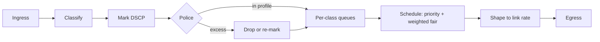
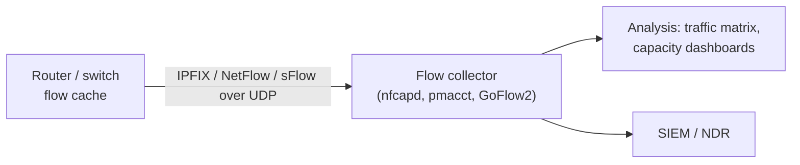
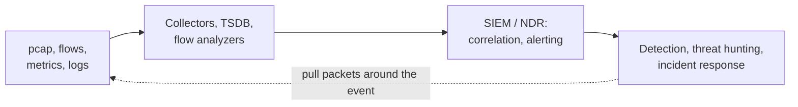

[Networking](./) &raquo; Performance, QoS &amp; Security

Whether a network feels fast depends mostly on what happens in the queues at its bottleneck links. This page develops the queueing models that explain latency, the buffer-management and quality-of-service mechanisms that keep queues under control, the network-layer security primitives (firewalls, VPNs, segmentation, DDoS mitigation) that sit on the same data path, and the tools and telemetry used to diagnose and monitor all of it.

The scope is the network layer. Threat modelling, zero trust, detection engineering, and incident response are covered in [Cybersecurity](../cybersecurity/); the [observability section](#network-observability) below describes how network telemetry feeds those workflows.

## Where Latency Comes From

The one-way delay a packet experiences at each hop is the sum of four components:

$$
d_{\text{hop}} = d_{\text{proc}} + d_{\text{queue}} + \frac{L}{R} + \frac{D}{s}
$$

| Component | Cause | Typical magnitude | What changes it |
|---|---|---|---|
| Processing $d_{\text{proc}}$ | Header parsing, lookup, checksum | Nanoseconds to microseconds in hardware | Faster silicon; software forwarding is slower |
| Queueing $d_{\text{queue}}$ | Waiting behind other packets | Zero to hundreds of milliseconds | Load, burstiness, buffer size, queue management |
| Transmission $L/R$ | Serializing $L$ bits onto a link of rate $R$ | 1500 B at 1 Gb/s = 12 &mu;s; at 10 Mb/s = 1.2 ms | Link speed |
| Propagation $D/s$ | Signal travelling distance $D$ at speed $s$ | About 5 &mu;s per km in fibre (light travels at roughly $2c/3$) | Physics; only a shorter path helps |

Propagation sets the floor (a New York to London round trip cannot be much below 56 ms over fibre), transmission matters only on slow links, and processing is negligible in modern hardware. **Queueing is the component that varies**, which is why it dominates jitter and why most performance engineering is really queue engineering.

A related quantity is the **bandwidth-delay product** (BDP), $R \times \text{RTT}$: the amount of data that must be in flight to keep a path full. A 1 Gb/s path with a 40 ms RTT has a BDP of 5 MB, which is the minimum window a TCP sender needs to fill it and the classic reference point for sizing buffers.

## Queueing Models

Queueing theory treats a router output port as a server that transmits packets at rate $\mu$ while packets arrive at rate $\lambda$. The ratio $\rho = \lambda / \mu$ is the **utilization**; a queue is stable only when $\rho < 1$.

### Little's Law

For any stable system, the mean number of items in the system equals the arrival rate times the mean time each spends there:

$$
L = \lambda W
$$

Little's law makes no assumptions about arrival or service distributions, which makes it the most widely used result in performance analysis. A switch port holding an average of 200 packets while forwarding 100,000 packets/s adds an average of 2 ms of delay; a service handling 500 requests/s with a mean latency of 40 ms has about 20 requests in flight.

### The M/M/1 Queue

The simplest analytic model assumes Poisson arrivals, exponentially distributed service times, one server, and an unbounded FIFO buffer (M/M/1 in Kendall notation). Its steady-state results are:

$$
L = \frac{\rho}{1-\rho}, \qquad
L_q = \frac{\rho^2}{1-\rho}, \qquad
W = \frac{1}{\mu - \lambda}, \qquad
W_q = \frac{\rho}{\mu - \lambda}
$$

where $L$ and $W$ count the packet in service and $L_q$ and $W_q$ count only waiting packets. The response time is itself exponentially distributed, $P(T > t) = e^{-(\mu - \lambda)t}$, so tail latency grows at the same rate as the mean.

The critical feature is the $1/(1-\rho)$ factor: delay is modest at moderate load and grows without bound as utilization approaches 1.

<figure>
<svg viewBox="0 0 480 260" role="img" aria-labelledby="mm1-title" style="max-width:480px;width:100%;height:auto;background:transparent" xmlns="http://www.w3.org/2000/svg">
  <title id="mm1-title">M/M/1 mean time in system, normalized to one service time, versus utilization</title>
  <g stroke="currentColor" fill="none" stroke-width="1">
    <line x1="50" y1="220" x2="460" y2="220"/>
    <line x1="50" y1="220" x2="50" y2="20"/>
    <line x1="50" y1="170" x2="460" y2="170" stroke-dasharray="2 4" opacity="0.4"/>
    <line x1="50" y1="120" x2="460" y2="120" stroke-dasharray="2 4" opacity="0.4"/>
    <line x1="50" y1="70" x2="460" y2="70" stroke-dasharray="2 4" opacity="0.4"/>
    <line x1="460" y1="20" x2="460" y2="220" stroke-dasharray="4 4" opacity="0.6"/>
  </g>
  <polyline fill="none" stroke="currentColor" stroke-width="2.5" points="50.0,210.0 56.6,209.8 63.2,209.7 69.8,209.5 76.4,209.3 83.0,209.1 89.6,208.9 96.2,208.7 102.8,208.5 109.4,208.3 116.0,208.1 122.6,207.8 129.2,207.6 135.8,207.4 142.4,207.1 149.0,206.8 155.6,206.5 162.2,206.2 168.8,205.9 175.4,205.6 182.0,205.2 188.6,204.9 195.2,204.5 201.8,204.1 208.4,203.7 215.0,203.3 221.6,202.8 228.2,202.3 234.8,201.8 241.4,201.2 248.1,200.7 254.7,200.0 261.3,199.4 267.9,198.7 274.5,197.9 281.1,197.1 287.7,196.2 294.3,195.3 300.9,194.2 307.5,193.1 314.1,191.9 320.7,190.6 327.3,189.1 333.9,187.5 340.5,185.7 347.1,183.7 353.7,181.4 360.3,178.9 366.9,176.0 373.5,172.6 380.1,168.7 386.7,164.1 393.3,158.5 399.9,151.8 406.5,143.4 413.1,132.6 419.7,118.3 426.3,98.4 432.9,68.7 439.5,20.0"/>
  <g fill="currentColor" font-size="12" font-family="sans-serif">
    <circle cx="255" cy="200" r="3.5"/><text x="248" y="190" text-anchor="end">&#961;=0.5: 2&#215;</text>
    <circle cx="378" cy="170" r="3.5"/><text x="370" y="160" text-anchor="end">&#961;=0.8: 5&#215;</text>
    <circle cx="419" cy="120" r="3.5"/><text x="411" y="110" text-anchor="end">&#961;=0.9: 10&#215;</text>
    <text x="44" y="224" text-anchor="end">0</text>
    <text x="44" y="174" text-anchor="end">5</text>
    <text x="44" y="124" text-anchor="end">10</text>
    <text x="44" y="74" text-anchor="end">15</text>
    <text x="44" y="24" text-anchor="end">20</text>
    <text x="50" y="238" text-anchor="middle">0</text>
    <text x="255" y="238" text-anchor="middle">0.5</text>
    <text x="460" y="238" text-anchor="middle">1.0</text>
    <text x="255" y="255" text-anchor="middle">utilization &#961;</text>
    <text x="14" y="120" text-anchor="middle" transform="rotate(-90 14 120)">W / service time</text>
  </g>
</svg>
<figcaption>Mean time in an M/M/1 system, in multiples of one packet's service time. Going from 80% to 90% utilization doubles the delay.</figcaption>
</figure>

This is the quantitative reason operators keep links well below 100% average utilization and why bursts, which briefly push the instantaneous load above 1, cause most latency spikes.

The closed forms are easy to check against a direct simulation. The listing below computes M/M/1 metrics and simulates the same queue with **Lindley's recursion**, $W_k = \max(0,\, W_{k-1} + S_{k-1} - A_k)$, which gives each packet's waiting time from its predecessor's:

```python
import numpy as np

def mm1(lam, mu):
    """Closed-form M/M/1 metrics (times in the units of 1/mu)."""
    rho = lam / mu
    if rho >= 1:
        raise ValueError(f"unstable: rho = {rho:.2f} >= 1")
    return {"rho": rho,
            "L": rho / (1 - rho),          # mean packets in system
            "Lq": rho**2 / (1 - rho),      # mean packets waiting
            "W": 1 / (mu - lam),           # mean time in system
            "Wq": rho / (mu - lam)}        # mean time waiting

def simulate_wq(lam, mu, n=200_000, seed=1):
    """Mean waiting time of a FIFO single-server queue via Lindley's recursion."""
    rng = np.random.default_rng(seed)
    a = rng.exponential(1 / lam, n)        # inter-arrival times
    s = rng.exponential(1 / mu, n)         # service times
    w, total = 0.0, 0.0
    for k in range(1, n):
        w = max(0.0, w + s[k - 1] - a[k])
        total += w
    return total / (n - 1)

# A link that forwards 1,000 packets/s, offered 800 packets/s
m = mm1(800, 1000)
print(f"utilization {m['rho']:.0%}, mean queueing delay {m['Wq']*1e3:.2f} ms")
print(f"simulated queueing delay       {simulate_wq(800, 1000)*1e3:.2f} ms")
# utilization 80%, mean queueing delay 4.00 ms
# simulated queueing delay       4.08 ms
```

### Beyond Poisson: Kingman's Formula

Real packet sizes are not exponential and real arrivals are burstier than Poisson (see [traffic models](modern-architecture.html#traffic-models)). For a general single-server queue (G/G/1), **Kingman's approximation** captures how variability inflates waiting time:

$$
W_q \approx \left( \frac{\rho}{1-\rho} \right) \left( \frac{c_a^2 + c_s^2}{2} \right) \tau
$$

Here $\tau = 1/\mu$ is the mean service time and $c_a$, $c_s$ are the coefficients of variation (standard deviation over mean) of inter-arrival and service times. For M/M/1 both equal 1 and the formula is exact. The formula separates the three levers available: reduce utilization, reduce **arrival variability** (pacing, shaping, smoothing bursts), or reduce **service variability** (more uniform packet or request sizes). Doubling burstiness hurts roughly as much as a large increase in load.

### Networks of Queues

A path through a network, or a request through a multi-tier service, visits several queues. In a **Jackson network** (Poisson external arrivals, exponential service, probabilistic routing), each node behaves like an independent M/M/1 queue once its total arrival rate is known. Those rates come from the **traffic equations**:

$$
\lambda_i = \gamma_i + \sum_j \lambda_j P_{ji}
\quad\Longleftrightarrow\quad
\boldsymbol{\lambda} = (I - P^{\mathsf{T}})^{-1} \boldsymbol{\gamma}
$$

where $\gamma_i$ is the external arrival rate at node $i$ and $P_{ji}$ the probability that a job leaving node $j$ goes next to node $i$. The example models a load balancer, an application tier, and a database that the application calls back into:

```python
import numpy as np

# Nodes: 0 = load balancer, 1 = app server, 2 = database
gamma = np.array([500.0, 0.0, 0.0])      # external arrivals (req/s)
P = np.array([[0.0, 1.0, 0.0],            # LB -> app always
              [0.0, 0.0, 0.6],            # app -> DB 60% of the time, else leaves
              [0.0, 1.0, 0.0]])           # DB -> back to app
mu = np.array([5000.0, 1500.0, 900.0])    # service rates (req/s)

lam = np.linalg.solve(np.eye(3) - P.T, gamma)   # traffic equations
rho = lam / mu
W = 1 / (mu - lam)                              # per-visit time at each node
visits = lam / gamma.sum()                      # mean visits per request
for name, l, r, v, w in zip(["LB", "app", "DB"], lam, rho, visits, W):
    print(f"{name:>3}: lambda={l:7.1f}/s  rho={r:.2f}  visits={v:.2f}  W={w*1e3:.2f} ms")
print(f"end-to-end mean latency: {(visits * W).sum()*1e3:.2f} ms")
#  LB: lambda=  500.0/s  rho=0.10  visits=1.00  W=0.22 ms
# app: lambda= 1250.0/s  rho=0.83  visits=2.50  W=4.00 ms
#  DB: lambda=  750.0/s  rho=0.83  visits=1.50  W=6.67 ms
# end-to-end mean latency: 20.22 ms
```

The feedback loop is the instructive part: although only 500 requests/s enter, the application tier sees 1,250/s because each request visits it 2.5 times on average, so it runs at 83% utilization and dominates end-to-end latency.

## Buffers, Bufferbloat, and Active Queue Management

A router needs buffers to absorb bursts, but how much buffering is right is a long-running debate.

- **Rule of thumb (BDP).** A single TCP flow needs about one bandwidth-delay product of buffer to keep a bottleneck busy through its sawtooth. This rule, from Villamizar and Song (1994), drove router design for a decade.
- **Many flows.** Appenzeller, Keslassy, and McKeown ("Sizing Router Buffers", 2004) showed that with $N$ desynchronized flows, $\text{BDP}/\sqrt{N}$ suffices, which for backbone links means orders of magnitude less memory.
- **Bufferbloat.** Cheap memory led to the opposite problem at the edge: home routers, cable modems, and cellular base stations with seconds of buffering. Loss-based congestion control (Reno, CUBIC) keeps increasing its window until the buffer overflows, so an oversized, always-full buffer adds its entire depth to every packet's latency. A video call sharing a link with an upload can see hundreds of milliseconds of added delay even though no packets are lost.

The remedy is **active queue management** (AQM): let the queue absorb short bursts, but signal congestion early (by dropping or ECN-marking packets) when a standing queue forms.

| Mechanism | Idea | Status |
|---|---|---|
| Tail drop | Drop arrivals only when the buffer is full | Default on much hardware; causes bufferbloat and global synchronization |
| RED | Drop with probability rising with average queue length | 1990s design; hard to tune, rarely enabled |
| CoDel (RFC 8289) | Drop when packets' **sojourn time** stays above a 5 ms target for a 100 ms interval | Parameterless in practice; standard in Linux |
| FQ-CoDel (RFC 8290) | Hash flows into separate queues, round-robin between them, CoDel on each | Linux default qdisc on most distributions; isolates sparse flows (DNS, games, VoIP) from bulk transfers |
| PIE (RFC 8033) | Control-theoretic drop probability targeting a queueing delay | Mandated in DOCSIS 3.1 cable modems |
| CAKE | FQ-CoDel plus built-in shaper, per-host fairness, and DiffServ tins | Linux `sch_cake` since 4.19; common in OpenWrt home routers |
| L4S (RFC 9330-9332) | Separate low-latency queue for scalable congestion controls that respond to fine-grained ECN marking | Standardized 2023; being deployed by cable operators and supported in Apple platforms |

**L4S** (Low Latency, Low Loss, Scalable throughput) is the most significant recent change. Senders using a scalable congestion control such as TCP Prague or DCTCP-style algorithms set the ECT(1) codepoint; a **dual-queue coupled AQM** (RFC 9332) keeps their traffic in a shallow queue marked at a sub-millisecond threshold, while classic traffic uses a separate queue, and the two queues' marking probabilities are coupled so the flows share capacity fairly. The goal is consistently low queueing delay (around 1 ms) at full utilization, which matters for cloud gaming, video conferencing, and interactive AR.

On Linux, replacing a bloated queue is a one-line change:

```bash
# Flow-queue CoDel on an interface (already the default qdisc on most distros)
tc qdisc replace dev eth0 root fq_codel

# CAKE with shaping just below the ISP rate, so the queue forms here
# (where it is managed) rather than in the modem
tc qdisc replace dev eth0 root cake bandwidth 90mbit

# Inspect drops, ECN marks, and backlog
tc -s qdisc show dev eth0
```

## Quality of Service

AQM keeps queues short; **quality of service** (QoS) decides which traffic gets served first when a link is congested. QoS only has an effect at points of contention: on an uncongested link every packet is transmitted immediately regardless of its marking.

### QoS Models

| Model | How it works | Where it is used |
|---|---|---|
| Best effort | All packets treated equally | The public internet between providers |
| IntServ | Per-flow reservations signalled with RSVP along the whole path | Rarely; per-flow state does not scale (RSVP-TE survives in MPLS traffic engineering) |
| DiffServ | Packets marked with a class at the edge; each hop applies a per-class behaviour | Enterprise, campus, carrier, and data-centre networks |

**DiffServ** is the model in practice. The 6-bit **DSCP** field in the IPv4 ToS byte or IPv6 Traffic Class selects a **per-hop behaviour** (PHB). Markings are honoured only inside a domain that agrees on them; most providers reset or ignore customer DSCP at their borders.

| Traffic class (RFC 4594) | PHB | DSCP |
|---|---|---|
| Network control (routing protocols) | CS6 | 48 |
| Telephony (voice media) | EF (Expedited Forwarding) | 46 |
| Signalling | CS5 | 40 |
| Multimedia conferencing | AF41 | 34 |
| Multimedia streaming | AF31 | 26 |
| Low-latency data (interactive, transactional) | AF21 | 18 |
| High-throughput data (bulk) | AF11 | 10 |
| Standard | DF (default) | 0 |
| Lower-effort (scavenger, backups) | LE (RFC 8622) | 1 |

Each Assured Forwarding class AF*xy* has a drop precedence *y* (1 = low, 3 = high), so a policer can re-mark out-of-contract traffic from AF41 to AF43 rather than dropping it.

### The QoS Pipeline



- **Classification and marking** happen once, as close to the source as possible (the access switch or the host itself), based on ports, addresses, or application identity.
- **Policing and shaping** both use a **token bucket** with rate $r$ and depth $b$: over any interval of length $t$, conforming traffic satisfies $A(t) \le r t + b$. A **policer** drops or re-marks excess packets immediately; a **shaper** delays them in a queue until tokens are available, trading latency for smoothness.
- **Scheduling** decides which queue transmits next. A **strict-priority** (low-latency) queue serves voice first, but must be policed or it can starve everything else. The remaining classes share bandwidth by weight, using **weighted fair queueing** or its cheaper approximation **deficit round robin**.
- **Congestion avoidance** within each class uses AQM (WRED on traditional hardware, CoDel-family algorithms in software).

## Network Security Primitives

Firewalls, VPNs, segmentation, and DDoS defences are the enforcement points on the data path. Higher-level policy (zero trust, identity-aware access) ultimately compiles down to rules in these devices.

### Firewalls

| Type | Inspects | Strengths | Limits |
|---|---|---|---|
| Stateless packet filter (ACL) | Individual packet headers: addresses, ports, protocol | Fast, runs in switch hardware | Must explicitly allow return traffic; no notion of a connection |
| Stateful firewall | Headers plus a connection-tracking table | Allows replies to established connections automatically; blocks unsolicited inbound | State table can be exhausted (SYN floods) |
| Application-layer proxy / WAF | Application protocol content (HTTP requests, DNS queries) | Blocks attacks invisible at L3/L4 (SQL injection, protocol abuse) | Higher latency and cost; must terminate TLS to see content |
| Next-generation firewall (NGFW) | All of the above plus application identification, user identity, IPS signatures, TLS inspection | Policy by application and user rather than port | Complex; TLS interception has privacy and breakage costs |

On Linux, **nftables** has replaced iptables as the standard packet-filtering framework (it is the default backend on current Debian, Ubuntu, and RHEL releases; the `iptables` command is often a compatibility shim over it). A minimal stateful host firewall:

```text
table inet filter {
    chain input {
        type filter hook input priority filter; policy drop;
        ct state established,related accept
        ct state invalid drop
        iif "lo" accept
        meta l4proto { icmp, ipv6-icmp } accept   # IPv6 and PMTU discovery need ICMP
        tcp dport { 22, 443 } accept
    }
}
```

The `inet` family covers IPv4 and IPv6 with one ruleset. Blocking all ICMP is a common mistake: IPv6 neighbour discovery depends on ICMPv6, and dropping "packet too big" messages breaks path-MTU discovery and causes connections that hang after the handshake.

Router ACLs follow the same first-match logic with an implicit deny at the end. A Cisco IOS extended ACL permitting only HTTPS to one server:

```text
ip access-list extended WEB-IN
 permit tcp any host 192.0.2.10 eq 443
 deny   ip any any log
!
interface GigabitEthernet0/1
 ip access-group WEB-IN in
```

### VPNs and Remote Access

A VPN carries traffic through an encrypted tunnel across an untrusted network. **Site-to-site** VPNs connect whole networks (branch to headquarters, data centre to cloud VPC); **remote-access** VPNs connect individual devices.

| Technology | Layer | Characteristics |
|---|---|---|
| IPsec (IKEv2, ESP) | Network | Standards-based and universally supported by routers, firewalls, and cloud VPN gateways; the default for site-to-site |
| WireGuard | Network (over UDP) | In the Linux kernel since 5.6 (2020); small codebase, fixed modern cryptography (Curve25519, ChaCha20-Poly1305), fast roaming; basis of many mesh VPNs |
| TLS VPN (OpenVPN, SSL VPN appliances) | Transport | Traverses restrictive firewalls on TCP/443; historically common for remote access |
| ZTNA | Application | Replaces "join the network" with per-application, identity- and device-checked access through a broker; no lateral network reachability |

Remote-access VPN concentrators have been among the most heavily exploited internet-facing devices in recent years, which is one driver behind the move to **zero-trust network access** (ZTNA): rather than placing a remote user on the internal network, each connection to each application is authorized separately. See [Cybersecurity](../cybersecurity/) for the zero-trust model.

### Segmentation

Flat networks let an attacker who compromises one host reach every other. **Segmentation** limits that blast radius:

- **VLANs and subnets with inter-zone firewalls** — the traditional approach; coarse, and rules are tied to IP addresses.
- **Microsegmentation** — policy enforced at every workload (host firewalls, hypervisor distributed firewalls, Kubernetes NetworkPolicy, eBPF-based enforcement such as Cilium), typically expressed in terms of workload identity or labels rather than addresses.
- **Cloud security groups** — stateful, per-instance rules that are microsegmentation by default; see [Cloud Networking](cloud-networking.html).

### DDoS Mitigation

| Attack class | Example | Mitigation |
|---|---|---|
| Volumetric | UDP reflection/amplification (DNS, NTP, memcached), botnet floods measured in Tb/s | Absorb with anycast scrubbing capacity (CDN or scrubbing service); upstream filtering; remotely-triggered black hole (RTBH) as a last resort |
| Protocol / state exhaustion | SYN floods, fragment floods | SYN cookies, connection-rate limits, stateless filtering ahead of stateful devices |
| Application layer | HTTP request floods, HTTP/2 Rapid Reset (2023) | Rate limiting, bot detection, WAF rules, server patches |

**BGP Flowspec** (RFC 8955) lets a network distribute fine-grained filter rules to its edge routers through BGP, and **source address validation** (BCP 38 ingress filtering) at provider edges is the systemic defence against the spoofing that reflection attacks rely on.

## Troubleshooting

### Diagnostic Tools

Several classic tools have modern replacements on Linux: `ss` supersedes `netstat`, and the `ip` command supersedes `ifconfig`, `route`, and `arp`.

| Question | Tool | Example |
|---|---|---|
| Is the host reachable, and with what RTT and loss? | `ping` | `ping -c 20 192.0.2.1` |
| Where along the path is delay or loss introduced? | `mtr` (continuous traceroute) | `mtr -rwzc 100 example.com` |
| What is the path and its MTU? | `traceroute`, `tracepath` | `tracepath example.com` |
| What addresses, routes, and neighbours does this host have? | `ip` | `ip -br addr`, `ip route get 192.0.2.1`, `ip neigh` |
| Which sockets are open, and which process owns them? | `ss` | `ss -tulpn` |
| Does the name resolve, and to what? | `dig` | `dig +short AAAA example.com @1.1.1.1` |
| What is actually on the wire? | `tcpdump`, Wireshark/`tshark` | `tcpdump -ni eth0 'tcp port 443'` |
| How much throughput does the path support? | `iperf3` | `iperf3 -c server -R -t 30` |
| Where does a web request spend its time? | `curl` timing | `curl -so /dev/null -w '%{time_connect} %{time_appconnect} %{time_starttransfer}\n' https://example.com` |
| Which hosts and ports are exposed? | `nmap` (authorized targets only) | `nmap -sS -p 1-1000 192.0.2.0/24` |
| Does latency rise under load (bufferbloat)? | `flent`, or `ping` during a large upload | `flent rrul -H server` |

### A Layered Method

Work up the stack, confirming each layer before blaming the next:

| Layer | Question | Checks |
|---|---|---|
| Physical | Is there link? | Link lights, `ip link` (state UP), interface error and CRC counters, optics levels |
| Data link | Can the host reach its gateway? | `ip neigh` for the gateway's MAC, VLAN tagging, switch port status, STP state |
| Network | Can it reach remote networks? | `ip route get`, ping a remote IP, `mtr` to see where loss begins |
| Transport | Can it open the connection? | `nc -vz host port`, firewall and security-group rules, `ss` on the server to confirm it is listening |
| Application | Does the service answer correctly? | DNS resolution, TLS certificate and SNI, HTTP status, application logs |

When the complaint is "slow" rather than "broken":

1. **Separate latency from throughput.** High RTT with low loss suggests distance or queueing; low throughput with low RTT suggests loss, a small window, or a rate limit.
2. **Measure latency under load.** If idle ping is 15 ms and it rises to 300 ms during a transfer, the problem is bufferbloat, and the fix is AQM or shaping, not more bandwidth.
3. **Look for loss and retransmissions** with `mtr` and `tshark -Y tcp.analysis.retransmission`. Loss that appears at one hop and persists to the destination is real; loss only at an intermediate hop is usually ICMP rate limiting on that router.
4. **Check MTU.** Tunnels (VPN, VXLAN, GRE) reduce the effective MTU; if ICMP "packet too big" is filtered, large transfers hang while small requests succeed.
5. **Check interface counters** for errors, discards, and (on older copper links) duplex mismatch.

## Network Observability

Observability is the difference between knowing a link is slow and knowing why. A well-instrumented network produces four complementary data streams, each at a different granularity and cost. The same data serves performance engineering (capacity planning, latency hunting) and security (anomaly detection, forensics).

| Data source | Granularity | Volume | Primary uses |
|---|---|---|---|
| Packet capture (pcap) | Every byte on the wire | Very high | Deep troubleshooting, forensics, intrusion analysis |
| Flow records (NetFlow, IPFIX, sFlow) | Per-conversation summaries | Moderate | Traffic matrices, anomaly detection, capacity planning, billing |
| Metrics and telemetry (SNMP, gNMI) | Per-interface counters and gauges | Low | Dashboards, alerting, trends |
| Logs (syslog, cloud flow logs, audit) | Per-event records | Moderate to high | Change correlation, audit trails, investigation |

### Packet Capture

Packet capture is the ground truth: it answers questions aggregated data cannot, such as which TLS handshake failed or why a retransmission storm began. Because volume is enormous, the practical workflow is to capture narrowly, store briefly, and analyze offline.

```bash
# Capture only HTTP/HTTPS to one host; rotate at 100 MB, keep 10 files
tcpdump -ni eth0 -C 100 -W 10 -w cap.pcap \
  'host 192.0.2.10 and (tcp port 80 or tcp port 443)'

# Headers only (first 128 bytes of each packet): smaller and more privacy-preserving
tcpdump -ni eth0 -s 128 -w headers.pcap

# Offline analysis with tshark
tshark -r cap.pcap -q -z conv,ip                        # top conversations
tshark -r cap.pcap -Y 'tcp.analysis.retransmission' \
  -T fields -e frame.time -e ip.src -e ip.dst           # retransmissions only
tshark -r cap.pcap -q -z follow,tcp,ascii,0             # reconstruct TCP stream 0
```

- **TAP versus SPAN.** A passive network TAP copies every frame without loss; a switch SPAN (mirror) port is cheaper but drops and reorders frames under load. Use a TAP when the capture must be authoritative.
- **Privacy.** Payloads can contain credentials and personal data. Limit snap length, capture headers where possible, and treat pcap files as sensitive; see [Privacy Engineering](../cybersecurity/privacy-engineering.html).
- **Continuous capture.** Ring-buffer recorders keep a rolling window of full packets so analysts can retrieve traffic from just before an alert fired.
- **Encryption limits visibility.** With TLS 1.3 and QUIC, captures show handshake metadata but not content; analysis shifts to flow behaviour, timing, and endpoint telemetry.

### Flow Telemetry: NetFlow, IPFIX, and sFlow

Routers and switches summarize traffic as **flow records**: one row per conversation, keyed by the 5-tuple (source and destination address and port, protocol), with byte and packet counts and timestamps. Flow data is small enough to retain for months and detailed enough to spot a scan, a DDoS ramp, or an unexpected top talker.

- **NetFlow v9 and IPFIX** (RFC 7011, the IETF standard derived from NetFlow v9) aggregate packets in a flow cache on the device and export each record when the flow ends or a timer expires.
- **sFlow** samples 1 in *N* packets and streams interface counters. Sampling keeps the cost constant at line rate, at the price of statistical rather than exact byte counts: adequate for trends and anomaly detection, less so for billing.



```bash
# Collect NetFlow/IPFIX on UDP 2055 with nfdump's collector
nfcapd -D -p 2055 -w /var/flows

# Top 10 source addresses by bytes
nfdump -R /var/flows -s srcip/bytes -n 10

# Flows to ports commonly used by backdoors and old IRC botnets
nfdump -R /var/flows 'dst port 4444 or dst port 6667'
```

The same records serve two audiences. For **performance**, they give traffic matrices for capacity planning, validate QoS classification, and support 95th-percentile transit billing. For **security**, they reveal port scans (many destination ports, few bytes each), beaconing (small, regular flows to one host), DDoS fan-in, and exfiltration (large egress to an unfamiliar destination).

### Metrics and Streaming Telemetry

| | SNMP | Streaming telemetry (gNMI, NETCONF/YANG) |
|---|---|---|
| Model | Pull: a manager polls agents | Push: the device streams updates on subscription |
| Data schema | MIB tree of OIDs | YANG models (often OpenConfig, vendor-neutral) |
| Typical resolution | 60-300 s polling | Sub-second sampling or on-change |
| Microburst visibility | None | Good |
| Security | Use SNMPv3 (authPriv); v1/v2c send community strings in cleartext | TLS-protected gRPC |
| Transport | UDP | gRPC over HTTP/2 |

SNMP remains universal, but its polling interval averages away the microbursts that cause drops in data-centre fabrics. Streaming telemetry pushes high-frequency counters and state changes to collectors such as Telegraf or gnmic, which write to a time-series database (Prometheus, InfluxDB) visualized in Grafana.

```bash
# Poll an interface's 64-bit inbound octet counter over SNMPv3
snmpget -v3 -l authPriv -u monitor -a SHA -A "$AUTHPASS" \
  -x AES -X "$PRIVPASS" 192.0.2.1 IF-MIB::ifHCInOctets.2

# Subscribe to the same counter with gNMI, sampled every 10 s
gnmic -a 192.0.2.1:57400 -u admin -p "$PASS" --skip-verify \
  subscribe --path "/interfaces/interface[name=Ethernet1]/state/counters/in-octets" \
  --stream-mode sample --sample-interval 10s
```

Programmable data planes add finer-grained sources: **In-band Network Telemetry** (INT) records per-hop queue depth and latency inside the packets themselves, and eBPF programs on hosts can export per-socket RTT and retransmission data without packet capture (see [Programmable Networks](programmable-networks.html)).

The headline metrics every dashboard tracks:

| Metric | Definition | Notes |
|---|---|---|
| Bandwidth (capacity) | Maximum rate a link can carry | A property of the link |
| Throughput | Rate actually achieved | Limited by the bottleneck, window size, and loss |
| Utilization | Throughput divided by capacity | The $\rho$ of the queueing models; averages hide bursts |
| Latency | One-way or round-trip delay | Track percentiles (p50, p99), not just the mean |
| Jitter | Variation in latency | Critical for voice and video; absorbed by playout buffers |
| Packet loss | Fraction of packets dropped | Even 1% loss sharply reduces loss-based TCP throughput |
| Errors and discards | CRC errors, buffer drops | Errors point at physical faults; discards point at congestion |

### Retention and Cost

Volume and value diverge over time, so each stream needs its own retention policy:

| Stream | Hot retention | Archive | Rationale |
|---|---|---|---|
| Full packet capture | Hours to days | Rarely | Needed only around an active incident |
| Flow records | Weeks to months | Months to years, compressed | Cheap enough for trend analysis and forensic look-back |
| Metrics | Days at full resolution | Months to years, downsampled | Old data needs trend resolution only |
| Logs | Days to weeks, searchable | Months to years | Audit, forensics, and regulatory requirements |

Common patterns are tiered storage (hot, searchable storage for recent data; object storage for older data), downsampling (for example 10 s resolution for a week, 1 min for a month, 1 h for a year), and sampling or aggregation at the source, which is the cheapest place to control volume. Compliance frameworks often set minimum retention for security-relevant logs; see [Compliance & Governance](../cybersecurity/compliance-and-governance.html).

### Integration with Security Operations

Network telemetry is a primary sensor for the security operations centre (SOC):



- **Flow records** feed network detection and response (NDR). Correlating a beaconing pattern with a suspicious DNS lookup and a firewall deny yields one high-confidence alert instead of three weak ones.
- **Packet capture** is the forensic backstop for confirming scope and extracting indicators once an alert fires.
- **Metrics and logs** provide the timeline: a configuration change, a CPU spike, and an unusual egress flow, lined up, tell the story.

For how this telemetry becomes detections and response actions, see [Security Operations](../cybersecurity/security-operations.html), [Operations & Response](../cybersecurity/operations-and-response.html), and [Incident Response](../cybersecurity/incident-response.html); for the threat models that decide what to look for, see [Attacks & Defense](../cybersecurity/attacks-and-defense.html).

---

## Continue

**Previous:** [Routing & Switching](routing.html) — the paths whose performance is measured here. &nbsp;**Next:** [Modern Architecture & Frontiers](modern-architecture.html) — realistic traffic models, AI-cluster fabrics, and the research frontier.

### See Also

- [Transport & Application Protocols](transport-and-protocols.html) — congestion control, the host-side response to queue build-up
- [Programmable Networks](programmable-networks.html) — eBPF, P4, and in-band telemetry
- [Cybersecurity](../cybersecurity/) — zero trust and network defence beyond the primitives here
- [Security Operations](../cybersecurity/security-operations.html) — turning flow, packet, and log telemetry into detections
- [Observability](../../observability/) — metrics, logs, and tracing for distributed applications
- [AWS](../aws/) — security groups, network ACLs, VPC Flow Logs, and CloudWatch
