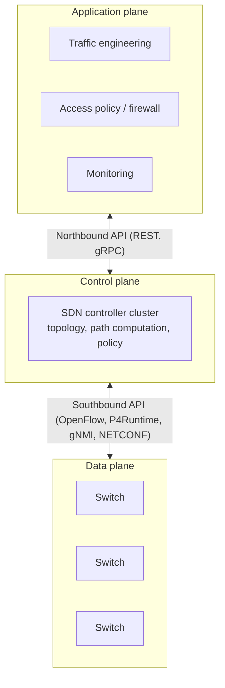
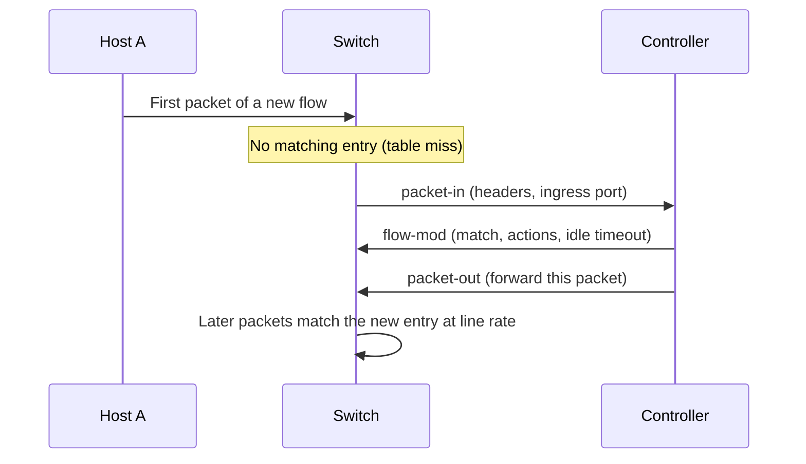
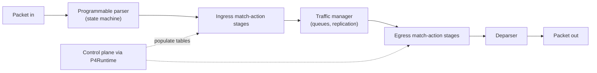
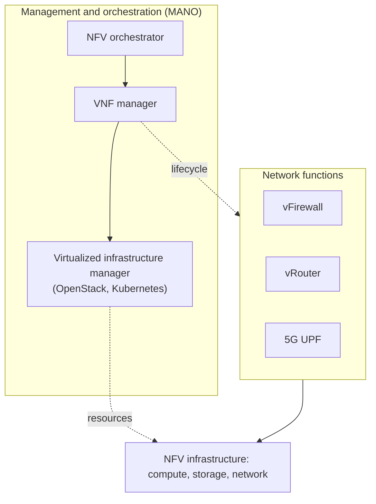
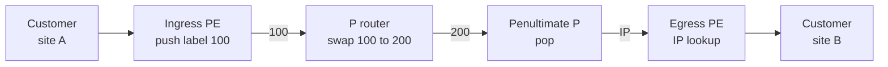
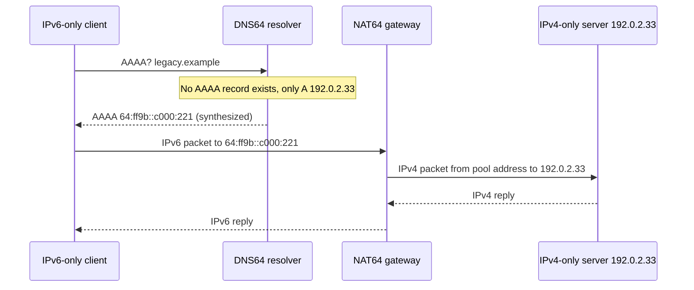

[Networking](./) &raquo; Programmable Networks

A traditional router or switch bundles three things in one closed box: the **data plane** that forwards packets, the **control plane** that decides where they go, and fixed silicon that determines which protocols the box can understand. Programmable networking separates these and exposes each through an open interface. This page covers the main technologies in that shift: software-defined networking (SDN) for the control plane, P4 for switch pipelines, eBPF and XDP for the host data plane, network function virtualization (NFV) for middleboxes, and label- and segment-based forwarding (MPLS, Segment Routing, SRv6) with the overlays and IPv6 transition mechanisms that carry modern traffic.

## From Appliances to Software

| Layer | Traditional | Programmable | Technologies |
|-------|-------------|--------------|------------|
| Control plane | Distributed routing protocols in vendor firmware on every box | Logically centralized controller, or open routing stacks | SDN controllers, OpenFlow, P4Runtime, gNMI; FRRouting |
| Network operating system | Vendor-integrated | Open NOS on merchant silicon ("white box") | SONiC, Linux-based NOSes |
| Switch data plane | Fixed-function ASIC | Reconfigurable match-action pipeline | P4 |
| Host data plane | Kernel network stack | Verified programs attached to kernel hooks, or kernel bypass | eBPF/XDP, DPDK |
| Network functions | Dedicated hardware appliances | Software on commodity servers or Kubernetes | NFV (VNFs, CNFs), service chaining |
| Forwarding fabric | Independent IP lookup at every hop | Path or service encoded in the packet | MPLS, Segment Routing, SRv6 |

The recurring idea is **disaggregation**: separate the component that decides from the component that forwards, separate the function from the box, and put an open, programmable interface between them.

## Software-Defined Networking

**Software-defined networking** (SDN) moves the control plane out of individual devices into a logically centralized controller that has a global view of the network, computes forwarding state, and installs it in comparatively simple switches.

### Architecture



- The **controller** (historically ONOS, OpenDaylight, Ryu, Faucet) maintains the topology and computes forwarding decisions.
- The **southbound API** programs devices: OpenFlow for flow tables, P4Runtime for P4 pipelines, and NETCONF or gNMI with YANG models for configuration and telemetry.
- The **northbound API** lets applications express what they want (a path with a latency bound, isolation between tenants) without touching individual devices. **Intent-based networking** pushes this further: operators declare an outcome and the system derives, applies, and continuously verifies the configuration.

### OpenFlow and the Match-Action Abstraction

OpenFlow (McKeown et al., 2008) launched SDN. Its abstraction is the **flow table**, an ordered list of entries, each with:

- a **match** over header fields (ingress port, Ethernet addresses, VLAN, IP addresses, TCP/UDP ports, and so on),
- **actions** (output to a port, drop, rewrite a field, push or pop a tag, send to the controller),
- a **priority** (the highest-priority matching entry wins),
- **counters** and **timeouts** (idle and hard).

A packet that matches no entry hits the **table-miss** entry, which usually sends it to the controller in a **packet-in** message. The controller decides what to do, installs a rule with a **flow-mod** so later packets of the flow stay in the hardware fast path, and releases the current packet with a **packet-out**:



OpenFlow 1.1 and later generalized the single table into a **multi-table pipeline** with metadata passed between tables, and added **group tables** for multipath, multicast, and fast failover. The last specification, OpenFlow 1.5.1, dates from 2015.

A reactive learning switch shows the controller's side of the loop:

```python
from collections import defaultdict

class LearningSwitchApp:
    """Reactive L2 learning switch, the 'hello world' of SDN controllers.

    The controller sees only table misses (packet-in). It learns which port
    each source MAC is behind and, once the destination is known, installs
    a flow so the switch forwards the rest of the traffic itself."""

    def __init__(self, channel):
        self.channel = channel                  # sends flow-mod / packet-out
        self.mac_to_port = defaultdict(dict)    # switch id -> {mac: port}

    def on_switch_connect(self, dpid):
        # Table-miss entry: lowest priority, match everything, punt to controller
        self.channel.flow_mod(dpid, priority=0, match={}, actions=["CONTROLLER"])

    def on_packet_in(self, dpid, in_port, src, dst, frame):
        table = self.mac_to_port[dpid]
        table[src] = in_port                    # learn where src lives
        out_port = table.get(dst)
        if out_port is None:                    # unknown destination: flood
            self.channel.packet_out(dpid, frame, actions=["FLOOD"])
            return
        self.channel.flow_mod(dpid, priority=10,
                              match={"in_port": in_port, "eth_dst": dst},
                              actions=[f"OUTPUT:{out_port}"], idle_timeout=300)
        self.channel.packet_out(dpid, frame, actions=[f"OUTPUT:{out_port}"])
```

### Design Choices

| Choice | Option A | Option B |
|---|---|---|
| Flow installation | **Reactive**: first packet of each flow goes to the controller. Economical with table space; adds setup latency and makes the controller a bottleneck under churn. | **Proactive**: rules computed and pushed before traffic arrives. No per-flow round trips; needs larger tables and full knowledge of expected traffic. |
| Controller placement | **Centralized** view, implemented as a replicated cluster (ONOS uses Raft-based distributed stores) so the view survives failures | **Hybrid**: distributed routing protocols keep basic reachability; the controller only overrides selected paths |

Production networks overwhelmingly choose proactive installation and hybrid control, because a data plane that depends on a reachable controller for every new flow is fragile.

### SDN in Practice

Pure OpenFlow networks, with dumb switches and a central brain, remained a niche. The SDN idea succeeded in other forms:

- **Wide-area traffic engineering.** Google's B4 (2013) and Microsoft's SWAN (2013) use central controllers to allocate inter-data-centre WAN capacity, running links far hotter than distributed routing would allow.
- **Overlay and cloud networking.** Cloud VPCs and platforms such as VMware NSX implement tenant networks in software on the hosts, with a controller programming virtual switches; see [Cloud Networking](cloud-networking.html).
- **SD-WAN.** Enterprise branch networks steer traffic across broadband, LTE, and MPLS links under central policy.
- **Controllers speaking routing protocols.** In provider networks the "controller" is often a path computation element (PCE) that learns topology through BGP-LS and programs Segment Routing policies with PCEP or BGP, leaving the distributed IGP in place.
- **Model-driven management.** gNMI, gNOI, and OpenConfig YANG models give a vendor-neutral, programmable interface for configuration and streaming telemetry.
- **Open network operating systems.** SONiC, originally from Microsoft and now a Linux Foundation project, runs on switches from many vendors and is widely deployed in hyperscale data centres.

Institutionally, the Open Networking Foundation, which stewarded OpenFlow, ONOS, and P4, merged into the Linux Foundation in December 2023.

> The distributed routing protocols that SDN complements or replaces (OSPF, BGP, per-hop shortest-path forwarding) are covered in [Routing & Switching](routing.html).

## P4: Programming the Switch Pipeline

OpenFlow can only match the header fields its switch ASIC was built to parse. **P4** (Programming Protocol-independent Packet Processors; Bosshart et al., 2014) goes a level lower: the program defines which headers exist, how they are parsed, and what tables process them. New protocols can then be deployed without new silicon.

### The PISA Pipeline

P4 programs target the **Protocol-Independent Switch Architecture** (PISA) or a variation of it:



1. The **parser** is a state machine that extracts headers into typed structures; the programmer defines the protocol graph.
2. **Ingress match-action** stages look up extracted fields in tables and run actions (rewrite headers, set metadata, choose an egress port, drop).
3. The **traffic manager** queues, schedules, and replicates packets (fixed function).
4. **Egress match-action** stages apply per-output-port processing.
5. The **deparser** serializes the possibly modified headers back onto the wire.

The P4 compiler maps the program onto a target (a switch ASIC, SmartNIC or DPU, FPGA, or a software switch such as BMv2), and the control plane fills tables at runtime through **P4Runtime**, a gRPC API.

### A Minimal P4 Program

The program below, written against the `v1model` architecture used by the BMv2 reference software switch, parses Ethernet and IPv4 and forwards by longest-prefix match on the destination address, decrementing the TTL and recomputing the header checksum:

```text
#include <core.p4>
#include <v1model.p4>

const bit<16> TYPE_IPV4 = 0x0800;

header ethernet_t {
    bit<48> dstAddr;
    bit<48> srcAddr;
    bit<16> etherType;
}

header ipv4_t {
    bit<4>  version;    bit<4>  ihl;       bit<8>  diffserv;
    bit<16> totalLen;   bit<16> identification;
    bit<3>  flags;      bit<13> fragOffset;
    bit<8>  ttl;        bit<8>  protocol;  bit<16> hdrChecksum;
    bit<32> srcAddr;    bit<32> dstAddr;
}

struct headers_t  { ethernet_t ethernet; ipv4_t ipv4; }
struct metadata_t { }

parser MyParser(packet_in pkt, out headers_t hdr,
                inout metadata_t meta, inout standard_metadata_t std) {
    state start {
        pkt.extract(hdr.ethernet);
        transition select(hdr.ethernet.etherType) {
            TYPE_IPV4: parse_ipv4;
            default:   accept;
        }
    }
    state parse_ipv4 {
        pkt.extract(hdr.ipv4);
        transition accept;
    }
}

control MyIngress(inout headers_t hdr, inout metadata_t meta,
                  inout standard_metadata_t std) {
    action drop() { mark_to_drop(std); }

    action ipv4_forward(bit<48> nextHopMac, bit<9> port) {
        std.egress_spec      = port;
        hdr.ethernet.srcAddr = hdr.ethernet.dstAddr;
        hdr.ethernet.dstAddr = nextHopMac;
        hdr.ipv4.ttl         = hdr.ipv4.ttl - 1;
    }

    table ipv4_lpm {
        key            = { hdr.ipv4.dstAddr: lpm; }
        actions        = { ipv4_forward; drop; }
        size           = 1024;
        default_action = drop();
    }

    apply {
        if (hdr.ipv4.isValid() && hdr.ipv4.ttl > 1) {
            ipv4_lpm.apply();
        } else {
            drop();
        }
    }
}

control MyVerifyChecksum(inout headers_t hdr, inout metadata_t meta) { apply { } }
control MyEgress(inout headers_t hdr, inout metadata_t meta,
                 inout standard_metadata_t std) { apply { } }

control MyComputeChecksum(inout headers_t hdr, inout metadata_t meta) {
    apply {
        update_checksum(hdr.ipv4.isValid(),
            { hdr.ipv4.version, hdr.ipv4.ihl, hdr.ipv4.diffserv,
              hdr.ipv4.totalLen, hdr.ipv4.identification, hdr.ipv4.flags,
              hdr.ipv4.fragOffset, hdr.ipv4.ttl, hdr.ipv4.protocol,
              hdr.ipv4.srcAddr, hdr.ipv4.dstAddr },
            hdr.ipv4.hdrChecksum, HashAlgorithm.csum16);
    }
}

control MyDeparser(packet_out pkt, in headers_t hdr) {
    apply { pkt.emit(hdr.ethernet); pkt.emit(hdr.ipv4); }
}

V1Switch(MyParser(), MyVerifyChecksum(), MyIngress(), MyEgress(),
         MyComputeChecksum(), MyDeparser()) main;
```

The program defines the *shape* of the `ipv4_lpm` table but none of its entries; a controller installs routes at runtime over P4Runtime, exactly as a routing daemon would program a conventional FIB.

### Match Kinds

| Match kind | Semantics | Typical hardware | Used for |
|---|---|---|---|
| `exact` | Key equals value | Hash table in SRAM | MAC tables, tunnel IDs, flow state |
| `lpm` | Longest matching prefix wins | TCAM or algorithmic LPM | IP routing |
| `ternary` | Value and mask, with priority | TCAM | ACLs, firewall rules, classification |
| `range` | Key within an interval | TCAM (expanded) | Port ranges |

### What a Programmable Data Plane Enables

- **In-band Network Telemetry (INT).** Each switch appends its identity, queue depth, and timestamps to packets as they pass, giving per-packet, per-hop visibility of where latency accumulates, far beyond what sampled counters can show.
- **In-network computing.** Stateful registers let switches keep per-flow state and run algorithms at line rate: count-min sketches for heavy-hitter detection, load balancing, key-value caching (NetCache), and aggregation of gradients for distributed training (SwitchML).
- **Custom protocols and encapsulations** deployed as software updates rather than hardware refreshes.

The constraints are what make line rate possible: a hardware pipeline has a fixed number of stages, each table is applied at most once per packet, memory per stage is small, and there are no unbounded loops. Software targets remove these limits at orders of magnitude lower throughput.

### Status in 2026

The language is stable: the current P4<sub>16</sub> specification is version 1.2.5 (October 2024), and P4Runtime reached version 1.5.0 in February 2026. The hardware landscape has shifted. Intel's Tofino line was the flagship programmable switch ASIC, but Intel stopped developing new Tofino generations in 2023; its software development kit has since been released as open source (`open-p4studio`). P4 activity has moved toward SmartNICs and DPUs (with the **Portable NIC Architecture**, PNA), FPGAs, and software targets, including backends of the reference compiler `p4c` that generate DPDK and eBPF code. The P4 project is now hosted by the Linux Foundation.

## eBPF and XDP: The Programmable Host

**eBPF** lets verified programs run inside the Linux kernel, attached to hooks throughout the network stack, without writing kernel modules. The kernel's **verifier** proves each program terminates and only accesses memory it is allowed to, then a JIT compiles it to native code. Programs keep state and communicate with user space through **maps** (hash tables, arrays, ring buffers).

| Hook | Runs | Typical use |
|---|---|---|
| XDP (eXpress Data Path) | In the NIC driver, before the kernel allocates a socket buffer | DDoS dropping, L4 load balancing, fast forwarding (`XDP_DROP`, `XDP_TX`, `XDP_REDIRECT`) |
| tc (traffic control) ingress/egress | After the socket buffer exists, with full packet metadata | Container networking, policy enforcement, NAT, shaping |
| Socket and cgroup hooks | At `connect()`, `sendmsg()`, and socket operations | Service load balancing without per-packet NAT, per-workload policy |
| kprobes, tracepoints | Anywhere in the kernel | Observability: per-connection RTT, retransmissions, drops with reasons |

A complete XDP program that drops UDP traffic to port 9999 before it reaches the kernel stack:

```c
// SPDX-License-Identifier: GPL-2.0
#include <linux/bpf.h>
#include <linux/if_ether.h>
#include <linux/in.h>
#include <linux/ip.h>
#include <linux/udp.h>
#include <bpf/bpf_helpers.h>
#include <bpf/bpf_endian.h>

SEC("xdp")
int drop_udp_9999(struct xdp_md *ctx)
{
    void *data     = (void *)(long)ctx->data;
    void *data_end = (void *)(long)ctx->data_end;

    /* Every pointer must be bounds-checked, or the verifier rejects the program */
    struct ethhdr *eth = data;
    if ((void *)(eth + 1) > data_end || eth->h_proto != bpf_htons(ETH_P_IP))
        return XDP_PASS;

    struct iphdr *ip = (void *)(eth + 1);
    if ((void *)(ip + 1) > data_end || ip->protocol != IPPROTO_UDP)
        return XDP_PASS;

    struct udphdr *udp = (void *)ip + ip->ihl * 4;
    if ((void *)(udp + 1) > data_end)
        return XDP_PASS;

    return udp->dest == bpf_htons(9999) ? XDP_DROP : XDP_PASS;
}

char LICENSE[] SEC("license") = "GPL";
```

```bash
clang -O2 -g -target bpf -c xdp_drop.c -o xdp_drop.o
ip link set dev eth0 xdp obj xdp_drop.o sec xdp     # attach (native mode)
ip link set dev eth0 xdp off                        # detach
```

eBPF is now a mainstream data plane in its own right. **Cilium**, a CNCF graduated project, implements Kubernetes networking, network policy, load balancing, and observability entirely in eBPF; Meta's **Katran** is an XDP-based L4 load balancer; large CDNs drop DDoS traffic with XDP; and the `netkit` device (Linux 6.7) gives containers an eBPF-programmable interface with host-level performance. See [Kubernetes](../kubernetes/) for the CNI context.

## Network Function Virtualization

**Network function virtualization** (NFV) replaces dedicated appliances (firewalls, load balancers, broadband gateways, mobile packet cores) with software running on commodity servers. Functions can be deployed in minutes, scaled with demand, and chained together.

### The ETSI Reference Architecture



- **NFVI** is the compute, storage, and network substrate.
- **VNFs** are the functions themselves, originally packaged as virtual machines. The industry has largely moved to **CNFs** (cloud-native network functions) packaged as containers and managed by Kubernetes, with projects such as Nephio automating their deployment.
- **MANO** instantiates, scales, heals, and chains functions from declarative descriptors.

The 5G core is NFV's largest success: its functions (AMF, SMF, UPF, and others) are specified as services and are typically deployed as CNFs; see [Wireless & Mobile](wireless-and-mobile.html).

NFV and SDN are complementary. NFV virtualizes *what* a function is; SDN or segment routing steers *how* traffic reaches it. **Service function chaining** (SFC) sends a flow through an ordered list of functions (for example firewall, then IDS, then load balancer) regardless of where each runs, encoding the chain with the Network Service Header (NSH, RFC 8300) or an SRv6 segment list.

### Fast Packet Processing

A function that moves every packet through the general-purpose kernel stack cannot keep up with a 100 Gb/s NIC (about 148 million minimum-size packets per second). Production NFV relies on:

| Technique | How it works | Trade-off |
|---|---|---|
| DPDK | Poll-mode user-space drivers bypass the kernel; dedicated cores, hugepages, lockless rings | Very high throughput; cores spin at 100% and the kernel's tools and stack are bypassed |
| eBPF/XDP | Processing in the driver, inside the kernel | Keeps kernel integration and tooling; constrained programming model |
| SR-IOV | NIC exposes many virtual functions assigned directly to VMs or containers | Near-native I/O; live migration and policy enforcement become harder |
| SmartNICs and DPUs | Offload switching, encryption, storage, and whole virtual switches to the NIC's own processors (NVIDIA BlueField, AMD Pensando, Intel IPU, AWS Nitro) | Frees host CPUs and isolates the infrastructure from tenants; vendor-specific programming models |

## Label and Segment Forwarding

Plain IP forwarding makes an independent longest-prefix-match decision at every router. That is robust but gives little control over *which* path a flow takes. Label and segment forwarding encode a path or a service into the packet so the core simply follows instructions.

### MPLS

**Multiprotocol Label Switching** forwards on short labels rather than IP addresses. A 32-bit label stack entry sits between the layer-2 and layer-3 headers:

| Field | Bits | Purpose |
|---|---|---|
| Label | 20 | Forwarding identifier, meaningful only to the receiving router |
| Traffic Class (TC) | 3 | QoS class (formerly "EXP") |
| Bottom of Stack (S) | 1 | Set on the last entry; labels can be stacked |
| TTL | 8 | Loop protection, copied from or to the IP TTL |



The ingress **label edge router** classifies a packet into a forwarding equivalence class and **pushes** a label; each **label switching router** **swaps** it with an exact-match lookup; the label is **popped** at or just before the egress (penultimate-hop popping). Labels are distributed by LDP, or by RSVP-TE for explicitly routed traffic-engineering tunnels.

MPLS remains the backbone of service-provider networks because of what the label stack enables:

- **Traffic engineering**: explicit label-switched paths pinned along non-shortest routes to balance load or meet latency constraints.
- **VPNs**: BGP/MPLS **L3VPN** (RFC 4364) carries many customers' overlapping address spaces across one core, with an outer transport label and an inner VPN label. For layer-2 services, **EVPN** (RFC 7432) has largely replaced VPLS.
- **Fast reroute**: precomputed backup paths restore traffic within about 50 ms of a link failure.

### Segment Routing

**Segment Routing** (SR, RFC 8402) keeps source routing through labels but removes the per-tunnel signalling state of LDP and RSVP-TE. The ingress node encodes a path as an ordered list of **segments**; transit routers execute the top segment and move to the next, holding no per-flow state.

- A **prefix (node) segment** means "go to node X by the shortest path" (loose routing).
- An **adjacency segment** means "leave through this specific link" (strict routing).
- Segments are advertised as **segment identifiers** (SIDs) by IS-IS or OSPF extensions, so any head end or controller can build explicit paths from the link-state database. Prefix SIDs are indices into a network-wide label block (the SRGB); adjacency SIDs are local to one router.

```python
def sr_mpls_label_stack(path, prefix_sid, adj_sid, srgb_base=16000):
    """Turn an explicit hop list into an SR-MPLS label stack (top label first).

    prefix_sid: {node: index}  -> label srgb_base + index, shortest path to node
    adj_sid:    {(a, b): label} -> local label that forces the a->b link
    Hops listed in adj_sid are pinned (strict); others use shortest paths (loose).
    """
    stack = []
    for a, b in zip(path, path[1:]):
        if (a, b) in adj_sid:
            stack.append(adj_sid[(a, b)])
        else:
            stack.append(srgb_base + prefix_sid[b])
    return stack

# Force the R2->R3 link, then reach R5 by shortest path
print(sr_mpls_label_stack(["R1", "R2", "R3", "R5"],
                          prefix_sid={"R2": 2, "R3": 3, "R5": 5},
                          adj_sid={("R2", "R3"): 24023}))
# [16002, 24023, 16005]
```

A real head end compresses this further, emitting a prefix SID only where the shortest path would diverge from the intended one. Because paths are just lists, SR also enables **TI-LFA** (topology-independent loop-free alternate) fast reroute, where each router precomputes a repair segment list that protects against any single link or node failure.

SR has two data planes:

- **SR-MPLS**: segments are MPLS labels, reusing existing MPLS hardware with a simpler control plane.
- **SRv6**: segments are IPv6 addresses carried in a **Segment Routing Header** (SRH, RFC 8754).

### SRv6 Network Programming

In SRv6 a SID is a 128-bit IPv6 address structured as **locator:function:argument**. The locator is a routable prefix that brings the packet to a node; the function tells that node what to do with it. RFC 8986 defines the standard behaviours:

| Behaviour | Action at the node owning the SID |
|---|---|
| End | Endpoint: advance to the next segment in the SRH and forward |
| End.X | Advance and send out a specific adjacency (the SRv6 adjacency SID) |
| End.DT4 / End.DT6 / End.DT46 | Decapsulate and look up the inner packet in a VRF table (L3VPN) |
| End.DX2 | Decapsulate and send the inner Ethernet frame out an interface (L2VPN) |
| H.Encaps | Head end: wrap the packet in an outer IPv6 header with an SRH |

Because a SID can mean "deliver to VPN 42" or "send through this firewall", SRv6 unifies the underlay (traffic engineering), overlay (VPN), and service chaining in one IPv6-native mechanism with no MPLS in the core, which has made it attractive for 5G transport. Its main cost was header size: a list of full 128-bit SIDs is large. **Compressed SIDs** (RFC 9800, June 2025) pack several short micro-SIDs into one 128-bit container, bringing overhead close to that of MPLS.

### Overlays: VXLAN, Geneve, and EVPN

Data-centre and cloud networks carry tenant layer-2 and layer-3 networks over a routed IP fabric using encapsulation:

- **VXLAN** (RFC 7348) wraps Ethernet frames in UDP (port 4789) with a 24-bit network identifier, allowing about 16 million segments instead of 4,094 VLANs.
- **Geneve** (RFC 8926) generalizes this with extensible option fields and is used by several cloud and virtual-switch implementations.
- **BGP EVPN** is the control plane: instead of flooding to learn MAC addresses, tunnel endpoints advertise MAC and IP bindings through BGP, enabling distributed gateways and multi-homing.

## The IPv6 Transition

SRv6 and much modern infrastructure assume IPv6, yet the internet still runs both protocols. Close to half of Google's users now reach it over IPv6, with mobile networks and some national markets well above that, while many enterprise and legacy networks remain IPv4-only. Transition mechanisms fall into three families:

| Family | Mechanism | How it works | Status |
|---|---|---|---|
| Dual stack | Hosts run both protocols | Clients race IPv6 and IPv4 connections and prefer IPv6 (Happy Eyeballs, RFC 8305) | The default for most networks; does not relieve IPv4 address scarcity |
| Tunnelling | 6in4, GRE | IPv6 carried inside IPv4 across legacy segments | Still used for manual tunnels |
| | 6to4, Teredo | Automatic tunnels derived from IPv4 addresses | Obsolete; 6to4 anycast deprecated (RFC 7526), Teredo disabled by default |
| | DS-Lite (RFC 6333) | IPv4 carried over an IPv6-only access network to a provider NAT | Used by some broadband ISPs |
| Translation | NAT64 + DNS64 (RFC 6146, 6147) | IPv6-only clients reach IPv4-only servers through a stateful translator | Standard on IPv6-only mobile networks |
| | 464XLAT (RFC 6877) | Client-side stateless translator plus provider NAT64, so IPv4-only applications work on IPv6-only networks | Deployed by major mobile carriers; built into Android |
| | MAP-E / MAP-T | Stateless sharing of IPv4 addresses across subscribers | Used by some ISPs |

NAT64 with DNS64 is the core of IPv6-only access:



The trend is toward **IPv6-only** networks with translation at the edge. The **IPv6-mostly** pattern lets dual-stack-capable clients signal (via DHCPv4 option 108, RFC 8925) that they can operate without IPv4, so the network assigns IPv4 addresses only to devices that still need them.

The IPv6 header also suits programmable forwarding: a fixed 40-byte base header, no router fragmentation (sources rely on path-MTU discovery), no header checksum, and a chain of **extension headers**. SRv6 uses exactly that extension-header mechanism to carry its segment list.

## Convergence

The technologies on this page are converging on one model. Switch pipelines are programmed in P4, host data planes in eBPF, NICs run their own programmable offloads, network functions run as containers, and paths and services are expressed as SRv6 segment lists computed by controllers from streaming telemetry. Every layer of the network, from control plane to NIC, has become software that can be versioned, tested, and rolled back, which is why network verification and safe automated change are now among the field's most active areas (see [Modern Architecture & Frontiers](modern-architecture.html#other-active-areas)).

## See Also

- [Routing & Switching](routing.html) — the distributed control plane: OSPF, BGP, and per-hop forwarding
- [Transport & Application Protocols](transport-and-protocols.html) — TCP, QUIC, and the protocols carried over these fabrics
- [Performance, QoS & Security](performance-and-security.html) — queueing, QoS, and the telemetry that programmable data planes extend
- [Modern Architecture & Frontiers](modern-architecture.html) — traffic models, AI-cluster fabrics, and the research frontier
- [Cloud Networking](cloud-networking.html) — VPCs and load balancers built on these ideas
- [Kubernetes](../kubernetes/) — cluster networking, CNI plugins, and eBPF data planes
