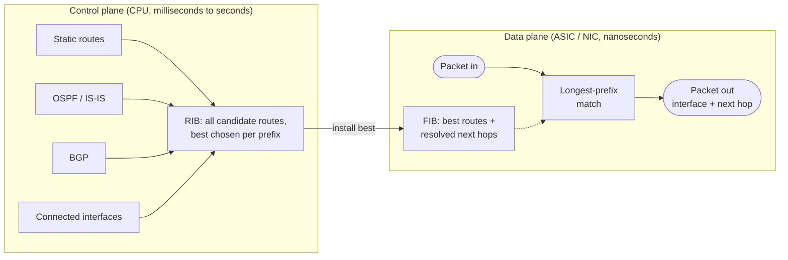
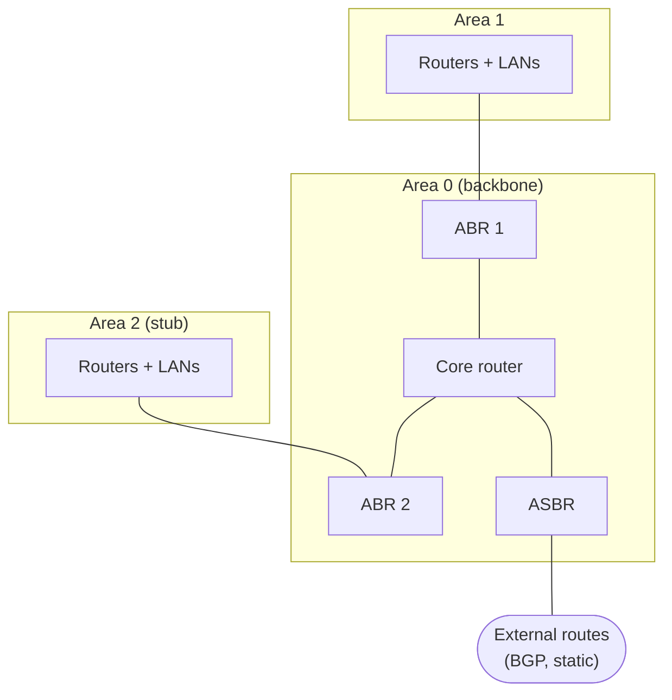
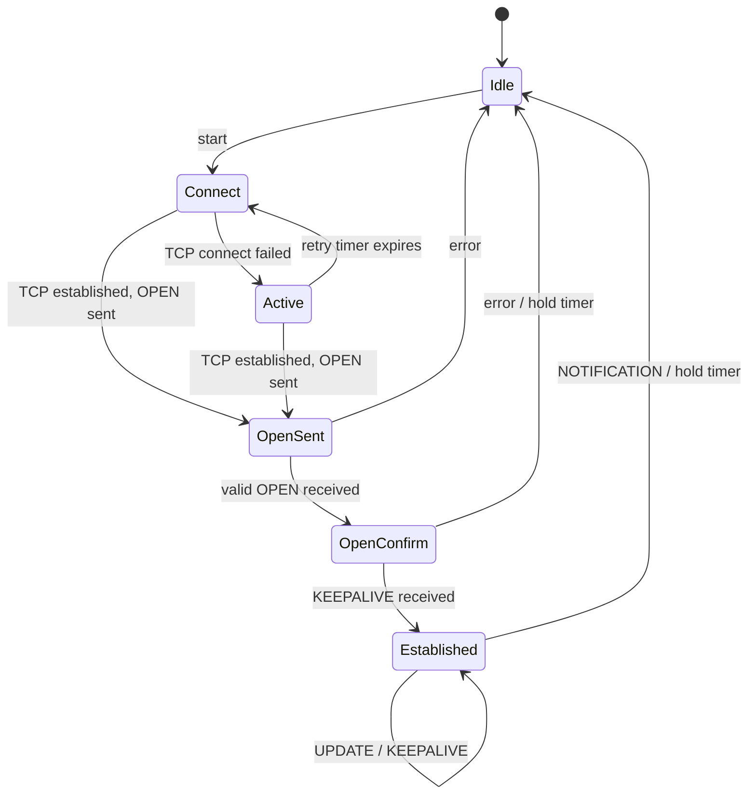
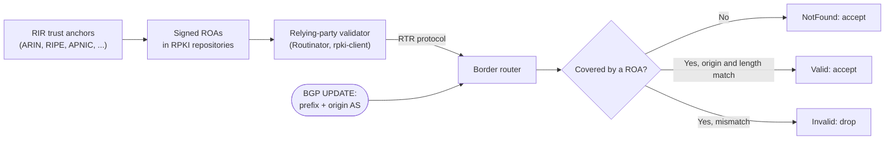
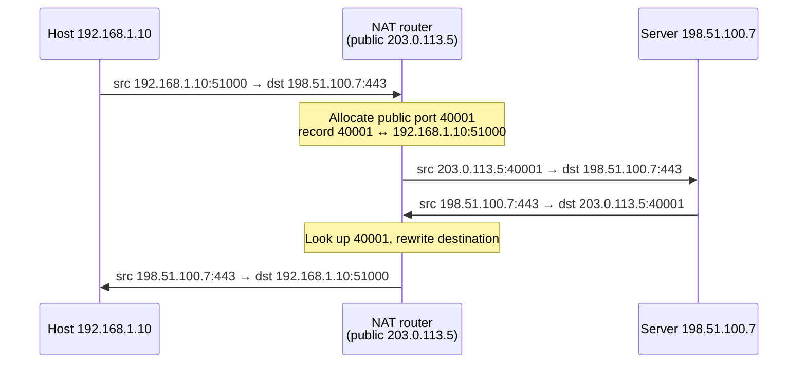
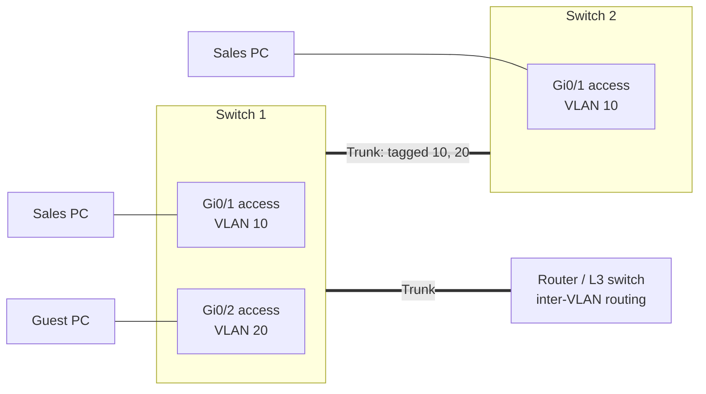

[Networking](./) &raquo; Routing &amp; Switching

**Routing** is the process of choosing a path for packets across interconnected networks; **switching** moves frames between hosts within one network. This page covers how a router forwards a packet (longest-prefix match against a forwarding table), how that table gets built (static routes and the link-state and distance-vector algorithms behind dynamic protocols), the interior protocols used inside an organization (OSPF, IS-IS), the Border Gateway Protocol that stitches roughly 80,000 independent networks into the internet, how BGP is secured, Network Address Translation, and Layer-2 switching with VLANs.

## Control Plane and Data Plane

Every router does two separate jobs:

- The **control plane** runs routing protocols, exchanges reachability information with neighbours, and computes the best path to every destination. Its output is the **Routing Information Base (RIB)**.
- The **data plane** (forwarding plane) moves each arriving packet to an output interface, as fast as possible, using a compact **Forwarding Information Base (FIB)** derived from the RIB. In hardware routers the FIB lives in TCAM or specialised lookup memory on the line card.



The split is what makes [software-defined networking](programmable-networks.html) possible: once the control plane is a separate process, it can move to a central controller.

### Longest-Prefix Match

A forwarding table maps **prefixes** (CIDR blocks, see [Layers & Addressing](fundamentals.html)) to next hops. When several prefixes contain the destination, the **most specific one — the longest prefix — wins**:

| Prefix | Next hop | Matches 10.1.2.3? |
|--------|----------|-------------------|
| 0.0.0.0/0 (default route) | 203.0.113.1 | Yes (/0) |
| 10.0.0.0/8 | 192.168.1.1 | Yes (/8) |
| 10.1.0.0/16 | 192.168.1.2 | Yes (/16) |
| 10.1.2.0/24 | 192.168.1.3 | **Yes (/24) — selected** |
| 10.2.0.0/16 | 192.168.1.4 | No |

Longest-prefix match is what allows aggregation (an ISP advertises one /16 upstream) while still permitting exceptions (a customer's more-specific /24 can be routed elsewhere). It is also what makes prefix hijacks effective: a more-specific announcement attracts traffic away from the legitimate, less-specific one.

### Choosing Between Sources: Administrative Distance

When two protocols offer a route to the *same* prefix length, the router needs a tie-breaker between sources before it can compare metrics (which are not comparable across protocols). Cisco calls this **administrative distance**; Juniper calls it **route preference**. Lower is more trusted. Common Cisco defaults:

| Route source | Administrative distance |
|--------------|-------------------------|
| Directly connected | 0 |
| Static | 1 |
| eBGP | 20 |
| EIGRP (internal) | 90 |
| OSPF | 110 |
| IS-IS | 115 |
| RIP | 120 |
| iBGP | 200 |

Setting a static route's distance above the dynamic protocol's (for example 250) makes a **floating static route**: a backup that installs only when the dynamic route disappears.

## Static Routing

A static route is a manually configured entry. It needs no protocol, costs no CPU, and never changes unless an operator changes it — which is both the benefit and the problem. Static routes suit stub networks with a single exit (a branch office, a home network, a server's default gateway) and fail badly anywhere topology changes.

On Linux, routes are managed with `ip route` from iproute2 (the older `route` command from net-tools is deprecated):

```bash
# Show the IPv4 and IPv6 routing tables
ip route show
ip -6 route show

# Ask the kernel which route it would use for a destination (runs the real lookup)
ip route get 10.1.2.3

# Add a route and a default route
sudo ip route add 10.0.0.0/8 via 192.168.1.1 dev eth0
sudo ip route add default via 192.168.1.254 metric 100

# A backup default with a worse metric (used only if the first disappears)
sudo ip route add default via 192.168.2.254 metric 200

# Delete a route
sudo ip route del 10.0.0.0/8
```

Routes added with `ip route` do not survive a reboot; persistent configuration belongs in the distribution's network manager (netplan, NetworkManager, systemd-networkd).

## Routing Algorithms

Dynamic routing protocols are built on one of two families of shortest-path algorithm. Both find least-cost paths through a weighted graph of routers and links; they differ in what each router knows.

| | Link-state | Distance-vector |
|--|-----------|-----------------|
| Each router knows | The full topology (every link and its cost) | Only its neighbours' distance estimates |
| Algorithm | Dijkstra (shortest-path first) | Distributed Bellman–Ford |
| What is flooded | Link-state advertisements (LSAs), to every router | Distance vectors, to neighbours only |
| Convergence | Fast; every router recomputes locally | Slower; news propagates hop by hop |
| Failure mode | Memory/CPU cost of the full map | Routing loops, count-to-infinity |
| Protocols | OSPF, IS-IS | RIP, EIGRP (an advanced variant), BGP (path-vector) |

### Link-State: Dijkstra's Algorithm

Every router floods a description of its own links to all others, so each builds an identical **link-state database** and independently runs Dijkstra from itself as root. The result is a shortest-path tree; the first hop along each branch becomes the next hop in the RIB.

```python
import heapq

def dijkstra(graph: dict[str, dict[str, int]], source: str):
    """Shortest-path tree from `source`.

    graph maps each router to {neighbour: link_cost}.
    Returns (distance, first_hop) dicts: first_hop[d] is the neighbour of
    `source` that packets for d should be forwarded to.
    """
    dist = {source: 0}
    first_hop: dict[str, str | None] = {source: None}
    pq = [(0, source)]
    while pq:
        d, u = heapq.heappop(pq)
        if d > dist[u]:
            continue                      # stale queue entry
        for v, cost in graph[u].items():
            nd = d + cost
            if nd < dist.get(v, float("inf")):
                dist[v] = nd
                # Neighbours of the source are their own first hop;
                # everything else inherits the first hop of its predecessor.
                first_hop[v] = v if u == source else first_hop[u]
                heapq.heappush(pq, (nd, v))
    return dist, first_hop

topology = {
    "A": {"B": 10, "C": 1},
    "B": {"A": 10, "D": 1},
    "C": {"A": 1, "D": 1},
    "D": {"B": 1, "C": 1},
}
dist, nh = dijkstra(topology, "A")
# dist["B"] == 3 (A-C-D-B, not the direct 10-cost link); nh["B"] == "C"
```

With a binary heap this runs in $O((V + E)\log V)$ time. Production implementations add **incremental SPF** (recompute only the affected part of the tree) and **equal-cost multi-path (ECMP)**: when several paths tie, the router keeps all of them and hashes each flow (by its 5-tuple) onto one, spreading load without reordering packets inside a flow.

### Distance-Vector: Bellman–Ford

Each router keeps a vector of its best-known distance to every destination and periodically sends it to its neighbours. On receipt, it applies the Bellman–Ford relaxation:

$$
D_x(y) = \min_{v \in N(x)} \left\{ c(x, v) + D_v(y) \right\}
$$

where $N(x)$ is the set of neighbours of router $x$, $c(x,v)$ is the link cost, and $D_v(y)$ is neighbour $v$'s advertised distance to $y$.

The weakness is **count-to-infinity**: when a link fails, two routers can keep advertising stale routes to each other, each incrementing the metric by one per exchange, looping packets until the metric reaches "infinity". RIP caps infinity at 16 hops for exactly this reason, which also caps network diameter at 15 hops. Mitigations include **split horizon** (never advertise a route back out the interface it was learned on), **poison reverse** (advertise it back with an infinite metric), and hold-down timers. EIGRP's DUAL algorithm avoids loops entirely by only accepting paths that satisfy a *feasibility condition*.

**Path-vector** protocols (BGP) extend the idea by carrying the whole list of networks a route has traversed. A router that sees its own AS number in the path rejects the route, which makes loops impossible without needing a global view.

## Interior Gateway Protocols

An **interior gateway protocol (IGP)** routes within a single administrative domain — an enterprise, a campus, a data centre, or one ISP's backbone.

| Protocol | Type | Metric | Standard | Where it is used today |
|----------|------|--------|----------|------------------------|
| RIPv2 / RIPng | Distance-vector | Hop count (max 15) | RFC 2453 / RFC 2080 | Labs and legacy only |
| EIGRP | Advanced distance-vector (DUAL) | Composite (bandwidth + delay by default) | Cisco; informational RFC 7868 | Cisco-centric enterprises |
| OSPFv2 / OSPFv3 | Link-state | Cost (from interface bandwidth) | RFC 2328 / RFC 5340 | Enterprises, many ISPs |
| IS-IS | Link-state | Cost (configured) | ISO 10589, RFC 1195 | Large ISP backbones, some data centres |

### OSPF

OSPF (Open Shortest Path First) is the most widely deployed open IGP. Its operation has three phases:

1. **Neighbour discovery.** Routers send Hello packets (IP protocol 89, multicast 224.0.0.5) on each interface; matching timers, area, and subnet form an adjacency. On broadcast segments a **Designated Router (DR)** and backup are elected so each router peers with two routers instead of every other one.
2. **Database synchronisation.** Adjacent routers exchange **link-state advertisements (LSAs)** until their link-state databases are identical. LSAs carry a sequence number and age, and are refreshed every 30 minutes.
3. **SPF calculation.** Each router runs Dijkstra over the database and installs the results.

The default cost of an interface is a reference bandwidth divided by the interface bandwidth. The traditional reference of 100 Mbps makes every link of 100 Mbps or faster cost 1, so 1 Gbps and 100 Gbps links look identical; on modern networks set a higher reference (for example `auto-cost reference-bandwidth 400000` for 400 Gbps) consistently on every router, or set costs explicitly.

**Areas** keep the design scalable. Flooding is contained within an area, and **Area Border Routers (ABRs)** summarise one area's prefixes into another. Every area must attach to the **backbone, area 0**:



| LSA type | Originated by | Describes | Scope |
|----------|---------------|-----------|-------|
| 1 — Router | Every router | Its own links and costs | Area |
| 2 — Network | DR on a broadcast segment | Routers attached to the segment | Area |
| 3 — Summary | ABR | Prefixes from other areas | Area |
| 4 — ASBR summary | ABR | How to reach an ASBR | Area |
| 5 — External | ASBR | Routes redistributed from outside OSPF | Whole domain |
| 7 — NSSA external | ASBR in an NSSA | External routes in a not-so-stubby area | NSSA only |

Stub and totally-stubby areas block type 5 (and type 3) LSAs, replacing them with a default route — useful for branch sites that have only one way out.

### IS-IS

IS-IS (Intermediate System to Intermediate System) is the other link-state IGP. It uses the same Dijkstra core but runs directly over Layer 2 rather than over IP, uses a two-level hierarchy (Level 1 within an area, Level 2 between areas) instead of a mandatory backbone area, and carries new information as extensible TLVs. That extensibility is why large service providers favour it: IPv6, traffic-engineering attributes, and segment-routing labels were added without a new protocol version. See [Programmable Networks](programmable-networks.html) for MPLS and segment routing, which typically ride on IS-IS or OSPF.

## BGP: Routing Between Networks

The internet is a network of **autonomous systems (ASes)** — networks under one administrative control, each identified by a 32-bit AS number (originally 16-bit). The **Border Gateway Protocol, version 4** (RFC 4271) is the only protocol used to exchange routes between them. As of September 2026, the global table held about **1.08 million IPv4 prefixes** and **256,000 IPv6 prefixes**, originated by roughly **79,500 ASes** ([CIDR Report / potaroo](https://bgp.potaroo.net/)).

BGP differs from an IGP in almost every respect. It is not trying to find the *shortest* path; it is trying to find the *path that satisfies policy* — commercial relationships, traffic engineering, and security — and it scales by exchanging only best paths, incrementally.

### Sessions and Messages

BGP runs over TCP port 179 between explicitly configured neighbours. A session between different ASes is **eBGP**; a session within one AS is **iBGP**, which distributes externally learned routes to the AS's other border routers. Because iBGP does not re-advertise iBGP-learned routes (its loop-prevention rule), every iBGP speaker would need a session to every other — a full mesh of $n(n-1)/2$ sessions — so large networks use **route reflectors** instead.

| Message | Purpose |
|---------|---------|
| OPEN | Start a session; negotiate AS number, hold time, and capabilities (4-byte ASNs, address families, add-path) |
| UPDATE | Advertise new routes (NLRI + path attributes) and/or withdraw old ones |
| KEEPALIVE | Prove liveness; typically sent every third of the hold time (commonly 60 s of a 180 s hold time, or 30/90 s) |
| NOTIFICATION | Report an error and close the session |
| ROUTE-REFRESH | Ask a peer to resend its routes after a policy change |

Hold timers detect a dead peer slowly; production networks pair BGP with **BFD** (Bidirectional Forwarding Detection) for sub-second failure detection.

The session itself is a finite-state machine:



A session stuck in **Active** is the classic misconfiguration symptom: the router is trying and failing to establish TCP (wrong neighbour address, ACL blocking port 179, or no route to the peer).

### Path Attributes and Best-Path Selection

Each route carries **path attributes**. The important ones:

| Attribute | Meaning | Scope |
|-----------|---------|-------|
| AS_PATH | The ASes the route has passed through; used for loop detection and as a length metric | Carried everywhere |
| NEXT_HOP | The address to forward to | Carried everywhere |
| ORIGIN | How the route entered BGP: IGP, EGP, or incomplete | Carried everywhere |
| LOCAL_PREF | Operator preference for an exit point (higher wins) | Within one AS only |
| MED (MULTI_EXIT_DISC) | A hint to a neighbouring AS about which of your links to use (lower wins) | Sent to one neighbour AS |
| COMMUNITY / LARGE_COMMUNITY | Tags that trigger policy (for example "do not export", "prepend 2x toward Europe") | Optional, transitive |

When a router holds several routes for the same prefix, it applies the decision process in order, stopping at the first step that breaks the tie. The common vendor ordering is:

1. Discard routes whose NEXT_HOP is unreachable.
2. Highest **weight** (Cisco-specific, local to the router).
3. Highest **LOCAL_PREF**.
4. Prefer routes originated locally.
5. Shortest **AS_PATH**.
6. Lowest **ORIGIN** (IGP < EGP < incomplete).
7. Lowest **MED** — by default compared only between routes from the same neighbouring AS.
8. Prefer **eBGP** over iBGP.
9. Lowest IGP cost to the NEXT_HOP ("hot-potato" routing: hand traffic off at the nearest exit).
10. Oldest eBGP route, then lowest router ID, then lowest neighbour address.

Because LOCAL_PREF is evaluated before AS_PATH length, **policy beats distance**: an operator that sets a higher LOCAL_PREF on routes from a customer will use that customer path even if a peer offers a shorter one.

### Policy: Customers, Peers, and Providers

Inter-domain routing is shaped by money. Two ASes typically have one of two relationships: **customer–provider** (the customer pays for transit) or **settlement-free peering** (two networks exchange their own and their customers' traffic for free). The resulting export rules (the Gao–Rexford model) are:

| Route learned from | Export to customers | Export to peers | Export to providers |
|--------------------|---------------------|-----------------|---------------------|
| A customer | Yes | Yes | Yes |
| A peer | Yes | No | No |
| A provider | Yes | No | No |

Paths that follow these rules are "valley-free": traffic never goes up to a provider, down to a customer, and back up again. Import policy usually mirrors the economics: LOCAL_PREF customer > peer > provider, so a network prefers routes it is paid to carry.

A **route leak** is a violation of these rules — for example a multi-homed customer re-advertising one provider's routes to another, turning itself into unintended transit. Leaks, rather than malicious hijacks, cause many of the largest outages.

### A Minimal eBGP Configuration

An example using [FRRouting](https://frrouting.org/), the open-source routing suite used on Linux routers, SONiC switches, and in Kubernetes networking. Recent FRR releases refuse to import or export any eBGP route until a policy is applied (`bgp ebgp-requires-policy`, on by default), which prevents the accidental full-table leak:

```text
router bgp 64500
 bgp router-id 192.0.2.1
 neighbor 198.51.100.1 remote-as 64501
 neighbor 198.51.100.1 description transit-provider
 !
 address-family ipv4 unicast
  network 203.0.113.0/24
  neighbor 198.51.100.1 prefix-list OUR-PREFIXES out
  neighbor 198.51.100.1 route-map FROM-TRANSIT in
 exit-address-family
!
ip prefix-list OUR-PREFIXES seq 10 permit 203.0.113.0/24
!
route-map FROM-TRANSIT permit 10
 set local-preference 100
```

The outbound prefix-list is the important part: it ensures this AS only ever announces its own address space.

### BGP Inside the Data Centre

BGP is also used as an IGP. Large data centres build Clos (leaf–spine) fabrics where every switch runs eBGP with a private ASN, as described in RFC 7938. BGP's simple, per-session state and fine-grained policy scale better there than flooding a link-state database across tens of thousands of switches, and ECMP across spines comes for free. The same fabrics commonly run **EVPN** (a BGP address family) to carry Layer-2 and Layer-3 overlays over VXLAN.

## Routing Security

BGP was designed for a small community of trusted operators: by default a router believes whatever its neighbours announce. Any AS can originate any prefix, and a more-specific announcement wins by longest-prefix match. Notable incidents include Pakistan Telecom's 2008 hijack of a YouTube prefix (a more-specific /24, intended as a local block, leaked worldwide) and the June 2019 route leak through a small ISP that briefly diverted traffic for large parts of the internet. The October 2021 Facebook outage was the opposite failure: a maintenance change withdrew the routes to Facebook's own DNS servers.

The defences are layered:

| Mechanism | What it validates | Status |
|-----------|-------------------|--------|
| Prefix filtering (IRR-based) | Customers only announce their registered prefixes | Standard practice; IRR data quality varies |
| **RPKI Route Origin Validation (ROV)** | The *origin* AS is authorised to announce the prefix | Widely deployed by large transit and cloud networks |
| **ASPA** (Autonomous System Provider Authorization) | The AS_PATH follows declared customer–provider relationships (catches leaks and many forged paths) | IETF SIDROPS draft reached working-group consensus in 2026; early implementations |
| BGPsec (RFC 8205) | Every hop of the AS_PATH is cryptographically signed | Standardised, but effectively undeployed due to cost |
| MANRS | Operator commitment to filtering, anti-spoofing, and coordination | Industry programme |

**RPKI** (Resource Public Key Infrastructure) lets the holder of an address block sign a **Route Origin Authorization (ROA)** stating which AS may originate it and the maximum prefix length allowed. Routers fetch validated ROA data from a local validator over the RTR protocol and classify every route:



ROV stops accidental mis-originations and naive hijacks, but not an attacker who forges the correct origin AS at the end of a fake path. That gap is what ASPA and BGPsec address.

## NAT (Network Address Translation)

Network Address Translation rewrites IP addresses (and usually ports) as packets cross a boundary. It was introduced as a stop-gap for IPv4 address exhaustion and became permanent: almost every home and enterprise network sits behind it.

| Type | Mapping | Typical use |
|------|---------|-------------|
| Static NAT | One private address ↔ one public address, permanently | Exposing a single internal server |
| Dynamic NAT | Private addresses draw from a pool of public addresses | Rare today |
| **PAT / NAPT / "masquerade"** | Many private addresses share one public address, distinguished by port | Home routers, cloud NAT gateways |
| **CGNAT** (carrier-grade NAT) | A second PAT layer inside the ISP, using 100.64.0.0/10 (RFC 6598) | Mobile networks and IPv4-short ISPs |
| NAT64 / DNS64 | IPv6-only clients reach IPv4 servers | IPv6-only mobile and data-centre networks |

With PAT, the router keeps a translation table keyed by the connection and rewrites the source address and port on the way out, and the destination on the way back:



Consequences worth knowing:

- **Inbound connections fail by default**: there is no table entry until an inside host sends first. Port forwarding (a static entry), UPnP/PCP, or NAT traversal (STUN, TURN, ICE — used by WebRTC) work around it.
- **NAT is not a firewall**, though it blocks unsolicited inbound traffic as a side effect. Stateful filtering is a separate policy.
- **State is finite.** One public address has about 64,000 ports per destination; CGNAT deployments must ration ports per subscriber and log mappings for abuse tracing.
- Idle mappings time out (UDP mappings often after 30 seconds to a few minutes), which is why long-lived connections send keepalives.

On Linux, PAT is a single nftables rule (nftables has replaced iptables as the kernel's packet-filtering framework):

```bash
sudo nft add table ip nat
sudo nft add chain ip nat postrouting '{ type nat hook postrouting priority srcnat; }'
sudo nft add rule ip nat postrouting oifname "eth0" masquerade
sudo sysctl -w net.ipv4.ip_forward=1
```

IPv6 removes the address shortage that motivated NAT, and end-to-end addressing is the norm there; the cloud equivalent is covered in [Cloud Networking](cloud-networking.html).

## Switching and VLANs

Within one Layer-2 network, **switches** forward Ethernet frames by MAC address. A switch is a **learning bridge**:

1. On each incoming frame it records *source MAC → ingress port* in its MAC address table (entries age out after about 300 seconds by default).
2. It looks up the *destination MAC*. If known, it forwards out that one port; if unknown, or if the address is broadcast, it **floods** out every port in the same VLAN except the ingress port.

Flooding is what makes Layer 2 plug-and-play, and also what makes loops catastrophic: Ethernet frames have no TTL, so a looped broadcast circulates forever (a **broadcast storm**). The **Spanning Tree Protocol** family prevents this by electing a root bridge and blocking redundant ports until they are needed. The original 802.1D STP took 30–50 seconds to converge; **Rapid STP** (802.1w, now part of 802.1Q) converges in about a second, and **MSTP** runs separate trees per VLAN group. Modern data centres avoid the problem altogether by routing at every switch (leaf–spine Layer 3) and carrying any needed Layer-2 segments in overlays.

### VLANs (IEEE 802.1Q)

A **Virtual LAN** splits one physical switch fabric into several isolated broadcast domains. Hosts in different VLANs cannot talk at Layer 2 even on the same switch; traffic between them must be routed, which is where security policy is enforced. Typical uses are separating departments, guest Wi-Fi, voice phones, IoT devices, and management interfaces.

A frame crossing a **trunk** link (switch to switch, or switch to router/hypervisor) carries a 4-byte 802.1Q tag inserted after the source MAC address:

| Field | Bits | Meaning |
|-------|------|---------|
| TPID | 16 | 0x8100, identifies the frame as tagged |
| PCP | 3 | Priority Code Point (802.1p class of service) |
| DEI | 1 | Drop Eligible Indicator |
| VID | 12 | VLAN ID; 0 and 4095 are reserved, so 1–4094 are usable |

**Access ports** belong to one VLAN and carry untagged frames to end hosts; **trunk ports** carry many VLANs, tagged. The one untagged VLAN on a trunk is the **native VLAN** — leave it unused, since mismatches and VLAN-hopping attacks exploit it.



Cisco IOS-style configuration:

```text
vlan 10
 name Sales
vlan 20
 name Guest
!
interface GigabitEthernet0/1
 switchport mode access
 switchport access vlan 10
 spanning-tree portfast
!
interface GigabitEthernet0/24
 switchport mode trunk
 switchport trunk allowed vlan 10,20
 switchport trunk native vlan 999
 switchport nonegotiate
```

Linux creates a VLAN sub-interface on a trunk like this:

```bash
sudo ip link add link eth0 name eth0.10 type vlan id 10
sudo ip addr add 10.10.0.1/24 dev eth0.10
sudo ip link set eth0.10 up
```

**Inter-VLAN routing** is done either by a router with one sub-interface per VLAN on a single trunk ("router on a stick") or, more commonly, by a Layer-3 switch with a **switched virtual interface (SVI)** per VLAN acting as each subnet's default gateway.

The 12-bit VLAN ID limits a network to 4,094 segments, too few for multi-tenant clouds. **VXLAN** (RFC 7348) encapsulates Ethernet frames in UDP (port 4789) with a 24-bit segment ID — about 16 million segments — and lets Layer-2 segments stretch over a routed Layer-3 fabric, typically with BGP EVPN as its control plane.

---

## Continue

**Previous:** [Transport & Application Protocols](transport-and-protocols.html) — what rides on top of routed packets. &nbsp;**Next:** [Performance, QoS & Security](performance-and-security.html) — how fast and how safely it all moves.

### See Also

- [Layers & Addressing](fundamentals.html) — IP addressing and CIDR subnetting that routing operates on.
- [Programmable Networks](programmable-networks.html) — SDN, P4, MPLS, and segment routing.
- [Cloud Networking](cloud-networking.html) — VPC route tables, NAT gateways, and anycast.
- [Modern & Future Networking](modern-architecture.html) — traffic models and research directions.
- [Cybersecurity](../cybersecurity/) — attacks on network infrastructure and their defences.
