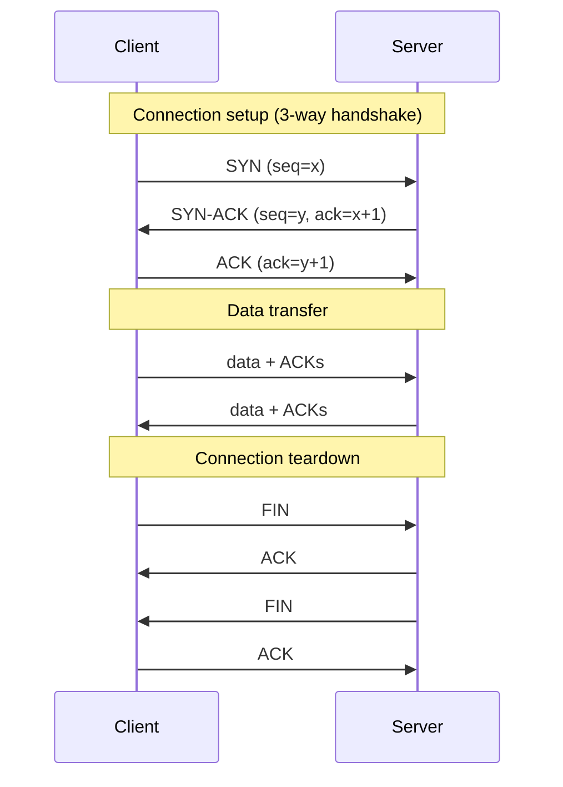

[Networking](./)

<!-- Custom styles are now loaded via main.scss -->

The internet layer gets a packet to the right host; the transport layer decides which application receives it and whether delivery is reliable. This page goes deep on TCP congestion control — the mechanism that keeps the internet from collapsing — then weighs TCP against UDP, and finishes with the application protocols you use every day: HTTP, DNS, DHCP, and SSH.

## Deep Dive: How TCP Controls the Internet's Speed

TCP's real genius lies in congestion control. Without it, the internet would collapse under its own traffic. Let's explore how TCP automatically adjusts sending rates to match network capacity.

### The Congestion Control Challenge

Imagine driving on a highway without speed limits or traffic reports. How fast should you go? Too slow wastes time; too fast causes accidents. TCP faces this same dilemma billions of times per second.

The Python classes below are *illustrative* — simplified models meant to make the algorithms' logic concrete, not production stacks.

#### TCP Reno: The Classic Algorithm
```python
class TCPReno:
    """TCP Reno congestion control algorithm"""
    
    def __init__(self, mss=1460):
        self.mss = mss  # Maximum Segment Size
        self.cwnd = 1 * mss  # Congestion window
        self.ssthresh = 64 * 1024  # Slow start threshold
        self.state = 'slow_start'
        self.dup_ack_count = 0
        self.rtt_samples = []
        self.srtt = None  # Smoothed RTT
        self.rttvar = None  # RTT variance
        self.rto = 1.0  # Retransmission timeout
        
    def on_ack(self, ack_num, is_duplicate=False):
        """Handle ACK reception"""
        if is_duplicate:
            self.dup_ack_count += 1
            
            if self.dup_ack_count == 3:
                # Fast retransmit/recovery
                self.ssthresh = max(self.cwnd // 2, 2 * self.mss)
                self.cwnd = self.ssthresh + 3 * self.mss
                self.state = 'fast_recovery'
                return 'fast_retransmit'
                
            elif self.state == 'fast_recovery':
                # Inflate window
                self.cwnd += self.mss
                
        else:
            self.dup_ack_count = 0
            
            if self.state == 'slow_start':
                # Exponential increase
                self.cwnd += self.mss
                
                if self.cwnd >= self.ssthresh:
                    self.state = 'congestion_avoidance'
                    
            elif self.state == 'congestion_avoidance':
                # Additive increase
                self.cwnd += (self.mss * self.mss) / self.cwnd
                
            elif self.state == 'fast_recovery':
                # Exit fast recovery
                self.cwnd = self.ssthresh
                self.state = 'congestion_avoidance'
                
        return None
    
    def on_timeout(self):
        """Handle retransmission timeout"""
        self.ssthresh = max(self.cwnd // 2, 2 * self.mss)
        self.cwnd = 1 * self.mss
        self.state = 'slow_start'
        self.dup_ack_count = 0
        
        # Back off RTO
        self.rto = min(self.rto * 2, 60)
        
    def update_rtt(self, measured_rtt):
        """Update RTT estimates (RFC 6298)"""
        alpha = 0.125
        beta = 0.25
        K = 4
        
        if self.srtt is None:
            # First measurement
            self.srtt = measured_rtt
            self.rttvar = measured_rtt / 2
        else:
            # Update estimates
            self.rttvar = (1 - beta) * self.rttvar + beta * abs(self.srtt - measured_rtt)
            self.srtt = (1 - alpha) * self.srtt + alpha * measured_rtt
            
        # Calculate RTO
        self.rto = self.srtt + K * self.rttvar
        self.rto = max(self.rto, 1.0)  # Minimum 1 second
```

#### TCP BBR: Google's Game-Changer

Traditional algorithms like Reno react to packet loss, but what if we could measure the actual capacity? BBR (Bottleneck Bandwidth and RTT) does exactly that, leading to faster downloads and smoother video streaming.

```python
class TCPBBR:
    """BBR measures the network's actual capacity instead of guessing.
    
    Key insight: The optimal sending rate equals the bottleneck bandwidth,
    and the optimal amount of data in flight equals bandwidth × RTT.
    """
    
    def __init__(self):
        self.mode = 'startup'
        self.pacing_rate = 0
        self.cwnd = 0
        self.min_rtt = float('inf')
        self.min_rtt_stamp = 0
        self.btl_bw = 0  # Bottleneck bandwidth
        self.rtprop = 0  # Min RTT
        self.bandwidth_samples = []
        
    def update_model(self, delivered, interval, rtt):
        """Update bandwidth and RTT model"""
        # Update bandwidth estimate
        if interval > 0:
            bandwidth = delivered / interval
            self.bandwidth_samples.append(bandwidth)
            
            # Use windowed max filter
            if len(self.bandwidth_samples) > 10:
                self.bandwidth_samples.pop(0)
                
            self.btl_bw = max(self.bandwidth_samples)
            
        # Update RTT estimate
        self.rtprop = min(self.rtprop, rtt) if self.rtprop > 0 else rtt
        
    def calculate_pacing_rate(self):
        """Calculate pacing rate based on model"""
        if self.mode == 'startup':
            # High gain to quickly discover bandwidth
            pacing_gain = 2.89  # 2/ln(2)
        elif self.mode == 'drain':
            # Drain queue built during startup
            pacing_gain = 0.35  # 1/2.89
        elif self.mode == 'probe_bw':
            # Cycle through different gains
            gains = [1.25, 0.75, 1, 1, 1, 1, 1, 1]
            pacing_gain = gains[self.cycle_index % len(gains)]
        else:  # probe_rtt
            pacing_gain = 1
            
        self.pacing_rate = pacing_gain * self.btl_bw
        
    def update_cwnd(self):
        """Update congestion window"""
        if self.mode == 'probe_rtt':
            # Minimal cwnd to measure RTT
            self.cwnd = 4 * self.mss
        else:
            # BDP + headroom for probing
            bdp = self.btl_bw * self.rtprop
            self.cwnd = max(bdp * self.cwnd_gain, 4 * self.mss)
```

> Congestion control exists because performance is fundamentally a queueing problem — see [Performance, QoS & Security](performance-and-security.html) for the queueing models underneath.

## Choosing the Right Transport: TCP vs UDP

One of the most important decisions in network programming is choosing between TCP and UDP. It's not about which is "better"—each serves different needs.

### TCP: The Reliable Workhorse
**Think of TCP like certified mail with tracking:**
- Connection-oriented
- Reliable delivery
- Ordered packets
- Flow control
- Congestion control

**Three-way Handshake**: before any data flows, TCP establishes a connection and agrees on initial sequence numbers. Tearing it down takes a separate four-way exchange (each side closes its half independently):



The handshake costs one full round trip before any payload moves — which is why connection reuse (HTTP keep-alive) and 0-RTT protocols like QUIC matter so much for latency.

**Use Cases**:
- Web browsing (HTTP)
- Email (SMTP)
- File transfer (FTP)
- SSH

### UDP: The Speed Demon
**Think of UDP like shouting across a room:**
- No guarantee anyone heard you
- No confirmation of receipt
- But it's fast and simple

**Perfect for:**
- **Live video/audio**: Losing a frame is better than delay
- **Gaming**: Old position updates become irrelevant
- **DNS**: Queries are tiny and can be retried
- **IoT sensors**: Broadcasting readings to whoever's listening

**The key insight**: Sometimes "good enough" delivery beats perfect delivery, especially when data becomes stale quickly.

### TCP vs UDP at a Glance

| Property | TCP | UDP |
|----------|-----|-----|
| Connection | Connection-oriented (handshake) | Connectionless |
| Delivery | Guaranteed, retransmits lost data | Best-effort, no retransmission |
| Ordering | In-order | No ordering |
| Flow/congestion control | Yes | No |
| Header overhead | 20+ bytes | 8 bytes |
| Latency | Higher (acks, setup) | Lower |
| Typical uses | Web, email, file transfer, SSH | Video/voice, gaming, DNS, IoT |

## Protocols in Action: How the Internet Works

Let's explore the protocols you use every day, understanding not just what they do, but why they work the way they do.

### HTTP/HTTPS: The Web's Foundation
HTTP is how browsers talk to servers. HTTPS adds encryption, protecting your data from eavesdroppers.

**HTTP Methods**:
- GET: Retrieve resource
- POST: Submit data
- PUT: Update resource
- DELETE: Remove resource
- HEAD: Headers only
- OPTIONS: Available methods

**Status Codes**:
- 1xx: Informational
- 2xx: Success (200 OK)
- 3xx: Redirection (301 Moved)
- 4xx: Client error (404 Not Found)
- 5xx: Server error (500 Internal Error)

#### Well-Known Ports

Ports identify which application a transport-layer segment belongs to. The range 0–1023 is reserved for well-known services; knowing the common ones speeds up firewall rules and troubleshooting:

| Port | Protocol | Service |
|------|----------|---------|
| 22  | TCP | SSH |
| 25  | TCP | SMTP (mail relay) |
| 53  | TCP/UDP | DNS |
| 80  | TCP | HTTP |
| 123 | UDP | NTP (time sync) |
| 143 | TCP | IMAP |
| 443 | TCP/UDP | HTTPS (TCP) and HTTP/3 over QUIC (UDP) |
| 3306 | TCP | MySQL |
| 5432 | TCP | PostgreSQL |
| 6379 | TCP | Redis |

### DNS: The Internet's Directory Service

Typing "google.com" is much easier than remembering "142.250.80.46". DNS makes this magic happen, but it's more sophisticated than a simple phone book.

**How DNS queries work:**
1. **Your browser** asks your local DNS resolver
2. **Local resolver** checks its cache
3. If not cached, it asks the **root servers** (knows where .com lives)
4. **TLD servers** know where google.com's servers are
5. **Google's DNS** provides the actual IP address
6. Result is cached at each step for speed

**Common DNS record types:**
- A: IPv4 address
- AAAA: IPv6 address
- CNAME: Canonical name (alias)
- MX: Mail exchange
- TXT: Text information
- NS: Name server
- SOA: Start of authority

**DNS Query Process**:
1. Check local cache
2. Query recursive resolver
3. Query root server
4. Query TLD server
5. Query authoritative server

### DHCP: Automatic Network Configuration

When you connect to Wi-Fi, how does your device get an IP address? DHCP handles this automatically, saving network administrators from manually configuring thousands of devices.

**The DORA Dance:**
1. **Discover**: "Hey, I'm new here! Any DHCP servers around?"
2. **Offer**: "Welcome! You can have 192.168.1.150"
3. **Request**: "Thanks! I'll take that address"
4. **Acknowledge**: "It's yours for the next 24 hours"

**What else DHCP provides:**
- Default gateway (your router's address)
- DNS servers
- Subnet mask
- Lease time (when to renew)

### SSH (Secure Shell)
Encrypted remote access protocol.

**Key-based Authentication**:
```bash
# Generate key pair
ssh-keygen -t rsa -b 4096

# Copy public key to server
ssh-copy-id user@server

# Connect using key
ssh -i ~/.ssh/id_rsa user@server
```

---

## Continue

**Previous:** [Layers & Addressing](fundamentals.html) — the stack the transport layer sits on. &nbsp;**Next:** [Routing & Switching](routing.html) — how packets find a path between networks.

### See Also

- [Layers & Addressing](fundamentals.html) — where the transport layer fits in the OSI/TCP-IP stack.
- [Performance, QoS & Security](performance-and-security.html) — the queueing theory behind congestion control.
- [Cybersecurity](../cybersecurity/) — TLS, certificates, and securing application protocols.
