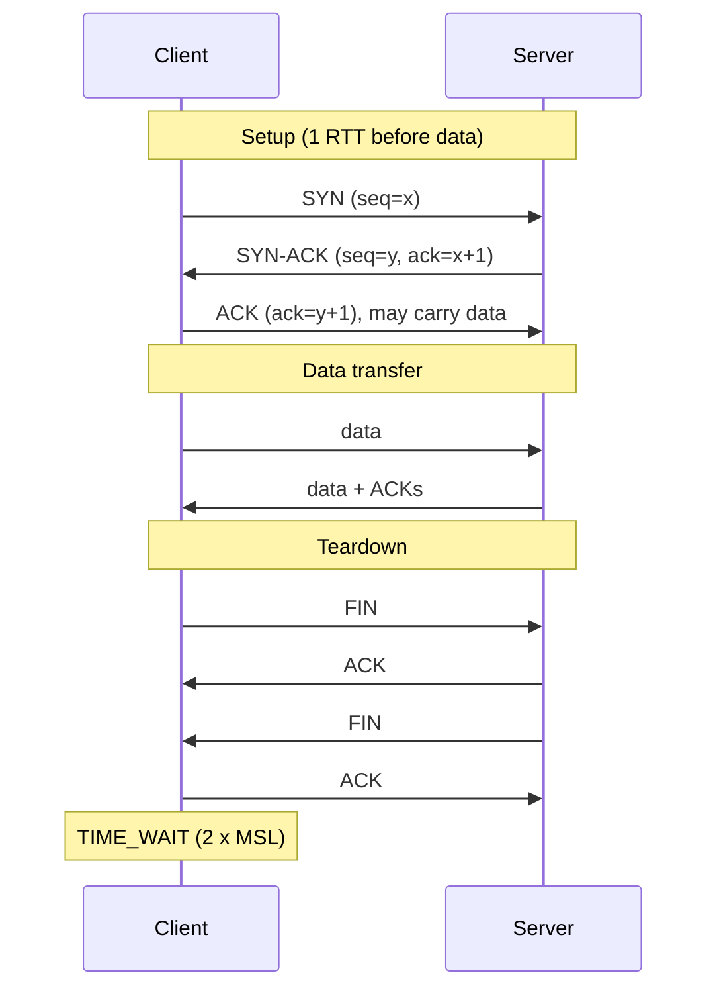
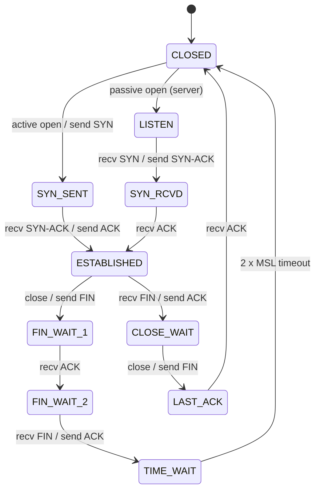
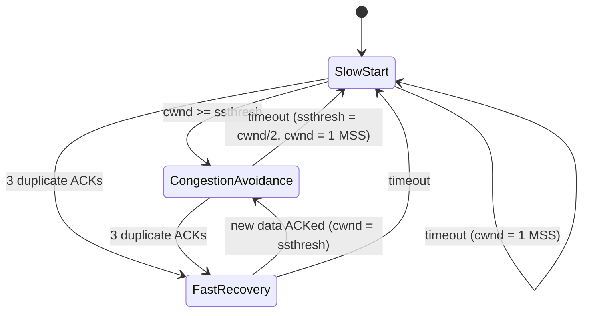
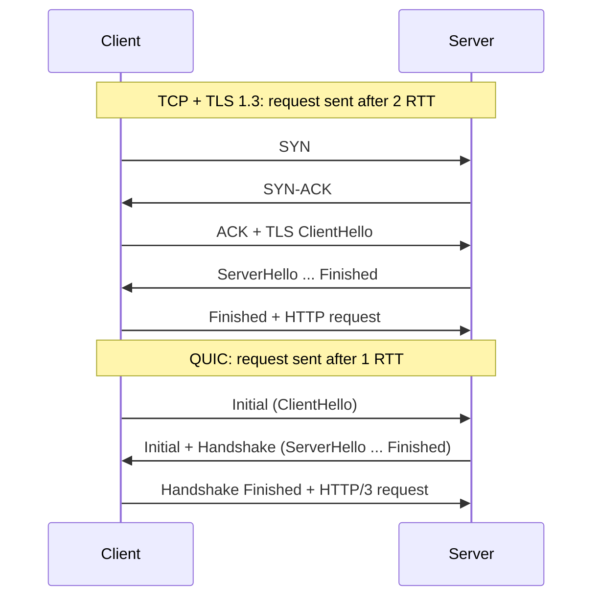
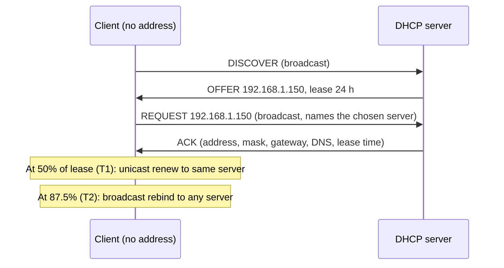

[Networking](./) &raquo; Transport &amp; Application Protocols

The network layer delivers packets to a host; the **transport layer** delivers them to the right application and decides what "delivery" means — reliable and ordered (TCP), best-effort (UDP), or reliable, multiplexed and encrypted over UDP (QUIC). This page covers how TCP achieves reliability, how its congestion control keeps the internet stable, why new protocols are built on UDP, and the application protocols most traffic depends on: HTTP, TLS, DNS, DHCP, and SSH.

## Ports and Multiplexing

A host runs many networked programs at once. The transport layer tells their traffic apart with 16-bit **port numbers**. A connection is identified by its **5-tuple** — protocol, source address, source port, destination address, destination port — so one web server on port 443 can hold millions of simultaneous connections, each from a different client address or port.

| Range | Name | Assigned by |
|-------|------|-------------|
| 0–1023 | Well-known (system) ports | IANA; binding usually needs privileges |
| 1024–49151 | Registered ports | IANA registration |
| 49152–65535 | Dynamic / ephemeral | Chosen by the OS for outgoing connections (Linux defaults to 32768–60999) |

Ports worth knowing:

| Port | Transport | Service |
|------|-----------|---------|
| 22 | TCP | SSH |
| 25 / 587 | TCP | SMTP relay / mail submission |
| 53 | UDP, TCP | DNS |
| 67 / 68 | UDP | DHCP server / client |
| 80 | TCP | HTTP |
| 123 | UDP | NTP |
| 143 / 993 | TCP | IMAP / IMAP over TLS |
| 443 | TCP, UDP | HTTPS (HTTP/1.1, HTTP/2 over TCP; HTTP/3 over QUIC on UDP) |
| 853 | TCP, UDP | DNS over TLS / DNS over QUIC |
| 3306 | TCP | MySQL |
| 5432 | TCP | PostgreSQL |
| 6379 | TCP | Redis |

## TCP: Reliable Byte Streams

TCP (RFC 9293, which in 2022 consolidated the original RFC 793 and decades of updates) gives applications a reliable, ordered, bidirectional **byte stream** over an unreliable packet network. It provides:

- **Reliability** — every byte has a sequence number; the receiver acknowledges what it has received and the sender retransmits what is lost.
- **Ordering** — out-of-order segments are buffered and delivered in sequence.
- **Flow control** — the receiver advertises a window so a fast sender cannot overrun a slow receiver.
- **Congestion control** — the sender limits itself so it does not overrun the *network* (see [below](#congestion-control)).

### Connection Setup and Teardown

Before data flows, the two ends exchange initial sequence numbers in a **three-way handshake**. Closing is a separate exchange in each direction, because each side closes its half of the stream independently:



The handshake costs one round trip before any payload moves, and TLS adds at least one more. This is why connection reuse (HTTP keep-alive, connection pools), TCP Fast Open, and QUIC's combined handshake matter so much for latency.

The side that closes first enters **TIME_WAIT** for twice the maximum segment lifetime (60 seconds on Linux) so that delayed segments from the old connection cannot be mistaken for a new one. Busy clients that open many short connections to one server can exhaust ephemeral ports this way — another reason to reuse connections.

The full connection lifecycle as a state machine (simplified; simultaneous open and close are omitted):



A pile-up of sockets in `CLOSE_WAIT` (visible with `ss -tan state close-wait`) almost always means an application bug: the peer closed, but the local program never called `close()`.

### Acknowledgements and Retransmission

TCP acknowledgements are **cumulative**: `ack=n` means "I have every byte before *n*". The sender detects loss in two ways:

- **Fast retransmit.** If a segment is lost but later ones arrive, the receiver keeps repeating the same ACK. Three **duplicate ACKs** tell the sender to retransmit immediately. The **SACK** option (selective acknowledgement, RFC 2018) lets the receiver list exactly which blocks it holds, so several losses in one window can be repaired in one round trip. Modern stacks also use **RACK-TLP** (RFC 8985), which detects loss by elapsed time rather than by counting duplicates.
- **Retransmission timeout (RTO).** If nothing is acknowledged for too long, the sender assumes loss and retransmits. The timer is derived from measured round-trip times (RFC 6298). For each new RTT sample $R'$:

$$
\begin{aligned}
\mathrm{RTTVAR} &\leftarrow (1-\beta)\,\mathrm{RTTVAR} + \beta\,\lvert \mathrm{SRTT} - R' \rvert \\
\mathrm{SRTT} &\leftarrow (1-\alpha)\,\mathrm{SRTT} + \alpha\, R' \\
\mathrm{RTO} &= \mathrm{SRTT} + \max\left(G,\; 4\,\mathrm{RTTVAR}\right)
\end{aligned}
$$

with $\alpha = 1/8$, $\beta = 1/4$, and $G$ the clock granularity. The first sample initialises $\mathrm{SRTT} = R$ and $\mathrm{RTTVAR} = R/2$. The RFC recommends a minimum RTO of 1 second; Linux uses 200 ms. Each timeout doubles the RTO (exponential backoff).

### Flow Control and the Bandwidth-Delay Product

Each ACK carries the receiver's **window** (`rwnd`): how many more bytes it can buffer. The sender may have at most $\min(\mathrm{rwnd}, \mathrm{cwnd})$ unacknowledged bytes in flight, where `cwnd` is the congestion window.

To keep a path full, the amount in flight must equal the **bandwidth-delay product (BDP)**:

$$
\mathrm{BDP} = \text{bottleneck bandwidth} \times \mathrm{RTT}
$$

A 1 Gbit/s path with a 50 ms RTT needs $10^9 \times 0.05 / 8 = 6.25$ MB in flight. The original 16-bit window field caps out at 65,535 bytes, so the **window scale** option (RFC 7323) multiplies it by up to $2^{14}$. A connection that is slow on a long, fast path is very often limited by a small receive buffer rather than by the network; Linux auto-tunes buffers up to `net.ipv4.tcp_rmem`/`tcp_wmem` maximums.

## Congestion Control

If every sender transmitted as fast as its link allowed, router queues would overflow, packets would be dropped and retransmitted, and useful throughput would collapse — which is what happened to the early internet in 1986. Van Jacobson's fix (1988) was to make each TCP sender infer the network's capacity and back off when it is exceeded. The sender maintains a **congestion window** (`cwnd`) and adjusts it from feedback: ACKs mean "there is room", loss (or delay, or an ECN mark) means "slow down".

Because it treats the network as a queueing system, congestion control is closely tied to the models in [Performance, QoS & Security](performance-and-security.html).

### Reno: Slow Start and AIMD

The classic algorithm (TCP Reno, refined as NewReno) has three phases:



| Phase | Rule | Effect |
|-------|------|--------|
| **Slow start** | cwnd += 1 MSS per ACK | Doubles every RTT: exponential probing from a small initial window (10 MSS on modern stacks, RFC 6928) |
| **Congestion avoidance** | cwnd += MSS²/cwnd per ACK | Grows by about 1 MSS per RTT: **additive increase** |
| **Fast recovery** (3 dup ACKs) | ssthresh = cwnd/2; cwnd = ssthresh | **Multiplicative decrease**, then continue linearly |
| **Timeout** | ssthresh = cwnd/2; cwnd = 1 MSS | Severe congestion: restart slow start |

Additive-increase / multiplicative-decrease (**AIMD**) is what makes TCP stable and fair: competing flows that each grow linearly and halve on loss converge to equal shares of a bottleneck. The resulting window trace is the familiar sawtooth:

<figure style="margin:1.5em 0">
<svg viewBox="0 0 640 270" role="img" aria-labelledby="cwnd-title cwnd-desc" style="width:100%;max-width:640px;height:auto;display:block;margin:auto;background:transparent;color:inherit;font-family:inherit">
  <title id="cwnd-title">TCP Reno congestion window over time</title>
  <desc id="cwnd-desc">The congestion window grows exponentially in slow start, is halved on triple duplicate ACKs and then grows linearly, and collapses to one segment on a timeout before slow-starting again.</desc>
  <g fill="none" stroke="currentColor">
    <line x1="50" y1="220" x2="625" y2="220" stroke-width="1.2"/>
    <line x1="50" y1="220" x2="50" y2="20" stroke-width="1.2"/>
    <polyline stroke-width="2.4" stroke-linejoin="round" points="50,215 70,210 90,200 110,180 130,140 150,60 150,140 270,80 270,150 390,90 390,215 400,210 410,200 420,180 427,155 547,95 547,160 620,123"/>
    <polyline stroke-width="1" stroke-dasharray="4 4" opacity="0.6" points="150,140 270,140"/>
    <polyline stroke-width="1" stroke-dasharray="4 4" opacity="0.6" points="270,150 390,150"/>
    <polyline stroke-width="1" stroke-dasharray="4 4" opacity="0.6" points="390,155 547,155"/>
  </g>
  <g fill="currentColor" font-size="12">
    <text x="12" y="30">cwnd</text>
    <text x="590" y="238">time</text>
    <text x="58" y="100">slow start</text>
    <text x="158" y="54">3 dup ACKs: halve</text>
    <text x="165" y="165">additive increase</text>
    <text x="300" y="72">3 dup ACKs</text>
    <text x="398" y="236">timeout: cwnd = 1</text>
    <text x="440" y="170" opacity="0.8">ssthresh</text>
  </g>
</svg>
<figcaption style="text-align:center;font-size:0.9em">Reno's congestion window: exponential slow start, linear growth, halving on fast retransmit, and collapse on timeout.</figcaption>
</figure>

A useful consequence (the Mathis model) is that a Reno-style flow's throughput is bounded by its RTT and loss rate $p$:

$$
\text{throughput} \approx \frac{\mathrm{MSS}}{\mathrm{RTT}} \cdot \frac{C}{\sqrt{p}}, \qquad C \approx \sqrt{3/2}
$$

so a long-RTT path needs a vanishingly small loss rate to run at high speed. That limitation drove the newer algorithms.

### CUBIC

**CUBIC** (RFC 9438, 2023) is the default in Linux (since 2.6.19), Windows, and Apple platforms. It replaces linear growth with a cubic function of the time $t$ since the last loss:

$$
W(t) = C\,(t - K)^3 + W_{\max}, \qquad K = \sqrt[3]{\frac{W_{\max}(1-\beta)}{C}}
$$

where $W_{\max}$ is the window at the last loss, $\beta = 0.7$ is the decrease factor, and $C = 0.4$. The window climbs quickly back toward $W_{\max}$, plateaus near it (where loss last happened), then probes beyond it. Because growth depends on elapsed time rather than on ACK arrival, CUBIC is far less penalised by long RTTs than Reno.

### BBR

Loss-based algorithms have a structural problem: they only back off once buffers overflow, so on paths with large buffers they keep queues full and inflate latency (**bufferbloat**), while on paths with random non-congestion loss (Wi-Fi, long-haul) they back off needlessly.

**BBR** (Bottleneck Bandwidth and Round-trip propagation time), developed at Google, instead builds an explicit model of the path. It estimates the bottleneck bandwidth (the windowed maximum delivery rate) and the propagation delay (the windowed minimum RTT), then **paces** packets at the estimated bandwidth while capping data in flight near one BDP. It cycles through phases: *Startup* (grow rapidly, gain about $2/\ln 2 \approx 2.89$), *Drain* (empty the queue Startup built), *ProbeBW* (periodically send slightly faster, then slower, to detect added capacity), and *ProbeRTT* (briefly shrink in flight to re-measure minimum RTT).

The first version (2016) was criticised for unfairness to CUBIC flows and for ignoring loss. **BBRv3** reacts to loss and ECN within bounds and is used for Google's and YouTube's traffic; it is specified in the IETF CCWG draft `draft-ietf-ccwg-bbr` (version 06, July 2026, targeting Experimental status). The `tcp_bbr` module in mainline Linux has implemented BBRv1; BBRv3 has been developed in Google's kernel branch.

```bash
# Which algorithm is in use, and which are available?
sysctl net.ipv4.tcp_congestion_control
sysctl net.ipv4.tcp_available_congestion_control

# Switch to BBR (pair it with the fq qdisc for pacing on older kernels)
sudo sysctl -w net.core.default_qdisc=fq
sudo sysctl -w net.ipv4.tcp_congestion_control=bbr

# Per-connection cwnd, RTT, retransmits and delivery rate
ss -tin
```

| Algorithm | Congestion signal | Strengths | Weaknesses |
|-----------|-------------------|-----------|------------|
| Reno / NewReno | Loss | Simple, well understood | Slow on high-BDP paths |
| CUBIC | Loss | Scales to fast long paths; default nearly everywhere | Fills buffers; mistakes random loss for congestion |
| BBR (v1/v3) | Delivery-rate and RTT model | High throughput, low queueing, tolerant of random loss | Fairness with loss-based flows still debated |
| DCTCP / Prague | ECN marks (proportional) | Very low, stable queues | Needs ECN support end to end |

### ECN and L4S

Dropping a packet is a wasteful way to say "slow down". **Explicit Congestion Notification** (ECN, RFC 3168) lets a router mark the IP header instead; the receiver echoes the mark and the sender reacts as if a packet had been lost, with no retransmission needed. **L4S** (Low Latency, Low Loss, Scalable throughput; RFCs 9330–9332, 2023) builds on this: L4S traffic is identified by the ECT(1) codepoint, gets a separate shallow queue that marks early and often, and uses "scalable" congestion controls (such as TCP Prague) that respond to the *fraction* of marked packets rather than halving. The target is consistently sub-millisecond queueing delay; Apple platforms support it, and Comcast began rolling it out across its DOCSIS cable network in 2025.

## UDP: Minimal Datagrams

UDP (RFC 768) adds almost nothing to IP: source and destination ports, a length, and a checksum — an 8-byte header. There is no connection, no acknowledgement, no ordering, and no congestion control. That minimalism is the point:

- **Latency-critical, loss-tolerant data** — voice, video conferencing, games — where a late packet is useless and retransmission would only add delay.
- **Tiny request/response exchanges** — DNS, NTP, DHCP — where a single datagram each way beats a handshake, and the application can simply retry.
- **Multicast and broadcast**, which TCP cannot do.
- **A substrate for new transports.** Middleboxes (firewalls, NATs) block or mangle anything that is not TCP or UDP, and TCP is implemented in OS kernels that change slowly. Building a new protocol on UDP in user space sidesteps both — the path QUIC took.

An application that sends bulk data over UDP is responsible for its own congestion control; otherwise it harms every other flow on the path.

## QUIC

**QUIC** (RFC 9000, 2021) is a general-purpose, encrypted, multiplexed transport running over UDP. Designed at Google and standardised by the IETF, it carries HTTP/3 and increasingly other protocols (DNS over QUIC, SMB over QUIC, MASQUE tunnelling, WebTransport).

What it changes relative to TCP + TLS:

- **Integrated TLS 1.3.** Transport and cryptographic handshakes are combined: a new connection is ready after **1 RTT**, and a resumed connection can send application data in its first flight (**0-RTT**). 0-RTT data can be replayed by an attacker, so it should be used only for idempotent requests.
- **Independent streams.** Many streams share a connection, and loss on one stream does not stall the others. HTTP/2 over TCP suffers **head-of-line blocking**: one lost TCP segment delays every multiplexed request behind it.
- **Connection IDs and migration.** Connections are identified by IDs rather than by the 5-tuple, so a phone moving from Wi-Fi to cellular keeps its connection.
- **Encryption of almost everything**, including most of the transport header and all acknowledgement information, which prevents middleboxes from ossifying the protocol. QUIC version 2 (RFC 9369) exists largely to keep version negotiation exercised.
- **User-space implementation**, allowing congestion control and loss recovery to evolve with application releases.



The costs are real: user-space UDP processing uses more CPU per byte than kernel TCP with hardware offloads (though UDP GSO/GRO narrows the gap), and some enterprise networks block UDP 443, so clients always keep a TCP fallback.

### Transport Comparison

| Property | TCP | UDP | QUIC |
|----------|-----|-----|------|
| Connection setup | 1 RTT (+1 RTT for TLS 1.3) | None | 1 RTT including TLS; 0-RTT on resumption |
| Reliability and ordering | Yes, one ordered stream | No | Yes, per stream |
| Head-of-line blocking across streams | Yes | N/A | No |
| Congestion control | Yes (kernel) | No | Yes (user space, pluggable) |
| Encryption | Optional (TLS on top) | Optional (DTLS) | Mandatory, built in |
| Connection migration | No (5-tuple bound) | N/A | Yes (connection IDs) |
| Header overhead | 20–60 bytes | 8 bytes | ~20+ bytes inside UDP |
| Typical uses | Web (HTTP/1.1, HTTP/2), SSH, databases, email | DNS, VoIP, games, streaming media | HTTP/3, DNS over QUIC, WebTransport |

Other transports exist for specific niches: **SCTP** (message-oriented, multi-streaming, multi-homing; used in telecom signalling and, over DTLS, for WebRTC data channels) and **Multipath TCP** (RFC 8684; one TCP connection spread across several paths, in mainline Linux since 5.6).

## HTTP

HTTP is a stateless request/response protocol between a client and a server. Its **semantics** — methods, status codes, headers — are defined once in RFC 9110 and shared by every version; the versions differ only in how messages are put on the wire.

| Version | Standard | Wire format | Transport | Key change |
|---------|----------|-------------|-----------|------------|
| HTTP/1.1 | RFC 9112 (originally 1997) | Text | TCP | Persistent connections; one outstanding request per connection in practice |
| HTTP/2 | RFC 9113 (originally 2015) | Binary frames, HPACK header compression | TCP | Many concurrent streams on one connection |
| HTTP/3 | RFC 9114 (2022) | Binary frames, QPACK header compression | QUIC | No transport head-of-line blocking; faster setup; migration |

Browsers discover HTTP/3 support through an `Alt-Svc` response header or an HTTPS DNS record, and fall back to HTTP/2 if UDP is blocked.

### Methods

| Method | Purpose | Safe | Idempotent |
|--------|---------|------|------------|
| GET | Retrieve a representation | Yes | Yes |
| HEAD | GET without the body | Yes | Yes |
| OPTIONS | Describe communication options (used by CORS preflight) | Yes | Yes |
| POST | Process the enclosed data (create, submit, trigger) | No | No |
| PUT | Create or replace the target resource | No | Yes |
| PATCH | Partially modify a resource | No | No (unless designed to be) |
| DELETE | Remove the resource | No | Yes |

*Safe* means the request does not change server state; *idempotent* means repeating it has the same effect as sending it once, which is what makes automatic retries safe. How to apply these to API design is covered in [REST](../../api-design/rest.html).

### Status Codes

| Class | Meaning | Common codes |
|-------|---------|--------------|
| 1xx | Informational | 101 Switching Protocols, 103 Early Hints |
| 2xx | Success | 200 OK, 201 Created, 204 No Content, 206 Partial Content |
| 3xx | Redirection | 301 Moved Permanently, 302 Found, 304 Not Modified, 307/308 Temporary/Permanent Redirect (method preserved) |
| 4xx | Client error | 400 Bad Request, 401 Unauthorized (not authenticated), 403 Forbidden (not permitted), 404 Not Found, 409 Conflict, 429 Too Many Requests |
| 5xx | Server error | 500 Internal Server Error, 502 Bad Gateway, 503 Service Unavailable, 504 Gateway Timeout |

### HTTPS and TLS

HTTPS is HTTP carried over **TLS**, which authenticates the server with a certificate and encrypts and integrity-protects the traffic. TLS 1.3 (RFC 8446) is the current version: its handshake takes one round trip, it removes legacy algorithms, and every key exchange provides forward secrecy. Major browsers and CDNs now negotiate the hybrid post-quantum key exchange **X25519MLKEM768** by default, protecting recorded traffic against future quantum decryption. The handshake, certificates, and the Web PKI are covered in [Cryptography: TLS in Practice](../cybersecurity/cryptography.html#tls-in-practice).

## DNS

The Domain Name System maps names to records — most commonly to IP addresses — through a distributed, hierarchical, heavily cached database. The namespace is a tree: the root, top-level domains (`.com`, `.org`, `.uk`), and zones delegated beneath them, each served by **authoritative** name servers.

### Resolution

Applications call a local **stub resolver**, which asks a **recursive resolver** (run by the ISP, the enterprise, or a public service). The recursive resolver walks the tree from the root, following referrals, and caches every answer for its **TTL**:

```mermaid
sequenceDiagram
    participant App as Stub resolver
    participant R as Recursive resolver
    participant Root as Root server
    participant TLD as .com TLD server
    participant Auth as example.com authoritative
    App->>R: A? www.example.com
    Note over R: Cache miss
    R->>Root: A? www.example.com
    Root-->>R: Referral: .com NS records
    R->>TLD: A? www.example.com
    TLD-->>R: Referral: example.com NS records
    R->>Auth: A? www.example.com
    Auth-->>R: A 192.0.2.10 (TTL 300)
    R-->>App: A 192.0.2.10
    Note over R: Cached for 300 s; later queries skip the walk
```

In practice the root and TLD referrals are almost always cached, so most lookups cost one query to an authoritative server or none at all. DNS uses UDP port 53 for most queries and falls back to TCP when a response is too large; EDNS(0) negotiates larger UDP payloads, with 1,232 bytes the widely adopted safe default to avoid IP fragmentation.

### Record Types

| Type | Contents |
|------|----------|
| A / AAAA | IPv4 / IPv6 address |
| CNAME | Alias to another name (cannot coexist with other records at the same name, so not at a zone apex) |
| MX | Mail servers for the domain, with priority |
| NS | Authoritative name servers for a zone |
| SOA | Zone metadata: primary server, serial number, timers |
| TXT | Free text; used for SPF, DKIM, DMARC, and domain-ownership verification |
| PTR | Reverse lookup: address to name |
| SRV | Host and port for a named service |
| CAA | Which certificate authorities may issue for the domain |
| HTTPS / SVCB | Service parameters: supported ALPN protocols (e.g. `h3`), alternative endpoints, ECH keys (RFC 9460) |

```bash
dig www.example.com A +short          # just the answer
dig @1.1.1.1 example.com AAAA         # ask a specific resolver
dig +trace www.example.com            # walk the delegation from the root yourself
dig cloudflare.com HTTPS              # service-binding record
dig -x 8.8.8.8 +short                 # reverse lookup
```

### Security and Privacy

Classic DNS is unauthenticated and unencrypted. Two independent fixes address different problems:

- **DNSSEC** (RFC 4033–4035) adds signatures so a validating resolver can prove an answer is authentic, defeating cache poisoning. It does not hide queries.
- **Encrypted DNS** hides queries from the network between the stub and the recursive resolver: **DNS over TLS** (DoT, RFC 7858, port 853), **DNS over HTTPS** (DoH, RFC 8484, port 443), and **DNS over QUIC** (DoQ, RFC 9250). It does not authenticate the data itself.

## DHCP

The Dynamic Host Configuration Protocol (RFC 2131) gives a host its IPv4 address, subnet mask, default gateway, DNS servers, and other options when it joins a network. The exchange is known as **DORA**; because the client has no address yet, the first messages are broadcasts from `0.0.0.0` (client port UDP 68, server port 67):



The REQUEST is broadcast so that any other servers that made offers learn they were not chosen. Routers forward DHCP broadcasts to a central server with a **relay agent** (Cisco's `ip helper-address`), which records the originating subnet in the `giaddr` field so the server can pick the right address pool. On switches, **DHCP snooping** blocks rogue servers by allowing OFFERs and ACKs only from trusted ports.

IPv6 hosts usually configure themselves with **SLAAC** (stateless address autoconfiguration, RFC 4862), learning the prefix, gateway, and DNS servers (RFC 8106) from router advertisements. **DHCPv6** (RFC 8415) is used where central address assignment is required and for **prefix delegation** to home routers.

## SSH

The Secure Shell protocol provides an encrypted, authenticated channel for remote login, command execution, file transfer (SFTP, `scp`), and tunnelling. It runs over TCP port 22 and has three layers: a transport layer (key exchange, server authentication, encryption), a user-authentication layer (public key, password, or keyboard-interactive), and a connection layer that multiplexes channels (shells, port forwards) over one session.

OpenSSH, the dominant implementation, has modernised its defaults: since **OpenSSH 10.0** (April 2025) the hybrid post-quantum key exchange **mlkem768x25519-sha256** is used by default, and DSA keys are no longer supported at all. Ed25519 is the recommended key type.

```bash
# Generate an Ed25519 key pair (or ed25519-sk for a FIDO2 hardware key)
ssh-keygen -t ed25519 -C "alice@laptop"

# Install the public key on a server, then log in with it
ssh-copy-id alice@server.example.com
ssh alice@server.example.com

# Local forward: reach the server's private Postgres at localhost:5432
ssh -L 5432:localhost:5432 alice@server.example.com

# Dynamic SOCKS proxy through the server
ssh -D 1080 alice@server.example.com
```

Per-host settings belong in `~/.ssh/config` rather than on the command line. `ProxyJump` connects through a bastion host without copying keys onto it:

```text
Host bastion
    HostName bastion.example.com
    User alice

Host db-*.internal
    User alice
    ProxyJump bastion
    IdentityFile ~/.ssh/id_ed25519
```

On first connection the client records the server's host key in `~/.ssh/known_hosts`; a later mismatch warning means the key changed and should be investigated, not dismissed. At scale, organisations replace per-key trust with **SSH certificates** signed by an internal CA, which expire automatically and avoid distributing `authorized_keys` files.

---

## Continue

**Previous:** [Layers & Addressing](fundamentals.html) — the stack the transport layer sits on. &nbsp;**Next:** [Routing & Switching](routing.html) — how packets find a path between networks.

### See Also

- [Layers & Addressing](fundamentals.html) — where the transport layer fits in the OSI and TCP/IP models.
- [Performance, QoS & Security](performance-and-security.html) — queueing theory behind congestion, and troubleshooting tools.
- [Cryptography](../cybersecurity/cryptography.html) — TLS 1.3, certificates, and post-quantum key exchange.
- [API Design](../../api-design/) — REST, GraphQL, and gRPC built on HTTP.
- [Wireless & Mobile](wireless-and-mobile.html) — the lossy links that challenge loss-based congestion control.
