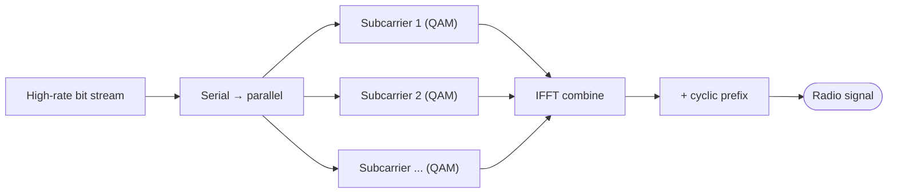
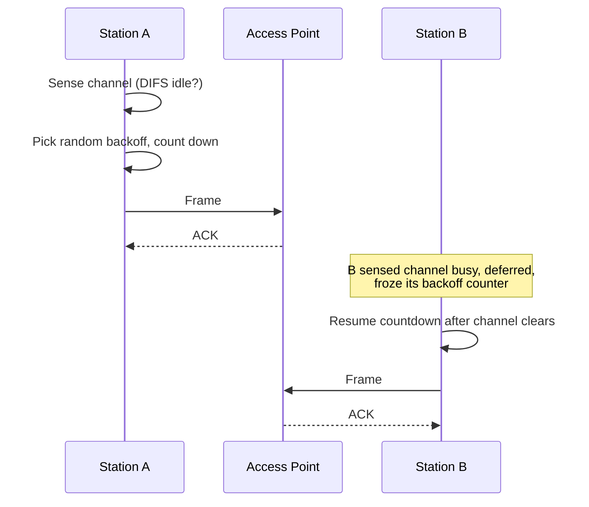
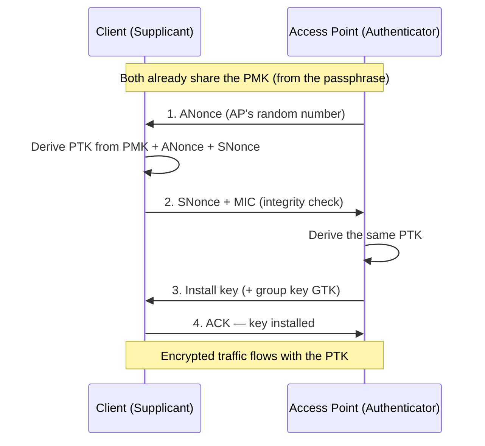
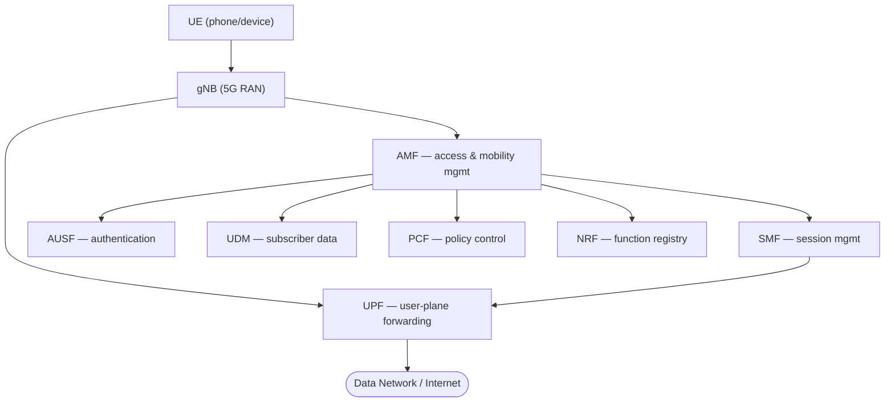
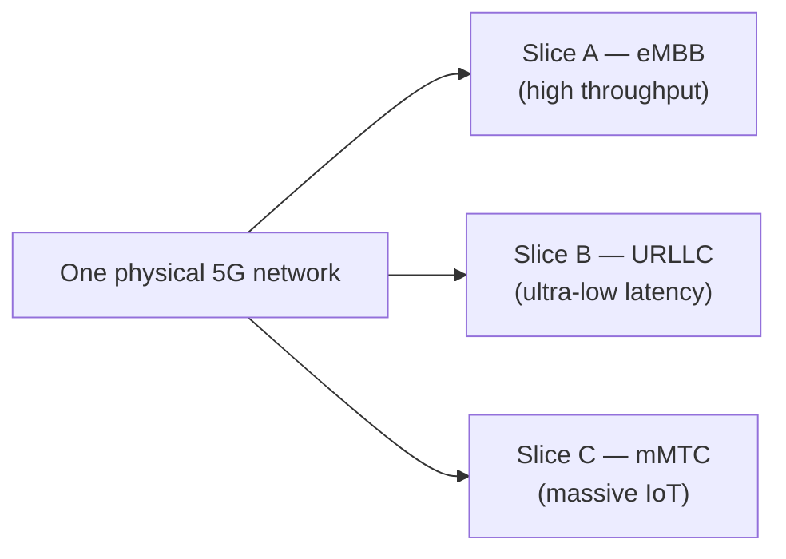
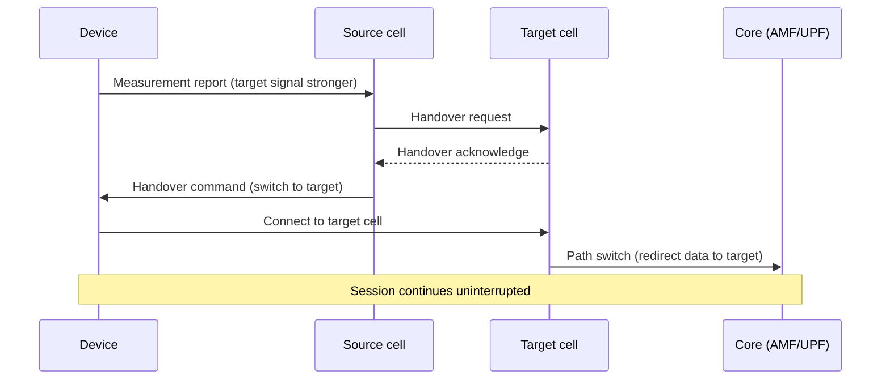

[Networking](./) &raquo; Wireless &amp; Mobile

<!-- Custom styles are now loaded via main.scss -->

Most internet traffic now begins or ends on a wireless link. A radio channel is fundamentally different from a copper or fiber link: it is shared, half-duplex by nature, lossy, and its capacity rises and falls with distance, interference, and the number of devices competing for airtime. This page covers the two dominant wireless access technologies — **Wi-Fi (IEEE 802.11)** for local-area access and **cellular (4G LTE and 5G)** for wide-area mobility — plus the physics of spectrum and modulation they share, the security that protects them, and the mobility management that lets a connection survive as you walk, drive, or roam between networks.

> Where this fits in the stack: wireless technologies live at the **physical** and **data-link** layers ([Layers & Addressing](fundamentals.html)). They replace the bottom of the stack while TCP/IP, routing, and applications above them ([Transport & Application Protocols](transport-and-protocols.html)) stay unchanged — which is exactly why the same browser works over Wi-Fi, fiber, or 5G.

## The Shared-Medium Problem

A cable gives each link its own private wire. Radio gives every nearby device the *same* slice of spectrum, so the central engineering problem of all wireless is **multiple access**: how do many transmitters share one medium without turning it into noise?

Three families of answers recur throughout this page:

| Technique | Idea | Used by |
|-----------|------|---------|
| **Contention (CSMA/CA)** | Listen first; back off randomly if busy | Wi-Fi |
| **Scheduling (TDMA/OFDMA)** | A controller assigns time/frequency slots | LTE, 5G, Wi-Fi 6 |
| **Code/space division (CDMA, MIMO)** | Separate users by code or spatial beam | 3G (CDMA), 4G/5G (MIMO) |

Wi-Fi historically chose *contention* (cheap, decentralized, no licensed spectrum needed); cellular chose *scheduling* (a base station with exclusive licensed spectrum can centrally allocate resources for guaranteed quality). Modern standards blur the line — Wi-Fi 6 adds OFDMA scheduling, and 5G adds unlicensed operation.

## Spectrum & Modulation Basics

Everything wireless rests on turning bits into radio waves and back. Three quantities dominate: **bandwidth** (how much spectrum), **modulation** (how many bits per symbol), and **signal-to-noise ratio** (how reliably symbols are recovered).

### The Shannon Limit

The theoretical ceiling on a channel's capacity is the Shannon–Hartley theorem, which is the single most important equation in wireless engineering:

$$
C = B \log_2\!\left(1 + \frac{S}{N}\right)
$$

where $C$ is capacity in bits per second, $B$ is bandwidth in hertz, and $S/N$ is the linear signal-to-noise ratio. Two levers raise throughput: **more bandwidth** $B$ (why 5G chases wide millimeter-wave channels) and **higher SNR** (why you get faster rates standing next to the access point). Because capacity grows only logarithmically with SNR but linearly with bandwidth, bandwidth is the more powerful lever — doubling spectrum doubles capacity, while doubling SNR adds barely one bit per symbol.

SNR is usually quoted in decibels; converting to the linear ratio Shannon needs:

$$
\frac{S}{N} = 10^{\left(\text{SNR}_{\text{dB}}\,/\,10\right)}
$$

So a 30 dB link has a linear SNR of 1000, giving roughly $\log_2(1001) \approx 10$ bits/s per hertz of bandwidth — close to the densest practical modulations.

### Modulation: Bits per Symbol

Modulation encodes bits onto a carrier wave by varying its amplitude and phase. **Quadrature Amplitude Modulation (QAM)** places symbols on a 2D constellation of amplitude × phase; an $M$-point constellation carries $\log_2 M$ bits per symbol.

| Scheme | Constellation points | Bits/symbol | Needs |
|--------|----------------------|-------------|-------|
| BPSK | 2 | 1 | Very low SNR (long range) |
| QPSK | 4 | 2 | Low SNR |
| 16-QAM | 16 | 4 | Moderate SNR |
| 64-QAM | 64 | 6 | Good SNR |
| 256-QAM (Wi-Fi 5) | 256 | 8 | High SNR |
| 1024-QAM (Wi-Fi 6) | 1024 | 10 | Excellent SNR (close range) |

Denser constellations pack more bits per symbol but place points closer together, so a small amount of noise flips a symbol to its neighbor. This is why your phone *adapts*: near the access point it uses 1024-QAM, and as you walk away and SNR drops it falls back to 64-QAM, then QPSK — trading rate for robustness. This continuous trade-off is **adaptive modulation and coding (AMC)**.

### OFDM: The Workhorse Waveform

A single wideband carrier suffers from **multipath**: reflections off walls and buildings arrive at slightly different times, smearing symbols together (inter-symbol interference). **Orthogonal Frequency-Division Multiplexing (OFDM)** sidesteps this by splitting the wide channel into many narrow, orthogonal **subcarriers**, each carrying a slow, robust stream:

Each subcarrier is narrow enough that multipath delay is small relative to the symbol time, and a **cyclic prefix** (a short copy of the symbol's tail prepended to its front) absorbs the residual echo. OFDM is the physical-layer foundation of Wi-Fi (since 802.11a/g), LTE, and 5G NR.

**OFDMA** extends OFDM into a multiple-access scheme: instead of giving the whole set of subcarriers to one user per symbol, the scheduler hands different groups of subcarriers (called **resource blocks** in cellular, **resource units** in Wi-Fi 6) to different users *simultaneously*. This is the key efficiency gain in both 5G and Wi-Fi 6 — many small clients (IoT sensors, phones) can be served in one transmission instead of each waiting its turn.

### Frequency Bands and the Range/Capacity Trade-off

A fundamental physics trade-off governs band choice: lower frequencies travel farther and penetrate walls but carry less bandwidth; higher frequencies offer huge bandwidth but are blocked by almost anything.

| Band | Frequency | Character | Used by |
|------|-----------|-----------|---------|
| Sub-1 GHz | 600–900 MHz | Long range, deep penetration, low capacity | LTE coverage, 5G low-band, Wi-Fi HaLow, IoT |
| 2.4 GHz | ~2.4 GHz | Good range, crowded (microwaves, Bluetooth) | Wi-Fi, Bluetooth |
| 5 GHz | 5.1–5.9 GHz | More channels, shorter range | Wi-Fi 5/6 |
| 6 GHz | 5.9–7.1 GHz | Clean spectrum, short range | Wi-Fi 6E/7 |
| Mid-band | 2.5–4.0 GHz | Balance of coverage and capacity | 5G "C-band" |
| mmWave | 24–47 GHz | Multi-gigabit, line-of-sight only | 5G mmWave |

This is why a single tower or AP cannot do everything: carriers layer **low-band for coverage**, **mid-band for the capacity/coverage sweet spot**, and **mmWave for dense hotspots** (stadiums, downtowns).

## Wi-Fi: IEEE 802.11

Wi-Fi is the brand name for the IEEE 802.11 family of wireless-LAN standards. It connects devices to a local network over short range, typically through an **access point (AP)** that bridges the radio link to wired Ethernet.

### The 802.11 Standard Generations

The Wi-Fi Alliance rebranded the cryptic IEEE names (802.11ax) as friendly generation numbers (Wi-Fi 6) starting in 2018:

| IEEE name | Wi-Fi gen | Year | Bands | Max PHY rate | Key advance |
|-----------|-----------|------|-------|--------------|-------------|
| 802.11b | — | 1999 | 2.4 GHz | 11 Mbps | First mass-market Wi-Fi |
| 802.11a/g | — | 1999/2003 | 5 / 2.4 GHz | 54 Mbps | OFDM |
| 802.11n | Wi-Fi 4 | 2009 | 2.4 / 5 GHz | 600 Mbps | MIMO, channel bonding |
| 802.11ac | Wi-Fi 5 | 2013 | 5 GHz | ~3.5 Gbps | 256-QAM, MU-MIMO (down) |
| 802.11ax | Wi-Fi 6/6E | 2019/2020 | 2.4/5/6 GHz | ~9.6 Gbps | OFDMA, 1024-QAM, uplink MU-MIMO |
| 802.11be | Wi-Fi 7 | 2024 | 2.4/5/6 GHz | ~46 Gbps | 320 MHz channels, 4096-QAM, MLO |

Note that the headline "max PHY rate" is an aggregate across all spatial streams and the widest channel — a real single client sees a fraction of it. The practical advances that users actually feel are **MIMO** (multiple antennas), **OFDMA** (serving many clients at once), and in Wi-Fi 7 **Multi-Link Operation (MLO)** (one connection using 5 GHz and 6 GHz simultaneously for lower latency).

### How Wi-Fi Shares the Air: CSMA/CA

Wi-Fi has no central scheduler in its classic mode, so devices coordinate themselves with **Carrier Sense Multiple Access with Collision Avoidance (CSMA/CA)**. Unlike wired Ethernet, a radio cannot reliably detect a collision while transmitting (its own signal drowns out everyone else), so Wi-Fi *avoids* collisions rather than detecting them:

1. **Carrier sense:** a station listens; if the channel is idle for a fixed interval (DIFS), it may proceed.
2. **Random backoff:** it picks a random number of slots from a *contention window* and counts down only while the channel stays idle, freezing the counter when someone else transmits. This randomization makes simultaneous starts unlikely.
3. **Transmit and acknowledge:** because the sender cannot hear collisions, every successful unicast frame is confirmed by an explicit **ACK**. No ACK means assume a collision and retry with a *doubled* contention window (binary exponential backoff).

An optional **RTS/CTS** handshake (Request To Send / Clear To Send) addresses the **hidden-node problem**: two stations that can both hear the AP but not each other. The AP's CTS, heard by both, reserves the medium and silences the hidden node.

The cost of contention is **airtime overhead** — backoff, inter-frame spaces, and ACKs mean Wi-Fi's real-world throughput is often 50–60% of the nominal PHY rate, and it degrades sharply as more devices contend. This overhead is precisely what OFDMA in Wi-Fi 6 attacks by serving many clients in a single scheduled transmission.

### MIMO and Spatial Streams

**Multiple-Input Multiple-Output (MIMO)** uses several antennas at each end to send independent data streams over the *same* frequency at the *same* time, exploiting the fact that multipath reflections give each stream a distinguishable spatial signature. An $N \times N$ MIMO system can, in ideal conditions, multiply capacity by $N$ without using more spectrum. A Wi-Fi configuration written as "4×4:4" means 4 transmit antennas, 4 receive antennas, and 4 spatial streams.

**MU-MIMO (Multi-User MIMO)** goes further: using **beamforming**, the AP shapes separate spatial beams toward several clients at once, transmitting distinct data to each simultaneously. Beamforming works by adjusting the phase of the signal at each antenna so the waves add constructively at the target client and cancel elsewhere.

## Wi-Fi Security: WPA2 and WPA3

An open radio link is trivially eavesdropped, so Wi-Fi encryption is mandatory in practice. The standards have a long and instructive history of broken predecessors.

| Standard | Year | Encryption | Status |
|----------|------|------------|--------|
| WEP | 1997 | RC4, 40/104-bit | Catastrophically broken — crackable in minutes |
| WPA | 2003 | RC4 + TKIP | Interim fix, now deprecated |
| WPA2 | 2004 | AES-CCMP | Long the standard; KRACK weakness in 4-way handshake |
| WPA3 | 2018 | AES + SAE | Current best practice |

### WPA2 and the 4-Way Handshake

WPA2 uses **AES-CCMP** for strong, fast encryption — that part remains sound. Its job is to derive a fresh per-session encryption key without sending it over the air. In **WPA2-Personal (PSK)**, every device shares one passphrase from which a **Pairwise Master Key (PMK)** is derived; the **4-way handshake** then mixes the PMK with two random nonces (one from the client, one from the AP) to produce a unique **Pairwise Transient Key (PTK)** per session:

Two weaknesses motivated WPA3. First, **WPA2-Personal is offline-crackable**: an attacker who captures the handshake can brute-force a weak passphrase against the captured nonces without ever touching the network. Second, the **KRACK attack (2017)** showed that forcing reinstallation of an already-used key (by replaying handshake message 3) could reset nonces and expose traffic — a flaw in the handshake's state machine, since patched but architecturally fragile.

**WPA2-Enterprise** replaces the shared passphrase with **802.1X / EAP** authentication against a **RADIUS** server, so every user has individual credentials and a unique PMK — no shared secret to crack, and revocable per user. This is the standard for corporate and campus networks.

### WPA3 and SAE

WPA3-Personal replaces the PSK handshake with **Simultaneous Authentication of Equals (SAE)**, a password-authenticated key exchange based on the Dragonfly protocol. SAE provides two properties WPA2 lacks:

- **Resistance to offline dictionary attacks.** SAE is a zero-knowledge exchange: a captured handshake reveals nothing useful for brute-forcing. Each password guess requires a fresh, live interaction with the network, so attackers cannot grind millions of guesses offline.
- **Forward secrecy.** Each session derives an ephemeral key, so compromising the password later does not decrypt previously recorded sessions.

WPA3 also adds **Protected Management Frames (PMF)**, mandatory in WPA3, which authenticate deauthentication/disassociation frames and so block the trivial "deauth" denial-of-service that plagued WPA2. **WPA3-Enterprise** offers an optional 192-bit suite for high-security environments, and **OWE (Opportunistic Wireless Encryption)** brings encryption even to "open" passwordless networks (cafés, airports) so nearby devices cannot passively sniff each other.

> For the broader security context — threat models, VPNs, and zero-trust — see [Cybersecurity](../cybersecurity/) and the security section of [Performance, QoS & Security](performance-and-security.html).

## Cellular Evolution: From 1G to 5G

Cellular networks divide a coverage area into **cells**, each served by a base station, and reuse frequencies across non-adjacent cells to serve a whole country with limited spectrum. Each generation roughly defined a decade and a new capability:

| Gen | Era | Defining capability | Key technology |
|-----|-----|---------------------|----------------|
| 1G | 1980s | Analog voice | FDMA |
| 2G (GSM) | 1990s | Digital voice + SMS | TDMA |
| 3G (UMTS) | 2000s | Mobile data, video calls | CDMA |
| 4G (LTE) | 2010s | All-IP broadband, apps | OFDMA, MIMO |
| 5G (NR) | 2020s | Massive capacity, low latency, IoT | mmWave, massive MIMO, network slicing |

The decisive break came at **4G LTE**, which made the network **all-IP**: even voice became packets (VoLTE — Voice over LTE), eliminating the separate circuit-switched voice network that defined every prior generation. 5G builds on that all-IP foundation rather than replacing it.

### The Three 5G Use-Case Pillars

5G is defined less by a single speed number and more by three deliberately different service profiles, standardized by the ITU as IMT-2020:

- **eMBB (enhanced Mobile Broadband):** the obvious one — multi-gigabit peak rates for video, AR/VR, and fixed wireless access.
- **URLLC (Ultra-Reliable Low-Latency Communication):** sub-millisecond air-interface latency at 99.999% reliability for factory automation, remote surgery, and autonomous vehicles.
- **mMTC (massive Machine-Type Communication):** up to a million low-power devices per square kilometer for IoT sensors.

No single configuration optimizes all three at once — eMBB wants huge throughput, URLLC wants minimal latency and jitter, mMTC wants density and battery life. **Network slicing** (below) is how one physical 5G network serves all three simultaneously.

### How 5G Achieves Its Gains

- **Wider spectrum, including mmWave.** Channels up to 400 MHz wide (versus 20 MHz in LTE) directly multiply Shannon capacity. mmWave's short range is mitigated by dense small cells.
- **Massive MIMO.** Base stations with 64–256 antenna elements form many narrow beams, spatially multiplexing dozens of users on the same frequency (**beamforming** + **MU-MIMO** at scale).
- **Flexible numerology.** Unlike LTE's fixed subcarrier spacing, 5G NR supports multiple subcarrier spacings; wider spacing shortens the symbol time, cutting latency for URLLC.
- **Cloud-native, disaggregated core.** The 5G core is a set of software functions (below), enabling slicing and edge deployment.

## The 5G Core (5GC) and Service-Based Architecture

The 5G core is a clean break from LTE's monolithic Evolved Packet Core. It is **cloud-native** and built on a **Service-Based Architecture (SBA)**: network functions are independent software services that expose RESTful APIs and discover one another through a registry, exactly like microservices in a modern application.

The architecture's defining trait is **control-plane / user-plane separation (CUPS)**. The user plane (the **UPF**, which actually forwards packets) is decoupled from the control plane (everything else, which manages sessions and policy). This lets operators push UPFs out to the network edge — close to users for low latency — while keeping control functions centralized.

| Function | Role |
|----------|------|
| **AMF** (Access & Mobility Mgmt) | Registration, connection, and mobility/handover signaling |
| **SMF** (Session Mgmt) | Establishes and manages PDU sessions, allocates IP addresses, controls the UPF |
| **UPF** (User Plane) | The data-forwarding workhorse — routes packets to the data network; deployable at the edge |
| **AUSF** (Authentication Server) | Authenticates the device |
| **UDM** (Unified Data Mgmt) | Stores subscriber profiles and credentials |
| **PCF** (Policy Control) | Enforces QoS and charging policy |
| **NRF** (NF Repository) | Service discovery — functions register and find each other here |
| **NSSF** (Slice Selection) | Selects the right network slice for a session |

### Network Slicing

Because the core is software-defined, an operator can carve one physical network into multiple isolated **virtual networks (slices)**, each tuned to a different SLA:

A factory's robots get a URLLC slice with guaranteed latency, the public gets an eMBB broadband slice, and a fleet of sensors gets an mMTC slice — all sharing the same towers and core hardware but logically isolated with independent policy and resources. Slicing leans directly on the **SDN/NFV** concepts covered in [Modern & Future Networking](modern-architecture.html).

## Mobility Management

The defining feature of mobile networks is that a device keeps its connection alive while moving. This requires two distinct mechanisms — one for *finding* a moving device, one for *handing it off* between cells without dropping the session.

### Handover

As a device moves out of one cell's coverage and into another's, the network must transfer the active session to the new base station — a **handover** (or **handoff**) — fast enough that the user never notices.

5G primarily uses **hard handover** ("break-before-make": disconnect from source, then connect to target) but minimizes the gap to a few milliseconds. The device continuously measures neighboring cells' signal strength and reports back; the network decides when to trigger the switch, balancing signal quality against the cost of switching too often ("ping-ponging" between two cells of similar strength).

### Locating an Idle Device: Tracking Areas and Paging

A device that is connected but idle (to save battery) does not report its exact cell. The network groups cells into **tracking areas** and only needs to know which *area* an idle device is in. When traffic arrives for it, the network **pages** every cell in that area to wake the device, which then re-establishes a connection. This trades a small wake-up latency for a large saving in signaling and battery — a device updates its location only when it crosses a tracking-area boundary, not on every cell change.

### Roaming

When a subscriber leaves their home operator's coverage (e.g., traveling abroad), **roaming** lets a visited network serve them. The visited network's control functions query the home network's subscriber database (the UDM/HSS) to authenticate the device and retrieve its service profile, then provide service while accounting back to the home operator. Roaming is the cellular analogue of Wi-Fi's enterprise authentication — your identity lives in one place, but you can be served anywhere.

### Wi-Fi Roaming

Wi-Fi has its own (simpler) mobility story for moving between APs on the same network. Standards reduce the re-authentication delay that would otherwise break a voice or video call:

- **802.11r (Fast BSS Transition):** pre-computes keys so re-association with the next AP skips the full handshake (sub-50 ms handoff).
- **802.11k (Neighbor Reports):** the AP tells the client which neighboring APs to consider, so it doesn't waste time scanning all channels.
- **802.11v (BSS Transition Management):** lets the network gently steer a client toward a better AP.

Together these enable seamless "mesh" and enterprise Wi-Fi where you walk across a building on a continuous call.

## Edge & IoT Considerations

Wireless access is the natural front door for two adjacent trends — edge computing and the Internet of Things — and both reshape how the network is designed.

### Edge Computing

Pushing computation close to the radio (Multi-access Edge Computing, **MEC**) is what makes 5G's URLLC promise physically achievable: the speed of light alone makes sub-millisecond round trips to a distant cloud impossible, so the application server must sit at the edge. The 5G core's **UPF** is deliberately deployable at the edge precisely to enable this. Typical edge workloads include AR/VR rendering, real-time video analytics, autonomous-vehicle coordination, and industrial control.

> Edge computing and MEC are explored further in [Modern & Future Networking](modern-architecture.html); their cloud-side counterparts (CDNs, regional compute) appear in [AWS](../aws/).

### IoT Connectivity Trade-offs

IoT devices invert the usual priorities: they need *years* of battery life and *long* range, but only trickle amounts of data. This birthed a family of **Low-Power Wide-Area Network (LPWAN)** technologies:

| Technology | Spectrum | Range | Rate | Battery | Use case |
|------------|----------|-------|------|---------|----------|
| Bluetooth LE | Unlicensed 2.4 GHz | ~10 m | ~1 Mbps | Months | Wearables, beacons |
| Zigbee/Thread | Unlicensed 2.4 GHz | ~100 m (mesh) | ~250 kbps | Months–years | Smart home |
| Wi-Fi HaLow (802.11ah) | Sub-1 GHz | ~1 km | Kbps–Mbps | Long | IoT over Wi-Fi |
| LoRaWAN | Unlicensed sub-GHz | 2–15 km | ~0.3–50 kbps | Years | Sensors, asset tracking |
| NB-IoT / LTE-M | Licensed cellular | Km-scale | Kbps–Mbps | Years | Metering, logistics |

The two cellular options matter for 5G's **mMTC** pillar: **NB-IoT** (narrowband, deep-coverage, ultra-low-power for static meters) and **LTE-M** (higher rate, supports mobility and voice for trackers and wearables) reuse licensed spectrum and existing towers, giving carrier-grade reliability and security that unlicensed LPWANs cannot match. Their design philosophy is the opposite of eMBB: minimize power and signaling, accept low rates, and let a device sleep for hours between brief reports.

## Key Takeaways

- **The medium is shared.** All wireless boils down to multiple access — contention (Wi-Fi's CSMA/CA), scheduling (OFDMA), or spatial separation (MIMO/beamforming).
- **Shannon governs everything.** Capacity grows linearly with bandwidth and only logarithmically with SNR — which is why 5G chases wide spectrum and dense cells.
- **WPA3 fixes WPA2's offline cracking.** SAE turns the key exchange into a live, zero-knowledge negotiation with forward secrecy, and PMF blocks deauth attacks.
- **4G went all-IP; 5G went cloud-native.** LTE made voice and data both packets; the 5G core is microservices (SBA) with control/user-plane separation enabling edge UPFs.
- **One network, many slices.** Network slicing serves eMBB, URLLC, and mMTC on the same physical 5G infrastructure with independent, isolated SLAs.
- **Mobility is find plus handover.** Tracking areas and paging locate idle devices cheaply; fast handover transfers active sessions between cells without a drop.

## See Also

- [Networking](./) — overview and navigation hub.
- [Layers & Addressing](fundamentals.html) — the stack that wireless replaces at Layers 1-2.
- [Transport & Application Protocols](transport-and-protocols.html) — what runs unchanged on top of any radio link.
- [Modern & Future Networking](modern-architecture.html) — SDN/NFV behind slicing, edge computing, and 6G/terahertz research.
- [Performance, QoS & Security](performance-and-security.html) — QoS, VPNs, and the security context for WPA.
- [Cybersecurity](../cybersecurity/) — threat models and zero-trust beyond the Wi-Fi handshake.
- [AWS](../aws/) — cloud networking and the data-center side of edge.
