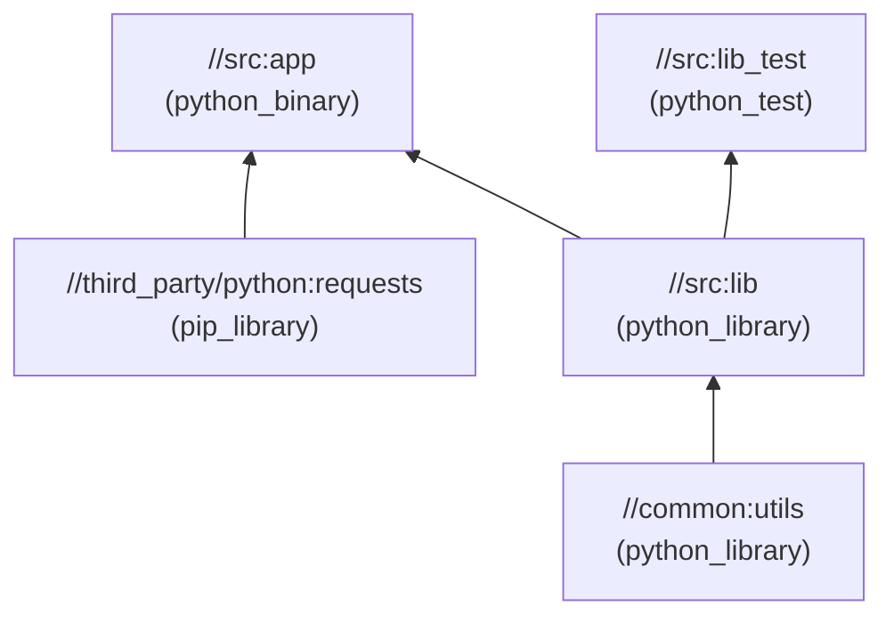
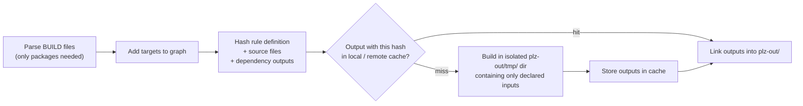
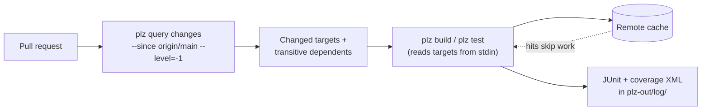

[Technology](./) &raquo; Please Build

**Please** (command `plz`) is an open-source build system from Thought Machine. It follows the model of Google's Blaze/Bazel: every target declares its inputs and dependencies in a `BUILD` file, Please assembles those declarations into a dependency graph, and it rebuilds only the targets whose inputs have changed. Each action runs in its own isolated directory, and outputs are cached by the hash of their inputs. Language support comes from versioned **plugins** (Go, Python, Java, C/C++, protobuf, and more), so one tool builds and tests a polyglot monorepo. Please is written in Go, ships as a single self-updating binary, and runs on Linux and macOS.

This page covers the model, setup, configuration, rules, testing, CI, remote builds, and graph queries. For how Please compares with Nx, Turborepo, Bazel, Buck2, and Pants, see [Monorepo Tooling](../advanced/monorepo-tooling/).

*Versions cited are current as of September 2026 (Please v17.33).*

## When to use it

A graph-based build system pays for itself when several of the following are true:

- The repository mixes languages. Go services, Python tooling, Java libraries, and protobuf definitions all depend on each other.
- Full builds are slow, and developers or CI would benefit from rebuilding and retesting only what a change affects.
- Reproducibility matters. The same commit should produce the same outputs on every laptop and CI runner.
- A team-wide remote cache would save substantial compute.

For a single-language repository, the language's own tool (`go build`, `cargo`, `uv`, Gradle) is simpler and usually good enough. Every build system in this category makes you declare dependencies explicitly, and that is an ongoing cost as well as the source of its correctness.

## Core concepts

### Packages, targets, and labels

Any directory that contains a `BUILD` file (or `BUILD.plz`) is a **package**. Each rule call in that file defines a **target**, and targets are addressed by **build labels**:

| Label form | Meaning |
|------------|---------|
| `//src/server:server` | Target `server` in package `src/server` (absolute from the repo root) |
| `//src/server` | Shorthand for `//src/server:server` |
| `:lib` | Target `lib` in the current package |
| `//src/...` | Every target in `src` and below (a wildcard for commands) |
| `//src:all` | Every target in package `src` only |
| `///go//build_defs:go` | A target inside a **subrepo** (here, the Go plugin) |

**Visibility** decides who may depend on a target. The default is the target's own package. `visibility = ["//services/..."]` opens it to a subtree, and `["PUBLIC"]` opens it to everyone. Keeping visibility narrow is how a large repository enforces its architectural boundaries.

### The build graph



Arrows point from a dependency to the target that uses it. A change to `utils` invalidates `lib`, `app`, and `lib_test`. A change to `lib_test.py` reruns only that test. Targets that don't depend on each other build in parallel.

### How a target is built



Two consequences follow:

- **Undeclared inputs fail loudly.** A command can see only the files listed in `srcs`, `deps`, and `tools`. A build that works with `go build` but fails under Please is almost always reading a file it never declared.
- **Caching is safe.** The cache key covers the rule's command and attributes as well as its inputs, so editing a `BUILD` file invalidates exactly the targets whose definitions changed.

The temporary directory keeps a target from seeing *files* it did not declare. On Linux, Please can also put each build or test action in a **sandbox** that cuts it off from the network, IPC, and the rest of the repository's filesystem. Sandboxing is off by default. Turn it on with `[sandbox]` (see [Configuration](#configuration)), and opt individual targets out with `sandbox = False`. On macOS the temporary directory is the only isolation.

### Output layout

| Path | Contents |
|------|----------|
| `plz-out/gen/` | Generated files and library outputs |
| `plz-out/bin/` | Binaries (`plz-out/bin/src/app.pex`, `plz-out/bin/src/server/server`) |
| `plz-out/tmp/` | Per-target working directories (kept for inspection with `--keep_workdirs`) |
| `plz-out/log/` | `build.log`, `test_results.xml` (JUnit), `coverage.json` and `coverage.xml` |

## Installation

```bash
# Installs the latest release into ~/.please and puts `plz` on your PATH
curl -sSfL https://get.please.build | bash
plz --version
```

In practice, repositories do not depend on a global install. `plz init` writes a `pleasew` wrapper script at the repo root. It downloads and runs the exact version pinned in `.plzconfig`, so contributors and CI need only a shell and `curl`:

```bash
./pleasew build //...      # same result on every machine, whatever is installed globally
```

With `selfupdate` enabled, a globally installed `plz` also switches itself to the repo's pinned `version`. Please supports Linux and macOS on amd64 and arm64. Windows is not supported natively; use WSL2.

## Setting up a repository

```bash
plz init                 # creates .plzconfig and the pleasew wrapper
plz init plugin go       # adds the Go plugin
plz init plugin python   # adds the Python plugin
```

Since Please v17, language rules are no longer built in. They live in separately versioned plugin repositories under the `please-build` GitHub organization, and a repo pins them like any other dependency. `plz init plugin` writes two things: a `plugin_repo` target and a `[Plugin "…"]` config section pointing at it.

```python
# plugins/BUILD
plugin_repo(
    name = "go",
    revision = "vX.Y.Z",     # pin a go-rules release
)

plugin_repo(
    name = "python",
    revision = "vX.Y.Z",     # pin a python-rules release
)
```

| Plugin | Rules it provides |
|--------|-------------------|
| `go` | `go_library`, `go_binary`, `go_test`, `go_repo` (third-party modules) |
| `python` | `python_library`, `python_binary` (builds a `.pex`), `python_test`, `pip_library`, `python_wheel` |
| `java` | `java_library`, `java_binary`, `java_test`, `maven_jar` |
| `cc` | `cc_library`, `cc_binary`, `cc_test` (C and C++) |
| `proto`, `go-proto`, `python-proto` | `proto_library`, `grpc_library` and per-language code generation |
| `shell` | `sh_binary`, `sh_test` |
| `docker`, `k8s` (community rules) | Container images and Kubernetes manifests |

Core built-ins such as `genrule`, `gentest`, `filegroup`, `remote_file`, `export_file`, `subinclude`, and `plugin_repo` need no plugin. [Puku](https://github.com/please-build/puku) generates and updates Go `BUILD` files from import statements, much as Gazelle does for Bazel.

## Configuration

`.plzconfig` is an INI-style file at the repo root. Please merges it with optional overlays, in increasing priority:

| File | Purpose | Commit it? |
|------|---------|------------|
| `/etc/please/plzconfig`, `~/.config/please/plzconfig` | Machine and user defaults | — |
| `.plzconfig` | Project configuration | Yes |
| `.plzconfig_<os>_<arch>` | Platform-specific overrides (for example `.plzconfig_linux_amd64`) | Yes |
| `.plzconfig.<profile>` | Loaded with `--profile <profile>` (for example `ci`, `remote`) | Yes |
| `.plzconfig.local` | Personal overrides | No (add to `.gitignore`) |

Any single value can also be overridden on the command line with `-o section.key:value`, for example `-o build.timeout:1200`.

```ini
[please]
version = 17.33.0              ; pinned; pleasew and selfupdate honour this

[parse]
; make plugin rules available in every BUILD file without a subinclude()
preloadsubincludes = ///go//build_defs:go
preloadsubincludes = ///python//build_defs:python

[build]
timeout = 600                  ; per-action timeout, seconds
passenv = HOME                 ; environment variables allowed into build actions

[sandbox]
build = true                   ; Linux only; off by default
test = true

[cache]
dir = ~/.cache/please          ; local directory cache

[Plugin "go"]
Target = //plugins:go
ImportPath = github.com/example/monorepo

[Plugin "python"]
Target = //plugins:python
DefaultInterpreter = python3
ModuleDir = third_party.python
```

Concurrency is set per invocation with `-n/--num_threads`, which defaults to the number of CPUs plus 2. `plz query config` prints the fully merged configuration, which helps when several overlays interact. The [config reference](https://please.build/config.html) lists every section and key.

## Writing BUILD files

`BUILD` files use the **Please build language**, a restricted Python dialect similar to Bazel's Starlark. It has functions, list and dict literals, comprehensions, and string formatting, but no imports, classes, or I/O. Evaluating it is deterministic and fast.

### Go

```python
# src/server/BUILD
go_binary(
    name = "server",
    srcs = ["main.go"],
    deps = [
        "//src/server/handlers",
        "//third_party/go:mux",
    ],
)
```

```python
# src/server/handlers/BUILD
go_library(
    name = "handlers",
    srcs = glob(["*.go"], exclude = ["*_test.go"]),
    visibility = ["//src/server/..."],
)

go_test(
    name = "handlers_test",
    srcs = glob(["*_test.go"]),
    deps = [
        ":handlers",
        "//third_party/go:testify",
    ],
)
```

Third-party modules are declared once, usually in `third_party/go/BUILD`. Only the listed packages are compiled:

```python
go_repo(
    name = "testify",
    module = "github.com/stretchr/testify",
    version = "v1.9.0",
    install = ["assert", "require"],
)

go_repo(
    name = "mux",
    module = "github.com/gorilla/mux",
    version = "v1.8.1",
)
```

### Python

```python
# src/BUILD
python_library(
    name = "lib",
    srcs = glob(["*.py"], exclude = ["*_test.py", "main.py"]),
    deps = ["//common:utils"],
)

python_binary(
    name = "app",                        # builds plz-out/bin/src/app.pex
    main = "main.py",
    deps = [
        ":lib",
        "//third_party/python:requests",
    ],
)

python_test(
    name = "lib_test",
    srcs = ["lib_test.py"],
    deps = [":lib"],
)
```

```python
# third_party/python/BUILD
pip_library(
    name = "requests",
    version = "2.32.3",
    deps = [":urllib3", ":certifi", ":idna", ":charset_normalizer"],
)

pip_library(
    name = "numpy",
    version = "2.1.3",
    zip_safe = False,     # compiled extensions can't be imported from inside a zip
)
```

Transitive Python dependencies are declared explicitly. There is no resolver running at build time, so the `BUILD` file is itself the lock file.

### Generic rules

`genrule` wraps an arbitrary command. The command runs in the target's temporary directory with these variables set: `$SRCS` (inputs), `$OUT` or `$OUTS` (outputs to produce), `$TOOL` or `$TOOLS` (declared tool binaries), `$PKG` (package path), and `$TMP_DIR`.

```python
genrule(
    name = "version",
    srcs = ["VERSION"],
    outs = ["version.go"],
    cmd = "echo \"package version\n\nconst V = \\\"$(cat $SRCS)\\\"\" > $OUT",
)
```

### Custom rules

Reusable macros go in a `.build_defs` file that is exported through a `filegroup`. A `BUILD` file pulls them in with `subinclude`:

```python
# build_defs/BUILD
filegroup(
    name = "markdown",
    srcs = ["markdown.build_defs"],
    visibility = ["PUBLIC"],
)
```

```python
# build_defs/markdown.build_defs
def markdown_html(name:str, src:str, visibility:list=None):
    """Render one Markdown file to HTML with an in-repo converter."""
    return genrule(
        name = name,
        srcs = [src],
        outs = [name + ".html"],
        tools = ["//tools:md2html"],      # a python_binary elsewhere in the repo
        cmd = "$TOOL $SRCS > $OUT",
        visibility = visibility,
    )
```

```python
# docs/BUILD
subinclude("//build_defs:markdown")

markdown_html(name = "guide", src = "guide.md")
```

Because `//tools:md2html` is itself a target, changing the converter's source rebuilds every page it produced. Non-hermetic tools taken from the host's `PATH` would not get this.

## Testing

A test target is a build target whose output is run. Its result is cached against the same input hash, so `plz test //...` on an unchanged tree reruns nothing.

```bash
plz test //...                              # all tests (cached results reused)
plz test //src:lib_test                     # one target
plz test //src:lib_test TestParse           # one test case (selector passed to the runner)
plz test -i integration //...               # only targets labelled "integration"
plz test -e e2e //...                       # everything except "e2e"
plz test --num_runs=20 //src:lib_test       # repeat to flush out flakiness
plz test --rerun //src:lib_test             # ignore the cached result
plz test -f                                 # rerun only the tests that failed last time
plz cover //src/...                         # run with coverage instrumentation
```

Test attributes worth knowing:

| Attribute | Effect |
|-----------|--------|
| `labels = ["integration"]` | Lets `-i`/`-e` select the test |
| `size = "medium"` | Applies a named timeout class (small, medium, large, enormous; configurable in `[size]`) |
| `timeout = 300` | Explicit per-test timeout, in seconds |
| `flaky = 3` | Reruns up to 3 times before reporting failure (`True` uses the default count). Treat it as a stopgap, not a fix |
| `data = [...]` | Runtime files the test reads, copied into its sandbox |

## Continuous integration

The two things that matter most in CI are running the pinned version (through `pleasew`) and building and testing only what changed.



### GitHub Actions

```yaml
name: ci
on: [pull_request]

jobs:
  test:
    runs-on: ubuntu-latest
    steps:
      - uses: actions/checkout@v5
        with:
          fetch-depth: 0              # `query changes` needs the merge base

      - name: Test affected targets
        run: |
          ./pleasew query changes --since origin/${GITHUB_BASE_REF} --level=-1 \
            | ./pleasew test --profile ci -

      - name: Publish test results
        if: always()
        uses: actions/upload-artifact@v4
        with:
          name: test-results
          path: |
            plz-out/log/test_results.xml
            plz-out/log/coverage.xml
```

`query changes` compares the working tree with the given revision and prints the affected targets. `--level=-1` adds every transitive dependent, so a library change also retests its consumers. The trailing `-` makes `plz test` read its targets from stdin. On pushes to `main`, run a full `./pleasew test //...` instead, which also refreshes the cache.

### Remote cache

```ini
; .plzconfig.ci
[cache]
httpurl = https://please-cache.example.com
httpwriteable = true            ; CI populates the cache; developers usually read-only
```

The HTTP cache is a simple content-addressed GET/PUT store, and any service that speaks the protocol works. A common arrangement lets CI write and developers only read. That way, a bad local environment cannot poison the shared cache.

## Remote execution

Please implements the **Remote Execution API** (REAPI v2.1), the same gRPC protocol Bazel and Buck2 use. It can therefore send actions to a build farm such as BuildBarn, BuildBuddy, or BuildGrid, or to a commercial REAPI service, instead of running them locally:

```ini
; .plzconfig.remote   (use with: plz build --profile remote //...)
[remote]
url = remote.example.com:443
secure = true                   ; use TLS
instance = main
numexecutors = 100
```

Please's documentation still labels remote execution as experimental. Every tool an action uses has to be available on the workers, and `remote_file` needs a Remote Asset API implementation on the server. Most teams start with the HTTP cache alone, which gives most of the benefit for much less operational work.

## Querying the graph

`plz query` answers questions about the dependency graph without building anything:

| Command | Answers |
|---------|---------|
| `plz query deps //src:app` | What does `app` depend on (transitively by default; `--level=1` for direct only)? |
| `plz query deps --dot //src:app \| dot -Tsvg > app.svg` | The same, rendered as a Graphviz diagram |
| `plz query revdeps //common:utils` | What depends directly on `utils`? Add `--level=-1` for all transitive dependents |
| `plz query somepath //src:app //third_party/python:urllib3` | Why is `urllib3` in `app`'s closure? |
| `plz query whatinputs src/lib/parse.py` | Which targets consume this file? |
| `plz query changes --since origin/main` | Which targets did a branch affect? |
| `plz query print //src:app` | The fully evaluated rule, after macros have run (`-f deps` for a single field) |
| `plz query alltargets //src/...` | Every target under a path (`-i`/`-e` to filter by label) |
| `plz query graph //src/...` | The graph as JSON, for your own tooling |
| `plz query outputs //src:app` | The files a target produces |

## Debugging builds

| Symptom | Tool |
|---------|------|
| Need to see what a failing action actually ran | `plz build //x --shell` opens a shell in the target's prepared build directory, with its environment set |
| Want the full compiler or test output | `--show_all_output` streams all subprocess output; `plz-out/log/build.log` keeps the full log |
| Need to inspect working files after a success | `--keep_workdirs` preserves `plz-out/tmp/…` |
| Build is slow and you don't know why | `--trace_file=trace.json`, then open it in `chrome://tracing` or Perfetto |
| Python test failing | `plz test -d //x:test` drops into the debugger on failure |
| Binary under a debugger | `plz debug //x:bin` (for rule types that support it) |
| Suspect stale state | `plz clean //x` or `plz clean` (the whole `plz-out`) |
| Unused targets piling up | `plz gc` lists targets that nothing depends on |

`plz fmt` (alias of `plz format`) formats `BUILD` files consistently. `plz watch //x` rebuilds or retests whenever a target's sources change.

## Migrating to Please

### From Bazel

Labels (`//pkg:target`), `BUILD` files, `glob`, `visibility`, and most rule attribute names carry over. Ordinary targets often port with little more than a plugin swap. The differences are in the surrounding machinery:

| Bazel | Please |
|-------|--------|
| `MODULE.bazel` / Bzlmod (WORKSPACE was removed in Bazel 9) | `plugins/BUILD` (`plugin_repo`) plus third-party targets (`go_repo`, `pip_library`, `maven_jar`) |
| `.bazelrc` configs | `.plzconfig` profiles (`--profile ci`) and `-o` overrides |
| Starlark `.bzl` files, `load()` | `.build_defs` files, `subinclude()` |
| Rule implementations with providers and actions | Macros over `build_rule`/`genrule`; simpler to write, less expressive |
| `bazel query` / `cquery` | `plz query` |
| Remote cache and execution (REAPI) | The same protocol, so the same backends work |

Bazel's advantages are ecosystem size, platform/toolchain modeling, and first-class Windows support. Please's are a smaller conceptual surface, faster onboarding, and a simpler rule model. For a detailed comparison, see [Monorepo Tooling](../advanced/monorepo-tooling/).

### From Make

Make tracks file modification times and only the dependencies you remember to write down. Please tracks content hashes and enforces declared inputs. A mechanical translation turns each Make target into a `genrule`, or into a language rule where one exists, with its prerequisites as `srcs` and `deps`:

```makefile
# Makefile
app: main.c lib.c lib.h
	cc -o app main.c lib.c
```

```python
# BUILD (with the cc plugin)
cc_library(
    name = "lib",
    srcs = ["lib.c"],
    hdrs = ["lib.h"],
)

cc_binary(
    name = "app",
    srcs = ["main.c"],
    deps = [":lib"],
)
```

## Resources

- [please.build](https://please.build/): official documentation, codelabs, and the [config reference](https://please.build/config.html)
- [thought-machine/please](https://github.com/thought-machine/please): source code and [releases](https://github.com/thought-machine/please/releases)
- [please-build/please-rules](https://github.com/please-build/please-rules): a curated index of language and technology plugins
- [Build language reference](https://please.build/language.html)
- [Please FAQ](https://please.build/faq.html)

## See Also

- [Monorepos](../advanced/monorepo/) and [Monorepo Tooling](../advanced/monorepo-tooling/): where graph-based build systems fit
- [CI/CD](ci-cd/): pipeline design around incremental builds
- [Git Version Control](git/): large-repository practices
- [Docker](docker/): packaging build outputs as images
- [Kubernetes](kubernetes/): deploying the services Please builds
