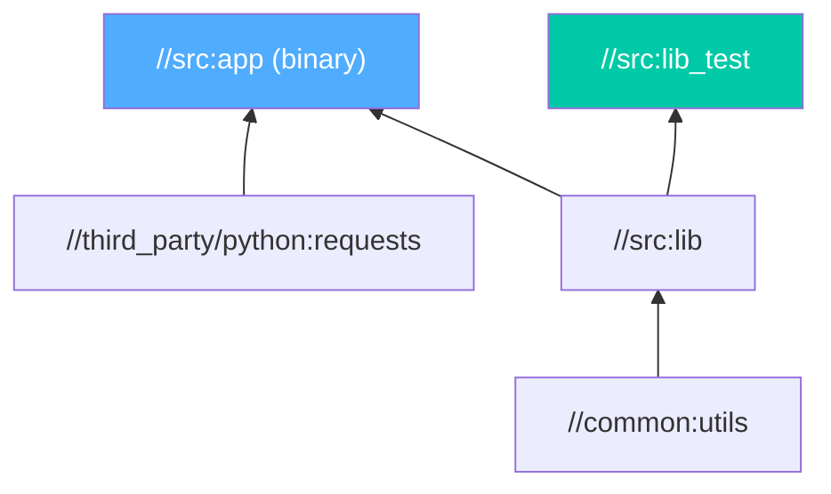

<div class="hero-section" style="background: linear-gradient(135deg, #4facfe 0%, #00f2fe 100%); color: white; padding: 3rem 2rem; margin: -2rem -3rem 2rem -3rem; text-align: center;">
  <h1 style="color: white; margin: 0; font-size: 2.5rem;">Please Build</h1>
  <p style="font-size: 1.25rem; margin-top: 1rem; opacity: 0.9;">High-performance polyglot build system for monorepos</p>
</div>

<!-- Custom styles are now loaded via main.scss -->

Please Build is a high-performance, extensible build system that brings the power of Google's Blaze/Bazel to a wider audience with a more approachable syntax and philosophy. Designed for polyglot environments and monorepos, Please emphasizes correctness, reproducibility, and speed. This comprehensive guide covers everything from basic setup to advanced features.

<div class="tip-card">
  <h4>When does a tool like Please earn its keep?</h4>
  <p>For a single-language app, your language's native tool (<code>go build</code>, <code>npm</code>, <code>cargo</code>) is simpler. Please shines in <strong>polyglot monorepos</strong> where you need one consistent, cached, parallel build across many languages — and where reproducibility and incremental rebuilds across a large dependency graph actually matter.</p>
</div>

### How Please thinks: the build graph

Every target declares its inputs and dependencies in a `BUILD` file. Please assembles these into a directed graph, then builds only what changed — running independent branches in parallel and reusing cached results for everything else.



Change `utils` and Please rebuilds `lib`, `app`, and `lib_test`; change only the test, and just the test reruns.

## Key Features

- **Language Agnostic**: Supports Go, Python, Java, C++, JavaScript, Rust, and more out of the box
- **Hermetic Builds**: Ensures reproducible builds by isolating build environments
- **Parallel Execution**: Automatically parallelizes independent build steps across available cores
- **Incremental Builds**: Content-addressed caching ensures minimal rebuilds
- **Remote Execution**: Distribute builds across multiple machines for massive speedups
- **Extensible**: Write custom build rules in Python-like Starlark language
- **Cross-compilation**: Build for multiple platforms from a single machine
- **Build Graph Visualization**: Understand dependencies with interactive graphs

## Installation

### Quick Install (Recommended)

```bash
# Latest stable version
curl -sSfL https://get.please.build | bash

# Or with specific version
curl -sSfL https://get.please.build | bash -s -- --version=17.8.0
```

### Alternative Installation Methods

```bash
# macOS with Homebrew
brew tap thought-machine/please
brew install please

# From source
git clone https://github.com/thought-machine/please.git
cd please
./bootstrap.sh

# Using Go
go install github.com/thought-machine/please@latest
```

### Verify Installation

```bash
plz --version
# Output: Please version 17.8.0
```

## Getting Started

### Creating a New Project

```bash
# Initialize a new Please project
plz init

# With templates for specific languages
plz init --template=go     # Go project
plz init --template=python # Python project
plz init --template=java   # Java project
```

This creates:
- `.plzconfig` - Main configuration file
- `BUILD` - Root build file
- `.gitignore` - With Please-specific entries

## Configuration

### Basic Configuration

Edit `.plzconfig` to configure Please Build:

```ini
[please]
version = 17.8.0
selfupdate = true
location = ~/.please

[build]
path = src/
languages = python,go,java
timeout = 600
workers = 4

[cache]
dir = ~/.cache/please
httpurl = https://cache.example.com  # Optional remote cache

[python]
defaultinterpreter = python3
piptool = pip3
moduledir = third_party/python

[go]
goroot = /usr/local/go
importpath = github.com/myorg/myproject
```

### Advanced Configuration

```ini
[remote]
url = grpc://remote-execution.example.com:8980
instancename = main
numexecutors = 100

[metrics]
pushgatewayurl = http://prometheus-pushgateway:9091

[experimental]
go_modules = true
python_wheel = true
rust_cargo = true
```

## Build Rules

### Core Concepts

Build rules define how to build targets. Create `BUILD` files (or `BUILD.plz`) in directories:

### Python Example

```python
# BUILD file
python_binary(
    name = "app",
    main = "main.py",
    deps = [
        ":lib",
        "//third_party/python:requests",
    ],
)

python_library(
    name = "lib",
    srcs = glob(["*.py"], exclude=["*_test.py", "main.py"]),
    deps = [
        "//common:utils",
    ],
)

python_test(
    name = "lib_test",
    srcs = ["lib_test.py"],
    deps = [":lib"],
)
```

### Go Example

```python
go_binary(
    name = "server",
    srcs = ["main.go"],
    deps = [
        ":handlers",
        "//third_party/go:github.com_gorilla_mux",
    ],
)

go_library(
    name = "handlers",
    srcs = glob(["*.go"], exclude=["*_test.go", "main.go"]),
    visibility = ["//service/..."],
)

go_test(
    name = "handlers_test",
    srcs = ["handlers_test.go"],
    deps = [":handlers"],
)
```

### Cross-Language Dependencies

```python
# Protocol buffers used by multiple languages
proto_library(
    name = "api_proto",
    srcs = ["api.proto"],
    languages = ["python", "go", "java"],
    visibility = ["PUBLIC"],
)

# Docker image with multi-language app
docker_image(
    name = "microservice",
    srcs = [
        ":go_server",
        ":python_worker",
    ],
    base = "alpine:3.18",
    dockerfile = "Dockerfile",
)
```

## Testing

### Writing Tests

Please Build has first-class support for testing:

```python
# Unit tests
python_test(
    name = "unit_tests",
    srcs = glob(["*_test.py"]),
    deps = [":lib"],
    size = "small",
)

# Integration tests
python_test(
    name = "integration_tests",
    srcs = ["integration_test.py"],
    deps = [":app"],
    size = "medium",
    timeout = 300,
    labels = ["integration"],
)

# Benchmarks
go_test(
    name = "bench",
    srcs = ["bench_test.go"],
    deps = [":lib"],
    flags = "-bench=.",
    labels = ["benchmark"],
)
```

### Running Tests

```bash
# Run all tests
plz test

# Run specific test
plz test //src:unit_tests

# Run tests matching pattern
plz test //..._test

# Run tests with specific label
plz test --include integration

# Run tests in parallel
plz test --num_test_runs=10

# Generate coverage report
plz cover //src:unit_tests
```

### Test Sharding

```python
# Automatically shard large test suites
python_test(
    name = "large_test_suite",
    srcs = glob(["test_*.py"]),
    shard_count = 4,  # Split across 4 parallel jobs
)
```

## Continuous Integration

### GitHub Actions

```yaml
name: Please Build CI

on: [push, pull_request]

jobs:
  build:
    runs-on: ubuntu-latest
    steps:
    - uses: actions/checkout@v4
    
    - name: Install Please
      run: curl -sSfL https://get.please.build | bash
    
    - name: Build
      run: |
        export PATH="$HOME/.please/bin:$PATH"
        plz build //...
    
    - name: Test
      run: plz test //... --detailed_tests
    
    - name: Coverage
      run: plz cover --coverage_report=xml //...
    
    - uses: codecov/codecov-action@v3
      with:
        file: ./cover.xml
```

### GitLab CI

```yaml
image: ubuntu:22.04

before_script:
  - apt-get update && apt-get install -y curl
  - curl -sSfL https://get.please.build | bash
  - export PATH="$HOME/.please/bin:$PATH"

build:
  script:
    - plz build //...
  artifacts:
    paths:
      - plz-out/

test:
  script:
    - plz test //... --log_file=test.log
  artifacts:
    reports:
      junit: test.log
```

### Remote Caching for CI

```ini
# .plzconfig for CI
[cache]
dir = ~/.cache/please
httpurl = https://please-cache.example.com
httpwriteable = true
httpheaders = Authorization: Bearer $CACHE_TOKEN
```

## Advanced Features

### Remote Execution

Distribute builds across multiple machines:

```ini
# .plzconfig
[remote]
url = grpc://remote.example.com:8980
instancename = main
numexecutors = 50
casurl = grpc://cas.example.com:8981
```

### Custom Build Rules

```python
# build_defs/BUILD
filegroup(
    name = "rules",
    srcs = ["rust_rules.build_defs"],
    visibility = ["PUBLIC"],
)
```

```python
# build_defs/rust_rules.build_defs
def rust_binary(name, srcs, deps=None, visibility=None):
    """Build a Rust binary."""
    return build_rule(
        name = name,
        srcs = srcs,
        deps = deps,
        outs = [name],
        cmd = "rustc $SRCS -o $OUT",
        binary = True,
        visibility = visibility,
    )
```

### Build Graph Analysis

```bash
# Visualize dependencies
plz query graph --to //src:app | dot -Tpng > graph.png

# Find all reverse dependencies
plz query revdeps //common:utils

# Query for specific attributes
plz query print //src:app --field=deps

# Find all tests
plz query alltargets --include test
```

### Performance Optimization

```ini
[build]
workers = 16  # Parallel build jobs
memorylimit = 8GB

[test]
defaulttimeout = 300
workers = 8

[metrics]
pushgatewayurl = http://prometheus:9091
namespace = please_build
```

### Integration with Modern Tools

#### Docker Support
```python
docker_image(
    name = "app_image",
    srcs = [":app_binary"],
    dockerfile = "Dockerfile",
    labels = ["latest", "$VERSION"],
    repo = "myorg/myapp",
)
```

#### Kubernetes Deployment
```python
k8s_config(
    name = "deployment",
    srcs = ["k8s/*.yaml"],
    containers = {
        "app": ":app_image",
    },
)
```

#### Protocol Buffers & gRPC
```python
grpc_library(
    name = "api_grpc",
    srcs = ["api.proto"],
    languages = ["python", "go"],
    protoc_flags = ["--experimental_allow_proto3_optional"],
)
```

## Best Practices

### Monorepo Organization

```
/
├── .plzconfig
├── BUILD              # Root build file
├── build_defs/        # Custom build rules
├── common/            # Shared libraries
├── services/          # Microservices
│   ├── api/
│   ├── auth/
│   └── worker/
├── tools/             # Development tools
└── third_party/       # External dependencies
    ├── go/
    ├── python/
    └── java/
```

### Dependency Management

```python
# third_party/python/BUILD
pip_library(
    name = "requests",
    version = "2.31.0",
    hashes = ["sha256:..."],
    deps = [
        ":urllib3",
        ":certifi",
    ],
)

# Lock dependencies
# Run: plz hash --update //third_party/python/...
```

### Build Optimization Tips

1. **Use Remote Caching**: Share build artifacts across team
2. **Minimize Dependencies**: Keep build graphs shallow
3. **Parallelize Tests**: Use test sharding for large suites
4. **Profile Builds**: `plz build --profile_file=profile.json`
5. **Incremental Builds**: Design rules for maximum incrementality

## Troubleshooting

### Common Issues

```bash
# Clean build cache
plz clean

# Rebuild specific target
plz build --rebuild //src:app

# Debug build rules
plz build //src:app --debug

# Show build output
plz build //src:app --show_all_output

# Trace execution
plz build //src:app --trace_file=trace.json
```

### Build Reproducibility

```bash
# Verify reproducible builds
plz build //src:app --reproducible
cp plz-out/gen/src/app app1
plz clean
plz build //src:app --reproducible
diff plz-out/gen/src/app app1  # Should be identical
```

## Migration Guide

### From Bazel

```python
# Bazel rule
cc_binary(
    name = "app",
    srcs = ["main.cc"],
    deps = [":lib"],
)

# Please equivalent
cc_binary(
    name = "app",
    srcs = ["main.cc"],
    deps = [":lib"],
)  # Almost identical!
```

### From Make

```makefile
# Makefile
app: main.o lib.o
    gcc -o app main.o lib.o

# Please BUILD file
cc_binary(
    name = "app",
    srcs = ["main.c"],
    deps = [":lib"],
)
```

## FAQ

**Q: How does Please compare to Bazel?**
A: Please is inspired by Bazel but focuses on simplicity and ease of use. It has a gentler learning curve while maintaining most of Bazel's power.

**Q: Can I use Please for small projects?**
A: Yes! Please scales from single-file projects to massive monorepos.

**Q: Does Please support Windows?**
A: Please has experimental Windows support via WSL2.

**Q: How do I debug failing builds?**
A: Use `--debug` and `--show_all_output` flags, or check `plz-out/log/`

For more FAQs, see the [official FAQ](https://please.build/faq.html).

## Key Takeaways

<div class="takeaway-card">
  <ul>
    <li><strong>Please targets polyglot monorepos</strong> — one build system across Go, Python, Java, C++, and more, with a gentler learning curve than Bazel.</li>
    <li><strong>The build graph drives everything:</strong> declare inputs and deps in <code>BUILD</code> files, and Please rebuilds only what changed.</li>
    <li><strong>Content-addressed caching plus parallelism</strong> deliver fast, incremental builds; remote caching and execution scale this across a team.</li>
    <li><strong>Hermetic builds</strong> make results reproducible — the same inputs always produce the same outputs.</li>
    <li><strong>Use native tooling for single-language projects;</strong> reach for Please when scale, polyglot needs, or reproducibility justify it.</li>
  </ul>
</div>

## Resources

- [Official Documentation](https://please.build/)
- [GitHub Repository](https://github.com/thought-machine/please)
- [Rule Examples](https://github.com/thought-machine/please/tree/master/test)
- [Please Community Discussions](https://github.com/thought-machine/please/discussions)
- [Build Language Reference](https://please.build/language.html)
- [Please FAQ](https://please.build/faq.html) - Common questions and answers

<div class="see-also-card">
  <h4>See Also</h4>
  <ul>
    <li><a href="ci-cd.html">CI/CD</a> — wire Please builds into automated pipelines</li>
    <li><a href="git.html">Git Version Control</a> — monorepo strategies and large-repo tooling</li>
    <li><a href="docker/">Docker</a> — package Please build artifacts into container images</li>
    <li><a href="kubernetes/">Kubernetes</a> — deploy the services Please builds</li>
  </ul>
</div>
