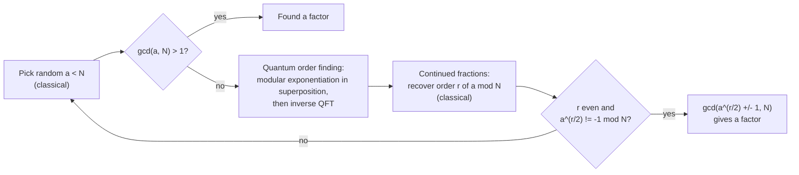
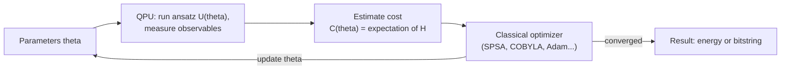
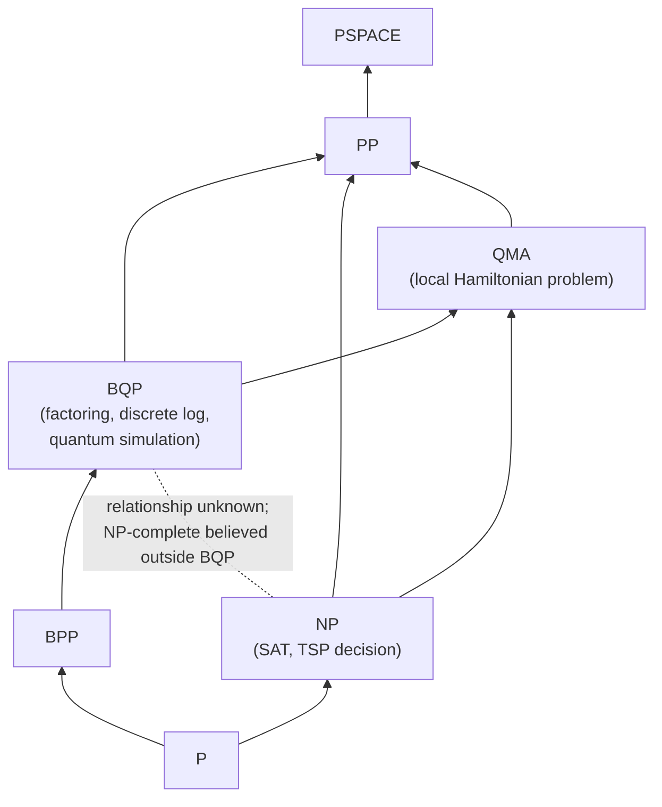
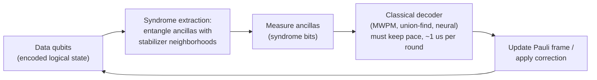
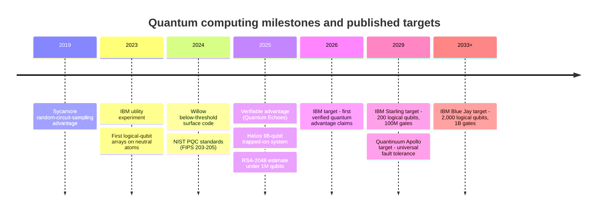
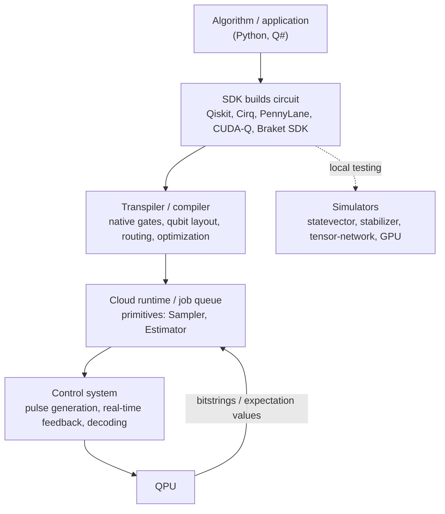

Quantum computing processes information with qubits, whose states are vectors in a complex vector space rather than fixed 0/1 values. By preparing superpositions, entangling qubits, and arranging for amplitudes to interfere, a quantum algorithm can solve some problems (factoring, simulating quantum systems, certain searches) with far fewer operations than any known classical method. It gives no general speedup for most workloads. This page covers the qubit model, gates and circuits, the main algorithms and their real speedups, error correction, the hardware platforms, and how to program today's machines. The status is current as of late 2026.

For the underlying physics, see [Quantum Mechanics](../physics/quantum-mechanics/). For proofs, complexity theory, and research-level algorithms, see [Quantum Algorithms Research](../advanced/quantum-algorithms-research/).

## Overview

A classical computer with $n$ bits is in one of $2^n$ configurations at a time. An $n$-qubit register is described by $2^n$ complex **amplitudes**, one per configuration, and every gate updates all of them at once. The common summary "a quantum computer tries every answer in parallel" is misleading, though. Measuring the register returns only $n$ classical bits, sampled with probabilities set by the amplitudes. A useful quantum algorithm has to make the amplitudes of wrong answers cancel and those of right answers add up before it measures. That is only possible for problems with exploitable structure.

Three ideas carry the whole field:

| Concept | What it means | Role in algorithms |
|---------|---------------|--------------------|
| **Superposition** | A state is a weighted combination of basis states, with complex weights | Lets one circuit act on exponentially many basis states |
| **Entanglement** | A multi-qubit state that cannot be written as a product of single-qubit states | Produces correlations that no classical probability distribution over separate bits reproduces; needed for exponential speedups |
| **Interference** | Amplitudes add like waves and can cancel | Concentrates probability on the answer before measurement |

**Status in 2026.** Hardware has reached roughly 100 to 1,000+ physical qubits, depending on the platform. The best two-qubit gate fidelities are about 99.9%. Several groups have shown quantum error correction that gets *better* as the code grows, which is the property a scalable machine needs. No machine yet runs the long, error-corrected computations that Shor's algorithm or industrial chemistry would need. Most roadmaps place the first fault-tolerant systems with around 100 logical qubits near the end of the decade.

## Qubits {#building-blocks-from-bits-to-qubits}

### State and measurement

A single qubit's state is a unit vector in $\mathbb{C}^2$, written in Dirac (bra-ket) notation over the computational basis $\{|0\rangle, |1\rangle\}$:

$$|\psi\rangle = \alpha|0\rangle + \beta|1\rangle, \qquad \alpha, \beta \in \mathbb{C}, \qquad |\alpha|^2 + |\beta|^2 = 1$$

Measuring in the computational basis gives 0 with probability $|\alpha|^2$ and 1 with probability $|\beta|^2$ (the **Born rule**). The state then becomes the observed basis state. A measurement cannot recover $\alpha$ and $\beta$ themselves. Estimating them takes many identically prepared copies, and the **no-cloning theorem** rules out copying an unknown state to make those copies.

### The Bloch sphere

A global phase has no observable effect, so any pure single-qubit state can be written with two real angles:

$$|\psi\rangle = \cos\frac{\theta}{2}\,|0\rangle + e^{i\varphi}\sin\frac{\theta}{2}\,|1\rangle, \qquad 0 \le \theta \le \pi, \quad 0 \le \varphi < 2\pi$$

This maps every pure state to a point on the unit sphere. $|0\rangle$ is at the north pole and $|1\rangle$ at the south pole. The equal superpositions $|\pm\rangle = (|0\rangle \pm |1\rangle)/\sqrt{2}$ sit on the equator. Single-qubit gates are rotations of the sphere. Noise pulls the state vector inward, toward the center, which is the maximally mixed state.

<figure class="diagram">
<svg viewBox="0 0 360 330" role="img" aria-label="Bloch sphere with |0> at the north pole, |1> at the south pole, and a state vector at polar angle theta and azimuth phi" style="max-width: 360px; width: 100%;">
  <g fill="none" stroke="currentColor">
    <circle cx="180" cy="165" r="120" stroke-width="1.5"/>
    <ellipse cx="180" cy="165" rx="120" ry="34" stroke-opacity="0.45" stroke-dasharray="4,4"/>
    <path d="M180,45 L180,285" stroke-opacity="0.5"/>
    <path d="M180,165 L95,215" stroke-opacity="0.5"/>
    <path d="M180,165 L300,165" stroke-opacity="0.5"/>
    <path d="M180,165 L258,88" stroke-width="2.2"/>
    <path d="M258,88 L258,190" stroke-opacity="0.45" stroke-dasharray="3,3"/>
    <path d="M180,165 L258,190" stroke-opacity="0.45" stroke-dasharray="3,3"/>
    <path d="M180,125 A40,40 0 0 1 208,137" stroke-width="1.2"/>
    <path d="M150,183 A45,18 0 0 0 214,176" stroke-width="1.2"/>
  </g>
  <circle cx="258" cy="88" r="4" fill="currentColor"/>
  <g fill="currentColor" font-size="14" text-anchor="middle">
    <text x="180" y="36">|0⟩</text>
    <text x="180" y="306">|1⟩</text>
    <text x="84" y="230">x</text>
    <text x="314" y="169">y</text>
    <text x="276" y="80">|ψ⟩</text>
    <text x="202" y="120">θ</text>
    <text x="186" y="200">φ</text>
    <text x="320" y="240" font-size="12">|+⟩ on +x axis</text>
  </g>
</svg>
<figcaption>The Bloch sphere. The polar angle $\theta$ sets the measurement probabilities $\cos^2(\theta/2)$ and $\sin^2(\theta/2)$. The azimuth $\varphi$ is a relative phase: invisible to a computational-basis measurement, but decisive for interference.</figcaption>
</figure>

### Multiple qubits and entanglement {#from-one-qubit-to-many-the-magic-of-entanglement}

The joint state of several qubits lives in the **tensor product** of their spaces, so $n$ qubits need $2^n$ amplitudes:

$$|\psi\rangle = \sum_{x \in \{0,1\}^n} c_x\,|x\rangle, \qquad \sum_x |c_x|^2 = 1$$

Storing that vector classically takes $2^n$ complex numbers. At 16 bytes each, 50 qubits already need about 18 petabytes. This is why brute-force classical simulation stops being feasible at around 50 generic qubits. Simulators that exploit structure (tensor networks, stabilizer methods, belief propagation) can go much further on circuits that have little entanglement or a special form.

A state is **entangled** if it cannot be factored as $|a\rangle \otimes |b\rangle$. The four maximally entangled two-qubit **Bell states** are

$$|\Phi^{\pm}\rangle = \frac{|00\rangle \pm |11\rangle}{\sqrt{2}}, \qquad |\Psi^{\pm}\rangle = \frac{|01\rangle \pm |10\rangle}{\sqrt{2}}$$

Measuring either qubit of $|\Phi^+\rangle$ gives a uniformly random bit, and the other qubit then always matches it. The correlations persist in every measurement basis. That is what violates Bell inequalities and sets entanglement apart from classical shared randomness. Entanglement cannot transmit information faster than light, because each party's local outcomes are uniformly random.

Two limits keep the exponential state space in perspective:

- **Holevo bound.** $n$ qubits can carry at most $n$ bits of classical information that can be read out, despite needing $2^n$ amplitudes to describe.
- **Entanglement is necessary but not sufficient.** Circuits built only from Clifford gates ($H$, $S$, CNOT) can create highly entangled states, yet the **Gottesman–Knill theorem** shows they can be simulated efficiently on a classical computer.

### Mixed states and noise {#the-mathematical-foundations-why-it-all-works}

Real qubits are coupled to their environment, so their state is described by a **density matrix**:

$$\rho = \sum_i p_i\,|\psi_i\rangle\langle\psi_i|, \qquad \rho = \rho^\dagger, \qquad \rho \succeq 0, \qquad \operatorname{Tr}\rho = 1$$

A pure state has $\operatorname{Tr}\rho^2 = 1$. Decoherence drives $\operatorname{Tr}\rho^2$ below 1. Two timescales characterize a physical qubit:

| Parameter | Meaning | Effect on the Bloch vector |
|-----------|---------|----------------------------|
| $T_1$ (relaxation) | Energy decay from $\lvert 1\rangle$ to $\lvert 0\rangle$ | Pulls the vector toward the north pole |
| $T_2$ (dephasing) | Loss of the relative phase between $\lvert 0\rangle$ and $\lvert 1\rangle$ | Shrinks the component in the $x$–$y$ plane; always $T_2 \le 2T_1$ |

The formal rules of the model can be summarized as five postulates:

| Postulate | Statement |
|-----------|-----------|
| States | A closed system is a unit vector in a Hilbert space (or a density matrix, for an open system) |
| Evolution | Closed-system evolution is unitary: $\lvert\psi(t)\rangle = U(t)\lvert\psi(0)\rangle$, with $U^\dagger U = I$ |
| Measurement | Outcome $m$ occurs with probability $\langle\psi\rvert M_m^\dagger M_m\lvert\psi\rangle$, after which the state updates |
| Composition | A composite system's space is the tensor product of its parts' spaces |
| Observables | Measurable quantities are Hermitian operators; their eigenvalues are the possible outcomes |

<div class="code-reference">
<i class="fas fa-code"></i> Implementations: <a href="https://github.com/andrewaltimit/Documentation/blob/main/github-pages/code-examples/technology/quantum-computing/quantum_state.py">quantum_state.py</a>, <a href="https://github.com/andrewaltimit/Documentation/blob/main/github-pages/code-examples/technology/quantum-computing/quantum_postulates.py">quantum_postulates.py</a>
</div>

## Gates and Circuits {#quantum-gates-programming-the-quantum-world}

Quantum gates are unitary matrices, so every gate is reversible. Measurement is the only irreversible step in the model. A circuit is drawn as one horizontal wire per qubit, with time running left to right.

### Common gates

| Gate | Matrix | Action |
|------|--------|--------|
| Pauli-$X$ | $\begin{pmatrix}0&1\\1&0\end{pmatrix}$ | Bit flip, $\lvert 0\rangle \leftrightarrow \lvert 1\rangle$ (quantum NOT); a $\pi$ rotation about $x$ |
| Pauli-$Y$ | $\begin{pmatrix}0&-i\\i&0\end{pmatrix}$ | Bit and phase flip; a $\pi$ rotation about $y$ |
| Pauli-$Z$ | $\begin{pmatrix}1&0\\0&-1\end{pmatrix}$ | Phase flip; $\lvert 1\rangle \mapsto -\lvert 1\rangle$ |
| Hadamard $H$ | $\tfrac{1}{\sqrt{2}}\begin{pmatrix}1&1\\1&-1\end{pmatrix}$ | $\lvert 0\rangle \mapsto \lvert +\rangle$, $\lvert 1\rangle \mapsto \lvert -\rangle$; swaps the $Z$ and $X$ bases |
| Phase $S$ | $\begin{pmatrix}1&0\\0&i\end{pmatrix}$ | Quarter turn about $z$; $S^2 = Z$ |
| $T$ | $\begin{pmatrix}1&0\\0&e^{i\pi/4}\end{pmatrix}$ | Eighth turn about $z$; $T^2 = S$. The non-Clifford gate in the standard universal set |
| $R_z(\lambda)$ | $\begin{pmatrix}e^{-i\lambda/2}&0\\0&e^{i\lambda/2}\end{pmatrix}$ | Arbitrary rotation about $z$ (similarly $R_x$, $R_y$) |
| CNOT (CX) | $4\times 4$, below | Flips the target when the control is $\lvert 1\rangle$ |
| CZ | $\operatorname{diag}(1,1,1,-1)$ | Phase flip on $\lvert 11\rangle$; symmetric in its two qubits. Native on many superconducting chips |

With the control as the first (left) qubit, in the basis ordering $|00\rangle, |01\rangle, |10\rangle, |11\rangle$:

$$\text{CNOT} = \begin{pmatrix} 1 & 0 & 0 & 0 \\ 0 & 1 & 0 & 0 \\ 0 & 0 & 0 & 1 \\ 0 & 0 & 1 & 0 \end{pmatrix}$$

Qiskit orders qubits little-endian (qubit 0 is the rightmost bit), so its printed matrices show CNOT with rows and columns permuted. Check the convention before comparing matrices across tools.

### Universality

A gate set is **universal** if it can approximate any unitary to arbitrary precision. $\{H, T, \text{CNOT}\}$ (Clifford + $T$) is the standard choice. By the **Solovay–Kitaev theorem**, accuracy $\epsilon$ costs only $O(\log^c(1/\epsilon))$ gates for a small constant $c$. For single-qubit rotations, number-theoretic Clifford + $T$ synthesis reaches the optimal $O(\log(1/\epsilon))$. Hardware uses native gate sets instead, for example $\{\sqrt{X}, R_z, \text{CZ}\}$ on IBM devices, or Mølmer–Sørensen/ZZ gates on trapped ions. A **transpiler** rewrites circuits into the native set and routes two-qubit gates onto the chip's connectivity graph. Routing inserts SWAP gates where the graph lacks a direct link.

Clifford gates alone are not universal and can be simulated classically. The $T$ gate supplies the missing "quantumness". On error-corrected hardware, $T$ gates are the expensive part (see [magic states](#fault-tolerant-gates-and-magic-states)).

### A first circuit: the Bell pair

<figure class="diagram">
<svg viewBox="0 0 520 150" role="img" aria-label="Circuit: qubit 0 passes through a Hadamard gate, then acts as control of a CNOT targeting qubit 1; both qubits are then measured" style="max-width: 520px; width: 100%;">
  <g fill="none" stroke="currentColor" stroke-width="1.5">
    <path d="M70,45 L420,45"/>
    <path d="M70,110 L420,110"/>
    <rect x="130" y="25" width="40" height="40" fill="none"/>
    <path d="M260,45 L260,124"/>
    <circle cx="260" cy="110" r="14"/>
    <rect x="400" y="27" width="46" height="36"/>
    <rect x="400" y="92" width="46" height="36"/>
    <path d="M408,55 A15,15 0 0 1 438,55"/>
    <path d="M423,56 L436,36"/>
    <path d="M408,120 A15,15 0 0 1 438,120"/>
    <path d="M423,121 L436,101"/>
    <path d="M446,43 L500,43 M446,47 L500,47" stroke-width="1"/>
    <path d="M446,108 L500,108 M446,112 L500,112" stroke-width="1"/>
  </g>
  <circle cx="260" cy="45" r="6" fill="currentColor"/>
  <g fill="currentColor" font-size="15" text-anchor="middle">
    <text x="36" y="50">q0: |0⟩</text>
    <text x="36" y="115">q1: |0⟩</text>
    <text x="150" y="51">H</text>
    <text x="195" y="145" font-size="12">1</text>
    <text x="330" y="145" font-size="12">2</text>
  </g>
  <g fill="none" stroke="currentColor" stroke-opacity="0.4" stroke-dasharray="3,3">
    <path d="M195,15 L195,132"/>
    <path d="M330,15 L330,132"/>
  </g>
</svg>
<figcaption>Hadamard, then CNOT, prepares $|\Phi^+\rangle$. At slice 1 the state is $\tfrac{1}{\sqrt 2}(|00\rangle + |10\rangle)$ (writing $q_0$ first). The CNOT maps $|10\rangle \to |11\rangle$, so at slice 2 it is $\tfrac{1}{\sqrt 2}(|00\rangle + |11\rangle)$. Measurement gives <code>00</code> or <code>11</code>, each half the time, and never <code>01</code> or <code>10</code>.</figcaption>
</figure>

<div class="code-reference">
<i class="fas fa-code"></i> Implementation: <a href="https://github.com/andrewaltimit/Documentation/blob/main/github-pages/code-examples/technology/quantum-computing/quantum_gates.py">quantum_gates.py</a>
</div>

## Foundational Algorithms {#classical-quantum-algorithms-the-foundations}

Most quantum algorithms follow the same template:

1. **Prepare** a uniform superposition with Hadamards.
2. **Query** a function in superposition through an **oracle** $U_f$. Written as a phase oracle, $|x\rangle \mapsto (-1)^{f(x)}|x\rangle$, it encodes $f$ into relative phases. This is **phase kickback**.
3. **Interfere** the branches with a transform (Hadamard layer, quantum Fourier transform, or reflection) so that a global property of $f$ shows up as a basis state.
4. **Measure**, and post-process classically if needed.

### Deutsch–Jozsa and the query model

$f:\{0,1\}^n \to \{0,1\}$ is promised to be either **constant** or **balanced** (equal numbers of 0 and 1 outputs). A deterministic classical algorithm needs $2^{n-1}+1$ queries in the worst case. Deutsch–Jozsa needs one. After $H^{\otimes n}$, a phase-oracle query, and $H^{\otimes n}$ again, the amplitude of $|0^n\rangle$ is

$$\frac{1}{2^n}\sum_{x}(-1)^{f(x)}$$

That amplitude has magnitude 1 if $f$ is constant and 0 if $f$ is balanced. The separation shrinks against a *randomized* classical algorithm, which answers correctly with high probability after a few queries. Deutsch–Jozsa therefore mainly illustrates the method. **Bernstein–Vazirani** (recovering a hidden string $s$ from $f(x) = s\cdot x$) and **Simon's algorithm** (finding a hidden XOR period) follow the same pattern. Simon's algorithm gives an exponential separation even against randomized algorithms, and it directly inspired Shor.

### Grover's algorithm {#grovers-algorithm-searching-the-unsearchable}

Given an oracle that marks $M$ of $N$ items, Grover's algorithm finds a marked item with

$$k \approx \frac{\pi}{4}\sqrt{\frac{N}{M}}$$

queries, where a classical search needs $\Theta(N/M)$. Each iteration applies the oracle (a reflection about the unmarked subspace), then the **diffusion operator** $2|s\rangle\langle s| - I$ (a reflection about the uniform superposition $|s\rangle$). Two reflections compose to a rotation by $2\theta$, where $\sin\theta = \sqrt{M/N}$, so the state rotates steadily toward the marked subspace. Too many iterations rotate it past the target, so $k$ has to be chosen with care. When $M$ is unknown, **quantum counting** (below) or exponentially growing guesses handle it.

- **Optimality.** The Bennett–Bernstein–Brassard–Vazirani lower bound shows no quantum algorithm beats $\Omega(\sqrt{N})$ queries for unstructured search. Quantum computers therefore do not solve NP-complete problems by brute force in polynomial time.
- **Practical caveat.** The speedup is quadratic and counts oracle calls. On error-corrected hardware each oracle call is a deep circuit running orders of magnitude slower than a classical instruction. Resource estimates suggest that fault-tolerant overheads cancel out a quadratic speedup for all but very long computations.

### Shor's algorithm {#shors-algorithm-the-killer-app}

Shor's algorithm (1994) factors an $n$-bit integer $N$ in polynomial time: $O(n^3)$ gates with schoolbook arithmetic, and less with faster multiplication. The best known classical method, the general number field sieve, runs in sub-exponential time $\exp\!\big(O(n^{1/3}(\log n)^{2/3})\big)$. The algorithm reduces factoring to **order finding**:



The quantum part estimates the eigenphases $s/r$ of the modular-multiplication unitary $U_a|y\rangle = |ay \bmod N\rangle$ using [phase estimation](#quantum-phase-estimation). The same approach solves discrete logarithms, including over elliptic curves. Shor's algorithm therefore breaks RSA, Diffie–Hellman, and elliptic-curve cryptography alike. It is an instance of the **hidden subgroup problem** over abelian groups. No efficient algorithm is known for the non-abelian cases that would cover graph isomorphism or lattice problems.

In 2019, Gidney and Ekerå estimated that factoring RSA-2048 needs about 20 million noisy physical qubits for 8 hours. A 2025 estimate by Gidney brought this below **one million physical qubits for under a week**. It assumes 0.1% gate error, a 1 µs surface-code cycle, and newer techniques such as yoked surface codes and magic-state cultivation. See [Cryptography](#cryptography) for what this means for deployed systems.

### Speedup summary

| Algorithm | Problem | Classical cost | Quantum cost | Speedup |
|-----------|---------|----------------|--------------|---------|
| Deutsch–Jozsa | Constant vs balanced (promise) | $2^{n-1}+1$ deterministic | 1 query | Exponential vs deterministic only |
| Simon | Hidden XOR period | $\Omega(2^{n/2})$ | $O(n)$ queries | Exponential |
| Shor | Factoring, discrete log | Sub-exponential (GNFS) | Polynomial | Super-polynomial |
| Grover | Unstructured search | $\Theta(N)$ | $\Theta(\sqrt{N})$ | Quadratic, provably optimal |
| Hamiltonian simulation | Time evolution of quantum systems | Exponential in general | Polynomial | Exponential (believed) |
| Sorting (comparison) | Sort $n$ items | $\Theta(n\log n)$ | $\Omega(n\log n)$ | None |

## Algorithmic Primitives {#modern-quantum-algorithms-beyond-the-classics}

Fault-tolerant algorithms are mostly built from a small set of reusable subroutines.

### Quantum Fourier transform

The QFT maps $|x\rangle \mapsto \frac{1}{\sqrt{2^n}}\sum_{y} e^{2\pi i xy/2^n}|y\rangle$ using $O(n^2)$ gates, or fewer if the tiny rotations are dropped. The classical FFT needs $O(n2^n)$ operations on the same vector. The QFT cannot be used to compute Fourier coefficients directly, though, because they are stored in amplitudes that measurement cannot read. It is useful only inside algorithms such as phase estimation, where the output is a single basis state.

### Quantum phase estimation

Given a unitary $U$ and an eigenstate $|u\rangle$ with $U|u\rangle = e^{2\pi i\phi}|u\rangle$, **quantum phase estimation (QPE)** writes $\phi$ to $t$ bits of precision into an ancilla register. It does this with controlled-$U^{2^j}$ operations followed by an inverse QFT. QPE underlies Shor's algorithm (eigenphases of modular multiplication) and quantum chemistry (energies as eigenphases of $e^{-iHt}$). Precision $\epsilon$ costs $O(1/\epsilon)$ applications of $U$, the **Heisenberg limit**. Sampling a classical estimator would need $O(1/\epsilon^2)$. Modern variants use a single ancilla with classical post-processing (iterative, Bayesian, or robust phase estimation), which suits early fault-tolerant hardware.

<div class="code-reference">
<i class="fas fa-code"></i> Implementation: <a href="https://github.com/andrewaltimit/Documentation/blob/main/github-pages/code-examples/technology/quantum-computing/quantum_algorithms.py#L14">quantum_algorithms.py#QuantumPhaseEstimation</a>
</div>

### Amplitude amplification and estimation

**Amplitude amplification** generalizes Grover's algorithm. If an algorithm $A$ succeeds with probability $p$, then about $\frac{\pi}{4\sqrt{p}}$ rounds of $Q = -A S_0 A^{-1} S_f$ raise the success probability close to 1. $S_f$ flips the phase of good states and $S_0$ flips the phase of $|0\rangle$. A classical approach that simply repeats $A$ needs about $1/p$ runs.

**Amplitude estimation** runs phase estimation on $Q$ to estimate $p$ to additive error $\epsilon$ with $O(1/\epsilon)$ calls to $A$, against $O(1/\epsilon^2)$ for Monte Carlo sampling. **Quantum counting** is the special case where $A$ is the uniform superposition, so it estimates the number of marked items $M$. This quadratic Monte Carlo speedup is behind most proposed quantum finance applications, such as derivative pricing. Resource estimates put those applications firmly in the fault-tolerant era.

### Hamiltonian simulation

Simulating $e^{-iHt}$ for a local or sparse Hamiltonian $H$ was Feynman's original motivation. It remains the application with the strongest case for exponential advantage. The main methods:

| Method | Idea | Cost scaling (simplified) |
|--------|------|---------------------------|
| Product formulas (Trotter–Suzuki) | Split $H = \sum_j H_j$ and alternate short evolutions under each term | Polynomial in $t$ and $1/\epsilon$; simple, with small constants in practice |
| Linear combination of unitaries / Taylor series | Implement a truncated series of $e^{-iHt}$ with ancilla-controlled Pauli terms | $\tilde O(t \log(1/\epsilon))$ |
| Qubitization / quantum signal processing | Block-encode $H$, then apply polynomial transformations to it | $O(\alpha t + \log(1/\epsilon))$, optimal in query complexity |

**Quantum singular value transformation (QSVT)** generalizes qubitization. It applies a polynomial function to the singular values of a block-encoded matrix, and Hamiltonian simulation, amplitude amplification, phase estimation, and linear-system solving all turn out to be special cases of it.

### Linear systems (HHL) and its fine print

The Harrow–Hassidim–Lloyd algorithm (2009) prepares a state proportional to $A^{-1}|b\rangle$ in time polylogarithmic in the dimension $N$, for a sparse, well-conditioned $A$. The exponential speedup comes with conditions:

- The input $|b\rangle$ has to be loaded efficiently. That generally requires QRAM, which does not exist at scale.
- The output is a quantum state, not a vector. Reading all $N$ entries would cancel the speedup, so HHL is useful only when a few summary quantities such as $\langle x|M|x\rangle$ are needed.
- The cost grows with the condition number $\kappa$ (polynomially, and linearly in optimal variants).

Starting with Ewin Tang's 2018 recommendation-systems result, **dequantization** work has shown that many proposed quantum machine-learning speedups based on HHL-style linear algebra disappear if the classical algorithm gets comparable sampling access to its input. The remaining exponential speedups come from problems whose input is itself quantum or implicitly defined, such as simulating physics.

### Quantum walks

Quantum walks are the quantum analog of random walks. On a line, a quantum walk spreads a distance proportional to $t$ (ballistically), whereas a classical random walk spreads as $\sqrt{t}$. Walk-based algorithms give Grover-type quadratic speedups for spatial search and element distinctness. On specially constructed graphs, such as glued trees, they give exponential speedups.

<div class="code-reference">
<i class="fas fa-code"></i> Implementations: <a href="https://github.com/andrewaltimit/Documentation/blob/main/github-pages/code-examples/technology/quantum-computing/quantum_algorithms.py#L56">HHL</a>, <a href="https://github.com/andrewaltimit/Documentation/blob/main/github-pages/code-examples/technology/quantum-computing/quantum_algorithms.py#L152">QuantumWalk</a>
</div>

## Near-Term Algorithms {#algorithms-for-todays-quantum-computers}

Without error correction, useful circuits have to stay shallow. **Variational quantum algorithms** hand the outer optimization loop to a classical computer and use the quantum processor only to estimate expectation values of short parameterized circuits.



| Algorithm | Goal | Cost function | Main obstacles |
|-----------|------|---------------|----------------|
| **VQE** (variational quantum eigensolver) | Ground-state energy of a molecule or material | $\langle\psi(\theta)\rvert H\lvert\psi(\theta)\rangle$ | Measurement cost (many Pauli terms), ansatz expressivity, noise |
| **QAOA** (quantum approximate optimization) | Approximate solutions to combinatorial problems (MaxCut, scheduling) | Expected cost of sampled bitstrings | No demonstrated advantage over good classical heuristics at useful sizes |
| **Variational classifiers / quantum kernels** | Machine learning on classical data | Classification loss | Data loading, trainability, dequantization |

**Barren plateaus** limit how far all of these scale. For expressive or deep random ansätze, and for global cost functions, gradients vanish exponentially in the number of qubits, so optimization needs exponentially many measurement shots. Recent theory suggests a trade-off: ansätze that provably avoid barren plateaus often have enough structure to be simulated classically. This has shifted near-term research toward problem-inspired circuits and away from generic "quantum neural networks".

### Error mitigation

Error *mitigation* reduces the bias in measured expectation values without the qubit overhead of error *correction*. It pays for this with extra circuit runs, and the number of runs usually grows exponentially with circuit size.

| Technique | How it works |
|-----------|--------------|
| Zero-noise extrapolation (ZNE) | Run at deliberately amplified noise levels and extrapolate the results to zero noise |
| Probabilistic error cancellation (PEC) | Learn the noise model and sample "inverse-noise" circuits. Unbiased, but the sampling overhead is exponential |
| Probabilistic error amplification (PEA) | Learn the noise, then amplify it in a controlled way for ZNE. Used in IBM's 2023 "utility" experiment |
| Measurement error mitigation | Calibrate and invert the readout confusion matrix |
| Dynamical decoupling | Insert pulse sequences on idle qubits to cancel slow dephasing |

A related approach is **sample-based quantum diagonalization** (SQD). The quantum computer only proposes important electronic configurations, and a classical supercomputer diagonalizes the Hamiltonian in the subspace they span. This avoids VQE's measurement bottleneck and has been run with 50 to 100+ qubits in IBM–RIKEN "quantum-centric supercomputing" work, though so far without any accuracy advantage over the best classical methods.

<div class="code-reference">
<i class="fas fa-code"></i> Implementations: <a href="https://github.com/andrewaltimit/Documentation/blob/main/github-pages/code-examples/technology/quantum-computing/nisq_algorithms.py">nisq_algorithms.py</a>
</div>

## Complexity and Limits {#the-deeper-theory-quantum-complexity-and-fundamental-limits}

**BQP** (bounded-error quantum polynomial time) is the class of decision problems a quantum computer solves in polynomial time with error probability at most 1/3. Its known relationships to classical classes:



- $\text{BPP} \subseteq \text{BQP} \subseteq \text{PP} \subseteq \text{PSPACE}$. None of these inclusions has been proven strict, since that would settle open questions about classical complexity too.
- Factoring is in BQP and is not known to be in BPP. It is also not believed to be NP-complete. Quantum computers are therefore not expected to solve NP-complete problems efficiently, and Grover's bound rules out a brute-force route.
- **QMA** is the quantum analog of NP: a quantum proof that a quantum verifier checks. Its canonical complete problem, estimating the ground-state energy of a local Hamiltonian, is QMA-complete. Even quantum computers therefore cannot find ground states efficiently in general. Chemistry algorithms depend on preparing a good initial state.
- Raz and Tal (2018) built an oracle relative to which BQP is not contained in the polynomial hierarchy. This is evidence that quantum computation can do things classical computation, even with nondeterminism, cannot.

<div class="code-reference">
<i class="fas fa-code"></i> Implementation: <a href="https://github.com/andrewaltimit/Documentation/blob/main/github-pages/code-examples/technology/quantum-computing/quantum_complexity.py">quantum_complexity.py</a>
</div>

### Quantum advantage experiments {#quantum-supremacy-crossing-the-classical-frontier}

"Quantum supremacy" (Preskill, 2012), now usually called **quantum advantage**, is a demonstration that a quantum device performs *some* well-defined task beyond practical reach of classical computers. Better classical simulation methods have repeatedly narrowed early claims. The field now puts more weight on tasks whose answers can be *verified* and on tasks that are useful in their own right.

| Year | Group / device | Task | Claim | Later developments |
|------|----------------|------|-------|--------------------|
| 2019 | Google Sycamore (53 qubits) | Random circuit sampling (RCS) | 200 s vs. an estimated 10,000 years | Tensor-network simulations (2021–2022) reproduced comparable samples in hours to days |
| 2020–21 | USTC Jiuzhang (photonic) and Zuchongzhi (superconducting) | Gaussian boson sampling; RCS | Classical cost of $10^{9}$ years or more | Partially challenged by approximate classical samplers |
| 2023 | IBM Eagle (127 qubits) | Kicked-Ising dynamics with error mitigation ("utility") | Accurate expectation values beyond brute-force simulation | Reproduced within weeks by tensor-network and belief-propagation methods |
| 2024 | Google Willow (105 qubits) | RCS | Under 5 min vs. about $10^{25}$ years on Frontier | Still standing; the task has no application |
| 2025 | D-Wave Advantage2 prototype | Quench dynamics of spin glasses (annealing) | Beyond-classical simulation of a materials problem | Classical groups disputed it with tensor-network and neural-network simulations |
| 2025 | Google Willow, "Quantum Echoes" | Out-of-time-order correlators (OTOCs) | About 13,000× faster than the best classical algorithm on Frontier, and **verifiable** by repeating the experiment | A companion preprint applied the method to NMR molecular-structure problems as a proof of principle |
| 2025 | Quantinuum Helios (98 ions) | RCS at high fidelity | Beyond classical simulation | — |

<div class="code-reference">
<i class="fas fa-code"></i> Implementation: <a href="https://github.com/andrewaltimit/Documentation/blob/main/github-pages/code-examples/technology/quantum-computing/quantum_complexity.py#L71">quantum_complexity.py#QuantumSupremacy</a>
</div>

## Quantum Error Correction {#quantum-error-correction-protecting-quantum-information}

Physical qubits fail at rates around $10^{-3}$ per operation. Shor's algorithm or a serious chemistry calculation needs more than $10^{9}$ operations with a good chance that none of them fails, so errors have to be corrected rather than just made rarer. Three features of quantum mechanics make this harder than classical error correction:

- **No cloning.** An unknown state cannot be copied for majority voting.
- **Continuous errors.** Small over-rotations are possible, not just discrete flips. Measuring a syndrome projects them onto discrete Pauli errors ($X$, $Z$, or $Y = iXZ$), so correcting Paulis is enough. This is **error discretization**.
- **Measurement destroys superposition.** The code has to reveal *which error* occurred without revealing *the encoded data*.

### From the repetition code to stabilizer codes

The three-qubit bit-flip code encodes $|0\rangle_L = |000\rangle$ and $|1\rangle_L = |111\rangle$, which is entanglement, not copying. Measuring the **parities** $Z_1Z_2$ and $Z_2Z_3$ with ancilla qubits locates a single bit flip without measuring any individual qubit. The logical superposition $\alpha|000\rangle + \beta|111\rangle$ survives. Phase flips need the same construction in the Hadamard basis. Codes that combine both types of protection are described compactly by their **stabilizers**: a commuting group of Pauli operators that leave every codeword unchanged. Any error that anticommutes with some stabilizer shows up in the measured syndrome. (See the [stabilizer formalism](../advanced/quantum-algorithms-research/#stabilizer-codes) for the algebra.)

A code is labeled $[[n, k, d]]$: $n$ physical qubits encode $k$ logical qubits with distance $d$, and it corrects up to $\lfloor (d-1)/2 \rfloor$ arbitrary errors.

| Code | Parameters | Notes |
|------|------------|-------|
| Shor code | $[[9,1,3]]$ | First QEC code (1995); a bit-flip code nested inside a phase-flip code |
| Steane code | $[[7,1,3]]$ | CSS code built from the classical Hamming code; transversal Clifford gates |
| Five-qubit code | $[[5,1,3]]$ | The smallest code that corrects an arbitrary single-qubit error |
| Rotated surface code | $[[d^2, 1, d]]$ plus $d^2-1$ ancillas | 2D nearest-neighbor checks and a threshold near 1%. The workhorse of superconducting roadmaps |
| Color codes | $[[n,1,d]]$ on 2D lattices | Transversal Clifford gates; demonstrated on trapped ions and superconducting qubits |
| Bivariate bicycle ("gross") code | $[[144,12,12]]$ | A quantum LDPC code: 12 logical qubits in 288 physical qubits (including checks), versus several thousand for surface codes of the same distance. Needs long-range couplers; IBM's chosen architecture |

### The error-correction cycle



The decoder is a real-time classical computation that is easy to overlook. A superconducting surface code produces a syndrome round about every microsecond. If decoding falls behind, a backlog builds up and the computation stalls. Real-time decoding on FPGAs, ASICs, and GPUs, for example with NVIDIA CUDA-Q QEC, is now a research area in its own right.

### Threshold theorem and scaling

The **threshold theorem** says that if the physical error rate $p$ is below a threshold $p_{\text{th}}$, logical errors can be suppressed as far as needed at polylogarithmic overhead. For the surface code, $p_{\text{th}} \approx 1\%$, and the logical error rate per round scales roughly as

$$p_L \approx A\left(\frac{p}{p_{\text{th}}}\right)^{\lfloor (d+1)/2 \rfloor}$$

Each increase of the distance by 2 divides $p_L$ by the **suppression factor** $\Lambda = p_{\text{th}}/p$. With $p = 10^{-3}$, $\Lambda \approx 10$. Reaching $p_L \approx 10^{-12}$ then takes a distance around 23, or roughly 1,000 physical qubits per logical qubit. That ratio is the origin of the "1000:1" rule of thumb. qLDPC codes and better decoders are the main routes to lowering it.

### Fault-tolerant gates and magic states

Clifford gates can be applied to surface-code qubits cheaply, through lattice surgery or by tracking them in software. Non-Clifford gates such as $T$ cannot be done transversally. They are implemented by consuming **magic states** $|T\rangle = T|+\rangle$. Magic states are prepared noisily and then purified by **magic-state distillation**, which traditionally takes up most of the machine. **Magic-state cultivation** (Gidney, Shutty and Jones, 2024) grows high-fidelity $T$ states in place at a fraction of the cost, and it is one reason resource estimates fell sharply in 2024 and 2025.

### Experimental milestones

| Year | Result |
|------|--------|
| 2023 | Google: a distance-5 surface code slightly outperforms distance 3, the first sign of scaling |
| 2023 | Harvard/MIT/QuEra: 48 logical qubits on reconfigurable neutral atoms, with logical-level algorithms |
| 2024 | Google Willow: surface-code memory **below threshold** at $d = 3, 5, 7$, with $\Lambda \approx 2.1$. The $d=7$ logical qubit outlives the best physical qubit, and decoding runs in real time |
| 2024 | Microsoft and Quantinuum; Microsoft and Atom Computing: tens of logical qubits with error rates below the physical rates, using error detection or correction |
| 2025 | Quantinuum Helios: 48 error-corrected logical qubits at a 2:1 encoding ratio, plus a 94-logical-qubit GHZ state with error detection |
| 2025 | IBM Loon: test processor with the long-range couplers that bivariate bicycle codes need |

<div class="code-reference">
<i class="fas fa-code"></i> Implementation: <a href="https://github.com/andrewaltimit/Documentation/blob/main/github-pages/code-examples/technology/quantum-computing/quantum_error_correction.py">quantum_error_correction.py</a> · Formal treatment: <a href="../advanced/quantum-algorithms-research/#quantum-error-correction">quantum error correction theory</a>
</div>

## Hardware Platforms {#building-quantum-computers-from-theory-to-hardware}

DiVincenzo's criteria (2000) still frame the engineering problem. A quantum computer needs well-defined, scalable qubits; reliable initialization; coherence times much longer than gate times; a universal gate set; and qubit-specific measurement. No platform leads on every criterion.

| Platform | Qubit | Best 2Q fidelity (approx.) | 2Q gate time | Connectivity | Largest systems (2025–26) | Main players |
|----------|-------|----------------------------|--------------|--------------|---------------------------|--------------|
| **Superconducting** | Transmon: a Josephson-junction circuit at about 10 mK | 99.7–99.9% | 20–100 ns | Fixed nearest-neighbor; long-range couplers emerging | About 100–1,100 qubits | Google, IBM, Rigetti, IQM, USTC, AWS |
| **Trapped ion** | Hyperfine levels of ions (Yb⁺, Ba⁺, Ca⁺) | Up to ~99.9% or better | 10–500 µs | All-to-all within a trap; ion shuttling (QCCD) | ~100 qubits | Quantinuum, IonQ, AQT |
| **Neutral atom** | Rydberg-excitable atoms (Rb, Cs, Yb) held in optical tweezers | 99.5% and above | ~0.2–1 µs | Reconfigurable: atoms physically moved mid-circuit | Arrays of 1,000–6,000+ atoms; fewer used in circuits | QuEra, Pasqal, Atom Computing, Infleqtion |
| **Photonic** | Photon modes: polarization, time bins, squeezed light | Gates are probabilistic or measurement-based | — | Set by optical routing | Special-purpose samplers; fault-tolerant designs in development | PsiQuantum, Xanadu, Quandela |
| **Silicon spin** | Electron or hole spins in quantum dots | ~99% and above | ~100 ns | Nearest-neighbor | Tens of qubits | Intel, Diraq, Quantum Motion |
| **Topological** | Majorana zero modes in superconductor–semiconductor nanowires | Not yet demonstrated as a qubit | — | — | Early devices; physics disputed | Microsoft |

Figures are representative of leading published devices and move quickly. Treat them as orders of magnitude.

### Superconducting circuits

A transmon is an anharmonic LC oscillator whose inductor is a Josephson junction. Its lowest two levels serve as the qubit, controlled by microwave pulses inside a dilution refrigerator. The 2025 Nobel Prize in Physics (Clarke, Devoret, Martinis) recognized the 1980s experiments showing macroscopic quantum tunnelling and energy quantization in such circuits, the physical foundation of the platform. Gates are fast and fabrication borrows from the chip industry. The limits are coherence times of roughly 100 µs, fixed wiring, and the cryogenic I/O needed for thousands of control lines. Google's 105-qubit **Willow** (2024) set the error-correction milestones above. IBM moved away from ever-larger monolithic chips (Condor, 1,121 qubits, 2023) toward quality and modularity: **Heron** (133–156 qubits, tunable couplers), **Nighthawk** (120 qubits with square-lattice connectivity, 2025), and **Loon** (qLDPC test chip, 2025).

### Trapped ions

Identical atomic ions held in radio-frequency traps have coherence times of seconds or more and the highest gate fidelities of any platform. They are also slow, with gates taking microseconds to hundreds of microseconds. Quantinuum's QCCD architecture shuttles ions between zones to give all-to-all connectivity. Its **Helios** system (November 2025; 98 barium ions; 99.92% two-qubit fidelity across all pairs) holds the fidelity records. IonQ, which bought Oxford Ionics in 2025, is pursuing electronically controlled traps built with standard chip fabrication. (Honeywell's trapped-ion business merged into Quantinuum in 2021.)

### Neutral atoms

Optical tweezers hold arrays of single atoms. Entangling gates excite pairs into Rydberg states, whose strong interactions make the gates possible. Arrays can be rearranged during a computation, which gives nonlocal connectivity well suited to error-correcting codes, and they scale well: tweezer arrays of more than 6,000 atoms were demonstrated in 2025. The difficulties are atom loss, slower cycle times, and continuously reloading atoms during long computations. The same hardware also runs in **analog** mode as a programmable quantum simulator, for example QuEra's Aquila on Amazon Braket.

### Photonics, spins, and topological qubits

- **Photonic** systems operate at room temperature, apart from their detectors, and use existing fiber networks. Photons barely interact, so entangling gates are probabilistic. Fault-tolerant designs rely on **fusion-based** or measurement-based computation with very large numbers of components.
- **Silicon spin qubits** are tiny and compatible with CMOS manufacturing, and could in principle reach millions of qubits per chip. They are at an earlier stage, with device variability and wiring as the main problems.
- **Topological qubits** would store information non-locally in Majorana zero modes and be protected from local noise by the physics itself. Microsoft announced its "Majorana 1" chip in February 2025. The accompanying peer-reviewed paper showed interferometric parity measurements, but the editors noted that it did not establish topological protection, and the claims are still contested. A 2018 Majorana-signature paper in the same field was retracted in 2021.

<div class="code-reference">
<i class="fas fa-code"></i> Implementation: <a href="https://github.com/andrewaltimit/Documentation/blob/main/github-pages/code-examples/technology/quantum-computing/physical_implementations.py">physical_implementations.py</a>
</div>

## Roadmaps and Outlook {#the-current-landscape-nisq-era-and-practical-progress}

John Preskill named the **NISQ** (noisy intermediate-scale quantum) era in 2018: devices of 50 to a few hundred qubits without error correction. The field is now leaving it. Current work targets **early fault-tolerant** machines with tens to hundreds of logical qubits, able to run about a million logical operations (Preskill's "megaquop" regime), before full-scale fault tolerance.



Entries from 2026 on are vendor targets, not results. The US DARPA **Quantum Benchmarking Initiative** (QBI) is independently evaluating whether any approach can reach utility-scale operation by 2033. It advanced a first cohort of companies to its Stage B in late 2025.

The open engineering problems:

- **Overhead.** Reducing the physical-to-logical qubit ratio (qLDPC codes, better decoders, cheaper magic states).
- **Scale-out.** Wiring, cryogenics, and control electronics for $10^4$ to $10^6$ qubits; modular architectures linked by microwave or optical interconnects.
- **Real-time classical co-processing.** Decoding, feed-forward, and hybrid HPC integration.
- **Algorithms with verified value.** Problems where a fault-tolerant machine with a few hundred logical qubits beats the best classical methods. The strongest candidates are in chemistry and materials simulation.

## Applications {#real-world-applications-where-quantum-computing-will-make-a-difference}

Separating demonstrated results from speculation is essential here. Press coverage often cites pilot projects that show no advantage over classical methods.

| Area | Key algorithms | Nature of the speedup | Hardware needed | Status (2026) |
|------|----------------|-----------------------|-----------------|---------------|
| Quantum chemistry and materials | QPE, qubitization, SQD, VQE | Exponential for strongly correlated systems (believed) | Fault tolerant: hundreds to thousands of logical qubits, $10^{8}$ to $10^{11}$ $T$ gates for industrial targets such as FeMoco or cytochrome P450 | Resource estimates falling fast; no advantage demonstrated yet |
| Condensed-matter physics | Hamiltonian simulation, analog simulation | Exponential (believed) | Some tasks on today's analog and digital devices | The most credible near-term scientific use |
| Cryptanalysis | Shor | Super-polynomial | About 1M physical qubits for RSA-2048 (2025 estimate) | Far beyond current machines, but drives the PQC migration now |
| Optimization | QAOA, annealing, Grover-type search, decoded quantum interferometry (DQI) | Mostly quadratic or unproven | Varies | No demonstrated practical advantage over classical heuristics |
| Finance and Monte Carlo | Amplitude estimation | Quadratic | Fault tolerant | Long-term; overheads currently cancel the gain |
| Machine learning | Quantum kernels, QSVT-based linear algebra | Often dequantized; exponential only for quantum data | Varies | Research stage |
| Sensing and networking | QKD, entanglement distribution, quantum sensing | Security or precision rather than speed | Specialized hardware | QKD networks deployed, including China's satellite links; niche use |

### Cryptography

Shor's algorithm breaks RSA, finite-field Diffie–Hellman, and elliptic-curve cryptography. Grover's algorithm only halves the effective key length of symmetric ciphers and hashes, so AES-256 and SHA-256/384 remain adequate. The threat is real today because of **harvest now, decrypt later**: traffic recorded now can be decrypted once a large enough machine exists.

- **NIST standards (August 2024):** FIPS 203 **ML-KEM** (Kyber) for key encapsulation, FIPS 204 **ML-DSA** (Dilithium) and FIPS 205 **SLH-DSA** (SPHINCS+) for signatures. **HQC** was selected in March 2025 as a backup KEM based on different mathematics, and **FN-DSA** (Falcon) is being standardized as FIPS 206.
- **Deprecation timeline:** NIST's draft IR 8547 proposes deprecating quantum-vulnerable public-key algorithms after 2030 and disallowing them after 2035.
- **Deployment:** hybrid key exchange (X25519 combined with ML-KEM-768) is already the default in major browsers, Cloudflare, and OpenSSH.

See [Cybersecurity](cybersecurity/) and the [cryptography](cybersecurity/cryptography.html) page for migration details.

## Programming Quantum Computers {#getting-started-programming-quantum-computers}

Quantum programs are ordinary classical programs that build circuits, compile them for a specific device, submit them as jobs, and post-process the measurement statistics.



### Frameworks

| Framework | Maintainer | Strengths |
|-----------|------------|-----------|
| **Qiskit** (2.x) | IBM | The largest ecosystem, a strong transpiler, and the Qiskit Runtime primitives. Version 1.0 (February 2024) brought API stability and removed `execute`; 2.0 (2025) removed the pulse and `BackendV1` APIs |
| **Cirq** | Google | Fine control of circuits and moments for Google hardware; pairs with `qsim` and `Stim` |
| **PennyLane** | Xanadu | Differentiable programming with JAX, PyTorch, and TensorFlow; variational algorithms; runs on many backends |
| **CUDA-Q** | NVIDIA | C++/Python kernels, GPU-accelerated simulation, hybrid HPC workflows, QEC and decoder libraries |
| **Amazon Braket SDK** | AWS | One API across several hardware vendors, plus managed simulators |
| **Q# / Microsoft QDK** | Microsoft | A domain-specific language with a Rust-based toolchain (the "modern QDK", 2024) and fault-tolerant **resource estimation** |
| **Stim** | Google (open source) | Very fast stabilizer-circuit simulation, the standard tool for QEC research |

### Bell state in Qiskit

The Qiskit 2.x example below runs locally with the reference sampler, then on IBM hardware through Qiskit Runtime. All jobs now go through **primitives**: `SamplerV2` for bitstring counts and `EstimatorV2` for expectation values. Circuits have to be transpiled to the backend's instruction set architecture (ISA) before they are submitted.

```python
# pip install qiskit qiskit-ibm-runtime
from qiskit import QuantumCircuit
from qiskit.primitives import StatevectorSampler

qc = QuantumCircuit(2)
qc.h(0)
qc.cx(0, 1)
qc.measure_all()                     # adds a classical register named "meas"

# Local, noiseless reference run
result = StatevectorSampler().run([qc], shots=1000).result()
print(result[0].data.meas.get_counts())   # e.g. {'00': 503, '11': 497}
```

```python
from qiskit.transpiler import generate_preset_pass_manager
from qiskit_ibm_runtime import QiskitRuntimeService, SamplerV2 as Sampler

service = QiskitRuntimeService()     # uses credentials saved with save_account()
backend = service.least_busy(operational=True, simulator=False)

isa_circuit = generate_preset_pass_manager(backend=backend, optimization_level=1).run(qc)
job = Sampler(mode=backend).run([isa_circuit], shots=1000)
print(job.result()[0].data.meas.get_counts())   # mostly 00/11, plus a few noisy 01/10
```

The small counts of `01` and `10` on hardware come from gate and readout errors. Comparing them with the ideal result is a simple way to see device noise.

### Bell state on Amazon Braket

```python
# pip install amazon-braket-sdk
from braket.circuits import Circuit
from braket.devices import LocalSimulator
from braket.aws import AwsDevice

bell = Circuit().h(0).cnot(0, 1)

print(LocalSimulator().run(bell, shots=1000).result().measurement_counts)

# Real QPU (billed per task and per shot). Device ARNs are region- and case-specific.
device = AwsDevice("arn:aws:braket:us-east-1::device/qpu/ionq/Forte-1")
task = device.run(bell, shots=100)
print(task.result().measurement_counts)
```

### Cloud access

| Service | Hardware | Notes |
|---------|----------|-------|
| **IBM Quantum Platform** | IBM Heron-class superconducting processors (100+ qubits) | A free Open Plan gives a small monthly allowance of QPU time; paid plans add priority and dedicated access |
| **Amazon Braket** | IonQ (Forte), IQM (Garnet, Emerald), Rigetti (Ankaa-3, Cepheus), AQT (IBEX), QuEra Aquila (analog) | Pay-per-shot; managed simulators SV1 and DM1; hybrid jobs |
| **Azure Quantum** | Partner hardware (for example Quantinuum, IonQ, Pasqal, Rigetti) | Q#/QDK integration and the Azure Quantum Resource Estimator |
| **Google Quantum AI** | Willow-generation processors | Access through research collaborations rather than a public pay-as-you-go service |
| **Vendor clouds** | Quantinuum (Nexus), IonQ, D-Wave Leap (annealing), Pasqal | Direct access, often with extra features |

### A minimal statevector simulator

Writing a small simulator makes the linear algebra concrete. The version below applies gates to an $n$-qubit state by reshaping it into a tensor with one axis per qubit, the same method full-scale simulators use.

```python
import numpy as np

H = np.array([[1, 1], [1, -1]]) / np.sqrt(2)
X = np.array([[0, 1], [1, 0]])

class Statevector:
    def __init__(self, n):
        self.n = n
        self.psi = np.zeros(2**n, dtype=complex)
        self.psi[0] = 1.0                          # |00...0>

    def apply(self, gate, *qubits):
        """Apply a k-qubit gate to the given qubits (qubit 0 = most significant)."""
        k = len(qubits)
        t = self.psi.reshape([2] * self.n)
        t = np.moveaxis(t, qubits, range(k))       # bring target axes to the front
        t = (gate.reshape(2**k, 2**k) @ t.reshape(2**k, -1)).reshape([2] * self.n)
        self.psi = np.moveaxis(t, range(k), qubits).reshape(-1)

    def sample(self, shots, rng=np.random.default_rng()):
        probs = np.abs(self.psi) ** 2
        outcomes = rng.choice(2**self.n, size=shots, p=probs)
        return np.unique([format(o, f"0{self.n}b") for o in outcomes], return_counts=True)

CNOT = np.eye(4)[[0, 1, 3, 2]]                     # control = first listed qubit

sv = Statevector(2)
sv.apply(H, 0)
sv.apply(CNOT, 0, 1)
print(sv.psi.round(3))       # [0.707, 0, 0, 0.707]
print(sv.sample(1000))       # only '00' and '11'
```

Natural extensions are parameterized rotations, measurement with state collapse, density matrices with noise channels, and Grover's algorithm on 3 to 5 qubits.

## Further Reading

**Textbooks**
- Nielsen, M. A., & Chuang, I. L. (2010). *Quantum Computation and Quantum Information* (10th anniversary ed.). Cambridge University Press.
- Kitaev, A., Shen, A., & Vyalyi, M. (2002). *Classical and Quantum Computation*. AMS.
- Johnston, E. R., Harrigan, N., & Gimeno-Segovia, M. (2019). *Programming Quantum Computers*. O'Reilly.

**Key papers**
- Preskill, J. (2018). "Quantum Computing in the NISQ era and beyond." *Quantum* 2, 79.
- Arute, F., et al. (2019). "Quantum supremacy using a programmable superconducting processor." *Nature* 574, 505–510.
- Kim, Y., et al. (2023). "Evidence for the utility of quantum computing before fault tolerance." *Nature* 618, 500–505.
- Bluvstein, D., et al. (2024). "Logical quantum processor based on reconfigurable atom arrays." *Nature* 626, 58–65.
- Bravyi, S., et al. (2024). "High-threshold and low-overhead fault-tolerant quantum memory." *Nature* 627, 778–782.
- Google Quantum AI and collaborators (2025). "Quantum error correction below the surface code threshold." *Nature* 638, 920–926.
- Gidney, C. (2025). "How to factor 2048 bit RSA integers with less than a million noisy qubits." arXiv:2505.15917.
- Cerezo, M., et al. (2021). "Variational quantum algorithms." *Nature Reviews Physics* 3, 625–644.

**Online**
- [IBM Quantum Learning](https://quantum.cloud.ibm.com/learning): free courses built on Qiskit
- [Quantum Algorithm Zoo](https://quantumalgorithmzoo.org/): a catalogue of quantum algorithms and their speedups
- [Quirk](https://algassert.com/quirk): a drag-and-drop circuit simulator in the browser
- [PennyLane demos](https://pennylane.ai/qml/demonstrations): worked variational and QML examples
- [Quantum Computing Stack Exchange](https://quantumcomputing.stackexchange.com/)
- [arXiv quant-ph](https://arxiv.org/list/quant-ph/recent): new preprints

## See Also

- [Quantum Computing Hub](../quantum-computing/): learning paths and a topic map
- [Quantum Algorithms Research](../advanced/quantum-algorithms-research/): rigorous algorithms, complexity, and QEC theory
- [Quantum Mechanics](../physics/quantum-mechanics/): the physics underneath
- [Condensed Matter Physics](../physics/condensed-matter/): superconductivity and topological phases behind the hardware
- [Cybersecurity](cybersecurity/): post-quantum cryptography migration
- [AWS](aws/): the Amazon Braket service
- [AI Fundamentals](ai/): the classical ML that quantum ML is measured against
