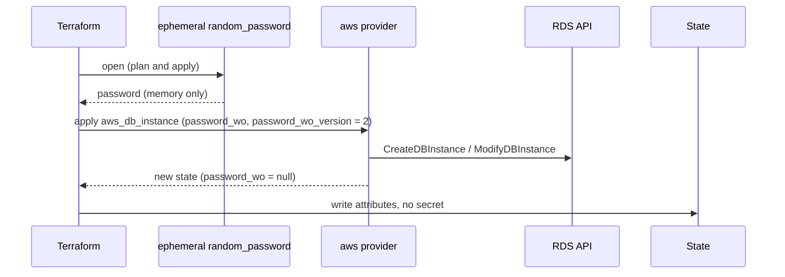
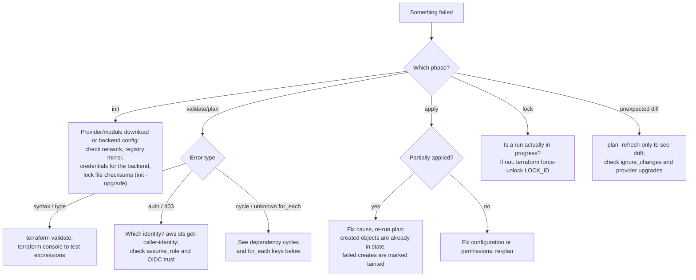

This page covers the parts of Terraform you need once the basics are routine. These are the configuration-driven refactoring blocks, the language features for generating and asserting configuration, and the newer features for keeping secrets out of state and working outside the create/read/update/delete (CRUD) model. It then gives a troubleshooting guide for common failures and a release history of Terraform and OpenTofu, current as of September 2026.

## Refactoring with configuration blocks

Early Terraform refactoring meant running `terraform state mv`, `terraform import`, and `terraform state rm` by hand, against production state, with no review. Terraform 1.1 through 1.7 replaced each of these commands with a block that goes through the normal plan, review, and apply cycle.

| Block | Replaces | Since | Effect |
|-------|----------|-------|--------|
| `moved` | `terraform state mv` | 1.1 | Renames an address in state; the plan shows "has moved to" instead of destroy/create |
| `import` | `terraform import` | 1.5 (`for_each` in 1.7; inside modules in 1.16) | Adopts an existing object into state during apply |
| `removed` | `terraform state rm` | 1.7 | Drops an object from state, optionally without destroying it |

```hcl
# Renamed a resource, or moved it into a module: no replacement
moved {
  from = aws_instance.web
  to   = module.web.aws_instance.this
}

# Adopt existing buckets; `plan -generate-config-out=generated.tf` writes starter config
import {
  for_each = toset(["legacy-logs", "legacy-assets"])
  to       = aws_s3_bucket.legacy[each.key]
  id       = each.key
}

# Stop managing a resource without deleting it
removed {
  from = aws_db_instance.old_reporting

  lifecycle {
    destroy = false
  }
}
```

Keep `moved` blocks in shared modules for at least one major version, so that every caller has a chance to apply them. Delete `import` blocks after they have been applied. Since 1.8, `moved` can also move state between *different* resource types when the provider supports it, for example from `aws_s3_bucket_object` to `aws_s3_object`.

To import at scale, Terraform 1.14 added **list resources** and `terraform query`. A `*.tfquery.hcl` file declares `list` blocks that ask a provider to enumerate existing objects, filtered by tags or other criteria. `terraform query -generate-config-out=FILE` then writes `import` blocks and matching resource configuration for everything it found. This removes the need to list IDs by hand.

## Generating configuration

### Dynamic blocks

`dynamic` generates repeated **nested blocks** (not resources) from a collection:

```hcl
variable "ingress_rules" {
  type = map(object({
    port        = number
    cidr_blocks = list(string)
  }))
}

resource "aws_security_group" "web" {
  name   = "web"
  vpc_id = var.vpc_id

  dynamic "ingress" {
    for_each = var.ingress_rules
    content {
      description = ingress.key
      from_port   = ingress.value.port
      to_port     = ingress.value.port
      protocol    = "tcp"
      cidr_blocks = ingress.value.cidr_blocks
    }
  }
}
```

Use `dynamic` only when the number of blocks really depends on input. A configuration made mostly of `dynamic` blocks is hard to read. That usually means the module is trying to wrap a provider resource one-to-one, and such a module adds little value. Where a provider offers separate resources for the repeated items, prefer them. For AWS security groups, `aws_vpc_security_group_ingress_rule` with `for_each` gives each rule its own address.

### Code generation around Terraform

When HCL's expressions stop being enough, teams generate Terraform instead of writing it:

- **Terragrunt** generates backend and provider blocks and wires the dependencies between stacks.
- **JSON configuration** (`*.tf.json`) is a complete alternative syntax for HCL. Any language can emit it.
- **Pulumi** or the AWS CDK replace HCL with a general-purpose language entirely. **CDK for Terraform** filled the same role for Terraform, but HashiCorp archived it on 10 December 2025.

Terraform 1.15 also allows variables and locals in module `source` and `version` arguments. Before 1.15, generating module sources was a common reason to add a wrapper tool at all. OpenTofu has supported this since 1.8 through early evaluation.

## Validating assumptions

| Mechanism | Evaluated | On failure |
|-----------|-----------|------------|
| `variable` `validation` | Plan, when the value is known | Error; the run stops |
| `precondition` / `postcondition` in `lifecycle` | Before or after the resource is planned or applied | Error; the run stops |
| `check` block with `assert` (and an optional scoped `data` source) | End of every plan and apply | **Warning** only |

`check` blocks describe health properties of the running system. They are useful because they run on every plan, including scheduled drift-detection runs:

```hcl
check "site_is_up" {
  data "http" "home" {
    url = "https://${aws_lb.app.dns_name}/healthz"
  }

  assert {
    condition     = data.http.home.status_code == 200
    error_message = "Health endpoint returned ${data.http.home.status_code}."
  }
}
```

## Ephemeral values and write-only arguments

Before 1.10, any value that passed through a resource argument, variable, or output ended up in plan files and state. Two features now let secrets flow through a configuration without being stored:

- **Ephemeral** (1.10): `ephemeral` resource blocks, plus variables and outputs marked `ephemeral = true`, produce values that exist only during a single run. They are opened fresh in each phase and never written to plan or state. An ephemeral value may only be used in ephemeral contexts: provider configuration, other ephemeral values, and write-only arguments.
- **Write-only arguments** (1.11): resource arguments, conventionally suffixed `_wo`, that the provider sends to the API but never stores. The provider cannot see whether the value has changed, so each write-only argument has a companion version argument (`_wo_version`). Incrementing the version triggers an update.



```hcl
ephemeral "random_password" "db" {
  length  = 32
  special = true
}

resource "aws_db_instance" "main" {
  identifier          = "app"
  engine              = "postgres"
  instance_class      = "db.t4g.medium"
  allocated_storage   = 50
  username            = "app_admin"
  password_wo         = ephemeral.random_password.db.result
  password_wo_version = 2 # bump to rotate
}
```

A generated ephemeral password is never stored, so nothing else can read it later. In practice, either write it to a secret store in the same run (for example through a secret resource's own write-only argument), or read it from one (`ephemeral "aws_secretsmanager_secret_version"`, or Vault's ephemeral resources). For RDS specifically, `manage_master_user_password = true` avoids handling the password at all.

Terraform 1.16 adds a `store` block on `terraform_data` for carrying ephemeral and sensitive values from plan to apply. OpenTofu added ephemeral values in 1.11.

## Actions

Terraform 1.14 introduced **actions**: operations defined by a provider that don't fit the CRUD model, such as invoking a Lambda function, creating a snapshot, or running an Ansible playbook. An action can be tied to a resource's lifecycle events or invoked on demand:

```hcl
action "aws_lambda_invoke" "warm_cache" {
  config {
    function_name = aws_lambda_function.cache_warmer.function_name
    payload       = jsonencode({ reason = "deploy" })
  }
}

resource "aws_ecs_service" "app" {
  # ...

  lifecycle {
    action_trigger {
      events  = [after_create, after_update]
      actions = [action.aws_lambda_invoke.warm_cache]
    }
  }
}
```

```bash
# Run just the action, excluding all other changes
terraform apply -invoke=action.aws_lambda_invoke.warm_cache
```

Actions do not change state. They replace most uses of `local-exec` provisioners and `null_resource` triggers for "do something after X" logic, and unlike those, they appear in the plan. Terraform 1.16 added `on_failure = halt | taint | continue` to action triggers. Actions are not available in OpenTofu.

## Troubleshooting



### State problems

Terraform has no transactions. An apply that fails partway leaves every successful operation recorded in state. Objects whose creation started but did not finish are marked **tainted** and will be replaced on the next apply. The fix is almost always to correct the cause and run `plan`/`apply` again, not to edit state.

| Situation | Response |
|-----------|----------|
| Lock left behind by a crashed run | Confirm no run is active, then `terraform force-unlock LOCK_ID` |
| Resource deleted outside Terraform | The next plan's refresh notices and proposes to recreate it; delete its configuration if it should stay gone |
| Resource created outside Terraform | `import` block (plus `-generate-config-out`) |
| Wrong address after a refactor | `moved` block |
| Object must be recreated even though its configuration is unchanged | `terraform apply -replace=ADDRESS` (the older `terraform taint` is deprecated) |
| Drift you want to accept into state | `terraform apply -refresh-only` (replaces the deprecated `terraform refresh`) |
| State corrupted or mangled | Restore a previous object version from the backend bucket (enable versioning), or `terraform state push` a backup taken with `state pull` |

The recommended S3 backend no longer needs a DynamoDB table. S3-native locking (`use_lockfile`, GA in 1.11) writes a `.tflock` object using S3 conditional writes. DynamoDB-based locking is deprecated and will be removed in a future minor version. OpenTofu has supported `use_lockfile` since 1.10.

```hcl
terraform {
  backend "s3" {
    bucket       = "acme-terraform-state"
    key          = "network/prod.tfstate"
    region       = "us-east-1"
    encrypt      = true
    use_lockfile = true
  }
}
```

To migrate, set both `use_lockfile = true` and the old `dynamodb_table` for one release cycle, so that locks are taken in both places, then remove `dynamodb_table`.

### Dependency cycles

Two resources that reference each other form a cycle. Security groups whose inline rules point at each other are the classic example:

```hcl
# Cycle: web references app, app references web
resource "aws_security_group" "web" {
  ingress {
    from_port       = 443
    to_port         = 443
    protocol        = "tcp"
    security_groups = [aws_security_group.app.id]
  }
}

resource "aws_security_group" "app" {
  egress {
    from_port       = 443
    to_port         = 443
    protocol        = "tcp"
    security_groups = [aws_security_group.web.id]
  }
}
```

To break the cycle, create the groups without rules and attach each rule as its own resource. The rules depend on both groups, but the groups no longer depend on each other:

```hcl
resource "aws_security_group" "web" {
  name   = "web"
  vpc_id = var.vpc_id
}

resource "aws_security_group" "app" {
  name   = "app"
  vpc_id = var.vpc_id
}

resource "aws_vpc_security_group_ingress_rule" "app_from_web" {
  security_group_id            = aws_security_group.app.id
  referenced_security_group_id = aws_security_group.web.id
  ip_protocol                  = "tcp"
  from_port                    = 443
  to_port                      = 443
}

resource "aws_vpc_security_group_egress_rule" "web_to_app" {
  security_group_id            = aws_security_group.web.id
  referenced_security_group_id = aws_security_group.app.id
  ip_protocol                  = "tcp"
  from_port                    = 443
  to_port                      = 443
}
```

The same approach works for IAM (roles and policy attachments), for routes (route tables and `aws_route`), and for any other case where a "container" resource and its "entries" can be managed separately. Don't mix inline rules and standalone rule resources on the same security group, because the two will fight over the rule set.

### Unknown values in `for_each` and `count`

`Invalid for_each argument ... The "for_each" map includes keys derived from resource attributes that cannot be determined until apply` means a key depends on something that doesn't exist yet. Build keys from input variables or static names, and put the unknown IDs only in the *values*:

```hcl
# Bad: keys are subnet IDs that are unknown until apply
for_each = toset(aws_subnet.private[*].id)

# Good: keys are known names; IDs are values
for_each = { for k, s in aws_subnet.private : k => s.id }
```

### Other frequent errors

| Symptom | Cause | Fix |
|---------|-------|-----|
| `Error: Inconsistent dependency lock file` | Constraints changed or the lock file is missing a platform | `terraform init -upgrade`, or `terraform providers lock` for every platform |
| `Provider produced inconsistent final plan` / `inconsistent result after apply` | A provider bug, usually with computed or normalized values | Upgrade the provider; report it with a `TF_LOG=trace` capture |
| Perpetual diff on every plan | The API normalizes the value (JSON policies, case, defaults) or another tool modifies it | Normalize with `jsonencode`, set the default explicitly, or `ignore_changes` |
| `BucketAlreadyExists` / name conflicts | Globally unique names | `bucket_prefix`, or append the account ID or region |
| Validation using `regex()` errors instead of failing cleanly | `regex` raises an error when it finds no match | Wrap it: `can(regex("^t3\\.", var.type))` |
| `Error acquiring the state lock` in CI | Two pipelines running the same stack | Serialize runs per stack; `-lock-timeout=5m` |

### Debugging tools

```bash
# Logging: TRACE, DEBUG, INFO, WARN, ERROR; split core vs provider logs
export TF_LOG=DEBUG
export TF_LOG_PROVIDER=TRACE
export TF_LOG_PATH=terraform-debug.log

# Evaluate expressions against real config and state
terraform console
> cidrsubnet("10.0.0.0/16", 8, 1)
"10.0.1.0/24"

# Machine-readable plan and state for jq / policy tools
terraform plan -out=tfplan && terraform show -json tfplan | jq '.resource_changes[] | select(.change.actions != ["no-op"]) | .address'
terraform state show -json aws_instance.web   # -json added in 1.16

# Dependency graph (DOT; render with Graphviz)
terraform graph | dot -Tsvg > graph.svg
```

## Release history

### Terraform

| Version | Released | Highlights |
|---------|----------|------------|
| 1.5 | June 2023 | `import` blocks with `-generate-config-out`; `check` blocks |
| 1.6 | October 2023 | `terraform test` GA; first release under BUSL 1.1 |
| 1.7 | January 2024 | Mock providers for tests; `removed` blocks; `for_each` in `import` |
| 1.8 | April 2024 | Provider-defined functions; `moved` between resource types |
| 1.9 | June 2024 | Validation rules may reference other variables and objects; `templatestring` function |
| 1.10 | November 2024 | Ephemeral resources, variables, and outputs; S3 backend native locking (preview) |
| 1.11 | February 2025 | Write-only arguments; S3 native locking GA (DynamoDB locking deprecated); `test -junit-xml` GA |
| 1.12 | May 2025 | OCI Object Storage backend |
| 1.13 | August 2025 | `terraform stacks` CLI command; test files must declare the external variables they use |
| 1.14 | November 2025 | Actions; list resources and `terraform query` |
| 1.15 | April 2026 | `deprecated` attribute on variables and outputs; variables and locals in module `source`/`version`; `convert` function; `validate` checks the backend block; S3 backend supports `aws login`; Windows ARM64 builds |
| 1.16 | August 2026 | `import` inside modules; `store` block on `terraform_data`; `lifecycle { destroy = false }`; action trigger `on_failure`; `-json` for `state show` and `workspace list`; Mermaid output from `terraform graph`; `console -scope` |

Terraform 1.17 was in beta in September 2026. Outside the CLI, HCP Terraform Stacks reached general availability, and HashiCorp publishes an official Terraform MCP server. The MCP server lets AI coding assistants query the registry and HCP Terraform workspaces, so that generated configuration is based on current provider schemas rather than on training data.

### OpenTofu

OpenTofu forked from Terraform 1.5 and has diverged since then. Features that first appeared in OpenTofu, or exist only there:

| Version | Released | Highlights |
|---------|----------|------------|
| 1.6 | January 2024 | First stable release; the OpenTofu registry; the test framework |
| 1.7 | April 2024 | Client-side state and plan encryption; provider-defined functions; `removed` blocks; loopable `import` |
| 1.8 | July 2024 | Early evaluation: variables and locals in backend config and module sources; `.tofu` files that override `.tf` for dual-tool modules |
| 1.9 | January 2025 | `for_each` on provider blocks; `-exclude` flag (the inverse of `-target`) |
| 1.10 | June 2025 | Providers and modules distributed through OCI registries; S3 native locking |
| 1.11 | December 2025 | Ephemeral values; `enabled` meta-argument as a clearer alternative to `count = cond ? 1 : 0` |
| 1.12 | May 2026 | `prevent_destroy` can reference variables; `destroy = false` lifecycle option; import by resource identity; faster, fully checksummed provider installs |
| 1.13 | release candidate, September 2026 | Built-in linting (experimental); `convert` function; Windows ARM64; WinRM provisioner connection removed |

### Provider major versions

Large providers ship breaking changes only in major releases, roughly yearly. Read the upgrade guide before raising a `~>` constraint:

| Provider | Latest major (Sept 2026) | Notable change in that major |
|----------|--------------------------|------------------------------|
| `hashicorp/aws` | 6.x (6.0 in June 2025) | Per-resource `region` argument, which removes most per-region provider aliases |
| `hashicorp/azurerm` | 5.x | See the provider's 5.0 upgrade guide |
| `hashicorp/google` | 8.x | See the provider's 8.0 upgrade guide |

## Further reading

- Kief Morris, *Infrastructure as Code: Dynamic Systems for the Cloud Age* (O'Reilly)
- Yevgeniy Brikman, *Terraform: Up & Running* (3rd edition, O'Reilly, 2022)
- Terraform language documentation and per-version upgrade guides: developer.hashicorp.com/terraform
- OpenTofu documentation and "What's new" pages: opentofu.org/docs

## See Also

- [Core Concepts](core-concepts.html): workflow, plan actions, meta-arguments
- [State & Modules](state-modules.html): backends, state commands, module design
- [Enterprise Patterns](patterns.html): stack layout, CI/CD, policy, testing
- [AWS Infrastructure as Code](../aws/iac.html): CloudFormation and CDK
- [CI/CD](../ci-cd/): running infrastructure changes from pipelines
- [Distributed Systems](../../distributed-systems/): consistency and locking concepts behind remote state
