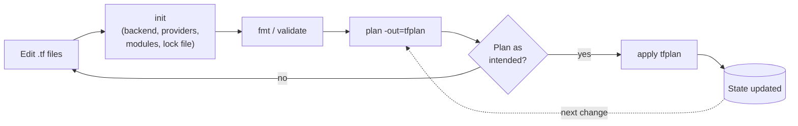
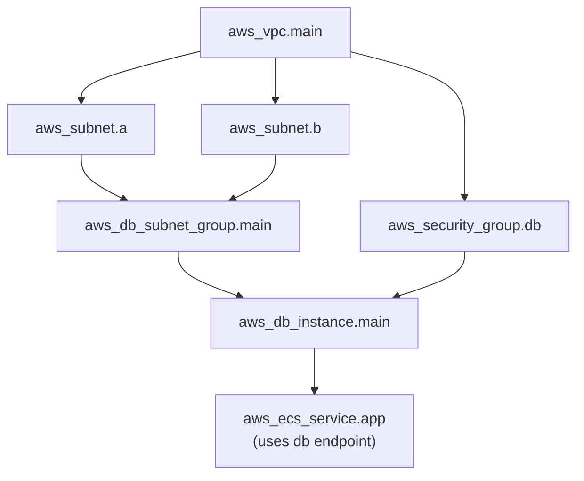

This page covers the ideas the rest of the Terraform section builds on. It explains how a configuration is structured, what `init`, `plan`, and `apply` actually do, how Terraform orders operations, how providers are installed and pinned, and the language features used in almost every configuration: meta-arguments, variables, locals, and expressions. Examples target Terraform 1.16 and AWS provider 6.x. Unless a note says otherwise, they also work unchanged with OpenTofu (`tofu` in place of `terraform`).

## Installation

Terraform is a single static binary. Install it from HashiCorp's package repositories or releases page, or use a version manager such as `tfenv` or `mise` so that each repository can pin its own version. Commit the pin to the repository, for example in a `.terraform-version` file or `mise.toml`.

```bash
terraform version
# Terraform v1.16.3
# on linux_arm64
```

For editing, the official HashiCorp Terraform extension for VS Code, or `terraform-ls` in any editor that speaks the Language Server Protocol, gives completion, validation, and go-to-definition.

## Declarative configuration

Terraform is **declarative**. You write down the end state you want, not the steps to reach it.

| Imperative script | Terraform configuration |
|-------------------|-------------------------|
| "Create a VPC, then a subnet, then an instance; if the subnet exists, skip it..." | "There is a VPC, a subnet in it, and an instance in the subnet" |
| You choose the order | Terraform works out the order from references |
| A re-run may create duplicates unless every step checks first | Re-running is idempotent: no change means an empty plan |
| After a partial failure, only the script's logs record what happened | State records exactly which objects were created |

The price of this model is that Terraform only knows about objects recorded in its state. Anything created outside Terraform is invisible to it until you import it, and changes made outside Terraform show up as **drift**.

## Configuration structure

A **root module** is the directory you run Terraform in. Terraform loads every `*.tf` file in that directory as a single configuration. File names don't affect behavior. By convention, code is split into `main.tf`, `variables.tf`, `outputs.tf`, `providers.tf` (or `versions.tf`), plus files named after what they contain (`network.tf`, `iam.tf`, and so on). Subdirectories are not loaded automatically. They become **modules** only when a `module` block calls them.

HCL is built from **blocks** (a type, zero or more labels, and a body), **arguments** (`name = expression`), and **expressions**. The block types you will meet:

| Block | Purpose |
|-------|---------|
| `terraform { }` | Settings for Terraform itself: required version, required providers, backend |
| `provider "aws" { }` | Configures a provider (region, credentials, default tags) |
| `resource "type" "name" { }` | An infrastructure object Terraform creates and manages |
| `data "type" "name" { }` | A read-only lookup of something that already exists |
| `ephemeral "type" "name" { }` | A short-lived value (such as a token or generated password) that is never written to plan or state (1.10+) |
| `variable "name" { }` | An input to the module |
| `locals { }` | Named intermediate values |
| `output "name" { }` | A value exposed to the caller or CLI |
| `module "name" { }` | Calls a child module |
| `moved`, `import`, `removed` | Refactor, adopt, or forget objects through code review (see [Advanced Topics](advanced.html)) |
| `check "name" { }` | Assertions that warn without blocking the apply |

Every resource has an **address**, `<type>.<name>`, such as `aws_s3_bucket.logs`. Resources inside modules or loops get extra parts: `module.net.aws_subnet.private["a"]`. Addresses are how you refer to objects in expressions, in the CLI (`terraform state show ADDRESS`), and in the plan output.

### A minimal configuration

```hcl
terraform {
  required_version = ">= 1.10"

  required_providers {
    aws = {
      source  = "hashicorp/aws"
      version = "~> 6.0"
    }
  }
}

provider "aws" {
  region = "us-east-1" # credentials come from the environment, never from this file

  default_tags {
    tags = { ManagedBy = "terraform" }
  }
}

resource "aws_s3_bucket" "logs" {
  bucket_prefix = "app-logs-" # AWS appends a unique suffix; bucket names are global
}

resource "aws_s3_bucket_versioning" "logs" {
  bucket = aws_s3_bucket.logs.id # reference: creates an implicit dependency

  versioning_configuration {
    status = "Enabled"
  }
}
```

Since AWS provider v4, S3 bucket settings such as versioning, encryption, lifecycle rules, and policy are separate resources. They are no longer nested blocks inside `aws_s3_bucket`. Many large providers have been reorganized the same way, so each resource maps to a single API object.

## The core workflow

| Command | What it does |
|---------|--------------|
| `terraform init` | Configures the backend, downloads providers and modules into `.terraform/`, and writes or verifies `.terraform.lock.hcl`. Safe to re-run; run it again after changing providers, modules, or the backend. |
| `terraform fmt` | Rewrites files to canonical style (`-check -recursive` in CI) |
| `terraform validate` | Checks syntax, types, and references without calling any cloud API |
| `terraform plan` | Refreshes state and computes the proposed changes. `-out=tfplan` saves the plan so that exactly this plan can be applied later. |
| `terraform apply` | Executes a plan: a freshly computed one after a confirmation prompt, or a saved `tfplan` with no prompt |
| `terraform destroy` | Plans and applies the deletion of everything in state (the same as `apply -destroy`) |



In automation, always use a saved plan: `plan -out=tfplan` in one step and `apply tfplan` in a later one. Terraform refuses to apply a saved plan if state has changed since the plan was made, so the change a reviewer approved is exactly the change that runs.

## How a plan is computed

`terraform plan` runs in three phases:

1. **Refresh.** For every resource in state, the provider reads the real object and Terraform updates its in-memory copy of state. This is how out-of-band changes (drift) are found.
2. **Diff.** For every resource in configuration, Terraform compares the configured arguments with the refreshed state. The provider decides whether each difference can be applied in place or needs the object replaced. For example, changing an EC2 instance's `ami` forces replacement, while changing `instance_type` is an in-place update that stops and starts the instance.
3. **Order.** The resulting actions are placed on the dependency graph.

Each resource ends up with one action:

| Symbol | Action | Meaning |
|--------|--------|---------|
| `+` | create | In configuration, not in state |
| `~` | update in-place | Exists; some arguments differ and can be changed on the live object |
| `-/+` | replace (destroy first) | A change that forces a new object; the old object is deleted before the new one is created |
| `+/-` | replace (create first) | As above, with `create_before_destroy = true` |
| `-` | destroy | In state, no longer in configuration |
| `<=` | read | A data source that can only be read during apply because it depends on unknown values |
| (none) | no-op | Nothing to do |

Values that won't be known until apply, such as an ID assigned by the cloud, appear as `(known after apply)`. Two related modes:

- `terraform plan -refresh-only` shows drift only and proposes updating state to match reality without touching infrastructure. It replaces the deprecated `terraform refresh` command.
- `terraform plan -refresh=false` skips the refresh phase. It is faster, but it cannot see drift.

## The dependency graph

Terraform builds a directed acyclic graph (DAG) of resources, data sources, and modules. A reference such as `aws_subnet.app.id` adds an edge automatically. When a dependency can't be expressed as a reference, for example an IAM policy that must exist before a Lambda function is invoked, `depends_on` adds the edge explicitly.



In this graph an arrow means "must exist first." On `apply`, Terraform walks the graph and runs any operations whose dependencies are complete, up to 10 at a time by default (`-parallelism=N`). The two subnets and the security group are created concurrently. On `destroy`, the graph is walked in reverse. A cycle, such as two security groups whose inline rules reference each other, is an error at plan time. [Advanced Topics](advanced.html#dependency-cycles) shows how to fix one.

`terraform graph` prints the graph in DOT format for Graphviz. Terraform 1.16 can also produce Mermaid output.

## Providers

A provider is a plugin binary that implements resources, data sources, and, in newer protocol versions, ephemeral resources, functions, list resources, and actions for one API. Terraform starts the provider as a subprocess during each run and communicates with it over gRPC.

### Source addresses and version constraints

Each provider is identified by a **source address** in the form `[hostname/]namespace/type`. The hostname defaults to the public registry, so `hashicorp/aws` means `registry.terraform.io/hashicorp/aws` (or `registry.opentofu.org/hashicorp/aws` under OpenTofu). Version constraints use these operators:

| Constraint | Allows | Typical use |
|------------|--------|-------------|
| `"= 6.12.0"` | Exactly that version | Rarely needed; the lock file already pins exact versions |
| `"~> 6.0"` | `>= 6.0, < 7.0` | Root modules: accept minor releases, block the next major release |
| `"~> 6.12.0"` | `>= 6.12.0, < 6.13.0` | Patch releases only |
| `">= 5.0, < 7.0"` | A range | Reusable modules: declare the widest range you actually test |

Reusable modules should declare minimum versions. The root module decides the exact version.

### The dependency lock file

`terraform init` records the exact version and package checksums of every selected provider in `.terraform.lock.hcl`. **Commit this file.** It makes every machine and CI runner install byte-for-byte the same provider. `terraform init -upgrade` moves providers to the newest version the constraints allow. If your team uses several operating systems, run `terraform providers lock -platform=linux_amd64 -platform=linux_arm64 -platform=darwin_arm64` so the lock file holds checksums for every platform.

### Configuration, aliases, and authentication

```hcl
provider "aws" {
  region = "us-east-1"
}

# A second configuration of the same provider, selected with `provider = aws.replica`
provider "aws" {
  alias  = "replica"
  region = "eu-west-1"

  assume_role {
    role_arn = "arn:aws:iam::111122223333:role/terraform-deployer"
  }
}

resource "aws_s3_bucket" "replica" {
  provider      = aws.replica
  bucket_prefix = "replica-"
}
```

AWS provider 6.0 (June 2025) added a per-resource `region` argument to most AWS resources. Placing the same account's resources in several regions no longer needs one alias per region: `region = "eu-west-1"` on the resource is enough. Aliases are still the way to target a different account or role.

Never put credentials in `.tf` files. They end up in version control and often in state. Preferred sources, from best to worst:

| Source | Where it fits |
|--------|---------------|
| Workload identity / OIDC federation (GitHub Actions, GitLab, HCP Terraform dynamic credentials) | CI/CD: short-lived credentials, no stored secret |
| Instance or pod roles (EC2 instance profile, EKS Pod Identity, GKE/AKS workload identity) | Runners inside the cloud |
| SSO / CLI login sessions (`aws sso login`, `gcloud auth application-default login`, `az login`) | Engineers' workstations |
| Static access keys in environment variables | Last resort; rotate them and scope them tightly |

## Resources and data sources

A `resource` block means Terraform owns the object's lifecycle. A `data` block reads something Terraform does not manage, such as an AMI ID, an existing VPC, or the current account ID, and makes its attributes available to other blocks:

```hcl
data "aws_ami" "al2023" {
  most_recent = true
  owners      = ["amazon"]

  filter {
    name   = "name"
    values = ["al2023-ami-*-x86_64"]
  }
}

resource "aws_instance" "web" {
  ami           = data.aws_ami.al2023.id
  instance_type = "t3.micro"
}
```

Data sources are read during plan whenever their arguments are known. If an argument depends on a value that won't exist until apply, the read is deferred to apply time (`<=` in the plan).

## Meta-arguments

Meta-arguments are handled by Terraform itself, not by the provider, and work on every resource type.

### `count` and `for_each`

Both create several instances from one block. The difference is how instances are addressed:

| | `count = N` | `for_each = map or set` |
|---|---|---|
| Instance address | `aws_subnet.private[0]` | `aws_subnet.private["us-east-1a"]` |
| Removing a middle element | Shifts every later index, so those instances are replaced | Affects only that key |
| Best for | "0 or 1" toggles (`count = var.enabled ? 1 : 0`), identical copies | Almost everything else |

```hcl
variable "subnets" {
  type = map(object({ cidr = string, az = string }))
}

resource "aws_subnet" "private" {
  for_each = var.subnets

  vpc_id            = aws_vpc.main.id
  cidr_block        = each.value.cidr
  availability_zone = each.value.az
  tags              = { Name = "private-${each.key}" }
}
```

`for_each` keys must be known at plan time. A key computed from another resource's ID fails with "Invalid for_each argument". Build keys from input values instead.

### `depends_on` and `provider`

`depends_on = [aws_iam_role_policy.x]` adds a dependency edge that isn't visible from references. Use it sparingly, because it makes Terraform treat more values as unknown during planning. `provider = aws.replica` selects an aliased provider configuration.

### `lifecycle`

```hcl
resource "aws_lb_target_group" "app" {
  # ...

  lifecycle {
    create_before_destroy = true
    prevent_destroy       = false
    ignore_changes        = [tags["LastDeployedBy"]]
    replace_triggered_by  = [terraform_data.app_version]

    precondition {
      condition     = var.port > 1024
      error_message = "Application ports must be unprivileged."
    }
  }
}
```

| Option | Effect | Typical use |
|--------|--------|-------------|
| `create_before_destroy` | On replacement, build the new object before deleting the old one | Load balancers, certificates, launch templates; anything that must not have a gap |
| `prevent_destroy` | Any plan that would destroy the object fails | Production databases and buckets holding data |
| `ignore_changes` | Ignore differences in the listed attributes (or `all`) | Attributes changed by autoscalers or external tools |
| `replace_triggered_by` | Replace this resource when a referenced resource or attribute changes | Recreate instances when a config artifact changes |
| `precondition` / `postcondition` | Assertions checked before and after the object is planned or applied; a failure stops the run | Guarding assumptions about inputs or data-source results |
| `destroy = false` | Removing the resource from configuration forgets it (drops it from state) instead of deleting it | Handing an object over to another tool or stack (Terraform 1.16, OpenTofu 1.12) |

`prevent_destroy` only protects an object while its block stays in configuration. If you delete the block, the protection goes with it. Rely on provider-level safeguards such as `deletion_protection` on databases as well.

## Variables, locals, and outputs

### Input variables

```hcl
variable "environment" {
  type        = string
  description = "Deployment environment."

  validation {
    condition     = contains(["dev", "staging", "prod"], var.environment)
    error_message = "environment must be dev, staging, or prod."
  }
}

variable "instance_type" {
  type    = string
  default = "t3.micro"

  validation {
    # Since 1.9, validation may reference other variables and objects
    condition     = var.environment == "prod" || startswith(var.instance_type, "t3.")
    error_message = "Non-production environments are limited to t3 instance types."
  }
}

variable "db_password" {
  type      = string
  sensitive = true # redacted in CLI output; still stored in state unless used only with ephemeral / write-only arguments
  ephemeral = true # 1.10+: never written to plan or state
}
```

Types are `string`, `number`, `bool`, and the collection and structural types `list(T)`, `set(T)`, `map(T)`, `object({...})`, and `tuple([...])`. `object` attributes can be marked `optional(type, default)`, so callers need to pass only the fields they care about.

### Where variable values come from

Terraform loads values in this order, and a later source overrides an earlier one:

1. `default` in the `variable` block
2. `TF_VAR_<name>` environment variables
3. `terraform.tfvars`, then `terraform.tfvars.json`
4. `*.auto.tfvars` and `*.auto.tfvars.json`, in lexical filename order
5. `-var` and `-var-file` options, in the order they appear on the command line

A variable with no default and no value is required. Terraform prompts for it interactively, or fails when run with `-input=false`, which is what CI should use.

### Locals and outputs

`locals` name intermediate expressions so they are written once. `output` blocks expose values to the CLI (`terraform output -json`) and to calling modules. Outputs can be marked `sensitive` or `ephemeral`. See [State & Modules](state-modules.html#outputs-and-sharing-data-between-configurations) for how outputs are shared between configurations.

```hcl
locals {
  name_prefix = "${var.project}-${var.environment}"
  common_tags = { Project = var.project, Environment = var.environment }
}

output "bucket_arn" {
  value       = aws_s3_bucket.logs.arn
  description = "ARN of the log bucket."
}
```

## Expressions and functions

HCL expressions cover most of what configuration needs without a general-purpose language:

| Feature | Example |
|---------|---------|
| Interpolation and templates | `"${local.name_prefix}-web"`, `templatefile("user_data.sh.tftpl", { port = 8080 })` |
| Conditional | `var.environment == "prod" ? 3 : 1` |
| `for` expression | `{ for s in aws_subnet.private : s.availability_zone => s.id }` |
| Splat | `aws_instance.web[*].private_ip` |
| Safe navigation | `try(var.settings.logging.level, "info")`, `can(regex("^t3\\.", var.type))` |
| Type conversion | `tolist(...)`, `tomap(...)`, and in 1.15+ `convert(value, type)` |
| Provider-defined functions (1.8+) | `provider::aws::arn_parse(var.role_arn).account_id` |

`terraform console` opens a REPL against the current configuration and state. It is the fastest way to test an expression before committing it.

## Common mistakes

- **Applying without reading the plan.** Most unintended deletions are visible in the plan as a `-` or `-/+` that nobody read. Pay special attention to replacements of stateful resources.
- **Not committing `.terraform.lock.hcl`, or committing `.terraform/`.** The lock file belongs in version control. The `.terraform/` plugin cache and `*.tfstate` files do not.
- **Unbounded provider constraints in root modules.** Without `~>` the next major provider release is picked up by the first `init -upgrade`, and major releases (AWS v5 to v6, for example) contain breaking changes.
- **Secrets in configuration or state.** `sensitive = true` hides a value in output but does not keep it out of state. Use ephemeral values and write-only arguments, or let the platform generate and store the secret. Treat the state backend as sensitive in any case.
- **Using `count` for collections.** Removing one element from a `count`-based list reshuffles indexes and replaces unrelated instances. Use `for_each` with stable keys.

## See Also

- [State & Modules](state-modules.html): remote state, locking, workspaces, and reusable modules
- [Enterprise Patterns](patterns.html): layout, CI/CD, policy, and testing at team scale
- [Advanced Topics](advanced.html): refactoring blocks, ephemeral values, actions, troubleshooting
- [AWS Cloud Services](../aws/): the most common deployment target
- [Kubernetes](../kubernetes/): provisioning clusters and workloads as code
