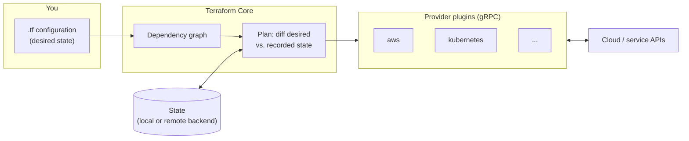

<div class="hero-section" style="background: linear-gradient(135deg, #5c4ee5 0%, #844fba 100%); color: white; padding: 1.5rem 2rem; margin: -2rem -3rem 2rem -3rem; text-align: center;">
  <h1 style="color: white; margin: 0; font-size: 2rem;">Terraform</h1>
  <p style="margin-top: 0.5rem; opacity: 0.9;">Infrastructure as Code: theory and practice</p>
</div>

**Terraform** is a declarative infrastructure-as-code (IaC) tool created by HashiCorp (an IBM company since February 2025). You describe the infrastructure you want (networks, virtual machines, DNS records, Kubernetes objects, SaaS settings) in the HashiCorp Configuration Language (HCL). Terraform then works out which API calls will move the real world to that description, shows you the plan, and carries it out. **OpenTofu** is a community fork, started in 2023, that uses the same language and workflow. Nearly everything in this section applies to both.

As of September 2026 the current releases are Terraform **1.16** (1.17 in beta) and OpenTofu **1.12** (1.13 in release candidate).

## How Terraform works

Terraform itself is a fairly small program. It reads configuration, builds a dependency graph, and compares the result with a **state** file that records what it manages. It then asks **provider** plugins to make any changes. Providers are separate binaries that Terraform talks to over gRPC. Each one wraps one API (AWS, Azure, Google Cloud, Kubernetes, GitHub, Cloudflare, and several thousand more on the public registry).



This split explains a lot of how Terraform behaves. The core knows nothing about any cloud. It knows about graphs, types, and state. Everything specific to a service lives in a provider, which is released and versioned separately from Terraform.

## Pages in this section

| Page | Covers |
|------|--------|
| [Core Concepts](core-concepts.html) | Installation, HCL blocks, the `init` / `plan` / `apply` workflow, how plans are computed, the dependency graph, providers and the lock file, meta-arguments (`count`, `for_each`, `lifecycle`), variables, and expressions |
| [State & Modules](state-modules.html) | What state records, remote backends and locking, state commands, workspaces, outputs, and writing and consuming modules |
| [Enterprise Patterns](patterns.html) | Stack layout and blast radius, cross-stack data, multi-account and multi-region setups, CI/CD pipelines, policy as code, security scanning, testing, and reference architectures |
| [Advanced Topics](advanced.html) | Refactoring blocks (`moved`, `import`, `removed`), dynamic blocks, checks, ephemeral and write-only values, actions and `terraform query`, troubleshooting, and the Terraform/OpenTofu release history |

Suggested reading order: Core Concepts, then State & Modules. The other two pages can be read in any order after that.

## Why infrastructure as code

| Without IaC | With Terraform |
|-------------|----------------|
| Settings live in consoles and people's memory | Settings live in version-controlled files |
| Changes are made first and explained later, if at all | Changes are proposed as a diff (`plan`) and reviewed before they run |
| Environments drift apart over time | Dev, staging, and production come from the same modules with different inputs |
| Disaster recovery means rebuilding by hand | Environments can be recreated from code (data still needs its own backups) |
| Drift is discovered during an outage | A scheduled `plan` finds drift |

Terraform is not a configuration-management tool. It provisions and configures resources through their APIs, but it does not manage packages or files inside a running machine. That job belongs to image builders (Packer), cloud-init, Ansible, or container images.

## Terraform vs. OpenTofu

In August 2023 HashiCorp moved Terraform from the Mozilla Public License (MPL 2.0) to the Business Source License (BUSL 1.1), starting with version 1.6. A group of vendors and community members forked the last MPL release, 1.5.x, as OpenTofu. OpenTofu is a Linux Foundation project and was accepted into the CNCF Sandbox in April 2025.

| Aspect | Terraform | OpenTofu |
|--------|-----------|----------|
| License | BUSL 1.1 (source-available; restricts competing hosted offerings) | MPL 2.0 (open source) |
| Steward | HashiCorp / IBM | Linux Foundation (CNCF Sandbox) |
| CLI | `terraform` | `tofu` |
| Registry | registry.terraform.io | registry.opentofu.org (mirrors most public providers and modules); also OCI registries |
| Managed service | HCP Terraform, Terraform Enterprise | Third-party platforms (Spacelift, env0, Scalr, Harness, and others) |
| Features only in this tool | Stacks (HCP Terraform), actions, `terraform query`, `store` block | Client-side state encryption, `enabled` meta-argument, provider `for_each`, `-exclude`, `.tofu` override files |

Both tools read the same `.tf` files and the same provider protocol, so a module that uses only shared features runs on either one. The two languages have been drifting apart since about 2024. Each project now ships blocks and flags the other does not understand. Pick one tool for each code base and use features exclusive to that tool on purpose. [Advanced Topics](advanced.html) lists the per-release differences.

```bash
# Terraform: official packages, or a version manager such as tfenv / mise
terraform version

# OpenTofu: official installer script (also packaged for Homebrew, apt, etc.)
curl -fsSL https://get.opentofu.org/install-opentofu.sh | sh -s -- --install-method standalone
tofu version
```

## Alternatives

| Tool | Model | Notes |
|------|-------|-------|
| Pulumi | General-purpose languages (TypeScript, Python, Go, C#, Java) | Similar engine (desired state + state file); can use Terraform providers through a bridge |
| AWS CloudFormation / AWS CDK | AWS-native templates; CDK compiles code to CloudFormation | AWS stores the state for you; covers only AWS. See [AWS Infrastructure as Code](../aws/iac.html) |
| Crossplane | Kubernetes controllers reconcile cloud resources continuously | Suits teams that already run everything through the Kubernetes API |
| CDK for Terraform (CDKTF) | Code-generated Terraform JSON | Archived by HashiCorp on 10 December 2025; not recommended for new work |

## See Also

- [AWS Cloud Services](../aws/): the most common Terraform target
- [AWS Infrastructure as Code](../aws/iac.html): CloudFormation and CDK compared with Terraform
- [Kubernetes](../kubernetes/): container orchestration, often provisioned with Terraform
- [Docker](../docker/): container fundamentals
- [CI/CD](../ci-cd/): running `plan` and `apply` from pipelines
