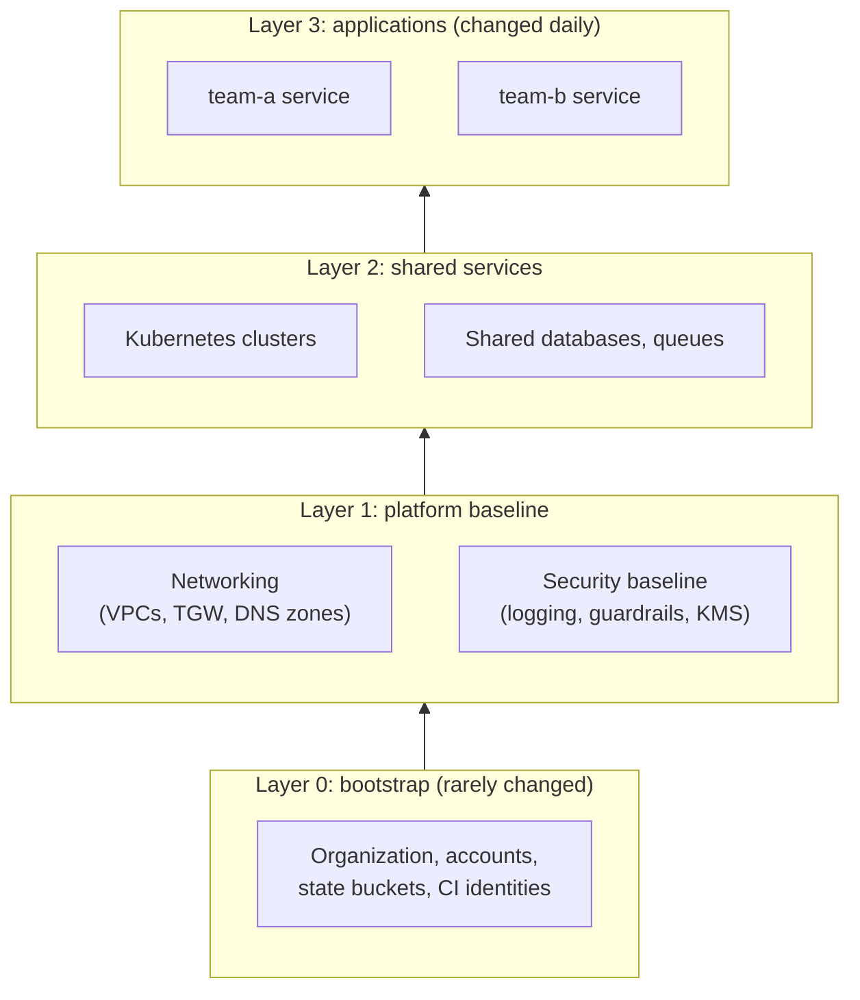
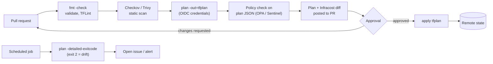

Terraform that one engineer runs from a laptop needs almost no structure. Terraform that dozens of teams run against hundreds of accounts needs a lot. This page covers the patterns that have held up at that scale. It explains how to split configuration into stacks and share data between them, how to organize accounts and regions, how to run plans and applies safely from CI, how to enforce policy, and how to test modules. It ends with short reference architectures that combine these patterns. [State & Modules](state-modules.html) is assumed background.

## Splitting configuration into stacks

A **stack** (also called a root module or workspace) is one unit of `plan`/`apply` with its own state. How you draw stack boundaries is the most consequential design decision in a Terraform estate:

- **Blast radius.** A single apply can only damage what is in that stack's state.
- **Speed.** Plan time grows with the number of resources that have to be refreshed. A stack of a few hundred resources plans in seconds. A stack of several thousand can take tens of minutes and runs into API rate limits.
- **Ownership.** One stack should have one owning team and one approval path.
- **Rate of change.** Keep things that change daily, such as application services, apart from things that change yearly, such as the account baseline and core networking.

A common arrangement is a set of **layers**, where each layer consumes outputs from the layers below it:



### Directories, workspaces, or an orchestrator

| Approach | How environments differ | Good for | Watch out for |
|----------|------------------------|----------|---------------|
| Directory per environment (`envs/prod/`, `envs/dev/`) calling shared modules | Separate root modules with their own backend config and `.tfvars` | Most teams; explicit and easy to review | Boilerplate that is copied between directories |
| CLI workspaces (`terraform workspace select prod`) | Same code, one state per workspace | Short-lived, near-identical copies (feature environments) | Environments that must differ in structure; easy to apply to the wrong workspace |
| Terragrunt | A thin wrapper that generates backend and provider config and runs many stacks in dependency order | Large multi-account estates that want DRY configuration | An extra tool and file format to learn |
| HCP Terraform Stacks | `.tfcomponent.hcl` and `.tfdeploy.hcl` files describe components and their deployments (GA, HCP Terraform only) | Organizations already on HCP Terraform | Not available in the open-source CLI or OpenTofu |

### Sharing data between stacks

Higher layers need IDs from lower ones, such as a VPC ID or subnet IDs. The options, from loosest to tightest coupling:

| Mechanism | Coupling | Notes |
|-----------|----------|-------|
| Plain data sources (`data "aws_vpc"` filtered by tag) | Lowest | The consumer needs no access to the producer's state, only a naming or tagging convention |
| A parameter store (SSM Parameter Store, Consul, a key-value store) written by the producer | Low | Explicit published contract; readable by non-Terraform tools too |
| `tfe_outputs` data source (HCP Terraform) | Medium | Reads only outputs, not full state |
| `terraform_remote_state` | Highest | Needs read access to the producer's **entire** state, including any secrets in it |

Prefer the first two for anything that crosses a team boundary.

## Multi-account and multi-region

Large AWS estates use AWS Organizations, typically managed with Control Tower or Account Factory for Terraform (AFT). Accounts are grouped into organizational units by purpose: security and log archive, shared networking, workload accounts per environment, and sandboxes. Terraform runs in a central CI account and **assumes a deployment role** in each target account, so no long-lived keys exist in workload accounts.

```hcl
variable "target_account_id" { type = string }

provider "aws" {
  region = "us-east-1"

  assume_role {
    role_arn     = "arn:aws:iam::${var.target_account_id}:role/terraform-deployer"
    session_name = "terraform-ci"
  }
}
```

For multiple regions within one account, AWS provider 6.x accepts a `region` argument on most resources, so a single provider block can serve every region:

```hcl
variable "regions" {
  type    = set(string)
  default = ["us-east-1", "eu-west-1"]
}

resource "aws_s3_bucket" "regional_artifacts" {
  for_each      = var.regions
  region        = each.key
  bucket_prefix = "artifacts-${each.key}-"
}
```

Before provider 6.0 (and still, when every region needs a different account or role), each region required its own aliased `provider` block. Every module call also had to pass the right alias explicitly, because Terraform does not allow `for_each` over provider configurations. OpenTofu 1.9+ does allow `for_each` on provider blocks.

## Module governance

| Practice | Why |
|----------|-----|
| Publish modules to a private registry or tag them in Git (`?ref=v3.2.0`) and pin callers to a version | Consumers upgrade deliberately, not by accident |
| Follow semantic versioning; a breaking input or output change is a major release | Callers can use `~> 3.2` safely |
| Mark retiring inputs and outputs with `deprecated = "..."` (Terraform 1.15+) | Callers get a warning before the next major version removes them |
| Use `moved` blocks when renaming resources inside a module | A module upgrade doesn't force callers to destroy and recreate |
| Generate docs with `terraform-docs`; keep an `examples/` directory | Makes self-service possible |
| Put `terraform test` suites in `tests/` and run them in CI | Every release is checked the same way |
| Keep modules small and composable (network, cluster, service) rather than one "platform" module | Easier to test, version, and reason about |

## CI/CD workflow

Production applies should happen only from a pipeline, never from a laptop. The standard flow, sometimes called *GitOps for infrastructure*, runs `plan` on the pull request and `apply` of that same saved plan after approval:



Practices that make this safe:

- **Short-lived credentials.** The runner authenticates with OIDC federation (for example GitHub Actions to an AWS IAM role, or HCP Terraform dynamic credentials). Give the plan job a read-only role and the apply job a write role gated by environment protection rules.
- **Apply exactly what was reviewed.** Store the binary `tfplan` as a pipeline artifact and apply that file. If state changed in between, Terraform rejects the stale plan and the pipeline must re-plan.
- **One run per stack at a time.** State locking prevents corruption, but the pipeline should also queue runs per stack, so that two merged PRs don't race each other.
- **Drift detection.** A nightly `terraform plan -detailed-exitcode` returns exit code 0 for no changes, 1 for an error, and 2 when changes are present. Exit code 2 on an unchanged `main` branch means drift.
- **`-input=false` and `-lock-timeout=5m`** in every automated command.

Tools that implement this loop include Atlantis (self-hosted, driven by PR comments), HCP Terraform and Terraform Enterprise, commercial platforms (Spacelift, env0, Scalr), and plain GitHub Actions or GitLab CI jobs. For generic pipeline design see [CI/CD Platforms and Pipelines](../ci-cd/platforms-and-pipelines.html).

## Policy as code

Static scanners check the source. Policy engines check the **plan**, which has resolved values, module expansions, and the actual actions (create, delete, replace). `terraform show -json tfplan` produces a machine-readable plan that any policy engine can read.

| Engine | Where it runs | Language |
|--------|---------------|----------|
| Sentinel | HCP Terraform / Terraform Enterprise policy sets | Sentinel |
| OPA | HCP Terraform policy sets, Spacelift, env0, or any CI via `conftest` | Rego |
| Checkov / Trivy custom policies | CI, on source or plan JSON | Python/YAML, Rego |

A Rego policy for `conftest` that rejects deleting any RDS instance and requires a `CostCenter` tag on every new resource:

```rego
package terraform.plan

import rego.v1

deny contains msg if {
  rc := input.resource_changes[_]
  rc.type == "aws_db_instance"
  "delete" in rc.change.actions
  msg := sprintf("%s would be deleted; database deletions need a break-glass change", [rc.address])
}

deny contains msg if {
  rc := input.resource_changes[_]
  "create" in rc.change.actions
  "tags" in object.keys(rc.change.after) # the resource type supports tags
  not rc.change.after.tags.CostCenter
  msg := sprintf("%s is missing the CostCenter tag", [rc.address])
}
```

```bash
terraform plan -out=tfplan
terraform show -json tfplan > plan.json
conftest test plan.json --policy policy/
```

Guardrails that exist outside Terraform, such as AWS Service Control Policies, Azure Policy, and GCP organization policies, remain the final line of defense. Policy checks in CI can be bypassed by anyone who can run Terraform some other way.

## Security

### Scanning and linting

| Tool | Checks | Command |
|------|--------|---------|
| `terraform validate` | Syntax, types, references | `terraform validate` |
| TFLint | Provider-aware lint rules: invalid instance types, deprecated syntax, naming | `tflint --recursive` |
| Checkov | Hundreds of misconfiguration and compliance rules (CIS, PCI, HIPAA mappings) | `checkov -d .` |
| Trivy | Misconfiguration scanning; the successor to tfsec, which Aqua Security has moved into Trivy | `trivy config .` |
| Infracost | Monthly cost of the change, as a PR comment | `infracost diff --path .` |

### Secrets and state

State contains every attribute of every managed resource. That includes generated passwords, private keys created with the `tls` provider, and database connection strings. Controls, in order of importance:

1. **Keep secrets out of state.** Terraform 1.10 introduced *ephemeral* values and 1.11 introduced *write-only* arguments. Together they let a secret flow from a generator or vault into a resource without being persisted anywhere (example in [Advanced Topics](advanced.html#ephemeral-values-and-write-only-arguments)). Where the platform can own the secret entirely, as with RDS `manage_master_user_password = true`, let it.
2. **Encrypt and restrict the backend.** Use S3 with SSE-KMS and a bucket policy that allows only the CI roles, or the equivalent on other clouds. Enable versioning on the bucket so a corrupted state can be rolled back. OpenTofu can also encrypt state client-side (since 1.7) with a key from AWS KMS, GCP KMS, OpenBao, or a passphrase.
3. **Limit who can read state.** Read access to state is effectively read access to every secret in it. This is why `terraform_remote_state` across team boundaries is discouraged.

## Testing infrastructure code

| Level | What it checks | Tooling | Cost |
|-------|----------------|---------|------|
| Static | Format, syntax, lint, misconfiguration | `fmt`, `validate`, TFLint, Checkov, Trivy | Seconds, no cloud access |
| Unit (plan-only) | Module logic: conditionals, naming, `for_each` keys, validations | `terraform test` with `command = plan` and mock providers | Seconds, no cloud access |
| Integration | Real resources are created and behave correctly | `terraform test` with `command = apply`, or Terratest (Go) | Minutes, costs money |
| End-to-end | The whole stack works (HTTP responds, failover happens) | Terratest, custom smoke tests | Slowest; nightly or pre-release |

The native framework (`terraform test`, GA in 1.6; mock providers in 1.7) reads `*.tftest.hcl` files from `tests/`. Each `run` block plans or applies the module and checks assertions. Resources created by `apply` runs are destroyed at the end of the test.

```hcl
# tests/bucket.tftest.hcl
mock_provider "aws" {}

variables {
  name        = "logs"
  environment = "dev"
}

run "name_includes_environment" {
  command = plan

  assert {
    condition     = startswith(aws_s3_bucket.this.bucket, "logs-dev-")
    error_message = "Bucket name must be prefixed with <name>-<environment>-."
  }
}

run "rejects_unknown_environment" {
  command = plan

  variables {
    environment = "qa"
  }

  expect_failures = [var.environment]
}
```

```bash
terraform test                  # run all suites
terraform test -junit-xml=tests.xml   # CI-friendly report (GA in 1.11)
```

Terratest is still useful when a test needs general-purpose logic, such as HTTP checks with retries, SSH, or cross-cloud assertions:

```go
func TestWebServer(t *testing.T) {
    opts := terraform.WithDefaultRetryableErrors(t, &terraform.Options{
        TerraformDir: "../examples/webserver",
        Vars:         map[string]interface{}{"instance_type": "t3.micro"},
    })
    defer terraform.Destroy(t, opts)
    terraform.InitAndApply(t, opts)

    url := "http://" + terraform.Output(t, opts, "public_ip")
    http_helper.HttpGetWithRetry(t, url, nil, 200, "OK", 30, 5*time.Second)
}
```

Run static checks and plan-only tests on every PR. Integration tests belong in a nightly job or before a module release, in a dedicated sandbox account that an automated cleanup tool (such as `aws-nuke`) wipes regularly.

## Performance at scale

| Symptom | Likely cause | Remedy |
|---------|--------------|--------|
| `plan` takes many minutes | Too many resources in one state; refresh calls every API | Split the stack; in an emergency, `-refresh=false` for a plan you know is drift-free |
| `ThrottlingException` / `Rate exceeded` | Parallel refresh against rate-limited APIs | Lower `-parallelism`; raise the provider's `max_retries`; split stacks |
| Slow `init` in CI | Providers re-downloaded on every run | Set `TF_PLUGIN_CACHE_DIR` and cache it, or use a provider network mirror |
| Long chains of sequential creates | A deep dependency graph (A → B → C → ...) | Remove unnecessary `depends_on`; put independent resources in separate modules |

`-target` narrows a plan to certain addresses and their dependencies. It is meant for recovering from mistakes, not for routine use. Every targeted apply leaves the rest of the configuration unapplied, and Terraform prints a warning to that effect. If you find yourself targeting regularly, the stack is too big.

## Reference architectures

These short sketches show how the patterns above combine for common requirements.

### Multi-region active/passive failover

One regional module is instantiated in two regions, so the regions cannot drift apart. DNS health checks move traffic when the primary fails.

```hcl
module "primary" {
  source = "./modules/regional-stack"
  region = "us-east-1"
  role   = "primary"
}

module "secondary" {
  source = "./modules/regional-stack"
  region = "us-west-2"
  role   = "secondary"
}

resource "aws_route53_health_check" "primary" {
  fqdn              = module.primary.alb_dns_name
  type              = "HTTPS"
  resource_path     = "/healthz"
  failure_threshold = 3
}

resource "aws_route53_record" "app_primary" {
  zone_id         = var.zone_id
  name            = "app.example.com"
  type            = "A"
  set_identifier  = "primary"
  health_check_id = aws_route53_health_check.primary.id

  failover_routing_policy {
    type = "PRIMARY"
  }

  alias {
    name                   = module.primary.alb_dns_name
    zone_id                = module.primary.alb_zone_id
    evaluate_target_health = true
  }
}
# ...a matching SECONDARY record points at module.secondary
```

Decide the recovery time and recovery point objectives (RTO and RPO) first, because they determine whether data replication is asynchronous (cross-region read replicas, S3 replication) or needs a global database. Terraform can recreate the stateless tier in minutes. It cannot restore data, so test restores and failover on a schedule.

### Self-service environments for many teams

A platform team publishes an opinionated module and a single root stack instantiates it per team from a map:

```hcl
module "team_env" {
  source   = "app.terraform.io/acme/team-environment/aws"
  version  = "~> 4.1"
  for_each = var.teams # map(object({ budget_usd = number, node_count = optional(number, 3) }))

  team_name  = each.key
  node_count = each.value.node_count
  budget_usd = each.value.budget_usd
}
```

The module builds in the guardrails: network policy, tagging, budget alarms, and nightly scale-to-zero outside production. Onboarding a team then means one PR that adds a map entry. Internal developer portals such as Backstage often generate exactly this PR.

### Regulated data (compliance by default)

For HIPAA, PCI DSS, or similar regimes, make the secure configuration the only one the module can produce, rather than a set of flags callers must remember:

- Encryption with customer-managed KMS keys is always on and is not exposed as a variable.
- Public access blocks, TLS-only bucket policies, and access logging are part of the module.
- Organization-wide CloudTrail with log file validation writes to a separate log-archive account, with S3 Object Lock for immutability.
- Retention periods come from policy. HIPAA requires compliance documentation to be kept for six years, and medical-record retention is set by state law. Encode these values as module defaults and review them with compliance staff.
- Plan-time policy (OPA or Sentinel) and nightly Checkov scans produce the audit evidence.

### Incremental migration (strangler fig)

To replace a monolith without a cutover weekend, put a routing layer in front of it, such as an ALB with weighted target groups, API Gateway, or a service mesh. Then shift traffic one route at a time. With Terraform, the weights are just variables, so each step is a reviewed PR that can be reverted:

```hcl
resource "aws_lb_listener_rule" "orders" {
  listener_arn = aws_lb_listener.https.arn
  priority     = 100

  condition {
    path_pattern { values = ["/api/orders/*"] }
  }

  action {
    type = "forward"
    forward {
      target_group {
        arn    = aws_lb_target_group.monolith.arn
        weight = 100 - var.orders_service_weight
      }
      target_group {
        arn    = aws_lb_target_group.orders_service.arn
        weight = var.orders_service_weight # 0 -> 10 -> 50 -> 100
      }
    }
  }
}
```

Each increase should wait for error-rate and latency dashboards to stay healthy. A progressive-delivery controller can automate this, but the Terraform version keeps every step visible in Git history.

## Pitfalls at scale

- **One state for everything.** Every plan is slow, every apply is risky, and the whole organization queues on a single lock. Split early along ownership and rate-of-change lines.
- **Reading full state across team boundaries.** `terraform_remote_state` gives the consumer every secret in the producer's state. Publish outputs through a parameter store instead.
- **Floating versions.** Module sources without a `ref` and providers without `~>` turn an unrelated `init -upgrade` into a surprise upgrade.
- **Routine `-target` applies.** They hide configuration that has never been applied, and state drifts from code.
- **Auto-apply without a reviewed plan.** Merging a PR is not the same as approving what the plan does. Surface the plan and require approval for production.
- **Policy only in CI.** Anyone with cloud credentials can bypass it. Back it with SCPs or organization policies.

## See Also

- [Core Concepts](core-concepts.html): workflow, providers, meta-arguments
- [State & Modules](state-modules.html): backends, locking, workspaces, module design
- [Advanced Topics](advanced.html): refactoring blocks, ephemeral values, troubleshooting
- [CI/CD](../ci-cd/): pipeline design in general
- [Cloud and Container Security](../cybersecurity/cloud-and-container-security.html): cloud security controls that complement IaC policy
- [AWS Cloud Services](../aws/): account structure and reference architectures
