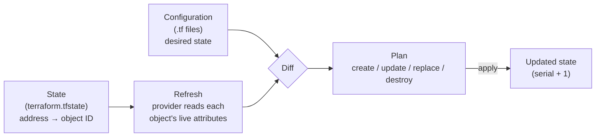
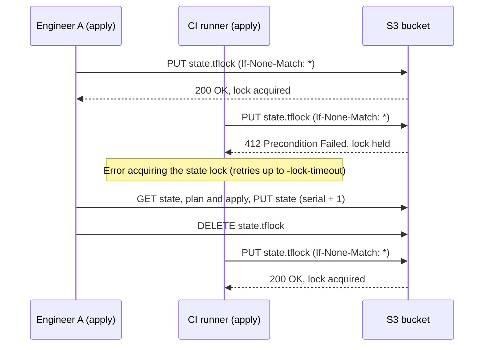
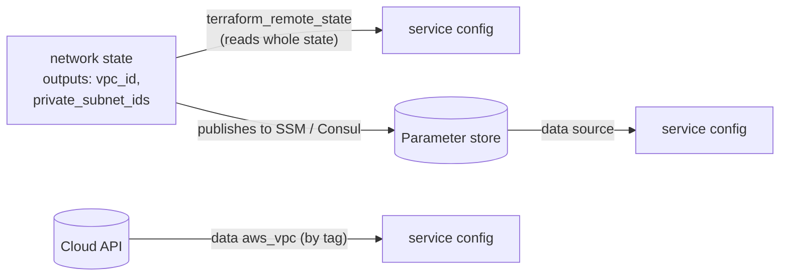
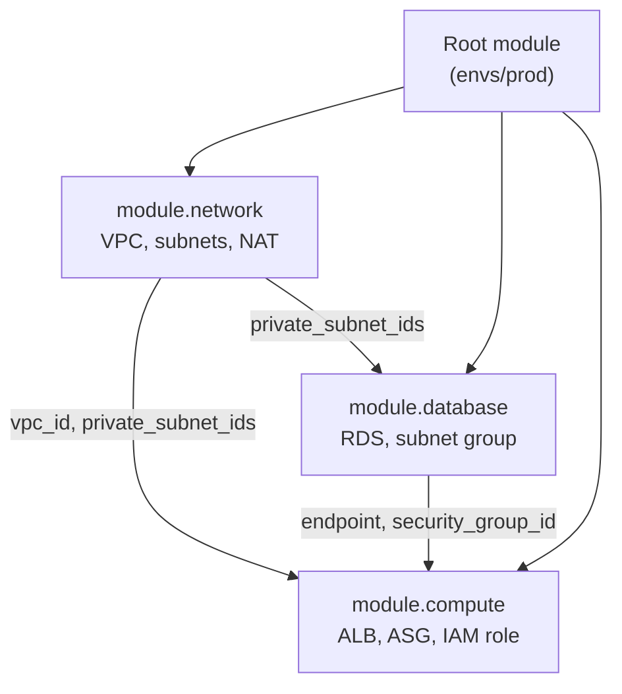

**State** is the record Terraform keeps of the real objects it manages; **modules** are the unit of reuse for configuration. This page covers how state participates in every plan, where to store it (backends and locking), how to change it safely (config-driven `moved`, `import`, and `removed` blocks, plus the `terraform state` CLI), keeping secrets out of it, workspaces, sharing data between configurations, and how to write, version, compose, and test modules. Content reflects Terraform 1.16 (current stable as of September 2026); version notes mark where features were introduced.

---

## How State Works

Terraform configuration describes *desired* infrastructure, but the configuration alone cannot say which real object a block corresponds to. If you `apply` a configuration that declares one EC2 instance and then apply it again, something must tell Terraform that instance `i-0abc…` already *is* `aws_instance.web`. That something is the state file: a JSON document mapping each resource address in configuration to the remote object's ID and last-known attributes.

Every `plan` combines three inputs:



1. **State** says which remote objects Terraform owns and where to find them.
2. **Refresh** asks each provider for the current attributes of those objects, surfacing *drift* (changes made outside Terraform).
3. **Configuration** is compared against the refreshed state; the difference is the plan.

### What the State File Contains

| Field | Purpose |
|-------|---------|
| `resources[].instances[]` | Resource address → provider object ID and all known attributes |
| Dependencies | Recorded per instance, so Terraform can destroy in the right order even after the configuration that declared the dependency is gone |
| `outputs` | Root-module output values (readable by other configurations) |
| `serial` | Incremented on every write; backends reject stale writes |
| `lineage` | UUID fixed when the state is created; prevents pushing one state over an unrelated one |
| `terraform_version`, provider schema versions | Used to upgrade state formats when tooling changes |

Two consequences follow. First, **state is authoritative for ownership**: a resource that is in AWS but not in state is invisible to Terraform, and deleting a state entry makes Terraform forget (not destroy) the object. Second, **state contains every attribute providers return, including secrets** — database passwords, generated keys, and tokens are stored in plaintext JSON unless kept out by the mechanisms in [Keeping Secrets Out of State](#keeping-secrets-out-of-state). Treat the state store as sensitive data.

Use `terraform plan -refresh-only` to see drift without proposing configuration changes, and `terraform apply -refresh-only` to accept the drifted values into state.

---

## Backends: Where State Lives

A **backend** determines where state is stored and whether it can be locked. The default `local` backend writes `terraform.tfstate` in the working directory, which is adequate only for experiments: it cannot be shared, has no locking, and is one `rm` away from loss.

| Aspect | Local backend | Remote backend (S3, GCS, azurerm, HCP Terraform) |
|--------|---------------|--------------------------------------------------|
| Sharing | One machine | Any authorized user or CI runner |
| Locking | Local process lock only | Distributed lock prevents concurrent writes |
| History / recovery | Manual backups (`terraform.tfstate.backup` keeps one) | Object versioning, point-in-time restore |
| Access control and encryption | Filesystem permissions | IAM / RBAC, encryption at rest (e.g. KMS) |
| Suitable for | Learning, throwaway experiments | Teams, CI/CD, anything long-lived |

Commonly used backends:

| Backend | Storage | Locking |
|---------|---------|---------|
| `s3` | Amazon S3 object | Native S3 lockfile (`use_lockfile`); DynamoDB table (deprecated) |
| `gcs` | Google Cloud Storage object | Built in |
| `azurerm` | Azure Blob Storage | Blob lease, built in |
| `cloud` block (HCP Terraform / Terraform Enterprise) | Managed | Built in, plus run queue, policy checks, and state history UI |
| `pg`, `consul`, `kubernetes`, `http` | Various | Backend-specific |

### S3 Backend with Native Locking

Since Terraform 1.11 the S3 backend can lock by writing a lock object next to the state file using S3 conditional writes, so no separate lock table is needed. DynamoDB-based locking (`dynamodb_table`) is **deprecated** and scheduled for removal in a future minor version; new configurations should use `use_lockfile`.

```hcl
terraform {
  required_version = ">= 1.11"

  backend "s3" {
    bucket       = "acme-terraform-state"
    key          = "prod/network/terraform.tfstate"
    region       = "us-east-1"
    encrypt      = true
    use_lockfile = true # writes prod/network/terraform.tfstate.tflock
  }
}
```

To migrate an existing DynamoDB-locked backend, set `use_lockfile = true` *alongside* `dynamodb_table` (both locks are acquired during the transition), run `terraform init -reconfigure`, and remove `dynamodb_table` once every user and pipeline runs a Terraform version that supports S3 locking.



If a process dies while holding a lock, release it with `terraform force-unlock <LOCK_ID>` — only after confirming no run is still in progress.

### Bootstrapping the State Bucket

The bucket that stores state must exist before any configuration can use it, so it is created by a small bootstrap configuration applied with local state, which is then optionally migrated into the bucket it created:

```hcl
resource "aws_s3_bucket" "state" {
  bucket = "acme-terraform-state"

  lifecycle {
    prevent_destroy = true
  }
}

resource "aws_s3_bucket_versioning" "state" {
  bucket = aws_s3_bucket.state.id
  versioning_configuration {
    status = "Enabled" # every state write is recoverable
  }
}

resource "aws_s3_bucket_server_side_encryption_configuration" "state" {
  bucket = aws_s3_bucket.state.id
  rule {
    apply_server_side_encryption_by_default {
      sse_algorithm = "aws:kms"
    }
  }
}

resource "aws_s3_bucket_public_access_block" "state" {
  bucket                  = aws_s3_bucket.state.id
  block_public_acls       = true
  block_public_policy     = true
  ignore_public_acls      = true
  restrict_public_buckets = true
}
```

After the first apply, add a `backend "s3"` block and run `terraform init -migrate-state` to copy the local state into the bucket.

### Backend Configuration Rules

- **No variables or expressions in `backend` blocks.** Backends are initialized before variables are evaluated. Supply environment-specific values with *partial configuration*: `terraform init -backend-config=backends/prod.s3.tfbackend`.
- **One state per blast radius.** Split state by environment and by component (network, data, compute) so a bad apply or a corrupted file affects one slice, plans stay fast, and IAM can restrict who may write production networking.
- **Never commit state to Git.** Add `*.tfstate`, `*.tfstate.*`, and `.terraform/` to `.gitignore`. Do commit `.terraform.lock.hcl`, the provider dependency lock file.

---

## Changing State Safely

Refactoring configuration — renaming a resource, moving it into a module, adopting something created by hand, handing something off to another tool — changes resource addresses. Without telling Terraform, a renamed resource looks like "destroy the old address, create the new one." Terraform offers two ways to express these changes.

**Config-driven blocks** (preferred) are written in `.tf` files, reviewed like code, shown in `plan`, and applied atomically with everything else. **CLI state commands** mutate state immediately and invisibly to reviewers; they remain useful for one-off repairs.

| Goal | Config-driven block | CLI equivalent |
|------|--------------------|----------------|
| Rename or move a resource / module | `moved { from, to }` (1.1) | `terraform state mv` |
| Adopt an existing remote object | `import { to, id }` (1.5; `for_each` in 1.7; allowed inside modules in 1.16) | `terraform import` |
| Stop managing an object without destroying it | `removed { from; lifecycle { destroy = false } }` (1.7) | `terraform state rm` |
| Inspect state | — | `terraform state list`, `terraform state show [-json]` |
| Back up / restore raw state | — | `terraform state pull` / `terraform state push` |
| Force re-creation | — | `terraform apply -replace=ADDRESS` (replaces the deprecated `taint`) |

### Renaming and Moving: `moved`

```hcl
# The resource used to be declared at the root as aws_instance.web
moved {
  from = aws_instance.web
  to   = module.webserver.aws_instance.main
}
```

The plan reports the object as moved, not replaced. Module authors should leave `moved` blocks in place for at least one release so that every caller's state is upgraded; removing them early turns the move back into a destroy-and-create for anyone who skipped a version.

### Adopting Existing Resources: `import`

```hcl
import {
  to = aws_s3_bucket.data
  id = "acme-legacy-data"
}
```

Running `terraform plan -generate-config-out=generated.tf` writes starter HCL for any import target that has no resource block yet. Review and tidy the generated code — it contains every attribute, including defaults — then apply. After the import succeeds the `import` block can be deleted or kept as documentation. Importing many objects is a `for_each` over a map:

```hcl
import {
  for_each = var.legacy_buckets # map: logical name => bucket name
  to       = aws_s3_bucket.legacy[each.key]
  id       = each.value
}
```

### Releasing Ownership: `removed`

```hcl
removed {
  from = aws_s3_bucket.archive

  lifecycle {
    destroy = false # forget the object, leave it running
  }
}
```

With `destroy = false` the bucket is dropped from state but continues to exist; without it (the default is `destroy = true`) Terraform destroys the object. This is the reviewable replacement for `terraform state rm`.

### Rules for Manual State Surgery

- Run `terraform state pull > backup.tfstate` before any CLI state command; with a versioned bucket you also have the previous object versions.
- Never edit the JSON by hand. If you must, bump `serial` and push with `terraform state push`, which refuses writes with a lower serial or different lineage unless forced.
- After any change, `terraform plan` should show **no changes** for the affected resources. Anything else means configuration and state disagree.

---

## Keeping Secrets Out of State

Because state stores every attribute, a password passed to `aws_db_instance.password` ends up in plaintext in the state file (and in plan files). Marking a variable `sensitive = true` only redacts it from CLI output — it is still persisted. Newer language features avoid persisting it at all:

| Mechanism | Since | Effect |
|-----------|-------|--------|
| `sensitive = true` on variables and outputs | Variables since 0.14 | Redacted in plan/apply output; **still stored** in state |
| Ephemeral input variables and outputs (`ephemeral = true`) | 1.10 | Value available during a run, never written to state or plan files |
| `ephemeral` resource blocks | 1.10 | Read a value (e.g. a secret from AWS Secrets Manager or Vault) for the duration of a run only |
| Write-only arguments (conventionally suffixed `_wo`, e.g. `password_wo`) | 1.11 | Provider receives the value; Terraform never stores it. Paired with a `*_wo_version` argument that you bump to trigger rotation |

```hcl
ephemeral "aws_secretsmanager_secret_version" "db" {
  secret_id = "prod/db/master"
}

resource "aws_db_instance" "main" {
  # ...
  password_wo         = ephemeral.aws_secretsmanager_secret_version.db.secret_string
  password_wo_version = 2 # increment to push a new password
}
```

Ephemeral values can only flow into other ephemeral contexts (write-only arguments, provider configuration, provisioners, other ephemeral values); Terraform rejects configurations that would persist them. Write-only support is per-argument, so check the provider documentation. Encrypting the backend at rest remains necessary in any case — OpenTofu, the open-source fork, additionally offers client-side state encryption (since OpenTofu 1.7).

---

## Workspaces

A **CLI workspace** is a named, separate state instance for the same configuration and backend. Every configuration starts in `default`.

```bash
terraform workspace new staging      # create and switch
terraform workspace select prod      # switch
terraform workspace list             # -json output since 1.16
terraform workspace show             # print current
```

With the S3 backend, non-default workspaces are stored under `env:/<workspace>/<key>` (the prefix is set by `workspace_key_prefix`). The current name is available as `terraform.workspace`:

```hcl
locals {
  instance_types = {
    dev     = "t3.micro"
    staging = "t3.small"
    prod    = "m7i.large"
  }
  # Indexing fails with "Invalid index" in an unexpected workspace,
  # which doubles as a guard against typos like `terraform workspace new prdo`.
  instance_type = local.instance_types[terraform.workspace]
}

resource "aws_s3_bucket" "data" {
  bucket = "${var.project}-${terraform.workspace}-data"
}
```

### Workspaces vs. Separate Root Modules

HashiCorp's own guidance is that CLI workspaces suit *temporary or near-identical* copies of infrastructure (a feature-branch environment, a load-test replica) and are **not** appropriate when environments need separate credentials, access controls, or meaningfully different configuration. Every workspace shares one backend and one set of credentials, and nothing on screen shows which workspace an `apply` targets.

| | CLI workspaces | Directory per environment | HCP Terraform workspaces |
|---|---|---|---|
| Configuration | Identical for all | Can differ; share code via modules | One config per workspace (or VCS path) |
| State isolation | Same backend, different key | Separate backends possible | Fully separate |
| Credentials / access control | Shared | Per directory / pipeline | Per workspace, with RBAC |
| Visibility of target env | Hidden (`terraform workspace show`) | Explicit in path | Explicit in UI and runs |
| Good for | Ephemeral or near-identical copies | Long-lived environments (dev/staging/prod) | Teams using HCP Terraform |

A common production layout is a directory per environment that calls shared modules:

```
infra/
├── modules/
│   ├── network/
│   └── service/
└── envs/
    ├── dev/      # main.tf calls ../../modules/*, backend key dev/...
    ├── staging/
    └── prod/     # separate backend, stricter IAM role
```

Note that *HCP Terraform workspaces* are a different concept from CLI workspaces: each one is a separate unit with its own state, variables, permissions, and run history, closer to the "directory per environment" column.

---

## Outputs and Sharing Data Between Configurations

**Outputs** expose values from a module. In a child module they are the module's return values; in a root module they are printed after `apply`, queryable with `terraform output [-json]`, and stored in state where other configurations can read them.

```hcl
output "private_subnet_ids" {
  description = "Private subnet IDs, one per AZ"
  value       = aws_subnet.private[*].id
}

output "db_endpoint" {
  description = "Writer endpoint of the primary database"
  value       = aws_db_instance.main.endpoint
  sensitive   = true # redacted in CLI output, still stored in state
}
```

Splitting infrastructure into several states (network, data, services) means later layers need values from earlier ones. The options, from tightest to loosest coupling:



| Method | How | Trade-off |
|--------|-----|-----------|
| `terraform_remote_state` data source | Reads the other configuration's root outputs from its backend | Simple, but the reader needs access to the **entire** state file (including its secrets) and is coupled to the producer's backend layout |
| Published values | Producer writes values to SSM Parameter Store, Consul, etc.; consumer reads with a data source | Consumer needs only read access to specific keys; producer can change backends freely |
| Provider data sources | Look up the object directly (`data "aws_vpc"` filtered by tag) | No coupling to Terraform at all; depends on consistent tagging |
| HCP Terraform `tfe_outputs` | Reads outputs only, not the full state | Requires HCP Terraform / Enterprise |

```hcl
data "terraform_remote_state" "network" {
  backend = "s3"
  config = {
    bucket = "acme-terraform-state"
    key    = "prod/network/terraform.tfstate"
    region = "us-east-1"
  }
}

resource "aws_instance" "app" {
  # ...
  subnet_id = data.terraform_remote_state.network.outputs.private_subnet_ids[0]
}
```

---

## Modules

A **module** is any directory of `.tf` files. The directory where you run Terraform is the **root module**; modules it calls with `module` blocks are **child modules**. A module behaves like a function: input variables are parameters, resources are the body, outputs are return values, and its internals are not addressable from outside.

### Why and When to Modularize

Modules pay off when the same *pattern* is deployed more than once (a service with its load balancer, alarms, and IAM role; a standard VPC) or when a platform team wants to encode guardrails — encryption on, public access off — so consumers cannot forget them. They cost indirection: every extra layer is another interface to version and another place to look during an incident.

- Extract a module when a pattern is genuinely reused or needs enforced defaults, not preemptively.
- Keep module trees shallow (root → a layer of composable modules), and prefer composition — passing one module's outputs into another at the root — over modules that call modules that call modules.
- A module that wraps a single resource and passes every argument through adds nothing; call the resource directly.

### Module Structure

```
modules/webserver/
├── main.tf        # resources
├── variables.tf   # inputs, with types, descriptions, validation
├── outputs.tf     # outputs
├── versions.tf    # required_version and required_providers
├── README.md      # usage; terraform-docs can generate the inputs/outputs tables
└── tests/
    └── webserver.tftest.hcl
```

**variables.tf** — type every input, describe it, and validate what you can:

```hcl
variable "name" {
  type        = string
  description = "Name tag and prefix for all resources"

  validation {
    condition     = can(regex("^[a-z][a-z0-9-]{2,30}$", var.name))
    error_message = "name must be 3-31 chars: lowercase letters, digits, hyphens."
  }
}

variable "instance_type" {
  type        = string
  description = "EC2 instance type"
  default     = "t3.micro"
}

variable "scaling" {
  description = "Auto Scaling settings"
  type = object({
    min     = number
    max     = number
    desired = optional(number) # optional attributes since 1.3
  })
  default = { min = 1, max = 2 }
}
```

**main.tf** — resources use the inputs:

```hcl
data "aws_ami" "al2023" {
  most_recent = true
  owners      = ["amazon"]
  filter {
    name   = "name"
    values = ["al2023-ami-*-x86_64"]
  }
}

resource "aws_instance" "web" {
  ami           = data.aws_ami.al2023.id
  instance_type = var.instance_type
  tags          = { Name = var.name }
}
```

**outputs.tf** and **versions.tf**:

```hcl
output "public_ip" {
  description = "Public IP of the web server"
  value       = aws_instance.web.public_ip
}
```

```hcl
terraform {
  required_version = ">= 1.7"
  required_providers {
    aws = {
      source  = "hashicorp/aws"
      version = ">= 5.0" # modules set a floor; root modules pin
    }
  }
}
```

A reusable module should declare the providers it needs but **not** contain `provider` blocks; configuration (region, credentials, assumed role) belongs to the root module and is inherited or passed explicitly.

### Calling Modules

```hcl
module "web" {
  source   = "./modules/webserver"
  for_each = { prod = "m7i.large", canary = "t3.small" } # module for_each since 0.13

  name          = "web-${each.key}"
  instance_type = each.value
}

# A module aliased to another region via an explicit provider mapping
module "web_dr" {
  source    = "./modules/webserver"
  providers = { aws = aws.us_west_2 }
  name      = "web-dr"
}

output "prod_ip" {
  value = module.web["prod"].public_ip
}
```

`count`, `for_each`, `depends_on`, and `providers` all work on `module` blocks. Referencing `module.web["prod"].public_ip` only exposes what the module declares as outputs.

### How Modules Compose

A root module wires child modules together, passing one module's outputs as another's inputs. Terraform builds a single dependency graph across all of them, so `module.compute` waits for the specific network values it references, not the whole network module.



### Module Sources and Versioning

| Source | `source` value | Versioning |
|--------|---------------|------------|
| Local path | `"./modules/vpc"` | Versioned with the calling repo |
| Public Terraform Registry | `"terraform-aws-modules/vpc/aws"` | `version = "~> 6.0"` |
| Private registry (HCP Terraform) | `"app.terraform.io/acme/vpc/aws"` | `version` constraint |
| Git (any host) | `"git::https://github.com/acme/tf-modules.git//vpc?ref=v1.4.0"` | Tag or commit in `ref` |
| GitHub shorthand | `"github.com/acme/tf-modules//vpc?ref=v1.4.0"` | Tag or commit in `ref` |
| S3 / GCS archive | `"s3::https://s3.amazonaws.com/acme-modules/vpc-1.4.0.zip"` | Encoded in the object key |

The `version` argument only works for registry sources; for Git sources pin with `?ref=`, ideally to a tag or full commit SHA. The `//subdir` syntax selects a directory within a repository. Run `terraform init -upgrade` to pick up newer versions allowed by a constraint.

```hcl
module "vpc" {
  source  = "terraform-aws-modules/vpc/aws"
  version = "~> 6.0" # any 6.x, never 7.0

  name            = "prod"
  cidr            = "10.0.0.0/16"
  azs             = ["us-east-1a", "us-east-1b", "us-east-1c"]
  private_subnets = ["10.0.1.0/24", "10.0.2.0/24", "10.0.3.0/24"]
  public_subnets  = ["10.0.101.0/24", "10.0.102.0/24", "10.0.103.0/24"]
}
```

Before adopting a community module, read its inputs and code, check release cadence and open issues, and confirm its provider constraints match yours. Well-maintained modules (the `terraform-aws-modules` collection, for example) save substantial effort; abandoned ones inherit their bugs into your infrastructure.

Module authors should follow semantic versioning: a removed variable, a renamed output, or a change that forces resource replacement is a **major** version, and address changes inside the module should ship with `moved` blocks.

### Testing Modules

`terraform test` (since 1.6) runs `*.tftest.hcl` files, each a sequence of `run` blocks that plan or apply the module and assert on the result. With `command = plan` and mocked providers (since 1.7) tests run without cloud credentials; with `command = apply` they create real infrastructure and destroy it afterwards.

```hcl
# tests/webserver.tftest.hcl
mock_provider "aws" {
  mock_data "aws_ami" {
    defaults = { id = "ami-0123456789abcdef0" }
  }
}

variables {
  name = "web-test"
}

run "uses_default_instance_type" {
  command = plan

  assert {
    condition     = aws_instance.web.instance_type == "t3.micro"
    error_message = "default instance type should be t3.micro"
  }
}

run "rejects_bad_names" {
  command = plan
  variables {
    name = "Bad_Name"
  }
  expect_failures = [var.name]
}
```

See [Enterprise Patterns](patterns.html) for testing levels beyond the module (policy checks, integration environments).

---

## Common Pitfalls

| Pitfall | Consequence | Remedy |
|---------|-------------|--------|
| State committed to Git | Secrets leaked in history; merge conflicts corrupt state | Remote backend; ignore `*.tfstate*` |
| No locking | Two concurrent applies interleave writes and lose resources from state | `use_lockfile = true` (S3) or a backend with built-in locking |
| One giant state for everything | Slow plans, huge blast radius, everyone needs admin | Split by environment and component |
| Unversioned state bucket | A bad write or deletion is unrecoverable | Enable bucket versioning |
| Renaming without `moved` | Plan destroys and re-creates the resource | Add a `moved` block |
| Secrets in resource arguments | Plaintext in state and plan files | Ephemeral values and write-only arguments |
| Unpinned module/provider versions | An upstream release silently changes infrastructure | Registry `version` constraints, Git `?ref=`, commit `.terraform.lock.hcl` |
| Premature or deep module nesting | Every change touches several layers and releases | Modularize reused patterns only; compose at the root |

---

## See Also

- [Core Concepts](core-concepts.html) — HCL, providers, variables, and the plan/apply cycle
- [Enterprise Patterns](patterns.html) — multi-account layouts, module governance, and infrastructure testing
- [Advanced Topics](advanced.html) — troubleshooting, state recovery, and policy as code
- [AWS Cloud Services](../aws/) — the services these examples provision
- [Kubernetes](../kubernetes/) — provisioning clusters and deploying workloads with Terraform
