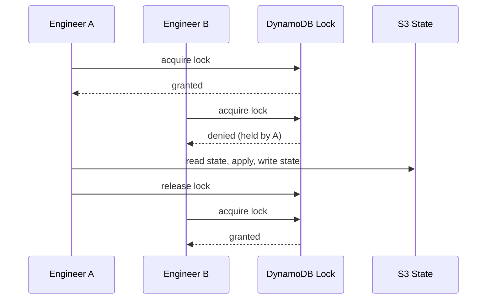
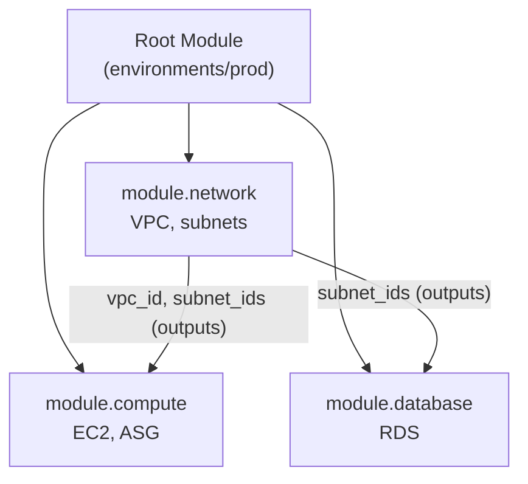

State is how Terraform tracks what it has created; modules are how you package configuration for reuse. This page covers both — local vs. remote state, state operations, workspaces, outputs, and writing and consuming modules.

## Understanding Terraform State

State is arguably Terraform's most important concept. Before diving into the technical details, consider the following scenario:

You run `terraform apply` and create an EC2 instance. The next day, you run it again. How does Terraform know the instance already exists and should not create a duplicate?

The answer is **state**. Terraform maintains a JSON file that records what it created, allowing it to compare your configuration against reality.

### What State Tracks

| Information | Why It Matters |
|-------------|----------------|
| Resource IDs | Links configuration to real infrastructure |
| Attribute values | Detects configuration drift |
| Dependencies | Determines update and deletion order |
| Metadata | Provider versions, schema information |

### Why State Matters

Without state, Terraform would:
- Create duplicate resources on every apply
- Not know which resources to update or delete
- Lose track of resources entirely

With state, Terraform can:
- **Calculate minimal changes** - Only modify what is different
- **Detect drift** - Alert when someone changes infrastructure outside Terraform
- **Enable collaboration** - Teams share state to avoid conflicts

---

## Local vs Remote State

By default, Terraform stores state in a local file called `terraform.tfstate`. This works fine for learning, but becomes problematic when teams collaborate.

### Comparing State Storage Options

| Aspect | Local State | Remote State |
|--------|-------------|--------------|
| **Storage** | `terraform.tfstate` file | S3, Azure Blob, GCS, etc. |
| **Collaboration** | Single user only | Multiple team members |
| **Locking** | None | Prevents concurrent changes |
| **Backup** | Manual | Automatic versioning |
| **Security** | File permissions only | Encryption, access controls |
| **Best for** | Learning, experiments | Teams, production |

### When to Use Each

**Use local state when:**
- Learning Terraform
- Personal projects with no collaboration
- Quick experiments

**Use remote state when:**
- Working in a team
- Managing production infrastructure
- Needing audit trails or encryption
- Running Terraform in CI/CD pipelines

### Setting Up Remote State (AWS Example)

Remote state requires two things: storage (S3 bucket) and locking (DynamoDB table).

```hcl
# Configure S3 backend with locking
terraform {
  backend "s3" {
    bucket         = "my-terraform-state"
    key            = "prod/terraform.tfstate"
    region         = "us-east-1"
    dynamodb_table = "terraform-locks"
    encrypt        = true
  }
}
```

**Setting up the infrastructure for remote state:**

```hcl
# Create state bucket (run this separately first)
resource "aws_s3_bucket" "state" {
  bucket = "my-terraform-state"
}

resource "aws_dynamodb_table" "locks" {
  name         = "terraform-locks"
  billing_mode = "PAY_PER_REQUEST"
  hash_key     = "LockID"

  attribute { name = "LockID", type = "S" }
}
```

**Important:** Create the S3 bucket and DynamoDB table before configuring the backend. You cannot use Terraform to create its own state storage (chicken-and-egg problem).

<div class="notice--info">
  <p><strong>DynamoDB is no longer the only option for locking.</strong> Since Terraform 1.10 (and GA in 1.11), the S3 backend supports native S3 lockfiles via <code>use_lockfile = true</code>, which stores a lock object alongside the state file. This lets you drop the separate DynamoDB lock table entirely — set <code>use_lockfile = true</code> in the <code>backend "s3"</code> block instead of <code>dynamodb_table</code>.</p>
</div>

The diagram below shows why remote state with locking is essential for teams: the lock table serializes concurrent `apply` runs so two engineers can never corrupt the state file at the same time.



---

## Common State Operations

As your infrastructure evolves, you will need to manipulate state directly. Here are the most common scenarios:

### State Commands Quick Reference

| Command | Purpose | Example |
|---------|---------|---------|
| `terraform state list` | Show all resources | See what Terraform manages |
| `terraform state show` | Inspect a resource | Debug configuration issues |
| `terraform state mv` | Rename/move resources | Refactoring without recreating |
| `terraform state rm` | Remove from state | Adopt existing resources |
| `terraform import` | Add existing resource | Bring unmanaged resources under control |

### Moving Resources Between States

When refactoring, you might need to move resources between configurations:

```bash
# Rename a resource
terraform state mv aws_instance.old aws_instance.new

# Move to a module
terraform state mv aws_instance.web module.webserver.aws_instance.main
```

### Importing Existing Resources

Have infrastructure created outside Terraform? Import it:

```bash
# Import an existing S3 bucket
terraform import aws_s3_bucket.data my-existing-bucket
```

**Tip:** After importing, run `terraform plan` to ensure your configuration matches the actual resource.

---

## Terraform Workspaces

Workspaces let you deploy the same configuration multiple times with separate state files. Think of them as parallel environments sharing the same code.

### When to Use Workspaces

Consider the following scenario: You want to deploy identical infrastructure for dev, staging, and production. Workspaces let you do this without duplicating configuration files.

```bash
# Create workspaces for each environment
terraform workspace new dev
terraform workspace new staging
terraform workspace new production

# Switch between them
terraform workspace select dev
terraform apply  # Deploys to dev

terraform workspace select production
terraform apply  # Deploys to production (separate state)
```

### Workspaces vs Separate Directories

| Approach | Workspaces | Separate Directories |
|----------|------------|---------------------|
| **Configuration** | Shared | Can differ per environment |
| **State** | Separate per workspace | Separate per directory |
| **Complexity** | Lower | Higher |
| **Flexibility** | Lower | Higher |
| **Best for** | Identical environments | Different configurations |

**Use workspaces when:** Environments are nearly identical and differ only by size or count.

**Use separate directories when:** Environments have different resources, modules, or significant configuration differences.

### Making Configuration Workspace-Aware

Use `terraform.workspace` to customize based on current workspace:

```hcl
locals {
  instance_types = {
    dev        = "t3.micro"
    staging    = "t3.small"
    production = "m5.large"
  }
}

resource "aws_instance" "app" {
  instance_type = local.instance_types[terraform.workspace]

  tags = {
    Environment = terraform.workspace
  }
}
```

### Workspace Best Practices

1. **Use consistent naming**: Include workspace in resource names to avoid conflicts
2. **Validate workspace names**: Prevent typos from creating unexpected environments
3. **Consider cost**: Non-production workspaces can use smaller, cheaper resources

```hcl
# Example: consistent naming with workspace
resource "aws_s3_bucket" "data" {
  bucket = "${var.project}-${terraform.workspace}-data"
}
```

---

## Outputs

Outputs expose values from your Terraform configuration. They serve two purposes:

1. **Display information** after apply (e.g., the IP address of a newly created server)
2. **Share data** between Terraform configurations via remote state

### Defining Outputs

```hcl
output "bucket_arn" {
  description = "ARN of the S3 bucket"
  value       = aws_s3_bucket.data.arn
}

output "database_endpoint" {
  description = "Database connection string"
  value       = aws_db_instance.main.endpoint
  sensitive   = true  # Hide in console output
}
```

### Reading Outputs from Other Configurations

Use `terraform_remote_state` to access outputs from another Terraform configuration:

```hcl
# Read outputs from the networking configuration
data "terraform_remote_state" "network" {
  backend = "s3"
  config = {
    bucket = "my-terraform-state"
    key    = "network/terraform.tfstate"
    region = "us-east-1"
  }
}

# Use the VPC ID from the other configuration
resource "aws_instance" "app" {
  subnet_id = data.terraform_remote_state.network.outputs.private_subnet_id
}
```

This pattern is useful for splitting large configurations into smaller, manageable pieces while maintaining connections between them.

---

## Terraform Modules

Modules are reusable packages of Terraform configuration. Think of them as functions for infrastructure: they accept inputs (variables), create resources, and return outputs.

### Why Use Modules?

Consider the following situation: You have copied your VPC configuration to 10 different projects. Now you need to change the subnet configuration. Without modules, you update 10 files. With modules, you update once.

**Benefits of modules:**
- **Reusability**: Write once, use everywhere
- **Consistency**: Same configuration across environments
- **Maintainability**: Update in one place, propagate everywhere
- **Encapsulation**: Hide complexity behind a simple interface

### Creating Your First Module

A module is simply a directory with Terraform files. Here is a simple web server module:

```
modules/
  webserver/
    main.tf       # Resources
    variables.tf  # Inputs
    outputs.tf    # Outputs
```

**modules/webserver/variables.tf:**
```hcl
variable "instance_type" {
  default = "t3.micro"
}
variable "name" {
  type = string
}
```

**modules/webserver/main.tf:**
```hcl
resource "aws_instance" "web" {
  ami           = "ami-12345678"
  instance_type = var.instance_type
  tags          = { Name = var.name }
}
```

**modules/webserver/outputs.tf:**
```hcl
output "public_ip" {
  value = aws_instance.web.public_ip
}
```

### Using Modules

Call your module from any configuration:

```hcl
module "web_prod" {
  source        = "./modules/webserver"
  name          = "production-web"
  instance_type = "m5.large"
}

module "web_dev" {
  source = "./modules/webserver"
  name   = "dev-web"
  # Uses default t3.micro
}

output "prod_ip" {
  value = module.web_prod.public_ip
}
```

### Module Sources

Modules can come from various locations:

| Source | Example | Best For |
|--------|---------|----------|
| Local path | `./modules/vpc` | Development, organization-specific |
| GitHub | `github.com/org/module` | Shared across teams |
| Terraform Registry | `hashicorp/vpc/aws` | Community modules |
| S3/GCS | `s3::https://bucket.s3.amazonaws.com/module.zip` | Private modules |

```hcl
# From Terraform Registry (version pinned)
module "vpc" {
  source  = "terraform-aws-modules/vpc/aws"
  version = "5.0.0"

  name = "my-vpc"
  cidr = "10.0.0.0/16"
}
```

### When to Create vs Use Existing Modules

**Create your own modules when:**
- You have organization-specific requirements
- You need tight control over configuration
- Existing modules are too complex or simple

**Use community modules when:**
- They match your requirements closely
- They are well-maintained (check stars, recent updates)
- You want to benefit from community best practices

The [Terraform Registry](https://registry.terraform.io/) has thousands of modules for common infrastructure patterns.

### How Modules Compose

A root module wires together child modules, passing outputs from one as inputs to another. The diagram shows a typical environment composing reusable network, compute, and database modules:



Each module is a self-contained directory of `.tf` files with its own variables (inputs) and outputs. The same network module can be reused across dev, staging, and prod with different variable values.

<div class="notice--warning">
  <h4>Common Pitfalls</h4>
  <ul>
    <li><strong>Committing state to git:</strong> <code>terraform.tfstate</code> contains secrets in plaintext and causes merge conflicts. Always use a remote backend and add it to <code>.gitignore</code>.</li>
    <li><strong>No state locking:</strong> Without locking, two concurrent applies can corrupt state. Enable locking on the S3 backend — either a DynamoDB lock table or the native S3 lockfile (<code>use_lockfile</code>, GA since Terraform 1.11).</li>
    <li><strong>Editing state by hand:</strong> Use <code>terraform state mv/rm/import</code> rather than editing the JSON. Manual edits are easy to get wrong and hard to undo.</li>
    <li><strong>Over-modularizing early:</strong> Premature abstraction makes simple changes painful. Extract a module only once you genuinely reuse the pattern.</li>
  </ul>
</div>

## Key Takeaways

- **State is the source of truth.** Terraform compares your config against state to compute a minimal change set. Protect it like production data.
- **Remote state for teams.** Store state in S3/GCS/Azure Blob with locking so collaborators never overwrite each other.
- **Modules are reusable patterns.** Package infrastructure into modules with clear inputs and outputs, then compose them per environment.
- **Manipulate state safely.** Use `terraform state` subcommands and `import` rather than hand-editing the JSON file.

---

## See Also

- [Core Concepts](core-concepts.html) - HCL, providers, and the plan/apply workflow
- [Enterprise Patterns](patterns.html) - Multi-region, compliance, and testing at scale
- [Advanced Topics](advanced.html) - Meta-programming and Policy as Code
- [AWS Cloud Services](../aws/) - The infrastructure Terraform commonly provisions
- [Kubernetes](../kubernetes/) - Provision clusters and deploy with Terraform

