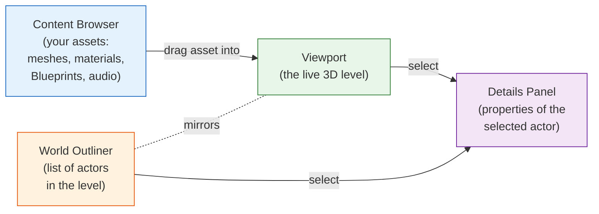
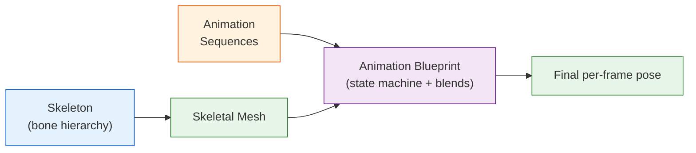

<div class="hero-section" style="background: linear-gradient(135deg, #4facfe 0%, #00f2fe 100%); color: white; padding: 3rem 2rem; margin: -2rem -3rem 2rem -3rem; text-align: center;">
  <h1 style="color: white; margin: 0; font-size: 2.5rem;">Unreal Engine</h1>
  <p style="font-size: 1.25rem; margin-top: 1rem; opacity: 0.9;">UE5 game development with Nanite, Lumen, and Blueprints</p>
</div>

<!-- Custom styles are now loaded via main.scss -->

<div class="intro-card">
  <p class="lead-text">Unreal Engine is a real-time 3D creation platform from Epic Games. Born for games, it now powers film virtual production, architecture, and automotive design. Unreal Engine 5 introduced <strong>Nanite</strong> virtualized geometry and <strong>Lumen</strong> dynamic global illumination, removing two of the oldest technical ceilings in real-time rendering. This guide covers UE5 from core editor concepts to advanced systems.</p>
</div>

<div class="key-insights">
  <div class="insight-card">
    <i class="fas fa-cubes"></i>
    <h4>Nanite</h4>
    <p>Film-quality geometry with no manual LODs</p>
  </div>
  <div class="insight-card">
    <i class="fas fa-lightbulb"></i>
    <h4>Lumen</h4>
    <p>Fully dynamic global illumination, no lightmap baking</p>
  </div>
  <div class="insight-card">
    <i class="fas fa-project-diagram"></i>
    <h4>Blueprints</h4>
    <p>Visual scripting alongside C++</p>
  </div>
</div>

<div class="notice--info" markdown="1">
**Scope of this page.** This is an Unreal-specific reference. The engine-agnostic
foundations of game development — the [game loop and state-machine architecture, ECS-vs-OOP, and core design principles](../gamedev/) — live in the
[Game Development hub](../gamedev/), interactive [Audio Design](../gamedev/audio-design.html) is covered there, and [AI in Games](../ai-ml/game-ai.html) covers pathfinding, behavior trees, and decision-making independent of engine. Here we focus on how Unreal Engine 5 *implements* and accelerates those ideas: Nanite, Lumen, the editor and gameplay framework, Blueprints, and MetaSounds.
</div>

## Advantages of Unreal Engine 5 over Unreal Engine 4

Unreal Engine 5, released in 2022 and updated on a roughly quarterly cadence, builds on UE4's architecture while removing several long-standing technical ceilings. The headline shift is that two tasks artists used to spend most of their time on — authoring LODs for geometry and baking lightmaps for static lighting — are now handled automatically by Nanite and Lumen. The table below summarizes where UE5 departs from UE4; each feature is detailed in the sections that follow.

| Area | Unreal Engine 4 | Unreal Engine 5 |
|------|-----------------|-----------------|
| Geometry detail | Manual LODs, polygon budgets | Nanite virtualized geometry (millions+ of polys) |
| Global illumination | Baked lightmaps or limited dynamic GI | Lumen fully dynamic GI and reflections |
| Large worlds | Manual level streaming volumes | World Partition automatic streaming |
| Physics | PhysX | Chaos (default, ~3x faster, deterministic) |
| Upscaling | Vendor-specific (DLSS/FSR) | Temporal Super Resolution (TSR), platform-agnostic |
| Shadows | Cascaded shadow maps | Virtual Shadow Maps (consistent, high-res) |

### Nanite Virtualized Geometry

Nanite is a virtualized micropolygon geometry system. Instead of loading a mesh at a fixed level of detail, it streams and renders only the triangles that contribute to the current frame — often clustering them down to roughly pixel-sized detail. This decouples the polygon count of the *source* asset from the cost of *rendering* it.

- **Source-quality assets, no manual LODs**: Import a multi-million-triangle photogrammetry scan or ZBrush sculpt and use it directly. Nanite generates its own internal hierarchy, so artists stop hand-authoring discrete LOD chains.
- **Cost scales with screen pixels, not triangles**: Because Nanite renders at roughly one triangle per pixel, a 10-million-triangle statue and a 1-million-triangle one cost about the same on screen when they fill the same area.
- **Built-in compression and streaming**: Mesh data is stored in a compressed, page-based format and paged in on demand, keeping memory bounded even for dense scenes.

Nanite has limits worth knowing: as of UE5.x it targets opaque and masked static geometry best. Skeletal meshes, deforming geometry, translucency, and very thin geometry (foliage, hair) gained support gradually across releases and may still fall back to traditional rendering — check the version you target.

### Lumen Global Illumination

Lumen is a real-time global illumination (GI) and reflections system. Traditional engines either baked indirect light into static lightmaps (accurate but unable to change at runtime) or used limited dynamic approximations. Lumen computes bounce lighting and reflections every frame, so lighting reacts immediately to moving objects, changing materials, and time-of-day shifts.

- **No lightmap bake step**: Artists place lights and see final-quality indirect lighting interactively, removing one of the longest iteration bottlenecks in UE4.
- **Two tracing paths**: Lumen uses a fast software ray tracing path that runs on a wide range of GPUs, and an optional hardware ray tracing path (RTX/equivalent) for sharper reflections and more accurate results at higher cost.
- **Reflections included**: The same system produces dynamic reflections, replacing much of the manual reflection-capture workflow.

Lumen trades some performance and precision for that flexibility, so fixed scenes or low-end and mobile targets may still prefer baked lighting.

### World Partition

World Partition replaces UE4's manual level-streaming volumes with an automatic, grid-based streaming system. The world is divided into cells; the engine loads and unloads cells based on what the player can see and reach.

- **Large worlds without manual streaming setup**: Designers build in a single continuous world rather than stitching sublevels together by hand.
- **One File Per Actor (OFPA)**: Each actor is saved to its own file, so multiple team members can edit the same region simultaneously without locking or merge-conflicting a monolithic level file.
- **Data Layers and HLODs**: Data Layers toggle sets of actors (for example, a "destroyed city" variant) at runtime, while automatically generated Hierarchical LODs render distant cells cheaply before they fully stream in.

### Chaos Physics and Chaos Destruction

Unreal Engine 5 features a mature and optimized version of the Chaos Physics system, now the default physics engine. Key improvements include:

1. **Enhanced Performance**: 3x faster simulation performance compared to UE4's PhysX
2. **Deterministic Simulation**: Reproducible physics across different hardware
3. **Advanced Destruction**: 
   - Hierarchical fracturing with multiple destruction levels
   - Real-time concrete, glass, and wood material simulations
   - Destruction that affects navigation and AI pathfinding
4. **Vehicle Physics 2.0**: Complete overhaul with better tire model and suspension
5. **Cloth Simulation**: GPU-accelerated cloth with self-collision
6. **Fluid Simulation**: Basic fluid dynamics for water and liquids

### Additional UE5 Innovations (2023-2024)

#### Substrate Material System
An experimental, layer-based material framework offered alongside the traditional shading models (not yet a wholesale replacement):
- Composable layers instead of a single fixed shading model
- Better expression of complex surfaces (clear coat, thin-film iridescence)
- Adopt deliberately while it remains experimental

#### Temporal Super Resolution (TSR)
UE5's built-in temporal upscaler:
- Renders at a lower internal resolution and reconstructs a sharper image
- Platform-agnostic — runs on any DirectX 12 / Vulkan GPU, unlike vendor-specific DLSS/FSR
- Helps hit 4K-class output on mid-range hardware

#### Virtual Shadow Maps (VSM)
Revolutionary shadow rendering:
- Consistent, high-resolution shadows at any distance
- No more shadow cascades or LOD popping
- 16K equivalent shadow resolution

#### Mass Entity System
For massive crowd simulations:
- Simulate 100,000+ entities in real-time
- Used in Matrix Awakens demo
- Integrated with World Partition

#### MetaSounds
Procedural audio system:
- Node-based audio synthesis (a sound-design graph, much like Niagara for VFX)
- Real-time parameter modulation driven by gameplay
- Can reduce reliance on large pre-rendered audio files by generating sound at runtime

## Getting Started with Unreal Engine 5

### System Requirements

**Minimum Requirements:**
- OS: Windows 10/11 64-bit, macOS Big Sur, Ubuntu 22.04
- Processor: Quad-core Intel or AMD, 2.5 GHz
- Memory: 16 GB RAM
- Graphics: DirectX 12 or Vulkan compatible GPU with 4GB VRAM
- Storage: 100 GB available space (SSD recommended)

**Recommended for UE5:**
- Processor: 6+ core CPU (Intel i7/i9, AMD Ryzen 7/9)
- Memory: 32-64 GB RAM
- Graphics: NVIDIA RTX 3070 or better / AMD RX 6700 XT or better
- Storage: NVMe SSD with 500 GB available

### Installation and Setup

1. Download the [Epic Games Launcher](https://www.unrealengine.com/download)
2. Sign in with your Epic Games account (free)
3. Navigate to the Unreal Engine tab
4. Click "Install Engine" and select UE5.3 or later
5. Choose components:
   - **Starter Content**: Recommended for beginners
   - **Templates**: Game, Film, Architecture templates
   - **Target Platforms**: Select your deployment platforms

### Creating Your First UE5 Project

When you launch the editor, the **Project Browser** lets you start from a template and a small set of choices. The table below summarizes what to pick and why:

| Choice | Options | Guidance |
|--------|---------|----------|
| Template | First Person, Third Person, Top Down, Vehicle, VR | Pick the camera/control scheme closest to your game; you can change later |
| Project type | Blueprint or C++ | Start in Blueprint to learn; choose C++ if you already plan custom systems (you can add C++ to a Blueprint project anytime) |
| Target platform | Desktop, Mobile, Console | Sets default scalability and feature defaults (mobile disables some Nanite/Lumen features) |
| Quality preset | Scalable or Maximum | "Maximum" enables Nanite/Lumen by default; "Scalable" targets lower-end hardware |
| Starter Content | On / Off | Handy meshes and materials for prototyping; leave off for a clean shipping project |

After choosing, name the project and click **Create**. The editor opens directly into the template level.

## Unreal Editor Overview

The Unreal Editor is where you build levels, manage assets, and wire up game logic. Four panels do most of the work, and they are linked: select an actor in the Viewport or Outliner, and the Details panel updates to show its properties.



| Panel | What it shows | What you do there |
|-------|---------------|-------------------|
| **Viewport** | The live 3D level | Navigate, place and transform actors, preview lighting and gameplay |
| **Content Browser** | Every asset in the project | Import, organize, and drag assets into the level |
| **World Outliner** | A searchable list of actors in the current level | Select, group, and filter objects — invaluable in dense scenes |
| **Details** | Properties of the selected actor | Edit transforms, components, and exposed Blueprint variables |

### Actors, Components, and the Level

Everything you place in a level is an **Actor**. An actor by itself does little; its behavior and appearance come from the **Components** attached to it (a Static Mesh Component to render geometry, a Collision Component for physics, an Audio Component for sound). A character, for example, is an actor composed of a skeletal mesh component, a capsule collision component, a camera, and a movement component. Understanding this actor-plus-components model is the key to reading any Unreal project.

## Level Design in UE5

Level design in Unreal Engine 5 has been revolutionized with new tools and workflows that streamline the creative process.

### Modeling Mode
UE5 includes built-in modeling tools, eliminating the need to switch between external 3D applications:
- **PolyEdit**: Direct mesh manipulation
- **TriEdit**: Triangle-level editing
- **Deform**: Soft selection and deformation
- **Transform**: Advanced pivot editing
- **Bake**: Convert instances to static mesh

### Static Meshes with Nanite
Enabling Nanite on a Static Mesh is a short workflow:

1. Import the high-poly mesh (millions of triangles is fine)
2. Enable **Nanite** in the mesh's settings (right-click the asset → *Nanite* → *Enable*)
3. No LODs to author — Nanite builds and streams detail automatically
4. Use the original ZBrush sculpt or photogrammetry scan directly, without a separate optimization pass

### Enhanced Landscape System
The Landscape system now features:
- **Non-destructive layers**: Paint and blend multiple materials
- **Landscape splines**: Create roads and rivers that deform terrain
- **Water system integration**: Automatic ocean and river generation
- **Runtime Virtual Texturing**: Massive texture resolution
- **World Partition integration**: Infinite landscape sizes

### PCG (Procedural Content Generation)
The PCG framework (stable from UE5.2 onward) builds content from rules rather than hand placement. A typical forest-scattering graph chains nodes together inside a PCG Volume:

1. **Surface Sampler** — generate candidate points across the landscape inside the volume
2. **Density Filter / noise** — thin the points so distribution looks natural rather than uniform
3. **Transform nodes** — randomize scale and rotation per point
4. **Static Mesh Spawner** — instance trees (or any mesh) at the surviving points

Because the graph is rule-based, changing one parameter (density, mesh set, slope cutoff) regenerates the whole forest instantly, and the same graph can populate any landscape.

### Foliage 2.0
Enhanced foliage system with:
- **Nanite foliage**: Extremely detailed vegetation
- **Procedural placement rules**: Biome-aware distribution
- **LOD-free rendering**: Consistent quality at any distance
- **Interactive foliage**: Physics-enabled grass and bushes

## Materials and Textures

A **material** is a shader that tells the renderer how a surface responds to light. In Unreal you author materials visually in the **Material Editor** by wiring nodes into the inputs of the main material node. Unreal uses a physically based rendering (PBR) model, so the core inputs map to real-world surface properties.

| Material input | Controls | Typical texture |
|----------------|----------|-----------------|
| **Base Color** | The surface's albedo (its "flat" color) | Color/diffuse map |
| **Metallic** | Whether the surface behaves like metal (0 = dielectric, 1 = metal) | Metallic mask |
| **Roughness** | How sharp or blurred reflections are (0 = mirror, 1 = matte) | Roughness map |
| **Normal** | Fine surface detail without extra geometry | Normal map |
| **Emissive** | Light the surface emits on its own | Emissive map |
| **Ambient Occlusion** | Soft contact shadows baked into crevices | AO map |

### Textures

Textures are the 2D images feeding those inputs. Beyond color maps, the workhorses are **normal maps** (encode surface bumps in RGB), **packed masks** (roughness, metallic, and AO stored in separate channels of one texture to save memory), and **height/displacement maps**. Keeping channels packed and resolutions appropriate is one of the simplest performance wins in a project.

### Material Instances

Authoring one material per variation is wasteful. Instead, expose parameters on a **parent material** (a color, a roughness scalar, a texture slot) and create lightweight **Material Instances** that only override those values. A single "painted metal" parent can spawn red, blue, and rusted instances with no extra shader compilation — instances change parameters, not the shader graph. This is the standard way to keep both iteration speed and runtime cost low.

### Substrate (Experimental)

UE5 is introducing **Substrate**, a more flexible material framework that replaces the fixed shading-model dropdown with composable layers (for example, a clear coat over metal, or thin-film iridescence). It is powerful for complex surfaces but remains experimental across recent releases — adopt it deliberately, not by default.

## Lighting

Lighting is an essential aspect of any game, as it helps set the mood, atmosphere, and visual quality. Unreal Engine provides several lighting types, such as **Directional Lights**, **Point Lights**, **Spot Lights**, and **Sky Lights**. Each describes *where* light comes from; how that light bounces and fills a scene is handled by the global illumination system.

<div class="tip-card" markdown="1">
#### Lumen Changes the Lighting Workflow
In UE4, indirect light from these sources was typically *baked* into lightmaps — accurate, but static and slow to iterate on. With Lumen enabled (the UE5 default), the same lights produce real-time bounce lighting and reflections that update instantly as you move objects or change the time of day. The practical consequence: you place lights and immediately see the final result, with no bake step. Baked lighting still exists for fixed scenes or low-end hardware where the runtime cost of Lumen is too high.
</div>

### Light Types

Each light type describes a different shape of emission. You combine them to build a believable scene — typically one directional "sun," a sky light for fill, and point/spot lights for local sources.

| Light type | Emission shape | Typical use | Notes |
|------------|----------------|-------------|-------|
| **Directional** | Parallel rays from infinity | The sun or moon | One per scene usually; drives the main shadows |
| **Point** | All directions from a point | Bulbs, torches, lamps | Cost scales with radius and shadow casting |
| **Spot** | A cone | Flashlights, stage spots, headlights | Inner/outer cone angles control falloff |
| **Rect (Area)** | A rectangular surface | Softboxes, windows, screens | Soft, area-shaped highlights and shadows |
| **Sky** | Ambient from the surrounding sky/HDRI | Outdoor fill, bounced ambient | Captures the environment for indirect lighting |

**Mobility matters as much as type.** A light set to *Static* is baked into lightmaps (cheapest, but cannot move), *Stationary* bakes indirect light while keeping dynamic shadows, and *Movable* is fully dynamic (most flexible, most expensive). With Lumen enabled, Movable lights produce real-time indirect bounce without any bake.

## Animation and Characters

Animating a character in Unreal flows through a small chain of assets, each building on the last:

1. **Skeletal Mesh** — a model bound to a **Skeleton** (a hierarchy of bones). Deforming the bones deforms the mesh.
2. **Animation Sequences** — individual recorded clips (idle, walk, jump) authored in a DCC tool or captured from motion data.
3. **Animation Blueprint** — the runtime brain. A **state machine** decides which animation should play (idle → walk → run → jump), and a **blend space** smoothly mixes clips based on inputs like speed and direction.
4. **Physics Asset** — collision capsules around the bones, enabling ragdoll physics and physical hit reactions.



UE5 also ships **Control Rig** (build rigs and procedural animation directly in-engine) and **Motion Matching** (UE5.4+), which picks the best-fitting pose from an animation database each frame instead of relying on hand-built state machines — yielding more natural movement with less manual transition wiring.

## Particles and Effects

Visual effects — fire, smoke, sparks, magic — are built in **Niagara**, UE5's node-based particle system (it superseded the older Cascade system). Niagara is organized as a hierarchy you can mix and reuse:

| Concept | Role |
|---------|------|
| **System** | The complete effect (for example, an explosion) |
| **Emitter** | One source of particles within the system (debris, smoke, sparks) |
| **Module** | A stackable behavior on an emitter (spawn rate, initial velocity, gravity, color over life, collision) |

Two features make Niagara flexible: it can run particle simulation on the **GPU** for huge counts (millions of particles), and emitters can read data from the world or from each other, so effects can react to gameplay (sparks that bounce off real geometry, smoke that follows wind). Reusable behavior is packaged into **Niagara Modules** so an effects team builds a library once and reuses it across systems.

## Audio: MetaSounds

The general theory of game audio — mixing buses, distance attenuation, occlusion, the listener model, and adaptive/interactive scoring — is engine-agnostic and covered in [Audio Design](../gamedev/audio-design.html). This section focuses on what is **specific to Unreal**, where that theory is implemented through imported **Sound Waves**, attenuation/spatialization settings, and the **Sound Cue** and **MetaSound** graphs that drive them. MetaSounds are UE5's headline audio feature and the reason to reach for Unreal over a hand-rolled pipeline.

### MetaSounds

**MetaSounds** are UE5's node-based **procedural audio** system — a programmable digital signal processing graph that runs per-voice at audio rate. Rather than playing back a fixed `.wav`, a MetaSound *synthesizes and modulates* audio at runtime, so it can react continuously to gameplay:

- **Sample-accurate, audio-rate graphs**: Oscillators, filters, envelopes, and samplers wired together, evaluated on the audio thread with no buffer-boundary glitches — the same conceptual leap Niagara brought to VFX.
- **Gameplay-driven inputs**: Expose parameters (engine RPM, wind speed, health) as graph inputs and set them from Blueprint or C++. The classic example is an engine sound whose pitch and timbre track RPM rather than crossfading between recorded loops.
- **Generative content**: Procedural ambience, footstep variation, and weapon layers can be built from a handful of samples plus synthesis, shrinking the audio memory budget versus shipping many pre-rendered files.
- **Presets and inheritance**: A MetaSound Source can be subclassed into presets that only override exposed parameters, mirroring the Material Instance pattern.

MetaSounds are the modern successor to most of what **Sound Cues** did. Sound Cues still exist and remain fine for simple randomize-and-attenuate playback, but new procedural and adaptive audio work in UE5 belongs in MetaSounds.

### Spatialization and attenuation in Unreal

Attach a **Sound Wave**, **Sound Cue**, or **MetaSound** to an actor via an **Audio Component** to give it a world position, then drive 3D falloff with an **Attenuation** asset (distance curve, spread, optional binaural/HRTF spatialization plugin). These are Unreal's concrete handles on the general spatial-audio concepts described in the [Audio Design](../gamedev/audio-design.html) page.

## Blueprints in UE5

Blueprints remain the cornerstone of Unreal Engine's accessibility, but UE5 has significantly enhanced the visual scripting system with new features and optimizations that rival traditional code performance.

### Enhanced Blueprint Features

#### Blueprint Interfaces and Inheritance
- **Multiple inheritance support**: Blueprints can now implement multiple interfaces
- **Abstract Blueprint classes**: Define base functionality for child Blueprints
- **Blueprint subsystems**: Create modular, reusable systems

#### Performance and the Blueprint–C++ Tradeoff

Blueprint runs on a virtual machine, so per-node execution carries overhead that compiled C++ does not. The practical rule is unchanged: keep gameplay flow and rapid iteration in Blueprint, and move tight loops or math-heavy code to C++.

Note that **Blueprint Nativization** (the UE4 feature that auto-converted Blueprints to C++ at cook time) was deprecated and **removed in UE5** — it caused build and maintenance problems. The modern approach is to author hot paths as C++ functions and call them from Blueprint, rather than relying on automatic conversion.

#### New Node Categories in UE5

UE5 added node families for its new systems:

- **Smart Object Interaction** — declarative interaction points actors can claim and use
- **State Tree** — a hierarchical alternative to Behavior Trees for AI and general logic
- **Geometry Script** — procedural mesh generation and editing in Blueprint
- **PCG** — procedural content generation graphs
- **Mass Entity** — data-oriented nodes for large crowd/agent simulations

### Types of Blueprints

There are several types of Blueprints available in Unreal Engine, each with its specific use case and functionality:

1. **Blueprint Class**: A reusable template that defines the behavior and appearance of an object in your game, such as a character, weapon, or pickup item.
2. **Level Blueprint**: A unique Blueprint that's specific to a level and contains level-specific logic, such as scripted events or triggers.
3. **Animation Blueprint**: A special type of Blueprint that manages character animations and transitions between different animation states.
4. **Widget Blueprint**: A type of Blueprint used to create and manage user interface (UI) elements, such as menus, HUDs, and in-game UIs.

### Blueprint Editor

The Blueprint Editor is the primary tool used to create and edit Blueprint scripts. It consists of several panels and windows, including the **Graph Editor**, **My Blueprint**, **Viewport**, and **Details** panel.

#### Graph Editor

The Graph Editor is the main workspace where you'll create and edit Blueprint scripts using nodes connected by wires. It provides a visual representation of your game logic, making it easy to understand and modify.

### Nodes

Nodes are the building blocks of a Blueprint script, representing functions, variables, events, and flow control structures. There are several types of nodes available in Unreal Engine, including:

1. **Function Nodes**: Perform specific operations or tasks, such as spawning an actor, applying damage, or calculating the distance between two points.
2. **Variable Nodes**: Store and retrieve data, such as numbers, text, or references to other objects.
3. **Event Nodes**: Respond to specific events in your game, such as button presses, collisions, or timers.
4. **Flow Control Nodes**: Control the flow of execution in your script, such as branching, looping, or delaying execution.

### Creating Blueprint Scripts

To create a Blueprint script, you'll need to follow these steps:

1. **Add Nodes**: Drag and drop nodes from the context menu or My Blueprint panel onto the Graph Editor.
2. **Connect Nodes**: Connect the output pin of one node to the input pin of another node using wires. This defines the order of execution and the flow of data between nodes.
3. **Set Properties**: Customize the properties of your nodes using the Details panel, such as setting default values for variables or adjusting function parameters.
4. **Test Your Blueprint**: Compile your Blueprint to check for errors, and then test it in the game using the Play button.

### Debugging Blueprints

Blueprints provide several tools for debugging and testing your scripts, including breakpoints, step-by-step execution, and real-time visualization of variable values.

1. **Breakpoints**: Set breakpoints on nodes to pause execution and inspect the current state of your script.
2. **Step-by-Step Execution**: Use the step-by-step execution controls to advance through your script one node at a time, observing the flow of execution and data between nodes.
3. **Real-Time Visualization**: Enable real-time visualization of variable values in the Graph Editor, allowing you to see how data changes during script execution.
4. **Print String**: Use the Print String node to output messages to the screen or log, which can be helpful for tracking the execution of your script and verifying the values of variables.

### Blueprint Communication

Communication between Blueprints is a critical aspect of creating complex and interactive game logic. Unreal Engine provides several methods for Blueprint communication, including:

1. **Direct Function Calls**: Call functions or access variables directly from one Blueprint to another if you have a reference to the target Blueprint.
2. **Blueprint Interfaces**: Define a set of functions that can be implemented by multiple Blueprints, allowing you to create standardized communication without relying on specific Blueprint types.
3. **Event Dispatchers**: Create custom events that can be bound to multiple listeners, allowing you to create a flexible and decoupled communication system.
4. **Global Variables**: Store data in global variables accessible from any Blueprint in your project, useful for sharing data between multiple Blueprints.

### Best Practices for UE5 Blueprints

#### Performance Optimization
1. **Use C++ for Heavy Computation**: Blueprints for logic flow, C++ for math-heavy operations
2. **Event-Driven Architecture**: Use event dispatchers instead of tick events
3. **Object Pooling**: Reuse actors instead of spawning/destroying
4. **Async Loading**: Use soft object references for large assets
5. **Profile First**: Use Unreal Insights and Blueprint profiler

#### Code Architecture

Unreal's gameplay framework gives each responsibility a home. Knowing where logic belongs keeps projects maintainable as they grow:

```text
GameMode (server-authoritative rules; exists only on the server)
├── PlayerController  → handles a player's input and possession
├── GameState         → replicates match-wide state to all clients
├── PlayerState       → replicates per-player data (score, name)
└── GameInstance      → persists across level loads (settings, sessions)
    └── SaveGame       → serialized progress written to disk
```

#### Blueprint Communication Patterns
1. **Direct Communication**: Use cast only when relationship is guaranteed
2. **Interface Communication**: Decouple Blueprints with interfaces
3. **Event Dispatchers**: One-to-many communication
4. **Blueprint Function Libraries**: Shared utility functions
5. **Subsystems**: Game-wide services and managers

#### Version Control Best Practices
- Use **Blueprint Diff Tool** for comparing versions
- Enable **One File Per Actor** for better merging
- Avoid circular dependencies
- Use **Redirectors** when renaming assets

### Advanced Blueprint Techniques

#### Async Gameplay Programming

Long-running gameplay (an ability that charges over several frames, a load-and-then-act sequence) should not block the game thread. The async toolkit:

- **Latent action nodes** (Delay, Move To, Timelines) yield control and resume later without freezing the frame
- **Gameplay Tasks** wrap multi-frame operations into cancellable units, used heavily by the Gameplay Ability System
- **Async asset loading** via soft references streams large assets in the background
- **Event Dispatchers** deliver the result back when the work completes, keeping callers decoupled

#### Data-Driven Design
- **Data Tables**: CSV/JSON imported game data
- **Data Assets**: Scriptable object patterns
- **Curve Tables**: Animation and gameplay curves
- **Composite Data Tables**: Inherited data structures

#### Debugging Tools
- **Visual Logger**: Record and playback gameplay
- **Gameplay Debugger**: Real-time state inspection
- **Blueprint Debugger**: Step through execution
- **Console Commands**: Custom debug commands

By mastering these advanced Blueprint techniques and following modern best practices, you can create professional-quality games that perform well and are maintainable by teams. The improvements in UE5 make Blueprints more powerful than ever, blurring the line between visual scripting and traditional programming.

## Unreal Engine 5.4 and Beyond

This guide targets UE5.3/5.4. Later releases (UE5.5 and UE5.6) continue to advance these systems, with further Nanite and Lumen improvements and the introduction of **MegaLights** for handling large numbers of dynamic, shadow-casting lights at lower cost. Confirm feature status against the release notes for the version you target.

### Latest Features in UE5.4

#### Motion Matching
A data-driven animation approach that reduces reliance on hand-built state machines:
- Selects the best-fitting pose from an animation database each frame
- Produces smoother transitions with far less manual blend wiring
- Shipped as a production-ready sample in UE5.4

#### Nanite Tessellation
Adds displacement to Nanite surfaces, so geometry can carry fine, dynamic detail (cracks, terrain deformation) driven by a height map rather than baked into the mesh. As with any added detail, it has a runtime cost — budget it like any other rendering feature.

#### Neural Network Compression
Machine-learning-assisted compression for assets such as textures, aiming to shrink download and memory footprint while preserving quality. It is an evolving area — measure quality and size on your own content rather than assuming a fixed ratio.

#### Procedural Content Generation Framework
The PCG framework can scale from scattering foliage to generating whole environments. A city-generation graph, for instance, chains rules together:

1. Define building Blueprints and a palette of block types
2. Lay out a road network from spline or grid rules
3. Drive building density and height from sampled maps
4. Spawn buildings procedurally along the blocks
5. Re-run the graph at runtime when inputs change

Because the output is rule-driven, designers tune parameters instead of placing thousands of meshes by hand.

### Platform-Specific Optimizations

#### PlayStation 5
- Kraken texture compression integration
- Tempest 3D audio support
- DualSense haptic feedback blueprints
- Hardware ray tracing optimizations

#### Xbox Series X/S
- DirectStorage 1.2 support
- Velocity Architecture integration
- Smart Delivery automation
- Variable Rate Shading 2.0

#### PC Gaming
- NVIDIA DLSS 4 with Ray Reconstruction
- AMD FSR 3.1+ integration
- Intel XeSS support
- DirectX 12 Ultimate features

#### Mobile and AR/VR
- Vulkan mobile renderer improvements
- Apple Vision Pro support
- Meta Quest 3 optimization presets
- Mobile Lumen (simplified GI for mobile)

### Industry Applications Beyond Gaming

#### Virtual Production
- LED volume calibration tools
- Real-time camera tracking
- Color management pipeline
- Remote collaboration features

#### Architecture and Design
- Path tracing for photorealistic renders
- IFC file import for BIM workflows
- Datasmith updates for CAD software
- VR presentation templates

#### Automotive
- ADAS visualization tools
- Real-time ray tracing for car configurators
- Physics-accurate material library
- HMI prototyping framework

#### Film and Animation
- USD (Universal Scene Description) support
- Motion capture retargeting
- Facial animation improvements
- Sequencer timeline enhancements

### Resources and Community

#### Official Resources
- **Unreal Learning Platform**: Free courses with certificates
- **Unreal Engine Documentation**: Comprehensive guides
- **Epic Dev Community**: Forums and discussion boards
- **Unreal Marketplace**: Free monthly assets

#### YouTube Channels
- Unreal Sensei (Blueprints mastery)
- William Faucher (Cinematics)
- Virtus Learning Hub (Complete courses)
- Epic Games official channel

#### Books and Courses
- "Unreal Engine 5 Game Development" (2024 Edition)
- "Blueprints Visual Scripting Mastery"
- "Real-Time Rendering with UE5"
- Udemy/Coursera specialized tracks

### Direction of Travel

Epic has signaled several directions for the engine, though exact timing shifts release to release — treat these as trends rather than promises:

- **Verse programming language**: Epic's new language, first shipped in Fortnite/UEFN, is being extended toward broader Unreal use as a complement to Blueprints and C++.
- **UEFN (Unreal Editor for Fortnite)**: A cloud-backed, collaborative authoring environment that previews where Unreal's editing and publishing workflows are heading.
- **Continued Nanite and Lumen maturation**: Each release widens what Nanite supports (skeletal meshes, foliage, tessellation) and improves Lumen quality and cost.
- **ML-assisted tooling**: Neural network texture/asset compression and ML-driven animation (such as Motion Matching) point toward more data-driven content pipelines.

<div class="notice--info" markdown="1">
Always confirm feature status against the [official roadmap](https://portal.productboard.com/epicgames/) and release notes for the specific UE version you target — experimental features can change or be deprecated between releases.
</div>

### Conclusion

Unreal Engine 5 represents not just an incremental upgrade but a paradigm shift in real-time 3D creation. With technologies like Nanite and Lumen removing traditional technical barriers, creators can focus on their vision rather than optimization. The engine's expansion beyond gaming into film, architecture, automotive, and other industries demonstrates its versatility and power.

Unreal Engine continues to push the boundaries of what's possible in real-time rendering, making previously impossible creative visions achievable on consumer hardware. Whether you're an indie developer, a AAA studio, or a professional in another industry, UE5 provides the tools to bring your ideas to life with unprecedented fidelity and performance.

## Key Takeaways

<div class="takeaway-grid">
  <div class="takeaway-card">
    <h4>Nanite removes the polygon ceiling</h4>
    <p>Virtualized geometry streams only the detail each frame needs, so film-quality source assets render directly — no manual LODs.</p>
  </div>
  <div class="takeaway-card">
    <h4>Lumen makes lighting fully dynamic</h4>
    <p>Real-time global illumination and reflections react to scene changes instantly, eliminating lightmap baking.</p>
  </div>
  <div class="takeaway-card">
    <h4>World Partition scales open worlds</h4>
    <p>Automatic streaming and One File Per Actor let large teams build vast worlds and merge changes without manual level volumes.</p>
  </div>
  <div class="takeaway-card">
    <h4>Blueprints and C++ are complementary</h4>
    <p>Use Blueprints for logic flow and rapid iteration, C++ for heavy computation; move hot paths to C++ (Blueprint nativization was removed in UE5).</p>
  </div>
  <div class="takeaway-card">
    <h4>UE5 reaches far beyond games</h4>
    <p>Virtual production, architecture, automotive, and film all rely on the same real-time pipeline and USD/Datasmith interchange.</p>
  </div>
  <div class="takeaway-card">
    <h4>Profile before optimizing</h4>
    <p>Unreal Insights and the Blueprint profiler reveal real bottlenecks — event-driven design and object pooling beat guesswork.</p>
  </div>
</div>

## See Also

<div class="see-also-card">
  <h4>Related pages</h4>
  <ul>
    <li><a href="../gamedev/">Game Development hub</a> — engine-agnostic foundations: game loop, ECS-vs-OOP, state machines, and design principles that underpin any engine, including Unreal</li>
    <li><a href="../gamedev/audio-design.html">Audio Design</a> — the general theory behind MetaSounds: mixing, attenuation, occlusion, and adaptive scoring</li>
    <li><a href="../ai-ml/game-ai.html">AI in Games</a> — pathfinding, behavior trees, and decision-making that Unreal's State Tree and Smart Objects build on</li>
    <li><a href="../graphics/3d-rendering.html">3D Graphics</a> — the rendering pipeline behind Nanite and Lumen</li>
    <li><a href="../vr-ar/">Virtual Reality</a> — VR development with Unreal</li>
    <li><a href="../optimization/">Performance Optimization</a> — profiling and optimization techniques</li>
  </ul>
</div>

